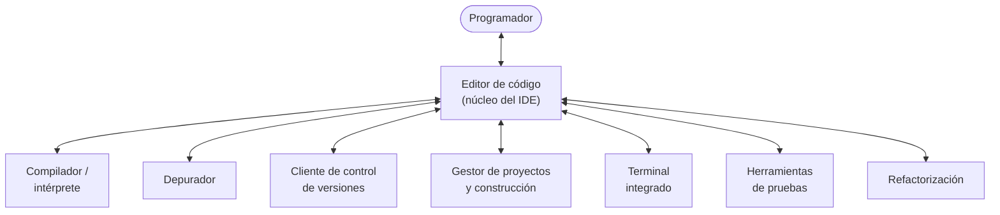
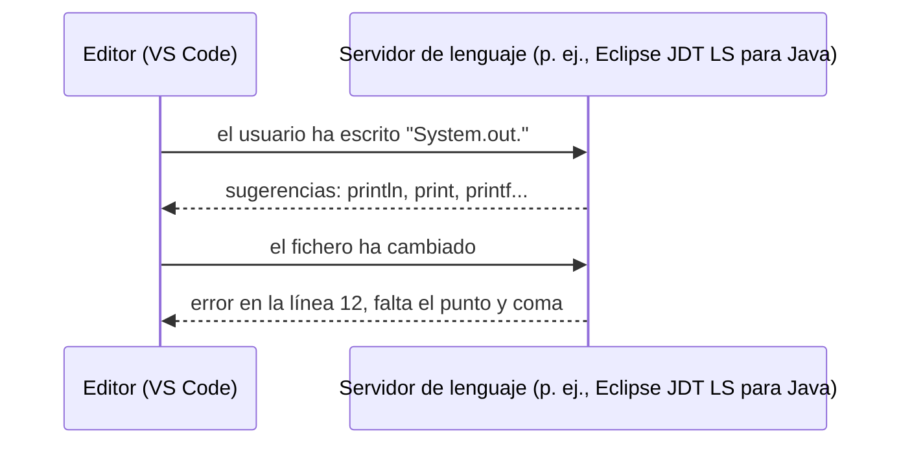
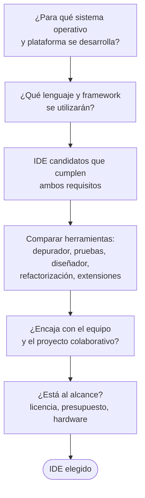
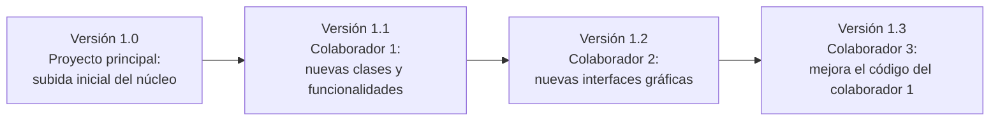
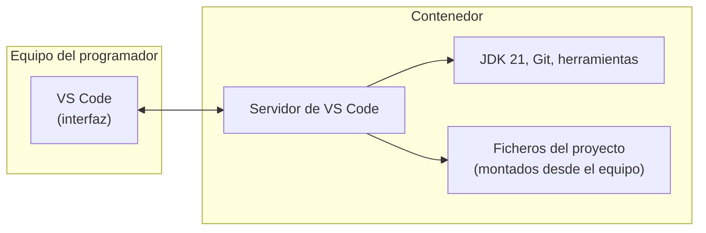

---
tags:
  - entornos-de-desarrollo
  - DAM1
  - ide
  - vscode
unidad: 2
tema: Entornos de desarrollo integrados — características, criterios de elección, uso y configuración (VS Code, Visual Studio, Dev Containers)
---

# Unidad 2. Entornos de desarrollo integrados

> [!abstract] Objetivos de la unidad
> - Definir qué es un entorno de desarrollo integrado (IDE) e identificar sus componentes.
> - Distinguir entre un editor de código, un editor extensible y un IDE completo.
> - Explicar cómo funcionan las ayudas a la codificación: autocompletado, inspección, fragmentos de código y servidores de lenguaje.
> - Aplicar criterios razonados para elegir un IDE según el sistema operativo, el lenguaje, las herramientas y la licencia.
> - Utilizar un gestor de proyectos o herramienta de construcción (Make, Gradle, `dotnet`) para compilar un proyecto.
> - Instalar, configurar y personalizar Visual Studio Code para trabajar con Java, C/C++, Python y C#.
> - Configurar un proyecto con los ficheros `settings.json`, `tasks.json`, `launch.json` y fragmentos de código propios.
> - Describir qué es un contenedor y cómo se utiliza para crear entornos de desarrollo reproducibles (Dev Containers).

---

## 1. Introducción

En la [[01 Desarrollo de software|Unidad 1]] se compilaron y ejecutaron programas escribiendo órdenes en un terminal (`gcc`, `javac`, `java`, `dotnet`). Todo el desarrollo de software podría hacerse así: con un editor de texto y un compilador. Sin embargo, sería como subir al noveno piso de un edificio por las escaleras teniendo ascensor: posible, pero mucho más lento e incómodo.

Un **entorno de desarrollo integrado** reúne en una sola aplicación todas las herramientas que el programador necesita y hace que se comuniquen entre sí: el editor sabe qué errores ha detectado el compilador, el depurador sabe en qué línea del editor está detenido el programa y el cliente de control de versiones sabe qué ficheros se han modificado. Esa **integración** es su verdadero valor.

---

## 2. Concepto y características de un IDE

### 2.1. Definición

> [!note] Definición: entorno de desarrollo integrado (IDE)
> Programa informático (*Integrated Development Environment*) cuyo objetivo es asistir al programador en el diseño, la codificación, la depuración y el mantenimiento del *software*, mediante la inclusión de múltiples herramientas destinadas a dichas tareas.

Conviene distinguir tres tipos de herramientas, porque la frontera entre ellas se ha difuminado:

| Tipo | Descripción | Ejemplos |
|---|---|---|
| Editor de texto / código | Edita ficheros de texto, con resaltado de sintaxis. No compila ni depura por sí mismo. | Bloc de notas, Notepad++, Vim, nano |
| Editor extensible | Editor ligero que se convierte en un entorno completo al añadirle **extensiones** para cada lenguaje. | **Visual Studio Code**, Sublime Text, Zed |
| IDE completo | Incluye de serie todas las herramientas para uno o varios lenguajes concretos. | Visual Studio, IntelliJ IDEA, Eclipse, NetBeans, PyCharm, Android Studio |

> [!info] ¿Es Visual Studio Code un IDE?
> Técnicamente, VS Code es un editor de código extensible. Con las extensiones adecuadas (depurador, soporte de lenguaje, pruebas, control de versiones) ofrece las mismas funciones que un IDE, por lo que en la práctica se utiliza como tal. **No debe confundirse con Visual Studio**, que es un IDE completo distinto, del mismo fabricante.

### 2.2. Componentes

El material presenta los componentes básicos de todo IDE: editor de texto, compilador, intérprete, depurador y cliente (de control de versiones). A ellos se suman otras herramientas habituales:



| Componente | Función | Se estudia en |
|---|---|---|
| Editor de código | Escribir el código con resaltado de sintaxis, autocompletado y detección de errores en tiempo real. | Esta unidad |
| Compilador / intérprete | Traducir o ejecutar el código. Muchos IDE **no lo incluyen**: utilizan el que esté instalado en el sistema (JDK, `gcc`, Python, .NET SDK). | [[01 Desarrollo de software\|Unidad 1]] |
| Depurador | Ejecutar el programa de forma controlada, paso a paso, inspeccionando variables. | [[04 Depuración y análisis de código\|Unidad 4]] |
| Cliente de control de versiones | Registrar los cambios, compartirlos y recuperar versiones anteriores. | [[03 Control de versiones con Git\|Unidad 3]] |
| Gestor de proyectos y construcción | Organizar los ficheros, las dependencias y las opciones de compilación. | Esta unidad |
| Terminal integrado | Ejecutar órdenes sin salir del entorno. | Esta unidad |
| Herramientas de pruebas | Ejecutar pruebas unitarias y mostrar sus resultados. | [[05 Diseño y ejecución de pruebas\|Unidad 5]] |
| Refactorización | Reestructurar el código de forma automática y segura (renombrar, extraer métodos…). | [[06 Refactorización\|Unidad 6]] |

### 2.3. Asistencia a la codificación

Además de las herramientas básicas, un IDE aporta funciones que aumentan la productividad. Una de las más útiles es el **autocompletado de código** junto con la **inspección** de clases y objetos. En Visual Studio y en VS Code esta herramienta se llama **IntelliSense**.

| Función | Qué hace |
|---|---|
| Autocompletado | Sugiere nombres de variables, métodos y clases mientras se escribe (`Ctrl+Espacio` para forzarlo). |
| Información de parámetros | Muestra qué parámetros espera un método y su documentación. |
| Detección de errores en tiempo real | Subraya los errores de compilación antes de compilar. |
| Correcciones rápidas | Propone soluciones a un error (importar una clase, crear un método que no existe…). |
| Navegación | Ir a la definición de un símbolo, buscar todas sus referencias, ver la jerarquía de clases. |
| Refactorización automática | Renombrar un símbolo en todo el proyecto, extraer un método, etc. |
| Fragmentos de código (*snippets*) | Insertar plantillas de código reutilizable (véase el apartado 2.4). |
| Formateo | Ordenar sangrías y espacios según unas reglas de estilo. |

#### 2.3.1. Cómo funciona: los servidores de lenguaje

Un editor como VS Code admite decenas de lenguajes sin conocer ninguno de ellos. Lo consigue gracias al **protocolo de servidor de lenguaje**.

> [!note] Definición: Language Server Protocol (LSP)
> Protocolo estándar, creado por Microsoft en 2016, mediante el cual un editor se comunica con un **servidor de lenguaje**: un programa independiente que analiza el código de un lenguaje concreto y responde a peticiones como «¿qué se puede autocompletar aquí?» o «¿dónde está definido este método?».



| Lenguaje | Servidor de lenguaje habitual |
|---|---|
| Java | Eclipse JDT Language Server (incluido en la extensión de Java de Red Hat) |
| C / C++ | clangd, o el motor de la extensión C/C++ de Microsoft |
| Python | Pylance / Pyright |
| C# | Roslyn (incluido en C# Dev Kit) |

> [!important] Consecuencia práctica
> Gracias al LSP, el mismo servidor de lenguaje puede usarse desde VS Code, Vim, Neovim, Zed u otros editores. Por eso las funciones de autocompletado de un lenguaje son prácticamente las mismas en todos ellos.

> [!info] Asistentes de inteligencia artificial
> Los IDE actuales integran asistentes basados en modelos de lenguaje (GitHub Copilot, JetBrains AI Assistant y otros) que sugieren líneas o bloques completos de código. Son una ayuda valiosa, pero sus sugerencias deben revisarse siempre: pueden compilar y, aun así, ser incorrectas.

### 2.4. Fragmentos de código (*snippets*)

> [!note] Definición: fragmento de código (*snippet*)
> Plantilla de código reutilizable que se inserta escribiendo un prefijo corto y pulsando `Tab` o `Intro`. Puede contener huecos que el programador rellena a continuación.

Ejemplos incluidos en los entornos habituales:

| Entorno | Prefijo | Resultado |
|---|---|---|
| VS Code + extensiones de Java | `main` | `public static void main(String[] args) { }` |
| VS Code + extensiones de Java | `sysout` | `System.out.println();` |
| Visual Studio (C#) | `cw` + `Tab` `Tab` | `Console.WriteLine();` |
| Visual Studio (C#) | `prop` + `Tab` `Tab` | Propiedad automática `public int MyProperty { get; set; }` |

La mayoría de entornos permiten **crear fragmentos propios**. En VS Code se definen en ficheros JSON desde *Archivo > Preferencias > Configurar fragmentos de código* (*File > Preferences > Configure Snippets*). Pueden ser globales (para el usuario) o de proyecto (fichero `.code-snippets` dentro de la carpeta `.vscode`).

```json
{
    "Clase con main": {
        "scope": "java",
        "prefix": "clasemain",
        "body": [
            "package ${1:conversor};",
            "",
            "public class ${TM_FILENAME_BASE} {",
            "    public static void main(String[] args) {",
            "        $0",
            "    }",
            "}"
        ],
        "description": "Clase pública con método main"
    }
}
```

| Elemento | Significado |
|---|---|
| `prefix` | Texto que activa el fragmento. |
| `scope` | Lenguajes en los que está disponible. |
| `body` | Líneas del código que se inserta. |
| `$1`, `$2`… | Posiciones del cursor, en el orden en que se recorren con `Tab`. |
| `${1:conversor}` | Posición 1 con un texto por defecto. |
| `$0` | Posición final del cursor. |
| `${TM_FILENAME_BASE}` | Variable: nombre del fichero sin extensión. Hay otras, como `${CURRENT_YEAR}`. |

Al escribir `clasemain` en un fichero `Demo.java` y aceptar la sugerencia, se obtiene:

```java
package conversor;

public class Demo {
    public static void main(String[] args) {
        // aquí queda el cursor ($0)
    }
}
```

### 2.5. Configuración y personalización

La labor principal de un IDE es facilitar el trabajo del programador; por ello los IDE son altamente configurables. La configuración permite, entre otras cosas:

- añadir, quitar y reorganizar ventanas, paneles y barras de herramientas;
- crear atajos de teclado y comandos personalizados;
- cambiar el tema, la tipografía y las reglas de formato;
- mantener **configuraciones distintas según la tarea**: por ejemplo, una distribución de ventanas para programar y otra para depurar.

> [!tip] Perfiles en VS Code
> VS Code permite crear **perfiles** (*Profiles*): conjuntos independientes de configuración, extensiones y atajos. Resulta útil tener, por ejemplo, un perfil «Java» y otro «Python», de modo que cada uno solo cargue las extensiones que necesita.

#### 2.5.1. Atajos de teclado esenciales en VS Code

Estos atajos corresponden a Windows y Linux; en macOS se sustituye `Ctrl` por `Cmd` y `Alt` por `Option`. La lista completa se consulta con `Ctrl+K Ctrl+S`.

| Atajo | Acción |
|---|---|
| `Ctrl+Shift+P` (o `F1`) | **Paleta de comandos**: acceso a cualquier función escribiendo su nombre |
| `Ctrl+P` | Abrir rápidamente un fichero por su nombre |
| `Ctrl+,` | Abrir la configuración |
| `` Ctrl+` `` | Mostrar u ocultar el terminal integrado |
| `Ctrl+B` | Mostrar u ocultar la barra lateral |
| `Ctrl+Espacio` | Forzar las sugerencias de autocompletado |
| `Ctrl+.` | Correcciones rápidas |
| `F12` / `Shift+F12` | Ir a la definición / buscar todas las referencias |
| `F2` | Renombrar un símbolo en todo el proyecto |
| `Ctrl+/` | Comentar o descomentar la línea |
| `Alt+↑` / `Alt+↓` | Mover la línea actual |
| `Ctrl+D` | Seleccionar la siguiente aparición de la palabra (edición múltiple) |
| `Alt+Clic` | Añadir un cursor adicional |
| `Shift+Alt+F` (Windows) / `Ctrl+Shift+I` (Linux) | Dar formato al documento |
| `Ctrl+\` | Dividir el editor |
| `Ctrl+Shift+B` | Ejecutar la tarea de compilación por defecto |
| `F5` / `Ctrl+F5` | Iniciar con depuración / sin depuración |
| `F9` | Poner o quitar un punto de interrupción |

#### 2.5.2. El fichero `settings.json`

Toda la configuración de VS Code se guarda en ficheros JSON. Se puede editar mediante la interfaz gráfica (`Ctrl+,`) o directamente en el fichero (paleta de comandos: *Preferences: Open User Settings (JSON)*).

| Nivel | Ubicación | Alcance |
|---|---|---|
| Usuario | Windows: `%APPDATA%\Code\User\settings.json`; Linux: `~/.config/Code/User/settings.json`; macOS: `~/Library/Application Support/Code/User/settings.json` | Todos los proyectos |
| Espacio de trabajo | `.vscode/settings.json` dentro de la carpeta del proyecto | Solo ese proyecto |

> [!important] Prioridad
> La configuración del **espacio de trabajo prevalece** sobre la del usuario. Así, un proyecto puede fijar sus propias reglas (codificación, formato, rutas) y cualquier miembro del equipo que lo abra las aplicará automáticamente.

```jsonc
{
    // Aspecto y edición
    "editor.fontSize": 15,
    "editor.formatOnSave": true,
    "editor.rulers": [100],
    "files.encoding": "utf8",
    "files.autoSave": "afterDelay"
}
```

> [!info] JSON con comentarios
> Los ficheros de configuración de VS Code admiten comentarios (`//`), algo que el JSON estándar no permite. Este formato se denomina JSONC (*JSON with Comments*).

---

## 3. Criterios de elección de un IDE

### 3.1. Sistema operativo

Es uno de los criterios más restrictivos. Hay que tener en cuenta **en qué sistema operativo se va a trabajar** y, sobre todo, **para qué sistema operativo se va a desarrollar**.

- Si el programa se ejecuta sobre una máquina virtual (Java, .NET), el sistema de destino importa poco: el mismo *bytecode* funciona en todos.
- Si se genera código nativo (C, C++), se desarrolla para un sistema concreto. Esta restricción no se debe al IDE, sino al **compilador** que utiliza. Se resuelve compilando el código fuente con un compilador del otro sistema (compilación cruzada), siempre que exista.
- El propio IDE puede estar disponible solo en algunos sistemas: Visual Studio, por ejemplo, solo existe para Windows (Visual Studio para Mac se retiró en 2024), mientras que VS Code, IntelliJ IDEA o Eclipse funcionan en Windows, Linux y macOS.

### 3.2. Lenguaje de programación y *framework*

Un IDE puede soportar uno o varios lenguajes, y lo mismo ocurre con las plataformas de trabajo o ***frameworks*** (marcos de trabajo: conjuntos de bibliotecas y convenciones sobre los que se construye una aplicación, como Spring, .NET, Django o Angular). Este criterio va de la mano del sistema operativo.

> [!warning] Corrección y actualización del material
> El material afirma que para desarrollar en Visual Basic en Linux habría que usar **Gambas** en lugar de Visual Studio. Gambas es un entorno para un lenguaje BASIC **inspirado** en Visual Basic, pero no es compatible con él. Actualmente, además, Visual Basic .NET puede compilarse y ejecutarse en Linux con el SDK de .NET (`dotnet`), editándolo en VS Code:
>
> ```bash
> dotnet new console -lang VB -o HolaVB
> cd HolaVB
> dotnet run
> ```
>
> ```vb
> ' Program.vb
> Imports System
>
> Module Program
>     Sub Main(args As String())
>         Console.WriteLine("Hola desde Visual Basic en Linux")
>     End Sub
> End Module
> ```
>
> ```text
> Hola desde Visual Basic en Linux
> ```

### 3.3. Herramientas y disponibilidad

Cuando varios IDE cumplen los requisitos de sistema operativo y lenguaje, se comparan sus herramientas:

- **Trabajo colaborativo.** Cada IDE genera automáticamente ciertos ficheros (configuración de proyecto, código de interfaz) siguiendo su propio patrón. En un proyecto en equipo, usar IDE distintos puede generar conflictos, por lo que conviene acordar qué ficheros se comparten y cuáles se excluyen del control de versiones.
- **Funcionalidades concretas.** Diseñadores visuales de interfaces, controles propios, refactorizaciones automáticas, perfiladores de rendimiento, integración con bases de datos o con la nube.
- **Disponibilidad.** Presupuesto (licencia gratuita o de pago), requisitos de *hardware* del equipo y disponibilidad en el centro o la empresa.

A estos criterios del material se añaden hoy otros dos: el **ecosistema de extensiones** y el tamaño de la **comunidad**, que determina la cantidad de documentación y ayuda disponible.

### 3.4. Comparativa de IDE actuales

| Entorno | Tipo | Lenguajes principales | Sistemas | Licencia |
|---|---|---|---|---|
| **Visual Studio Code** | Editor extensible | Cualquiera, mediante extensiones | Windows, Linux, macOS | Gratuito |
| Visual Studio (Community) | IDE | C#, VB.NET, C++, F# | Windows | Community gratuita para estudiantes y uso individual; ediciones de pago para empresas |
| IntelliJ IDEA | IDE | Java, Kotlin | Windows, Linux, macOS | Versión gratuita y versión de pago (gratuita para estudiantes) |
| Eclipse | IDE | Java (C/C++ y otros mediante complementos) | Windows, Linux, macOS | Libre y gratuito |
| Apache NetBeans | IDE | Java, PHP | Windows, Linux, macOS | Libre y gratuito |
| PyCharm | IDE | Python | Windows, Linux, macOS | Versión gratuita y versión de pago |
| Android Studio | IDE | Kotlin, Java (Android) | Windows, Linux, macOS | Gratuito |
| CLion / Code::Blocks | IDE | C, C++ | Windows, Linux, macOS | CLion: de pago con licencia educativa; Code::Blocks: libre |

> [!tip] Licencias educativas
> JetBrains (IntelliJ IDEA, PyCharm, CLion, Rider) ofrece licencias gratuitas para estudiantes a través de su programa educativo, y GitHub ofrece el *GitHub Student Developer Pack*. Conviene solicitarlos con el correo del centro.

### 3.5. Proceso de decisión



---

## 4. Uso básico de un IDE

### 4.1. Más allá de la edición de código

El uso básico de un IDE es desarrollar *software*, pero esa misma tarea podría hacerse con un editor de texto y un compilador. Muchas de las herramientas que se usan junto a un IDE (herramientas de modelado, de pruebas unitarias, clientes de control de versiones) existen también de forma independiente; sin el IDE habría que usar varias aplicaciones a la vez, que además no tendrían por qué comunicarse entre sí.

La necesidad básica que todo IDE debe cubrir es **crear o editar programas y convertir el código fuente en código ejecutable**, de manera conjunta: con un solo botón (o `F5`) se compila y se ejecuta el programa, siempre que no tenga errores de compilación.

> [!info] Matiz respecto al material
> El material dice que el IDE permite «ejecutar de manera virtual» el programa. Lo que hace realmente es compilarlo y **ejecutarlo de forma real** en el propio equipo (o en un emulador, en el caso de aplicaciones móviles), normalmente con el depurador conectado.

### 4.2. Gestor de proyectos y herramientas de construcción

> [!note] Definición: proyecto
> Conjunto de ficheros fuente, recursos, dependencias y opciones de compilación que forman una aplicación. Visual Studio agrupa varios proyectos en una **solución** (`.sln`); VS Code trabaja con **carpetas** o **espacios de trabajo** (*workspaces*).

> [!note] Definición: herramienta de construcción (*build tool*)
> Programa que automatiza la obtención del ejecutable: compila en el orden correcto, descarga las dependencias, ejecuta las pruebas y empaqueta el resultado. Los IDE modernos delegan en ella la gestión del proyecto.

Gracias a estas herramientas se ajustan las dependencias de cada parte del programa y todas las opciones de compilación, y cualquier miembro del equipo puede construir el proyecto con una sola orden, tenga el IDE que tenga.

| Lenguaje | Herramienta | Fichero del proyecto | Orden típica |
|---|---|---|---|
| C / C++ | Make, CMake | `Makefile`, `CMakeLists.txt` | `make` |
| Java | Maven, Gradle | `pom.xml`, `build.gradle` | `mvn package`, `gradle build` |
| C# | CLI de .NET (MSBuild) | `.csproj` | `dotnet build` |
| Python | pip + `venv` | `requirements.txt`, `pyproject.toml` | `pip install -r requirements.txt` |

#### 4.2.1. Ejemplo en C: Make

Proyecto con tres ficheros: `main.c`, `util.c` y `util.h`.

```c
// util.h
#ifndef UTIL_H
#define UTIL_H

double media(const double valores[], int n);

#endif
```

```c
// util.c
#include "util.h"

double media(const double valores[], int n) {
    double suma = 0;
    for (int i = 0; i < n; i++) {
        suma += valores[i];
    }
    return n > 0 ? suma / n : 0;
}
```

```c
// main.c
#include <stdio.h>
#include "util.h"

int main(void) {
    double notas[] = {6.5, 8.0, 7.5};
    printf("Media: %.2f\n", media(notas, 3));
    return 0;
}
```

```makefile
CC      = gcc
CFLAGS  = -Wall -Wextra -std=c17
OBJETOS = main.o util.o

# Regla por defecto: construir el ejecutable
notas: $(OBJETOS)
	$(CC) $(CFLAGS) $(OBJETOS) -o notas

# Cada .o depende de su .c y de las cabeceras que incluye
main.o: main.c util.h
	$(CC) $(CFLAGS) -c main.c

util.o: util.c util.h
	$(CC) $(CFLAGS) -c util.c

run: notas
	./notas

clean:
	rm -f $(OBJETOS) notas

.PHONY: run clean
```

Cada regla indica un **objetivo**, sus **dependencias** y la **orden** que lo genera. Make solo recompila lo que ha cambiado:

```bash
make            # primera vez: compila todo
make            # segunda vez: no hay cambios
touch util.c    # simula una modificación de util.c
make            # solo recompila util.o y vuelve a enlazar
make run
```

```text
gcc -Wall -Wextra -std=c17 -c main.c
gcc -Wall -Wextra -std=c17 -c util.c
gcc -Wall -Wextra -std=c17 main.o util.o -o notas
make: 'notas' is up to date.
gcc -Wall -Wextra -std=c17 -c util.c
gcc -Wall -Wextra -std=c17 main.o util.o -o notas
./notas
Media: 7.33
```

> [!danger] Tabuladores en los Makefile
> Las líneas de órdenes de un `Makefile` deben empezar por un **tabulador**, no por espacios. Si el editor convierte los tabuladores en espacios, `make` muestra el error `missing separator. Stop.`. VS Code detecta los `Makefile` y respeta los tabuladores.

#### 4.2.2. Ejemplo en Java: Gradle

Gradle impone una estructura de carpetas estándar y describe el proyecto en `build.gradle`:

```text
saludo/
├── settings.gradle
├── build.gradle
└── src/
    └── main/
        └── java/
            └── saludo/
                └── App.java
```

```groovy
// settings.gradle
rootProject.name = 'saludo'
```

```groovy
// build.gradle
plugins {
    id 'application'          // proyecto Java ejecutable
}

application {
    mainClass = 'saludo.App'  // clase con el método main
}
```

```java
// src/main/java/saludo/App.java
package saludo;

public class App {
    public static void main(String[] args) {
        System.out.println("Hola desde Gradle");
    }
}
```

```bash
gradle run      # compila y ejecuta
gradle build    # compila, ejecuta las pruebas y empaqueta
```

```text
Hola desde Gradle
```

Tras `gradle build` se generan `build/classes/java/main/saludo/App.class`, el paquete `build/libs/saludo.jar` y distribuciones listas para entregar en `build/distributions/` (`saludo.zip` y `saludo.tar`).

> [!tip] *Wrapper* de Gradle y de Maven
> En los proyectos reales se incluye un ***wrapper*** (`gradlew` / `mvnw`): un pequeño script que descarga la versión exacta de la herramienta que necesita el proyecto. Así no hace falta tenerla instalada y todo el equipo usa la misma versión.

#### 4.2.3. Ejemplo en C#: proyecto `.csproj`

Al ejecutar `dotnet new console` se genera este fichero de proyecto, que la CLI de .NET y Visual Studio interpretan igual:

```xml
<Project Sdk="Microsoft.NET.Sdk">

  <PropertyGroup>
    <OutputType>Exe</OutputType>
    <TargetFramework>net8.0</TargetFramework>
    <ImplicitUsings>enable</ImplicitUsings>
    <Nullable>enable</Nullable>
  </PropertyGroup>

</Project>
```

| Elemento | Significado |
|---|---|
| `OutputType` | `Exe` para una aplicación ejecutable; `Library` para una biblioteca (`.dll`). |
| `TargetFramework` | Versión de .NET para la que se compila. |
| `ImplicitUsings` | Importa automáticamente los espacios de nombres más comunes (`System`, `System.IO`…). |
| `Nullable` | Activa los avisos del compilador sobre posibles referencias nulas. |

### 4.3. Control de versiones integrado

Los proyectos pueden requerir un grupo de trabajo y, por tanto, un **desarrollo colaborativo**. Para ello se utilizan programas de **control de versiones** integrados en el IDE, que permiten a cada colaborador descargar el código, modificarlo y subir sus cambios, dejando registrada cada versión.



Gracias al IDE se utiliza el control de versiones de forma rápida: se ve qué ficheros han cambiado (y qué líneas), se eligen los cambios que se registran, se comparan versiones y se resuelven conflictos con ayuda visual. En VS Code todo ello se concentra en la vista **Control de código fuente** (`Ctrl+Shift+G`).

> [!warning] Actualización del material
> El material describe los sistemas de control de versiones como aplicaciones con un **servidor**, donde está el repositorio, y **clientes** que descargan y suben código. Así funcionan los sistemas **centralizados** (como Subversion). El estándar actual, **Git**, es **distribuido**: cada desarrollador tiene una copia completa del repositorio y puede trabajar sin conexión; el servidor (GitHub, GitLab) solo sirve para compartir.

> [!info] Alcance
> El funcionamiento de Git, su integración con VS Code y la conexión con GitHub se estudian en detalle en la [[03 Control de versiones con Git|Unidad 3]].

---

## 5. Visual Studio y Visual Studio Code

### 5.1. La elección del material: Visual Studio

El libro de referencia eligió **Visual Studio Ultimate 2010**, junto con la plataforma **.NET**, por ser uno de los entornos más completos del mercado. Visual Studio sigue siendo el IDE de referencia para C# en Windows, pero esa edición está obsoleta: la edición *Ultimate* desapareció en 2015 y hoy existen las ediciones **Community** (gratuita), **Professional** y **Enterprise**.

> [!tip] Instalación actual de Visual Studio
> El instalador (*Visual Studio Installer*) funciona por **cargas de trabajo**: se marcan solo las necesarias, como «Desarrollo de escritorio de .NET» o «Desarrollo para el escritorio con C++». Así se evita instalar decenas de gigabytes innecesarios.

### 5.2. Ventanas principales: equivalencias

La siguiente tabla recoge las ventanas que describe el material y su equivalente actual en Visual Studio y en VS Code:

| Ventana (material) | Función | Visual Studio actual | VS Code |
|---|---|---|---|
| Página principal personalizada | Actividad reciente, noticias y tutoriales | Ventana de inicio | Página de bienvenida (*Welcome*) |
| Explorador de soluciones | Ficheros, referencias y dependencias del proyecto | Explorador de soluciones (`Ctrl+Alt+L`) | Explorador (`Ctrl+Shift+E`); con C# Dev Kit, también un explorador de soluciones |
| Editor de diseño | Crear y colocar los controles de la interfaz | Diseñadores de Windows Forms, WPF y XAML | No incluido (se programa la interfaz o se usan extensiones) |
| Editor de código | Escribir el código | Editor de código | Editor de código |
| Editor de vista compartida | Partir la pantalla en horizontal o vertical | Ventana > Dividir | Dividir editor (`Ctrl+\`) |
| Consola de compilación | Revisar los procesos y errores de compilación | Ventanas *Salida* y *Lista de errores* | Paneles *Salida* y *Problemas* (`Ctrl+Shift+M`) |
| Ventanas de depuración | Información durante la ejecución depurada | *Variables locales*, *Automático*, *Inspección*, *Pila de llamadas* | Vista *Ejecución y depuración*: *Variables*, *Inspección*, *Pila de llamadas*, *Puntos de interrupción* |

### 5.3. Personalización y configuración: equivalencias

| Aspecto (material) | Visual Studio | VS Code |
|---|---|---|
| Añadir, quitar, acoplar y mover ventanas | Menú *Ver > Otras ventanas*; arrastrar las ventanas | Menú *Ver > Apariencia*; arrastrar paneles y vistas |
| Ventanas de documentos | Pestañas, ventanas flotantes o grupos divididos | Pestañas, grupos de editores y ventanas flotantes |
| Barras de herramientas | *Herramientas > Personalizar > Comandos* | No hay barras de herramientas: se usa la paleta de comandos y los atajos |
| Opciones del entorno | *Herramientas > Opciones* | Configuración (`Ctrl+,`) o `settings.json` de usuario |
| Opciones del proyecto | Botón derecho sobre el proyecto > *Propiedades* | `.vscode/settings.json` y el fichero de la herramienta de construcción (`build.gradle`, `.csproj`…) |
| Atajos de teclado | *Herramientas > Opciones > Entorno > Teclado* | `Ctrl+K Ctrl+S` o `keybindings.json` |

### 5.4. Visual Studio Code en la práctica

#### 5.4.1. Instalación

VS Code se descarga de su web oficial para Windows, Linux (paquetes `.deb` y `.rpm`, Snap) y macOS. En Windows conviene marcar durante la instalación las opciones **«Agregar a PATH»** y **«Abrir con Code»** (menú contextual), para poder abrir una carpeta escribiendo `code .` en un terminal.

> [!tip] Interfaz en castellano
> La interfaz se traduce instalando la extensión *Spanish Language Pack for Visual Studio Code* y ejecutando, desde la paleta de comandos, *Configure Display Language*.

#### 5.4.2. Extensiones por lenguaje

| Lenguaje | Extensión recomendada | Además hay que instalar en el sistema |
|---|---|---|
| Java | *Extension Pack for Java* (Microsoft) | Un JDK (por ejemplo, Eclipse Temurin 21) |
| C / C++ | *C/C++* o *C/C++ Extension Pack* (Microsoft) | Un compilador: `gcc` (Linux), MinGW-w64 o MSVC (Windows), `clang` (macOS) |
| Python | *Python* (incluye Pylance) | El intérprete de Python |
| C# | *C# Dev Kit* (Microsoft) | El SDK de .NET |
| Contenedores | *Dev Containers*; *Container Tools* (antes llamada *Docker*) | Docker Desktop o Docker Engine |
| Otros útiles | *Remote - SSH*, *WSL*, *Error Lens*, *EditorConfig* | — |

> [!danger] La extensión no incluye el compilador
> Instalar la extensión de Java o de C/C++ **no instala** el JDK ni `gcc`. Sin ellos, VS Code muestra errores como «JDK not found» o «gcc no se reconoce como un comando». Primero se instala el compilador o intérprete y después se comprueba en un terminal (`java -version`, `gcc --version`, `python --version`, `dotnet --version`).

#### 5.4.3. La carpeta `.vscode`

La configuración de un proyecto se guarda en la carpeta `.vscode`, que normalmente **se incluye en el control de versiones** para que todo el equipo trabaje igual:

| Fichero | Contenido |
|---|---|
| `settings.json` | Configuración del espacio de trabajo. |
| `tasks.json` | **Tareas**: órdenes que se lanzan desde el editor (compilar, ejecutar, empaquetar). |
| `launch.json` | Configuraciones de **ejecución y depuración** (qué clase ejecutar, con qué argumentos). |
| `extensions.json` | Extensiones **recomendadas**: VS Code propone instalarlas al abrir el proyecto. |
| `*.code-snippets` | Fragmentos de código propios del proyecto. |

Los ficheros completos se muestran en el ejemplo integrador (apartado 8).

---

## 6. Entornos reproducibles con contenedores

### 6.1. El problema

Cada miembro de un equipo puede tener una versión distinta del JDK, del compilador o de las bibliotecas, y el servidor donde se ejecutará la aplicación puede tener otra. El resultado es el clásico «en mi ordenador funciona». Los **contenedores** resuelven este problema empaquetando el programa junto con todo lo que necesita.

> [!note] Definición: imagen
> Plantilla de solo lectura que contiene un sistema de ficheros mínimo, las bibliotecas, el *runtime* y la aplicación. Se construye a partir de un fichero `Dockerfile`.

> [!note] Definición: contenedor
> Instancia en ejecución de una imagen, aislada del resto del sistema. A diferencia de una máquina virtual, no incluye un sistema operativo completo: comparte el núcleo del sistema anfitrión, por lo que arranca en segundos y ocupa poco.

| | Máquina virtual | Contenedor |
|---|---|---|
| Incluye | Sistema operativo completo | Solo bibliotecas y aplicación |
| Tamaño | Gigabytes | Megabytes |
| Arranque | Minutos | Segundos |
| Aislamiento | Total (*hardware* virtualizado) | A nivel de proceso (comparte el núcleo) |
| Herramientas | VirtualBox, VMware, Hyper-V | Docker, Podman |

### 6.2. Ejemplo: una imagen mínima

Se reutiliza el programa en C del apartado 4.2.1, compilado **de forma estática** (véase la [[01 Desarrollo de software|Unidad 1]]), y se empaqueta en una imagen que parte de `scratch`, una imagen completamente vacía:

```dockerfile
# Imagen vacía: no contiene sistema operativo, solo lo que se copie
FROM scratch
# El ejecutable se compiló con -static, así que no necesita ninguna biblioteca
COPY notas /notas
# Orden que se ejecuta al arrancar el contenedor
CMD ["/notas"]
```

```bash
gcc -static -O2 main.c util.c -o notas   # ejecutable autónomo
docker build -t notas:1.0 .              # construir la imagen con la etiqueta notas:1.0
docker run --rm notas:1.0                # crear un contenedor, ejecutarlo y borrarlo al terminar
```

```text
Media: 7.33
```

La imagen resultante ocupa poco más de 1 MB. Si se repite el proceso con un ejecutable enlazado **dinámicamente** (sin `-static`), el contenedor no arranca:

```text
exec /notas: no such file or directory
```

El fichero existe, pero la imagen vacía no contiene el cargador ni las bibliotecas dinámicas que necesita (`ld-linux`, `libc`). Es la misma lección de la Unidad 1: **un programa necesita sus dependencias** allí donde se ejecute. En la práctica se parte de imágenes que ya las incluyen, como `eclipse-temurin:21-jdk` (Java) o `python:3.12-slim` (Python).

### 6.3. Dev Containers

> [!note] Definición: Dev Container
> Contenedor configurado como **entorno de desarrollo**. VS Code, mediante la extensión *Dev Containers*, abre el proyecto «dentro» del contenedor: el editor sigue en el equipo del programador, pero el compilador, las herramientas y el terminal se ejecutan en el contenedor.

La configuración se describe en `.devcontainer/devcontainer.json`. Al abrir el proyecto, VS Code propone *Reopen in Container* (volver a abrir en el contenedor); a partir de ahí, todos los miembros del equipo trabajan con exactamente las mismas versiones, sin instalar nada más que Docker y VS Code. El mismo fichero lo utiliza **GitHub Codespaces** para abrir el proyecto en un VS Code dentro del navegador.



---

## 7. Errores frecuentes

> [!danger] Confundir Visual Studio con Visual Studio Code
> Son productos distintos. Las instrucciones de menú de uno (*Herramientas > Opciones*, *Explorador de soluciones*) no sirven para el otro.

> [!danger] Abrir un fichero suelto en lugar de la carpeta del proyecto
> Si en VS Code se abre solo `App.java` (*Archivo > Abrir archivo*), el servidor de lenguaje no encuentra las demás clases ni la configuración: aparecen errores falsos y no funcionan la ejecución ni la depuración. Debe abrirse siempre la **carpeta raíz** del proyecto (*Archivo > Abrir carpeta* o `code .`).

> [!warning] El compilador no está en el PATH
> Si en el terminal `java`, `gcc` o `python` no se reconocen como órdenes, el IDE tampoco los encontrará. Hay que añadir su carpeta `bin` a la variable de entorno `PATH` (o reinstalar marcando esa opción) y reiniciar el IDE.

> [!warning] Varias extensiones para lo mismo
> Instalar dos extensiones que hacen lo mismo (dos formateadores de Java, dos servidores de Python) provoca comportamientos erráticos. Se recomienda instalar solo las necesarias y usar perfiles para separar lenguajes.

> [!warning] Subir al repositorio lo que no toca
> Deben excluirse del control de versiones las carpetas de compilación (`out/`, `bin/`, `build/`, `target/`) y la configuración personal. La carpeta `.vscode` con la configuración **compartida** del proyecto sí se incluye.

---

## 8. Ejemplo integrador: configurar un proyecto Java en VS Code

Se configura desde cero un pequeño conversor de temperaturas en Java para que cualquier persona que abra la carpeta en VS Code pueda compilarlo, ejecutarlo, depurarlo y disponer de las mismas extensiones, fragmentos de código y entorno.

### 8.1. Estructura

```text
conversor/
├── .devcontainer/
│   ├── Dockerfile
│   └── devcontainer.json       ← entorno reproducible (opcional)
├── .vscode/
│   ├── extensions.json         ← extensiones recomendadas
│   ├── java.code-snippets      ← fragmentos de código del proyecto
│   ├── launch.json             ← configuración de depuración
│   ├── settings.json           ← configuración del proyecto
│   └── tasks.json              ← tareas: compilar y ejecutar
├── src/
│   └── conversor/
│       ├── App.java
│       └── Conversor.java
└── .gitignore                  ← excluye out/ del control de versiones
```

### 8.2. Código fuente

```java
// src/conversor/Conversor.java
package conversor;

// Lógica del programa: conversiones de temperatura
public class Conversor {
    private static final double CERO_ABSOLUTO_C = -273.15;

    public static double aFahrenheit(double celsius) {
        return celsius * 9 / 5 + 32;
    }

    public static double aKelvin(double celsius) {
        if (celsius < CERO_ABSOLUTO_C) {
            throw new IllegalArgumentException("Temperatura por debajo del cero absoluto");
        }
        return celsius - CERO_ABSOLUTO_C;
    }
}
```

```java
// src/conversor/App.java
package conversor;

import java.util.Locale;

// Punto de entrada: lee la temperatura de los argumentos y muestra las conversiones
public class App {
    public static void main(String[] args) {
        double celsius = args.length > 0 ? Double.parseDouble(args[0]) : 0;
        System.out.printf(Locale.ROOT, "%.2f ºC = %.2f ºF = %.2f K%n",
                celsius, Conversor.aFahrenheit(celsius), Conversor.aKelvin(celsius));
    }
}
```

### 8.3. Configuración del proyecto

```jsonc
// .vscode/settings.json
{
    // Aspecto y edición
    "editor.fontSize": 15,
    "editor.formatOnSave": true,
    "editor.rulers": [100],
    "files.encoding": "utf8",
    "files.autoSave": "afterDelay",

    // Proyecto Java sin Maven ni Gradle ("carpeta no gestionada")
    "java.project.sourcePaths": ["src"],
    "java.project.outputPath": "out",

    // Ocultar en el explorador la carpeta de compilados
    "files.exclude": {
        "out": true
    }
}
```

```jsonc
// .vscode/extensions.json
{
    "recommendations": [
        "vscjava.vscode-java-pack",
        "ms-vscode-remote.remote-containers"
    ]
}
```

### 8.4. Tareas: compilar y ejecutar

```jsonc
// .vscode/tasks.json
{
    "version": "2.0.0",
    "tasks": [
        {
            "label": "Compilar",
            "type": "shell",
            "command": "javac",
            "args": ["-d", "out", "--source-path", "src", "src/conversor/App.java"],
            "group": { "kind": "build", "isDefault": true },
            "problemMatcher": []
        },
        {
            "label": "Ejecutar",
            "type": "shell",
            "command": "java",
            "args": ["-cp", "out", "conversor.App", "25"],
            "dependsOn": "Compilar",
            "problemMatcher": []
        }
    ]
}
```

| Propiedad | Significado |
|---|---|
| `label` | Nombre de la tarea en el menú *Terminal > Ejecutar tarea*. |
| `type: "shell"` | La orden se ejecuta en el terminal del sistema. |
| `command` / `args` | Programa y argumentos. `--source-path src` hace que `javac` compile también las clases de las que depende `App` (aquí, `Conversor`). |
| `group` con `isDefault` | Es la tarea de compilación por defecto: se lanza con `Ctrl+Shift+B`. |
| `dependsOn` | Tarea que se ejecuta antes: *Ejecutar* compila primero. |
| `problemMatcher` | Cómo detectar errores en la salida para mostrarlos en el panel *Problemas* (vacío: no se analiza). |

Al lanzar la tarea *Ejecutar*, el terminal integrado ejecuta `javac -d out --source-path src src/conversor/App.java`, a continuación `java -cp out conversor.App 25`, y muestra:

```text
25.00 ºC = 77.00 ºF = 298.15 K
```

En `out/conversor/` quedan `App.class` y `Conversor.class`.

### 8.5. Depuración

```jsonc
// .vscode/launch.json
{
    "version": "0.2.0",
    "configurations": [
        {
            "type": "java",
            "name": "Depurar App (25 ºC)",
            "request": "launch",
            "mainClass": "conversor.App",
            "args": "25"
        }
    ]
}
```

Con esta configuración, `F5` inicia el programa con el argumento `25` y el depurador conectado. Su uso (puntos de interrupción, ejecución paso a paso, inspecciones) se desarrolla en la [[04 Depuración y análisis de código|Unidad 4]].

### 8.6. Fragmento de código del proyecto

```jsonc
// .vscode/java.code-snippets
{
    "Clase con main": {
        "scope": "java",
        "prefix": "clasemain",
        "body": [
            "package ${1:conversor};",
            "",
            "public class ${TM_FILENAME_BASE} {",
            "    public static void main(String[] args) {",
            "        $0",
            "    }",
            "}"
        ],
        "description": "Clase pública con método main"
    }
}
```

### 8.7. Entorno reproducible

```dockerfile
# .devcontainer/Dockerfile
# JDK 21 sobre Ubuntu: el mismo entorno para todo el equipo
FROM eclipse-temurin:21-jdk
```

```jsonc
// .devcontainer/devcontainer.json
{
    "name": "Conversor (Java 21)",
    "build": { "dockerfile": "Dockerfile" },
    "customizations": {
        "vscode": {
            "extensions": ["vscjava.vscode-java-pack"]
        }
    },
    "postCreateCommand": "java -version"
}
```

Al abrir la carpeta, VS Code sugiere instalar las extensiones recomendadas y, si Docker está disponible, reabrir el proyecto en el contenedor. `postCreateCommand` se ejecuta una vez creado el contenedor y sirve para comprobar (o preparar) el entorno.

### 8.8. Exclusiones del control de versiones

```gitignore
# .gitignore
out/
```

### 8.9. Relación con los contenidos de la unidad

| Concepto | Dónde aparece |
|---|---|
| IDE como integración de herramientas | Editor, tareas de compilación, depurador y contenedor configurados en un único proyecto. |
| Configuración de espacio de trabajo | `settings.json` del proyecto, que prevalece sobre el del usuario. |
| Gestor de proyectos | `java.project.sourcePaths` y `outputPath` para una carpeta sin herramienta de construcción. |
| *Snippets* | `java.code-snippets` con marcadores `${1:...}`, `$0` y variables. |
| Trabajo colaborativo | `extensions.json` y `.devcontainer` garantizan el mismo entorno para todo el equipo. |
| Control de versiones | `.gitignore` excluye los ficheros generados. |

---

## 9. Resumen

> [!summary] Ideas clave
> - Un **IDE** integra en una aplicación el editor, el compilador o intérprete, el depurador, el cliente de control de versiones y otras herramientas, y hace que se comuniquen entre sí.
> - **VS Code** es un editor extensible que, con extensiones, funciona como un IDE; **Visual Studio** es un IDE completo distinto, solo para Windows.
> - Las ayudas a la codificación (**IntelliSense**, correcciones, navegación, refactorización) las proporcionan en VS Code los **servidores de lenguaje** mediante el protocolo LSP.
> - Los ***snippets*** son plantillas de código con marcadores (`$1`, `${1:texto}`, `$0`) que se activan con un prefijo.
> - Se elige un IDE según el **sistema operativo** de desarrollo y de destino, el **lenguaje y *framework***, las **herramientas** y la **disponibilidad** (licencia, presupuesto, *hardware*), y según el ecosistema de extensiones y la comunidad.
> - Los IDE delegan la gestión del proyecto en **herramientas de construcción**: Make (C), Gradle o Maven (Java), `dotnet` (C#), pip (Python).
> - En VS Code, la configuración del proyecto vive en `.vscode/`: `settings.json`, `tasks.json`, `launch.json`, `extensions.json` y *snippets*. La configuración del espacio de trabajo prevalece sobre la del usuario.
> - Los **contenedores** empaquetan un programa con sus dependencias; los **Dev Containers** aplican esta idea al entorno de desarrollo para que todo el equipo trabaje con las mismas versiones.
> - La extensión de un lenguaje **no instala** su compilador: el JDK, `gcc`, Python o el SDK de .NET deben instalarse aparte y estar en el `PATH`.

---

**Navegación:** Anterior: [[01 Desarrollo de software|Unidad 1. Desarrollo de software]] · [[00 Índice|Índice]] · Siguiente: [[03 Control de versiones con Git|Unidad 3. Control de versiones con Git]]
