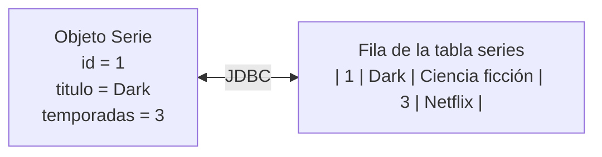
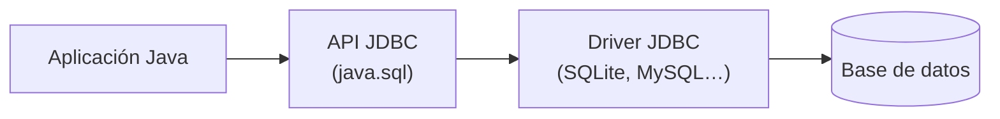
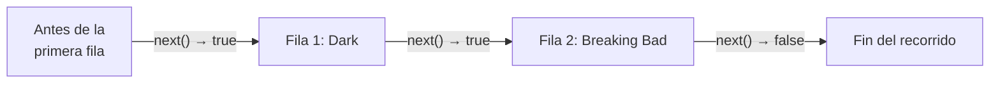
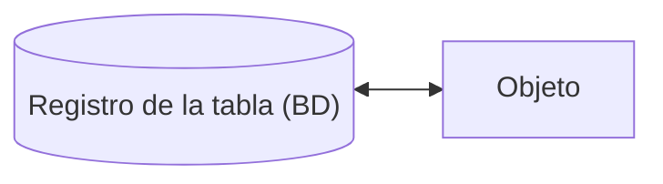
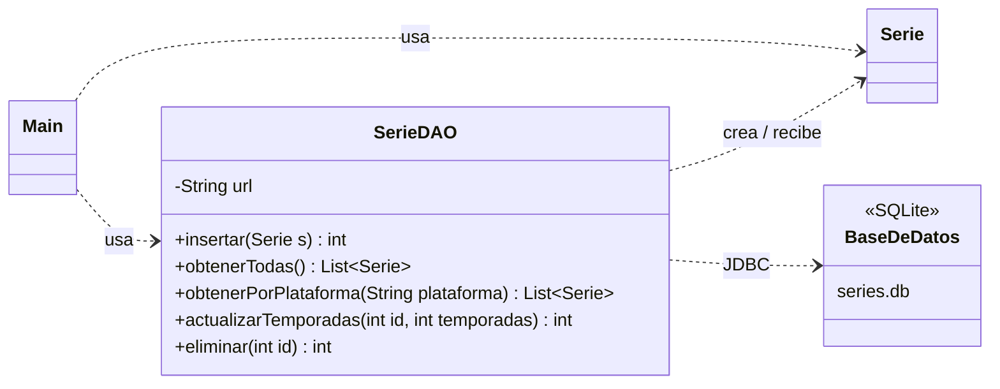
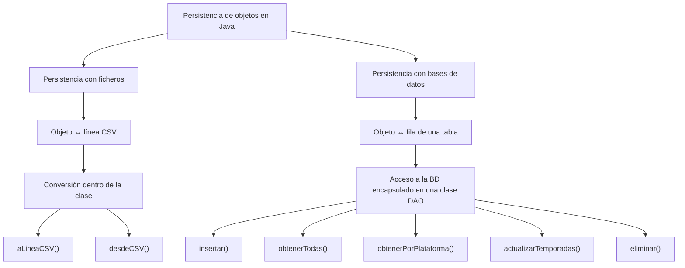

---
tags:
  - java
  - programacion
  - dam1
  - bases-de-datos
unidad: 16
tema: Bases de datos relacionales con JDBC y el patrón DAO
---

# Unidad 16. Bases de datos con JDBC y el patrón DAO

> [!abstract] Objetivos de la unidad
> - Comprender por qué las aplicaciones utilizan bases de datos y cómo se relaciona el modelo de objetos con el modelo relacional.
> - Repasar los conceptos básicos de las bases de datos relacionales y de SQL.
> - Conocer JDBC, su arquitectura y sus clases principales: `Connection`, `PreparedStatement` y `ResultSet`.
> - Configurar un proyecto Java para trabajar con una base de datos SQLite.
> - Realizar las operaciones CRUD (INSERT, SELECT, UPDATE y DELETE) mediante `PreparedStatement`.
> - Convertir filas de la base de datos en objetos y objetos en filas.
> - Comprender el riesgo de la inyección SQL y cómo evitarla.
> - Organizar el acceso a datos mediante el patrón DAO.

---

## 1. Aplicaciones Java y bases de datos

### 1.1. Necesidad de las bases de datos

- Una aplicación no siempre puede guardar los datos solo en variables o listas.
- Cuando el programa se cierra, la información en memoria **se pierde**.
- Una **base de datos** permite **conservar los datos entre ejecuciones**.
- Además, permite **consultar, filtrar y modificar** la información de forma **eficiente**.

> [!example] Ejemplos reales
> - Una plataforma de *streaming* guarda series, géneros y número de temporadas.
> - Una aplicación de biblioteca guarda libros y préstamos.
> - Una tienda en línea guarda productos y pedidos.

> [!info] Ficheros frente a bases de datos
> Los ficheros (véase la [[15 Lectura y escritura de ficheros|Unidad 15]]) son adecuados para volúmenes pequeños de datos o para intercambiar información. Cuando los datos son numerosos, están relacionados entre sí, deben consultarse con criterios variados o los utilizan varios usuarios a la vez, una base de datos es la solución adecuada.

### 1.2. El programa trabaja con objetos; la base de datos, con tablas

- En Java se trabaja con **objetos**.
- En una base de datos relacional se trabaja con **tablas, filas y columnas**.
- Una aplicación debe poder **pasar de un modelo al otro**, lo que permite guardar objetos y recuperarlos más tarde.

| Modelo orientado a objetos (Java) | Modelo relacional (base de datos) |
|---|---|
| Clase | Tabla |
| Atributo | Columna (campo) |
| Objeto | Fila (registro) |
| Referencia a otro objeto | Clave ajena |
| Identidad del objeto | Clave primaria |



---

## 2. Conceptos básicos de bases de datos relacionales

### 2.1. Terminología

| Término | Definición |
|---|---|
| **Base de datos relacional** | Conjunto de datos organizados en **tablas** relacionadas entre sí. |
| **SGBD** (Sistema Gestor de Bases de Datos) | Software que gestiona la base de datos: MySQL, PostgreSQL, Oracle, SQLite… |
| **Tabla** | Estructura que almacena los datos de un tipo de entidad (series, alumnos, productos). |
| **Fila** o **registro** | Cada uno de los elementos almacenados en una tabla. |
| **Columna** o **campo** | Cada una de las propiedades de los registros, con un tipo de dato. |
| **Clave primaria** (*primary key*) | Columna que **identifica de forma única** cada fila (habitualmente `id`). |
| **Autoincremental** | Clave primaria cuyo valor **genera automáticamente** el SGBD al insertar una fila. |
| **SQL** | Lenguaje estándar para definir, consultar y manipular bases de datos relacionales. |

### 2.2. SQLite

En esta unidad se utiliza **SQLite**, un SGBD **embebido**: no necesita un servidor independiente, sino que toda la base de datos se almacena en **un único fichero** (por ejemplo, `series.db`). Es ideal para el aprendizaje, las aplicaciones de escritorio y las aplicaciones móviles.

### 2.3. La tabla de ejemplo: `series`

A lo largo de la unidad se trabaja con una tabla llamada `series`, configurada con SQLite en IntelliJ IDEA:

```sql
CREATE TABLE series (
    id         INTEGER NOT NULL PRIMARY KEY AUTOINCREMENT,
    titulo     TEXT    NOT NULL,
    genero     TEXT    NOT NULL,
    temporadas INTEGER NOT NULL,
    plataforma TEXT    NOT NULL
);
```

| id | titulo | genero | temporadas | plataforma |
|:---:|---|---|:---:|---|
| 1 | Dark | Ciencia ficción | 3 | Netflix |
| 2 | Breaking Bad | Drama criminal | 5 | HBO |

> [!note] Nombres de las columnas
> En los apuntes originales de la asignatura, la tabla utiliza los nombres de columna en catalán (`titol`, `genere`, `temporades`). En estos apuntes se han traducido al castellano; el código es idéntico cambiando únicamente esos nombres.

### 2.4. Repaso de SQL: operaciones CRUD

Las cuatro operaciones básicas sobre los datos se conocen por el acrónimo **CRUD**:

| Operación | Significado | Sentencia SQL | Ejemplo |
|---|---|---|---|
| **C**reate | Crear | `INSERT` | `INSERT INTO series (titulo, genero, temporadas, plataforma) VALUES ('Dark', 'Ciencia ficción', 3, 'Netflix');` |
| **R**ead | Leer | `SELECT` | `SELECT titulo, temporadas FROM series WHERE plataforma = 'Netflix';` |
| **U**pdate | Actualizar | `UPDATE` | `UPDATE series SET temporadas = 4 WHERE id = 1;` |
| **D**elete | Eliminar | `DELETE` | `DELETE FROM series WHERE id = 2;` |

> [!danger] `UPDATE` y `DELETE` sin `WHERE`
> Una sentencia `UPDATE` o `DELETE` sin cláusula `WHERE` afecta a **todas las filas** de la tabla. Por ello, al modificar o eliminar registros concretos se indica siempre el registro afectado, habitualmente mediante su `id`.

---

## 3. JDBC: el puente entre Java y la base de datos

### 3.1. Definición

> [!note] Definición: JDBC
> **JDBC** (*Java Database Connectivity*) es la tecnología estándar de Java para **acceder a bases de datos relacionales**. Permite **abrir conexiones**, **ejecutar sentencias SQL** y **leer los resultados**.

JDBC define una **API común** (paquete `java.sql`), independiente del SGBD. Cada fabricante proporciona un **driver** (controlador) que implementa esa API para su base de datos concreta. De este modo, el código Java es prácticamente el mismo tanto si se utiliza SQLite como MySQL o PostgreSQL.



### 3.2. Clases principales

| Clase / interfaz | Función |
|---|---|
| **`DriverManager`** | Crea las conexiones a partir de una URL. |
| **`Connection`** | Representa una **conexión abierta** con la base de datos. |
| **`PreparedStatement`** | Representa una **sentencia SQL preparada**, con parámetros. |
| **`ResultSet`** | Contiene el **resultado** de una consulta `SELECT`. |
| **`SQLException`** | Excepción que se lanza ante cualquier error de acceso a la base de datos. |

### 3.3. Cierre de los recursos

`Connection`, `PreparedStatement` y `ResultSet` son **recursos**, por lo que es importante **cerrarlos** correctamente. Puede hacerse de dos maneras:

- Llamando a **`close()`** al final, para cerrarlos manualmente.
- Abriéndolos con ***try-with-resources***, para que Java los cierre **automáticamente** (forma recomendada; véase la [[10 Errores y excepciones|Unidad 10]]).

---

## 4. Preparación del proyecto

Para trabajar con SQLite desde un proyecto Java de IntelliJ IDEA:

1. **Descargar el driver** de SQLite: el fichero `sqlite-jdbc-x.y.z.jar` (proyecto *xerial/sqlite-jdbc*).
2. **Crear una carpeta `lib`** en la raíz del proyecto y copiar en ella el `.jar`.
3. **Añadir el `.jar` como biblioteca**: *File → Project Structure → Libraries → + → Java* y seleccionar el fichero (o clic derecho sobre el `.jar` → *Add as Library*).
4. **Crear una carpeta `data`** para el fichero de la base de datos (`series.db`).
5. **Opcional:** en la ventana *Database* de IntelliJ, crear una fuente de datos SQLite asociada a `data/series.db` para crear la tabla y ver su contenido.

```
Proves_BD/
├── data/
│   └── series.db          → fichero de la base de datos
├── lib/
│   └── sqlite-jdbc.jar    → driver JDBC
└── src/
    ├── Main.java
    ├── Serie.java
    └── SerieDAO.java
```

> [!important] La URL de conexión
> La conexión se identifica mediante una **URL JDBC**, cuyo formato depende del SGBD:
> ```java
> String url = "jdbc:sqlite:data/series.db";            // SQLite: ruta del fichero
> String url2 = "jdbc:mysql://localhost:3306/tienda";   // MySQL: servidor, puerto y base de datos
> ```
> La ruta del fichero de SQLite es **relativa a la raíz del proyecto**, igual que en los ficheros (véase la [[15 Lectura y escritura de ficheros|Unidad 15]]). Se recomienda la barra `/`; si se usa la barra invertida, debe escribirse duplicada: `"jdbc:sqlite:data\\series.db"`.

> [!warning] Si el fichero no existe
> Si el fichero indicado en la URL no existe, SQLite **crea una base de datos vacía** sin avisar. Un error en la ruta suele manifestarse después como `no such table: series`.

---

## 5. La clase del modelo: `Serie`

Dentro del programa, **cada registro se representa con un objeto**. Esto mantiene la conexión con la programación orientada a objetos y permite convertir las filas de la base de datos en objetos `Serie`.

```java
public class Serie {
    private int id;
    private String titulo;
    private String genero;
    private int temporadas;
    private String plataforma;

    public Serie(int id, String titulo, String genero, int temporadas, String plataforma) {
        this.id = id;
        this.titulo = titulo;
        this.genero = genero;
        this.temporadas = temporadas;
        this.plataforma = plataforma;
    }

    public String getTitulo() {
        return titulo;
    }

    public String getPlataforma() {
        return plataforma;
    }
    // ... resto de getters
}
```

> [!note] Versión definitiva
> Esta primera versión se mejora en el apartado 11 para distinguir entre las series nuevas (sin `id`) y las recuperadas de la base de datos.

---

## 6. Abrir una conexión

Antes de consultar o guardar datos es necesario **abrir una conexión**, que se representa con un objeto **`Connection`**. Conviene gestionarla con *try-with-resources*:

```java
import java.sql.Connection;
import java.sql.DriverManager;

public class Main {
    public static void main(String[] args) {
        String url = "jdbc:sqlite:data/series.db";

        try (Connection conn = DriverManager.getConnection(url)) {
            System.out.println("Conexión abierta correctamente");
        } catch (Exception e) {
            System.out.println("Error: " + e);
        }
    }
}
```

> [!info] `import java.sql.*;`
> Como se utilizan varias clases del paquete `java.sql`, es habitual importarlas todas a la vez con `import java.sql.*;`.

---

## 7. Insertar datos: `INSERT`

Una aplicación no solo lee datos: también debe poder **añadir información nueva**. Para insertar registros se utiliza la sentencia **`INSERT`**.

```java
import java.sql.*;

public class Main {
    public static void main(String[] args) {
        // 1. Cadenas de conexión y de la sentencia SQL
        String url = "jdbc:sqlite:data/series.db";
        String sql = "INSERT INTO series (titulo, genero, temporadas, plataforma) " +
                     "VALUES (?, ?, ?, ?)";

        try (
            Connection conn = DriverManager.getConnection(url);  // 2. Abrir la conexión
            PreparedStatement ps = conn.prepareStatement(sql)    // 3. Preparar la sentencia
        ) {
            ps.setString(1, "Dark");                             // 4. Pasar los parámetros
            ps.setString(2, "Ciencia ficción");
            ps.setInt(3, 3);
            ps.setString(4, "Netflix");

            ps.executeUpdate();                                  // 5. Ejecutar la sentencia
        } catch (Exception e) {
            System.out.println("Error: " + e);
        }
    }
}
```

### 7.1. Los parámetros de `PreparedStatement`

- Cada **`?`** de la sentencia es un **parámetro** (marcador de posición) que se sustituye por un valor antes de ejecutarla.
- Los valores se asignan con los métodos **`setXxx(posición, valor)`**, según el tipo de dato.
- Las posiciones se numeran **empezando por 1**, no por 0.

| Método | Tipo Java | Tipo SQL habitual |
|---|---|---|
| `setString(i, valor)` | `String` | `TEXT`, `VARCHAR` |
| `setInt(i, valor)` | `int` | `INTEGER` |
| `setDouble(i, valor)` | `double` | `REAL`, `DOUBLE` |
| `setBoolean(i, valor)` | `boolean` | `BOOLEAN` |
| `setNull(i, tipoSql)` | — | Cualquier columna que admita `NULL` |

> [!warning] El `id` no se inserta
> La columna `id` es **autoincremental**: el SGBD le asigna el valor automáticamente. Por eso no aparece en la lista de columnas del `INSERT`.

---

## 8. ¿Por qué usar `PreparedStatement`?

- Permite **preparar sentencias SQL con parámetros**.
- **Evita concatenar valores** directamente en el texto SQL.
- El código queda **más claro y más seguro**.
- Es útil para `SELECT`, `INSERT`, `UPDATE` y `DELETE`.

```java
String plataforma = "Netflix";

// MALA PRÁCTICA: concatenar el valor en el texto SQL
String sql2 = "SELECT * FROM series WHERE plataforma = '" + plataforma + "'";

// BUENA PRÁCTICA: parámetro con PreparedStatement
String sql3 = "SELECT * FROM series WHERE plataforma = ?";
PreparedStatement ps = conn.prepareStatement(sql3);
ps.setString(1, plataforma);
```

### 8.1. La inyección SQL

> [!danger] Definición: inyección SQL
> La **inyección SQL** (*SQL injection*) es una vulnerabilidad que se produce cuando un valor introducido por el usuario se **concatena** en una sentencia SQL: un usuario malintencionado puede escribir un texto que **altere la sentencia** y ejecute operaciones no previstas.

Si la plataforma procede de un formulario y el usuario escribe `' OR '1'='1`, la concatenación genera:

```sql
SELECT * FROM series WHERE plataforma = '' OR '1'='1'
```

La condición `'1'='1'` es siempre verdadera, por lo que la consulta devuelve **todas** las filas. En un formulario de inicio de sesión, la misma técnica permitiría entrar sin conocer la contraseña.

Con `PreparedStatement`, el valor se envía **separado** de la sentencia y se trata **siempre como un dato**, nunca como código SQL. El texto malicioso se buscaría literalmente como nombre de plataforma y no devolvería ninguna fila.

> [!important] Regla
> **Nunca** se deben concatenar valores procedentes del usuario en una sentencia SQL. Se utiliza **siempre** `PreparedStatement` con parámetros `?`.

---

## 9. Consultar datos: `SELECT`

### 9.1. Consulta y recorrido del `ResultSet`

Para leer información se utiliza una consulta **`SELECT`**, que se prepara con `PreparedStatement` y se ejecuta con **`executeQuery()`**. El resultado se obtiene en un objeto **`ResultSet`**.

```java
import java.sql.*;

public class Main {
    public static void main(String[] args) {
        String url = "jdbc:sqlite:data/series.db";
        String sql = "SELECT id, titulo, genero, temporadas, plataforma " +
                     "FROM series";

        try (
            Connection conn = DriverManager.getConnection(url);   // 1. Abrir la conexión
            PreparedStatement ps = conn.prepareStatement(sql);    // 2. Preparar la consulta
            ResultSet rs = ps.executeQuery()                      // 3. Ejecutar la consulta
        ) {
            while (rs.next()) {                                   // 4. Recorrer los resultados
                System.out.println(rs.getString("titulo"));
            }
        } catch (Exception e) {
            System.out.println("Error: " + e);
        }
    }
}
```

Salida:

```
Dark
Breaking Bad
```

### 9.2. Funcionamiento del `ResultSet`

> [!note] Definición: cursor
> Un `ResultSet` funciona como una tabla con un **cursor** que señala la fila actual. Inicialmente, el cursor está situado **antes de la primera fila**.

- **`next()`** avanza el cursor a la siguiente fila y devuelve `true` si existe, o `false` si ya no quedan filas. Por eso se utiliza como condición del `while`.
- Los métodos **`getXxx("columna")`** devuelven el valor de una columna **de la fila actual**.



| Método | Devuelve |
|---|---|
| `getString("columna")` | El valor como `String`. |
| `getInt("columna")` | El valor como `int` (0 si es `NULL`). |
| `getDouble("columna")` | El valor como `double`. |
| `getBoolean("columna")` | El valor como `boolean`. |

> [!tip] Nombre o posición de la columna
> Los métodos `getXxx` admiten el **nombre** de la columna (`rs.getString("titulo")`) o su **posición**, empezando por 1 (`rs.getString(2)`). Se recomienda el nombre, porque el código es más legible y no depende del orden de las columnas en el `SELECT`.

### 9.3. De fila de la base de datos a objeto `Serie`

En una aplicación orientada a objetos es mejor trabajar con **objetos** que con datos sueltos. Por ello, cada fila recuperada se **convierte en un objeto** `Serie`, de modo que la información queda integrada en el modelo del programa:

```java
while (rs.next()) {
    Serie s = new Serie(
            rs.getInt("id"),
            rs.getString("titulo"),
            rs.getString("genero"),
            rs.getInt("temporadas"),
            rs.getString("plataforma")
    );
    System.out.println(s.getTitulo() + " - " + s.getPlataforma());
}
```

Es habitual almacenar los objetos obtenidos en una **lista** para utilizarlos después:

```java
List<Serie> series = new ArrayList<>();
while (rs.next()) {
    series.add(new Serie(rs.getInt("id"), rs.getString("titulo"), rs.getString("genero"),
            rs.getInt("temporadas"), rs.getString("plataforma")));
}
```

### 9.4. `SELECT` con filtro

Muchas consultas **no recuperan todas las filas**: a menudo solo interesa una parte de la información. `PreparedStatement` permite pasar los valores del filtro con facilidad:

```java
import java.sql.*;

public class Main {
    public static void main(String[] args) {
        String url = "jdbc:sqlite:data/series.db";
        String sql = "SELECT titulo, temporadas " +
                     "FROM series " +
                     "WHERE plataforma = ?";

        try (
            Connection conn = DriverManager.getConnection(url);   // 1. Abrir la conexión
            PreparedStatement ps = conn.prepareStatement(sql)     // 2. Preparar la consulta
        ) {
            ps.setString(1, "Netflix");                           // 3. Pasar el parámetro

            ResultSet rs = ps.executeQuery();                     // 4. Ejecutar y obtener el ResultSet
            while (rs.next()) {
                System.out.println(rs.getString("titulo"));
            }
            rs.close();                                           // 5. Cerrarlo manualmente
        } catch (Exception e) {
            System.out.println("Error: " + e);
        }
    }
}
```

> [!note] Cierre del `ResultSet`
> En este caso, el `ResultSet` no puede declararse en los paréntesis del `try`, porque antes hay que asignar los parámetros. Si no se utiliza un *try-with-resources* para él, es importante **cerrarlo manualmente**. Una alternativa es anidar un segundo *try-with-resources*:
> ```java
> ps.setString(1, "Netflix");
> try (ResultSet rs = ps.executeQuery()) {
>     while (rs.next()) { ... }
> }
> ```

> [!tip] Consultas que devuelven como máximo una fila
> Cuando se busca por la clave primaria, el resultado tiene **una fila o ninguna**. En ese caso se utiliza `if` en lugar de `while`:
> ```java
> if (rs.next()) {
>     // se ha encontrado la serie
> } else {
>     // no existe ninguna serie con ese id
> }
> ```

---

## 10. Modificar y eliminar datos

Leer e insertar datos no es suficiente: una aplicación real también debe **modificar** la información ya guardada y **eliminar** los registros que ya no interesan.

### 10.1. `UPDATE`

`UPDATE` permite **cambiar los valores** de un registro existente. Se indica qué registro se debe modificar mediante su `id`, y `PreparedStatement` permite pasar tanto los nuevos valores como el filtro:

```java
import java.sql.*;

public class Main {
    public static void main(String[] args) {
        String url = "jdbc:sqlite:data/series.db";
        String sql = "UPDATE series " +
                     "SET temporadas = ? " +
                     "WHERE id = ?";

        try (
            Connection conn = DriverManager.getConnection(url);   // 1. Abrir la conexión
            PreparedStatement ps = conn.prepareStatement(sql)     // 2. Preparar la sentencia
        ) {
            ps.setInt(1, 4);                                      // 3. Pasar los parámetros
            ps.setInt(2, 1);

            ps.executeUpdate();                                   // 4. Ejecutar la sentencia
        } catch (SQLException e) {
            System.out.println("Error: " + e.getMessage());
        }
    }
}
```

Resultado: las temporadas del registro con `id` 1 (*Dark*) pasan a ser 4.

### 10.2. `DELETE`

`DELETE` permite **borrar registros** de la tabla. Como en `UPDATE`, se utiliza el `id` para indicar el registro afectado. El orden general es siempre el mismo: **conexión, sentencia, parámetros y ejecución**.

```java
import java.sql.*;

public class Main {
    public static void main(String[] args) {
        String url = "jdbc:sqlite:data/series.db";
        String sql = "DELETE FROM series " +
                     "WHERE id = ?";

        try (
            Connection conn = DriverManager.getConnection(url);   // 1. Abrir la conexión
            PreparedStatement ps = conn.prepareStatement(sql)     // 2. Preparar la sentencia
        ) {
            ps.setInt(1, 2);                                      // 3. Pasar el parámetro

            ps.executeUpdate();                                   // 4. Ejecutar la sentencia
        } catch (SQLException e) {
            System.out.println("Error: " + e.getMessage());
        }
    }
}
```

Resultado: se elimina el registro con `id` 2 (*Breaking Bad*).

### 10.3. `executeQuery()` y `executeUpdate()`

| Método | Sentencias | Devuelve |
|---|---|---|
| `executeQuery()` | `SELECT` | Un **`ResultSet`** con las filas obtenidas. |
| `executeUpdate()` | `INSERT`, `UPDATE`, `DELETE` (y `CREATE TABLE`) | Un **`int`** con el **número de filas afectadas**. |

El valor devuelto por `executeUpdate()` es muy útil: cuando se trabaja con el `id`, el resultado será habitualmente **0 o 1**, lo que permite que un método **indique si la operación ha tenido efecto**:

```java
public int eliminar(int id) {
    String url = "jdbc:sqlite:data/series.db";
    String sql = "DELETE FROM series " +
                 "WHERE id = ?";

    try (
        Connection conn = DriverManager.getConnection(url);
        PreparedStatement ps = conn.prepareStatement(sql)
    ) {
        ps.setInt(1, id);

        return ps.executeUpdate();  // número de registros eliminados (en este caso, 1 o 0)
    } catch (SQLException e) {
        System.out.println("Error: " + e.getMessage());
        return 0;                   // si algo ha fallado, se devuelve 0: no se ha eliminado nada
    }
}
```

> [!info] `SQLException`
> `SQLException` es una excepción ***checked***: todas las operaciones JDBC obligan a capturarla o declararla. Su método `getMessage()` describe el error devuelto por el SGBD (por ejemplo, `no such table: series` o una violación de la restricción `NOT NULL`).

---

## 11. Persistir objetos: de objeto a fila

### 11.1. El problema del identificador

Hasta ahora se han convertido filas de la base de datos en objetos. También es posible hacer el **camino contrario**: crear un objeto en el programa y **guardarlo** en la base de datos.



Al hacerlo, aparece una cuestión importante: **¿qué ocurre con el `id` antes de guardar el objeto?**

- Si se crea un objeto antes de insertarlo, todavía **no tiene `id` de base de datos**.
- Si el `id` es **autoincremental**, es el SGBD quien lo **genera** al insertar la fila.
- Por tanto, una serie **nueva** todavía no tiene `id`.
- En cambio, una serie **recuperada** de la base de datos **sí** tiene `id`.

### 11.2. Sobrecarga de constructores

Para representar estas dos situaciones se utiliza la **sobrecarga de constructores** (véase la [[11 Fundamentos de POO|Unidad 11]]): la clase tiene dos constructores con el mismo nombre, pero con parámetros diferentes.

```java
public class Serie {
    private final Integer id;    // Integer (no int): puede valer null si aún no tiene id
    private String titulo;
    private String genero;
    private int temporadas;
    private String plataforma;

    // Para crear series NUEVAS, que todavía no se han guardado en la BD
    public Serie(String titulo, String genero, int temporadas, String plataforma) {
        this.id = null;
        this.titulo = titulo;
        this.genero = genero;
        this.temporadas = temporadas;
        this.plataforma = plataforma;
    }

    // Para crear series a partir de datos RECUPERADOS de la BD
    public Serie(Integer id, String titulo, String genero, int temporadas, String plataforma) {
        this.id = id;
        this.titulo = titulo;
        this.genero = genero;
        this.temporadas = temporadas;
        this.plataforma = plataforma;
    }

    public Integer getId() {
        return id;
    }

    public String getTitulo() {
        return titulo;
    }

    public String getGenero() {
        return genero;
    }

    public int getTemporadas() {
        return temporadas;
    }

    public String getPlataforma() {
        return plataforma;
    }

    @Override
    public String toString() {
        return "[" + id + "] " + titulo + " (" + genero + ", " + temporadas
                + " temporadas, " + plataforma + ")";
    }
}
```

> [!important] ¿Por qué `Integer` y no `int`?
> Un atributo de tipo primitivo `int` no puede valer `null`: su valor por defecto es 0, que podría confundirse con un identificador real. La clase envoltorio **`Integer`** es un tipo de referencia y **sí admite `null`**, lo que permite expresar con claridad que la serie **todavía no tiene `id`** (véase la [[02 Variables, tipos de datos y memoria|Unidad 2]]).

### 11.3. De objeto a fila de la base de datos

Si se crea una serie nueva en el programa, puede guardarse en la base de datos. Como el `id` es automático, **no se pasa** en el `INSERT`: `PreparedStatement` recibe los datos del objeto a través de sus *getters*.

```java
import java.sql.*;

public class Main {
    public static void main(String[] args) {
        String url = "jdbc:sqlite:data/series.db";
        Serie s = new Serie("One Piece", "Anime", 21, "Crunchyroll"); // constructor sin id
        String sql = "INSERT INTO series (titulo, genero, temporadas, plataforma) " +
                     "VALUES (?, ?, ?, ?)";

        try (
            Connection conn = DriverManager.getConnection(url);
            PreparedStatement ps = conn.prepareStatement(sql)
        ) {
            ps.setString(1, s.getTitulo());
            ps.setString(2, s.getGenero());
            ps.setInt(3, s.getTemporadas());
            ps.setString(4, s.getPlataforma());

            ps.executeUpdate();
        } catch (SQLException e) {
            System.out.println("Error: " + e.getMessage());
        }
    }
}
```

> [!info] Obtener el `id` generado
> Si tras la inserción se necesita conocer el `id` asignado por el SGBD, se puede solicitar al preparar la sentencia:
> ```java
> PreparedStatement ps = conn.prepareStatement(sql, Statement.RETURN_GENERATED_KEYS);
> // ... setXxx y executeUpdate()
> try (ResultSet claves = ps.getGeneratedKeys()) {
>     if (claves.next()) {
>         int idGenerado = claves.getInt(1);
>     }
> }
> ```

> [!note] Autoincremento y huecos
> Los identificadores autoincrementales **no se reutilizan**: si se elimina la serie con `id` 2, la siguiente serie insertada recibirá el `id` 3, no el 2.

---

## 12. El patrón DAO

### 12.1. El problema: código JDBC disperso

- Si el programa crece y el código no se organiza bien, puede acabar habiendo **código JDBC en cualquier parte**.
- Esto hace que el programa sea **más difícil de leer y mantener**, y puede acabar provocando **errores**.
- Conviene **separar el acceso a datos** en otra clase.

### 12.2. Concepto

> [!note] Definición: DAO
> Un **DAO** (*Data Access Object*, «objeto de acceso a datos») es una clase que **concentra todo el acceso a la base de datos** para una entidad. Ofrece métodos para **insertar, consultar, actualizar y eliminar**, de modo que el resto del programa trabaja solo con **objetos** y no necesita conocer SQL ni JDBC.

- Evita **repetir** el código JDBC por el programa.
- **Separa responsabilidades**: `Serie` **representa los datos**; `SerieDAO` **se encarga del acceso a la base de datos**.
- Si cambia la base de datos (por ejemplo, de SQLite a MySQL), solo hay que modificar el DAO.



| Capa | Clase | Responsabilidad |
|---|---|---|
| **Modelo** | `Serie` | Representar los datos del dominio. |
| **Acceso a datos** | `SerieDAO` | Traducir entre objetos y filas mediante JDBC. |
| **Aplicación** | `Main` | Lógica del programa e interacción con el usuario. |

### 12.3. Implementación de `SerieDAO`

```java
import java.sql.*;
import java.util.ArrayList;
import java.util.List;

public class SerieDAO {
    private final String url = "jdbc:sqlite:data/series.db";

    // CREATE: de objeto a fila
    public int insertar(Serie s) {
        String sql = "INSERT INTO series (titulo, genero, temporadas, plataforma) " +
                     "VALUES (?, ?, ?, ?)";

        try (Connection conn = DriverManager.getConnection(url);
             PreparedStatement ps = conn.prepareStatement(sql)) {

            ps.setString(1, s.getTitulo());
            ps.setString(2, s.getGenero());
            ps.setInt(3, s.getTemporadas());
            ps.setString(4, s.getPlataforma());

            return ps.executeUpdate();
        } catch (SQLException e) {
            System.out.println("Error: " + e.getMessage());
            return 0;
        }
    }

    // READ: todas las filas
    public List<Serie> obtenerTodas() {
        List<Serie> series = new ArrayList<>();
        String sql = "SELECT id, titulo, genero, temporadas, plataforma FROM series";

        try (Connection conn = DriverManager.getConnection(url);
             PreparedStatement ps = conn.prepareStatement(sql);
             ResultSet rs = ps.executeQuery()) {

            while (rs.next()) {
                series.add(mapearFila(rs));
            }
        } catch (SQLException e) {
            System.out.println("Error: " + e.getMessage());
        }
        return series;
    }

    // READ con filtro
    public List<Serie> obtenerPorPlataforma(String plataforma) {
        List<Serie> series = new ArrayList<>();
        String sql = "SELECT id, titulo, genero, temporadas, plataforma " +
                     "FROM series WHERE plataforma = ?";

        try (Connection conn = DriverManager.getConnection(url);
             PreparedStatement ps = conn.prepareStatement(sql)) {

            ps.setString(1, plataforma);
            try (ResultSet rs = ps.executeQuery()) {
                while (rs.next()) {
                    series.add(mapearFila(rs));
                }
            }
        } catch (SQLException e) {
            System.out.println("Error: " + e.getMessage());
        }
        return series;
    }

    // UPDATE
    public int actualizarTemporadas(int id, int temporadas) {
        String sql = "UPDATE series SET temporadas = ? WHERE id = ?";

        try (Connection conn = DriverManager.getConnection(url);
             PreparedStatement ps = conn.prepareStatement(sql)) {

            ps.setInt(1, temporadas);
            ps.setInt(2, id);
            return ps.executeUpdate();
        } catch (SQLException e) {
            System.out.println("Error: " + e.getMessage());
            return 0;
        }
    }

    // DELETE
    public int eliminar(int id) {
        String sql = "DELETE FROM series WHERE id = ?";

        try (Connection conn = DriverManager.getConnection(url);
             PreparedStatement ps = conn.prepareStatement(sql)) {

            ps.setInt(1, id);
            return ps.executeUpdate();
        } catch (SQLException e) {
            System.out.println("Error: " + e.getMessage());
            return 0;
        }
    }

    // Método auxiliar: convierte la fila actual del ResultSet en un objeto Serie
    private Serie mapearFila(ResultSet rs) throws SQLException {
        return new Serie(
                rs.getInt("id"),
                rs.getString("titulo"),
                rs.getString("genero"),
                rs.getInt("temporadas"),
                rs.getString("plataforma"));
    }
}
```

> [!tip] El método auxiliar `mapearFila`
> La conversión de una fila en un objeto se repite en todos los métodos de consulta. Extraerla a un método **privado** evita duplicar código: si se añade una columna a la tabla, solo hay que modificarlo en un lugar. Declara `throws SQLException` porque los métodos `getXxx` del `ResultSet` pueden lanzarla, y es el método que lo invoca quien la gestiona.

### 12.4. Uso del DAO

El programa principal ya **no contiene ninguna sentencia SQL**: trabaja únicamente con objetos `Serie` y con los métodos del DAO.

```java
import java.util.List;

public class Main {
    public static void main(String[] args) {
        SerieDAO dao = new SerieDAO();                                         // Crear el objeto DAO

        Serie s1 = new Serie("Dark", "Ciencia ficción", 3, "Netflix");        // Crear objetos Serie
        Serie s2 = new Serie("The Boys", "Superhéroes", 4, "Prime Video");

        int insertadas1 = dao.insertar(s1);                                    // Persistir:
        int insertadas2 = dao.insertar(s2);                                    // objetos → filas
        System.out.println("Filas insertadas: " + insertadas1);
        System.out.println("Filas insertadas: " + insertadas2);

        List<Serie> series = dao.obtenerTodas();                               // Recuperar:
        for (Serie s : series) {                                               // filas → objetos
            System.out.println(s.getTitulo() + " - " + s.getPlataforma());
        }

        int modificadas = dao.actualizarTemporadas(1, 4);                      // Modificar
        System.out.println("Filas modificadas: " + modificadas);

        int eliminadas = dao.eliminar(2);                                      // Eliminar
        System.out.println("Filas eliminadas: " + eliminadas);
    }
}
```

Salida (partiendo de la tabla vacía):

```
Filas insertadas: 1
Filas insertadas: 1
Dark - Netflix
The Boys - Prime Video
Filas modificadas: 1
Filas eliminadas: 1
```

> [!info] Organización en paquetes
> En proyectos más grandes, las clases se organizan en paquetes según su responsabilidad (véase la [[14 Diagramas UML y su paso a Java|Unidad 14]]): `model` para `Serie`, `dao` para `SerieDAO` y la clase principal en el paquete raíz o en `app`.

### 12.5. Mejoras habituales del DAO

| Mejora | Descripción |
|---|---|
| Método de búsqueda por clave | `obtenerPorId(int id)`, que devuelve una `Serie` o `null` si no existe. |
| Actualización completa | `actualizar(Serie s)`, que modifica todas las columnas a partir del objeto (usando su `id`). |
| Creación de la tabla | Un método que ejecuta `CREATE TABLE IF NOT EXISTS ...` para que la aplicación funcione aunque la base de datos esté vacía. |
| Gestión de errores | En lugar de imprimir el error y devolver 0, propagar la excepción para que la capa de aplicación decida cómo informar al usuario. |
| Interfaz DAO | Definir una interfaz `SerieDAO` y una implementación `SerieDAOSQLite`, de modo que la base de datos pueda cambiarse sin modificar el resto del programa (véase la [[12 Herencia y polimorfismo\|Unidad 12]]). |

---

## 13. Síntesis: la persistencia de objetos en Java

Las dos últimas unidades presentan dos estrategias para conservar los objetos de un programa. En ambas, la clave es **traducir entre objetos y el formato de almacenamiento**, y **encapsular** esa traducción en un lugar concreto.



| Aspecto | Ficheros (CSV) | Base de datos (JDBC) |
|---|---|---|
| Unidad de almacenamiento | Línea de texto | Fila de una tabla |
| Conversión | `aLineaCSV()` / `desdeCSV()` en la clase | `PreparedStatement` / `ResultSet` en el DAO |
| Búsquedas y filtros | Hay que leer todo el fichero y filtrar en Java | El SGBD filtra con `WHERE` |
| Modificar un registro | Reescribir el fichero completo | `UPDATE` sobre la fila concreta |
| Uso adecuado | Intercambio de datos, registros (*logs*), configuraciones | Datos numerosos, relacionados o compartidos |

---

## 14. Resumen de la unidad

> [!summary] Ideas clave
> - Las **bases de datos** conservan los datos entre ejecuciones y permiten consultarlos y modificarlos eficientemente. Una **clase** corresponde a una **tabla**, un **atributo** a una **columna** y un **objeto** a una **fila**.
> - **SQLite** es un SGBD embebido que guarda toda la base de datos en un único fichero.
> - Las operaciones **CRUD** son `INSERT`, `SELECT`, `UPDATE` y `DELETE`; `UPDATE` y `DELETE` deben llevar `WHERE`.
> - **JDBC** es la API estándar de Java para acceder a bases de datos; necesita el **driver** del SGBD. Sus clases principales son **`Connection`**, **`PreparedStatement`** y **`ResultSet`**, que deben cerrarse (preferiblemente con *try-with-resources*).
> - La conexión se abre con `DriverManager.getConnection("jdbc:sqlite:data/series.db")`.
> - **`PreparedStatement`** utiliza parámetros `?` (numerados desde 1) que se asignan con `setString`, `setInt`…; evita la **inyección SQL**.
> - `SELECT` se ejecuta con **`executeQuery()`**, que devuelve un `ResultSet` recorrido con `while (rs.next())`; `INSERT`, `UPDATE` y `DELETE` se ejecutan con **`executeUpdate()`**, que devuelve el número de filas afectadas.
> - Cada fila se convierte en un **objeto**; una serie nueva tiene `id` **`null`** (por eso se usa `Integer`) y el SGBD lo genera al insertarla. La **sobrecarga de constructores** distingue ambos casos.
> - El patrón **DAO** concentra todo el acceso a datos en una clase, separando el **modelo** (`Serie`) del **acceso a la base de datos** (`SerieDAO`).

---

**Navegación:** Anterior: [[15 Lectura y escritura de ficheros|Unidad 15. Lectura y escritura de ficheros]] · [[00 Índice|Índice]]
