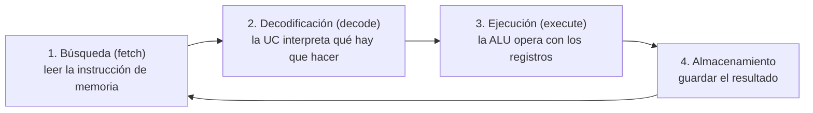
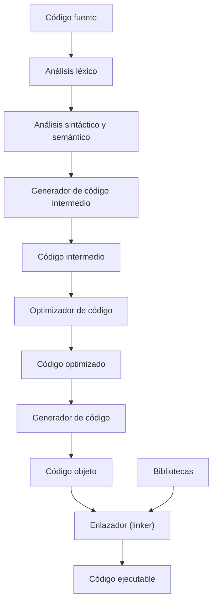
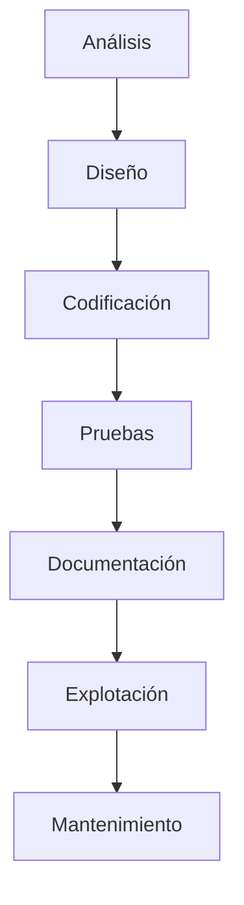
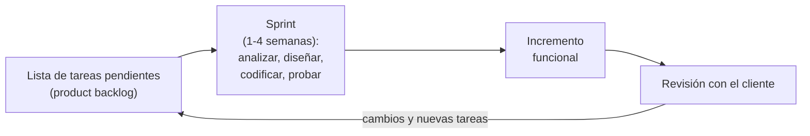
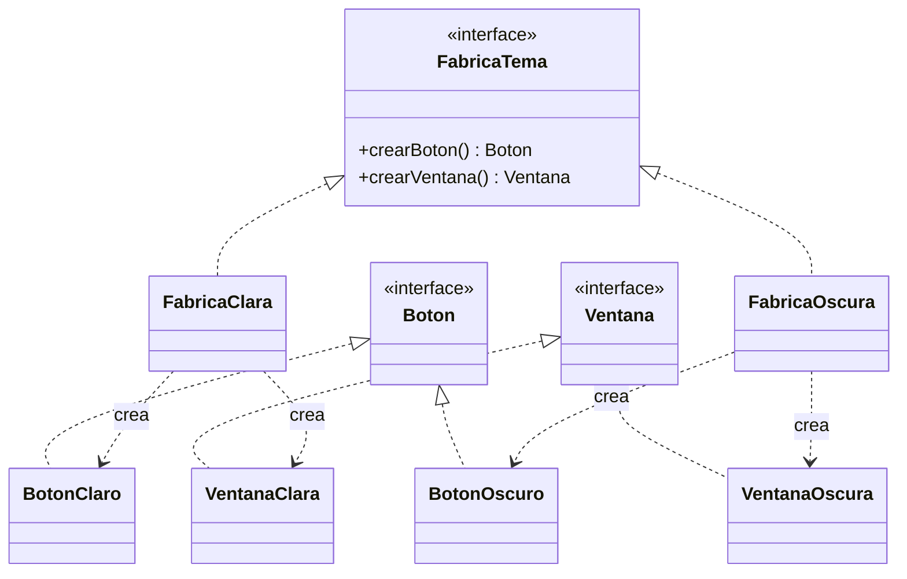
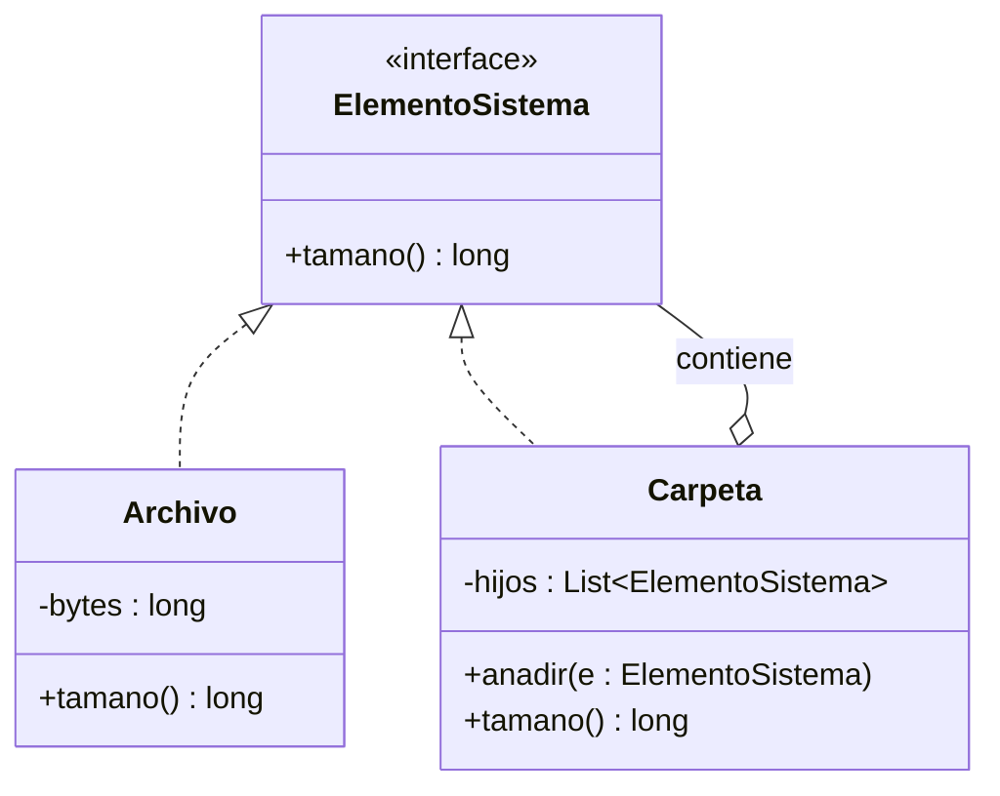
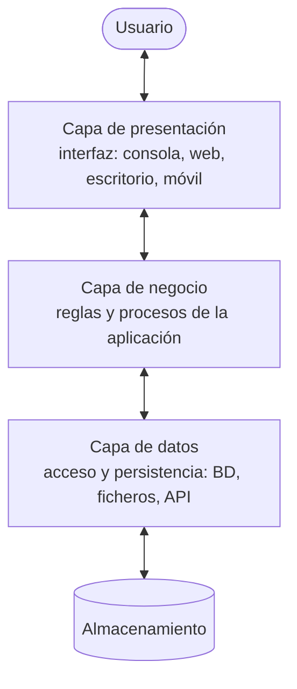
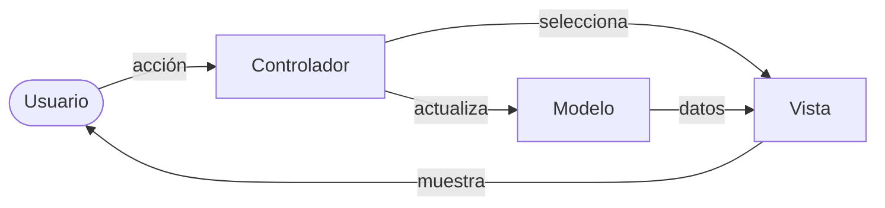
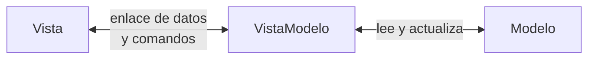
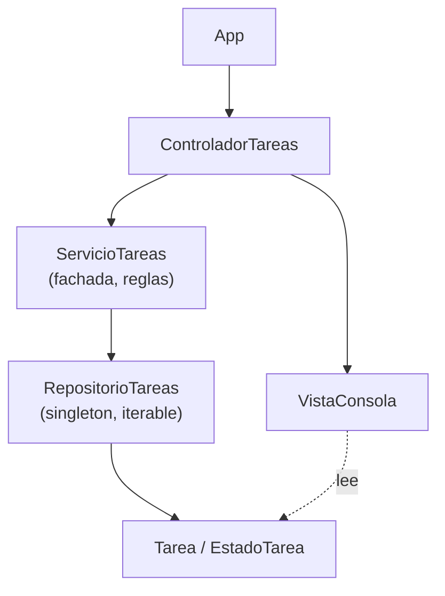

---
tags:
  - entornos-de-desarrollo
  - DAM1
unidad: 1
tema: Desarrollo de software — lenguajes, obtención del ejecutable, ciclo de vida y arquitectura
---

# Unidad 1. Desarrollo de software

> [!abstract] Objetivos de la unidad
> - Definir qué es un programa informático y describir cómo lo ejecuta el procesador.
> - Clasificar los lenguajes de programación según su nivel de abstracción, su forma de ejecución y su paradigma.
> - Distinguir entre código fuente, código objeto, *bytecode* y código ejecutable.
> - Describir las fases de la compilación y reproducirlas con herramientas reales (`gcc`, `javac`, `python`, `dotnet`).
> - Identificar las dependencias que necesita un programa para ejecutarse en otro equipo.
> - Explicar las etapas del ciclo de vida del software y comparar el modelo en cascada con los modelos ágiles.
> - Reconocer los roles que intervienen en un proyecto de desarrollo.
> - Aplicar los patrones de diseño y las arquitecturas en capas (MVC, MVVM) más habituales, y evitar los antipatrones más comunes.

---

## 1. Introducción

Cuando se escribe un programa, el texto que redacta el programador no es lo que ejecuta el ordenador. Entre ambos extremos existe una cadena de herramientas (compiladores, intérpretes, enlazadores, máquinas virtuales) y de decisiones (qué lenguaje utilizar, cómo organizar el código, qué proceso de trabajo seguir) que determinan si el software funcionará, si podrá distribuirse y si podrá mantenerse en el futuro.

El módulo de *Entornos de desarrollo* estudia precisamente esas herramientas y procesos. Esta primera unidad establece la base conceptual sobre la que se apoyan las demás:

| Pregunta | Apartado |
|---|---|
| ¿Qué es un programa y cómo lo ejecuta la CPU? | 2 |
| ¿Qué tipos de lenguajes existen y en qué se diferencian? | 3 |
| ¿Cómo se pasa del código fuente a un programa ejecutable? | 4 |
| ¿Qué etapas sigue un proyecto de software y quién participa en ellas? | 5 y 6 |
| ¿Cómo se organiza el código para que sea mantenible? | 7 |

---

## 2. El programa informático

### 2.1. Concepto

> [!note] Definición: programa informático
> Conjunto de instrucciones que se ejecutan de manera ordenada con el objetivo de realizar una o varias tareas en un sistema informático.

> [!note] Definición: proceso
> Programa en ejecución. Un mismo programa almacenado en disco puede dar lugar a varios procesos simultáneos (por ejemplo, dos ventanas del mismo editor).

Un programa interactúa con el sistema ejecutando sus instrucciones en el procesador (CPU, *Central Processing Unit*). Dentro de la CPU intervienen principalmente tres componentes:

| Componente | Función |
|---|---|
| Unidad de control (UC) | Lee cada instrucción de memoria, la decodifica y coordina su ejecución. |
| Unidad aritmético-lógica (ALU, *Arithmetic Logic Unit*) | Realiza las operaciones aritméticas (sumas, restas…) y lógicas (comparaciones, AND, OR…). |
| Registros | Pequeñas memorias internas, muy rápidas, donde se guardan los datos con los que se opera. |

> [!info] Matiz respecto al material
> El material indica que las instrucciones «se ejecutan en la ALU». Es más preciso decir que la **unidad de control** interpreta cada instrucción y que la **ALU** realiza la parte aritmética o lógica de la operación. Ambas forman parte de la CPU.

### 2.2. Instrucciones y microinstrucciones

Cada instrucción del programa se divide en operaciones más pequeñas que el procesador ejecuta de forma individual y secuencial en cada ciclo de reloj.

> [!note] Definición: microinstrucción
> Operación elemental en la que se descompone una instrucción máquina y que el procesador ejecuta en un ciclo de reloj (por ejemplo, copiar un dato de la memoria a un registro).

El procesador repite indefinidamente el llamado **ciclo de instrucción**:



---

## 3. Lenguajes de programación

### 3.1. Concepto

> [!note] Definición: lenguaje de programación
> Conjunto de instrucciones, operadores y reglas sintácticas y semánticas que se ponen a disposición del programador para que pueda comunicarse con los dispositivos de *hardware* y *software*.

El procesador solo entiende **código máquina**: secuencias de ceros y unos. Programar directamente en código máquina es una tarea ardua y propensa a errores, por lo que los lenguajes de programación permiten escribir programas con un mayor **nivel de abstracción**, es decir, más cerca del lenguaje humano y más lejos de los detalles del *hardware*.

Todo lenguaje se define en tres niveles:

| Nivel | Qué establece | Ejemplo en Java |
|---|---|---|
| Léxico | Qué símbolos y palabras son válidos. | `#` no es un símbolo válido fuera de un texto. |
| Sintaxis | Cómo se combinan esos símbolos para formar instrucciones correctas. | Toda sentencia termina en `;`. |
| Semántica | Qué significado tiene una instrucción sintácticamente correcta y si tiene sentido. | `int x = "cinco";` es sintácticamente correcta, pero asigna un texto a un entero. |

### 3.2. Clasificación según el nivel de abstracción

El **nivel de abstracción** indica cuán alejado está un lenguaje del código máquina: cuanto más se parece al lenguaje humano, más alto es su nivel.

| Nivel | Descripción | Ejemplos |
|---|---|---|
| Bajo nivel | Dependen totalmente del procesador. Cada instrucción corresponde (casi) a una instrucción máquina. | Código máquina, lenguaje ensamblador |
| Nivel medio | Permiten abstracción (funciones, tipos) pero también manipular memoria y *hardware* directamente. | C |
| Alto nivel | Cercanos al lenguaje humano, independientes del procesador, con estructuras complejas (clases, colecciones, excepciones). | Java, C#, Python, JavaScript |
| Propósito específico | Alto nivel orientado a una tarea concreta. | SQL (bases de datos), HTML (marcado, no es de programación) |

> [!warning] Corrección del material
> El material sitúa el **ensamblador** en el nivel medio. En la clasificación habitual el ensamblador es un lenguaje de **bajo nivel** (de segunda generación), porque cada instrucción se traduce directamente a una instrucción máquina y depende del procesador. El ejemplo clásico de lenguaje de nivel medio es **C**.

La misma operación, una suma de dos enteros, se aprecia así en cada nivel (resultado real de compilar con `gcc` para un procesador x86-64):

```c
// Alto/medio nivel (C)
int sumar(int a, int b) {
    return a + b;
}
```

```asm
; Bajo nivel: ensamblador x86-64 (sintaxis Intel) generado por gcc -O1
sumar:
    lea  eax, [rdi+rsi]   ; eax = rdi + rsi (los parámetros llegan en rdi y rsi)
    ret                   ; devolver el control; el resultado queda en eax
```

```text
Código máquina (hexadecimal) de esas dos instrucciones:
8d 04 37     -> lea eax,[rdi+rsi*1]
c3           -> ret
```

> [!info] Generaciones de lenguajes
> Otra clasificación clásica habla de **generaciones**: 1GL (código máquina), 2GL (ensamblador), 3GL (lenguajes de alto nivel de propósito general: C, Java, Python), 4GL (lenguajes orientados a un dominio: SQL, generadores de informes) y 5GL (lenguajes basados en restricciones y lógica: Prolog).

### 3.3. Clasificación según la forma de ejecución

| Tipo | Funcionamiento | Qué se distribuye | Ejemplos |
|---|---|---|---|
| **Compilado** | Un **compilador** traduce todo el código fuente a código máquina **antes** de ejecutarlo. | Un ejecutable nativo, específico de un sistema operativo y un procesador. | C, C++, Go, Rust |
| **Interpretado** | Un **intérprete** lee el código fuente y lo ejecuta instrucción a instrucción, sin generar un ejecutable. | El código fuente (y se necesita el intérprete). | Python, JavaScript, Bash, PHP |
| **Virtual** (máquina virtual) | Un compilador traduce el código a un lenguaje intermedio, el ***bytecode***, que una **máquina virtual** ejecuta en cada sistema. | El *bytecode* (y se necesita la máquina virtual). | Java y Kotlin (JVM), C# (CLR de .NET) |

> [!note] Definición: *bytecode*
> Código intermedio, independiente del procesador, generado por el compilador de un lenguaje virtual. No lo ejecuta la CPU directamente, sino una máquina virtual.

> [!note] Definición: compilación JIT
> Compilación «justo a tiempo» (*Just-In-Time*): la máquina virtual traduce a código máquina, durante la ejecución, las partes del *bytecode* que más se utilizan. Por eso Java y C# alcanzan un rendimiento cercano al de los lenguajes compilados.

> [!important] La frontera no es rígida
> La clasificación describe **implementaciones**, no lenguajes en abstracto. Python, por ejemplo, se considera interpretado, pero su intérprete oficial (CPython) compila primero el código a *bytecode* (ficheros `.pyc`) y después lo ejecuta en su propia máquina virtual. Java es «compilado y luego interpretado/compilado JIT».

#### 3.3.1. El mismo programa en cinco lenguajes

Los siguientes ejemplos muestran cómo se compila y ejecuta el mismo programa en los lenguajes que se practican en clase.

**C y C++ (compilados).** Se utiliza `gcc` para C y `g++` para C++. La opción `-o` indica el nombre del ejecutable.

```c
// hola.c
#include <stdio.h>

int main(void) {
    printf("Hola desde C\n");
    return 0;
}
```

```cpp
// hola.cpp
#include <iostream>

int main() {
    std::cout << "Hola desde C++" << std::endl;
    return 0;
}
```

```bash
gcc hola.c -o hola_c      # compilar y enlazar
./hola_c                  # ejecutar (en Windows: hola_c.exe)
g++ hola.cpp -o hola_cpp
./hola_cpp
```

```text
Hola desde C
Hola desde C++
```

**Java (virtual).** `javac` compila el fuente a *bytecode* (`Hola.class`) y `java` lo ejecuta en la JVM. Desde Java 11 también puede lanzarse directamente un único fichero fuente.

```java
// Hola.java  (el nombre del fichero debe coincidir con el de la clase pública)
public class Hola {
    public static void main(String[] args) {
        System.out.println("Hola desde Java");
    }
}
```

```bash
javac Hola.java    # genera Hola.class (bytecode)
java Hola          # la JVM ejecuta Hola.class (sin extensión)
java Hola.java     # Java 11+: compila en memoria y ejecuta, sin generar .class
```

```text
Hola desde Java
```

**Python (interpretado).** No hay paso de compilación explícito.

```python
# hola.py
print("Hola desde Python")
```

```bash
python3 hola.py    # en Windows suele ser: python hola.py  o  py hola.py
```

```text
Hola desde Python
```

**C# (virtual, plataforma .NET).** Se trabaja con proyectos. El compilador genera un fichero `.dll` con código intermedio (CIL, *Common Intermediate Language*) que ejecuta el CLR (*Common Language Runtime*).

```bash
dotnet new console -n HolaCs    # crea el proyecto HolaCs con Program.cs
cd HolaCs
dotnet run                      # compila y ejecuta
```

```csharp
// Program.cs (instrucciones de nivel superior, C# 9+)
Console.WriteLine("Hola desde C#");
```

```text
Hola desde C#
```

Tras la compilación, la carpeta `bin/Debug/net8.0/` contiene `HolaCs.dll` (el código intermedio), `HolaCs.runtimeconfig.json` (qué versión de .NET necesita) y `HolaCs.deps.json` (sus dependencias).

#### 3.3.2. Qué necesita cada programa para ejecutarse en otro equipo

Esta es una de las preguntas prácticas más importantes: un programa que funciona en el equipo del desarrollador puede no funcionar en el del usuario.

| Lenguaje | Se entrega | El equipo de destino necesita |
|---|---|---|
| C / C++ | Ejecutable nativo | El mismo sistema operativo y arquitectura. Si se enlazó de forma dinámica, las bibliotecas compartidas (`libc`, `libstdc++`, `.dll` de Visual C++…). |
| Java | `.class` o un `.jar` | Un **JRE** (o JDK) de la versión adecuada. Si usa bibliotecas externas, sus `.jar`. |
| Python | Ficheros `.py` | El **intérprete** de Python de la versión adecuada y las bibliotecas externas instaladas con `pip` (listadas en `requirements.txt`). |
| C# | `.dll` + ficheros de configuración | El **runtime de .NET** de la versión indicada, salvo que se publique como aplicación autocontenida. |

> [!note] Definición: JVM, JRE y JDK
> - **JVM** (*Java Virtual Machine*): máquina virtual que ejecuta el *bytecode*.
> - **JRE** (*Java Runtime Environment*): JVM más las bibliotecas estándar; es lo mínimo para **ejecutar** programas Java.
> - **JDK** (*Java Development Kit*): JRE más las herramientas de desarrollo (`javac`, `jar`, `javadoc`, `jdb`…); es lo necesario para **desarrollar**.

> [!tip] Distribuciones actuales
> Desde 2019 se recomienda instalar distribuciones libres de OpenJDK, como Eclipse Temurin (Adoptium) o Microsoft Build of OpenJDK. Conviene utilizar una versión LTS (*Long-Term Support*, soporte a largo plazo): 17, 21 o 25.

### 3.4. Clasificación según el paradigma

> [!note] Definición: paradigma de programación
> Estilo o modelo que determina cómo se estructura un programa y cómo se razona sobre él.

| Paradigma | Idea principal | Lenguajes representativos |
|---|---|---|
| **Imperativo** | Secuencia de instrucciones que modifican el estado del programa: se indica **cómo** hacer la tarea. | C, Java, Python |
| **Declarativo** | Se describe **qué** resultado se quiere, no necesariamente cómo obtenerlo. | SQL, HTML, Prolog |
| **Procedimental** (estructurado) | Variante imperativa: el programa se divide en funciones y procedimientos reutilizables. Resuelve el problema del «código espagueti». | C, Pascal |
| **Orientado a objetos** | Encapsula estado y operaciones en objetos que colaboran entre sí, organizados en clases. | Java, C#, C++, Python |
| **Funcional** | Declarativo: el programa es una composición de funciones sin efectos secundarios; se evitan las variables mutables y se usa la recursión. | Haskell, Scala, Elixir; *streams* de Java, LINQ de C# |
| **Lógico** | Declarativo: se definen hechos y reglas lógicas y el sistema deduce respuestas mediante inferencia. | Prolog |

> [!important] Los lenguajes modernos son multiparadigma
> Java y C# son orientados a objetos, pero incorporan elementos funcionales (expresiones lambda, *streams*, LINQ). Python admite estilo procedimental, orientado a objetos y funcional. El paradigma describe un **estilo**, no una etiqueta exclusiva del lenguaje.

**Ejemplo: sumar los números pares de una lista** con tres paradigmas distintos.

```java
// Paradigmas.java
import java.util.List;

public class Paradigmas {

    // Imperativo: se indica CÓMO obtener el resultado, paso a paso,
    // modificando el estado (la variable suma).
    static int sumaParesImperativa(List<Integer> numeros) {
        int suma = 0;
        for (int n : numeros) {
            if (n % 2 == 0) {
                suma += n;
            }
        }
        return suma;
    }

    // Declarativo/funcional: se describe QUÉ se quiere
    // (filtrar los pares y sumarlos), sin variables mutables.
    static int sumaParesFuncional(List<Integer> numeros) {
        return numeros.stream()
                      .filter(n -> n % 2 == 0)
                      .mapToInt(Integer::intValue)
                      .sum();
    }

    public static void main(String[] args) {
        List<Integer> numeros = List.of(1, 2, 3, 4, 5, 6);
        System.out.println("Imperativo: " + sumaParesImperativa(numeros));
        System.out.println("Funcional:  " + sumaParesFuncional(numeros));
    }
}
```

```text
Imperativo: 12
Funcional:  12
```

```sql
-- Declarativo (SQL): sobre una tabla numeros(n) con los valores 1..6
SELECT SUM(n) FROM numeros WHERE n % 2 = 0;   -- resultado: 12
```

**Ejemplo del paradigma lógico (Prolog).** Se declaran hechos y una regla; el sistema deduce las respuestas.

```prolog
% familia.pl
% Hechos: lo que se sabe
progenitor(ana, luis).
progenitor(luis, marta).
progenitor(luis, pablo).

% Regla: X es abuelo/a de Z si X es progenitor de Y e Y es progenitor de Z
abuelo(X, Z) :- progenitor(X, Y), progenitor(Y, Z).
```

```text
$ swipl familia.pl
?- abuelo(ana, Nieto).
Nieto = marta ;
Nieto = pablo.
```

En ningún momento se programó un bucle de búsqueda: el motor de inferencia de Prolog lo resuelve.

---

## 4. Obtención de código ejecutable

### 4.1. Tipos de código

> [!note] Definición: código fuente
> Conjunto de instrucciones escritas por el programador en un lenguaje de programación determinado (ficheros `.c`, `.java`, `.py`, `.cs`…).

> [!note] Definición: código objeto
> Resultado de compilar el código fuente. En un lenguaje compilado es **código máquina** aún incompleto (ficheros `.o` u `.obj`); en un lenguaje virtual es ***bytecode*** (`.class` en Java, CIL en C#).

> [!note] Definición: código ejecutable
> Resultado de **enlazar** el código objeto con las bibliotecas que necesita. Se ejecuta directamente en el sistema o, en los lenguajes virtuales, sobre una máquina virtual.

> [!note] Definición: biblioteca (*library*)
> Conjunto de código ya compilado y reutilizable (funciones matemáticas, entrada/salida, acceso a red…) que un programa puede utilizar. En castellano se usa a menudo el calco «librería», aunque la traducción correcta es **biblioteca**.

### 4.2. Fases de la compilación

Un compilador no traduce el código de una sola vez, sino en una serie de fases. El esquema del material es el siguiente:



| Fase | Qué hace | Error típico que detecta |
|---|---|---|
| Análisis léxico | Divide el texto en *tokens* (palabras reservadas, identificadores, números, operadores). | Símbolo no permitido. |
| Análisis sintáctico | Comprueba que los *tokens* forman estructuras válidas según la gramática y construye un árbol sintáctico. | Falta un `;` o un paréntesis. |
| Análisis semántico | Comprueba el significado: tipos compatibles, variables declaradas, número de argumentos. | Asignar un texto a un entero. |
| Generación de código intermedio | Traduce el árbol a una representación independiente del procesador. | — |
| Optimización | Mejora el código intermedio (elimina operaciones redundantes, precalcula constantes). | — |
| Generación de código | Traduce a código máquina (o *bytecode*) del destino. | — |
| Enlazado (*linking*) | Une el código objeto con las bibliotecas y resuelve las referencias externas. | Función declarada pero no encontrada. |

Los tres primeros tipos de error se observan fácilmente con `javac`:

```java
// Lexico.java
public class Lexico {
    int x = 5 # 3;
}
```

```text
Lexico.java:3: error: illegal character: '#'
    int x = 5 # 3;
              ^
```

```java
// Sintactico.java
public class Sintactico {
    int x = 5
}
```

```text
Sintactico.java:3: error: ';' expected
    int x = 5
             ^
```

```java
// Semantico.java
public class Semantico {
    int x = "cinco";
}
```

```text
Semantico.java:3: error: incompatible types: String cannot be converted to int
    int x = "cinco";
            ^
```

### 4.3. Las fases en la práctica con `gcc`

El compilador de C permite detenerse en cada fase y observar el resultado intermedio. Se utiliza el siguiente programa, que depende de la biblioteca matemática:

```c
// raiz.c
#include <stdio.h>
#include <math.h>

#define NUMERO 2.0   /* macro: la sustituye el preprocesador */

int main(void) {
    double x = NUMERO;
    printf("La raiz de %.1f es %.4f\n", x, sqrt(x));
    return 0;
}
```

| Orden | Fase | Fichero generado |
|---|---|---|
| `gcc -E raiz.c -o raiz.i` | Preprocesado: inserta los `#include` y sustituye las macros | `raiz.i` (C puro, unas 1.700 líneas) |
| `gcc -S raiz.c -o raiz.s` | Compilación a ensamblador | `raiz.s` |
| `gcc -c raiz.c -o raiz.o` | Ensamblado a código objeto | `raiz.o` (código máquina no ejecutable) |
| `gcc raiz.o -o raiz -lm` | Enlazado con la biblioteca matemática (`-lm`) | `raiz` (ejecutable) |

Al final de `raiz.i` puede comprobarse que el preprocesador ha sustituido la macro:

```c
int main(void) {
    double x = 2.0;
    printf("La raiz de %.1f es %.4f\n", x, sqrt(x));
    return 0;
}
```

Si se olvida enlazar la biblioteca matemática, el error no lo da el compilador sino el **enlazador** (`ld`): el código es correcto, pero no encuentra dónde está implementada `sqrt`.

```bash
gcc raiz.o -o raiz
```

```text
/usr/bin/ld: raiz.o: in function `main':
raiz.c:(.text+0x23): undefined reference to `sqrt'
collect2: error: ld returned 1 exit status
```

```bash
gcc raiz.o -o raiz -lm
./raiz
```

```text
La raiz de 2.0 es 1.4142
```

> [!tip] Cómo interpretar un error de compilación
> Si el mensaje incluye `fichero:línea: error`, el problema está en el código fuente (fases léxica, sintáctica o semántica). Si el mensaje menciona `ld`, `linker` o `undefined reference`, el código compila pero **falta una biblioteca** o un fichero objeto en el enlazado.

### 4.4. Enlazado estático y dinámico

| | Enlazado estático | Enlazado dinámico |
|---|---|---|
| Qué ocurre | El código de las bibliotecas se **copia** dentro del ejecutable. | El ejecutable solo guarda una **referencia**; la biblioteca se carga al ejecutar. |
| Ficheros de biblioteca | `.a` (Linux), `.lib` (Windows) | `.so` (Linux), `.dll` (Windows), `.dylib` (macOS) |
| Tamaño del ejecutable | Grande | Pequeño |
| Necesita la biblioteca en el destino | No | Sí |
| Actualizar la biblioteca | Hay que recompilar | Basta con actualizar la biblioteca |

Con `ldd` se listan las bibliotecas dinámicas que necesita un ejecutable de Linux:

```bash
gcc raiz.o -o raiz -lm                 # dinámico (por defecto)
gcc -static raiz.o -o raiz_static -lm  # estático
ldd raiz
ldd raiz_static
```

Salida de `ldd raiz`:

```text
	linux-vdso.so.1 (0x...)
	libm.so.6 => /lib/x86_64-linux-gnu/libm.so.6 (0x...)
	libc.so.6 => /lib/x86_64-linux-gnu/libc.so.6 (0x...)
	/lib64/ld-linux-x86-64.so.2 (0x...)
```

Salida de `ldd raiz_static`:

```text
	not a dynamic executable
```

Las direcciones de memoria entre paréntesis cambian en cada ejecución, por lo que se han abreviado como `0x...`. En el equipo de prueba, `raiz` ocupa unos 16 KB y `raiz_static` unos 785 KB: la diferencia es el código de `libc` y `libm` copiado dentro.

> [!warning] «En mi ordenador funciona»
> Un ejecutable enlazado dinámicamente falla en otro equipo si falta alguna de sus bibliotecas. En Windows es el típico aviso «No se encuentra `VCRUNTIME140.dll`», que se resuelve instalando el paquete redistribuible de Visual C++.

### 4.5. *Bytecode* en Java y en Python

En los lenguajes virtuales puede inspeccionarse el *bytecode* generado:

```java
// Suma.java
public class Suma {
    static int sumar(int a, int b) {
        return a + b;
    }

    public static void main(String[] args) {
        System.out.println("3 + 4 = " + sumar(3, 4));
    }
}
```

```bash
javac Suma.java
javap -c Suma      # desensambla el bytecode de Suma.class
```

```text
  static int sumar(int, int);
    Code:
       0: iload_0
       1: iload_1
       2: iadd
       3: ireturn
```

La JVM es una máquina de pila: `iload_0` e `iload_1` apilan los dos parámetros, `iadd` los desapila, los suma y apila el resultado, e `ireturn` lo devuelve. Los números de la izquierda (`0:`, `1:`…) son la posición de cada instrucción dentro del método.

```python
# suma.py
import dis

def sumar(a, b):
    return a + b

print("3 + 4 =", sumar(3, 4))
dis.dis(sumar)     # muestra el bytecode de CPython
```

```text
3 + 4 = 7
  4           0 RESUME                   0

  5           2 LOAD_FAST                0 (a)
              4 LOAD_FAST                1 (b)
              6 BINARY_OP                0 (+)
             10 RETURN_VALUE
```

> [!info] El *bytecode* de Python cambia entre versiones
> La salida anterior corresponde a Python 3.11; otras versiones muestran instrucciones ligeramente distintas. El *bytecode* de Java, en cambio, está especificado y es estable entre versiones de la JVM.

### 4.6. Gestores de dependencias

En los proyectos reales las bibliotecas externas no se descargan a mano: se declaran en un fichero y un **gestor de dependencias** las descarga en la versión indicada.

| Lenguaje | Gestor | Fichero de dependencias |
|---|---|---|
| Java | Maven / Gradle | `pom.xml` / `build.gradle` |
| C# | NuGet (integrado en `dotnet`) | `.csproj` |
| Python | pip (con entornos virtuales `venv`) | `requirements.txt` / `pyproject.toml` |
| JavaScript | npm | `package.json` |
| C / C++ | vcpkg, Conan (o el gestor del sistema: `apt`) | `vcpkg.json`, `conanfile.txt` |

> [!info] Contenedores
> Una forma actual de garantizar que un programa se ejecuta igual en cualquier equipo es empaquetarlo, junto con su *runtime* y sus dependencias, en un **contenedor** (Docker). Su uso como entorno de desarrollo se trata en la [Unidad 2](02-entornos-de-desarrollo-integrados.md).

---

## 5. Procesos de desarrollo

### 5.1. Ciclo de vida del software

> [!note] Definición: ciclo de vida del software
> Conjunto de etapas por las que pasa un producto de *software* desde que se concibe hasta que deja de utilizarse.

> [!note] Definición: modelo de desarrollo
> Forma de organizar y encadenar esas etapas (en secuencia, en iteraciones, en paralelo…).

### 5.2. Modelo en cascada

El material presenta el **modelo en cascada**, en el que cada etapa comienza cuando termina la anterior. Consta de siete etapas:



| Etapa | Objetivo | Resultado principal |
|---|---|---|
| Análisis | Definir los **requisitos**: qué debe hacer el *software*. | Documento de especificación de requisitos. |
| Diseño | Determinar el funcionamiento de forma global: arquitectura, módulos, datos. | Diagramas y especificación del diseño. |
| Codificación | Programar el *software* definido. | Código fuente. |
| Pruebas | Confirmar que el código no tiene errores **y** que hace lo que debe hacer (no es lo mismo). | Informe de pruebas. |
| Documentación | Elaborar la documentación de usuario y la técnica para otros desarrolladores. | Manuales y documentación técnica. |
| Explotación | Instalar el *software* en el sistema de destino o preparar su instalación automática. | Sistema en producción. |
| Mantenimiento | Corregir errores detectados en uso y realizar ampliaciones. | Nuevas versiones. |

> [!important] Verificar frente a validar
> La etapa de pruebas tiene una doble función: **verificar** (¿se ha construido el producto correctamente, sin errores?) y **validar** (¿se ha construido el producto correcto, el que necesita el cliente?). Un programa puede no tener ningún error y, aun así, no resolver el problema del usuario.

> [!warning] Limitaciones del modelo en cascada
> - El cliente no ve nada funcionando hasta el final del proyecto.
> - Un error de análisis detectado en la etapa de pruebas obliga a rehacer casi todo el trabajo.
> - Supone que los requisitos no cambiarán, algo poco realista en la mayoría de proyectos.
>
> Sigue siendo útil en proyectos pequeños, con requisitos muy estables o sujetos a normativas que exigen documentación cerrada de cada fase.

### 5.3. Modelos iterativos y ágiles

Para superar las limitaciones de la cascada surgieron modelos que repiten las etapas en **ciclos cortos**, entregando en cada uno una versión funcional del producto.

| Modelo | Idea principal |
|---|---|
| Incremental | El producto se construye por partes; cada incremento añade funcionalidad a lo ya entregado. |
| Espiral | Cada vuelta del ciclo incluye un análisis de riesgos antes de continuar. |
| **Ágil** (Scrum, Kanban) | Iteraciones breves (*sprints* de 1 a 4 semanas), entregas frecuentes, colaboración constante con el cliente y adaptación al cambio. |



| | Cascada | Ágil |
|---|---|---|
| Requisitos | Se fijan al inicio | Evolucionan durante el proyecto |
| Entregas | Una, al final | Frecuentes, cada iteración |
| Participación del cliente | Al principio y al final | Continua |
| Coste de un cambio tardío | Muy alto | Bajo |
| Documentación | Exhaustiva en cada fase | La suficiente |

> [!info] DevOps e integración continua
> En la práctica actual, los modelos ágiles se complementan con prácticas **DevOps**: cada cambio se guarda en un sistema de control de versiones (véase la [Unidad 3](03-control-de-versiones-con-git.md)) y un sistema de **integración y despliegue continuos** (CI/CD, *Continuous Integration / Continuous Delivery*) compila, prueba y publica automáticamente el *software*.

---

## 6. Roles que intervienen en el desarrollo

| Rol | Función | Análisis | Diseño | Codificación | Documentación | Explotación |
|---|---|:---:|:---:|:---:|:---:|:---:|
| Analista de sistemas | Estudia el sistema y las necesidades del cliente y determina el comportamiento del *software*. | X | | | | |
| Diseñador de *software* | Evolución del analista: diseña la solución a partir del análisis. | | X | | | |
| Analista programador | Detalla el diseño para facilitar la codificación y participa en ella. | | X | X | | |
| Programador | Escribe el código fuente a partir del trabajo de analistas y diseñadores. | | | X | | |
| Arquitecto de *software* | Elige *frameworks* y tecnologías y vela por que el proyecto use los recursos más adecuados. | X | X | | X | X |

> [!info] Roles actuales
> En los equipos actuales aparecen además otros perfiles:
> - **Tester / QA** (*Quality Assurance*, aseguramiento de la calidad): diseña y ejecuta las pruebas.
> - **Ingeniero DevOps**: automatiza la compilación, las pruebas y el despliegue.
> - ***Product Owner***: en Scrum, representa al cliente y prioriza las tareas.
> - ***Scrum Master***: facilita el proceso ágil y elimina obstáculos del equipo.
> - **Diseñador UX/UI**: diseña la experiencia y la interfaz de usuario.

---

## 7. Arquitectura de software

### 7.1. Concepto

> [!note] Definición: arquitectura de software
> Diseño de más alto nivel de la estructura de un sistema. Es el conjunto de decisiones que definen los componentes del sistema y la forma en que interactúan, más allá de los algoritmos y las estructuras de datos concretos.

Aunque se asocia principalmente a la programación orientada a objetos, existen arquitecturas en cualquier paradigma. Las técnicas de arquitectura se aplican mediante **patrones**.

> [!note] Definición: patrón de diseño
> Solución general, probada y reutilizable a un problema de diseño que aparece con frecuencia. No es código para copiar, sino un esquema que se adapta a cada caso.

La referencia clásica es el libro *Design Patterns* (1994) de Gamma, Helm, Johnson y Vlissides, conocidos como la *Gang of Four* (GoF), que clasifica los patrones en tres familias:

| Familia | Resuelve | Patrones del temario |
|---|---|---|
| Creacionales | Cómo **crear** objetos. | Fábrica abstracta, Instancia única |
| Estructurales | Cómo **combinar** clases y objetos en estructuras mayores. | Decorador, Objeto compuesto, Fachada |
| De comportamiento | Cómo **se comunican** los objetos y se reparten responsabilidades. | Estado, Visitante, Iterador |

> [!info] Alcance
> Los ejemplos se acompañan de diagramas de clases simplificados. La notación UML se repasa en la [Unidad 8](08-uml-y-diagramas-de-clases.md); aquí basta con saber que cada caja es una clase o interfaz y que las flechas indican relaciones entre ellas.

### 7.2. Patrones creacionales

#### 7.2.1. Fábrica abstracta (*Abstract Factory*)

Se utiliza cuando hay que crear **familias de objetos relacionados** y se quiere que el resto del programa no dependa de las clases concretas. Una **fábrica abstracta** (interfaz) declara los métodos de creación; cada **fábrica concreta** crea los productos de una familia.

> [!example] Caso práctico: temas claro y oscuro
> Una aplicación dispone de un tema claro y otro oscuro. Cada tema es una familia de componentes (botones, ventanas…) que deben combinarse entre sí: no tiene sentido un botón oscuro en una ventana clara. Cambiando la fábrica, cambia toda la familia a la vez.



```java
// FabricaAbstracta.java
interface Boton  { String dibujar(); }
interface Ventana { String dibujar(); }

// Familia "Claro"
class BotonClaro  implements Boton   { public String dibujar() { return "[ Botón claro ]"; } }
class VentanaClara implements Ventana { public String dibujar() { return "Ventana de fondo blanco"; } }
// Familia "Oscuro"
class BotonOscuro  implements Boton   { public String dibujar() { return "[ Botón oscuro ]"; } }
class VentanaOscura implements Ventana { public String dibujar() { return "Ventana de fondo negro"; } }

// La fábrica abstracta declara qué productos se pueden crear...
interface FabricaTema {
    Boton crearBoton();
    Ventana crearVentana();
}
// ...y cada fábrica concreta crea los productos de UNA familia
class FabricaClara implements FabricaTema {
    public Boton crearBoton() { return new BotonClaro(); }
    public Ventana crearVentana() { return new VentanaClara(); }
}
class FabricaOscura implements FabricaTema {
    public Boton crearBoton() { return new BotonOscuro(); }
    public Ventana crearVentana() { return new VentanaOscura(); }
}

public class FabricaAbstracta {
    // El cliente solo conoce las interfaces: no sabe qué clases concretas usa
    static void pintarInterfaz(FabricaTema fabrica) {
        System.out.println(fabrica.crearVentana().dibujar() + " con " + fabrica.crearBoton().dibujar());
    }

    public static void main(String[] args) {
        pintarInterfaz(new FabricaClara());
        pintarInterfaz(new FabricaOscura());
    }
}
```

```text
Ventana de fondo blanco con [ Botón claro ]
Ventana de fondo negro con [ Botón oscuro ]
```

#### 7.2.2. Instancia única (*Singleton*)

Garantiza que de una clase **solo exista un objeto** y ofrece un punto de acceso global a él. Se consigue haciendo **privado el constructor**. En programas con varios hilos debe controlarse que dos hilos no creen dos instancias a la vez (exclusión mutua).

```java
// Singleton.java
class Configuracion {
    // 1. La única instancia se guarda en un atributo estático
    private static Configuracion instancia;
    private String idioma = "es";

    // 2. Constructor privado: nadie puede hacer "new Configuracion()" desde fuera
    private Configuracion() { }

    // 3. Punto de acceso global; synchronized evita que dos hilos creen dos instancias
    public static synchronized Configuracion getInstancia() {
        if (instancia == null) {
            instancia = new Configuracion();
        }
        return instancia;
    }

    public String getIdioma() { return idioma; }
    public void setIdioma(String idioma) { this.idioma = idioma; }
}

public class Singleton {
    public static void main(String[] args) {
        Configuracion a = Configuracion.getInstancia();
        Configuracion b = Configuracion.getInstancia();
        a.setIdioma("ca");
        System.out.println("¿Misma instancia? " + (a == b));
        System.out.println("Idioma leído desde b: " + b.getIdioma());
    }
}
```

```text
¿Misma instancia? true
Idioma leído desde b: ca
```

> [!warning] Uso con moderación
> El *Singleton* es cómodo, pero equivale a una variable global: cualquier parte del programa puede modificar su estado y dificulta las pruebas. Se recomienda reservarlo para recursos realmente únicos (configuración, registro de sucesos o *log*, conexión compartida).

### 7.3. Patrones estructurales

#### 7.3.1. Decorador (*Decorator*)

Permite **añadir funcionalidades a un objeto de forma dinámica** (y retirarlas), sin crear una subclase para cada combinación. El decorador implementa la misma interfaz que el objeto decorado y lo contiene.

> [!example] Caso práctico: una cafetería
> Con herencia harían falta las clases `CafeConLeche`, `CafeConCanela`, `CafeConLecheYCanela`… una por combinación. Con decoradores basta una clase por ingrediente, y se combinan en tiempo de ejecución.

```java
// Decorador.java
interface Cafe {
    String descripcion();
    double precio();
}

class CafeSolo implements Cafe {
    public String descripcion() { return "Café solo"; }
    public double precio() { return 1.20; }
}

// El decorador ES un Cafe y además CONTIENE un Cafe al que envuelve
abstract class DecoradorCafe implements Cafe {
    protected final Cafe cafe;
    DecoradorCafe(Cafe cafe) { this.cafe = cafe; }
}

class ConLeche extends DecoradorCafe {
    ConLeche(Cafe cafe) { super(cafe); }
    public String descripcion() { return cafe.descripcion() + " + leche"; }
    public double precio() { return cafe.precio() + 0.30; }
}

class ConCanela extends DecoradorCafe {
    ConCanela(Cafe cafe) { super(cafe); }
    public String descripcion() { return cafe.descripcion() + " + canela"; }
    public double precio() { return cafe.precio() + 0.15; }
}

public class Decorador {
    public static void main(String[] args) {
        Cafe pedido = new ConCanela(new ConLeche(new CafeSolo()));
        System.out.printf("%s: %.2f €%n", pedido.descripcion(), pedido.precio());
    }
}
```

```text
Café solo + leche + canela: 1,65 €
```

> [!warning] Formato numérico y configuración regional
> `printf` y `String.format` usan la configuración regional (*locale*) del sistema. En un equipo configurado en castellano se imprime `1,65`; en uno configurado en inglés, `1.65`. Para obtener siempre el mismo formato se puede indicar el *locale*: `String.format(Locale.ROOT, "%.2f", x)`.

#### 7.3.2. Objeto compuesto (*Composite*)

Permite tratar **igual a un objeto simple y a un grupo de objetos**. Se define una interfaz común; los objetos compuestos contienen hijos (simples o compuestos) y aplican la operación a todos ellos, formando una **estructura de árbol**.



```java
// Compuesto.java
import java.util.ArrayList;
import java.util.List;

interface ElementoSistema {
    long tamano();                     // la misma operación para hojas y compuestos
}

class Archivo implements ElementoSistema {           // hoja
    private final long bytes;
    Archivo(long bytes) { this.bytes = bytes; }
    public long tamano() { return bytes; }
}

class Carpeta implements ElementoSistema {           // compuesto
    private final List<ElementoSistema> hijos = new ArrayList<>();
    void anadir(ElementoSistema e) { hijos.add(e); }
    public long tamano() {                           // delega en sus hijos (recursivo)
        long total = 0;
        for (ElementoSistema e : hijos) total += e.tamano();
        return total;
    }
}

public class Compuesto {
    public static void main(String[] args) {
        Carpeta raiz = new Carpeta();
        Carpeta fotos = new Carpeta();
        fotos.anadir(new Archivo(300));
        fotos.anadir(new Archivo(200));
        raiz.anadir(new Archivo(100));
        raiz.anadir(fotos);                           // una carpeta dentro de otra
        System.out.println("Tamaño total: " + raiz.tamano() + " bytes");
    }
}
```

```text
Tamaño total: 600 bytes
```

#### 7.3.3. Fachada (*Facade*)

Proporciona una **interfaz única y sencilla** para acceder a un conjunto de subsistemas complejos. El cliente solo habla con la fachada, y es esta quien coordina los subsistemas.

```java
// Fachada.java
class Inventario { boolean hayStock(String producto) { return !producto.equals("agotado"); } }
class Pagos      { boolean cobrar(double importe)    { return importe > 0; } }
class Envios     { String programar(String producto) { return "Envío de " + producto + " programado"; } }

// La fachada ofrece UNA operación sencilla que coordina los subsistemas
class TiendaFachada {
    private final Inventario inventario = new Inventario();
    private final Pagos pagos = new Pagos();
    private final Envios envios = new Envios();

    String comprar(String producto, double importe) {
        if (!inventario.hayStock(producto)) return "Sin stock";
        if (!pagos.cobrar(importe))         return "Pago rechazado";
        return envios.programar(producto);
    }
}

public class Fachada {
    public static void main(String[] args) {
        TiendaFachada tienda = new TiendaFachada();
        System.out.println(tienda.comprar("teclado", 25.0));
        System.out.println(tienda.comprar("agotado", 10.0));
    }
}
```

```text
Envío de teclado programado
Sin stock
```

### 7.4. Patrones de comportamiento

#### 7.4.1. Estado (*State*)

Permite que un objeto **cambie su comportamiento según su estado interno**: el mismo método produce resultados distintos. Cada estado es una clase, lo que evita largas cadenas de `if` o `switch` sobre una variable de estado.

```java
// Estado.java
interface EstadoConexion {
    EstadoConexion conectar();         // cada estado decide qué hacer y cuál es el siguiente
}

class Desconectado implements EstadoConexion {
    public EstadoConexion conectar() {
        System.out.println("Estableciendo conexión...");
        return new Conectado();
    }
}

class Conectado implements EstadoConexion {
    public EstadoConexion conectar() {
        System.out.println("Ya estaba conectado: no se hace nada");
        return this;
    }
}

class Conexion {
    private EstadoConexion estado = new Desconectado();
    void conectar() { estado = estado.conectar(); }   // mismo método, distinto comportamiento
}

public class Estado {
    public static void main(String[] args) {
        Conexion c = new Conexion();
        c.conectar();
        c.conectar();
    }
}
```

```text
Estableciendo conexión...
Ya estaba conectado: no se hace nada
```

#### 7.4.2. Visitante (*Visitor*)

Separa las **operaciones** de la **estructura** de objetos sobre la que actúan. Cada clase elemento tiene un método `aceptar` que recibe al visitante; cada visitante implementa **una operación** con un método `visitar` para cada clase elemento. Así pueden añadirse operaciones nuevas sin modificar las clases elemento.

> [!warning] Corrección del material
> El material indica que hay «un visitador por clase». Es al revés: hay **un visitante por operación** (calcular áreas, generar una descripción…), y **cada visitante tiene un método `visitar` por cada clase elemento**. Su uso típico está en compiladores y analizadores sintácticos, que recorren el árbol sintáctico aplicando distintas operaciones (comprobar tipos, generar código…).

```java
// Visitante.java
import java.util.List;

interface Figura {
    <R> R aceptar(VisitanteFigura<R> v);          // "aceptar" recibe al visitante
}
record Circulo(double radio) implements Figura {
    public <R> R aceptar(VisitanteFigura<R> v) { return v.visitar(this); }
}
record Rectangulo(double base, double altura) implements Figura {
    public <R> R aceptar(VisitanteFigura<R> v) { return v.visitar(this); }
}

// Un visitante = una OPERACIÓN, con un método visitar por cada clase de elemento
interface VisitanteFigura<R> {
    R visitar(Circulo c);
    R visitar(Rectangulo r);
}
class CalculoArea implements VisitanteFigura<Double> {
    public Double visitar(Circulo c)    { return Math.PI * c.radio() * c.radio(); }
    public Double visitar(Rectangulo r) { return r.base() * r.altura(); }
}
class Descripcion implements VisitanteFigura<String> {
    public String visitar(Circulo c)    { return "Círculo de radio " + c.radio(); }
    public String visitar(Rectangulo r) { return "Rectángulo " + r.base() + "x" + r.altura(); }
}

public class Visitante {
    public static void main(String[] args) {
        List<Figura> figuras = List.of(new Circulo(1), new Rectangulo(2, 3));
        for (Figura f : figuras) {
            System.out.printf("%s -> área %.2f%n",
                f.aceptar(new Descripcion()), f.aceptar(new CalculoArea()));
        }
    }
}
```

```text
Círculo de radio 1.0 -> área 3,14
Rectángulo 2.0x3.0 -> área 6,00
```

> [!info] *Records*
> `record` (Java 16+) declara de forma compacta una clase inmutable con sus atributos, constructor, métodos de acceso (`radio()`), `equals`, `hashCode` y `toString`.

#### 7.4.3. Iterador (*Iterator*)

Ofrece una interfaz para **recorrer los elementos de una colección** sin exponer cómo está almacenada. En Java, la interfaz `Iterator` define `hasNext()` (¿quedan elementos?) y `next()` (devuelve el siguiente). Todo objeto que implementa `Iterable` puede recorrerse con un bucle *for-each*, que utiliza internamente un iterador; en C#, el equivalente son `IEnumerator` y `foreach`.

```java
// Iterador.java
import java.util.Iterator;
import java.util.NoSuchElementException;

// Una colección propia recorrible con for-each
class Cuenta implements Iterable<Integer> {
    private final int desde, hasta;
    Cuenta(int desde, int hasta) { this.desde = desde; this.hasta = hasta; }

    public Iterator<Integer> iterator() {
        return new Iterator<>() {
            private int actual = desde;
            public boolean hasNext() { return actual <= hasta; }   // ¿quedan elementos?
            public Integer next() {                                // devuelve el actual y avanza
                if (!hasNext()) throw new NoSuchElementException();
                return actual++;
            }
        };
    }
}

public class Iterador {
    public static void main(String[] args) {
        for (int n : new Cuenta(3, 6)) {        // el for-each usa internamente el iterador
            System.out.print(n + " ");
        }
        System.out.println();
    }
}
```

```text
3 4 5 6
```

### 7.5. Antipatrones

> [!note] Definición: antipatrón
> Solución habitual a un problema que parece correcta, pero que genera más problemas de los que resuelve. Conocerlos permite detectarlos y evitarlos.

| Antipatrón | Síntoma | Alternativa |
|---|---|---|
| Código espagueti | Código sin estructura, lleno de saltos, en el que cualquier cambio rompe otra parte. El nombre procede del dibujo resultante de trazar el flujo del programa. | Dividir en funciones y clases con una responsabilidad clara. |
| Flujo de lava | Grandes cantidades de código desordenado, añadidos y restos que nadie se atreve a borrar. Suele deberse a una mala gestión del proyecto, no solo a un programador descuidado. | Refactorizar y eliminar el código muerto (véase la [Unidad 6](06-refactorizacion.md)). |
| Martillo dorado | Apego injustificado a un lenguaje, paradigma o *framework* para resolver cualquier problema. | Elegir la herramienta según el problema. |
| Reinventar la rueda | Programar desde cero algo que ya tiene una solución probada. | Utilizar la biblioteca estándar o una biblioteca consolidada. |
| Reinventar la rueda cuadrada | Reinventar la rueda y hacerlo peor que la solución existente. | Ídem. |
| Infierno de dependencias | Depender en exceso de bibliotecas externas, con conflictos de versiones al actualizar. | Limitar las dependencias y fijar sus versiones con un gestor. |
| Manejo de excepciones inútil | Comprobar una condición solo para lanzar a mano la misma excepción que lanzaría el sistema, o capturar excepciones y ocultarlas. | Dejar que la excepción se propague o tratarla de verdad. |
| Cadenas mágicas | Textos literales con significado especial repartidos por el código (`"admin"`). | Constantes o tipos enumerados. |
| Copiar y pegar | Duplicar código para crear una clase o un método nuevo. | Extraer el código común a un método o clase reutilizable. |

```java
// Antipatrones.java
public class Antipatrones {

    // ANTIPATRÓN: cadenas mágicas. Un error tipográfico ("admn") compila sin avisar.
    static boolean puedeBorrarMal(String rol) {
        return rol.equals("admin");
    }

    // SOLUCIÓN: un tipo enumerado. Un error tipográfico ya no compila.
    enum Rol { ADMIN, EDITOR, LECTOR }

    static boolean puedeBorrar(Rol rol) {
        return rol == Rol.ADMIN;
    }

    // ANTIPATRÓN: manejo de excepciones inútil. Se comprueba la condición
    // solo para lanzar a mano la excepción que Java ya lanzaría.
    static int dividirMal(int a, int b) {
        if (b == 0) {
            throw new ArithmeticException("/ by zero");
        }
        return a / b;
    }

    // ANTIPATRÓN relacionado: "tragarse" la excepción oculta el error.
    static int dividirSilenciando(int a, int b) {
        try {
            return a / b;
        } catch (ArithmeticException e) {
            return 0;               // ¿0 es un resultado válido o un error? No se sabe.
        }
    }

    public static void main(String[] args) {
        System.out.println(puedeBorrarMal("admn"));   // false: el error pasa desapercibido
        System.out.println(puedeBorrar(Rol.ADMIN));   // true
        System.out.println(dividirSilenciando(7, 0)); // 0: resultado engañoso
        System.out.println(dividirMal(7, 2));         // 3
    }
}
```

```text
false
true
0
3
```

### 7.6. Arquitecturas en capas

#### 7.6.1. Desarrollo en tres capas

El desarrollo en capas nace de la necesidad de separar la lógica de la aplicación de su presentación y de los datos. Cada capa solo se comunica con las capas contiguas.



| Capa | Responsabilidad | Se comunica con |
|---|---|---|
| Presentación | Comunicar la aplicación con el usuario. | Negocio |
| Negocio | Albergar los programas y las reglas de la aplicación. | Presentación y datos |
| Datos | Acceder a los datos, tanto para solicitarlos como para guardarlos. | Negocio |

> [!tip] Ventajas de separar en capas
> - Se puede cambiar una capa sin tocar las demás (por ejemplo, pasar de consola a web).
> - Cada capa puede probarse por separado.
> - Facilita que otros sistemas se integren con la aplicación a través de la capa de negocio.

#### 7.6.2. Modelo-Vista-Controlador (MVC)

El **MVC** organiza el código en tres componentes según su función:

| Componente | Responsabilidad |
|---|---|
| **Modelo** | Accede a los datos y define las reglas de la lógica de negocio. |
| **Vista** | Recibe los datos del modelo y los muestra al usuario. Corresponde a la capa de presentación. |
| **Controlador** | Recibe los eventos de entrada desde la vista (clics, órdenes) y realiza peticiones al modelo y a la vista. |



Es habitual establecer enlaces (*bindings*) entre componentes de la vista y propiedades de las entidades del modelo. Ejemplos actuales: Spring MVC (Java), ASP.NET Core MVC (C#), Django (Python, con una variante llamada MVT).

#### 7.6.3. Modelo-Vista-VistaModelo (MVVM)

El **MVVM** parte de una idea similar al MVC, pero sustituye el controlador por un **VistaModelo** (*ViewModel*): un objeto que prepara los datos del modelo para la vista. La vista es un **observador** que se actualiza automáticamente, mediante enlace de datos (*data binding*), cuando cambia la información del VistaModelo.

| Componente | Responsabilidad |
|---|---|
| **Modelo** | Accede a los datos y define las reglas de negocio. Queda como mera representación de las entidades. |
| **Vista** | Muestra los datos del VistaModelo y se actualiza sola al cambiar estos. |
| **VistaModelo** | Recibe los eventos de la vista (mediante comandos) y crea y actualiza una representación de los datos del modelo adaptada a la vista. |



> [!warning] Corrección del material
> El material afirma que en MVVM «los eventos de la vista son recogidos por el controlador». En MVVM **no existe controlador**: los eventos de la vista los recibe el **VistaModelo**, como indica el propio esquema de la diapositiva.

| | MVC | MVVM |
|---|---|---|
| Intermediario | Controlador | VistaModelo |
| Actualización de la vista | El controlador elige qué vista mostrar | Automática, por enlace de datos |
| Uso típico | Aplicaciones web | Aplicaciones de escritorio y móviles |
| Tecnologías | Spring MVC, ASP.NET Core MVC | WPF y .NET MAUI (C#), Android Jetpack (Kotlin), Vue.js |

---

## 8. Errores frecuentes

> [!danger] Confundir errores de compilación y de enlazado
> Un `undefined reference` o un `cannot find symbol` en tiempo de enlazado no se arregla modificando la sintaxis: falta una biblioteca o un fichero en la orden de compilación (por ejemplo, `-lm` en C o un `.jar` en el *classpath* de Java).

> [!danger] Distribuir solo el ejecutable
> Entregar un `.jar` a quien no tiene Java, o un ejecutable enlazado dinámicamente sin sus `.dll`/`.so`, provoca que el programa no arranque. Deben documentarse siempre las dependencias y el *runtime* necesarios.

> [!warning] Ejecutar Java con la extensión o desde la carpeta equivocada
> `java Hola.class` falla: se escribe `java Hola`. Si la clase pertenece a un paquete (`package tareas;`), debe ejecutarse desde la carpeta raíz de los `.class` con el nombre completo: `java tareas.App`.

> [!warning] Nombre del fichero y de la clase en Java
> Una clase `public class Hola` debe guardarse en `Hola.java`, respetando mayúsculas y minúsculas.

> [!warning] Aplicar patrones por aplicarlos
> Un patrón resuelve un problema concreto. Introducir fábricas, decoradores o *singletons* donde no hacen falta complica el código sin ningún beneficio (generalidad especulativa).

> [!warning] Mezclar capas
> Escribir sentencias SQL dentro de la vista, o imprimir por pantalla desde la capa de datos, rompe la separación en capas y hace imposible cambiar una capa sin tocar las demás.

---

## 9. Ejemplo integrador: gestor de tareas en capas

Se desarrolla un pequeño gestor de tareas de consola que reúne los conceptos de la unidad: organización en **tres capas** con **MVC** en la presentación, los patrones **Instancia única**, **Fachada** e **Iterador**, ausencia de **números mágicos**, **compilación** en paquetes y **empaquetado** en un `.jar`.

### 9.1. Estructura del proyecto

```text
gestor-tareas/
└── src/
    └── tareas/
        ├── App.java                          ← punto de entrada
        ├── modelo/
        │   ├── EstadoTarea.java              ← enumerado
        │   └── Tarea.java                    ← entidad
        ├── datos/
        │   └── RepositorioTareas.java        ← capa de datos (Singleton + Iterable)
        ├── negocio/
        │   └── ServicioTareas.java           ← capa de negocio (Fachada)
        └── presentacion/
            ├── VistaConsola.java             ← Vista (MVC)
            └── ControladorTareas.java        ← Controlador (MVC)
```



### 9.2. Código

```java
// src/tareas/modelo/EstadoTarea.java
package tareas.modelo;

public enum EstadoTarea { PENDIENTE, EN_CURSO, HECHA }
```

```java
// src/tareas/modelo/Tarea.java
package tareas.modelo;

// Capa de modelo: representa la entidad y sus reglas básicas
public class Tarea {
    private final int id;
    private final String titulo;
    private EstadoTarea estado = EstadoTarea.PENDIENTE;

    public Tarea(int id, String titulo) {
        this.id = id;
        this.titulo = titulo;
    }

    public int getId() { return id; }
    public String getTitulo() { return titulo; }
    public EstadoTarea getEstado() { return estado; }

    // Regla de negocio: el estado solo avanza PENDIENTE -> EN_CURSO -> HECHA
    public void avanzar() {
        switch (estado) {
            case PENDIENTE -> estado = EstadoTarea.EN_CURSO;
            case EN_CURSO  -> estado = EstadoTarea.HECHA;
            case HECHA     -> throw new IllegalStateException("La tarea ya está hecha");
        }
    }
}
```

```java
// src/tareas/datos/RepositorioTareas.java
package tareas.datos;

import java.util.ArrayList;
import java.util.Iterator;
import java.util.List;
import java.util.Optional;
import tareas.modelo.Tarea;

// Capa de datos: solo sabe guardar y recuperar. Singleton + Iterable (patrón Iterador)
public final class RepositorioTareas implements Iterable<Tarea> {
    private static final RepositorioTareas INSTANCIA = new RepositorioTareas();
    private final List<Tarea> tareas = new ArrayList<>();   // en un caso real: una base de datos

    private RepositorioTareas() { }

    public static RepositorioTareas getInstancia() { return INSTANCIA; }

    public void guardar(Tarea t) { tareas.add(t); }

    public Optional<Tarea> buscar(int id) {
        return tareas.stream().filter(t -> t.getId() == id).findFirst();
    }

    public int total() { return tareas.size(); }

    @Override
    public Iterator<Tarea> iterator() {
        return List.copyOf(tareas).iterator();   // copia: desde fuera no se puede modificar la lista
    }
}
```

> [!info] Otra forma de implementar el *Singleton*
> Aquí la instancia se crea al cargar la clase (`static final ... = new ...`). Esta variante, llamada **inicialización temprana**, es segura con varios hilos sin necesidad de `synchronized`.

```java
// src/tareas/negocio/ServicioTareas.java
package tareas.negocio;

import tareas.datos.RepositorioTareas;
import tareas.modelo.EstadoTarea;
import tareas.modelo.Tarea;

// Capa de negocio: aplica las reglas y actúa como fachada de la capa de datos
public class ServicioTareas {
    private static final int LONGITUD_MAXIMA_TITULO = 40;   // sin números mágicos
    private final RepositorioTareas repositorio = RepositorioTareas.getInstancia();

    public Tarea crear(String titulo) {
        if (titulo == null || titulo.isBlank() || titulo.length() > LONGITUD_MAXIMA_TITULO) {
            throw new IllegalArgumentException("Título no válido: \"" + titulo + "\"");
        }
        Tarea t = new Tarea(repositorio.total() + 1, titulo.strip());
        repositorio.guardar(t);
        return t;
    }

    public void avanzar(int id) {
        Tarea t = repositorio.buscar(id)
                .orElseThrow(() -> new IllegalArgumentException("No existe la tarea " + id));
        t.avanzar();
    }

    public Iterable<Tarea> listar() { return repositorio; }

    public long pendientes() {
        long n = 0;
        for (Tarea t : repositorio) {
            if (t.getEstado() != EstadoTarea.HECHA) n++;
        }
        return n;
    }
}
```

```java
// src/tareas/presentacion/VistaConsola.java
package tareas.presentacion;

import tareas.modelo.Tarea;

// Vista (MVC): solo muestra datos; no contiene reglas de negocio
public class VistaConsola {
    public void mostrarLista(Iterable<Tarea> tareas, long pendientes) {
        System.out.println("--- Tareas ---");
        for (Tarea t : tareas) {
            System.out.printf("%d. %-22s [%s]%n", t.getId(), t.getTitulo(), t.getEstado());
        }
        System.out.println("Pendientes: " + pendientes);
    }

    public void mostrarError(String mensaje) {
        System.out.println("ERROR: " + mensaje);
    }
}
```

```java
// src/tareas/presentacion/ControladorTareas.java
package tareas.presentacion;

import tareas.negocio.ServicioTareas;

// Controlador (MVC): recibe las órdenes del usuario, llama al negocio y actualiza la vista
public class ControladorTareas {
    private final ServicioTareas servicio;
    private final VistaConsola vista;

    public ControladorTareas(ServicioTareas servicio, VistaConsola vista) {
        this.servicio = servicio;
        this.vista = vista;
    }

    public void ejecutar(String orden) {
        try {
            String[] partes = orden.split(" ", 2);
            switch (partes[0]) {
                case "nueva"   -> servicio.crear(partes.length > 1 ? partes[1] : "");
                case "avanzar" -> servicio.avanzar(Integer.parseInt(partes[1]));
                case "listar"  -> vista.mostrarLista(servicio.listar(), servicio.pendientes());
                default        -> vista.mostrarError("Orden desconocida: " + partes[0]);
            }
        } catch (IllegalArgumentException | IllegalStateException e) {
            vista.mostrarError(e.getMessage());   // el error se comunica, no se oculta
        }
    }
}
```

```java
// src/tareas/App.java
package tareas;

import tareas.negocio.ServicioTareas;
import tareas.presentacion.ControladorTareas;
import tareas.presentacion.VistaConsola;

public class App {
    public static void main(String[] args) {
        ControladorTareas app = new ControladorTareas(new ServicioTareas(), new VistaConsola());
        String[] ordenes = {
            "nueva Instalar el JDK",
            "nueva Configurar Git",
            "nueva    ",               // título vacío: debe fallar
            "avanzar 1",
            "avanzar 1",
            "avanzar 1",               // ya está hecha: debe fallar
            "avanzar 2",
            "borrar 2",                // orden inexistente
            "listar"
        };
        for (String orden : ordenes) {
            app.ejecutar(orden);
        }
    }
}
```

### 9.3. Compilación, empaquetado y ejecución

Desde la carpeta `gestor-tareas/`:

```bash
# 1. Compilar todos los fuentes; -d indica dónde dejar los .class (respetando los paquetes)
javac -d out $(find src -name "*.java")      # en PowerShell: javac -d out (Get-ChildItem -Recurse src -Filter *.java).FullName

# 2. Empaquetar en un .jar indicando la clase principal
jar --create --file tareas.jar --main-class tareas.App -C out .

# 3. Ejecutar (en cualquier equipo con un JRE 21 o superior)
java -jar tareas.jar
```

```text
ERROR: Título no válido: "   "
ERROR: La tarea ya está hecha
ERROR: Orden desconocida: borrar
--- Tareas ---
1. Instalar el JDK        [HECHA]
2. Configurar Git         [EN_CURSO]
Pendientes: 1
```

### 9.4. Relación con los contenidos de la unidad

| Concepto | Dónde aparece |
|---|---|
| Lenguaje virtual, *bytecode* y empaquetado | `javac` genera `.class` en `out/`; `jar` los empaqueta; la JVM los ejecuta. |
| Dependencia de ejecución | El `.jar` requiere un JRE 21+ (usa `switch` con flechas y `List.copyOf`). |
| Tres capas | `presentacion` → `negocio` → `datos`, sin saltos entre capas no contiguas. |
| MVC | `VistaConsola` (vista), `ControladorTareas` (controlador), `ServicioTareas` + `Tarea` (modelo). |
| Instancia única | `RepositorioTareas.getInstancia()`. |
| Fachada | `ServicioTareas` oculta el repositorio al controlador. |
| Iterador | `RepositorioTareas implements Iterable<Tarea>`, recorrido con *for-each*. |
| Sin cadenas ni números mágicos | `EstadoTarea` (enumerado) y `LONGITUD_MAXIMA_TITULO` (constante). |
| Excepciones bien gestionadas | Se lanzan en el negocio y se muestran en la vista, sin ocultarlas. |

---

## 10. Resumen

> [!summary] Ideas clave
> - Un **programa** es un conjunto de instrucciones; un **proceso** es un programa en ejecución. La unidad de control decodifica las instrucciones y la ALU realiza las operaciones.
> - Los lenguajes se clasifican por **nivel de abstracción** (bajo: máquina y ensamblador; medio: C; alto: Java, C#, Python), por **forma de ejecución** (compilados, interpretados, virtuales) y por **paradigma** (imperativo, declarativo, procedimental, orientado a objetos, funcional, lógico). Los lenguajes actuales son multiparadigma.
> - Del **código fuente** se obtiene **código objeto** (máquina o *bytecode*) y, tras el **enlazado** con las bibliotecas, el **código ejecutable**.
> - Fases de la compilación: léxico → sintáctico → semántico → código intermedio → optimización → generación de código → enlazado. Un `undefined reference` es un error del **enlazador**, no del código.
> - Para ejecutar un programa en otro equipo hacen falta sus **dependencias**: bibliotecas dinámicas (C/C++), JRE (Java), intérprete y paquetes (Python) o *runtime* de .NET (C#). Se gestionan con Maven/Gradle, pip, NuGet o npm.
> - El **modelo en cascada** tiene 7 etapas secuenciales; los **modelos ágiles** trabajan en iteraciones cortas con entregas frecuentes y son los predominantes hoy.
> - Los **patrones de diseño** se agrupan en creacionales (Fábrica abstracta, *Singleton*), estructurales (Decorador, Compuesto, Fachada) y de comportamiento (Estado, Visitante, Iterador). Los **antipatrones** son soluciones aparentes que deben evitarse.
> - La arquitectura en **tres capas** separa presentación, negocio y datos. **MVC** usa un controlador; **MVVM** sustituye el controlador por un VistaModelo enlazado a la vista.

---

**Navegación:** Anterior: — · [Índice](00-indice.md) · Siguiente: [Unidad 2. Entornos de desarrollo integrados](02-entornos-de-desarrollo-integrados.md)
