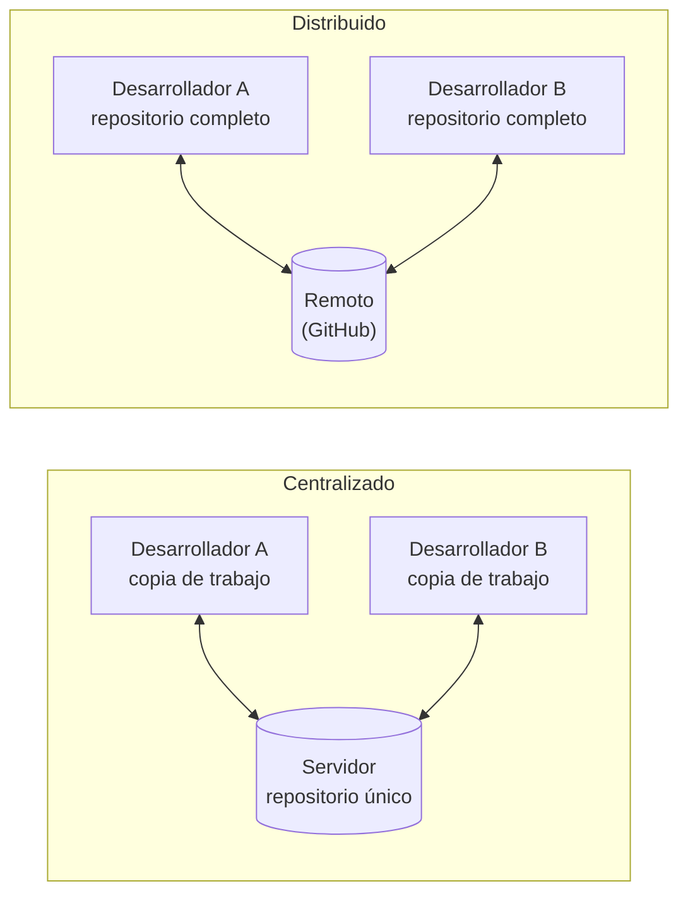
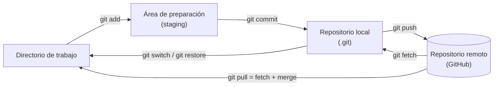
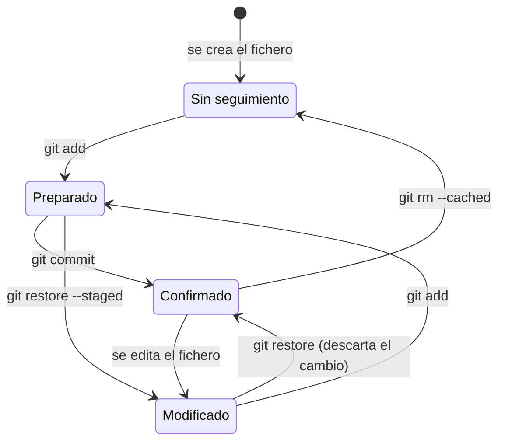
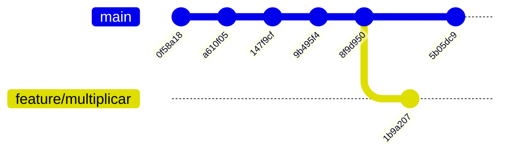
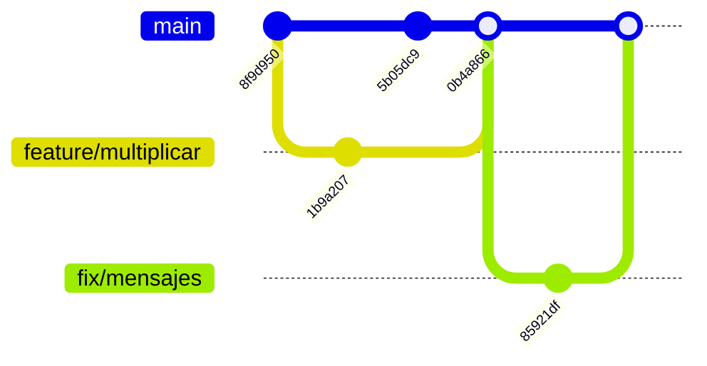
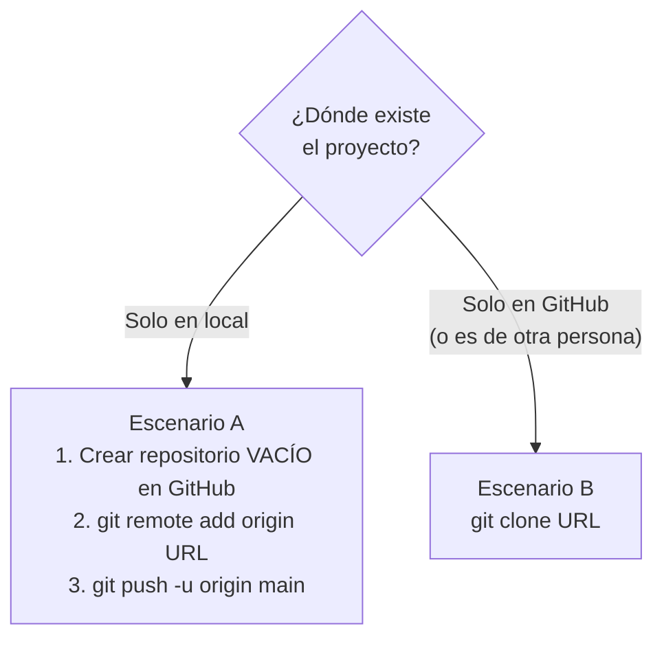
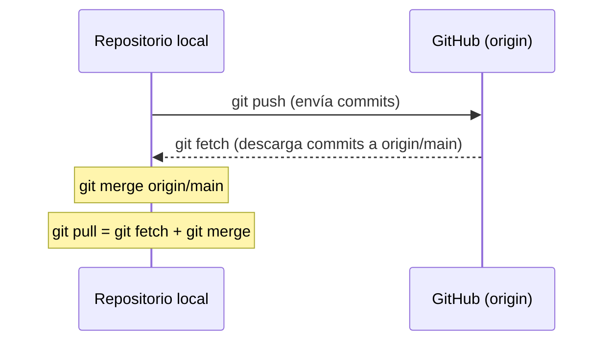
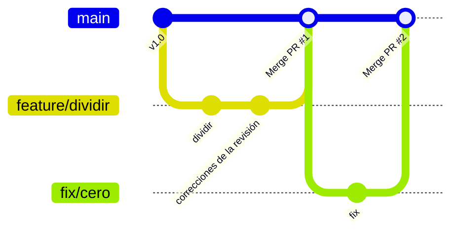
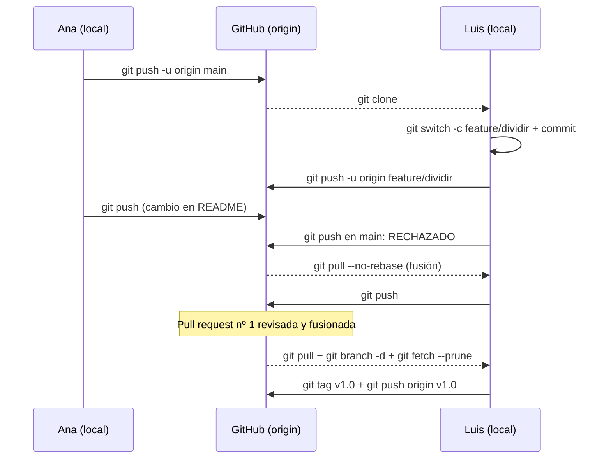

---
tags:
  - entornos-de-desarrollo
  - DAM1
unidad: 3
tema: Control de versiones con Git — funcionamiento, trabajo en local, ramas, deshacer cambios, GitHub y flujo de trabajo
---

# Unidad 3. Control de versiones con Git

> [!abstract] Objetivos de la unidad
> - Explicar qué es un sistema de control de versiones y diferenciar los modelos local, centralizado y distribuido.
> - Describir el funcionamiento interno de Git: las tres áreas, los estados de un fichero, los *commits*, `HEAD` y las ramas.
> - Instalar y configurar Git correctamente en cualquier sistema operativo.
> - Registrar cambios con el flujo `status` → `add` → `commit`, consultar el historial y comparar versiones.
> - Elegir el comando adecuado para deshacer cada tipo de cambio sin perder trabajo.
> - Crear, fusionar y eliminar ramas, y resolver conflictos de fusión.
> - Conectar un repositorio local con GitHub mediante HTTPS o SSH y sincronizarlo con `push`, `fetch` y `pull`.
> - Aplicar un flujo de trabajo profesional basado en ramas y *pull requests*, tanto desde el terminal como desde VS Code.
> - Reconocer y evitar los errores más frecuentes al trabajar con Git.

---

## 1. Introducción

Sin una herramienta específica, la gestión de versiones de un proyecto acaba así:

```text
practica.zip
practica_v2.zip
practica_v2_corregida.zip
practica_final.zip
practica_final_DEFINITIVA.zip
practica_final_DEFINITIVA_ahora_si.zip
```

Este sistema no indica qué cambió entre una versión y otra, ni quién lo cambió ni por qué; ocupa espacio duplicando ficheros enteros y hace imposible que varias personas trabajen a la vez sobre el mismo código. Un **sistema de control de versiones** resuelve todos estos problemas y es, junto con el IDE, la herramienta que un desarrollador utiliza a diario.

Esta unidad es una guía práctica de **Git**, el sistema de control de versiones estándar, y de **GitHub**, la plataforma más utilizada para alojar repositorios. Todos los ejemplos siguen un mismo proyecto, una pequeña calculadora en Java, y las salidas que se muestran son las reales de Git 2.43.

> [!info] Salidas de los ejemplos
> Los identificadores de los *commits* (`0f58a18`, `a610f05`…) dependen del contenido, del autor y de la fecha, por lo que en cada equipo serán distintos. Los mensajes de Git se muestran en inglés, que es su idioma por defecto.

---

## 2. Conceptos de control de versiones

### 2.1. Definiciones básicas

> [!note] Definición: sistema de control de versiones (SCV)
> Herramienta que registra los cambios realizados sobre un conjunto de ficheros a lo largo del tiempo, de modo que se puede consultar quién hizo cada cambio, cuándo y por qué, comparar versiones y recuperar cualquier versión anterior. En inglés, *Version Control System* (VCS).

> [!note] Definición: repositorio
> Almacén donde el sistema de control de versiones guarda todos los ficheros del proyecto junto con el historial completo de sus cambios. A diferencia de un servidor de ficheros normal, **recuerda cada cambio que se ha escrito en él**.

> [!note] Definición: *commit* (confirmación, revisión)
> Instantánea del estado del proyecto en un momento dado, registrada en el repositorio con un identificador único, un autor, una fecha y un mensaje que describe el cambio.

> [!note] Definición: copia de trabajo (*working copy*)
> Ficheros del proyecto que el desarrollador tiene en su disco y sobre los que trabaja.

### 2.2. Modelos de control de versiones

| Modelo | Funcionamiento | Ventajas | Inconvenientes | Ejemplos |
|---|---|---|---|---|
| Local | El historial se guarda solo en el equipo del desarrollador. | Sencillo. | No permite colaborar; si se pierde el disco, se pierde todo. | RCS |
| **Centralizado** | Un único servidor guarda el repositorio; cada desarrollador tiene solo una copia de trabajo y necesita conexión para registrar cambios. | Control centralizado de permisos; fácil de entender. | El servidor es un punto único de fallo; sin conexión no se puede trabajar. | Subversion (SVN), TFVC, CVS |
| **Distribuido** | Cada desarrollador tiene una **copia completa** del repositorio, con todo el historial. Un servidor remoto solo sirve para compartir. | Se trabaja sin conexión; operaciones muy rápidas; cada copia es una copia de seguridad. | Conceptos algo más complejos al principio. | **Git**, Mercurial |



### 2.3. Otros sistemas: Subversion y Team Foundation Server

El material del libro presenta sistemas **centralizados**, hoy en desuso en proyectos nuevos, pero que todavía se encuentran en empresas con código antiguo:

| Sistema | Descripción | Situación actual |
|---|---|---|
| **Subversion (SVN)** | Sistema centralizado libre. Se montaba un servidor (por ejemplo, con VisualSVN Server) y se accedía desde clientes como TortoiseSVN o la extensión AnkhSVN de Visual Studio. | Mantenido, pero en retroceso. GitHub dejó de admitir clientes SVN en enero de 2024. |
| **Team Foundation Server (TFS)** | Plataforma de Microsoft con control de versiones centralizado (TFVC), gestión de tareas y compilación; usaba SQL Server e IIS. | Renombrado **Azure DevOps Server** (2019). Actualmente utiliza Git como sistema recomendado. |

El material menciona también dos formas de evitar que dos personas modifiquen a la vez el mismo fichero:

| Estrategia | Funcionamiento | Uso |
|---|---|---|
| Bloqueo exclusivo (*lock-modify-unlock*) | Antes de modificar un fichero se **bloquea**; nadie más puede cambiarlo hasta que se libere. Evita los conflictos a cambio de impedir el trabajo en paralelo. | SVN y TFVC, para ficheros binarios que no se pueden fusionar (imágenes, planos). |
| Copiar-modificar-fusionar (*copy-modify-merge*) | Cada uno trabaja libremente sobre su copia y después los cambios se **fusionan**. Si dos personas cambian la misma línea, se produce un **conflicto** que se resuelve a mano. | Git (y SVN por defecto). Es el modelo actual. |

> [!info] Matiz respecto al material
> El material afirma que los repositorios de distintos sistemas «no son interoperables». En general es así, pero existen herramientas de migración y pasarelas: por ejemplo, `git svn` permite trabajar con Git contra un servidor Subversion, y la mayoría de proyectos SVN se han migrado a Git conservando su historial.

### 2.4. Git: origen y ventajas

**Git** fue creado en 2005 por **Linus Torvalds**, el creador del núcleo Linux, cuando la herramienta que utilizaba el proyecto (BitKeeper) dejó de estar disponible gratuitamente. Se diseñó para gestionar de forma rápida y fiable un proyecto enorme con miles de colaboradores repartidos por el mundo. Hoy es, con mucha diferencia, el sistema de control de versiones más utilizado.

| Ventaja | Descripción |
|---|---|
| Distribuido | Cada desarrollador trabaja con una copia completa e independiente del repositorio. |
| Velocidad y eficiencia | Casi todas las operaciones son locales, por lo que son inmediatas, incluso en proyectos grandes. |
| Integridad de los datos | Cada *commit* se identifica por un **hash** criptográfico (SHA-1) calculado a partir de su contenido: cualquier alteración del historial se detecta. |
| Ramas ligeras | Crear, cambiar y fusionar ramas es instantáneo, lo que permite trabajar en paralelo en varias funcionalidades. |
| Colaboración | Muchas personas trabajan a la vez en distintas ramas y fusionan sus cambios de forma controlada. |
| Historial completo | Se puede revisar, comparar y recuperar cualquier versión anterior del proyecto. |

### 2.5. Git no es GitHub

> [!important] Diferencia fundamental
> **Git** es el programa de control de versiones que se instala en el equipo y funciona sin conexión. **GitHub** es un **servicio web** que aloja repositorios Git en la nube y añade herramientas de colaboración. Se puede usar Git sin GitHub, pero no GitHub sin Git.

| Plataforma | Propietario | Características destacadas |
|---|---|---|
| **GitHub** | Microsoft | La más utilizada; *pull requests*, *issues*, GitHub Actions, GitHub Pages, Codespaces. |
| GitLab | GitLab Inc. | Se puede instalar en un servidor propio; CI/CD muy integrado. |
| Bitbucket | Atlassian | Integración con Jira y Trello. |
| Gitea / Forgejo | Comunidad | Ligeras, libres y autoalojables. |

Estas plataformas aportan, sobre Git, las funciones que menciona el material:

- **Revisión de código** colaborativa antes de incorporar cambios (*pull requests* o *merge requests*).
- **Gestión de incidencias** (*issues*) y seguimiento de errores.
- **Integración y despliegue automatizados** (CI/CD), que compilan, prueban y publican el *software* con cada cambio.

---

## 3. Cómo funciona Git

Entender este apartado evita la mayoría de los errores posteriores.

### 3.1. Las tres áreas

Git organiza el trabajo en tres áreas:

| Área | Nombre en inglés | Qué contiene |
|---|---|---|
| Directorio de trabajo | *Working directory* | Los ficheros del proyecto tal como se ven y se editan en el disco. |
| Área de preparación | *Staging area* o *index* | Los cambios seleccionados para el **próximo *commit***. Funciona como una «caja» donde se prepara el paquete antes de enviarlo. |
| Repositorio local | *Repository* (carpeta `.git`) | El historial de *commits* confirmados. |

A estas se añade el **repositorio remoto** (por ejemplo, en GitHub), con el que se sincroniza el repositorio local.



> [!tip] ¿Para qué sirve el área de preparación?
> Permite decidir **qué cambios forman cada *commit***. Si se han corregido un error y se ha empezado una funcionalidad nueva, se pueden registrar en dos *commits* separados, cada uno con su propio mensaje, aunque los cambios estén en la misma carpeta.

> [!danger] La carpeta `.git`
> Todo el historial vive en la carpeta oculta `.git`, en la raíz del proyecto. **Borrarla elimina el repositorio** (aunque los ficheros de trabajo sigan ahí). Nunca debe modificarse a mano.

### 3.2. Estados de un fichero



| Estado | En inglés | Significado |
|---|---|---|
| Sin seguimiento | *Untracked* | Fichero nuevo que Git todavía no controla. |
| Modificado | *Modified* | Fichero controlado que ha cambiado desde el último *commit*, pero no está preparado. |
| Preparado | *Staged* | Cambio añadido al área de preparación; entrará en el próximo *commit*. |
| Confirmado | *Committed* / *Unmodified* | Fichero idéntico al guardado en el último *commit*. |

### 3.3. *Commits*, `HEAD` y ramas

Cada *commit* guarda:

- una **instantánea** completa del proyecto (Git no guarda solo las diferencias, aunque comprime los ficheros que no cambian);
- un **hash** de 40 caracteres hexadecimales que lo identifica (`0f58a187dd40f4c15edda6ff8306071631237eb1`), del que normalmente bastan los 7 primeros (`0f58a18`);
- el autor, la fecha y el mensaje;
- una referencia a su *commit* **padre** (o a dos, si es una fusión).

> [!note] Definición: rama (*branch*)
> Puntero móvil a un *commit*. Cada vez que se hace un *commit* en una rama, el puntero avanza al nuevo *commit*. La rama principal se llama normalmente `main` (en proyectos antiguos, `master`).

> [!note] Definición: `HEAD`
> Referencia que indica **dónde se está trabajando**: normalmente apunta a una rama, que a su vez apunta a un *commit*. Al cambiar de rama, `HEAD` se mueve.



En el gráfico, `main` apunta a `5b05dc9` y `feature/multiplicar` a `1b9a207`. Ambas comparten la historia hasta `8f9d950`, y cada una ha avanzado por separado. (Estos *commits* son los del proyecto de ejemplo que se construye en los apartados 5 a 7.)

---

## 4. Instalación y configuración

### 4.1. Instalación

| Sistema | Instalación | Observaciones |
|---|---|---|
| Windows | Instalador **Git for Windows** desde la web oficial de Git, o `winget install Git.Git` | Incluye *Git Bash* (terminal tipo Linux) y **Git Credential Manager**. |
| Linux (Debian/Ubuntu) | `sudo apt install git` | En otras distribuciones: `dnf`, `pacman`… |
| macOS | `xcode-select --install` o `brew install git` | — |

> [!tip] Opciones recomendadas del instalador de Windows
> - **Editor por defecto**: *Visual Studio Code* (en lugar de Vim, cuyo uso resulta confuso al principio).
> - **Nombre de la rama inicial**: *Override the default branch name* → `main`.
> - **PATH**: *Git from the command line and also from 3rd-party software* (para usarlo desde PowerShell y VS Code).
> - **Finales de línea**: *Checkout Windows-style, commit Unix-style line endings*.
> - **Credential helper**: *Git Credential Manager*.

Se comprueba la instalación con:

```bash
git --version
```

```text
git version 2.43.0
```

### 4.2. Configuración inicial

Antes del primer *commit* hay que indicar el nombre y el correo, que quedarán registrados como autor de cada *commit*:

```bash
git config --global user.name "Ana García"
git config --global user.email "ana@example.com"   # conviene usar el mismo correo que en GitHub
git config --global init.defaultBranch main        # rama inicial "main" en los repositorios nuevos
git config --global core.editor "code --wait"      # VS Code como editor para los mensajes
```

El resultado se guarda en el fichero `~/.gitconfig` (en Windows, `C:\Users\<usuario>\.gitconfig`):

```ini
[user]
	name = Ana García
	email = ana@example.com
[init]
	defaultBranch = main
[core]
	editor = code --wait
```

| Nivel | Opción | Fichero | Alcance |
|---|---|---|---|
| Sistema | `--system` | `/etc/gitconfig` | Todos los usuarios del equipo |
| Global | `--global` | `~/.gitconfig` | Todos los repositorios del usuario |
| Local | `--local` (por defecto) | `.git/config` | Solo ese repositorio (**prevalece** sobre los anteriores) |

Para consultar la configuración y saber de qué fichero procede cada valor:

```bash
git config user.name                  # un valor concreto
git config --list --show-origin       # todos los valores y su origen
```

> [!tip] Finales de línea entre Windows y Linux
> Windows termina las líneas con `CRLF` y Linux/macOS con `LF`. Si el equipo mezcla sistemas, se recomienda `git config --global core.autocrlf true` en Windows e `input` en Linux/macOS, o mejor aún, un fichero `.gitattributes` en el repositorio con la línea `* text=auto`.

### 4.3. Ayuda

```bash
git help commit      # manual completo de un comando
git commit -h        # resumen breve de sus opciones
```

---

## 5. Trabajo en local: el flujo básico

### 5.1. Crear un repositorio: `git init`

Primero hay que situarse en la carpeta del proyecto:

- **Desde el terminal**: navegar con `cd` hasta la carpeta (`cd ~/proyectos/calculadora`).
- **Desde el explorador de archivos**: abrir la carpeta y, con el botón derecho, elegir *Abrir en Terminal* o *Open Git Bash here*.
- **Desde VS Code**: abrir la carpeta y el terminal integrado (`` Ctrl+` ``), que ya se sitúa en ella.

```bash
mkdir -p ~/proyectos/calculadora
cd ~/proyectos/calculadora
git init
git status
```

```text
Initialized empty Git repository in /home/ana/proyectos/calculadora/.git/
On branch main

No commits yet

nothing to commit (create/copy files and use "git add" to track)
```

> [!danger] Ejecutar `git init` en la carpeta equivocada
> Si se ejecuta `git init` en la carpeta personal (`C:\Users\ana` o `~`), Git empieza a controlar **todo** el contenido del usuario y cualquier proyecto que haya dentro queda anidado en ese repositorio. Antes de `git init`, se recomienda comprobar la carpeta actual con `pwd`. Si ya ocurrió, se deshace borrando la carpeta `.git` creada por error, y solo esa.

### 5.2. Consultar el estado: `git status`

`git status` es el comando más importante: indica en qué rama se está y en qué estado se encuentra cada fichero. **Se recomienda ejecutarlo antes y después de cada operación.**

Se crean dos ficheros en el proyecto:

```java
// Calculadora.java
public class Calculadora {
    public static int sumar(int a, int b) {
        return a + b;
    }

    public static void main(String[] args) {
        System.out.println("2 + 3 = " + sumar(2, 3));
    }
}
```

```markdown
# Calculadora

Calculadora de consola en Java.
```

```bash
git status
```

```text
On branch main

No commits yet

Untracked files:
  (use "git add <file>..." to include in what will be committed)
	Calculadora.java
	README.md

nothing added to commit but untracked files present (use "git add" to track)
```

La opción `--short` (o `-s`) resume el estado con dos columnas: la izquierda es el área de preparación y la derecha el directorio de trabajo.

| Código | Significado |
|---|---|
| `??` | Sin seguimiento |
| `A ` | Nuevo fichero preparado |
| ` M` | Modificado, sin preparar |
| `M ` | Modificado y preparado |
| `MM` | Preparado y vuelto a modificar después |
| `D ` | Eliminado (borrado preparado) |
| `UU` | En conflicto |

### 5.3. Preparar cambios: `git add`

```bash
git add Calculadora.java     # prepara un fichero concreto
git status
```

```text
On branch main

No commits yet

Changes to be committed:
  (use "git rm --cached <file>..." to unstage)
	new file:   Calculadora.java

Untracked files:
  (use "git add <file>..." to include in what will be committed)
	README.md
```

```bash
git add .                    # prepara todos los cambios de la carpeta actual y subcarpetas
git status --short
```

```text
A  Calculadora.java
A  README.md
```

| Orden | Qué prepara |
|---|---|
| `git add fichero.ext` | Un fichero concreto. |
| `git add carpeta/` | Todo el contenido de una carpeta. |
| `git add .` | Todos los cambios (nuevos, modificados y borrados) de la carpeta actual hacia abajo. |
| `git add -A` | Todos los cambios de todo el repositorio. |
| `git add -p` | Permite elegir, fragmento a fragmento, qué partes de cada fichero se preparan. |

> [!warning] `git add .` sin mirar
> `git add .` prepara **todo**, incluidos ficheros compilados, temporales o con contraseñas. Antes debe revisarse `git status` y configurarse un `.gitignore` (apartado 5.5).

### 5.4. Confirmar cambios: `git commit`

```bash
git commit -m "Añade la calculadora con la operación sumar"
```

```text
[main (root-commit) 0f58a18] Añade la calculadora con la operación sumar
 2 files changed, 12 insertions(+)
 create mode 100644 Calculadora.java
 create mode 100644 README.md
```

```bash
git status
```

```text
On branch main
nothing to commit, working tree clean
```

| Orden | Efecto |
|---|---|
| `git commit -m "mensaje"` | Confirma lo preparado con el mensaje indicado. |
| `git commit` | Abre el editor configurado para escribir el mensaje. |
| `git commit -am "mensaje"` | Prepara automáticamente los ficheros **ya controlados** que se han modificado y confirma. No incluye ficheros nuevos. |

> [!tip] Buenos mensajes de *commit*
> - Una primera línea breve (unos 50 caracteres) que diga **qué** hace el cambio, en presente: «Añade la operación restar», «Corrige la división entre cero».
> - Si hace falta, una línea en blanco y una explicación del **porqué**.
> - Un *commit* = un cambio lógico. Se evitan mensajes como «cambios», «arreglos» o «aaa».
> - Muchos equipos siguen la convención *Conventional Commits*: `feat: añade restar`, `fix: corrige la división entre cero`, `docs: documenta el uso`.

### 5.5. Ignorar ficheros: `.gitignore`

Al compilar el programa aparece `Calculadora.class`, un fichero generado que **no debe versionarse** (se obtiene de nuevo compilando). Se añade también la operación `restar`:

```bash
javac Calculadora.java
git status --short
```

```text
 M Calculadora.java
?? Calculadora.class
```

Se crea en la raíz del proyecto un fichero llamado exactamente `.gitignore`:

```gitignore
# Ficheros compilados de Java
*.class
out/

# Configuración local del sistema y del editor
.DS_Store
Thumbs.db
```

```bash
git status --short
```

```text
 M Calculadora.java
?? .gitignore
```

`Calculadora.class` ya no aparece. El propio `.gitignore` **sí se versiona**, para que se aplique a todo el equipo.

| Patrón | Ignora |
|---|---|
| `*.class` | Todos los ficheros con esa extensión, en cualquier carpeta |
| `out/` | La carpeta `out` y todo su contenido |
| `/config.local` | Solo el fichero `config.local` de la raíz |
| `logs/*.log` | Los `.log` de la carpeta `logs` |
| `!importante.log` | Excepción: **no** ignora este fichero aunque coincida con un patrón anterior |
| `# texto` | Comentario |

> [!tip] Plantillas de `.gitignore`
> Al crear un repositorio en GitHub se puede elegir una plantilla de `.gitignore` por lenguaje (Java, Python, C++, VisualStudio…). También existe el servicio *gitignore.io*, que genera el fichero combinando lenguajes, sistemas operativos e IDE.

> [!warning] `.gitignore` no afecta a lo ya versionado
> Si un fichero ya se confirmó antes de añadirlo a `.gitignore`, Git lo sigue controlando. Hay que dejar de versionarlo con `git rm --cached` (apartado 5.8).

> [!info] Carpetas vacías
> Git controla ficheros, no carpetas: una carpeta vacía no se registra. Por convención, se crea dentro un fichero vacío llamado `.gitkeep`.

### 5.6. Ver diferencias: `git diff`

A diferencia de `git status`, que solo indica **qué ficheros** han cambiado, `git diff` muestra **qué líneas** han cambiado, dónde y cómo. Tras añadir el método `restar`:

```bash
git diff
```

```text
diff --git a/Calculadora.java b/Calculadora.java
index 69b142c..d9e5c88 100644
--- a/Calculadora.java
+++ b/Calculadora.java
@@ -3,7 +3,12 @@ public class Calculadora {
         return a + b;
     }
 
+    public static int restar(int a, int b) {
+        return a - b;
+    }
+
     public static void main(String[] args) {
         System.out.println("2 + 3 = " + sumar(2, 3));
+        System.out.println("7 - 4 = " + restar(7, 4));
     }
 }
```

Las líneas que empiezan por `+` se han añadido y las que empiezan por `-` se han eliminado. La cabecera `@@ -3,7 +3,12 @@` indica que el fragmento empieza en la línea 3 y ocupa 7 líneas antes del cambio y 12 después.

```bash
git diff --stat
```

```text
 Calculadora.java | 5 +++++
 1 file changed, 5 insertions(+)
```

| Orden | Compara |
|---|---|
| `git diff` | Directorio de trabajo frente al área de preparación (lo **no** preparado) |
| `git diff --staged` | Área de preparación frente al último *commit* (lo que entrará en el próximo *commit*) |
| `git diff HEAD` | Todos los cambios frente al último *commit* |
| `git diff fichero.ext` | Solo ese fichero |
| `git diff --stat` | Resumen: ficheros y número de líneas cambiadas |
| `git diff <commit1> <commit2>` | Dos *commits* |
| `git diff <rama1> <rama2>` | Dos ramas |

> [!tip] Navegar por salidas largas
> Cuando la salida de `git diff`, `git log` o `git show` no cabe en pantalla, Git la muestra en un **paginador**:
> - `Espacio`: avanzar una página; `b`: retroceder una página;
> - `↑` / `↓`: mover una línea;
> - `/texto`: buscar; `n`: siguiente coincidencia;
> - `q`: **salir**.

Se preparan y confirman los cambios:

```bash
git add .
git diff --staged --stat
git commit -m "Añade la operación restar e ignora los ficheros compilados"
```

```text
 .gitignore       | 7 +++++++
 Calculadora.java | 5 +++++
 2 files changed, 12 insertions(+)
[main a610f05] Añade la operación restar e ignora los ficheros compilados
 2 files changed, 12 insertions(+)
 create mode 100644 .gitignore
```

### 5.7. Consultar el historial: `git log` y `git show`

```bash
git log
```

```text
commit a610f057ee839fd1fca572cc64880b40cebe2937
Author: Ana García <ana@example.com>
Date:   Mon Oct 5 11:00:00 2026 +0200

    Añade la operación restar e ignora los ficheros compilados

commit 0f58a187dd40f4c15edda6ff8306071631237eb1
Author: Ana García <ana@example.com>
Date:   Mon Oct 5 10:00:00 2026 +0200

    Añade la calculadora con la operación sumar
```

```bash
git log --oneline
```

```text
a610f05 Añade la operación restar e ignora los ficheros compilados
0f58a18 Añade la calculadora con la operación sumar
```

```bash
git show --stat HEAD      # detalle del último commit
```

```text
commit a610f057ee839fd1fca572cc64880b40cebe2937
Author: Ana García <ana@example.com>
Date:   Mon Oct 5 11:00:00 2026 +0200

    Añade la operación restar e ignora los ficheros compilados

 .gitignore       | 7 +++++++
 Calculadora.java | 5 +++++
 2 files changed, 12 insertions(+)
```

| Orden | Muestra |
|---|---|
| `git log` | Historial completo y detallado |
| `git log --oneline` | Un *commit* por línea |
| `git log --oneline --graph --all` | Gráfico de todas las ramas |
| `git log -3` | Solo los 3 últimos *commits* |
| `git log --author="Luis"` | Solo los *commits* de un autor |
| `git log -- fichero.ext` | Solo los *commits* que modificaron ese fichero |
| `git log -p` | Cada *commit* con sus diferencias |
| `git show <commit>` | Detalle y diferencias de un *commit* concreto |

> [!info] Referencias junto al hash
> En un terminal interactivo, `git log` añade junto al hash, entre paréntesis, las ramas y etiquetas que apuntan a cada *commit*, por ejemplo `a610f05 (HEAD -> main) Añade la operación restar…` o `(HEAD -> main, origin/main)`. En las salidas de esta unidad no se muestran.

> [!info] Referencias relativas
> `HEAD` es el *commit* actual; `HEAD~1` (o `HEAD^`), el anterior; `HEAD~2`, el de dos posiciones atrás. Pueden usarse en cualquier comando que admita un *commit*.

> [!tip] Alias
> Los comandos largos pueden abreviarse con un alias:
> ```bash
> git config --global alias.lg "log --oneline --graph --all"
> git lg      # equivale a git log --oneline --graph --all
> ```

### 5.8. Borrar, mover y dejar de versionar ficheros

| Orden | Efecto |
|---|---|
| `git rm fichero` | Borra el fichero del disco **y** prepara su eliminación del repositorio. |
| `git rm --cached fichero` | Deja de versionar el fichero **sin borrarlo** del disco. |
| `git mv origen destino` | Renombra o mueve un fichero y prepara el cambio. |

El uso de `git rm --cached` para dejar de versionar un fichero confirmado por error se desarrolla en el apartado 6.12.

---

## 6. Deshacer cambios

Deshacer en Git depende de **dónde está el cambio**. Esta tabla es la referencia principal del apartado:

| Situación | Orden | ¿Se puede perder trabajo? |
|---|---|---|
| He modificado un fichero y quiero descartar los cambios | `git restore fichero` | Sí: los cambios no confirmados |
| He preparado (`add`) un fichero y quiero sacarlo del área de preparación | `git restore --staged fichero` | No |
| El último *commit* tiene un error en el mensaje o le falta un fichero (**no publicado**) | `git commit --amend` | No |
| Quiero anular un *commit* que **ya está publicado** | `git revert <commit>` | No (crea un *commit* nuevo) |
| Quiero deshacer *commits* locales **no publicados** | `git reset [--soft \| --mixed \| --hard] <commit>` | Solo con `--hard` |
| Quiero recuperar la versión antigua de un fichero | `git restore --source=<commit> fichero` | Sí: los cambios no confirmados de ese fichero |
| Quiero ver cómo estaba el proyecto en un *commit* anterior | `git switch --detach <commit>` | No |
| Quiero apartar un momento los cambios sin confirmarlos | `git stash` / `git stash pop` | No |
| Quiero borrar los ficheros sin seguimiento | `git clean -fd` | Sí: definitivamente |
| He hecho un `reset --hard` por error | `git reflog` + `git reset --hard <referencia>` | No |
| He confirmado un fichero que no debía versionarse | `git rm --cached fichero` + `.gitignore` | No |

> [!important] Regla de oro
> **Nunca se reescribe el historial que ya se ha publicado** (`git commit --amend`, `git reset` o `git rebase` sobre *commits* ya subidos a GitHub). Los compañeros tienen esos *commits* y sus repositorios dejarían de ser coherentes con el remoto. Para anular algo publicado se usa `git revert`.

### 6.1. Descartar cambios del directorio de trabajo: `git restore`

```bash
echo "// línea de prueba que se quiere descartar" >> Calculadora.java
git status --short
git restore Calculadora.java
git status --short
```

```text
 M Calculadora.java
```

Tras `git restore`, `git status --short` no muestra nada: el fichero ha vuelto a su estado del último *commit*.

> [!danger] `git restore` no tiene vuelta atrás
> Los cambios descartados nunca se confirmaron, por lo que Git no puede recuperarlos.

### 6.2. Sacar un fichero del área de preparación: `git restore --staged`

```bash
echo "Versión 1.0" >> README.md
git add README.md
git status
```

```text
On branch main
Changes to be committed:
  (use "git restore --staged <file>..." to unstage)
	modified:   README.md
```

```bash
git restore --staged README.md
git status --short
```

```text
 M README.md
```

El cambio sigue en el fichero, pero ya no está preparado.

> [!info] Órdenes antiguas equivalentes
> `git restore` y `git switch` se introdujeron en Git 2.23 (2019) para separar funciones que antes hacía `git checkout`. En documentación antigua aparecen sus equivalentes: `git checkout -- fichero` (descartar cambios) y `git reset HEAD fichero` (sacar del área de preparación).

### 6.3. Corregir el último *commit*: `git commit --amend`

```bash
git add README.md
git commit -m "Documenta el uso en el READNE"
git commit --amend -m "Documenta el uso en el README"
```

```text
[main 0709a3c] Documenta el uso en el READNE
 1 file changed, 7 insertions(+)
[main 147f9cf] Documenta el uso en el README
 Date: Mon Oct 5 12:00:00 2026 +0200
 1 file changed, 7 insertions(+)
```

`--amend` **sustituye** el último *commit* por uno nuevo (observe que el identificador cambia de `0709a3c` a `147f9cf`). Si antes se ejecuta `git add` con un fichero olvidado, este también se incluye. Solo debe usarse si el *commit* **no se ha publicado**.

### 6.4. Anular un *commit* publicado: `git revert`

Se ha confirmado un cambio que introduce un error en `restar`:

```bash
git log --oneline
```

```text
85aaf6e Simplifica restar
147f9cf Documenta el uso en el README
a610f05 Añade la operación restar e ignora los ficheros compilados
0f58a18 Añade la calculadora con la operación sumar
```

```bash
git revert HEAD
```

```text
[main 2ba4ff4] Revert "Simplifica restar"
 Date: Mon Oct 5 12:00:00 2026 +0200
 1 file changed, 1 insertion(+), 1 deletion(-)
```

`git revert` abre el editor con el mensaje `Revert "Simplifica restar"`; al guardar y cerrar se crea el *commit*. Con `--no-edit` se acepta el mensaje sin abrir el editor.

```bash
git log --oneline
```

```text
2ba4ff4 Revert "Simplifica restar"
85aaf6e Simplifica restar
147f9cf Documenta el uso en el README
a610f05 Añade la operación restar e ignora los ficheros compilados
0f58a18 Añade la calculadora con la operación sumar
```

El *commit* erróneo **sigue en el historial**, pero se ha añadido otro que aplica exactamente los cambios contrarios. Es la forma segura de deshacer algo publicado.

### 6.5. Deshacer *commits* locales: `git reset`

`git reset <commit>` mueve la rama actual a un *commit* anterior, de modo que los *commits* posteriores dejan de formar parte de ella. Su efecto sobre los cambios de esos *commits* depende de la opción:

| Opción | Rama | Área de preparación | Directorio de trabajo | Uso típico |
|---|---|---|---|---|
| `--soft` | Retrocede | **Conserva** los cambios preparados | Conserva | Rehacer el último *commit* de otra forma |
| `--mixed` (por defecto) | Retrocede | Se vacía | **Conserva** los cambios, sin preparar | Deshacer el *commit* y revisar los cambios |
| `--hard` | Retrocede | Se vacía | **Se descartan** los cambios | Tirar el trabajo por completo |

Como el *commit* erróneo y su *revert* del apartado anterior **no se habían publicado**, también pueden eliminarse del historial devolviendo `main` a `147f9cf`:

```bash
git reset --hard 147f9cf
git log --oneline
```

```text
HEAD is now at 147f9cf Documenta el uso en el README
147f9cf Documenta el uso en el README
a610f05 Añade la operación restar e ignora los ficheros compilados
0f58a18 Añade la calculadora con la operación sumar
```

> [!danger] `git reset --hard`
> Descarta **sin preguntar** los cambios preparados y los modificados, y retrocede la rama. No borra los ficheros sin seguimiento (para eso está `git clean`). Solo debe usarse sobre trabajo local no publicado y tras revisar `git status`.

### 6.6. La red de seguridad: `git reflog`

Git registra durante un tiempo (90 días por defecto) cada movimiento de `HEAD`, incluidos los *commits* que ya no aparecen en `git log`. Tras el `reset --hard` anterior:

```bash
git reflog -5
```

```text
147f9cf HEAD@{0}: reset: moving to 147f9cf
2ba4ff4 HEAD@{1}: revert: Revert "Simplifica restar"
85aaf6e HEAD@{2}: commit: Simplifica restar
147f9cf HEAD@{3}: commit (amend): Documenta el uso en el README
0709a3c HEAD@{4}: commit: Documenta el uso en el READNE
```

Para volver al estado anterior al *reset*:

```bash
git reset --hard HEAD@{1}
```

```text
HEAD is now at 2ba4ff4 Revert "Simplifica restar"
```

Para continuar con el ejemplo, se vuelve a dejar `main` en `147f9cf` con `git reset --hard 147f9cf`.

> [!tip] Antes de dar algo por perdido
> Si un *commit* llegó a confirmarse, casi siempre puede recuperarse con `git reflog`. Lo que nunca se confirmó (ni se guardó con `git stash`) no.

### 6.7. Diferencia entre `--soft` y `--mixed`

Se hace un *commit* de prueba sobre `147f9cf`:

```bash
git log --oneline -2
```

```text
dbf42ac Commit de prueba
147f9cf Documenta el uso en el README
```

```bash
git reset --soft HEAD~1
git status --short
```

```text
M  Calculadora.java
```

El *commit* ha desaparecido, pero su cambio sigue preparado (`M` en la primera columna). Si se vuelve a confirmar y se aplica `--mixed` (la opción por defecto):

```bash
git reset HEAD~1
```

```text
Unstaged changes after reset:
M	Calculadora.java
```

```bash
git status --short
```

```text
 M Calculadora.java
```

Ahora el cambio está en el fichero, sin preparar (`M` en la segunda columna). Con `--hard` habría desaparecido también del fichero. Como se trataba de una prueba, se descarta con `git restore Calculadora.java`.

### 6.8. Consultar una versión anterior: *detached HEAD*

Para ver cómo estaba el proyecto en un *commit* anterior, se puede situar `HEAD` directamente sobre él:

```bash
git switch --detach 0f58a18       # forma actual: solo muestra "HEAD is now at 0f58a18 ..."
git checkout 0f58a18              # forma clásica, equivalente
```

La forma clásica muestra además el siguiente aviso:

```text
Note: switching to '0f58a18'.

You are in 'detached HEAD' state. You can look around, make experimental
changes and commit them, and you can discard any commits you make in this
state without impacting any branches by switching back to a branch.

If you want to create a new branch to retain commits you create, you may
do so (now or later) by using -c with the switch command. Example:

  git switch -c <new-branch-name>

Or undo this operation with:

  git switch -

Turn off this advice by setting config variable advice.detachedHead to false

HEAD is now at 0f58a18 Añade la calculadora con la operación sumar
```

```bash
git status
```

```text
HEAD detached at 0f58a18
Untracked files:
  (use "git add <file>..." to include in what will be committed)
	Calculadora.class

nothing added to commit but untracked files present (use "git add" to track)
```

`Calculadora.class` aparece como fichero sin seguimiento porque en ese *commit* todavía no existía el `.gitignore`. Para volver a la rama:

```bash
git switch main
```

```text
Previous HEAD position was 0f58a18 Añade la calculadora con la operación sumar
Switched to branch 'main'
```

> [!note] Definición: *detached HEAD* (HEAD desacoplado)
> Estado en el que `HEAD` apunta directamente a un *commit* en lugar de a una rama. Sirve para **consultar**; los *commits* que se hagan en este estado no pertenecen a ninguna rama y se perderán al salir, salvo que se cree una rama con `git switch -c <nombre>`.

### 6.9. Recuperar la versión antigua de un fichero: `git restore --source`

En lugar de mover todo el proyecto, se puede traer al directorio de trabajo la versión de **un solo fichero** tal como estaba en un *commit*:

```bash
git restore --source=0f58a18 README.md
git status --short
```

```text
 M README.md
```

El fichero queda modificado respecto al último *commit*; si se quiere conservar esa versión, se confirma con `git add` y `git commit`; si no, se descarta con `git restore README.md`.

### 6.10. Borrar ficheros sin seguimiento: `git clean`

Durante unas pruebas se han creado un fichero `notas.txt` y una carpeta `temporal/` que no se quieren conservar:

```bash
git status --short
```

```text
?? notas.txt
?? temporal/
```

```bash
git clean -n -d     # simulación: muestra qué se borraría, sin borrar
```

```text
Would remove notas.txt
Would remove temporal/
```

```bash
git clean -fd       # borra ficheros (-f) y carpetas (-d) sin seguimiento
```

```text
Removing notas.txt
Removing temporal/
```

> [!danger] `git clean` borra definitivamente
> Los ficheros no pasan por la papelera y Git nunca los tuvo registrados, así que no hay forma de recuperarlos. **Siempre** se ejecuta antes la simulación `git clean -n -d`. Los ficheros ignorados (`.class`) no se borran, salvo que se añada `-x`.

### 6.11. Guardar cambios temporalmente: `git stash`

Permite apartar los cambios no confirmados (por ejemplo, para cambiar de rama y atender otra tarea) y recuperarlos después:

```bash
echo "// trabajo a medias" >> Calculadora.java
git stash
```

```text
Saved working directory and index state WIP on main: 147f9cf Documenta el uso en el README
```

```bash
git status --short      # no muestra nada: el directorio queda limpio
git stash list
```

```text
stash@{0}: WIP on main: 147f9cf Documenta el uso en el README
```

```bash
git stash pop
```

```text
On branch main
Changes not staged for commit:
  (use "git add <file>..." to update what will be committed)
  (use "git restore <file>..." to discard changes in working directory)
	modified:   Calculadora.java

no changes added to commit (use "git add" and/or "git commit -a")
Dropped refs/stash@{0} (a6025e7d21c76eaee22aa125713039caf7d0c34a)
```

En el ejemplo, una vez recuperado, el cambio de prueba se descarta con `git restore Calculadora.java`.

| Orden | Efecto |
|---|---|
| `git stash` | Guarda los cambios de ficheros controlados y deja el directorio limpio |
| `git stash -u` | Incluye también los ficheros sin seguimiento |
| `git stash push -m "descripción"` | Guarda con un mensaje descriptivo |
| `git stash list` | Lista los cambios guardados |
| `git stash pop` | Aplica el último guardado y lo elimina de la lista |
| `git stash apply` | Aplica el último guardado sin eliminarlo |
| `git stash drop` | Elimina el último guardado |

### 6.12. Dejar de versionar un fichero: `git rm --cached`

Se ha confirmado por error un fichero de configuración local con una contraseña (`git add config.local` y `git commit -m "Añade configuración local"`, *commit* `9b495f4`). Para dejar de versionarlo sin borrarlo del disco:

```bash
git rm --cached config.local
git status --short
```

```text
D  config.local
?? config.local
```

Git prepara su eliminación del repositorio (`D`) y el fichero sigue en el disco, ahora sin seguimiento (`??`). Se añade a `.gitignore` y se confirma:

```bash
echo "config.local" >> .gitignore
git add .gitignore
git commit -m "Deja de versionar config.local"
```

```text
[main 8f9d950] Deja de versionar config.local
 2 files changed, 1 insertion(+), 1 deletion(-)
 delete mode 100644 config.local
```

> [!danger] El historial no olvida
> `git rm --cached` impide que el fichero aparezca en los **próximos** *commits*, pero sigue existiendo en los anteriores. Si contenía una contraseña o un *token* y el repositorio ya se había publicado, **hay que considerarlos comprometidos y cambiarlos inmediatamente**.


---

## 7. Ramas

### 7.1. Crear y cambiar de rama

Las ramas permiten desarrollar una funcionalidad o corregir un error **sin afectar a la rama principal** hasta que el trabajo esté terminado y probado.

```bash
git branch                           # lista las ramas; * marca la actual
git switch -c feature/multiplicar    # crea la rama y se cambia a ella
```

```text
* main
Switched to a new branch 'feature/multiplicar'
```

Se añade el método `multiplicar` y se confirma en la nueva rama:

```bash
git commit -am "Añade la operación multiplicar"
git branch
```

```text
[feature/multiplicar 1b9a207] Añade la operación multiplicar
 1 file changed, 5 insertions(+)
* feature/multiplicar
  main
```

Al volver a `main`, el fichero vuelve a su estado en esa rama: el método `multiplicar` no existe.

```bash
git switch main
grep -c multiplicar Calculadora.java
```

```text
Switched to branch 'main'
0
```

| Orden | Efecto |
|---|---|
| `git branch` | Lista las ramas locales |
| `git branch -a` | Lista también las ramas remotas |
| `git branch <nombre>` | Crea una rama **sin** cambiarse a ella |
| `git switch <nombre>` | Cambia a una rama existente |
| `git switch -c <nombre>` | Crea una rama y cambia a ella |
| `git switch -` | Vuelve a la rama anterior |
| `git branch -d <nombre>` | Elimina una rama ya fusionada |
| `git branch -D <nombre>` | Fuerza la eliminación de una rama no fusionada (se pierde su trabajo) |
| `git branch -m <nuevo>` | Renombra la rama actual |

> [!info] `git checkout` frente a `git switch`
> `git checkout <rama>` y `git checkout -b <rama>` son las formas clásicas de cambiar y crear ramas, y siguen funcionando. Se recomiendan `git switch` y `git switch -c` porque solo sirven para ramas y evitan confusiones con otros usos de `checkout`.

> [!tip] Nombres de ramas
> Se recomiendan nombres descriptivos con un prefijo según el tipo de trabajo: `feature/login`, `fix/division-cero`, `docs/readme`. Sin espacios, tildes ni caracteres especiales.

> [!warning] Cambiar de rama con cambios sin confirmar
> Si hay cambios sin confirmar que entrarían en conflicto con la otra rama, Git impide el cambio. Deben confirmarse o apartarse con `git stash` antes de cambiar.

### 7.2. Fusionar ramas: `git merge`

Para incorporar una rama a otra, **se sitúa uno en la rama que recibe los cambios** y se fusiona la otra. Mientras tanto, en `main` se ha hecho otro *commit* (se ha añadido la autora al `README`):

```bash
git switch main
git merge feature/multiplicar
```

Como ambas ramas han avanzado, Git crea un ***commit* de fusión** con dos padres. Abre el editor con el mensaje `Merge branch 'feature/multiplicar'`; al guardar y cerrar:

```text
Merge made by the 'ort' strategy.
 Calculadora.java | 5 +++++
 1 file changed, 5 insertions(+)
```

```bash
git log --oneline --graph --all
```

```text
*   0b4a866 Merge branch 'feature/multiplicar'
|\  
| * 1b9a207 Añade la operación multiplicar
* | 5b05dc9 Añade la autora al README
|/  
* 8f9d950 Deja de versionar config.local
* 9b495f4 Añade configuración local
* 147f9cf Documenta el uso en el README
* a610f05 Añade la operación restar e ignora los ficheros compilados
* 0f58a18 Añade la calculadora con la operación sumar
```

Una vez fusionada, la rama ya no es necesaria:

```bash
git branch -d feature/multiplicar
```

```text
Deleted branch feature/multiplicar (was 1b9a207).
```

Existen dos tipos de fusión:

| Tipo | Cuándo ocurre | Resultado |
|---|---|---|
| **Avance rápido** (*fast-forward*) | La rama receptora no ha avanzado desde que se creó la otra. | Git solo mueve el puntero; no se crea *commit* de fusión. |
| **Fusión de tres vías** (*three-way merge*) | Ambas ramas tienen *commits* nuevos. | Se crea un *commit* de fusión con dos padres. |



Ejemplo de avance rápido: la rama `fix/mensajes` se crea desde `main` y, mientras tanto, `main` no cambia.

```bash
git switch -c fix/mensajes
git commit -am "Usa el asterisco como símbolo de multiplicar"
git switch main
git merge fix/mensajes
```

```text
Updating 0b4a866..85921df
Fast-forward
 Calculadora.java | 2 +-
 1 file changed, 1 insertion(+), 1 deletion(-)
```

> [!info] Representación del avance rápido
> En el diagrama, la segunda fusión aparece como un *commit* por limitaciones de la herramienta de dibujo; en realidad, en un avance rápido `main` pasa a apuntar directamente a `85921df` y no se crea ningún *commit* nuevo.

### 7.3. Conflictos de fusión

Se produce un **conflicto** cuando las dos ramas han modificado **las mismas líneas** de un fichero y Git no puede decidir cuál conservar. En el ejemplo, en la rama `feature/titulo` se cambia el título del `README` a «Calculadora de consola» y, en `main`, a «Calculadora en Java»:

```bash
git merge feature/titulo
```

```text
Auto-merging README.md
CONFLICT (content): Merge conflict in README.md
Automatic merge failed; fix conflicts and then commit the result.
```

```bash
git status
```

```text
On branch main
You have unmerged paths.
  (fix conflicts and run "git commit")
  (use "git merge --abort" to abort the merge)

Unmerged paths:
  (use "git add <file>..." to mark resolution)
	both modified:   README.md

no changes added to commit (use "git add" and/or "git commit -a")
```

Git marca la zona en conflicto dentro del fichero:

```text
<<<<<<< HEAD
# Calculadora en Java
=======
# Calculadora de consola
>>>>>>> feature/titulo
```

| Marca | Significado |
|---|---|
| `<<<<<<< HEAD` | Inicio de la versión de la rama actual (la que recibe) |
| `=======` | Separador |
| `>>>>>>> feature/titulo` | Fin de la versión de la rama que se fusiona |

**Pasos para resolverlo:**

1. Editar el fichero y dejar el contenido correcto: una versión, la otra o una combinación de ambas. **Se eliminan las tres marcas.**
2. Comprobar que el programa compila y funciona.
3. Marcar el conflicto como resuelto con `git add`.
4. Terminar la fusión con `git commit`.

```text
# Calculadora de consola en Java
```

```bash
git add README.md
git status
```

```text
On branch main
All conflicts fixed but you are still merging.
  (use "git commit" to conclude merge)

Changes to be committed:
	modified:   README.md
```

```bash
git commit          # el editor propone el mensaje "Merge branch 'feature/titulo'"
git log --oneline --graph -4
```

```text
[main 22df40a] Merge branch 'feature/titulo'
*   22df40a Merge branch 'feature/titulo'
|\  
| * 575a1bd Cambia el título del README
* | 578d872 Indica el lenguaje en el título
|/  
* 85921df Usa el asterisco como símbolo de multiplicar
```

> [!tip] Resolver conflictos en VS Code
> VS Code resalta cada conflicto con los botones *Accept Current Change* (conservar la versión actual), *Accept Incoming Change* (conservar la que llega), *Accept Both Changes* (ambas) y *Compare Changes*. También ofrece un **editor de fusión en tres paneles** (*Resolve in Merge Editor*) que muestra ambas versiones y el resultado.

> [!warning] Abortar una fusión
> Si el conflicto es complejo y se prefiere empezar de nuevo, `git merge --abort` devuelve el repositorio al estado anterior a la fusión.

> [!danger] Confirmar con las marcas de conflicto
> Si se hace `git add` y `git commit` sin eliminar las marcas `<<<<<<<`, `=======` y `>>>>>>>`, estas quedan dentro del código: el programa no compilará y el error se propagará a todo el equipo. Antes de `git add`, se recomienda buscar `<<<<<<<` en el proyecto.

> [!info] *Rebase*
> `git rebase` es una alternativa a `merge` que reaplica los *commits* de una rama sobre otra para obtener un historial lineal. Es muy utilizado en equipos profesionales, pero **reescribe el historial**, por lo que nunca debe aplicarse sobre *commits* ya publicados. Para empezar, basta con `merge`.

### 7.4. Etiquetas: marcar versiones

> [!note] Definición: etiqueta (*tag*)
> Nombre fijo que se asigna a un *commit* concreto, normalmente para marcar una versión publicada (`v1.0`, `v2.1.3`). A diferencia de una rama, no avanza.

| Orden | Efecto |
|---|---|
| `git tag -a v1.0 -m "mensaje"` | Crea una etiqueta anotada (con autor, fecha y mensaje) en el *commit* actual |
| `git tag` | Lista las etiquetas |
| `git show v1.0` | Muestra la etiqueta y su *commit* |
| `git push origin v1.0` | Sube la etiqueta: **`git push` normal no sube etiquetas** |
| `git switch --detach v1.0` | Consulta el proyecto tal como estaba en esa versión |

Las etiquetas pueden usarse en cualquier comando en lugar de un hash. En el ejemplo integrador (apartado 12.4) se etiqueta la primera versión del proyecto.

En GitHub, a partir de una etiqueta se puede crear una ***release*** (publicación) con notas y ficheros descargables, como un `.jar`.

---

## 8. Repositorios remotos y GitHub

### 8.1. Cuenta y repositorio en GitHub

1. Crear una cuenta en GitHub. Se recomienda un nombre de usuario profesional (formará parte de la URL de los proyectos) y activar la **verificación en dos pasos**, obligatoria para contribuir a GitHub.
2. Pulsar **New repository** (botón `+` de la parte superior).
3. Indicar el nombre (`calculadora`), una descripción y la visibilidad: **pública** (cualquiera la ve) o **privada**.
4. Opciones de inicialización:
   - Si el proyecto **ya existe en local**, **no se marca** ninguna (ni README, ni `.gitignore`, ni licencia): se crea vacío.
   - Si se empieza desde cero en GitHub, pueden marcarse y después se clona.
5. Pulsar **Create repository**. GitHub muestra la URL del repositorio en formato HTTPS (`https://github.com/ana-garcia/calculadora.git`) y SSH (`git@github.com:ana-garcia/calculadora.git`).

> [!warning] Repositorio remoto no vacío
> Si se crea el repositorio en GitHub **con** README y además existe un repositorio local con su propio historial, el primer `git push` será rechazado porque las dos historias no tienen nada en común. Por eso, para subir un proyecto local se crea el repositorio remoto **vacío**.

### 8.2. Autenticación

Desde agosto de 2021, GitHub **no acepta la contraseña de la cuenta** para operaciones de Git. Existen varias alternativas:

| Método | Cómo funciona | Recomendado para |
|---|---|---|
| **Git Credential Manager** (GCM) | La primera vez que se hace `push`, se abre el navegador para iniciar sesión en GitHub; después guarda la credencial de forma cifrada en el almacén del sistema. | **Windows** (viene con Git for Windows) y macOS |
| **GitHub CLI** (`gh`) | `gh auth login` inicia sesión en el navegador y `gh auth setup-git` configura Git para usarla. | Linux, o quien use el terminal a menudo |
| **Token de acceso personal** (PAT) | Se genera un *token* en GitHub y se introduce como contraseña. | Cuando no se pueden usar las anteriores |
| **Clave SSH** | Se genera un par de claves; la pública se registra en GitHub. No se vuelve a pedir nada. | Uso intensivo, varios equipos |

> [!tip] Recomendación
> En Windows no hace falta configurar nada: al hacer el primer `git push`, Git Credential Manager abre el navegador para autorizar el acceso. Las demás opciones son para Linux o para casos particulares.

#### 8.2.1. Token de acceso personal

> [!note] Definición: token de acceso personal (PAT)
> Cadena generada por GitHub que funciona como una contraseña con **permisos limitados** y **fecha de caducidad**. Sirve para autenticarse en `git push`, `git pull` o `git clone` sin usar la contraseña real de la cuenta, y se puede revocar en cualquier momento.

GitHub ofrece dos tipos:

| Tipo | Prefijo | Permisos | Recomendación |
|---|---|---|---|
| *Fine-grained* (de grano fino) | `github_pat_` | Solo los repositorios y permisos concretos que se elijan | **Recomendado** por GitHub |
| *Classic* | `ghp_` | Por ámbitos generales (`repo`, `workflow`…), sobre **todos** los repositorios | Solo si el anterior no sirve |

**Cómo generar un token *fine-grained*:**

1. *Settings* → *Developer settings* → *Personal access tokens* → ***Fine-grained tokens*** → *Generate new token*.
2. Nombre descriptivo y **fecha de caducidad** (por ejemplo, 30 o 90 días).
3. *Repository access*: *Only select repositories* y elegir los necesarios.
4. *Permissions* → *Repository permissions* → ***Contents: Read and write*** (y *Workflows: Read and write* si se modificarán ficheros de GitHub Actions).
5. *Generate token* y **copiarlo**: solo se muestra una vez.

(Para uno *classic*: *Tokens (classic)* → *Generate new token (classic)* → marcar el ámbito `repo` y, si se usan GitHub Actions, `workflow`.)

**Cómo usarlo:** cuando Git pida usuario y contraseña, se introduce el nombre de usuario de GitHub y, como contraseña, el *token*:

```text
Username for 'https://github.com': ana-garcia
Password for 'https://ana-garcia@github.com': github_pat_11AB...
```

Para no tener que escribirlo cada vez, se configura un **asistente de credenciales** (*credential helper*):

| Asistente | Orden | Dónde guarda la credencial | Observaciones |
|---|---|---|---|
| `manager` | `git config --global credential.helper manager` | Almacén cifrado del sistema | Git Credential Manager; **recomendado**. Por defecto en Git for Windows. |
| `osxkeychain` | `git config --global credential.helper osxkeychain` | Llavero de macOS | Por defecto en macOS. |
| `cache` | `git config --global credential.helper cache` | Memoria, 15 minutos por defecto | Solo Linux y macOS; no disponible en Windows. |
| `store` | `git config --global credential.helper store` | Fichero `~/.git-credentials` **en texto plano** | Cualquiera con acceso al equipo puede leerlo. Desaconsejado. |

> [!danger] El *token* es una contraseña
> No se comparte, no se escribe en el código ni en un fichero del repositorio, y no se envía por chat. Si se expone, se revoca inmediatamente desde la misma página de GitHub. GitHub bloquea automáticamente los `push` que contienen *tokens* conocidos (*push protection*), pero no debe confiarse en ello.

#### 8.2.2. Clave SSH

1. Generar el par de claves (se puede proteger con una frase de paso o dejarla vacía con `Intro`):

```bash
ssh-keygen -t ed25519 -C "ana@example.com"
```

```text
Generating public/private ed25519 key pair.
Your identification has been saved in /home/ana/.ssh/id_ed25519
Your public key has been saved in /home/ana/.ssh/id_ed25519.pub
The key fingerprint is:
...
```

2. Copiar el contenido de la clave **pública** (`id_ed25519.pub`, una línea que empieza por `ssh-ed25519 AAAA...`).
3. En GitHub: *Settings* → *SSH and GPG keys* → *New SSH key*, pegarla y guardarla.
4. Comprobar la conexión con `ssh -T git@github.com`. La primera vez se pide confirmar la huella del servidor (`yes`); GitHub responde con un mensaje del tipo *Hi ana-garcia! You've successfully authenticated, but GitHub does not provide shell access.*
5. Utilizar la URL SSH del repositorio: `git@github.com:ana-garcia/calculadora.git`.

> [!danger] Clave privada
> El fichero **sin** extensión (`id_ed25519`) es la clave **privada**: nunca se comparte ni se sube a ningún sitio. Solo se registra en GitHub la pública (`.pub`).

### 8.3. Conectar un repositorio local con GitHub

Hay dos escenarios de partida:



#### 8.3.1. Escenario A: subir un proyecto local

> [!note] Definición: remoto (*remote*)
> Referencia con nombre a un repositorio alojado en otro lugar. Por convención, el remoto principal se llama `origin`.

```bash
git remote add origin https://github.com/ana-garcia/calculadora.git
git remote -v
```

```text
origin	https://github.com/ana-garcia/calculadora.git (fetch)
origin	https://github.com/ana-garcia/calculadora.git (push)
```

```bash
git push -u origin main
```

```text
To https://github.com/ana-garcia/calculadora.git
 * [new branch]      main -> main
branch 'main' set up to track 'origin/main'.
```

| Parte | Significado |
|---|---|
| `origin` | Nombre del remoto al que se sube |
| `main` | Rama local que se sube (en ese caso, `main`; en general, `<rama>`) |
| `-u` (`--set-upstream`) | Vincula la rama local con la remota: a partir de ahora basta con `git push` y `git pull` sin argumentos |

```bash
git status
```

```text
On branch main
Your branch is up to date with 'origin/main'.

nothing to commit, working tree clean
```

> [!info] Salidas de red abreviadas
> Al comunicarse con GitHub, Git muestra además líneas de progreso (`Enumerating objects…`, `Writing objects: 100%…`) que aquí se omiten.

| Orden | Efecto |
|---|---|
| `git remote -v` | Muestra los remotos configurados y sus URL |
| `git remote add <nombre> <url>` | Añade un remoto |
| `git remote set-url origin <url>` | Cambia la URL (por ejemplo, de HTTPS a SSH) |
| `git remote remove <nombre>` | Elimina un remoto |
| `git branch -vv` | Muestra a qué rama remota está vinculada cada rama local |

#### 8.3.2. Escenario B: clonar un repositorio

> [!note] Definición: clonar
> Descargar una copia completa de un repositorio remoto, con todo su historial y ramas, en una carpeta nueva. El remoto `origin` queda configurado automáticamente.

```bash
cd ~/proyectos
git clone https://github.com/ana-garcia/calculadora.git
cd calculadora
git branch -a
```

```text
Cloning into 'calculadora'...
done.
* main
  remotes/origin/HEAD -> origin/main
  remotes/origin/main
```

`git clone <url> otra-carpeta` clona en una carpeta con otro nombre. **No se ejecuta `git init` antes de clonar**: `git clone` ya crea el repositorio.

### 8.4. Sincronizar: `push`, `fetch` y `pull`

| Orden | Dirección | Efecto |
|---|---|---|
| `git push` | Local → remoto | Sube los *commits* locales de la rama actual |
| `git fetch` | Remoto → local | **Descarga** los *commits* nuevos del remoto y actualiza las ramas remotas (`origin/main`), **sin tocar** las ramas locales ni los ficheros |
| `git pull` | Remoto → local | `git fetch` + fusión en la rama actual |
| `git fetch --prune` | Remoto → local | Además, elimina las referencias a ramas remotas que ya no existen |



> [!tip] `fetch` antes que `pull`
> `git fetch` es siempre seguro: solo descarga. Permite revisar qué ha cambiado antes de integrarlo, por ejemplo con `git log --oneline main..origin/main` (lo que hay en el remoto y no en local).

#### 8.4.1. *Push* rechazado

Si otra persona ha subido *commits* a la misma rama, el remoto contiene trabajo que no se tiene en local y Git rechaza el `push` para no perderlo:

```text
To https://github.com/ana-garcia/calculadora.git
 ! [rejected]        main -> main (fetch first)
error: failed to push some refs to 'https://github.com/ana-garcia/calculadora.git'
hint: Updates were rejected because the remote contains work that you do not
hint: have locally. This is usually caused by another repository pushing to
hint: the same ref. If you want to integrate the remote changes, use
hint: 'git pull' before pushing again.
hint: See the 'Note about fast-forwards' in 'git push --help' for details.
```

La solución es integrar primero los cambios remotos con `git pull` y volver a hacer `git push`.

#### 8.4.2. Ramas divergentes al hacer `pull`

Si tanto la rama local como la remota tienen *commits* nuevos, las versiones recientes de Git piden elegir cómo integrarlos:

```text
hint: You have divergent branches and need to specify how to reconcile them.
hint: You can do so by running one of the following commands sometime before
hint: your next pull:
hint: 
hint:   git config pull.rebase false  # merge
hint:   git config pull.rebase true   # rebase
hint:   git config pull.ff only       # fast-forward only
hint: 
hint: You can replace "git config" with "git config --global" to set a default
hint: preference for all repositories. You can also pass --rebase, --no-rebase,
hint: or --ff-only on the command line to override the configured default per
hint: invocation.
fatal: Need to specify how to reconcile divergent branches.
```

Para empezar, se recomienda la opción de fusión, configurada una sola vez:

```bash
git config --global pull.rebase false
```

(Para una única ocasión, `git pull --no-rebase`.) Si al integrar aparece un conflicto, se resuelve como en el apartado 7.3.

> [!danger] `git push --force`
> Sobrescribe la rama remota con la local y **borra los *commits* de los compañeros** que no se tengan en local. Nunca se usa sobre `main` ni sobre ramas compartidas. Si en algún caso es imprescindible en una rama propia, se usa la variante más segura `git push --force-with-lease`.

---

## 9. Flujo de trabajo recomendado

### 9.1. GitHub Flow

Un flujo de trabajo es un acuerdo del equipo sobre **cómo se usan las ramas**. El más sencillo y extendido es ***GitHub Flow***:

1. La rama `main` **siempre funciona**: nunca se trabaja directamente sobre ella.
2. Para cada tarea se crea una **rama** desde `main` actualizada.
3. Se hacen *commits* pequeños y frecuentes en esa rama y se suben al remoto.
4. Se abre una ***pull request*** (PR) en GitHub.
5. Los compañeros **revisan** el código y comentan; se corrigen los problemas con nuevos *commits* en la misma rama.
6. Si hay integración continua, se comprueba automáticamente que el proyecto compila y pasa las pruebas.
7. Se **fusiona** la PR en `main` y se elimina la rama.
8. Todos actualizan su `main` local con `git pull`.

> [!note] Definición: *pull request* (PR)
> Solicitud, dentro de GitHub, para incorporar los cambios de una rama a otra. Muestra las diferencias, permite comentar línea a línea y aprobar o pedir cambios antes de fusionar. En GitLab se llama *merge request*.



Al fusionar una PR, GitHub ofrece tres opciones:

| Opción | Resultado en `main` |
|---|---|
| *Create a merge commit* | Todos los *commits* de la rama más un *commit* de fusión (como `git merge --no-ff`) |
| *Squash and merge* | Todos los *commits* de la rama condensados en uno solo |
| *Rebase and merge* | Los *commits* de la rama reaplicados sobre `main`, sin *commit* de fusión |

> [!info] Colaborar en proyectos ajenos: *forks*
> Para contribuir a un repositorio en el que no se tienen permisos de escritura, se hace un ***fork*** (copia del repositorio en la cuenta propia de GitHub), se clona, se trabaja en una rama, se sube al *fork* y se abre una PR hacia el repositorio original.

### 9.2. Rutina diaria

```bash
# 1. Al empezar: actualizar main
git switch main
git pull

# 2. Crear una rama para la tarea
git switch -c feature/nueva-funcionalidad

# 3. Trabajar en ciclos cortos
git status
git add <ficheros>
git commit -m "Describe el cambio"

# 4. Publicar la rama (la primera vez con -u)
git push -u origin feature/nueva-funcionalidad

# 5. Abrir la pull request en GitHub, revisar y fusionar

# 6. Tras la fusión: actualizar main y limpiar
git switch main
git pull
git branch -d feature/nueva-funcionalidad
git fetch --prune
```

> [!tip] Hábitos que evitan problemas
> - `git status` antes de cada `add`, `commit`, `switch` y `pull`.
> - `git pull` **antes de empezar** a trabajar, no después de horas de cambios.
> - *Commits* pequeños con mensajes claros; `push` al terminar cada sesión (el remoto también es una copia de seguridad).
> - Una rama por tarea; ramas de vida corta.
> - Un `README.md` que explique qué es el proyecto, cómo se compila y cómo se ejecuta.

### 9.3. Git en VS Code

VS Code integra Git sin necesidad de extensiones (requiere que Git esté instalado):

| Elemento | Dónde | Función |
|---|---|---|
| Vista *Control de código fuente* | Barra lateral (`Ctrl+Shift+G`) | Lista los cambios; `+` prepara un fichero (`git add`), `−` lo saca, la flecha curva descarta (`git restore`); cuadro de mensaje y botón *Commit* |
| Diferencias | Clic en un fichero modificado | Muestra el `git diff` lado a lado; se pueden preparar líneas concretas |
| Marcas en el margen | Editor | Verde: líneas añadidas; azul: modificadas; triángulo rojo: eliminadas |
| Rama actual | Barra de estado, abajo a la izquierda | Clic para cambiar o crear ramas |
| Sincronizar | Barra de estado (flechas ↓↑) | Hace `pull` y `push` |
| *Initialize Repository* / *Publish to GitHub* | Vista de control de código fuente en una carpeta sin repositorio | `git init` y creación del repositorio en GitHub en un solo paso |
| Editor de fusión | Al abrir un fichero en conflicto | Resolución de conflictos en tres paneles |
| *Timeline* | Explorador, parte inferior | Historial de *commits* del fichero abierto |

> [!tip] Extensiones útiles
> - ***GitHub Pull Requests*** (oficial): crear, revisar y fusionar *pull requests* sin salir de VS Code.
> - ***Git Graph*** o ***GitLens***: gráfico visual del historial y autoría de cada línea.

> [!warning] Botones frente a comandos
> Los botones de VS Code ejecutan los mismos comandos de Git. Conviene conocer los comandos porque los mensajes de error, la documentación y la ayuda en foros se expresan en ellos, y porque en servidores o contenedores solo se dispone del terminal.

---

## 10. Errores frecuentes

> [!danger] Subir contraseñas, *tokens* o claves
> Una vez publicado, un secreto debe considerarse comprometido aunque se borre en un *commit* posterior, porque sigue en el historial. Los ficheros de configuración con secretos se añaden a `.gitignore` **antes** del primer *commit*, y se sube en su lugar una plantilla (`config.example`) sin valores reales.

> [!danger] Reescribir historial publicado
> `git commit --amend`, `git reset` o `git push --force` sobre *commits* ya subidos rompen los repositorios de los compañeros. Para deshacer algo publicado: `git revert`.

> [!danger] Borrar la carpeta `.git` «para empezar de cero»
> Se pierde todo el historial local. Si el problema es un error concreto, casi siempre tiene solución con `git restore`, `git reset` o `git reflog`.

> [!warning] Trabajar directamente en `main`
> Obliga a mezclar trabajo a medias con código estable y multiplica los conflictos. Se crea una rama por tarea.

> [!warning] Olvidar `git pull` antes de empezar
> Se trabaja sobre una versión antigua y, al subir, aparecen el *push* rechazado y conflictos evitables.

> [!warning] Versionar ficheros generados
> `.class`, `bin/`, `obj/`, `out/`, `target/`, `build/`, `node_modules/`, `__pycache__/`, `.venv/`: se regeneran al compilar o instalar y provocan conflictos continuos. Van en `.gitignore`.

> [!warning] Repositorios anidados
> Un repositorio dentro de otro (por ejemplo, `git init` en la carpeta personal, o proyectos clonados dentro de otro proyecto) provoca que las carpetas interiores aparezcan como elementos extraños y no se suban. Cada proyecto debe tener su propia carpeta independiente.

> [!warning] Confundir `git clone` con `git remote add`
> `git clone <url>` **descarga** un repositorio existente en una carpeta nueva. `git remote add origin <url>` solo **registra** la dirección del remoto en un repositorio local que ya existe; no descarga nada.

> [!warning] Quedarse en *detached HEAD*
> Si `git status` muestra `HEAD detached at…`, los *commits* nuevos no pertenecen a ninguna rama. Se vuelve con `git switch main` o, si se quiere conservar lo hecho, se crea antes una rama con `git switch -c <nombre>`.

> [!warning] Salir del editor Vim
> Si Git abre Vim para escribir un mensaje y no se sabe salir: se pulsa `Esc`, se escribe `:wq` y `Intro` (guardar y salir), o `:q!` para salir sin guardar. Para evitarlo, se configura VS Code como editor (`core.editor "code --wait"`).

---

## 11. Guía rápida de comandos

### 11.1. Configuración

| Orden | Descripción |
|---|---|
| `git config --global user.name "Nombre"` | Nombre del autor de los *commits* |
| `git config --global user.email "correo"` | Correo del autor |
| `git config --global init.defaultBranch main` | Rama inicial `main` |
| `git config --global core.editor "code --wait"` | VS Code como editor |
| `git config --global pull.rebase false` | `pull` integra mediante fusión |
| `git config --list --show-origin` | Ver toda la configuración |

### 11.2. Crear y obtener repositorios

| Orden | Descripción |
|---|---|
| `git init` | Convierte la carpeta actual en un repositorio |
| `git clone <url> [carpeta]` | Descarga un repositorio remoto completo |
| `git remote add origin <url>` | Conecta el repositorio local con un remoto |
| `git remote -v` | Muestra los remotos |

### 11.3. Ciclo básico

| Orden | Descripción |
|---|---|
| `git status` / `git status -s` | Estado de los ficheros |
| `git add <fichero>` / `git add .` | Prepara cambios |
| `git commit -m "mensaje"` | Confirma lo preparado |
| `git diff` / `git diff --staged` / `git diff --stat` | Diferencias no preparadas / preparadas / resumen |
| `git log` / `git log --oneline --graph --all` | Historial |
| `git show <commit>` | Detalle de un *commit* |

### 11.4. Ramas

| Orden | Descripción |
|---|---|
| `git branch` / `git branch -a` | Lista ramas locales / todas |
| `git switch -c <rama>` | Crea una rama y cambia a ella |
| `git switch <rama>` | Cambia de rama |
| `git merge <rama>` | Fusiona `<rama>` en la actual |
| `git merge --abort` | Cancela una fusión con conflictos |
| `git branch -d <rama>` | Elimina una rama fusionada |
| `git tag -a v1.0 -m "..."` | Crea una etiqueta de versión |

### 11.5. Remoto

| Orden | Descripción |
|---|---|
| `git push -u origin <rama>` | Primera subida de una rama |
| `git push` | Sube los *commits* de la rama actual |
| `git fetch` / `git fetch --prune` | Descarga sin integrar / y limpia ramas remotas borradas |
| `git pull` | Descarga e integra en la rama actual |
| `git push origin --delete <rama>` | Elimina una rama del remoto |
| `git push origin <etiqueta>` | Sube una etiqueta |

### 11.6. Deshacer

| Orden | Descripción |
|---|---|
| `git restore <fichero>` | Descarta los cambios no preparados |
| `git restore --staged <fichero>` | Saca del área de preparación |
| `git restore --source=<commit> <fichero>` | Recupera la versión de un fichero en un *commit* |
| `git commit --amend` | Rehace el último *commit* (no publicado) |
| `git revert <commit>` | Anula un *commit* con otro nuevo (seguro si está publicado) |
| `git reset --soft \| --mixed \| --hard <commit>` | Retrocede la rama (solo local) |
| `git switch --detach <commit>` | Consulta un *commit* antiguo |
| `git reflog` | Historial de movimientos de `HEAD` (recuperación) |
| `git stash` / `git stash pop` | Aparta y recupera cambios temporales |
| `git clean -n -d` / `git clean -fd` | Simula / borra ficheros sin seguimiento |
| `git rm --cached <fichero>` | Deja de versionar un fichero sin borrarlo |

---

## 12. Ejemplo integrador: dos desarrolladores y una *pull request*

Se reproduce una sesión completa de trabajo en equipo sobre el repositorio `calculadora`, publicado en GitHub por Ana. Luis se incorpora al proyecto para añadir la división. La sesión reúne clonado, ramas, *push* rechazado, integración de cambios remotos, *pull request*, limpieza de ramas y etiquetado de una versión.



### 12.1. Luis clona el repositorio y trabaja en una rama

Luis configura su identidad (apartado 4.2), clona y crea la rama de su tarea:

```bash
git clone https://github.com/ana-garcia/calculadora.git
cd calculadora
git switch -c feature/dividir
```

Añade el método `dividir`, que controla la división entre cero:

```java
    public static double dividir(int a, int b) {
        if (b == 0) {
            throw new ArithmeticException("No se puede dividir entre cero");
        }
        return (double) a / b;
    }
```

y en `main` la llamada `System.out.println("7 / 2 = " + dividir(7, 2));`. Confirma y publica su rama:

```bash
git commit -am "Añade la operación dividir con control de división entre cero"
git push -u origin feature/dividir
```

```text
[feature/dividir fb3129a] Añade la operación dividir con control de división entre cero
 1 file changed, 8 insertions(+)
To https://github.com/ana-garcia/calculadora.git
 * [new branch]      feature/dividir -> feature/dividir
branch 'feature/dividir' set up to track 'origin/feature/dividir'.
```

### 12.2. Cambios simultáneos en `main`

Mientras tanto, Ana añade al `README` la lista de operaciones y lo sube:

```bash
git commit -am "Lista las operaciones en el README"
git push
```

```text
To https://github.com/ana-garcia/calculadora.git
   22df40a..c96d83b  main -> main
```

Luis, sin actualizar antes, cambia en su `main` local la descripción del `README` e intenta subirlo, incumpliendo la norma de no trabajar en `main`:

```bash
git switch main
git commit -am "Indica la versión de Java"
git push
```

```text
To https://github.com/ana-garcia/calculadora.git
 ! [rejected]        main -> main (fetch first)
error: failed to push some refs to 'https://github.com/ana-garcia/calculadora.git'
hint: Updates were rejected because the remote contains work that you do not
hint: have locally. ...
```

Integra primero los cambios de Ana. Como ambos modificaron zonas distintas del `README`, Git fusiona automáticamente:

```bash
git pull --no-rebase
```

```text
Auto-merging README.md
Merge made by the 'ort' strategy.
 README.md | 6 ++++++
 1 file changed, 6 insertions(+)
```

```bash
git push
```

```text
To https://github.com/ana-garcia/calculadora.git
   c96d83b..8e373f1  main -> main
```

### 12.3. *Pull request* y sincronización

En GitHub, Luis abre una *pull request* de `feature/dividir` hacia `main`. Ana la revisa, la aprueba y pulsa ***Merge pull request*** (opción *Create a merge commit*) y después ***Delete branch***. Luis actualiza su repositorio y elimina las referencias que ya no hacen falta:

```bash
git switch main
git pull
```

```text
Already on 'main'
Your branch is up to date with 'origin/main'.
From https://github.com/ana-garcia/calculadora
   8e373f1..55d2048  main       -> origin/main
Updating 8e373f1..55d2048
Fast-forward
 Calculadora.java | 8 ++++++++
 1 file changed, 8 insertions(+)
```

```bash
git branch -d feature/dividir
git fetch --prune
git branch -a
```

```text
Deleted branch feature/dividir (was fb3129a).
From https://github.com/ana-garcia/calculadora
 - [deleted]         (none)     -> origin/feature/dividir
* main
  remotes/origin/HEAD -> origin/main
  remotes/origin/main
```

```bash
git log --oneline --graph -6
```

```text
*   55d2048 Merge pull request #1 from ana-garcia/feature/dividir
|\  
| * fb3129a Añade la operación dividir con control de división entre cero
* |   8e373f1 Merge branch 'main' of https://github.com/ana-garcia/calculadora
|\ \  
| * | c96d83b Lista las operaciones en el README
| |/  
* / 8a5e9bf Indica la versión de Java
|/  
*   22df40a Merge branch 'feature/titulo'
|\  
```

El gráfico muestra la historia real del proyecto: la fusión automática del `pull` de Luis y la fusión de la *pull request*.

### 12.4. Comprobación y versión

Luis compila y ejecuta el proyecto actualizado:

```bash
javac -d out Calculadora.java
java -cp out Calculadora
```

```text
2 + 3 = 5
7 - 4 = 3
6 * 7 = 42
7 / 2 = 3.5
```

Todo funciona, así que marca la primera versión y la publica:

```bash
git tag -a v1.0 -m "Primera versión: cuatro operaciones"
git push origin v1.0
```

```text
To https://github.com/ana-garcia/calculadora.git
 * [new tag]         v1.0 -> v1.0
```

La etiqueta permite, por ejemplo, resumir todo lo cambiado desde el primer *commit* hasta la versión publicada:

```bash
git diff --stat 0f58a18 v1.0
```

```text
 .gitignore       |  8 ++++++++
 Calculadora.java | 18 ++++++++++++++++++
 README.md        | 21 +++++++++++++++++++--
 3 files changed, 45 insertions(+), 2 deletions(-)
```

### 12.5. Análisis

| Momento | Concepto aplicado | Lección |
|---|---|---|
| `git clone` | Escenario B | Clonar ya configura `origin`; no se hace `git init`. |
| `feature/dividir` | Rama por tarea | El trabajo de Luis no afecta a `main` hasta la revisión. |
| `push -u` de la rama | Vinculación con el remoto | Permite abrir la *pull request* y hacer copias de seguridad. |
| *Push* rechazado | Sincronización | Es la consecuencia de trabajar en `main` sin `git pull` previo. |
| `pull --no-rebase` | Fusión de tres vías | Integra los cambios remotos; si hubieran tocado la misma línea, habría conflicto. |
| *Pull request* | GitHub Flow | Revisión de código antes de integrar. |
| `branch -d` + `fetch --prune` | Limpieza | Ramas de vida corta; el repositorio local refleja el remoto. |
| `tag v1.0` | Versionado | Marca un punto estable y recuperable de la historia. |

---

## 13. Resumen

> [!summary] Ideas clave
> - Un **sistema de control de versiones** registra quién cambió qué, cuándo y por qué. Git es **distribuido**: cada desarrollador tiene el repositorio completo. SVN y TFVC son centralizados y hoy están en retroceso.
> - **Git** es la herramienta; **GitHub** es una plataforma que aloja repositorios Git y añade colaboración (*pull requests*, *issues*, CI/CD).
> - Tres áreas: **directorio de trabajo** → (`add`) → **área de preparación** → (`commit`) → **repositorio**; y (`push`/`fetch`/`pull`) con el **remoto**.
> - Un *commit* es una instantánea identificada por un hash; una **rama** es un puntero a un *commit*; **`HEAD`** indica dónde se está trabajando.
> - Flujo básico: `git status` → `git add` → `git commit -m`. `.gitignore` excluye los ficheros generados y los secretos **antes** de confirmarlos.
> - Para deshacer: `restore` (fichero), `restore --staged` (preparación), `commit --amend` (último *commit* local), `revert` (publicado), `reset` (local), `reflog` (recuperación). **No se reescribe historial publicado.**
> - Ramas: `switch -c`, `merge`, `branch -d`. Un **conflicto** se resuelve editando el fichero, quitando las marcas, `git add` y `git commit`.
> - GitHub no acepta la contraseña: se usa **Git Credential Manager**, un **token** (preferiblemente *fine-grained*) o **SSH**. `git remote add` + `git push -u` para subir un proyecto local; `git clone` para descargar uno existente.
> - Flujo recomendado (**GitHub Flow**): `main` siempre estable, una rama por tarea, *pull request* con revisión, fusión y limpieza. `git pull` antes de empezar; `git status` siempre.

---

**Navegación:** Anterior: [Unidad 2. Entornos de desarrollo integrados](02-entornos-de-desarrollo-integrados.md) · [Índice](../../README.md) · Siguiente: Unidad 4. Depuración y análisis de código
