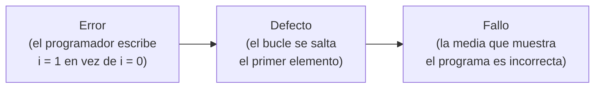
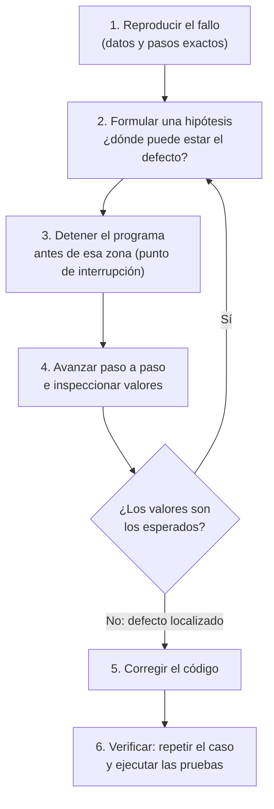

---
tags:
  - entornos-de-desarrollo
  - DAM1
  - depuracion
  - analisis-de-codigo
unidad: 4
tema: Depuración y análisis de código — depurador, puntos de interrupción, inspecciones, análisis estático y contratos de código
---

# Unidad 4. Depuración y análisis de código

> [!abstract] Objetivos de la unidad
> - Distinguir entre errores de compilación, de ejecución y lógicos, e interpretar una traza de la pila.
> - Explicar qué es la depuración y qué aporta un depurador frente a imprimir valores por pantalla.
> - Utilizar puntos de interrupción simples, condicionales, de seguimiento y de vigilancia.
> - Controlar la ejecución paso a paso e inspeccionar variables, expresiones y la pila de llamadas.
> - Depurar programas en VS Code y con los depuradores de línea de órdenes (`jdb`, `gdb`, `pdb`).
> - Diferenciar el análisis estático del dinámico y clasificar sus diagnósticos en errores, advertencias y mensajes.
> - Configurar analizadores y conjuntos de reglas para Java, C, Python y C#.
> - Aplicar el diseño por contrato mediante precondiciones, postcondiciones y aserciones con las herramientas actuales.

---

## 1. Introducción

Ningún programa de cierta complejidad funciona a la primera. Una parte importante del tiempo de desarrollo se dedica a **encontrar y corregir errores**, y la diferencia entre hacerlo en minutos o en horas depende, sobre todo, de conocer las herramientas adecuadas. Esta unidad trata dos de ellas:

| Herramienta | Pregunta a la que responde | Momento |
|---|---|---|
| **Depurador** | ¿Qué está haciendo realmente el programa mientras se ejecuta? | Con el programa en ejecución |
| **Analizador de código** | ¿Qué partes del código son sospechosas, aunque compilen? | Sin ejecutar el programa |

Ambas se complementan con las **pruebas**, que comprueban de forma sistemática que el programa hace lo que debe y se estudian en la [Unidad 5](05-diseno-y-ejecucion-de-pruebas.md).

### 1.1. Error, defecto y fallo

En el lenguaje cotidiano se usa «error» para todo, pero en ingeniería del *software* se distinguen tres conceptos encadenados:

> [!note] Definición: error (equivocación)
> Acción humana incorrecta: el programador se equivoca al escribir, al interpretar un requisito o al diseñar.

> [!note] Definición: defecto (*bug*)
> Deficiencia en el código, consecuencia de un error, que puede provocar un comportamiento incorrecto.

> [!note] Definición: fallo
> Comportamiento incorrecto observable del programa en ejecución, causado por un defecto.



Un defecto puede permanecer oculto mucho tiempo si nunca se ejecuta la parte del código que lo contiene, o si los datos de entrada no lo ponen de manifiesto.

### 1.2. Tipos de errores según cuándo se manifiestan

| Tipo | Cuándo aparece | Ejemplo | Quién lo detecta |
|---|---|---|---|
| **De compilación** | Al compilar | Falta un `;`, tipos incompatibles | El compilador (véase la [Unidad 1](01-desarrollo-de-software.md)) |
| **De ejecución** | Al ejecutar, interrumpe el programa | División entre cero, índice fuera de rango, referencia nula | La máquina virtual o el sistema operativo, que lanzan una excepción |
| **Lógico** | Al ejecutar, sin interrumpir nada | Una media mal calculada, una condición invertida | **Nadie automáticamente**: el programador, con pruebas y el depurador |

> [!important] Los errores lógicos son los más peligrosos
> El programa compila y termina con normalidad, pero produce resultados incorrectos. Solo se descubren comparando el resultado con el esperado (pruebas) y se localizan observando la ejecución (depurador).

### 1.3. Leer una traza de la pila

Cuando se produce un error de ejecución, Java (y la mayoría de lenguajes) muestra una **traza de la pila** (*stack trace*): el tipo de excepción, su mensaje y la cadena de llamadas que llevó hasta ella.

```text
Exception in thread "main" java.lang.IllegalArgumentException: Importe no válido: 500.0
	at Cuenta.retirar(Cuenta.java:19)
	at Cuenta.main(Cuenta.java:35)
```

| Parte | Significado |
|---|---|
| `java.lang.IllegalArgumentException` | Tipo de excepción |
| `Importe no válido: 500.0` | Mensaje que describe el problema |
| `at Cuenta.retirar(Cuenta.java:19)` | **Dónde se produjo**: método `retirar`, línea 19 del fichero `Cuenta.java` |
| `at Cuenta.main(Cuenta.java:35)` | Quién llamó a ese método: `main`, línea 35 |

> [!tip] Cómo leerla
> Se lee **de arriba abajo**: la primera línea `at` indica el punto exacto del error, y las siguientes, el camino de llamadas que llevó hasta él. En programas grandes, la primera línea suele pertenecer a una biblioteca; conviene buscar la primera que corresponda a un fichero **propio** del proyecto. En VS Code, cada línea de la traza es un enlace al código.

---

## 2. La depuración

### 2.1. Concepto

> [!note] Definición: depuración (*debugging*)
> Proceso de identificar, localizar y corregir defectos de un programa mediante su **ejecución controlada**.

> [!note] Definición: depurador (*debugger*)
> Herramienta que permite ejecutar un programa de forma controlada: detenerlo en puntos concretos, avanzar instrucción a instrucción y consultar o modificar el valor de variables, objetos y expresiones en cada momento. Es uno de los componentes básicos de un IDE y, sin duda, una de sus herramientas más importantes.

Para que el depurador pueda relacionar el programa en ejecución con el código fuente (líneas, nombres de variables), el ejecutable debe incluir **información de depuración** (símbolos):

| Lenguaje | Cómo se incluye | Si no se incluye |
|---|---|---|
| Java | `javac -g` (VS Code lo hace automáticamente) | Por defecto `javac` guarda las líneas, pero no los nombres de las variables locales |
| C / C++ | `gcc -g`, preferiblemente con `-O0` (sin optimizar) | El depurador no muestra líneas ni variables |
| C# | Configuración *Debug* (por defecto en `dotnet build`) genera el fichero `.pdb` | Se depura con información limitada |
| Python | No hace falta: el intérprete ejecuta el código fuente | — |

> [!info] Configuraciones *Debug* y *Release*
> Los proyectos suelen tener dos configuraciones de compilación: ***Debug***, con información de depuración y sin optimizar (para desarrollar), y ***Release***, optimizada y sin símbolos (para distribuir). Una optimización agresiva puede reordenar o eliminar instrucciones, de modo que el depurador «salte» líneas o no muestre algunas variables.

### 2.2. El proceso de depuración



> [!tip] Reproducir antes de depurar
> Un fallo que no se puede reproducir no se puede depurar. El primer paso es siempre identificar los datos de entrada y las acciones exactas que lo provocan.

### 2.3. Depurador frente a mensajes por pantalla

| Técnica | Ventajas | Inconvenientes |
|---|---|---|
| Imprimir valores (`System.out.println`, `printf`, `print`) | Inmediata, no requiere herramientas | Hay que modificar el código, recompilar y acordarse de quitar los mensajes; solo muestra lo que se previó |
| **Depurador** | No modifica el código; permite consultar **cualquier** variable o expresión en cualquier momento y cambiar de hipótesis sobre la marcha | Requiere conocer la herramienta |
| Registro de sucesos (*logging*: `java.util.logging`, Log4j, `logging` de Python) | Queda en el programa con niveles (DEBUG, INFO, ERROR); útil en producción, donde no se puede depurar | Hay que configurarlo |

---

## 3. Herramientas del depurador

### 3.1. Puntos de interrupción

> [!note] Definición: punto de interrupción (*breakpoint*)
> Marca situada en una línea del código fuente para que el depurador **detenga la ejecución** al llegar a ella, antes de ejecutarla, mostrando el estado actual del programa. También se denomina punto de ruptura o de parada.

- Se pueden colocar tantos como se desee; resulta muy útil cuando se depura un error con una larga **pila de llamadas**.
- En VS Code se colocan haciendo clic en el margen izquierdo de la línea (aparece un punto rojo) o con `F9`. Pueden desactivarse temporalmente sin borrarlos desde la vista *Puntos de interrupción*.

### 3.2. Ejecución paso a paso

Una vez detenido el programa, se controla su avance:

| Acción | Efecto | VS Code / Visual Studio | `jdb` (Java) | `gdb` (C/C++) | `pdb` (Python) |
|---|---|---|---|---|---|
| Iniciar / Continuar | Ejecuta hasta el siguiente punto de interrupción | `F5` | `run` / `cont` | `run` / `continue` | `c` |
| **Paso a paso por procedimientos** (*step over*) | Ejecuta la línea actual; si contiene una llamada, la ejecuta entera sin entrar | `F10` | `next` | `next` | `n` |
| **Paso a paso por instrucciones** (*step into*) | Si la línea contiene una llamada, entra en el método | `F11` | `step` | `step` | `s` |
| **Paso a paso para salir** (*step out*) | Termina el método actual y vuelve a quien lo llamó | `Shift+F11` | `step up` | `finish` | `r` |
| Reiniciar | Vuelve a empezar la ejecución | `Ctrl+Shift+F5` | — | `run` | `restart` |
| Detener | Finaliza la depuración | `Shift+F5` | `exit` | `kill` / `quit` | `q` |

> [!tip] ¿*Step over* o *step into*?
> Se usa *step over* (`F10`) para avanzar por el método que se está estudiando, y *step into* (`F11`) solo cuando se sospecha que el defecto está **dentro** del método llamado. Entrar en todos los métodos lleva a recorrer código de bibliotecas que no interesa. Si se entra por error, *step out* (`Shift+F11`) devuelve al punto de llamada.

### 3.3. La pila de llamadas

> [!note] Definición: pila de llamadas (*call stack*)
> Lista de los métodos que están en ejecución en un momento dado, desde el actual (arriba) hasta el punto de entrada `main` (abajo). Cada nivel se denomina **marco** (*frame*) y tiene sus propias variables locales.

En el depurador, seleccionar un marco de la pila permite ver las variables de ese método y la línea desde la que llamó al siguiente. Es el equivalente «en vivo» de la traza del apartado 1.3.

### 3.4. Variables, inspecciones y consola de depuración

Durante la depuración es importante conocer el valor de las variables, las propiedades de los objetos, los elementos de las colecciones o el resultado de una condición.

| Elemento | Qué muestra | Ejemplo de uso |
|---|---|---|
| **Variables** | Las variables locales y los parámetros del marco actual, actualizados en cada paso | Ver cómo cambia `suma` en cada vuelta del bucle |
| **Inspecciones** (*watch*) | Expresiones elegidas por el programador, evaluadas en cada paso | Vigilar `pesos[i] / 100`, `lista.size()` o una condición que no existe en el código |
| **Consola de depuración** | Evalúa cualquier expresión **en el momento actual** | Probar una hipótesis: `(double) suma / notas.length` |

> [!note] Definición: inspección (*watch*)
> Expresión que el depurador evalúa y muestra de forma permanente mientras se avanza por el programa. Puede ser una variable del código o una expresión nueva creada por el programador, como una condición que no aparece en el programa o la propiedad de una instancia concreta.

> [!tip] Modificar valores
> La mayoría de depuradores permiten **cambiar el valor de una variable** durante la ejecución (en VS Code, doble clic sobre ella en la vista *Variables*). Sirve para comprobar si el programa funcionaría con otro valor sin tener que reiniciarlo.

### 3.5. Puntos de interrupción avanzados

Los puntos de interrupción pueden personalizarse para detenerse solo cuando interesa, algo especialmente útil dentro de **bucles** que se repiten cientos de veces:

| Tipo | Se detiene cuando… | Cómo se crea en VS Code |
|---|---|---|
| **Condicional** | Se cumple una expresión booleana (`i == 500`, `cliente == null`) | Clic derecho en el margen → *Add Conditional Breakpoint* → *Expression* |
| **De recuento** (*hit count*) | Se ha alcanzado un número de veces | Ídem → *Hit Count* |
| **De excepción** | Se lanza una excepción (todas o solo las no capturadas) | Vista *Puntos de interrupción* → *Uncaught Exceptions* / *Caught Exceptions* |
| **De función** | Se entra en un método por su nombre, sin buscar la línea | Vista *Puntos de interrupción* → `+` → nombre del método |

> [!info] En Visual Studio
> El material indica que la condición se añade con clic derecho sobre el punto de interrupción → *Condición*. En las versiones actuales de Visual Studio la opción se llama *Condiciones…* y permite además filtros por hilo o proceso.

### 3.6. Puntos de seguimiento

> [!note] Definición: punto de seguimiento (*tracepoint* o *logpoint*)
> Variante del punto de interrupción que **no detiene** el programa: cada vez que se alcanza, escribe un mensaje en la consola de depuración. Sirve para seguir la evolución de valores o contar ejecuciones de una línea sin interrumpir la ejecución y sin modificar el código.

En VS Code se crean con clic derecho en el margen → *Add Logpoint*; aparecen como un rombo. El mensaje puede incluir expresiones entre llaves:

```text
Vuelta {i}: suma = {suma}
```

### 3.7. Puntos de vigilancia

> [!note] Definición: punto de vigilancia (*watchpoint* o *data breakpoint*)
> Punto de interrupción asociado a una **variable**, no a una línea: el programa se detiene cada vez que su valor cambia. Es la herramienta ideal cuando se sabe que una variable acaba con un valor incorrecto pero no se sabe dónde se modifica.

Está disponible en `gdb` (orden `watch`), en `jdb` para atributos (`watch Clase.atributo`) y en VS Code para los lenguajes que lo admiten (clic derecho sobre la variable en la vista *Variables* → *Break on Value Change*).

### 3.8. Puntos de interrupción en el propio código

El material menciona que los puntos de interrupción también pueden colocarse **de forma manual**, lo que resulta útil cuando no es posible lanzar la depuración desde el IDE (por ejemplo, un *script* que se ejecuta desde otro programa). Se escribe una instrucción en el código que, al ejecutarse, cede el control al depurador:

| Lenguaje | Instrucción |
|---|---|
| Python | `breakpoint()` |
| C# | `System.Diagnostics.Debugger.Break();` |
| JavaScript | `debugger;` |

> [!warning] Retirarlos antes de confirmar
> Un `breakpoint()` olvidado detiene el programa en producción. Deben eliminarse antes de hacer *commit*; los analizadores de código suelen avisar de ellos.

---

## 4. Depuración en la práctica

### 4.1. Visual Studio Code

La depuración se inicia con `F5` o desde la vista *Ejecución y depuración* (`Ctrl+Shift+D`). Si el proyecto tiene un fichero `.vscode/launch.json` (véase la [Unidad 2](02-entornos-de-desarrollo-integrados.md)), se usa su configuración; si no, VS Code propone una por defecto según el lenguaje.

| Lenguaje | Extensión que aporta el depurador | Requisito |
|---|---|---|
| Java | *Debugger for Java* (incluida en *Extension Pack for Java*) | JDK |
| C / C++ | *C/C++* (Microsoft) | `gdb` (Linux, MinGW en Windows) o `lldb` (macOS); compilar con `-g` |
| Python | *Python Debugger* (debugpy) | Intérprete de Python |
| C# | *C# Dev Kit* | SDK de .NET |

Durante la depuración, VS Code muestra:

| Zona | Contenido |
|---|---|
| Barra flotante de depuración | Continuar, *step over*, *step into*, *step out*, reiniciar y detener |
| *Variables* | Variables locales y globales del marco actual |
| *Inspección* (*Watch*) | Expresiones añadidas con `+` |
| *Pila de llamadas* (*Call Stack*) | Hilos y marcos; clic para cambiar de marco |
| *Puntos de interrupción* (*Breakpoints*) | Lista de puntos, activación y puntos de excepción |
| *Consola de depuración* | Salida de los *logpoints* y evaluación de expresiones |
| Valores en línea | Al pasar el ratón sobre una variable del editor, se muestra su valor |

### 4.2. Java con `jdb`

`jdb` es el depurador de línea de órdenes incluido en el JDK. Aunque en el día a día se usa el depurador gráfico del IDE, `jdb` muestra con claridad qué hace un depurador internamente, y es útil en servidores sin interfaz gráfica.

El siguiente programa debería mostrar una media de 6,25, pero muestra 5,0:

```java
// Notas.java
public class Notas {

    // Calcula la media aritmética de las notas
    static double media(int[] notas) {
        int suma = 0;
        for (int i = 1; i < notas.length; i++) {
            suma += notas[i];
        }
        return suma / notas.length;
    }

    public static void main(String[] args) {
        int[] notas = {4, 7, 8, 6};
        System.out.println("Media: " + media(notas));
    }
}
```

```text
Media: 5.0
```

> [!info] Numeración de líneas
> En todos los ejemplos, la primera línea del fichero es el comentario con su nombre (`// Notas.java`), de modo que los números de línea de las salidas coinciden con los del código tal como aparece. Aquí, `suma += notas[i];` es la línea 8.

Se compila con información de depuración y se lanza `jdb`. Las órdenes que escribe el usuario aparecen tras los indicadores `>` y `main[1]`:

```bash
javac -g Notas.java
jdb -classpath . Notas
```

```text
Initializing jdb ...
> stop at Notas:8
Deferring breakpoint Notas:8.
It will be set after the class is loaded.
> run
run Notas
Set uncaught java.lang.Throwable
Set deferred uncaught java.lang.Throwable
>
VM Started: Set deferred breakpoint Notas:8

Breakpoint hit: "thread=main", Notas.media(), line=8 bci=10
8                suma += notas[i];

main[1] where
  [1] Notas.media (Notas.java:8)
  [2] Notas.main (Notas.java:15)
main[1] locals
Method arguments:
notas = instance of int[4] (id=449)
Local variables:
suma = 0
i = 1
main[1] print notas[0]
 notas[0] = 4
```

Al detenerse por **primera vez** dentro del bucle, `i` ya vale `1`: el elemento `notas[0]` (un 4) nunca se suma. `where` muestra la pila de llamadas: `media` fue llamada desde `main`, línea 15. Se continúa para comprobar la suma final:

```text
main[1] clear Notas:8
Removed: breakpoint Notas:8
main[1] stop at Notas:10
Set breakpoint Notas:10
main[1] cont
>
Breakpoint hit: "thread=main", Notas.media(), line=10 bci=22
10            return suma / notas.length;

main[1] print suma
 suma = 21
main[1] eval suma / notas.length
 suma / notas.length = 5
```

Se han localizado **dos defectos**: el bucle empieza en 1 en lugar de en 0 (la suma es 21 y no 25) y `suma / notas.length` es una **división entera** entre dos `int`, que descarta los decimales. La corrección es:

```java
        for (int i = 0; i < notas.length; i++) {
            suma += notas[i];
        }
        return (double) suma / notas.length;
```

```text
Media: 6.25
```

| Orden de `jdb` | Efecto |
|---|---|
| `stop at Clase:línea` / `stop in Clase.método` | Punto de interrupción en una línea / al entrar en un método |
| `clear Clase:línea` | Elimina un punto de interrupción |
| `run` / `cont` | Inicia / continúa la ejecución |
| `next` / `step` / `step up` | *Step over* / *step into* / *step out* |
| `locals` | Parámetros y variables locales |
| `print expr` / `eval expr` / `dump objeto` | Evalúa una expresión / muestra todos los atributos de un objeto |
| `where` | Pila de llamadas |
| `catch java.lang.Exception` | Se detiene cuando se lanza esa excepción |
| `watch Clase.atributo` | Punto de vigilancia sobre un atributo |
| `exit` | Termina |

> [!warning] Compilar sin `-g`
> Si se compila con `javac` sin `-g`, al pedir las variables locales `jdb` responde: `Local variable information not available.  Compile with -g to generate variable information`.

### 4.3. C con `gdb`: puntos condicionales y de vigilancia

La siguiente función devuelve la temperatura máxima de un vector, pero con temperaturas bajo cero devuelve 0:

```c
// temperaturas.c
#include <stdio.h>

/* Devuelve la temperatura máxima de un vector */
int maxima(const int t[], int n) {
    int max = 0;
    for (int i = 0; i < n; i++) {
        if (t[i] > max) {
            max = t[i];
        }
    }
    return max;
}

int main(void) {
    int enero[] = {-5, -2, -8, -1, -3};
    printf("Máxima de enero: %d\n", maxima(enero, 5));
    return 0;
}
```

```bash
gcc -g -O0 temperaturas.c -o temperaturas
./temperaturas
```

```text
Máxima de enero: 0
```

Se depura con `gdb`, deteniéndose solo en la **cuarta vuelta** del bucle (`i == 3`, la del valor −1, que debería ser el máximo) mediante un punto de interrupción **condicional**:

```text
(gdb) break 8 if i == 3
Breakpoint 1 at 0x1188: file temperaturas.c, line 8.
(gdb) run

Breakpoint 1, maxima (t=0x7fffffffa940, n=5) at temperaturas.c:8
8	        if (t[i] > max) {
(gdb) print t[i]
$1 = -1
(gdb) print max
$2 = 0
(gdb) info locals
i = 3
max = 0
(gdb) backtrace
#0  maxima (t=0x7fffffffa940, n=5) at temperaturas.c:8
#1  0x000055555555521c in main () at temperaturas.c:17
```

Tras tres vueltas, `max` sigue valiendo `0`: como ninguna temperatura supera 0, nunca cambia. Para confirmarlo se sustituye el punto de interrupción por un **punto de vigilancia** sobre `max`:

```text
(gdb) delete
(gdb) watch max
Hardware watchpoint 2: max
(gdb) continue

Watchpoint 2 deleted because the program has left the block in
which its expression is valid.
0x000055555555521c in main () at temperaturas.c:17
17	    printf("Máxima de enero: %d\n", maxima(enero, 5));
```

El punto de vigilancia no se activa ni una sola vez antes de que termine la función: `max` nunca se modifica. El defecto es el **valor inicial**, que debe ser el primer elemento del vector y no 0:

```c
    int max = t[0];
```

Con la corrección, el punto de vigilancia muestra cada cambio de `max`:

```text
(gdb) break maxima
Breakpoint 1 at 0x1178: file temperaturas.c, line 6.
(gdb) run

Breakpoint 1, maxima (t=0x7fffffffa940, n=5) at temperaturas.c:6
6	    int max = t[0];
(gdb) watch max
Hardware watchpoint 2: max
(gdb) continue

Hardware watchpoint 2: max

Old value = 0
New value = -5
maxima (t=0x7fffffffa940, n=5) at temperaturas.c:7
7	    for (int i = 0; i < n; i++) {
(gdb) continue

Hardware watchpoint 2: max

Old value = -5
New value = -2
```

```text
Máxima de enero: -1
```

> [!info] Detalles de la salida de `gdb`
> Las direcciones de memoria (`0x7fffffffa940`) varían de un equipo a otro y entre ejecuciones; lo mismo ocurre con los identificadores `id=` que muestra `jdb`. El primer `Old value = 0` es el contenido previo, sin inicializar, de la memoria de la variable. El depurador se detiene en la instrucción **siguiente** a la que modificó la variable, por eso indica la línea 7 (la cabecera del bucle).

| Orden de `gdb` | Efecto |
|---|---|
| `break línea` / `break función` | Punto de interrupción |
| `break línea if condición` | Punto de interrupción condicional |
| `watch variable` | Punto de vigilancia |
| `run` / `continue` | Inicia / continúa |
| `next` / `step` / `finish` | *Step over* / *step into* / *step out* |
| `print expr` / `display expr` | Evalúa una vez / en cada parada |
| `info locals` / `backtrace` | Variables locales / pila de llamadas |
| `delete` / `quit` | Borra los puntos / sale |

### 4.4. Python con `pdb`

En Python, la función `breakpoint()` detiene el programa y abre el depurador `pdb` en el terminal:

```python
# descuentos.py
def precio_final(precio, porcentaje):
    descuento = precio * porcentaje / 100
    breakpoint()          # punto de interrupción escrito en el propio código
    return precio - descuento


print(precio_final(80, 25))
```

```text
$ python3 descuentos.py
> /home/ana/proyectos/tienda/descuentos.py(5)precio_final()
-> return precio - descuento
(Pdb) p precio, porcentaje, descuento
(80, 25, 20.0)
(Pdb) ll
  2  	def precio_final(precio, porcentaje):
  3  	    descuento = precio * porcentaje / 100
  4  	    breakpoint()          # punto de interrupción escrito en el propio código
  5  ->	    return precio - descuento
(Pdb) n
--Return--
> /home/ana/proyectos/tienda/descuentos.py(5)precio_final()->60.0
-> return precio - descuento
(Pdb) c
60.0
```

| Orden de `pdb` | Efecto |
|---|---|
| `p expr` / `pp expr` | Evalúa / evalúa con formato legible |
| `ll` | Muestra el código de la función actual; `->` marca la línea siguiente |
| `n` / `s` / `r` | *Step over* / *step into* / *step out* (hasta el `return`) |
| `b línea` / `b línea, condición` | Punto de interrupción / condicional |
| `w` | Pila de llamadas |
| `c` / `q` | Continúa / sale |

---

## 5. Análisis de código

### 5.1. Concepto

Una de las tareas más importantes durante el desarrollo es asegurarse de que el código funcionará correctamente. Muchos problemas no son evidentes a simple vista: un texto comparado con `==`, una variable sin inicializar, un índice que se sale del vector. Los **analizadores de código** los identifican en tiempo real, mientras se escribe.

> [!note] Definición: análisis estático
> Revisión automática del código fuente **sin ejecutarlo**, en busca de defectos probables, malas prácticas, incumplimientos de estilo y vulnerabilidades. Lo realizan el compilador (avisos) y herramientas específicas llamadas **analizadores** o ***linters***.

> [!note] Definición: análisis dinámico
> Revisión del programa **mientras se ejecuta**: depuración, pruebas, medición de rendimiento o detección de accesos indebidos a memoria.

| | Análisis estático | Análisis dinámico |
|---|---|---|
| Ejecuta el programa | No | Sí |
| Cuándo | Mientras se escribe o al compilar | Al ejecutar o probar |
| Cubre | Todo el código, incluido el que nunca se ejecuta | Solo los caminos que se ejecutan |
| Detecta | Patrones sospechosos, estilo, posibles nulos | Fallos reales con datos concretos |
| Inconveniente | **Falsos positivos**: avisos que no son problemas reales | Si un caso no se ejecuta, su defecto no aparece |
| Herramientas | Avisos del compilador, Checkstyle, cppcheck, Ruff, analizadores de .NET, SonarQube | Depurador, pruebas, perfiladores, *sanitizers* |

### 5.2. Niveles de diagnóstico

El analizador comunica sus hallazgos con distintos niveles de gravedad, que el material agrupa en tres: **errores**, **advertencias** y **mensajes**.

| Nivel | Significado | Efecto | Ejemplos de nombre en cada herramienta |
|---|---|---|---|
| **Error** | Fallo seguro o casi seguro | Puede impedir la compilación | `error` (compiladores, Checkstyle, cppcheck), `E` (Pylint) |
| **Advertencia** | Problema probable o mala práctica | No impide compilar | `warning` (compiladores), `WARN` (Checkstyle), `W` (Pylint) |
| **Mensaje** | Sugerencia de estilo o mejora | Informativo | `info` / `suggestion` (Checkstyle, .NET), `style` (cppcheck), `C` y `R` (Pylint) |

> [!info] Matiz respecto al material
> El material indica que el analizador muestra en la ventana de errores los fallos de compilación. Estrictamente, esos errores los detecta el **compilador**; el analizador añade diagnósticos sobre código que **sí compila**. Los IDE muestran ambos juntos en la misma lista (*Lista de errores* en Visual Studio, panel *Problemas* en VS Code).

> [!note] Definición: conjunto de reglas (*rule set*)
> Configuración que indica qué comprobaciones aplica un analizador y con qué gravedad. Se guarda en un fichero del proyecto (`checkstyle.xml`, `.editorconfig`, `pyproject.toml`…) para que todo el equipo use las mismas reglas.

### 5.3. Avisos del compilador

El primer analizador está ya instalado: el propio compilador. Por defecto muestra pocos avisos, pero puede activarse un análisis mucho más estricto.

#### 5.3.1. Java: `javac -Xlint`

```java
// Inventario.java
import java.util.*;

public class Inventario {

    public static void main(String[] args) {
        List productos = new ArrayList();        // lista sin tipo genérico
        productos.add("teclado");

        int unidades = 120;
        String estado = args.length > 0 ? args[0] : "OK";

        if (estado == "OK") {                    // compara referencias, no texto
            System.out.println("Stock correcto");
        }

        switch (unidades / 100) {
            case 0:
                System.out.println("Pocas unidades");
            case 1:
                System.out.println("Unidades suficientes");
                break;
            default:
                System.out.println("Exceso de stock");
        }
    }
}
```

Sin opciones, `javac` solo muestra una nota genérica:

```text
Note: Inventario.java uses unchecked or unsafe operations.
Note: Recompile with -Xlint:unchecked for details.
```

Con `-Xlint:all` activa todos sus avisos:

```bash
javac -Xlint:all Inventario.java
```

```text
Inventario.java:7: warning: [rawtypes] found raw type: List
        List productos = new ArrayList();        // lista sin tipo genérico
        ^
  missing type arguments for generic class List<E>
  where E is a type-variable:
    E extends Object declared in interface List
Inventario.java:7: warning: [rawtypes] found raw type: ArrayList
        List productos = new ArrayList();        // lista sin tipo genérico
                             ^
  missing type arguments for generic class ArrayList<E>
  where E is a type-variable:
    E extends Object declared in class ArrayList
Inventario.java:8: warning: [unchecked] unchecked call to add(E) as a member of the raw type List
        productos.add("teclado");
                     ^
  where E is a type-variable:
    E extends Object declared in interface List
Inventario.java:20: warning: [fallthrough] possible fall-through into case
            case 1:
            ^
4 warnings
```

El compilador avisa de la lista sin tipo (debería ser `List<String>`) y del `case 0` sin `break`, que continuaría ejecutando el `case 1`. **No avisa** de `estado == "OK"`, y ese es el defecto más grave del programa:

```bash
java Inventario        # sin argumentos
java Inventario OK     # con el argumento "OK"
```

```text
Stock correcto
Unidades suficientes
Unidades suficientes
```

Con el mismo valor `"OK"`, el programa se comporta distinto según de dónde proceda el texto: `==` compara si son **el mismo objeto** en memoria, no si tienen el mismo contenido. Los textos se comparan con `estado.equals("OK")`.

#### 5.3.2. C: `gcc -Wall -Wextra`

```c
// ventas.c
#include <stdio.h>

int main(void) {
    int ventas[5] = {120, 90, 75, 200, 160};
    int total;
    int dias;

    for (int i = 0; i <= 5; i++) {
        total += ventas[i];
    }

    if (dias = 0) {
        printf("Sin datos\n");
    }
    printf("Total: %d\n", total);
    return 0;
}
```

`gcc ventas.c` compila **sin ningún aviso**. Con `-Wall -Wextra` (y `-O2`, que permite al compilador un análisis más profundo):

```bash
gcc -Wall -Wextra -O2 ventas.c -o ventas
```

```text
ventas.c: In function ‘main’:
ventas.c:13:9: warning: suggest parentheses around assignment used as truth value [-Wparentheses]
   13 |     if (dias = 0) {
      |         ^~~~
ventas.c:10:24: warning: iteration 5 invokes undefined behavior [-Waggressive-loop-optimizations]
   10 |         total += ventas[i];
      |                  ~~~~~~^~~
ventas.c:9:23: note: within this loop
    9 |     for (int i = 0; i <= 5; i++) {
      |                     ~~^~~~
ventas.c:10:15: warning: ‘total’ is used uninitialized [-Wuninitialized]
   10 |         total += ventas[i];
      |         ~~~~~~^~~~~~~~~~~~
ventas.c:6:9: note: ‘total’ was declared here
    6 |     int total;
      |         ^~~~~
```

Se detectan los tres defectos: la asignación `=` usada como comparación `==`, el acceso a `ventas[5]` (el vector solo tiene posiciones de 0 a 4) y `total` sin inicializar. Ejecutado dos veces, el programa sin corregir muestra **un resultado distinto cada vez**, señal típica de comportamiento indefinido:

```text
Total: 33412
Total: 33410
```

(Los valores concretos cambian en cada equipo y en cada ejecución.)

> [!tip] Avisos como errores
> Se recomienda compilar siempre con `-Wall -Wextra` en C/C++ y con `-Xlint:all` en Java. En proyectos estrictos se añade `-Werror` (gcc) o `-Werror` (javac), que convierte los avisos en errores e impide compilar hasta corregirlos.

### 5.4. Analizadores específicos

Los compiladores solo detectan una parte de los problemas. Los analizadores específicos aplican cientos de reglas adicionales y se integran en el IDE, subrayando el código mientras se escribe.

| Lenguaje | Analizadores habituales | Extensión de VS Code |
|---|---|---|
| Java | **Checkstyle** (estilo y malas prácticas), SpotBugs y PMD (defectos probables) | *Checkstyle for Java*; *SonarQube for IDE* |
| C / C++ | **cppcheck**, clang-tidy | *C/C++* (clang-tidy integrado) |
| Python | **Ruff**, Pylint, mypy (tipos) | *Ruff*; *Pylint* |
| C# | **Analizadores de .NET** (incluidos en el SDK) | *C# Dev Kit* |
| Varios | **SonarQube** (servidor de calidad) y *SonarQube for IDE* (antes SonarLint) | *SonarQube for IDE* |

#### 5.4.1. Java: Checkstyle con un conjunto de reglas propio

Checkstyle se descarga como un único `.jar` (`checkstyle-<versión>-all.jar`) desde su repositorio en GitHub, o se usa desde la extensión de VS Code. Su comportamiento se define en un fichero XML; el siguiente reproduce la idea del material de crear un **conjunto de reglas personalizado** que separa errores, advertencias y mensajes:

```xml
<?xml version="1.0"?>
<!DOCTYPE module PUBLIC
    "-//Checkstyle//DTD Checkstyle Configuration 1.3//EN"
    "https://checkstyle.org/dtds/configuration_1_3.dtd">

<!-- Conjunto de reglas propio del proyecto -->
<module name="Checker">
    <module name="TreeWalker">
        <!-- Errores: fallos casi seguros -->
        <module name="StringLiteralEquality">     <!-- comparar textos con == -->
            <property name="severity" value="error"/>
        </module>
        <module name="FallThrough">               <!-- case sin break -->
            <property name="severity" value="error"/>
        </module>
        <!-- Advertencias: malas prácticas -->
        <module name="MagicNumber">               <!-- números mágicos -->
            <property name="severity" value="warning"/>
        </module>
        <module name="MethodLength">              <!-- métodos de más de 30 líneas -->
            <property name="max" value="30"/>
            <property name="severity" value="warning"/>
        </module>
        <!-- Mensajes informativos: estilo -->
        <module name="AvoidStarImport">           <!-- import java.util.*; -->
            <property name="severity" value="info"/>
        </module>
    </module>
</module>
```

```bash
java -jar checkstyle-<versión>-all.jar -c reglas-checkstyle.xml Inventario.java
```

```text
Starting audit...
[INFO] Inventario.java:2:17: Using the '.*' form of import should be avoided - java.util.*. [AvoidStarImport]
[WARN] Inventario.java:10:24: '120' is a magic number. [MagicNumber]
[ERROR] Inventario.java:13:20: Literal Strings should be compared using equals(), not '=='. [StringLiteralEquality]
[WARN] Inventario.java:17:28: '100' is a magic number. [MagicNumber]
[ERROR] Inventario.java:20:13: Fall through from previous branch of the switch statement. [FallThrough]
Audit done.
Checkstyle ends with 2 errors.
```

Ahora sí se detecta la comparación con `==`. Cada línea indica el nivel, el fichero, la línea y la columna, el problema y, entre corchetes, la regla que lo detecta. (Checkstyle muestra la ruta completa del fichero; aquí se ha abreviado.)

> [!tip] Conjuntos de reglas predefinidos
> Checkstyle incluye dos configuraciones completas listas para usar: `sun_checks.xml` (convenciones de Sun/Oracle) y `google_checks.xml` (guía de estilo de Google). Es habitual partir de una de ellas y desactivar las reglas que no interesen.

#### 5.4.2. C: cppcheck

```bash
cppcheck --enable=warning,style ventas.c
```

```text
Checking ventas.c ...
ventas.c:10:24: error: Array 'ventas[5]' accessed at index 5, which is out of bounds. [arrayIndexOutOfBounds]
        total += ventas[i];
                       ^
ventas.c:9:23: note: Assuming that condition 'i<=5' is not redundant
    for (int i = 0; i <= 5; i++) {
                      ^
ventas.c:10:24: note: Array index out of bounds
        total += ventas[i];
                       ^
ventas.c:13:14: style: Condition 'dias=0' is always false [knownConditionTrueFalse]
    if (dias = 0) {
             ^
ventas.c:5:9: style: Variable 'ventas' can be declared as const array [constVariable]
    int ventas[5] = {120, 90, 75, 200, 160};
        ^
ventas.c:10:9: error: Uninitialized variable: total [legacyUninitvar]
        total += ventas[i];
        ^
ventas.c:13:14: style: Variable 'dias' is assigned a value that is never used. [unreadVariable]
    if (dias = 0) {
             ^
```

cppcheck clasifica como **error** el acceso fuera del vector y la variable sin inicializar, y como mensaje de **estilo** la condición que siempre es falsa y la variable que podría ser `const`.

#### 5.4.3. Python: Ruff y Pylint

```python
# alumnos.py
import os


def anadir_alumno(nombre, lista=[]):
    lista.append(nombre)
    return lista


def buscar(alumnos, nombre):
    for a in alumnos:
        if a == nombre:
            resultado = a
    return resultado


def nota_media(notas):
    try:
        return sum(notas) / len(notas)
    except:
        return None


print(anadir_alumno("Ana"))
print(anadir_alumno("Luis"))
print(buscar(["Ana"], "Pau"))
```

```bash
pylint alumnos.py
```

```text
************* Module alumnos
alumnos.py:1:0: C0114: Missing module docstring (missing-module-docstring)
alumnos.py:5:0: C0116: Missing function or method docstring (missing-function-docstring)
alumnos.py:5:0: W0102: Dangerous default value [] as argument (dangerous-default-value)
alumnos.py:10:0: C0116: Missing function or method docstring (missing-function-docstring)
alumnos.py:14:11: E0606: Possibly using variable 'resultado' before assignment (possibly-used-before-assignment)
alumnos.py:17:0: C0116: Missing function or method docstring (missing-function-docstring)
alumnos.py:20:4: W0702: No exception type(s) specified (bare-except)
alumnos.py:2:0: W0611: Unused import os (unused-import)

-----------------------------------
Your code has been rated at 2.94/10
```

La letra del código indica la gravedad: **E** (error), **W** (advertencia), **C** (convención) y **R** (refactorización). La ejecución confirma los dos defectos marcados con E y W0102:

```text
['Ana']
['Ana', 'Luis']
Traceback (most recent call last):
  File "/home/ana/proyectos/alumnos/alumnos.py", line 26, in <module>
    print(buscar(["Ana"], "Pau"))
          ^^^^^^^^^^^^^^^^^^^^^^
  File "/home/ana/proyectos/alumnos/alumnos.py", line 14, in buscar
    return resultado
           ^^^^^^^^^
UnboundLocalError: cannot access local variable 'resultado' where it is not associated with a value
```

La lista por defecto `[]` se crea **una sola vez** y se comparte entre llamadas (por eso la segunda llamada devuelve también «Ana»), y `resultado` no existe si el nombre no se encuentra.

**Ruff** es un analizador muy rápido que reúne en una sola herramienta las reglas de muchos otros. Con las familias de reglas E (estilo), F (errores) y B (defectos probables):

```bash
ruff check --select E,F,B alumnos.py
```

```text
F401 [*] `os` imported but unused
 --> alumnos.py:2:8
  |
1 | # alumnos.py
2 | import os
  |        ^^
  |
help: Remove unused import: `os`

B006 Do not use mutable data structures for argument defaults
 --> alumnos.py:5:33
  |
5 | def anadir_alumno(nombre, lista=[]):
  |                                 ^^
6 |     lista.append(nombre)
7 |     return lista
  |
help: Replace with `None`; initialize within function

E722 Do not use bare `except`
  --> alumnos.py:20:5
   |
18 |     try:
19 |         return sum(notas) / len(notas)
20 |     except:
   |     ^^^^^^
21 |         return None
   |

Found 3 errors.
[*] 1 fixable with the `--fix` option (1 hidden fix can be enabled with the `--unsafe-fixes` option).
```

> [!info] Corrección automática
> Muchos analizadores no solo avisan, sino que **corrigen**: `ruff check --fix` elimina el `import` sin usar. En VS Code, las correcciones aparecen como bombilla (`Ctrl+.`).

#### 5.4.4. C#: analizadores de .NET

El material describe el analizador estático de Visual Studio, configurado desde las propiedades del proyecto (pestaña *Análisis de código*) y con conjuntos de reglas como «Todas las reglas de Microsoft». Hoy esos analizadores (reglas **CA**, *Code Analysis*) vienen **incluidos en el SDK de .NET** y funcionan igual en Visual Studio, VS Code o al compilar con `dotnet build`. Se activan en el fichero del proyecto:

```xml
<Project Sdk="Microsoft.NET.Sdk">

  <PropertyGroup>
    <OutputType>Exe</OutputType>
    <TargetFramework>net8.0</TargetFramework>
    <ImplicitUsings>enable</ImplicitUsings>
    <Nullable>enable</Nullable>
    <!-- Activa el conjunto de reglas recomendado de los analizadores de .NET -->
    <AnalysisLevel>latest-recommended</AnalysisLevel>
  </PropertyGroup>

</Project>
```

| Valor de `AnalysisLevel` | Reglas activas |
|---|---|
| `latest-minimum` | Solo las imprescindibles |
| `latest-recommended` | Las recomendadas |
| `latest-all` | Todas (equivalente a «Todas las reglas de Microsoft») |

Con el siguiente código (que incluye además un contrato de código, tratado en el apartado 6):

```csharp
// Program.cs
using System.Diagnostics.Contracts;

Console.WriteLine(Pedido.Total(3, 12.5m));
Console.WriteLine(Pedido.Total(-2, 12.5m));

string? cliente = args.Length > 0 ? args[0] : null;
Console.WriteLine(cliente.ToUpper());

static class Pedido
{
    public static decimal Total(int unidades, decimal precio)
    {
        Contract.Requires(unidades > 0);              // precondición (contrato clásico)
        decimal total = unidades * precio;
        Contract.Ensures(Contract.Result<decimal>() >= 0); // postcondición
        return total;
    }

    public static bool EsGrande(string codigo)
    {
        return codigo.ToLower() == "xl";
    }
}
```

`dotnet build` muestra, entre otros, estos diagnósticos (resumidos):

```text
Program.cs(8,19): warning CS8602: Dereference of a possibly null reference.
Program.cs(8,19): warning CA1304: The behavior of 'string.ToUpper()' could vary based on the current user's locale settings. ...
Program.cs(22,16): warning CA1862: Prefer using 'string.Equals(string, StringComparison)' to perform a case-insensitive comparison, ...
```

`CS8602` avisa de que `cliente` puede ser `null` (gracias a `<Nullable>enable</Nullable>`), y las reglas CA, de comparaciones de texto que dependen del idioma del sistema. Y en efecto, al ejecutarlo sin argumentos:

```text
37.5
-25.0
Unhandled exception. System.NullReferenceException: Object reference not set to an instance of an object.
```

**Configurar el conjunto de reglas.** Los antiguos ficheros de conjunto de reglas (`.ruleset`) que describe el material se han sustituido por el fichero **`.editorconfig`**, en la raíz del proyecto, que ajusta la gravedad de cada diagnóstico:

```ini
# .editorconfig
# Conjunto de reglas del proyecto: ajusta la gravedad de cada diagnóstico
root = true

[*.cs]
# Las referencias nulas pasan a ser errores de compilación
dotnet_diagnostic.CS8602.severity = error

# Reglas de globalización: no aplican a esta aplicación de consola
dotnet_diagnostic.CA1304.severity = none
dotnet_diagnostic.CA1311.severity = none

# La comparación sin distinguir mayúsculas se deja como sugerencia
dotnet_diagnostic.CA1862.severity = suggestion
```

```text
Program.cs(8,19): error CS8602: Dereference of a possibly null reference.
Build FAILED.
```

Ahora la posible referencia nula **impide compilar**, y las reglas que no interesan han desaparecido. Los niveles disponibles son `error`, `warning`, `suggestion` (mensaje), `silent` y `none`.

### 5.5. Análisis dinámico de memoria

> [!info] *Sanitizers*
> Algunos defectos solo se confirman al ejecutar. En C/C++, compilar con `-fsanitize=address,undefined` añade comprobaciones que detienen el programa en el instante en que accede fuera de un vector o usa memoria liberada, indicando el fichero y la línea. Con `ventas.c`, el programa se detiene con `runtime error: index 5 out of bounds for type 'int [5]'`. En Java, C# y Python estas comprobaciones las hace siempre la máquina virtual (`ArrayIndexOutOfBoundsException`, `IndexError`).

---

## 6. Contratos de código

### 6.1. Diseño por contrato

Los **contratos de código** permiten expresar en el propio código las condiciones que deben cumplirse, de modo que se detecten automáticamente las situaciones problemáticas que se hayan previsto.

> [!note] Definición: precondición
> Condición que deben cumplir los **datos de entrada** (parámetros, estado del objeto) para que un método pueda ejecutarse correctamente. Si no se cumple, la culpa es de **quien llama**.

> [!note] Definición: postcondición
> Condición que debe cumplir el **resultado** del método (valor devuelto, nuevo estado) al terminar. Si no se cumple, la culpa es del **propio método**.

> [!note] Definición: invariante
> Condición que debe cumplirse **siempre** para un objeto, antes y después de cualquier método público (por ejemplo, el saldo de una cuenta nunca es negativo).

> [!note] Definición: aserción
> Instrucción que comprueba que una condición es verdadera en un punto del programa y lo detiene si no lo es. Expresa algo que el programador **da por seguro**; si falla, hay un defecto en el código.

### 6.2. Los *Code Contracts* del material

El material presenta la biblioteca `System.Diagnostics.Contracts` de .NET, con dos métodos principales:

| Método | Comprueba | Momento |
|---|---|---|
| `Contract.Requires(condición)` | Precondición: valores de los parámetros (entrada) | Al entrar en el método |
| `Contract.Ensures(condición)` | Postcondición: valor de retorno (salida), accesible con `Contract.Result<T>()` | Al salir del método |

> [!danger] Corrección del material: *Code Contracts* está obsoleto
> - Los nombres correctos son `Contract.Requires` y `Contract.Ensures` (no `Ensure`).
> - Para que lanzaran una excepción concreta se usaba `Contract.Requires<TExcepcion>(condición)`.
> - Funcionaban **solo con .NET Framework** y una herramienta adicional que reescribía el código compilado. El proyecto se abandonó y **no está soportado en .NET 5 ni posteriores**: las llamadas compilan, pero el compilador **las elimina** y no comprueban nada.
>
> Se comprueba con el ejemplo del apartado 5.4.4: `Pedido.Total(-2, 12.5m)` debería incumplir la precondición `unidades > 0` y, sin embargo, el programa muestra `-25.0` y continúa.

### 6.3. Contratos en C# actual

```csharp
// Program.cs
using System.Diagnostics;

Console.WriteLine(Pedido.Total(3, 12.5m));

string? cliente = args.Length > 0 ? args[0] : null;
Console.WriteLine(cliente?.ToUpperInvariant() ?? "(sin cliente)");

Console.WriteLine(Pedido.Total(-2, 12.5m));

static class Pedido
{
    public static decimal Total(int unidades, decimal precio)
    {
        // Precondiciones: se comprueban siempre y lanzan una excepción
        ArgumentOutOfRangeException.ThrowIfNegativeOrZero(unidades);
        ArgumentOutOfRangeException.ThrowIfNegative(precio);

        decimal total = unidades * precio;

        // Postcondición: solo se comprueba en la configuración Debug
        Debug.Assert(total >= 0, "El total no puede ser negativo");
        return total;
    }
}
```

```text
37.5
(sin cliente)
Unhandled exception. System.ArgumentOutOfRangeException: unidades ('-2') must be a non-negative and non-zero value. (Parameter 'unidades')
Actual value was -2.
```

| Necesidad | Herramienta actual en C# |
|---|---|
| Precondición sobre parámetros | Cláusulas de guarda: `ArgumentNullException.ThrowIfNull(x)`, `ArgumentOutOfRangeException.ThrowIfNegative(x)` (.NET 8+), o `if (...) throw new ArgumentException(...)` |
| Postcondición o invariante interna | `Debug.Assert(condición, mensaje)` (solo en *Debug*) |
| Evitar referencias nulas | Tipos de referencia anulables (`<Nullable>enable</Nullable>`, `string?`), comprobados por el compilador |
| Verificar el comportamiento | Pruebas unitarias (véase la [Unidad 5](05-diseno-y-ejecucion-de-pruebas.md)) |

### 6.4. Contratos en Java

Java no tiene una biblioteca de contratos, pero se aplican las mismas ideas con excepciones y aserciones:

```java
// Cuenta.java
import java.util.Objects;

public class Cuenta {
    private final String titular;
    private double saldo;

    public Cuenta(String titular, double saldoInicial) {
        // Precondiciones: se comprueban siempre
        this.titular = Objects.requireNonNull(titular, "El titular es obligatorio");
        if (saldoInicial < 0) {
            throw new IllegalArgumentException("Saldo inicial negativo: " + saldoInicial);
        }
        this.saldo = saldoInicial;
    }

    public void retirar(double importe) {
        if (importe <= 0 || importe > saldo) {
            throw new IllegalArgumentException("Importe no válido: " + importe);
        }
        double saldoAnterior = saldo;
        saldo -= importe;
        // Postcondición: solo se comprueba si se ejecuta con java -ea
        assert saldo == saldoAnterior - importe : "Saldo incorrecto tras retirar";
    }

    public double getSaldo() {
        return saldo;
    }

    public static void main(String[] args) {
        Cuenta c = new Cuenta("Ana", 100);
        c.retirar(30);
        System.out.println(c.titular + ": " + c.getSaldo());
        c.retirar(500);
    }
}
```

```text
Ana: 70.0
Exception in thread "main" java.lang.IllegalArgumentException: Importe no válido: 500.0
	at Cuenta.retirar(Cuenta.java:19)
	at Cuenta.main(Cuenta.java:35)
```

Esta es la traza analizada en el apartado 1.3: la precondición de `retirar` rechaza el importe y la excepción indica exactamente qué dato era incorrecto y dónde.

**Aserciones en Java.** La instrucción `assert condición : mensaje;` está **desactivada por defecto** y se activa con la opción `-ea` (*enable assertions*):

```java
// Aserto.java
public class Aserto {
    public static void main(String[] args) {
        int edad = -4;
        assert edad >= 0 : "La edad no puede ser negativa: " + edad;
        System.out.println("Edad: " + edad);
    }
}
```

```bash
java Aserto        # aserciones desactivadas
java -ea Aserto    # aserciones activadas
```

```text
Edad: -4
Exception in thread "main" java.lang.AssertionError: La edad no puede ser negativa: -4
	at Aserto.main(Aserto.java:5)
```

| | Precondición con excepción | Aserción (`assert`, `Debug.Assert`) |
|---|---|---|
| Se comprueba | **Siempre** | Solo en desarrollo (`-ea`, *Debug*) |
| Protege contra | Datos incorrectos de quien llama, del usuario o de ficheros | Defectos internos del propio código |
| Si falla | Excepción que puede capturarse y tratarse | El programa se detiene: hay un *bug* |
| Ejemplo | `if (importe <= 0) throw new IllegalArgumentException(...)` | `assert total >= 0;` |

> [!danger] No validar datos de entrada con `assert`
> Como las aserciones pueden estar desactivadas, nunca se usan para validar datos del usuario, parámetros públicos o ficheros: en producción no se comprobarían. Para eso están las precondiciones con excepción.

---

## 7. Errores frecuentes

> [!danger] Comparar textos con `==` en Java
> `==` compara si dos referencias apuntan al **mismo objeto**, no si el texto es igual. Puede funcionar en unas pruebas y fallar en otras, según de dónde provenga el texto. Se usa `equals()`.

> [!danger] División entera inadvertida
> En Java, C y C#, `int / int` da un `int`: `21 / 4` vale `5`. Si se quiere decimal, al menos un operando debe ser decimal: `(double) suma / n` o `suma / 4.0`. En Python 3, `/` siempre es división real (`//` es la entera).

> [!warning] Depurar código optimizado o sin símbolos
> Si el depurador salta líneas, no se detiene en los puntos de interrupción o no muestra variables, se está depurando un ejecutable sin información de depuración: hay que compilar con `-g` (y `-O0` en C) o en configuración *Debug*.

> [!warning] Ignorar los avisos
> Un aviso del compilador o del analizador no impide ejecutar, pero suele anunciar un fallo futuro. Se recomienda mantener el proyecto con **cero avisos**, de modo que cualquier aviso nuevo llame la atención.

> [!warning] Aplicar todas las reglas sin criterio
> Los analizadores generan **falsos positivos**. Cada aviso debe valorarse: si una regla no tiene sentido en el proyecto, se desactiva en el conjunto de reglas de forma documentada, en lugar de ignorar en bloque todos los avisos.

> [!warning] Dejar código de depuración
> Los `System.out.println` de prueba, los `breakpoint()` o el código comentado «por si acaso» deben eliminarse antes del *commit*.

> [!tip] Explicar el problema en voz alta
> Una técnica sorprendentemente eficaz, conocida como *rubber duck debugging*, consiste en explicar línea a línea a otra persona (o a un objeto) qué debería hacer el código. Al verbalizarlo, el programador suele detectar la suposición incorrecta.

---

## 8. Ejemplo integrador: un boletín de notas defectuoso

Se aplica el proceso completo (análisis estático, reproducción, depuración, corrección con contratos y verificación) a un programa que calcula la nota final ponderada de un alumno y su calificación.

### 8.1. El programa original

```java
// Boletin.java
import java.util.*;

public class Boletin {

    // Nota final ponderada: cada nota se multiplica por su peso (en %)
    static double notaFinal(double[] notas, int[] pesos) {
        double total = 0;
        for (int i = 0; i < notas.length; i++) {
            total += notas[i] * (pesos[i] / 100);
        }
        return total;
    }

    static String calificacion(double nota, String convocatoria) {
        if (convocatoria == "extraordinaria" && nota >= 5) {
            return "Aprobado (extraordinaria)";
        }
        if (nota > 5) {
            return "Aprobado";
        }
        return "Suspenso";
    }

    public static void main(String[] args) {
        double[] notas = {6.0, 8.0, 4.0};
        int[] pesos = {40, 40, 20};
        String convocatoria = args.length > 0 ? args[0] : "ordinaria";
        double nota = notaFinal(notas, pesos);
        System.out.printf(Locale.ROOT, "Nota final: %.2f -> %s%n", nota, calificacion(nota, convocatoria));
    }
}
```

El resultado esperado es 6 · 0,40 + 8 · 0,40 + 4 · 0,20 = 2,4 + 3,2 + 0,8 = **6,40 → Aprobado**.

### 8.2. Paso 1: análisis estático

`javac -g -Xlint:all Boletin.java` compila **sin ningún aviso**. Se aplica el conjunto de reglas de Checkstyle del apartado 5.4.1:

```text
Starting audit...
[INFO] Boletin.java:2:17: Using the '.*' form of import should be avoided - java.util.*. [AvoidStarImport]
[WARN] Boletin.java:10:45: '100' is a magic number. [MagicNumber]
[ERROR] Boletin.java:16:26: Literal Strings should be compared using equals(), not '=='. [StringLiteralEquality]
[WARN] Boletin.java:16:57: '5' is a magic number. [MagicNumber]
[WARN] Boletin.java:19:20: '5' is a magic number. [MagicNumber]
[WARN] Boletin.java:26:27: '6.0' is a magic number. [MagicNumber]
[WARN] Boletin.java:26:32: '8.0' is a magic number. [MagicNumber]
[WARN] Boletin.java:26:37: '4.0' is a magic number. [MagicNumber]
[WARN] Boletin.java:27:24: '40' is a magic number. [MagicNumber]
[WARN] Boletin.java:27:28: '40' is a magic number. [MagicNumber]
[WARN] Boletin.java:27:32: '20' is a magic number. [MagicNumber]
Audit done.
Checkstyle ends with 1 errors.
```

| Diagnóstico | Valoración |
|---|---|
| `StringLiteralEquality` (línea 16) | **Defecto real**: la convocatoria extraordinaria nunca se reconocerá. |
| `MagicNumber` en `100` y `5` | Mala práctica real: el significado (peso total, nota de aprobado) no es evidente. |
| `MagicNumber` en las líneas 26 y 27 | **Falso positivo**: son datos de prueba de `main`; en un programa real llegarían del usuario o de un fichero. |
| `AvoidStarImport` | Estilo. |

### 8.3. Paso 2: reproducir el fallo

```bash
java Boletin
java Boletin extraordinaria
```

```text
Nota final: 0.00 -> Suspenso
Nota final: 0.00 -> Suspenso
```

La nota es 0 en lugar de 6,40. El análisis estático no ha señalado nada en el cálculo, así que se recurre al depurador.

### 8.4. Paso 3: depurar

Hipótesis: el defecto está en el cálculo de `notaFinal`. Se detiene el programa en la línea 10, dentro del bucle, y se evalúa cada parte de la expresión por separado:

```text
> stop at Boletin:10
> run
Breakpoint hit: "thread=main", Boletin.notaFinal(), line=10 bci=12
10                total += notas[i] * (pesos[i] / 100);

main[1] locals
Method arguments:
notas = instance of double[3] (id=449)
pesos = instance of int[3] (id=450)
Local variables:
total = 0.0
i = 0
main[1] print notas[i]
 notas[i] = 6.0
main[1] print pesos[i]
 pesos[i] = 40
main[1] eval pesos[i] / 100
 pesos[i] / 100 = 0
main[1] eval notas[i] * pesos[i]
 notas[i] * pesos[i] = 240.0
main[1] next
Step completed: "thread=main", Boletin.notaFinal(), line=9 bci=28
9            for (int i = 0; i < notas.length; i++) {

main[1] print total
 total = 0.0
```

`pesos[i] / 100` es una **división entera**: 40 / 100 vale 0, así que todos los sumandos son 0. En cambio, `notas[i] * pesos[i]` es un `double` (240.0) y, dividido después entre 100, daría el valor correcto.

Al revisar `calificacion` con la misma atención aparece un tercer defecto que ni el análisis ni el depurador habían mostrado: con `nota > 5`, una nota de exactamente **5,00 sería un suspenso**. Es un error de **valor límite**, del tipo que se busca sistemáticamente con las técnicas de prueba de la [Unidad 5](05-diseno-y-ejecucion-de-pruebas.md).

### 8.5. Paso 4: corregir y blindar con contratos

```java
// Boletin.java
import java.util.Locale;

public class Boletin {

    enum Convocatoria { ORDINARIA, EXTRAORDINARIA }

    private static final int PESO_TOTAL = 100;
    private static final double NOTA_MINIMA = 0.0;
    private static final double NOTA_MAXIMA = 10.0;
    private static final double NOTA_APROBADO = 5.0;

    // Nota final ponderada: cada nota se multiplica por su peso (en %)
    static double notaFinal(double[] notas, int[] pesos) {
        // Precondiciones
        if (notas.length != pesos.length) {
            throw new IllegalArgumentException("Hay " + notas.length + " notas y " + pesos.length + " pesos");
        }
        int sumaPesos = 0;
        for (int peso : pesos) {
            sumaPesos += peso;
        }
        if (sumaPesos != PESO_TOTAL) {
            throw new IllegalArgumentException("Los pesos suman " + sumaPesos + " y deben sumar " + PESO_TOTAL);
        }
        for (double nota : notas) {
            if (nota < NOTA_MINIMA || nota > NOTA_MAXIMA) {
                throw new IllegalArgumentException("Nota fuera de rango: " + nota);
            }
        }

        double total = 0;
        for (int i = 0; i < notas.length; i++) {
            total += notas[i] * pesos[i] / PESO_TOTAL;   // corrección: sin división entera
        }

        // Postcondición (se comprueba con java -ea)
        assert total >= NOTA_MINIMA && total <= NOTA_MAXIMA : "Nota fuera de rango: " + total;
        return total;
    }

    static String calificacion(double nota, Convocatoria convocatoria) {
        if (nota < NOTA_APROBADO) {                      // corrección: el 5 es aprobado
            return "Suspenso";
        }
        return convocatoria == Convocatoria.EXTRAORDINARIA ? "Aprobado (extraordinaria)" : "Aprobado";
    }

    static void mostrar(double[] notas, int[] pesos, Convocatoria convocatoria) {
        try {
            double nota = notaFinal(notas, pesos);
            System.out.printf(Locale.ROOT, "Nota final: %.2f -> %s%n", nota, calificacion(nota, convocatoria));
        } catch (IllegalArgumentException e) {
            System.out.println("Datos no válidos: " + e.getMessage());
        }
    }

    public static void main(String[] args) {
        Convocatoria convocatoria = args.length > 0
                ? Convocatoria.valueOf(args[0].toUpperCase(Locale.ROOT))
                : Convocatoria.ORDINARIA;
        mostrar(new double[] {6.0, 8.0, 4.0}, new int[] {40, 40, 20}, convocatoria);
        mostrar(new double[] {5.0, 5.0, 5.0}, new int[] {40, 40, 20}, convocatoria);
        mostrar(new double[] {6.0, 8.0, 4.0}, new int[] {40, 40, 40}, convocatoria);
        mostrar(new double[] {11.0, 9.0, 9.0}, new int[] {40, 40, 20}, convocatoria);
    }
}
```

| Cambio | Motivo |
|---|---|
| `notas[i] * pesos[i] / PESO_TOTAL` | Se multiplica primero (resultado `double`), eliminando la división entera |
| `nota < NOTA_APROBADO` → suspenso | El 5,00 pasa a ser aprobado (valor límite) |
| `enum Convocatoria` en lugar de `String` | Desaparece la comparación con `==` y la cadena mágica |
| Constantes con nombre | Desaparecen los números mágicos del cálculo |
| Precondiciones con `IllegalArgumentException` | Rechazan datos incoherentes: longitudes distintas, pesos que no suman 100, notas fuera de 0-10 |
| `assert` como postcondición | Detectaría un defecto futuro en el cálculo durante el desarrollo |
| `import java.util.Locale` | Sustituye el `import` con comodín |

### 8.6. Paso 5: verificar

```bash
javac -Xlint:all Boletin.java
java -ea Boletin
java -ea Boletin extraordinaria
```

```text
Nota final: 6.40 -> Aprobado
Nota final: 5.00 -> Aprobado
Datos no válidos: Los pesos suman 120 y deben sumar 100
Datos no válidos: Nota fuera de rango: 11.0
Nota final: 6.40 -> Aprobado (extraordinaria)
Nota final: 5.00 -> Aprobado (extraordinaria)
Datos no válidos: Los pesos suman 120 y deben sumar 100
Datos no válidos: Nota fuera de rango: 11.0
```

`javac -Xlint:all` no muestra avisos, la aserción no salta y Checkstyle ya no informa de ningún error ni mensaje: solo quedan los 24 avisos `MagicNumber` de los datos de prueba de `main` (líneas 62 a 65), valorados como falsos positivos en el paso 1.

### 8.7. Lecciones

| Herramienta | Qué encontró | Qué no encontró |
|---|---|---|
| Compilador (`-Xlint`) | Nada | Ninguno de los tres defectos |
| Analizador (Checkstyle) | La comparación con `==` y los números mágicos | La división entera y el valor límite |
| Depurador (`jdb`) | La división entera, al observar los valores reales | Lo que no se ejecutó con esos datos |
| Revisión del código + casos límite | El `> 5` del aprobado | — |
| Contratos | Impiden que datos incoherentes produzcan resultados silenciosamente erróneos | — |

Ninguna herramienta por sí sola detecta todos los defectos: se **combinan**.

---

## 9. Resumen

> [!summary] Ideas clave
> - Un **error** humano introduce un **defecto** en el código que provoca un **fallo** al ejecutar. Los errores pueden ser de compilación, de ejecución o lógicos; estos últimos son los más difíciles de detectar.
> - La **traza de la pila** se lee de arriba abajo: la primera línea propia del proyecto indica dónde se produjo el error.
> - El **depurador** ejecuta el programa de forma controlada. Necesita información de depuración (`javac -g`, `gcc -g -O0`, configuración *Debug*).
> - Herramientas: **puntos de interrupción** (simples, condicionales, de recuento, de excepción), **puntos de seguimiento** (*logpoints*, no detienen), **puntos de vigilancia** (se detienen al cambiar una variable), ejecución **paso a paso** (`F10` *step over*, `F11` *step into*, `Shift+F11` *step out*), **pila de llamadas**, **inspecciones** y consola de depuración.
> - El **análisis estático** revisa el código sin ejecutarlo y clasifica sus hallazgos en **errores**, **advertencias** y **mensajes**. Se empieza por los avisos del compilador (`-Xlint:all`, `-Wall -Wextra`) y se añaden analizadores: Checkstyle (Java), cppcheck (C), Ruff/Pylint (Python), analizadores de .NET (C#), SonarQube.
> - Los **conjuntos de reglas** se guardan en el proyecto (`checkstyle.xml`, `.editorconfig`…) y deben ajustarse con criterio, valorando los falsos positivos.
> - **Diseño por contrato**: precondiciones (entrada), postcondiciones (salida) e invariantes. Los *Code Contracts* de .NET están obsoletos; hoy se usan cláusulas de guarda con excepciones para las precondiciones y aserciones (`assert` con `-ea`, `Debug.Assert`) para comprobaciones internas.
> - Las aserciones **no** sirven para validar datos de entrada, porque pueden estar desactivadas.

---

**Navegación:** Anterior: [Unidad 3. Control de versiones con Git](03-control-de-versiones-con-git.md) · [Índice](../../README.md) · Siguiente: [Unidad 5. Diseño y ejecución de pruebas](05-diseno-y-ejecucion-de-pruebas.md)
