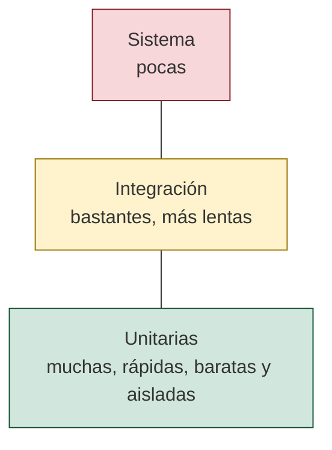
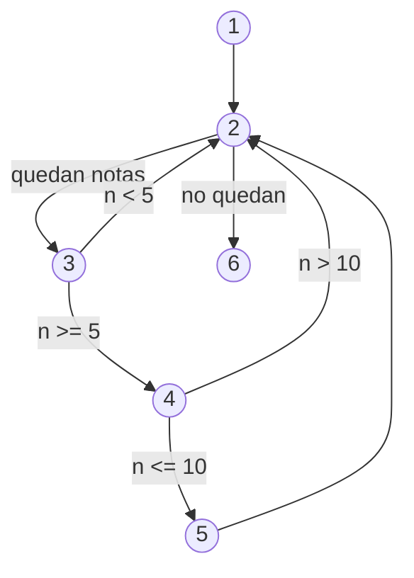
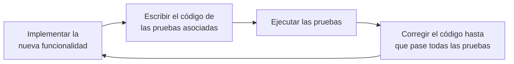

---
tags:
  - entornos-de-desarrollo
  - DAM1
  - pruebas
  - junit
unidad: 5
tema: Diseño y ejecución de pruebas — casos de prueba, caja blanca, caja negra, pruebas unitarias con JUnit, cobertura y automatización
---

# Unidad 5. Diseño y ejecución de pruebas

> [!abstract] Objetivos de la unidad
> - Explicar los objetivos de las pruebas de *software* y definir caso de prueba, batería de pruebas y resultado esperado.
> - Clasificar las pruebas según su nivel, su objetivo, la técnica empleada, su ejecución y el momento del mantenimiento.
> - Diseñar casos de prueba de caja blanca mediante el grafo de flujo, la complejidad ciclomática, el camino básico, las condiciones y los bucles.
> - Diseñar casos de prueba de caja negra mediante particiones de equivalencia y análisis de valores límite.
> - Medir el rendimiento de un fragmento de código y describir las pruebas de coherencia.
> - Implementar y ejecutar pruebas unitarias con JUnit 5 (y conocer sus equivalentes en C# y Python).
> - Medir la cobertura de código con JaCoCo e interpretar sus resultados.
> - Automatizar la ejecución de las pruebas con una herramienta de construcción y con integración continua.

---

## 1. Introducción

### 1.1. Para qué sirven las pruebas

Las pruebas de código constituyen una actividad fundamental del ciclo de vida del *software*. Su objetivo es **detectar defectos**, **validar los requisitos** y garantizar que el producto alcanza el nivel de calidad esperado **antes** de llegar a producción.

> [!important] Probar es intentar que el programa falle
> Probar no consiste en demostrar que el *software* funciona, sino en **intentar encontrar fallos**. Una prueba que no encuentra nada no demuestra que no haya defectos; solo que no se han encontrado con esos datos. Un sistema sin pruebas es un sistema **no verificable**.

Objetivos principales:

- Detectar errores y defectos lo antes posible (cuanto más tarde se encuentra un defecto, más caro es corregirlo).
- Verificar que el *software* cumple los requisitos funcionales.
- Evaluar atributos de calidad como la fiabilidad, la robustez y la mantenibilidad.
- Reducir riesgos técnicos y económicos.
- Aumentar la confianza en el producto.

Recuérdese la doble función de las pruebas vista en la [Unidad 1](01-desarrollo-de-software.md): **verificar** (el producto está bien construido, sin errores) y **validar** (es el producto que necesita el cliente).

### 1.2. Conceptos básicos

> [!note] Definición: prueba
> Proceso de ejecutar el *software* con el objetivo de encontrar defectos. Los conceptos de error, defecto y fallo se definieron en la [Unidad 4](04-depuracion-y-analisis-de-codigo.md).

> [!note] Definición: caso de prueba
> Conjunto de condiciones (precondiciones, datos de entrada y acciones) junto con el **resultado esperado**, que se establecen para determinar si la aplicación funciona correctamente según lo previsto.

> [!note] Definición: batería de pruebas
> Conjunto organizado de casos de prueba que se ejecutan juntos, de forma sistemática, sobre una misma unidad, funcionalidad o sistema.

Para cada tarea pueden surgir diversos casos de prueba, teniendo en cuenta todos los factores posibles para no dejar ningún cabo suelto. En principio los casos tienen un enfoque genérico y después se añaden condiciones y variables que los completan. Un caso de prueba bien documentado contiene:

| Campo | Ejemplo |
|---|---|
| Identificador | CP-07 |
| Descripción | Retirar más dinero del disponible |
| Precondiciones | Cuenta de Ana con 100 € de saldo |
| Datos de entrada | Importe: 100,01 € |
| Resultado esperado | Se rechaza la operación con un mensaje de error; el saldo sigue siendo 100 € |
| Resultado obtenido | (se rellena al ejecutar) |
| Estado | Superada / No superada |

> [!tip] El resultado esperado se fija antes
> El resultado esperado se calcula a partir de la **especificación**, nunca ejecutando el programa: si se copia lo que devuelve el programa, la prueba confirmará cualquier error que tenga.

---

## 2. Clasificación de las pruebas

Las pruebas se clasifican según varios criterios **independientes**: una misma prueba puede ser, a la vez, unitaria, funcional, de caja negra, dinámica y automatizada.

### 2.1. Según el nivel

| Nivel | Qué se prueba | Quién | Características |
|---|---|---|---|
| **Unitarias** | Unidades individuales: un método, una clase | Desarrolladores | Aisladas, automatizadas y rápidas; detectan errores en fases tempranas |
| **De integración** | La interacción entre módulos o componentes | Desarrolladores | Comprueban que las unidades funcionan **juntas** (llamadas, formatos de datos, bases de datos) |
| **De sistema** | El sistema completo una vez integrado | Equipo de pruebas | Validan requisitos funcionales y no funcionales en un entorno similar al real |
| **De aceptación** | Si el *software* es aceptable para el cliente | Cliente o usuarios | Tipos: UAT (*User Acceptance Testing*), contractuales (lo pactado) y regulatorias (normativas) |

Estrategias de **integración**:

| Estrategia | Funcionamiento | Necesita |
|---|---|---|
| Descendente (*top-down*) | Se empieza por los módulos de nivel superior y se añaden los inferiores | **Stubs**: sustitutos simplificados de los módulos inferiores aún no integrados |
| Ascendente (*bottom-up*) | Se empieza por los módulos de nivel inferior y se sube | **Drivers** (controladores): programas que llaman al módulo como lo haría el superior |
| Incremental | Se integran los módulos de uno en uno, probando en cada paso | Facilita localizar el defecto |
| *Big bang* | Se integran todos a la vez | Desaconsejada: si falla, es difícil saber dónde |

La proporción recomendada entre niveles se representa con la **pirámide de pruebas**: muchas pruebas unitarias (rápidas y baratas), menos de integración y pocas de sistema o extremo a extremo (lentas y costosas).



### 2.2. Según el objetivo

| Tipo | Comprueba | Ejemplos |
|---|---|---|
| **Funcionales** | **Qué** hace el *software*: las funciones especificadas en los requisitos | Cálculo correcto de resultados, validación de entradas, flujos de navegación |
| **No funcionales** | **Cómo** se comporta | Rendimiento y carga, seguridad, usabilidad y accesibilidad, compatibilidad, fiabilidad y recuperación |

### 2.3. Según la técnica

| Técnica | Conocimiento del código | Se basa en | Técnicas habituales |
|---|---|---|---|
| **Caja blanca** (estructurales) | Sí: se observa **cómo** se realiza la operación | La estructura interna | Camino básico, condiciones, bucles, cobertura |
| **Caja negra** (funcionales) | No: se trata el programa como una caja cerrada | Entradas, salidas y especificación | Particiones de equivalencia, valores límite, tablas de decisión, casos de uso |
| **Caja gris** | Parcial | Combina ambas | Diseñar casos de caja negra sabiendo cómo está construido el sistema |

Los tipos de casos de prueba se definen por la **naturaleza** de la prueba y no por la operación que se prueba: una prueba de caja blanca y otra de caja negra pueden comprobar la misma operación con los mismos datos, aunque desde puntos de vista diferentes.

### 2.4. Según la ejecución

| Tipo | Descripción | Ejemplos |
|---|---|---|
| **Estáticas** | **No** ejecutan el código | Revisiones de código, inspecciones, recorridos (*walkthroughs*), análisis estático (véase la [Unidad 4](04-depuracion-y-analisis-de-codigo.md)) |
| **Dinámicas** | Requieren ejecutar el *software* | Todas las pruebas con datos de entrada |

### 2.5. Según el momento del mantenimiento

| Tipo | Cuándo se hace | Objetivo |
|---|---|---|
| **De regresión** | Tras cualquier cambio en el código | Comprobar que lo que funcionaba **sigue funcionando** |
| *Re-testing* (reprueba) | Tras corregir un defecto | Comprobar que **ese defecto** está corregido |
| *Smoke testing* (prueba de humo) | Al recibir una nueva versión | Verificación rápida de que las funciones básicas arrancan; si falla, no se sigue probando |
| *Sanity testing* (prueba de cordura) | Tras un cambio concreto | Comprobación rápida y limitada de la zona modificada |

> [!warning] Corrección del material: las pruebas unitarias no son necesariamente de caja blanca
> Las diapositivas afirman que las pruebas unitarias «pertenecen a los casos de prueba de caja blanca». Son criterios distintos: **unitaria** indica el **nivel** (qué se prueba) y **caja blanca o negra**, la **técnica** (cómo se diseñan los casos). Una prueba unitaria puede diseñarse con técnicas de caja negra (particiones, valores límite) o de caja blanca (caminos, cobertura), como hace el propio resumen de la asignatura al clasificarlas por nivel.

---

## 3. Pruebas de caja blanca

Las pruebas de caja blanca se centran en el **funcionamiento interno** del programa: se diseñan observando el código para que cada sentencia, decisión y camino se ejecute al menos una vez.

Todas las técnicas de este apartado se aplican al siguiente método:

```java
// Aprobados.java
public class Aprobados {

    // Cuenta las notas válidas (entre 5 y 10) de un vector
    static int contarAprobados(double[] notas) {
        int aprobados = 0;
        for (double n : notas) {
            if (n >= 5 && n <= 10) {
                aprobados++;
            }
        }
        return aprobados;
    }
}
```

### 3.1. Grafo de flujo

La prueba del camino básico se basa en el principio de que cualquier diseño procedimental puede representarse mediante un **grafo de flujo**.

> [!note] Definición: grafo de flujo
> Representación del flujo de control de un programa formada por **nodos** (una o varias sentencias sin bifurcaciones, o una condición) y **aristas** (transferencias de control entre nodos). Las áreas delimitadas por aristas y nodos se llaman **regiones**, contando también la exterior.

> [!note] Definición: nodo predicado
> Nodo que contiene una **condición simple** y del que salen dos aristas. Si una decisión tiene una condición compuesta (`a && b`), se representa con un nodo predicado **por cada condición simple**.

| Nodo | Sentencias |
|---|---|
| 1 | `int aprobados = 0;` |
| 2 | `for (double n : notas)` — ¿quedan notas? (predicado) |
| 3 | `n >= 5` (predicado) |
| 4 | `n <= 10` (predicado) |
| 5 | `aprobados++;` |
| 6 | `return aprobados;` |



### 3.2. Complejidad ciclomática

> [!note] Definición: complejidad ciclomática, V(G)
> Métrica de *software*, propuesta por Thomas McCabe en 1976, que mide la complejidad lógica de un programa. Coincide con el **número de caminos independientes** del grafo, es decir, el número mínimo de casos de prueba necesarios para ejecutar cada sentencia y cada decisión al menos una vez.

Se calcula de tres formas equivalentes:

| Fórmula | Cálculo para `contarAprobados` |
|---|---|
| V(G) = **A − N + 2** (A: aristas; N: nodos) | 8 − 6 + 2 = **4** |
| V(G) = **P + 1** (P: nodos predicado) | 3 + 1 = **4** |
| V(G) = **número de regiones** | 3 interiores + 1 exterior = **4** |

> [!tip] Contar las condiciones compuestas
> Cada `&&` y cada `||` añade una condición. Una forma rápida de calcular V(G) directamente sobre el código es contar `1 +` el número de `if`, `while`, `for`, `case`, `&&`, `||` y `?:`.

La complejidad ciclomática también se mide con herramientas. Con **lizard**, un analizador para muchos lenguajes que se instala con `pip install lizard`:

```bash
lizard Aprobados.java
```

```text
================================================
  NLOC    CCN   token  PARAM  length  location  
------------------------------------------------
       9      4     41      1       9 Aprobados::contarAprobados@5-13@Aprobados.java
```

La columna `CCN` (*cyclomatic complexity number*) vale 4.

| V(G) | Interpretación | Riesgo |
|---|---|---|
| 1 – 10 | Método simple | Bajo |
| 11 – 20 | Método más complejo | Moderado |
| 21 – 50 | Método complejo | Alto: conviene dividirlo |
| > 50 | Prácticamente imposible de probar | Muy alto |

### 3.3. Prueba del camino básico

> [!note] Definición: camino independiente
> Camino del grafo que introduce, respecto a los anteriores, al menos una arista nueva (un nuevo conjunto de sentencias o una nueva condición).

Se identifican tantos caminos como indica V(G) y se diseña un caso de prueba que fuerce cada uno:

| Camino | Recorrido | Datos de entrada | Resultado esperado |
|---|---|---|---|
| C1 | 1 → 2 → 6 | `{}` (vector vacío) | 0 |
| C2 | 1 → 2 → 3 → 2 → 6 | `{3.0}` | 0 |
| C3 | 1 → 2 → 3 → 4 → 2 → 6 | `{12.0}` | 0 |
| C4 | 1 → 2 → 3 → 4 → 5 → 2 → 6 | `{7.0}` | 1 |

Estos casos se implementan como pruebas unitarias en el apartado 6.

### 3.4. Prueba de condiciones

Evalúa los caminos que provienen exclusivamente de las **condiciones**, de modo que cada condición simple tome los valores verdadero y falso. Para que las pruebas sean efectivas no deben ser redundantes, por lo que al construir la tabla de verdad hay que tener presentes las **condiciones cortocircuitadas**.

> [!note] Definición: evaluación en cortocircuito
> En `a && b`, si `a` es falsa, el resultado ya es falso y `b` **no se evalúa**; en `a || b`, si `a` es verdadera, `b` no se evalúa. Java, C, C#, JavaScript y Python usan esta evaluación.

Para `n >= 5 && n <= 10`, de las cuatro combinaciones teóricas solo tres son posibles y distintas:

| `n >= 5` | `n <= 10` | Resultado | Ejemplo de `n` |
|:---:|:---:|:---:|:---:|
| F | — (no se evalúa) | F | 3 |
| V | F | F | 12 |
| V | V | V | 7 |

Coinciden con los caminos C2, C3 y C4.

### 3.5. Prueba de bucles

Evalúa las situaciones límite de un bucle que puede ejecutarse hasta *n* veces. Para un bucle simple se prueba que el flujo:

1. no entre ninguna vez en el bucle;
2. pase una única vez;
3. pase dos veces;
4. pase *m* veces, con *m* < *n*;
5. pase *n* − 1, *n* y *n* + 1 veces.

> [!warning] Corrección del material
> Las diapositivas indican «*n* − 1 y *n* + 2 iteraciones». Las situaciones límite son ***n* − 1, *n* y *n* + 1**: el último paso válido, el máximo y el intento de superarlo (esta última solo tiene sentido si el bucle puede llegar a superarlo, por ejemplo, en un bucle con un contador mal controlado).

En `contarAprobados` el número de vueltas depende del tamaño del vector: se prueba con 0 elementos (C1), 1 (C2-C4), 2 y varios. Para **bucles anidados** se empieza por el más interno, manteniendo los exteriores en su valor mínimo, y se avanza hacia fuera.

### 3.6. Cobertura de código

> [!note] Definición: cobertura de código
> Porcentaje del código que se ejecuta al pasar una batería de pruebas. Indica qué partes del programa **no se han probado nunca**.

| Criterio | Se cumple cuando… | En `contarAprobados` |
|---|---|---|
| Cobertura de **sentencias** (líneas) | Cada sentencia se ejecuta al menos una vez | Basta con `{7.0}` |
| Cobertura de **decisiones** (ramas) | Cada decisión toma los valores verdadero y falso | Hacen falta C1 a C4 |
| Cobertura de **condiciones** | Cada condición simple toma los valores verdadero y falso | Hacen falta `n` < 5, `n` > 10 y una válida |
| Cobertura de **caminos** | Se recorre cada camino posible | Imposible en general (con bucles hay infinitos); por eso se usan los caminos independientes |

> [!important] Cobertura alta no es ausencia de defectos
> La cobertura indica qué código **se ha ejecutado**, no que se haya **comprobado bien**. Un conjunto de pruebas sin aserciones puede alcanzar el 100 % de cobertura y no detectar nada. La cobertura sirve para encontrar código **sin probar**, no para certificar la calidad.

La medición de la cobertura con JaCoCo se muestra en el ejemplo integrador (apartado 10).

---

## 4. Pruebas de caja negra

Las pruebas de caja negra se enfocan en las **entradas y salidas** de la aplicación, desde el punto de vista del usuario: no en cuestiones de formato, sino en validar y controlar los datos de entrada para evitar errores y, como en todas las pruebas, obtener los resultados esperados.

### 4.1. Particiones de equivalencia

> [!note] Definición: clase de equivalencia
> Subconjunto de los valores de entrada para el que se espera que el programa se comporte **de la misma forma**. Si un valor de la clase revela un defecto, los demás probablemente también; si no lo revela, los demás tampoco.

La técnica consiste en dividir los campos de entrada según su tipo de dato y sus restricciones en clases **válidas** e **inválidas**, y probar **un representante** de cada una, en lugar de todos los valores posibles.

| Si la condición de entrada especifica… | Clases válidas | Clases inválidas | Ejemplo |
|---|---|---|---|
| Un **rango** de valores | 1 (dentro del rango) | 2 (por debajo y por encima) | Edad entre 18 y 65 |
| Un **valor específico** (formato, longitud) | 1 | 2 (por defecto y por exceso, o mal formado) | Código postal de 5 dígitos |
| Un elemento de un **conjunto** | 1 (o una por elemento, si se tratan distinto) | 1 (fuera del conjunto) | Tipo de carné: A, B o C |
| Una condición **lógica** | 1 | 1 | Debe aceptar las condiciones |

**Ejemplo: formulario de inscripción a una autoescuela.**

| Campo | Restricción | Clases válidas | Clases inválidas |
|---|---|---|---|
| Edad | Entero entre 18 y 65 | V1: 18 ≤ edad ≤ 65 | I1: edad < 18 · I2: edad > 65 |
| Código postal | Exactamente 5 dígitos | V2: 5 dígitos | I3: menos de 5 · I4: más de 5 · I5: con letras |
| Carné | A, B o C | V3: A · V4: B · V5: C | I6: otro valor (D, vacío…) |
| Condiciones | Debe marcarlas | V6: marcadas | I7: sin marcar |

Para obtener los casos de prueba:

1. Se cubren **todas las clases válidas** con el menor número de casos posible (un caso puede cubrir varias).
2. Se escribe **un caso por cada clase inválida**, con el resto de datos válidos, para que un error no oculte a otro.

| Caso | Edad | C. P. | Carné | Condiciones | Clases cubiertas | Resultado esperado |
|---|---|---|---|---|---|---|
| 1 | 30 | 07001 | A | Sí | V1, V2, V3, V6 | Inscripción aceptada |
| 2 | 40 | 07600 | B | Sí | V4 | Aceptada |
| 3 | 25 | 07800 | C | Sí | V5 | Aceptada |
| 4 | 15 | 07001 | B | Sí | I1 | Error en la edad |
| 5 | 70 | 07001 | B | Sí | I2 | Error en la edad |
| 6 | 30 | 0700 | B | Sí | I3 | Error en el código postal |
| … | … | … | … | … | I4 a I7 | Un error por caso |

### 4.2. Análisis de valores límite

> [!note] Definición: análisis de valores límite (AVL)
> Técnica complementaria de las particiones de equivalencia que selecciona los casos en los **bordes** de cada clase, donde se concentran los errores (`<` en lugar de `<=`, contadores que empiezan en 1…). Si se especifica un rango o un número de valores, se prueba **el propio límite y el valor inmediatamente inferior y superior** de cada cota.

Para la edad entre 18 y 65:

| Valor | Por qué | Resultado esperado |
|---|---|---|
| 17 | Justo por debajo del mínimo | Error |
| **18** | Mínimo | Aceptada |
| 19 | Justo por encima del mínimo | Aceptada |
| 64 | Justo por debajo del máximo | Aceptada |
| **65** | Máximo | Aceptada |
| 66 | Justo por encima del máximo | Error |

El AVL también se aplica a las **salidas** (por ejemplo, provocar el mayor y el menor resultado posibles) y a las estructuras de datos (vector vacío, con un elemento, lleno).

### 4.3. Tablas de decisión

Cuando la salida depende de **combinaciones** de condiciones, una tabla de decisión las enumera todas y asigna una acción a cada una; cada columna es un caso de prueba.

| Regla | R1 | R2 | R3 | R4 |
|---|:---:|:---:|:---:|:---:|
| Cliente registrado | S | S | N | N |
| Pedido > 50 € | S | N | S | N |
| **Envío gratuito** | X | | X | |
| **Descuento 5 %** | X | X | | |

### 4.4. Casos de uso

Las pruebas también se derivan de los **casos de uso** del sistema (véase la [Unidad 9](09-diagramas-de-comportamiento.md)): cada flujo principal y cada flujo alternativo de un caso de uso da lugar a, al menos, un caso de prueba de sistema o de aceptación.

---

## 5. Pruebas de rendimiento y de coherencia

### 5.1. Pruebas de rendimiento

Miden el **tiempo** que tarda la aplicación en realizar una acción. Aunque dependen de la máquina, siguen siendo válidas: permiten controlar el tiempo en un equipo concreto y comparar distintas formas de realizar una operación para ver cuál rinde mejor.

El material utiliza el cronómetro **`Stopwatch`** de .NET, que mide en milisegundos o en *ticks* (unidades internas del reloj). Ejemplo: construir un texto con 20 000 números concatenando con `+` o con `StringBuilder`:

```csharp
// Program.cs
using System.Diagnostics;
using System.Text;

const int Repeticiones = 20_000;

// Versión 1: concatenar con +
Stopwatch crono = Stopwatch.StartNew();
string texto = "";
for (int i = 0; i < Repeticiones; i++)
{
    texto += i;
}
crono.Stop();
Console.WriteLine($"Concatenación con +: {crono.Elapsed.TotalMilliseconds:F2} ms");

// Versión 2: StringBuilder
crono.Restart();
var sb = new StringBuilder();
for (int i = 0; i < Repeticiones; i++)
{
    sb.Append(i);
}
string texto2 = sb.ToString();
crono.Stop();
Console.WriteLine($"StringBuilder:       {crono.Elapsed.TotalMilliseconds:F2} ms");

Console.WriteLine($"Mismo resultado: {texto == texto2}");
```

```bash
dotnet run -c Release
```

```text
Concatenación con +: 255.84 ms
StringBuilder:       1.08 ms
Mismo resultado: True
```

En Java, el equivalente es `System.nanoTime()`:

```java
// Rendimiento.java
public class Rendimiento {
    private static final int REPETICIONES = 20_000;

    public static void main(String[] args) {
        long inicio = System.nanoTime();
        String texto = "";
        for (int i = 0; i < REPETICIONES; i++) {
            texto += i;
        }
        long tiempoConcatenar = System.nanoTime() - inicio;

        inicio = System.nanoTime();
        StringBuilder sb = new StringBuilder();
        for (int i = 0; i < REPETICIONES; i++) {
            sb.append(i);
        }
        String texto2 = sb.toString();
        long tiempoBuilder = System.nanoTime() - inicio;

        System.out.printf("Concatenación con +: %.2f ms%n", tiempoConcatenar / 1e6);
        System.out.printf("StringBuilder:       %.2f ms%n", tiempoBuilder / 1e6);
        System.out.println("Mismo resultado: " + texto.equals(texto2));
    }
}
```

```text
Concatenación con +: 318,09 ms
StringBuilder:       1,53 ms
Mismo resultado: true
```

Los tiempos varían en cada ejecución y en cada equipo (y el separador decimal depende de la configuración regional), pero la diferencia de dos órdenes de magnitud se mantiene: cada `+` crea un texto nuevo y copia el anterior, mientras que `StringBuilder` amplía un único búfer.

> [!tip] Localizar la operación lenta
> Si se detecta una operación que tarda demasiado, se divide en varios cronómetros para identificar qué parte concreta causa el problema. Las herramientas llamadas **perfiladores** (*profilers*), como VisualVM o Java Flight Recorder, hacen este trabajo automáticamente.

> [!warning] Medir bien
> Una sola medición no es fiable: la primera ejecución incluye la carga de clases y la compilación JIT (véase la [Unidad 1](01-desarrollo-de-software.md)), y el sistema puede estar ocupado con otras tareas. Se repite la medición varias veces y se compila en modo *Release*. Para mediciones rigurosas existen bibliotecas específicas (JMH en Java, BenchmarkDotNet en C#), y para pruebas de **carga** con muchos usuarios simultáneos, herramientas como Apache JMeter o k6.

### 5.2. Pruebas de coherencia

Las pruebas de coherencia son **subjetivas**: no se centran en los datos, sino en el **flujo de trabajo** (*workflow*) de la aplicación. Comprueban si la **funcionalidad** de la aplicación es correcta, no solo si la aplicación funciona sin errores: que un programa no tenga ningún error de código ni de interfaz no significa que funcione correctamente. Por ejemplo, si una aplicación debe enviar correos electrónicos y esa función no se ha contemplado, el programa no funciona correctamente aunque no falle.

Además de comprobar que la aplicación realiza todas las funciones requeridas de forma satisfactoria, hay que considerar el **ciclo de vida** de sus elementos: controlar que cada operación se haga (o se permita hacer) en el momento o **estado** apropiado.

| Operación | Estado del pedido en que se permite | Caso de prueba de coherencia |
|---|---|---|
| Pagar | Pendiente | Intentar pagar un pedido ya enviado debe rechazarse |
| Enviar | Pagado | Intentar enviar un pedido sin pagar debe rechazarse |
| Cancelar | Pendiente o pagado | Intentar cancelar un pedido entregado debe rechazarse |

Si la aplicación no tiene etapas ni estados (una calculadora, por ejemplo), estas últimas comprobaciones no son necesarias. Las pruebas de coherencia están muy relacionadas con las pruebas de **sistema** y de **aceptación**.

---

## 6. Pruebas unitarias

### 6.1. Concepto

> [!note] Definición: prueba unitaria
> Prueba individual de un método o clase, realizada de forma sistemática y automática como parte de una batería de pruebas, en la que se conocen los datos de entrada y el resultado esperado.

Las pruebas deberían implementarse de manera sistemática con **cada nueva funcionalidad**, de modo que estén actualizadas en todo momento, y ejecutarse de forma **incremental**. El material lo representa con este ciclo:



Las buenas pruebas unitarias cumplen los principios **FIRST**:

| Principio | Significado |
|---|---|
| ***Fast*** (rápidas) | Se ejecutan en milisegundos, para poder lanzarlas continuamente |
| ***Independent*** (independientes) | No dependen unas de otras ni del orden de ejecución |
| ***Repeatable*** (repetibles) | Dan el mismo resultado en cualquier equipo y momento (sin depender de la red, la hora o datos aleatorios) |
| ***Self-validating*** (autoverificables) | Indican por sí mismas si pasan o fallan, sin revisar la salida a mano |
| ***Timely*** (oportunas) | Se escriben a la vez que el código, no al final del proyecto |

> [!info] Desarrollo guiado por pruebas (TDD)
> El ***Test-Driven Development*** invierte el orden del ciclo anterior: **primero se escribe la prueba** y después el código. Se repite el ciclo **rojo** (escribir una prueba que falla), **verde** (escribir el código mínimo para que pase) y **refactorizar** (mejorar el código manteniendo las pruebas en verde; véase la [Unidad 6](06-refactorizacion.md)).

### 6.2. Marcos de pruebas

Las pruebas unitarias se escriben con un **marco de pruebas** (*testing framework*): una biblioteca que permite marcar qué métodos son pruebas, comprobar resultados mediante **aserciones** (asertos) y ejecutar todas las pruebas mostrando un informe.

| Lenguaje | Marcos habituales |
|---|---|
| Java | **JUnit 5** (Jupiter), TestNG |
| C# | **NUnit**, xUnit.net, MSTest |
| Python | **pytest**, `unittest` (incluido en Python) |
| C / C++ | Google Test, Catch2, CUnit |
| JavaScript | Jest, Vitest |

El material utiliza **NUnit** (C#). Las ideas son las mismas en todos los marcos; la siguiente tabla recoge las equivalencias:

| Concepto | NUnit (C#) | JUnit 5 (Java) | pytest (Python) |
|---|---|---|---|
| Clase de pruebas | `[TestFixture]` | Cualquier clase con métodos `@Test` | Fichero `test_*.py` |
| Método de prueba | `[Test]` | `@Test` | Función `test_*` |
| Antes de cada prueba | `[SetUp]` | `@BeforeEach` | *Fixture* (`@pytest.fixture`) |
| Después de cada prueba | `[TearDown]` | `@AfterEach` | *Fixture* con `yield` |
| Prueba parametrizada | `[TestCase(2, 3, 5)]` | `@ParameterizedTest` + `@CsvSource` | `@pytest.mark.parametrize` |
| Comprobar igualdad | `Assert.That(real, Is.EqualTo(esperado))` | `assertEquals(esperado, real)` | `assert real == esperado` |
| Comprobar excepción | `Assert.Throws<TipoExcepcion>(...)` | `assertThrows(Tipo.class, ...)` | `with pytest.raises(Tipo):` |
| Ejecutar | `dotnet test` | `gradle test` / `mvn test` | `pytest` |

> [!warning] Actualización del material: instalación de NUnit
> Las diapositivas describen NUnit como una aplicación que «registra las dll en el sistema» y a la que se añade una referencia a `nunit.framework`. Hoy no se instala nada en el sistema: NUnit se añade al **proyecto de pruebas** como paquete NuGet (`NUnit`, `NUnit3TestAdapter` y `Microsoft.NET.Test.Sdk`). La forma más sencilla es crear el proyecto con `dotnet new nunit` y ejecutarlo con `dotnet test`, o desde el explorador de pruebas de Visual Studio o de VS Code (C# Dev Kit).

### 6.3. Anatomía de una prueba con JUnit 5

Se prueba la siguiente clase:

```java
// Cuenta.java
public class Cuenta {
    private final String titular;
    private double saldo;

    public Cuenta(String titular, double saldoInicial) {
        if (saldoInicial < 0) {
            throw new IllegalArgumentException("Saldo inicial negativo: " + saldoInicial);
        }
        this.titular = titular;
        this.saldo = saldoInicial;
    }

    public void ingresar(double importe) {
        if (importe <= 0) {
            throw new IllegalArgumentException("Importe no válido: " + importe);
        }
        saldo += importe;
    }

    public void retirar(double importe) {
        if (importe <= 0 || importe > saldo) {
            throw new IllegalArgumentException("Importe no válido: " + importe);
        }
        saldo -= importe;
    }

    public String getTitular() { return titular; }
    public double getSaldo() { return saldo; }
}
```

```java
// CuentaTest.java
import static org.junit.jupiter.api.Assertions.assertAll;
import static org.junit.jupiter.api.Assertions.assertEquals;
import static org.junit.jupiter.api.Assertions.assertThrows;

import org.junit.jupiter.api.BeforeEach;
import org.junit.jupiter.api.DisplayName;
import org.junit.jupiter.api.Test;

@DisplayName("Pruebas de Cuenta")
class CuentaTest {

    private Cuenta cuenta;

    @BeforeEach                          // se ejecuta antes de CADA prueba
    void crearCuenta() {
        cuenta = new Cuenta("Ana", 100.0);
    }

    @Test
    @DisplayName("Ingresar aumenta el saldo")
    void ingresarAumentaSaldo() {
        // Preparar (Arrange): la cuenta ya está creada con 100 €
        // Actuar (Act)
        cuenta.ingresar(50.0);
        // Comprobar (Assert)
        assertEquals(150.0, cuenta.getSaldo(), 0.001);
    }

    @Test
    @DisplayName("Retirar todo el saldo deja la cuenta a cero")
    void retirarTodoElSaldo() {
        cuenta.retirar(100.0);
        assertEquals(0.0, cuenta.getSaldo(), 0.001);
    }

    @Test
    @DisplayName("Retirar más del saldo lanza una excepción y no cambia el saldo")
    void retirarMasDelSaldo() {
        IllegalArgumentException e = assertThrows(IllegalArgumentException.class,
                () -> cuenta.retirar(100.01));
        assertAll(
                () -> assertEquals("Importe no válido: 100.01", e.getMessage()),
                () -> assertEquals(100.0, cuenta.getSaldo(), 0.001));
    }

    @Test
    @DisplayName("Ingresar 0,1 tres veces suma 0,3")
    void ingresosDecimales() {
        cuenta.ingresar(0.1);
        cuenta.ingresar(0.1);
        cuenta.ingresar(0.1);
        assertEquals(100.3, cuenta.getSaldo());   // ERROR: comparación exacta de double
    }
}
```

Cada prueba sigue el patrón **AAA**: ***Arrange*** (preparar los datos), ***Act*** (ejecutar el método que se prueba) y ***Assert*** (comprobar el resultado).

| Anotación | Efecto |
|---|---|
| `@Test` | Marca un método como prueba |
| `@DisplayName("…")` | Nombre legible en el informe (admite espacios y tildes) |
| `@BeforeEach` / `@AfterEach` | Método que se ejecuta antes / después de **cada** prueba |
| `@BeforeAll` / `@AfterAll` | Método estático que se ejecuta una vez antes / después de **todas** |
| `@ParameterizedTest` | Prueba que se repite con distintos datos (`@CsvSource`, `@ValueSource`…) |
| `@Disabled("motivo")` | Desactiva temporalmente una prueba |

| Aserción | Comprueba |
|---|---|
| `assertEquals(esperado, real)` | Igualdad. **El esperado va primero.** |
| `assertEquals(esperado, real, delta)` | Igualdad de decimales con un margen de tolerancia |
| `assertTrue(cond)` / `assertFalse(cond)` | Que una condición sea verdadera / falsa |
| `assertNull(x)` / `assertNotNull(x)` | Que un valor sea / no sea `null` |
| `assertThrows(Tipo.class, () -> …)` | Que el código lance esa excepción; la devuelve para inspeccionarla |
| `assertAll(…)` | Ejecuta varias aserciones y informa de **todos** los fallos, no solo del primero |

**Ejecución con el lanzador de consola.** Sin herramienta de construcción, JUnit se usa descargando un único fichero, `junit-platform-console-standalone-<versión>.jar`:

```bash
javac -cp junit-platform-console-standalone.jar -d out Cuenta.java CuentaTest.java
java -jar junit-platform-console-standalone.jar execute --disable-banner --class-path out --select-class CuentaTest
```

```text
╷
├─ JUnit Platform Suite ✔
├─ JUnit Jupiter ✔
│  └─ Pruebas de Cuenta ✔
│     ├─ Retirar todo el saldo deja la cuenta a cero ✔
│     ├─ Retirar más del saldo lanza una excepción y no cambia el saldo ✔
│     ├─ Ingresar 0,1 tres veces suma 0,3 ✘ expected: <100.3> but was: <100.29999999999998>
│     └─ Ingresar aumenta el saldo ✔
└─ JUnit Vintage ✔

Failures (1):
  JUnit Jupiter:Pruebas de Cuenta:Ingresar 0,1 tres veces suma 0,3
    MethodSource [className = 'CuentaTest', methodName = 'ingresosDecimales', methodParameterTypes = '']
    => org.opentest4j.AssertionFailedError: expected: <100.3> but was: <100.29999999999998>
       ...
       CuentaTest.ingresosDecimales(CuentaTest.java:53)
       ...

Test run finished after 122 ms
...
[         4 tests found           ]
[         3 tests successful      ]
[         1 tests failed          ]
```

(Se han omitido las líneas internas de JUnit y parte del resumen.)

El informe indica qué prueba ha fallado, el valor esperado frente al obtenido y la línea. El fallo no es del programa, sino **de la prueba**: los números `double` se almacenan en binario y 0,1 no tiene representación exacta, por lo que 100 + 0,1 + 0,1 + 0,1 da `100.29999999999998`. Los decimales se comparan siempre con un margen:

```java
        assertEquals(100.3, cuenta.getSaldo(), 0.001);
```

Con esta corrección pasan las cuatro pruebas.

> [!warning] El orden de ejecución no está garantizado
> En la salida, las pruebas no aparecen en el orden en que están escritas. Por eso cada prueba debe **preparar sus propios datos** (`@BeforeEach` crea una cuenta nueva para cada una) y nunca depender del resultado de otra.

> [!info] Versiones de JUnit
> Los ejemplos usan JUnit 5 (paquete `org.junit.jupiter.api`). En 2025 se publicó JUnit 6, que mantiene esa misma API y requiere Java 17 o superior. El antiguo JUnit 4 (`org.junit.Test`) sigue apareciendo en proyectos antiguos.

### 6.4. Pruebas del camino básico

Los casos diseñados en el apartado 3.3 se convierten en pruebas:

```java
// AprobadosTest.java
import static org.junit.jupiter.api.Assertions.assertEquals;

import org.junit.jupiter.api.DisplayName;
import org.junit.jupiter.api.Test;

class AprobadosTest {

    // --- Camino básico: un caso por cada camino independiente ---

    @Test
    @DisplayName("C1: vector vacío")
    void vectorVacio() {
        assertEquals(0, Aprobados.contarAprobados(new double[] {}));
    }

    @Test
    @DisplayName("C2: nota menor que 5")
    void notaSuspensa() {
        assertEquals(0, Aprobados.contarAprobados(new double[] {3.0}));
    }

    @Test
    @DisplayName("C3: nota mayor que 10")
    void notaNoValida() {
        assertEquals(0, Aprobados.contarAprobados(new double[] {12.0}));
    }

    @Test
    @DisplayName("C4: nota aprobada")
    void notaAprobada() {
        assertEquals(1, Aprobados.contarAprobados(new double[] {7.0}));
    }

    // --- Prueba de bucles: 0, 1, 2 y varias iteraciones ya cubiertas arriba ---

    @Test
    @DisplayName("Bucle con dos iteraciones")
    void dosNotas() {
        assertEquals(2, Aprobados.contarAprobados(new double[] {5.0, 10.0}));
    }

    @Test
    @DisplayName("Bucle con muchas iteraciones")
    void muchasNotas() {
        double[] notas = {1, 5, 6, 9.5, 10, 10.5, 4.99, 7};
        assertEquals(5, Aprobados.contarAprobados(notas));
    }
}
```

```text
│  └─ AprobadosTest ✔
│     ├─ C3: nota mayor que 10 ✔
│     ├─ C4: nota aprobada ✔
│     ├─ C1: vector vacío ✔
│     ├─ Bucle con dos iteraciones ✔
│     ├─ C2: nota menor que 5 ✔
│     └─ Bucle con muchas iteraciones ✔
...
[         6 tests successful      ]
[         0 tests failed          ]
```

La prueba `dosNotas` usa los valores límite 5 y 10, y `muchasNotas` combina valores dentro y fuera del rango, incluidos 4,99 y 10,5.

### 6.5. Pruebas en Python con pytest

```python
# descuento.py
def precio_con_descuento(precio, porcentaje):
    """Aplica un descuento entre 0 y 100 % y redondea a céntimos."""
    if not 0 <= porcentaje <= 100:
        raise ValueError(f"Porcentaje no válido: {porcentaje}")
    return round(precio * (1 - porcentaje / 100), 2)
```

```python
# test_descuento.py
import pytest

from descuento import precio_con_descuento


def test_descuento_normal():
    assert precio_con_descuento(80, 25) == 60.0


@pytest.mark.parametrize("porcentaje, esperado", [
    (0, 50.0),       # límite inferior
    (100, 0.0),      # límite superior
    (33, 33.5),
])
def test_limites(porcentaje, esperado):
    assert precio_con_descuento(50, porcentaje) == esperado


@pytest.mark.parametrize("porcentaje", [-1, 101])
def test_porcentaje_no_valido(porcentaje):
    with pytest.raises(ValueError):
        precio_con_descuento(50, porcentaje)
```

```bash
pytest -v
```

```text
test_descuento.py::test_descuento_normal PASSED                          [ 16%]
test_descuento.py::test_limites[0-50.0] PASSED                           [ 33%]
test_descuento.py::test_limites[100-0.0] PASSED                          [ 50%]
test_descuento.py::test_limites[33-33.5] PASSED                          [ 66%]
test_descuento.py::test_porcentaje_no_valido[-1] PASSED                  [ 83%]
test_descuento.py::test_porcentaje_no_valido[101] PASSED                 [100%]

============================== 6 passed in 0.01s ===============================
```

pytest descubre automáticamente los ficheros `test_*.py` y las funciones `test_*`, y utiliza el `assert` normal de Python.

### 6.6. Ejecutar las pruebas desde el IDE

| Entorno | Cómo |
|---|---|
| VS Code (Java) | Vista **Pruebas** (*Testing*, icono de matraz) de la extensión *Test Runner for Java*; también aparecen botones ▶ junto a cada prueba en el editor y la opción *Run with Coverage* |
| VS Code (Python) | La misma vista *Testing*, tras configurar pytest (*Python: Configure Tests*) |
| VS Code / Visual Studio (C#) | Explorador de pruebas de C# Dev Kit / *Prueba > Explorador de pruebas* |
| Terminal | `gradle test`, `mvn test`, `dotnet test`, `pytest` |

### 6.7. Probar código que depende de otros subsistemas

Para que las aserciones sean eficaces, primero hay que llevar el programa hasta el punto concreto que se quiere probar, y no siempre es viable acceder desde una clase de prueba a todas las operaciones de los distintos subsistemas (base de datos, red, ficheros). El material propone dos soluciones:

- Crear un **proyecto de pruebas** separado, con acceso al código que se prueba. Es la práctica habitual: en Java, la carpeta `src/test/java`; en C#, un proyecto `.Tests` dentro de la solución.
- Implementar un **patrón fachada** (véase la [Unidad 1](01-desarrollo-de-software.md)) que ofrezca a las pruebas un punto de acceso sencillo a los subsistemas.

> [!info] Dobles de prueba
> Hoy se recurre sobre todo a los **dobles de prueba**: objetos que sustituyen a una dependencia real durante la prueba. Un ***stub*** devuelve respuestas predefinidas (por ejemplo, un repositorio que siempre devuelve los mismos tres clientes) y un ***mock*** permite además comprobar cómo se ha usado (si se llamó a `enviarCorreo` una vez). Bibliotecas: Mockito (Java), Moq y NSubstitute (C#), `unittest.mock` (Python).

---

## 7. Automatización de las pruebas

La automatización permite ejecutar las pruebas de forma repetitiva y eficiente.

| Ventajas | Inconvenientes |
|---|---|
| Ahorro de tiempo: cientos de pruebas en segundos | Coste inicial elevado: hay que escribir las pruebas |
| Mayor cobertura y pruebas de regresión en cada cambio | Mantenimiento: las pruebas se modifican cuando cambia el código |
| Resultados objetivos y repetibles | No sustituyen a las pruebas exploratorias, de usabilidad o de aceptación |
| Integración continua (CI/CD) | — |

### 7.1. Con una herramienta de construcción

Con Gradle o Maven, las pruebas forman parte de la construcción: `gradle build` compila, **ejecuta todas las pruebas** y solo genera el paquete si pasan. La configuración completa se muestra en el ejemplo integrador.

### 7.2. Integración continua

> [!note] Definición: integración continua (CI)
> Práctica en la que cada cambio que se sube al repositorio se compila y se prueba **automáticamente** en un servidor, de modo que los defectos se detectan minutos después de introducirse. Si además se publica automáticamente, se habla de entrega o despliegue continuos (CD).

Con **GitHub Actions**, basta con añadir al repositorio (véase la [Unidad 3](03-control-de-versiones-con-git.md)) un fichero de flujo de trabajo:

```yaml
# .github/workflows/pruebas.yml
name: Pruebas

on:
  push:
    branches: [main]
  pull_request:          # también en cada pull request

jobs:
  pruebas:
    runs-on: ubuntu-latest
    steps:
      - uses: actions/checkout@v4          # descarga el repositorio
      - uses: actions/setup-java@v4        # instala el JDK
        with:
          distribution: temurin
          java-version: '21'
      - uses: gradle/actions/setup-gradle@v4
      - run: ./gradlew test                # compila y ejecuta las pruebas
```

En cada *push* a `main` y en cada *pull request*, GitHub ejecuta las pruebas y muestra una marca verde o una cruz roja junto al *commit*. Se puede configurar el repositorio para que **no permita fusionar** una *pull request* cuyas pruebas fallen.

---

## 8. Buenas prácticas

- Probar desde las **fases tempranas** y diseñar las pruebas **antes** o a la vez que el código.
- **Automatizar** siempre que sea viable y ejecutar la batería completa antes de cada *commit* o *pull request*.
- Una prueba comprueba **un solo comportamiento** y su nombre lo describe (`retirarMasDelSaldoLanzaExcepcion`).
- Combinar técnicas: caja negra para diseñar los casos y caja blanca (cobertura) para encontrar código sin probar.
- Incluir siempre **valores límite** y casos **inválidos**, no solo el caso feliz.
- Cuando se encuentre un defecto, escribir primero la prueba que lo reproduce y después corregirlo: queda como prueba de **regresión**.
- **Documentar** los resultados y los defectos encontrados (plan de pruebas, casos, resultados esperados y obtenidos, evidencias, conclusiones); véase la [Unidad 7](07-documentacion-del-software.md).
- No probar el propio código sin **revisión externa**: quien escribe el código tiende a probar solo lo que ya sabe que funciona.

> [!important] Conclusión
> Las pruebas son un pilar esencial del aseguramiento de la calidad del *software*. Una estrategia de pruebas bien definida reduce riesgos, mejora la calidad del producto y aumenta la confianza del usuario final. **Un *software* sin pruebas no es un *software* profesional.**

---

## 9. Errores frecuentes

> [!danger] Calcular el resultado esperado con el propio programa
> Si se ejecuta el método y se copia lo que devuelve como valor esperado, la prueba certifica el error. El resultado esperado se obtiene de la especificación o se calcula a mano.

> [!danger] Comparar decimales sin margen
> `assertEquals(100.3, saldo)` falla por la representación binaria de los `double`. Se usa `assertEquals(esperado, real, delta)` o, para importes de dinero, `BigDecimal`.

> [!warning] Invertir el orden de `assertEquals`
> En JUnit el primer argumento es el **esperado**. Si se invierten, el mensaje de fallo dice lo contrario de lo que ocurre («esperaba 12 y obtuvo 6»), lo que confunde al depurar.

> [!warning] Pruebas que dependen unas de otras
> Si una prueba usa datos que dejó otra, el resultado depende del orden de ejecución, que no está garantizado. Cada prueba prepara su propio estado (`@BeforeEach`).

> [!warning] Probar solo el caso feliz
> La mayoría de los defectos aparecen con datos límite, vacíos, nulos o inválidos. Por cada caso válido conviene pensar en sus límites y en sus clases inválidas.

> [!warning] Perseguir el 100 % de cobertura a cualquier precio
> La cobertura es un indicador, no un objetivo. Pruebas escritas solo para «pintar en verde» líneas, sin aserciones relevantes, dan una falsa sensación de seguridad.

---

## 10. Ejemplo integrador: la tarifa de un museo

Se diseña, implementa y mide una batería de pruebas completa para un método real, combinando caja negra, caja blanca, pruebas parametrizadas, cobertura y automatización con Gradle.

### 10.1. Especificación

El precio de la entrada a un museo depende de la edad del visitante y de si presenta carné de estudiante:

| Edad | Precio |
|---|---|
| De 0 a 3 años | Gratis |
| De 4 a 17 años | 5 € |
| De 18 a 64 años | 12 €; **8 €** si presenta carné de estudiante y tiene **25 años o menos** |
| 65 años o más | 6 € |
| Menos de 0 o más de 120 | Edad no válida: se lanza `IllegalArgumentException` |

### 10.2. Diseño de caja negra

**Clases de equivalencia** de la edad (combinadas con el carné en la franja en que influye):

| Clase | Edades | Carné | Precio esperado | Tipo |
|---|---|---|---|---|
| I1 | < 0 | — | Excepción | Inválida |
| V1 | 0 – 3 | — | 0 € | Válida |
| V2 | 4 – 17 | — | 5 € | Válida |
| V3 | 18 – 25 | Sí | 8 € | Válida |
| V4 | 18 – 64 | No (o con carné y más de 25) | 12 € | Válida |
| V5 | 65 – 120 | — | 6 € | Válida |
| I2 | > 120 | — | Excepción | Inválida |

**Valores límite** seleccionados: −1, 0, 3, 4, 17, 18, 25, 26, 64, 65, 120 y 121. Cada uno se convierte en una fila de una prueba parametrizada.

### 10.3. Proyecto y configuración

```text
museo/
├── settings.gradle
├── build.gradle
└── src/
    ├── main/java/museo/Tarifa.java
    └── test/java/museo/TarifaTest.java
```

```groovy
// settings.gradle
rootProject.name = 'museo'
```

```groovy
// build.gradle
plugins {
    id 'java'
    id 'jacoco'                     // informe de cobertura
}

repositories {
    mavenCentral()
}

dependencies {
    testImplementation platform('org.junit:junit-bom:5.10.1')   // fija versiones compatibles
    testImplementation 'org.junit.jupiter:junit-jupiter'
    testRuntimeOnly 'org.junit.platform:junit-platform-launcher'
}

test {
    useJUnitPlatform()              // ejecutar las pruebas con JUnit 5
    testLogging {
        events 'passed', 'failed'   // mostrar el resultado de cada prueba
        exceptionFormat = 'full'    // mostrar el motivo de cada fallo...
        showStackTraces = false     // ...sin la traza completa
    }
    finalizedBy jacocoTestReport    // generar la cobertura tras las pruebas
}

jacocoTestReport {
    reports {
        csv.required = true
        html.required = true
    }
}
```

> [!info] Versiones
> La línea `platform('org.junit:junit-bom:…')` importa la «lista de materiales» (*BOM*) de JUnit, que fija versiones compatibles entre sí para todos sus módulos; por eso las demás dependencias no indican versión. En un proyecto nuevo se usa la versión más reciente publicada en Maven Central.

### 10.4. Código

```java
// src/main/java/museo/Tarifa.java
package museo;

/** Calcula el precio de la entrada al museo según la edad del visitante. */
public final class Tarifa {

    public static final int EDAD_MINIMA = 0;
    public static final int EDAD_MAXIMA = 120;
    public static final int EDAD_INFANTIL = 4;        // menores de 4: gratis
    public static final int EDAD_ADULTA = 18;
    public static final int EDAD_JOVEN_MAXIMA = 25;   // descuento de estudiante hasta los 25
    public static final int EDAD_SENIOR = 65;

    public static final double GRATIS = 0.0;
    public static final double PRECIO_REDUCIDO = 5.0;
    public static final double PRECIO_ESTUDIANTE = 8.0;
    public static final double PRECIO_GENERAL = 12.0;
    public static final double PRECIO_SENIOR = 6.0;

    private Tarifa() { }

    public static double precio(int edad, boolean estudiante) {
        if (edad < EDAD_MINIMA || edad > EDAD_MAXIMA) {
            throw new IllegalArgumentException("Edad no válida: " + edad);
        }
        if (edad < EDAD_INFANTIL) {
            return GRATIS;
        }
        if (edad < EDAD_ADULTA) {
            return PRECIO_REDUCIDO;
        }
        if (edad > EDAD_SENIOR) {
            return PRECIO_SENIOR;
        }
        if (estudiante && edad <= EDAD_JOVEN_MAXIMA) {
            return PRECIO_ESTUDIANTE;
        }
        return PRECIO_GENERAL;
    }
}
```

```java
// src/test/java/museo/TarifaTest.java
package museo;

import static org.junit.jupiter.api.Assertions.assertEquals;
import static org.junit.jupiter.api.Assertions.assertThrows;

import org.junit.jupiter.api.DisplayName;
import org.junit.jupiter.params.ParameterizedTest;
import org.junit.jupiter.params.provider.CsvSource;
import org.junit.jupiter.params.provider.ValueSource;

@DisplayName("Tarifa del museo")
class TarifaTest {

    // Valores límite de cada clase de equivalencia válida (sin carné de estudiante)
    @ParameterizedTest(name = "edad {0} -> {1} €")
    @CsvSource({
        "0,   0.0",     // límite inferior de 'gratis'
        "3,   0.0",     // límite superior de 'gratis'
        "4,   5.0",     // límite inferior de 'reducido'
        "17,  5.0",     // límite superior de 'reducido'
        "18,  12.0",    // límite inferior de 'general'
        "64,  12.0",    // límite superior de 'general'
        "65,  6.0",     // límite inferior de 'senior'
        "120, 6.0"      // límite superior de 'senior'
    })
    @DisplayName("Precio sin carné de estudiante")
    void precioSinCarne(int edad, double esperado) {
        assertEquals(esperado, Tarifa.precio(edad, false), 0.001);
    }

    // Con carné: solo cambia el precio entre 18 y 25 años
    @ParameterizedTest(name = "edad {0} con carné -> {1} €")
    @CsvSource({
        "17, 5.0",      // menor de edad: el carné no influye
        "18, 8.0",      // límite inferior de 'estudiante'
        "25, 8.0",      // límite superior de 'estudiante'
        "26, 12.0",     // primer valor fuera del descuento
        "65, 6.0"       // senior: el carné no influye
    })
    @DisplayName("Precio con carné de estudiante")
    void precioConCarne(int edad, double esperado) {
        assertEquals(esperado, Tarifa.precio(edad, true), 0.001);
    }

    // Clases no válidas: valores inmediatamente fuera del rango
    @ParameterizedTest(name = "edad {0} -> excepción")
    @ValueSource(ints = {-1, 121})
    @DisplayName("Edades fuera de rango")
    void edadNoValida(int edad) {
        assertThrows(IllegalArgumentException.class, () -> Tarifa.precio(edad, false));
    }
}
```

| Elemento | Función |
|---|---|
| `@ParameterizedTest(name = …)` | Repite la prueba con cada fila de datos; `{0}` y `{1}` se sustituyen por los argumentos en el informe |
| `@CsvSource({...})` | Cada cadena es una fila con los argumentos separados por comas |
| `@ValueSource(ints = {...})` | Lista de valores para pruebas con un único argumento |

### 10.5. Primera ejecución

```bash
gradle test
```

```text
> Task :test
Tarifa del museo > Edades fuera de rango > edad -1 -> excepción PASSED
Tarifa del museo > Edades fuera de rango > edad 121 -> excepción PASSED
Tarifa del museo > Precio con carné de estudiante > edad 17 con carné -> 5.0 € PASSED
Tarifa del museo > Precio con carné de estudiante > edad 18 con carné -> 8.0 € PASSED
Tarifa del museo > Precio con carné de estudiante > edad 25 con carné -> 8.0 € PASSED
Tarifa del museo > Precio con carné de estudiante > edad 26 con carné -> 12.0 € PASSED
Tarifa del museo > Precio con carné de estudiante > edad 65 con carné -> 6.0 € FAILED
    org.opentest4j.AssertionFailedError: expected: <6.0> but was: <12.0>
Tarifa del museo > Precio sin carné de estudiante > edad 0 -> 0.0 € PASSED
Tarifa del museo > Precio sin carné de estudiante > edad 3 -> 0.0 € PASSED
Tarifa del museo > Precio sin carné de estudiante > edad 4 -> 5.0 € PASSED
Tarifa del museo > Precio sin carné de estudiante > edad 17 -> 5.0 € PASSED
Tarifa del museo > Precio sin carné de estudiante > edad 18 -> 12.0 € PASSED
Tarifa del museo > Precio sin carné de estudiante > edad 64 -> 12.0 € PASSED
Tarifa del museo > Precio sin carné de estudiante > edad 65 -> 6.0 € FAILED
    org.opentest4j.AssertionFailedError: expected: <6.0> but was: <12.0>
Tarifa del museo > Precio sin carné de estudiante > edad 120 -> 6.0 € PASSED
15 tests completed, 2 failed
> Task :test FAILED
```

Dos casos con la edad 65 fallan: el programa cobra 12 € en lugar de 6 €. Es exactamente el tipo de defecto que busca el **análisis de valores límite**: la condición `edad > EDAD_SENIOR` excluye el propio límite. Una prueba con una edad «típica» de jubilado (70 años) habría pasado. Se corrige:

```java
        if (edad >= EDAD_SENIOR) {
            return PRECIO_SENIOR;
        }
```

### 10.6. Segunda ejecución: prueba de regresión

```text
> Task :test
Tarifa del museo > Edades fuera de rango > edad -1 -> excepción PASSED
Tarifa del museo > Edades fuera de rango > edad 121 -> excepción PASSED
Tarifa del museo > Precio con carné de estudiante > edad 17 con carné -> 5.0 € PASSED
Tarifa del museo > Precio con carné de estudiante > edad 18 con carné -> 8.0 € PASSED
Tarifa del museo > Precio con carné de estudiante > edad 25 con carné -> 8.0 € PASSED
Tarifa del museo > Precio con carné de estudiante > edad 26 con carné -> 12.0 € PASSED
Tarifa del museo > Precio con carné de estudiante > edad 65 con carné -> 6.0 € PASSED
Tarifa del museo > Precio sin carné de estudiante > edad 0 -> 0.0 € PASSED
Tarifa del museo > Precio sin carné de estudiante > edad 3 -> 0.0 € PASSED
Tarifa del museo > Precio sin carné de estudiante > edad 4 -> 5.0 € PASSED
Tarifa del museo > Precio sin carné de estudiante > edad 17 -> 5.0 € PASSED
Tarifa del museo > Precio sin carné de estudiante > edad 18 -> 12.0 € PASSED
Tarifa del museo > Precio sin carné de estudiante > edad 64 -> 12.0 € PASSED
Tarifa del museo > Precio sin carné de estudiante > edad 65 -> 6.0 € PASSED
Tarifa del museo > Precio sin carné de estudiante > edad 120 -> 6.0 € PASSED
> Task :jacocoTestReport

BUILD SUCCESSFUL
```

Pasan las 15 pruebas: se ha comprobado la corrección (*re-testing*) y que el cambio no ha estropeado nada más (**regresión**).

### 10.7. Análisis de caja blanca y cobertura

La complejidad ciclomática del método, medida con lizard:

```text
      18      8     80      2      18 Tarifa::precio@22-39@src/main/java/museo/Tarifa.java
```

V(G) = 8: cinco `if`, un `||` y un `&&`, más uno. Hacen falta al menos 8 casos para recorrer todos los caminos independientes, y la batería tiene 15.

JaCoCo genera el informe en `build/reports/jacoco/test/html/index.html`, que muestra el código fuente coloreado: **verde** (línea ejecutada; rama totalmente cubierta), **amarillo** (decisión de la que solo se ha probado uno de sus resultados) y **rojo** (línea nunca ejecutada). El informe en formato CSV resume los datos:

```text
GROUP,PACKAGE,CLASS,INSTRUCTION_MISSED,INSTRUCTION_COVERED,BRANCH_MISSED,BRANCH_COVERED,LINE_MISSED,LINE_COVERED,COMPLEXITY_MISSED,COMPLEXITY_COVERED,METHOD_MISSED,METHOD_COVERED
museo,museo,Tarifa,0,35,0,14,0,11,0,8,0,1
```

| Métrica | Cubiertas / total | Cobertura |
|---|---|---|
| Instrucciones (*bytecode*) | 35 / 35 | 100 % |
| Ramas (decisiones) | 14 / 14 | 100 % |
| Líneas | 11 / 11 | 100 % |
| Complejidad (caminos independientes) | 8 / 8 | 100 % |

Para ver la utilidad de la cobertura, se ejecuta únicamente la prueba sin carné:

```bash
gradle test --tests '*precioSinCarne*'
```

```text
museo,museo,Tarifa,11,24,5,9,2,9,4,4,0,1
```

| Métrica | Cubiertas / total | Cobertura |
|---|---|---|
| Ramas | 9 / 14 | 64 % |
| Líneas | 9 / 11 | 82 % |
| Complejidad | 4 / 8 | 50 % |

Las dos líneas sin ejecutar son el `throw` de las edades inválidas y el `return PRECIO_ESTUDIANTE`: el informe señala exactamente qué clases de equivalencia faltan por probar.

### 10.8. Relación con los contenidos de la unidad

| Concepto | Aplicación |
|---|---|
| Particiones de equivalencia | 5 clases válidas y 2 inválidas para la edad y el carné |
| Análisis de valores límite | 12 valores: los bordes de cada clase y sus vecinos |
| Re-testing y regresión | El defecto del 65 se corrige y se vuelve a ejecutar toda la batería |
| Complejidad ciclomática | V(G) = 8, coincidente en lizard y JaCoCo |
| Cobertura | 100 % de ramas con la batería completa; 64 % con una parte |
| Pruebas parametrizadas | Una sola prueba por clase, repetida con cada valor límite |
| Automatización | `gradle test` compila, prueba y mide la cobertura en una orden |

---

## 11. Resumen

> [!summary] Ideas clave
> - Probar es **intentar encontrar fallos**, no demostrar que no los hay. Un **caso de prueba** define precondiciones, entradas y **resultado esperado** (obtenido de la especificación).
> - Clasificación: por **nivel** (unitarias, integración —descendente, ascendente, incremental, *big bang*—, sistema, aceptación), por **objetivo** (funcionales, no funcionales), por **técnica** (caja blanca, negra, gris), por **ejecución** (estáticas, dinámicas) y por **mantenimiento** (regresión, *re-testing*, *smoke*, *sanity*). Son criterios independientes.
> - **Caja blanca**: grafo de flujo, **complejidad ciclomática** V(G) = A − N + 2 = P + 1 = regiones (número de caminos independientes), camino básico, condiciones (con cortocircuito) y bucles (0, 1, 2, *m*, *n* − 1, *n*, *n* + 1 iteraciones). La **cobertura** mide qué código se ha ejecutado.
> - **Caja negra**: **particiones de equivalencia** (clases válidas e inválidas; un representante por clase) y **análisis de valores límite** (el límite y sus vecinos), además de tablas de decisión y casos de uso.
> - **Rendimiento**: se mide con cronómetros (`Stopwatch`, `System.nanoTime`) repitiendo las mediciones. **Coherencia**: el flujo de trabajo y los estados de la aplicación son los correctos.
> - **Pruebas unitarias** con un marco (JUnit 5, NUnit, pytest): `@Test`, `@BeforeEach`, `assertEquals(esperado, real[, delta])`, `assertThrows`, pruebas parametrizadas. Patrón **AAA** y principios **FIRST**.
> - **Automatización** con Gradle/Maven y **integración continua** (GitHub Actions): las pruebas se ejecutan en cada cambio y actúan como red de seguridad para refactorizar.

---

**Navegación:** Anterior: [Unidad 4. Depuración y análisis de código](04-depuracion-y-analisis-de-codigo.md) · [Índice](../../README.md) · Siguiente: [Unidad 6. Refactorización](06-refactorizacion.md)
