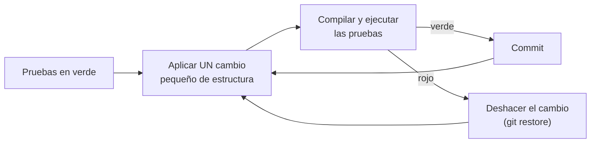
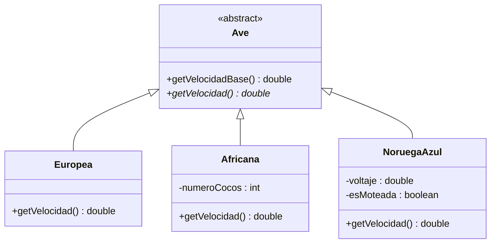
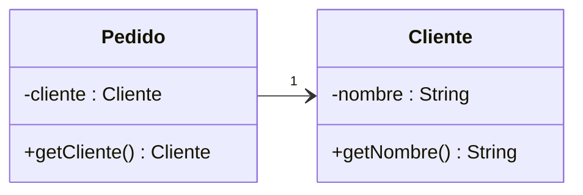
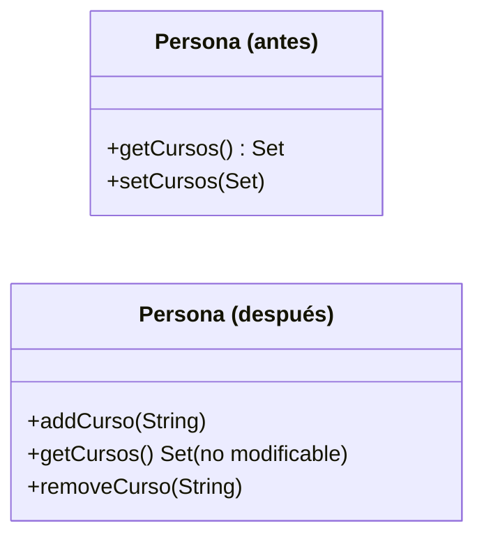
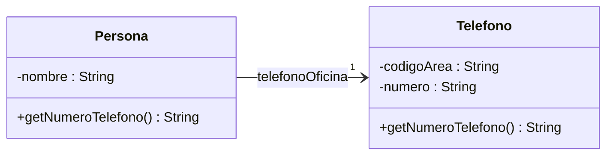
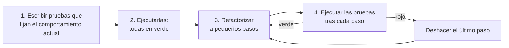
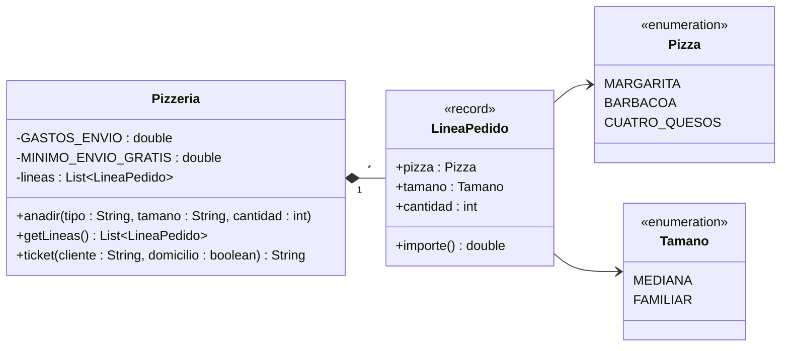

---
tags:
  - entornos-de-desarrollo
  - DAM1
  - refactorizacion
  - malos-olores
unidad: 6
tema: Refactorización — concepto, patrones de refactorización, malos olores, relación con las pruebas y herramientas
---

# Unidad 6. Refactorización

> [!abstract] Objetivos de la unidad
> - Definir la refactorización y distinguirla de corregir errores, añadir funcionalidades u optimizar el rendimiento.
> - Decidir cuándo y cómo refactorizar, integrando la refactorización en el trabajo diario.
> - Aplicar los patrones de refactorización más usuales sobre código orientado a objetos.
> - Reconocer los malos olores del código y asociar a cada uno la refactorización que lo resuelve.
> - Utilizar las pruebas automatizadas como red de seguridad antes y después de refactorizar.
> - Emplear las refactorizaciones automáticas y los formateadores de los IDE actuales.
> - Refactorizar paso a paso un fragmento de código heredado conservando su comportamiento.

---

## 1. Introducción

### 1.1. Concepto

> [!note] Definición: refactorización
> «Transformación del *software* que preserva su comportamiento, modificando su estructura interna para mejorarlo» (William Opdyke, 1992). Informalmente se denomina **limpieza de código**.

En un proyecto grande o de larga duración es frecuente tener que revisar y modificar código escrito tiempo atrás, o trabajar con el código de otra persona, que antes hay que estudiar y comprender. Aunque existan comentarios y documentación, la refactorización consigue un código **más sencillo de comprender, más compacto, más limpio y más fácil de modificar**.

> [!important] La regla fundamental
> Refactorizar **no cambia la funcionalidad** del código ni el comportamiento del programa: debe comportarse exactamente igual antes y después. Si cambia lo que hace el programa, ya no es una refactorización.

| Actividad | ¿Cambia el comportamiento? | Objetivo |
|---|---|---|
| **Refactorizar** | No | Mejorar la estructura interna: legibilidad, diseño, facilidad de cambio |
| Corregir un error | Sí (lo que estaba mal pasa a estar bien) | Que el programa haga lo que debía |
| Añadir una funcionalidad | Sí | Que el programa haga algo nuevo |
| Optimizar el rendimiento | No en el resultado, sí en el tiempo o la memoria | Que el programa sea más rápido o consuma menos |

> [!info] Refactorizar no es optimizar
> El capítulo del material se titula «Optimización y documentación», pero la refactorización no busca que el programa sea más **rápido**, sino que el código sea más **claro**. A veces el código refactorizado es incluso algo más lento (por ejemplo, al extraer métodos). Primero se escribe código claro; si después se detecta un problema de rendimiento con una medición (véase la [Unidad 5](05-diseno-y-ejecucion-de-pruebas.md)), se optimiza solo esa parte.

> [!info] Alcance
> El capítulo del material incluye además el control de versiones y la documentación, que se tratan en la [Unidad 3](03-control-de-versiones-con-git.md) y en la [Unidad 7](07-documentacion-del-software.md).

### 1.2. Para qué sirve

- Que el código sea más fácil de **entender**: se lee muchas más veces de las que se escribe.
- Que sea más **limpio y claro**, eliminando duplicaciones y nombres confusos.
- Que sea más fácil de **modificar** y ampliar en el futuro.
- Que los errores se **encuentren antes**: en código claro, los defectos se ven.

---

## 2. Cuándo y cómo refactorizar

No existe ninguna etapa del desarrollo dedicada específicamente a la refactorización: se puede refactorizar en cualquier momento, ya que la funcionalidad, si se hace bien, no cambia. Precisamente por eso debería ser una **tarea recurrente** al codificar o mantener una aplicación. El modo más eficiente de tener un código refactorizado es **intercalar la creación de código nuevo con la refactorización** del existente, en lugar de dejarla para el final del proyecto.

| Momento | Ejemplo |
|---|---|
| Antes de añadir una funcionalidad | El código actual no permite añadirla limpiamente: primero se reorganiza, después se añade |
| Al corregir un error | Si cuesta entender el código, se aclara antes de corregir |
| Durante una revisión de código | Un compañero detecta un método demasiado largo en una *pull request* |
| Al terminar una tarea | Repasar lo escrito antes del *commit* |

> [!tip] Reglas prácticas
> - **Regla del *boy scout***: dejar el código un poco más limpio de lo que se encontró.
> - **Regla de tres**: la primera vez se escribe; la segunda vez que se repite algo, se tolera; la tercera, se refactoriza.
> - **Dos sombreros** (Kent Beck): en cada momento se está **añadiendo funcionalidad** o **refactorizando**, nunca las dos cosas a la vez. Se recomienda hacer *commits* separados para cada una.

El proceso seguro consiste en dar **pasos pequeños** y comprobar con las pruebas después de cada uno:



> [!warning] Cuándo no refactorizar
> - Cuando no hay pruebas que garanticen el comportamiento: primero se escriben (apartado 6).
> - Cuando el código va a reescribirse desde cero o a desecharse.
> - Justo antes de una entrega, si el riesgo de introducir un error no compensa.

---

## 3. Formato del código

Las tabulaciones y la sangría son un excelente recurso para obtener una mayor visibilidad del código y conseguir que sea más entendible y fácil de modificar. Aunque dar formato no es una refactorización en sí (no reorganiza el código), cumple con parte de sus objetivos.

| Entorno | Dar formato al documento | Configuración |
|---|---|---|
| Visual Studio | *Editar > Avanzadas > Dar formato al documento* (`Ctrl+K`, `Ctrl+D`) | *Herramientas > Opciones > Editor de texto* |
| VS Code | `Shift+Alt+F` (Windows) / `Ctrl+Shift+I` (Linux), o automático al guardar con `"editor.formatOnSave": true` | Configuración del formateador de cada lenguaje |
| IntelliJ IDEA | `Ctrl+Alt+L` | *Settings > Editor > Code Style* |

> [!tip] Formato compartido por el equipo
> Para que todo el equipo use el mismo estilo independientemente del IDE se utilizan un fichero **`.editorconfig`** (sangría, finales de línea, codificación) y **formateadores automáticos**: google-java-format o Spotless (Java), `dotnet format` (C#), Black o Ruff (Python), clang-format (C/C++), Prettier (web). Si se ejecutan antes de cada *commit*, los *diffs* de Git muestran solo cambios reales y no cambios de espacios.

---

## 4. Patrones de refactorización más usuales

Para refactorizar resulta útil disponer de una serie de reglas o casos de uso: eso es lo que aportan los **patrones de refactorización**. Indican **qué** cambiar y **cómo** cambiarlo según lo que se quiera mejorar, evitan cambios mal hechos y dan al equipo un vocabulario común («aquí conviene extraer un método»).

No siempre pueden aplicarse todos los patrones: depende del lenguaje y del tipo de código. Los de este apartado están pensados para lenguajes **orientados a objetos** y proceden, en su mayoría, del catálogo de Martin Fowler (*Refactoring*, 1999; 2.ª ed., 2018).

| # | Patrón | Problema | Solución |
|---|---|---|---|
| 4.1 | Extraer método | Fragmento de código que puede agruparse | Convertirlo en un método con nombre explicativo |
| 4.2 | Separar variables temporales | Una variable temporal guarda valores distintos | Una variable por cada valor |
| 4.3 | Eliminar asignaciones a parámetros | Se asigna un valor a un parámetro | Usar una variable local |
| 4.4 | Mover método | Un método usa más datos de otra clase que de la suya | Moverlo a esa clase |
| 4.5 | Consolidar fragmentos duplicados en condicionales | El mismo código en todas las ramas | Sacarlo fuera del condicional |
| 4.6 | Descomponer un condicional | Condición o ramas complicadas | Extraer métodos de la condición y de las ramas |
| 4.7 | Consolidar expresiones condicionales | Varios condicionales con el mismo resultado | Unirlos en una condición con nombre |
| 4.8 | Reemplazar condicional por polimorfismo | Un `switch` según el tipo del objeto | Una subclase por tipo que sobrescribe el método |
| 4.9 | Reemplazar número mágico por constante | Literal con significado especial | Constante con nombre |
| 4.10 | Reemplazar número mágico por método constante | Ídem | Método que devuelve el literal |
| 4.11 | Reemplazar datos por objetos | Atributo simple que necesita más información o comportamiento | Convertirlo en un objeto |
| 4.12 | Reemplazar *array* por objeto | *Array* cuyas posiciones significan cosas distintas | Objeto con un atributo por posición |
| 4.13 | Encapsular atributo | Atributo público | Hacerlo privado con métodos de acceso |
| 4.14 | Encapsular atributo como propiedad | Ídem (C#) | Convertirlo en propiedad |
| 4.15 | Encapsular colección | Un método devuelve la colección original | Devolverla de solo lectura y añadir métodos para modificarla |
| 4.16 | Reemplazar subclases por atributos | Subclases que solo devuelven constantes | Un atributo en la superclase |
| 4.17 | Extraer subclase | Características que solo usan algunas instancias | Llevarlas a una subclase |
| 4.18 | Extraer clase | Una clase hace el trabajo de dos | Repartirlo en dos clases |

> [!info] Cómo se han verificado los ejemplos
> El material muestra fragmentos sueltos, varios de ellos con errores (apartado 4.19). Aquí cada ejemplo es una clase Java completa; las versiones «antes» y «después» se han ejecutado con el mismo programa de prueba y producen **exactamente la misma salida**, que se muestra al final de cada patrón. Es la forma más simple de comprobar que una refactorización preserva el comportamiento.

### 4.1. Extraer método

- **Problema:** se tiene un fragmento de código que puede agruparse (un método hace demasiadas cosas, hay código repetido o su propósito no está claro).
- **Solución:** se convierte el fragmento en un método cuyo **nombre explique su propósito**. El método original queda más corto y se lee como una lista de pasos.

**Antes:**

```java
// Cliente.java
public class Cliente {
    private final String nombre;
    private final double[] cargos;

    public Cliente(String nombre, double[] cargos) {
        this.nombre = nombre;
        this.cargos = cargos;
    }

    double getCargoPendiente() {
        double total = 0;
        for (double c : cargos) {
            total += c;
        }
        return total;
    }

    void imprimirBanner() {
        System.out.println("***** Factura *****");
    }

    void imprimirTodo() {
        imprimirBanner();
        // detalles de impresión
        System.out.println("nombre: " + nombre);
        System.out.println("cantidad: " + getCargoPendiente());
    }
}
```

**Después:**

```java
// Cliente.java
public class Cliente {
    private final String nombre;
    private final double[] cargos;

    public Cliente(String nombre, double[] cargos) {
        this.nombre = nombre;
        this.cargos = cargos;
    }

    double getCargoPendiente() {
        double total = 0;
        for (double c : cargos) {
            total += c;
        }
        return total;
    }

    void imprimirBanner() {
        System.out.println("***** Factura *****");
    }

    void imprimirTodo() {
        imprimirBanner();
        imprimirDetalles(getCargoPendiente());
    }

    void imprimirDetalles(double cargoPendiente) {
        System.out.println("nombre: " + nombre);
        System.out.println("cantidad: " + cargoPendiente);
    }
}
```

Salida del programa de prueba, idéntica antes y después:

```text
***** Factura *****
nombre: Ana
cantidad: 50.5
```

> [!tip] Un comentario suele anunciar un método
> El comentario `// detalles de impresión` describía lo que hacía el bloque; tras la extracción, el **nombre del método** lo dice y el comentario sobra.

### 4.2. Separar variables temporales

- **Problema:** se tiene una variable temporal que se usa más de una vez para guardar valores distintos, y no es una variable de bucle ni un acumulador.
- **Solución:** se crea una variable diferente para cada asignación, con un nombre que explique el valor; se recomienda declararlas `final` para impedir que se reutilicen.

**Antes:**

```java
// Rectangulo.java
public class Rectangulo {
    private final double alto;
    private final double ancho;

    public Rectangulo(double alto, double ancho) {
        this.alto = alto;
        this.ancho = ancho;
    }

    void imprimirMedidas() {
        double temp = 2 * (alto + ancho);
        System.out.println("Perímetro: " + temp);
        temp = alto * ancho;
        System.out.println("Área: " + temp);
    }
}
```

**Después:**

```java
// Rectangulo.java
public class Rectangulo {
    private final double alto;
    private final double ancho;

    public Rectangulo(double alto, double ancho) {
        this.alto = alto;
        this.ancho = ancho;
    }

    void imprimirMedidas() {
        final double perimetro = 2 * (alto + ancho);
        System.out.println("Perímetro: " + perimetro);
        final double area = alto * ancho;
        System.out.println("Área: " + area);
    }
}
```

Salida del programa de prueba, idéntica antes y después:

```text
Perímetro: 15.0
Área: 13.5
```

### 4.3. Eliminar asignaciones a parámetros

- **Problema:** un parámetro se usa para recibir una asignación dentro del método, de modo que deja de ser solo un dato de entrada.
- **Solución:** se usa una variable local en su lugar. El parámetro conserva siempre el valor recibido, lo que evita confusiones (y, en lenguajes con paso por referencia, efectos inesperados).

**Antes:**

```java
// Descuentos.java
public class Descuentos {
    static int descuento(int entradaValor, int cantidad, int anio) {
        if (entradaValor > 50) {
            entradaValor -= 2;
        }
        if (cantidad > 100) {
            entradaValor -= 1;
        }
        if (anio > 2020) {
            entradaValor -= 4;
        }
        return entradaValor;
    }
}
```

**Después:**

```java
// Descuentos.java
public class Descuentos {
    static int descuento(int entradaValor, int cantidad, int anio) {
        int resultado = entradaValor;
        if (entradaValor > 50) {
            resultado -= 2;
        }
        if (cantidad > 100) {
            resultado -= 1;
        }
        if (anio > 2020) {
            resultado -= 4;
        }
        return resultado;
    }
}
```

Salida del programa de prueba, idéntica antes y después:

```text
53
40
```

### 4.4. Mover método

- **Problema:** un método es, o será, usado más por otra clase que por aquella en la que está definido; hay una mala distribución de responsabilidades.
- **Solución:** se crea el método con un cuerpo similar en la clase que más lo usa. El método antiguo se convierte en una delegación simple o se elimina.

En el ejemplo, el método `participante` está en `Persona` pero trabaja con los datos de `Proyecto`.

**Antes:**

```java
// Proyecto.java
public class Proyecto {
    Persona[] participantes;

    Proyecto(Persona... participantes) {
        this.participantes = participantes;
    }
}
```

```java
// Persona.java
public class Persona {
    int id;

    Persona(int id) {
        this.id = id;
    }

    boolean participante(Proyecto p) {
        for (int i = 0; i < p.participantes.length; i++) {
            if (p.participantes[i].id == id) {
                return true;
            }
        }
        return false;
    }
}
```

**Después:**

```java
// Proyecto.java
public class Proyecto {
    Persona[] participantes;

    Proyecto(Persona... participantes) {
        this.participantes = participantes;
    }

    boolean participante(Persona x) {
        for (int i = 0; i < participantes.length; i++) {
            if (participantes[i].id == x.id) {
                return true;
            }
        }
        return false;
    }
}
```

```java
// Persona.java
public class Persona {
    int id;

    Persona(int id) {
        this.id = id;
    }
}
```

La llamada pasa de `x.participante(p)` a `p.participante(x)`: el proyecto gestiona sus propios datos y `Persona` queda más simple.

Salida del programa de prueba, idéntica antes y después:

```text
true false
```

### 4.5. Consolidar fragmentos duplicados en condicionales

- **Problema:** el mismo fragmento de código está en todas las ramas de una expresión condicional.
- **Solución:** se saca dicho fragmento fuera del condicional.

**Antes:**

```java
// Venta.java
public class Venta {
    double total;

    boolean esAcuerdoEspecial(String cliente) {
        return cliente.startsWith("VIP");
    }

    void enviar() {
        System.out.printf("Enviado con total %.2f%n", total);
    }

    void procesar(String cliente, double precio) {
        if (esAcuerdoEspecial(cliente)) {
            total = precio * 0.95;
            enviar();
        } else {
            total = precio * 0.98;
            enviar();
        }
    }
}
```

**Después:**

```java
// Venta.java
public class Venta {
    double total;

    boolean esAcuerdoEspecial(String cliente) {
        return cliente.startsWith("VIP");
    }

    void enviar() {
        System.out.printf("Enviado con total %.2f%n", total);
    }

    void procesar(String cliente, double precio) {
        if (esAcuerdoEspecial(cliente)) {
            total = precio * 0.95;
        } else {
            total = precio * 0.98;
        }
        enviar();
    }
}
```

Salida del programa de prueba, idéntica antes y después:

```text
Enviado con total 95,00
Enviado con total 98,00
```

### 4.6. Descomponer un condicional

- **Problema:** se tiene una condición complicada, o ramas con mucha lógica, que hacen difícil leer el `if`.
- **Solución:** se extraen métodos de la condición y de cada rama, con nombres que expresen la intención. **Un `if` debe leerse como una frase.**

**Antes:**

```java
// Tarifa.java
import java.time.LocalDate;

public class Tarifa {
    static final LocalDate EMPIEZA_VERANO = LocalDate.of(2026, 6, 21);
    static final LocalDate FIN_VERANO = LocalDate.of(2026, 9, 22);
    double tasaInvierno = 1.5;
    double cargoServicioInvierno = 10;
    double tasaVerano = 1.2;

    double cargo(LocalDate fecha, int cantidad) {
        double cargo;
        if (fecha.isBefore(EMPIEZA_VERANO) || fecha.isAfter(FIN_VERANO)) {
            cargo = cantidad * tasaInvierno + cargoServicioInvierno;
        } else {
            cargo = cantidad * tasaVerano;
        }
        return cargo;
    }
}
```

**Después:**

```java
// Tarifa.java
import java.time.LocalDate;

public class Tarifa {
    static final LocalDate EMPIEZA_VERANO = LocalDate.of(2026, 6, 21);
    static final LocalDate FIN_VERANO = LocalDate.of(2026, 9, 22);
    double tasaInvierno = 1.5;
    double cargoServicioInvierno = 10;
    double tasaVerano = 1.2;

    double cargo(LocalDate fecha, int cantidad) {
        double cargo;
        if (noEsVerano(fecha)) {
            cargo = cargoInvierno(cantidad);
        } else {
            cargo = cargoVerano(cantidad);
        }
        return cargo;
    }

    boolean noEsVerano(LocalDate fecha) {
        return fecha.isBefore(EMPIEZA_VERANO) || fecha.isAfter(FIN_VERANO);
    }

    double cargoInvierno(int cantidad) {
        return cantidad * tasaInvierno + cargoServicioInvierno;
    }

    double cargoVerano(int cantidad) {
        return cantidad * tasaVerano;
    }
}
```

Salida del programa de prueba, idéntica antes y después:

```text
25.0
12.0
12.0
```

### 4.7. Consolidar expresiones condicionales

- **Problema:** se tiene una secuencia de condicionales que producen el mismo resultado.
- **Solución:** se combinan en una sola expresión y se extrae a un método con un nombre claro.

**Antes:**

```java
// Empleado.java
public class Empleado {
    int antiguedad;
    int mesesDiscapacitado;
    boolean esTiempoParcial;
    double salario;

    Empleado(int antiguedad, int mesesDiscapacitado, boolean esTiempoParcial, double salario) {
        this.antiguedad = antiguedad;
        this.mesesDiscapacitado = mesesDiscapacitado;
        this.esTiempoParcial = esTiempoParcial;
        this.salario = salario;
    }

    double cuantiaPorDiscapacidad() {
        if (antiguedad < 2) {
            return 0;
        }
        if (mesesDiscapacitado > 12) {
            return 0;
        }
        if (esTiempoParcial) {
            return 0;
        }
        // calculamos la cuantía por discapacidad
        return salario * 0.6;
    }
}
```

**Después:**

```java
// Empleado.java
public class Empleado {
    int antiguedad;
    int mesesDiscapacitado;
    boolean esTiempoParcial;
    double salario;

    Empleado(int antiguedad, int mesesDiscapacitado, boolean esTiempoParcial, double salario) {
        this.antiguedad = antiguedad;
        this.mesesDiscapacitado = mesesDiscapacitado;
        this.esTiempoParcial = esTiempoParcial;
        this.salario = salario;
    }

    double cuantiaPorDiscapacidad() {
        if (esNoElegibleParaDiscapacidad()) {
            return 0;
        }
        // calculamos la cuantía por discapacidad
        return salario * 0.6;
    }

    boolean esNoElegibleParaDiscapacidad() {
        return antiguedad < 2 || mesesDiscapacitado > 12 || esTiempoParcial;
    }
}
```

Salida del programa de prueba, idéntica antes y después:

```text
0.0
0.0
0.0
600.0
```

### 4.8. Reemplazar condicional por polimorfismo

- **Problema:** se tiene un condicional (`if` o `switch`) que elige diferentes comportamientos según el **tipo** de un objeto. Cada vez que se añade un tipo hay que modificar todos los `switch`.
- **Solución:** se mueve cada rama del condicional a un método **sobrescrito** en una subclase y el método original pasa a ser **abstracto**.

**Antes:**

```java
// Ave.java
public class Ave {
    static final int EUROPEA = 0;
    static final int AFRICANA = 1;
    static final int NORUEGA_AZUL = 2;

    private final int tipo;
    private final int numeroCocos;
    private final double voltaje;
    private final boolean esMoteada;

    Ave(int tipo, int numeroCocos, double voltaje, boolean esMoteada) {
        this.tipo = tipo;
        this.numeroCocos = numeroCocos;
        this.voltaje = voltaje;
        this.esMoteada = esMoteada;
    }

    double getVelocidadBase() {
        return 12.0;
    }

    double getVelocidadBase(double voltaje) {
        return Math.min(24.0, voltaje * 10);
    }

    double getFactorCarga() {
        return 2.0;
    }

    double getVelocidad() {
        switch (tipo) {
            case EUROPEA:
                return getVelocidadBase();
            case AFRICANA:
                return getVelocidadBase() - getFactorCarga() * numeroCocos;
            case NORUEGA_AZUL:
                return esMoteada ? 0 : getVelocidadBase(voltaje);
        }
        throw new RuntimeException("Debería ser inalcanzable");
    }
}
```

**Después:**

```java
// Ave.java
public abstract class Ave {
    double getVelocidadBase() {
        return 12.0;
    }

    abstract double getVelocidad();     // cada subclase aporta su comportamiento
}
```

```java
// Europea.java
class Europea extends Ave {
    @Override
    double getVelocidad() {
        return getVelocidadBase();
    }
}
```

```java
// Africana.java
class Africana extends Ave {
    private final int numeroCocos;

    Africana(int numeroCocos) {
        this.numeroCocos = numeroCocos;
    }

    double getFactorCarga() {
        return 2.0;
    }

    @Override
    double getVelocidad() {
        return getVelocidadBase() - getFactorCarga() * numeroCocos;
    }
}
```

```java
// NoruegaAzul.java
class NoruegaAzul extends Ave {
    private final double voltaje;
    private final boolean esMoteada;

    NoruegaAzul(double voltaje, boolean esMoteada) {
        this.voltaje = voltaje;
        this.esMoteada = esMoteada;
    }

    double getVelocidadBase(double voltaje) {
        return Math.min(24.0, voltaje * 10);
    }

    @Override
    double getVelocidad() {
        return esMoteada ? 0 : getVelocidadBase(voltaje);
    }
}
```



Salida del programa de prueba, idéntica antes y después:

```text
12.0
8.0
15.0
0.0
```

Añadir un nuevo tipo de ave ya no obliga a modificar ningún `switch`: basta con crear otra subclase. Además, cada subclase solo tiene los atributos que necesita (`numeroCocos` solo existe en `Africana`).

> [!info] En Java moderno
> Cuando el comportamiento por tipo es sencillo, también puede usarse un `enum` con un método por constante o un `switch` sobre tipos sellados (`sealed`, Java 17+). El polimorfismo con subclases sigue siendo la opción más extensible.

### 4.9. Reemplazar número mágico por constante simbólica

- **Problema:** se tiene un literal con un significado particular que no es evidente al leer el código; además, si cambia, hay que buscarlo en todo el programa.
- **Solución:** se crea una constante, se nombra de forma significativa y se sustituye el literal por ella.

**Antes:**

```java
// Fisica.java
public class Fisica {
    static double energiaPotencial(double masa, double altura) {
        return masa * altura * 9.81;
    }
}
```

**Después:**

```java
// Fisica.java
public class Fisica {
    static final double CONSTANTE_GRAVITACIONAL = 9.81;

    static double energiaPotencial(double masa, double altura) {
        return masa * CONSTANTE_GRAVITACIONAL * altura;
    }
}
```

Salida del programa de prueba, idéntica antes y después:

```text
196.20000000000002
```

> [!info] Decimales en binario
> El resultado no es exactamente 196,2 porque, como se vio en la [Unidad 5](05-diseno-y-ejecucion-de-pruebas.md), los `double` se almacenan en binario. Lo importante aquí es que el valor es **idéntico** antes y después.

### 4.10. Reemplazar número mágico por método constante

- **Problema:** el mismo que en el patrón anterior.
- **Solución:** se crea un **método** que devuelve el literal, se nombra significativamente y se sustituye el literal por la llamada. Es útil cuando el valor podría calcularse o variar en el futuro (por ejemplo, leerse de configuración) o cuando una subclase debe poder redefinirlo.

**Antes:** igual que en el apartado 4.9.

**Después:**

```java
// Fisica.java
public class Fisica {
    static double energiaPotencial(double masa, double altura) {
        return masa * constanteGravitacional() * altura;
    }

    public static double constanteGravitacional() {
        return 9.81;
    }
}
```

Salida del programa de prueba, idéntica antes y después:

```text
196.20000000000002
```

### 4.11. Reemplazar datos y valores por objetos

- **Problema:** se tiene un atributo simple que necesita información o comportamiento adicional (por ejemplo, el cliente de un pedido guardado como un simple texto, cuando se necesitará su dirección, su teléfono…).
- **Solución:** se convierte el atributo en un objeto con sus propios atributos y métodos.

**Antes:**

```java
// Pedido.java
public class Pedido {
    private final String cliente;      // solo el nombre: no admite más datos

    public Pedido(String cliente) {
        this.cliente = cliente;
    }

    public String getCliente() {
        return cliente;
    }
}
```

**Después:**

```java
// Cliente.java
public class Cliente {
    private final String nombre;

    public Cliente(String nombre) {
        this.nombre = nombre;
    }

    public String getNombre() {
        return nombre;
    }
}
```

```java
// Pedido.java
public class Pedido {
    private final Cliente cliente;     // ahora es un objeto: puede crecer con nuevos datos

    public Pedido(Cliente cliente) {
        this.cliente = cliente;
    }

    public Cliente getCliente() {
        return cliente;
    }
}
```



Salida del programa de prueba, idéntica antes y después:

```text
Ana García
```

### 4.12. Reemplazar *array* por objeto

- **Problema:** se tiene un *array* en el que ciertos elementos significan cosas distintas (la posición 0 es un nombre y la 1, un número de partidos). Hay que recordar qué guarda cada índice y todo se almacena con el mismo tipo.
- **Solución:** se reemplaza el *array* por un objeto con un atributo para cada elemento.

**Antes:**

```java
// Clasificacion.java
public class Clasificacion {
    public static void main(String[] args) {
        String[] fila = new String[2];
        fila[0] = "San Martín de la Arena C.D.";   // ¿qué significa la posición 0?
        fila[1] = "15";                            // ¿y la 1?
        System.out.println(fila[0] + ": " + fila[1] + " partidos ganados");
    }
}
```

**Después:**

```java
// Rendimiento.java
public class Rendimiento {
    private String nombre;
    private int ganados;

    public String getNombre() { return nombre; }
    public void setNombre(String nombre) { this.nombre = nombre; }
    public int getGanados() { return ganados; }
    public void setGanados(int ganados) { this.ganados = ganados; }
}
```

```java
// Clasificacion.java
public class Clasificacion {
    public static void main(String[] args) {
        Rendimiento fila = new Rendimiento();
        fila.setNombre("San Martín de la Arena C.D.");
        fila.setGanados(15);
        System.out.println(fila.getNombre() + ": " + fila.getGanados() + " partidos ganados");
    }
}
```

Salida del programa de prueba, idéntica antes y después:

```text
San Martín de la Arena C.D.: 15 partidos ganados
```

Además de los nombres, se gana el **tipo** correcto: los partidos ganados pasan de `String` a `int`.

> [!tip] *Records*
> Si el objeto solo agrupa datos que no cambian, en Java 16+ basta con un `record`: `record Rendimiento(String nombre, int ganados) { }`.

### 4.13. Encapsular atributo

- **Problema:** se tiene un atributo público: cualquier clase puede leerlo y modificarlo sin control.
- **Solución:** se hace **privado** y se crean métodos de acceso (`get` y `set`). Así se controla cómo se lee y se modifica, y puede añadirse validación sin cambiar a quien lo usa.

**Antes:**

```java
// Alumno.java
public class Alumno {
    public String nombre;
}
```

**Después:**

```java
// Alumno.java
public class Alumno {
    private String nombre;

    public String getNombre() {
        return nombre;
    }

    public void setNombre(String nombre) {
        this.nombre = nombre;
    }
}
```

Salida del programa de prueba, idéntica antes y después:

```text
Ana
```

### 4.14. Encapsular atributo como propiedad

- **Problema:** el mismo que en el patrón anterior, en un lenguaje con **propiedades** como C#.
- **Solución:** se convierte el atributo en una propiedad. Desde fuera se usa con la misma sintaxis que un atributo (`a.Nombre = "Ana"`), pero internamente pasa por los métodos `get` y `set`, a los que puede añadirse lógica.

**Antes:**

```csharp
// Alumno.cs
public class Alumno
{
    public string _nombre = "";
}
```

**Después** (propiedad autoimplementada):

```csharp
// Alumno.cs
public class Alumno
{
    public virtual string Nombre { get; set; } = "";
}
```

Si se necesita lógica, la propiedad se escribe con su atributo privado:

```csharp
// Alumno2.cs
public class Alumno2
{
    private string nombre = "";

    public string Nombre
    {
        get => nombre;
        set
        {
            if (string.IsNullOrWhiteSpace(value))
            {
                throw new ArgumentException("El nombre no puede estar vacío");
            }
            nombre = value.Trim();
        }
    }
}
```

```csharp
// Program.cs
var a = new Alumno();
a.Nombre = "Ana";
Console.WriteLine(a.Nombre);

var b = new Alumno2 { Nombre = "  Luis  " };
Console.WriteLine($"[{b.Nombre}]");
```

```text
Ana
[Luis]
```

> [!info] Matiz respecto al material
> El ejemplo del material declara la propiedad como `virtual`; solo es necesario si se quiere permitir que una subclase la redefina. En Java no existen las propiedades: se usan los métodos `get`/`set` del apartado anterior o un `record`.

### 4.15. Encapsular colección

- **Problema:** un método devuelve una colección y quien la recibe puede modificarla directamente, sin que la clase propietaria se entere.
- **Solución:** el método devuelve una colección **de solo lectura** y la clase ofrece métodos para **añadir** y **eliminar** elementos.

**Antes:**

```java
// Persona.java
import java.util.HashSet;
import java.util.Set;

public class Persona {
    private Set<String> cursos = new HashSet<>();

    public Set<String> getCursos() {
        return cursos;                    // se entrega la colección original
    }

    public void setCursos(Set<String> cursos) {
        this.cursos = cursos;
    }
}
```

**Después:**

```java
// Persona.java
import java.util.Collections;
import java.util.HashSet;
import java.util.Set;

public class Persona {
    private final Set<String> cursos = new HashSet<>();

    public Set<String> getCursos() {
        return Collections.unmodifiableSet(cursos);   // vista de solo lectura
    }

    public void addCurso(String curso) {
        cursos.add(curso);
    }

    public void removeCurso(String curso) {
        cursos.remove(curso);
    }
}
```



Con la versión anterior, `p.getCursos().add("DAM1")` modificaba la colección interna desde fuera. Con la nueva, se usa `p.addCurso("DAM1")`, y el intento de modificar la vista devuelta lanza una excepción:

```text
[DAM1]
No se puede modificar desde fuera: UnsupportedOperationException
```

> [!info] Cambio de interfaz
> Este patrón, como los de los apartados 4.16 a 4.18, cambia la forma en que **otras clases** usan la clase refactorizada, por lo que también hay que actualizar a quienes la llaman (y sus pruebas). El comportamiento observable del programa no cambia.

### 4.16. Reemplazar subclases por atributos

- **Problema:** se tienen subclases que solo se diferencian en métodos que devuelven información **constante**. El diseño es innecesariamente complejo.
- **Solución:** se sustituyen esos métodos por un atributo de la superclase y se eliminan las subclases. Para crear los objetos se usan métodos de fábrica (véase el patrón Fábrica en la [Unidad 1](01-desarrollo-de-software.md)).

**Antes:**

```java
// Persona.java
public abstract class Persona {
    abstract char getCodigo();
}
```

```java
// Hombre.java
class Hombre extends Persona {
    @Override
    char getCodigo() {
        return 'H';
    }
}
```

```java
// Mujer.java
class Mujer extends Persona {
    @Override
    char getCodigo() {
        return 'M';
    }
}
```

**Después:**

```java
// Persona.java
public class Persona {
    private final char codigo;

    private Persona(char codigo) {
        this.codigo = codigo;
    }

    static Persona crearHombre() {
        return new Persona('H');
    }

    static Persona crearMujer() {
        return new Persona('M');
    }

    char getCodigo() {
        return codigo;
    }
}
```

Salida del programa de prueba, idéntica antes y después:

```text
H M
```

### 4.17. Extraer subclase

- **Problema:** una clase tiene atributos o métodos que solo usan determinadas instancias (por ejemplo, el empleado solo tiene sentido en los trabajos de mano de obra; en las piezas queda a `null`).
- **Solución:** se crea una subclase para ese subconjunto y se mueven a ella sus atributos y métodos. La clase original queda más general.

**Antes:**

```java
// Trabajo.java
public class Trabajo {
    private final int cantidad;
    private final double precioUnidad;
    private final String empleado;      // solo tiene sentido en los trabajos de mano de obra

    public Trabajo(int cantidad, double precioUnidad, String empleado) {
        this.cantidad = cantidad;
        this.precioUnidad = precioUnidad;
        this.empleado = empleado;
    }

    public double getPrecioUnidad() {
        return precioUnidad;
    }

    public double getPrecioTotal() {
        return cantidad * getPrecioUnidad();
    }

    public String getEmpleado() {
        return empleado;
    }
}
```

**Después:**

```java
// Trabajo.java
public class Trabajo {
    private final int cantidad;
    private final double precioUnidad;

    public Trabajo(int cantidad, double precioUnidad) {
        this.cantidad = cantidad;
        this.precioUnidad = precioUnidad;
    }

    public double getPrecioUnidad() {
        return precioUnidad;
    }

    public double getPrecioTotal() {
        return cantidad * getPrecioUnidad();
    }
}
```

```java
// Labor.java
public class Labor extends Trabajo {
    private final String empleado;

    public Labor(int cantidad, double precioUnidad, String empleado) {
        super(cantidad, precioUnidad);
        this.empleado = empleado;
    }

    public String getEmpleado() {
        return empleado;
    }
}
```

Salida del programa de prueba, idéntica antes y después:

```text
30.0
50.0 Luis
```

### 4.18. Extraer clase

- **Problema:** una clase hace el trabajo que deberían hacer dos (mezcla responsabilidades distintas).
- **Solución:** se crea una nueva clase y se mueven a ella los atributos y métodos relacionados.

**Antes:**

```java
// Persona.java
public class Persona {
    private final String nombre;
    private final String codigoAreaOficina;
    private final String numeroOficina;

    public Persona(String nombre, String codigoAreaOficina, String numeroOficina) {
        this.nombre = nombre;
        this.codigoAreaOficina = codigoAreaOficina;
        this.numeroOficina = numeroOficina;
    }

    public String getNombre() {
        return nombre;
    }

    public String getNumeroTelefono() {
        return "(" + codigoAreaOficina + ") " + numeroOficina;
    }
}
```

**Después:**

```java
// Telefono.java
public class Telefono {
    private final String codigoArea;
    private final String numero;

    public Telefono(String codigoArea, String numero) {
        this.codigoArea = codigoArea;
        this.numero = numero;
    }

    public String getNumeroTelefono() {
        return "(" + codigoArea + ") " + numero;
    }
}
```

```java
// Persona.java
public class Persona {
    private final String nombre;
    private final Telefono telefonoOficina;

    public Persona(String nombre, Telefono telefonoOficina) {
        this.nombre = nombre;
        this.telefonoOficina = telefonoOficina;
    }

    public String getNombre() {
        return nombre;
    }

    public String getNumeroTelefono() {
        return telefonoOficina.getNumeroTelefono();   // delega en la nueva clase
    }
}
```



Salida del programa de prueba, idéntica antes y después:

```text
Ana (971) 123456
```

### 4.19. Correcciones respecto a los ejemplos del material

| Patrón | Problema en el material | Corrección |
|---|---|---|
| Todos | El código mezcla Java y C# (`final double` o `boolean` junto a `Console.WriteLine`) y usa comillas tipográficas (“ ”): no compila en ningún lenguaje | Ejemplos en Java (y C# solo en 4.14), con comillas rectas |
| Extraer método | El método se llama `imprimirTodo` antes e `ImprimirTodo` después | Mismo nombre: una refactorización no debe cambiar el nombre por accidente |
| Separar variables temporales | Se declara `perimetro` y se imprime `perimeter` | Mismo identificador |
| Descomponer un condicional | Se asigna a `cargo` en una rama y a `charge` en la otra | `cargo` en ambas |
| Reemplazar condicional por polimorfismo | `getBVelocidadBase()` (errata); el método se describe como «sobrecargado»; la superclase se llama «Golondrina», aunque «noruego azul» es un loro | `getVelocidadBase()`; el método es **sobrescrito** (*override*), no sobrecargado (*overload*); superclase `Ave` |
| Reemplazar *array* por objeto | Se guarda `"15"` en el *array* y `"1337"` en el objeto, como texto | El mismo valor, y como entero |
| Resúmenes de las diapositivas | «polinomio», «probado», «agilizar cada caso», «siempre que no se cambie la forma del programa» | Polimorfismo, privado, analizar cada caso, **comportamiento** del programa |

---

## 5. Malos olores

> [!note] Definición: mal olor (*code smell*)
> Síntoma en el código que **indica que podría necesitar una refactorización**. No es un error en sí mismo, pero suele señalar un problema de diseño cercano. El término lo popularizaron Kent Beck y Martin Fowler.

No siempre que se detecta un posible mal olor hay un fallo de diseño que obligue a refactorizar: hay que saber reconocer los indicadores y **analizar cada caso**. Varias de las malas prácticas reconocidas como **antipatrones** (véase la [Unidad 1](01-desarrollo-de-software.md)) se corresponden con malos olores.

| Mal olor | Síntoma | Refactorización habitual |
|---|---|---|
| **Método largo** | Métodos extensos; los programas que viven más y mejor tienen métodos cortos, más reutilizables y con mayor semántica | Extraer método, descomponer condicional |
| **Clase grande** | Clases que hacen demasiado, con baja cohesión y muy vulnerables al cambio | Extraer clase, extraer subclase |
| **Lista de parámetros larga** | Muchos parámetros: elevan el acoplamiento, son difíciles de entender y cambian a menudo | Introducir un objeto parámetro, reemplazar datos por objetos |
| **Clase de datos** | Clases con solo atributos y `get`/`set`, sin comportamiento propio | Mover método (llevar a la clase el comportamiento que usa sus datos) |
| **Estructuras de agrupación condicional** | `switch` con muchas cláusulas o muchos `if` anidados | Reemplazar condicional por polimorfismo, descomponer condicional |
| **Comentarios** («desodorantes») | Un gran comentario que explica código poco claro; a menudo oculta otro mal olor | Extraer método con un nombre que haga innecesario el comentario |
| **Atributo temporal** | Atributos que solo se usan en ciertas circunstancias | Extraer clase o subclase |
| **Generalidad especulativa** | Jerarquías y clases sin utilidad actual, creadas «por si acaso» | Eliminar la clase, simplificar la jerarquía |
| **Jerarquías paralelas** | Cada subclase nueva en una jerarquía obliga a crear otra en una jerarquía distinta | Mover métodos para unificar las jerarquías |
| **Intermediario** | Clases cuyo único trabajo es delegar en otras | Eliminar el intermediario |
| **Legado rechazado** | Subclases que usan poco de lo que heredan: la herencia está mal aplicada | Sustituir la herencia por composición |
| **Intimidad inadecuada** | Clases que acceden a la parte privada de otras | Mover método, encapsular atributo |
| **Cadena de mensajes** | `a.getB().getC().getD().hacer()`: el cliente depende de toda la cadena | Ocultar la delegación (un método en `a` que haga el trabajo) |
| **Obsesión primitiva** | Uso excesivo de tipos primitivos para conceptos como dinero, rangos o teléfonos | Reemplazar datos por objetos, reemplazar *array* por objeto |
| **Clase perezosa** | Una clase que no hace nada o casi nada | Eliminarla e integrarla en otra |
| **Cambios en cadena** (cirugía a escopetazos) | Un cambio en una clase obliga a cambiar muchas otras | Mover método, extraer clase para agrupar lo que cambia junto |
| **Envidia de características** | Un método usa más cosas de otro objeto que del suyo | Mover método |
| **Duplicación de código** | Copiar y pegar código | Extraer método, consolidar fragmentos duplicados |
| **Grupos de datos** | Datos que siempre aparecen juntos (en atributos o parámetros) | Extraer clase: reduce listas de parámetros y llamadas |

> [!tip] Detección automática
> Los analizadores de la [Unidad 4](04-depuracion-y-analisis-de-codigo.md) detectan muchos malos olores: Checkstyle (`MethodLength`, `ParameterNumber`, `MagicNumber`), PMD, *SonarQube for IDE* («*Cognitive Complexity*», código duplicado) o la complejidad ciclomática de lizard (véase la [Unidad 5](05-diseno-y-ejecucion-de-pruebas.md)).

---

## 6. Refactorización y pruebas

Las pruebas son una parte **fundamental** del proceso de refactorización. Como la piedra angular de la refactorización es no agregar ni modificar la funcionalidad, las pruebas permiten comprobar si los resultados son los mismos antes y después de refactorizar o si, por el contrario, algo se ha hecho mal.



> [!note] Definición: pruebas de caracterización
> Pruebas que se escriben sobre código existente (a menudo sin pruebas previas) para **fijar su comportamiento actual**, sea correcto o no. No comprueban que el código haga lo que debe, sino que **siga haciendo lo mismo** tras los cambios. Son el primer paso para refactorizar código heredado.

Es probable que en algún caso la refactorización necesaria sea tan grande que afecte significativamente al **diseño** del código, lo que obligará a modificar también las pruebas (porque cambia la forma de usar las clases, como en los apartados 4.15 a 4.18). Lo mejor es refactorizar sobre la marcha para evitarlo; si ocurre, lo más aconsejable es modificar las pruebas **antes o a la vez** que el código, de modo que pruebas y refactorización se guíen de manera recíproca.

> [!important] Sin pruebas no hay refactorización segura
> Si el código no tiene pruebas, el primer paso no es refactorizar, sino escribirlas. Una «refactorización» sin pruebas es, en realidad, un cambio a ciegas.

---

## 7. Herramientas de refactorización

Una refactorización manual larga se convierte fácilmente en una tarea pesada y propensa a errores. Por eso los IDE incluyen **refactorizaciones automáticas**, que analizan la estructura del programa y aplican el cambio en todos los puntos afectados de forma segura (por ejemplo, renombrar un método actualiza todas sus llamadas, pero no un texto que casualmente se escriba igual).

El material describe las herramientas de Visual Studio: **IntelliSense** (inspección y autocompletado; véase la [Unidad 2](02-entornos-de-desarrollo-integrados.md)) y el menú contextual de refactorización, que se aplica sobre la zona seleccionada. En los IDE actuales:

| Refactorización | VS Code (Java y C#) | IntelliJ IDEA | Visual Studio |
|---|---|---|---|
| Cambiar nombre | `F2` | `Shift+F6` | `Ctrl+R`, `Ctrl+R` |
| Menú de refactorización / acciones rápidas | `Ctrl+Shift+R` / `Ctrl+.` | `Ctrl+Alt+Shift+T` / `Alt+Intro` | `Ctrl+.` |
| Extraer método | Seleccionar → `Ctrl+.` → *Extract to method* | `Ctrl+Alt+M` | `Ctrl+R`, `Ctrl+M` |
| Extraer variable / constante | `Ctrl+.` → *Extract to local variable* / *constant* | `Ctrl+Alt+V` / `Ctrl+Alt+C` | `Ctrl+.` |
| Generar *getters* y *setters* (encapsular) | `Ctrl+.` → *Generate Getters and Setters* | `Alt+Insert` | `Ctrl+R`, `Ctrl+E` (encapsular campo) |
| Cambiar firma del método | `Ctrl+.` → *Change signature* | `Ctrl+F6` | `Ctrl+R`, `Ctrl+O` (reordenar parámetros) |
| Mover | Menú de refactorización → *Move* | `F6` | Acción rápida *Mover a…* |

> [!info] Extensiones del material
> El material recomienda **ReSharper** (JetBrains) y **CodeRush** (DevExpress) para Visual Studio. Ambas siguen existiendo; JetBrains integra además las mismas refactorizaciones en IntelliJ IDEA y Rider. En VS Code, las refactorizaciones de Java las aporta la extensión de Red Hat incluida en el *Extension Pack for Java*, y las de C#, C# Dev Kit.

> [!warning] Automático no significa infalible
> Las refactorizaciones automáticas son seguras dentro del código que el IDE analiza, pero no detectan usos por reflexión, nombres escritos en ficheros de configuración o llamadas desde otros proyectos. Tras aplicarlas, se compila y se ejecutan las pruebas.

---

## 8. Errores frecuentes

> [!danger] Refactorizar y cambiar el comportamiento a la vez
> Mezclar en el mismo cambio una refactorización y una corrección o mejora hace imposible saber, si algo falla, qué lo ha provocado. Se separan en pasos y *commits* distintos.

> [!danger] Refactorizar sin pruebas
> Sin pruebas no hay forma de comprobar que el comportamiento se ha conservado. Primero, pruebas de caracterización.

> [!warning] Pasos demasiado grandes
> Reescribir media clase de golpe y ejecutar después las pruebas hace muy difícil localizar el error si fallan. Se avanza a pequeños pasos, ejecutando las pruebas tras cada uno.

> [!warning] Confundir sobrecargar con sobrescribir
> **Sobrecargar** (*overload*) es definir varios métodos con el mismo nombre y distintos parámetros en la misma clase. **Sobrescribir** (*override*) es redefinir en una subclase un método heredado. El polimorfismo se basa en sobrescribir; en Java conviene marcarlo con `@Override` para que el compilador lo compruebe.

> [!warning] Refactorizar por gusto personal
> Cambiar código que funciona solo porque «se haría de otra forma» genera *diffs* enormes y conflictos con el trabajo de los compañeros. Se refactoriza con un objetivo: entender, ampliar o corregir.

---

## 9. Ejemplo integrador: el ticket de una pizzería

Se refactoriza paso a paso un fragmento de código heredado, siguiendo el proceso del apartado 6: primero pruebas de caracterización y después refactorizaciones pequeñas, comprobando las pruebas tras cada una.

### 9.1. El código heredado

```java
// Pizzeria.java
import java.util.ArrayList;
import java.util.List;
import java.util.Locale;

public class Pizzeria {
    public List<String[]> lineas = new ArrayList<>();   // cada línea: {tipo, tamaño, cantidad}

    public void anadir(String tipo, String tamano, int cantidad) {
        lineas.add(new String[] {tipo, tamano, String.valueOf(cantidad)});
    }

    public String ticket(String cliente, boolean domicilio) {
        double t = 0;
        String s = "Cliente: " + cliente + "\n";
        for (String[] l : lineas) {
            double p = 0;
            if (l[0].equals("margarita")) {
                p = 8;
            } else if (l[0].equals("barbacoa")) {
                p = 10.5;
            } else if (l[0].equals("cuatro quesos")) {
                p = 11;
            }
            if (l[1].equals("familiar")) {
                p = p * 1.5;
            }
            int c = Integer.parseInt(l[2]);
            s = s + c + " x " + l[0] + " (" + l[1] + "): " + String.format(Locale.ROOT, "%.2f", p * c) + "\n";
            t = t + p * c;
        }
        if (domicilio) {
            if (t < 20) {
                t = t + 2.5;
                s = s + "Envío: " + String.format(Locale.ROOT, "%.2f", 2.5) + "\n";
            } else {
                s = s + "Envío: " + String.format(Locale.ROOT, "%.2f", 0.0) + "\n";
            }
        }
        s = s + "TOTAL: " + String.format(Locale.ROOT, "%.2f", t);
        return s;
    }
}
```

Malos olores detectados:

| Mal olor | Dónde |
|---|---|
| Método largo | `ticket` hace todo: precios, formato, envío y total (30 líneas, complejidad ciclomática 8) |
| Atributo público | `lineas` es `public` |
| *Array* con significados distintos / obsesión primitiva | `String[]` donde la posición 0 es el tipo, la 1 el tamaño y la 2 la cantidad (como texto) |
| Cadenas mágicas | `"margarita"`, `"familiar"`… repartidas por el código |
| Números mágicos | 8, 10.5, 11, 1.5, 20, 2.5 |
| Estructura de agrupación condicional | Cadena de `if-else` según el tipo de pizza |
| Duplicación | `String.format(Locale.ROOT, "%.2f", …)` repetido cuatro veces |
| Nombres poco expresivos | `t`, `s`, `p`, `c`, `l` |

El conjunto de reglas de Checkstyle de la [Unidad 4](04-depuracion-y-analisis-de-codigo.md) lo confirma:

```text
Starting audit...
[WARN] Pizzeria.java:19:21: '8' is a magic number. [MagicNumber]
[WARN] Pizzeria.java:21:21: '10.5' is a magic number. [MagicNumber]
[WARN] Pizzeria.java:23:21: '11' is a magic number. [MagicNumber]
[WARN] Pizzeria.java:26:25: '1.5' is a magic number. [MagicNumber]
[WARN] Pizzeria.java:33:21: '20' is a magic number. [MagicNumber]
[WARN] Pizzeria.java:34:25: '2.5' is a magic number. [MagicNumber]
[WARN] Pizzeria.java:35:72: '2.5' is a magic number. [MagicNumber]
Audit done.
```

### 9.2. Paso 1: pruebas de caracterización

Antes de tocar nada, se fija el comportamiento actual con pruebas que usan solo la interfaz pública que se va a conservar (`anadir` y `ticket`). Se incluye un caso con el **valor límite** del envío gratuito (un total de exactamente 20 €):

```java
// PizzeriaTest.java
import static org.junit.jupiter.api.Assertions.assertEquals;

import org.junit.jupiter.api.Test;

// Pruebas de caracterización: fijan el comportamiento ACTUAL antes de refactorizar
class PizzeriaTest {

    @Test
    void pedidoEnLocal() {
        Pizzeria p = new Pizzeria();
        p.anadir("margarita", "mediana", 2);
        p.anadir("barbacoa", "familiar", 1);
        assertEquals("""
                Cliente: Ana
                2 x margarita (mediana): 16.00
                1 x barbacoa (familiar): 15.75
                TOTAL: 31.75""", p.ticket("Ana", false));
    }

    @Test
    void domicilioConGastosDeEnvio() {
        Pizzeria p = new Pizzeria();
        p.anadir("cuatro quesos", "mediana", 1);
        assertEquals("""
                Cliente: Luis
                1 x cuatro quesos (mediana): 11.00
                Envío: 2.50
                TOTAL: 13.50""", p.ticket("Luis", true));
    }

    @Test
    void domicilioConEnvioGratis() {
        Pizzeria p = new Pizzeria();
        p.anadir("margarita", "familiar", 2);
        assertEquals("""
                Cliente: Pau
                2 x margarita (familiar): 24.00
                Envío: 0.00
                TOTAL: 24.00""", p.ticket("Pau", true));
    }

    @Test
    void limiteDelEnvioGratis() {
        Pizzeria p = new Pizzeria();
        p.anadir("margarita", "mediana", 1);    // 8,00
        p.anadir("margarita", "familiar", 1);   // 12,00 -> total exacto de 20,00
        assertEquals("""
                Cliente: Eva
                1 x margarita (mediana): 8.00
                1 x margarita (familiar): 12.00
                Envío: 0.00
                TOTAL: 20.00""", p.ticket("Eva", true));
    }
}
```

> [!info] Bloques de texto
> Las cadenas entre `"""` son **bloques de texto** (Java 15+): permiten escribir texto de varias líneas tal cual, sin `\n` ni concatenaciones.

```text
│  └─ PizzeriaTest ✔
│     ├─ domicilioConEnvioGratis() ✔
│     ├─ pedidoEnLocal() ✔
│     ├─ domicilioConGastosDeEnvio() ✔
│     └─ limiteDelEnvioGratis() ✔
...
[         4 tests successful      ]
[         0 tests failed          ]
```

### 9.3. Paso 2: refactorizar

Se aplican, uno tras otro y ejecutando las pruebas después de cada uno, los siguientes patrones:

| Paso | Patrón (apartado) | Cambio |
|---|---|---|
| 2.1 | Encapsular colección (4.15) | `lineas` pasa a ser `private final`; se añade `getLineas()` de solo lectura |
| 2.2 | Reemplazar *array* por objeto (4.12) | `String[]` → `record LineaPedido(Pizza pizza, Tamano tamano, int cantidad)` |
| 2.3 | Reemplazar condicional por polimorfismo (4.8), en su variante con `enum` | La cadena de `if` sobre el tipo de pizza → `enum Pizza` con su precio; el tamaño → `enum Tamano` con su multiplicador |
| 2.4 | Reemplazar número mágico por constante (4.9) | `GASTOS_ENVIO` y `MINIMO_ENVIO_GRATIS` |
| 2.5 | Extraer método (4.1) y descomponer condicional (4.6) | `formatearLinea`, `subtotal`, `gastosEnvio`, `importe` |
| 2.6 | Mover método (4.4) | El cálculo del importe de una línea pasa a `LineaPedido` |
| 2.7 | Separar variables temporales (4.2) y renombrar | `t`, `s`, `p`, `c` → `total`, `ticket`, `linea`, `envio` |

El resultado:

```java
// Pizza.java
public enum Pizza {
    MARGARITA("margarita", 8.0),
    BARBACOA("barbacoa", 10.5),
    CUATRO_QUESOS("cuatro quesos", 11.0);

    private final String nombre;
    private final double precioBase;

    Pizza(String nombre, double precioBase) {
        this.nombre = nombre;
        this.precioBase = precioBase;
    }

    public String getNombre() {
        return nombre;
    }

    public double getPrecioBase() {
        return precioBase;
    }

    public static Pizza desdeNombre(String nombre) {
        for (Pizza pizza : values()) {
            if (pizza.nombre.equals(nombre)) {
                return pizza;
            }
        }
        throw new IllegalArgumentException("Pizza desconocida: " + nombre);
    }
}
```

```java
// Tamano.java
public enum Tamano {
    MEDIANA("mediana", 1.0),
    FAMILIAR("familiar", 1.5);

    private final String nombre;
    private final double multiplicador;

    Tamano(String nombre, double multiplicador) {
        this.nombre = nombre;
        this.multiplicador = multiplicador;
    }

    public String getNombre() {
        return nombre;
    }

    public double getMultiplicador() {
        return multiplicador;
    }

    public static Tamano desdeNombre(String nombre) {
        for (Tamano tamano : values()) {
            if (tamano.nombre.equals(nombre)) {
                return tamano;
            }
        }
        throw new IllegalArgumentException("Tamaño desconocido: " + nombre);
    }
}
```

```java
// LineaPedido.java
public record LineaPedido(Pizza pizza, Tamano tamano, int cantidad) {

    public double precioUnitario() {
        return pizza.getPrecioBase() * tamano.getMultiplicador();
    }

    public double importe() {
        return precioUnitario() * cantidad;
    }
}
```

```java
// Pizzeria.java
import java.util.ArrayList;
import java.util.Collections;
import java.util.List;
import java.util.Locale;

public class Pizzeria {
    private static final double GASTOS_ENVIO = 2.5;
    private static final double MINIMO_ENVIO_GRATIS = 20.0;

    private final List<LineaPedido> lineas = new ArrayList<>();

    public void anadir(String tipo, String tamano, int cantidad) {
        lineas.add(new LineaPedido(Pizza.desdeNombre(tipo), Tamano.desdeNombre(tamano), cantidad));
    }

    public List<LineaPedido> getLineas() {
        return Collections.unmodifiableList(lineas);
    }

    public String ticket(String cliente, boolean domicilio) {
        StringBuilder ticket = new StringBuilder("Cliente: " + cliente + "\n");
        for (LineaPedido linea : lineas) {
            ticket.append(formatearLinea(linea)).append("\n");
        }
        double total = subtotal();
        if (domicilio) {
            double envio = gastosEnvio(total);
            ticket.append("Envío: ").append(importe(envio)).append("\n");
            total += envio;
        }
        ticket.append("TOTAL: ").append(importe(total));
        return ticket.toString();
    }

    private String formatearLinea(LineaPedido linea) {
        return linea.cantidad() + " x " + linea.pizza().getNombre()
                + " (" + linea.tamano().getNombre() + "): " + importe(linea.importe());
    }

    private double subtotal() {
        double suma = 0;
        for (LineaPedido linea : lineas) {
            suma += linea.importe();
        }
        return suma;
    }

    private static double gastosEnvio(double subtotal) {
        return subtotal < MINIMO_ENVIO_GRATIS ? GASTOS_ENVIO : 0.0;
    }

    private static String importe(double valor) {
        return String.format(Locale.ROOT, "%.2f", valor);
    }
}
```



### 9.4. Paso 3: verificar

Las **mismas** cuatro pruebas, sin modificar, se ejecutan contra el código refactorizado:

```text
│  └─ PizzeriaTest ✔
│     ├─ domicilioConEnvioGratis() ✔
│     ├─ pedidoEnLocal() ✔
│     ├─ domicilioConGastosDeEnvio() ✔
│     └─ limiteDelEnvioGratis() ✔
...
[         4 tests successful      ]
[         0 tests failed          ]
```

El comportamiento se ha conservado. Las métricas muestran la mejora:

| Métrica | Antes | Después |
|---|---|---|
| Complejidad ciclomática de `ticket` (lizard) | 8 | 3 |
| Líneas de `ticket` | 30 | 14 |
| Método más complejo del proyecto | 8 (`ticket`) | 3 (`ticket`, `desdeNombre`) |
| Avisos `MagicNumber` de Checkstyle | 7 | 0 |
| Atributos públicos | 1 | 0 |

Además, el código es ahora **fácil de ampliar**: añadir una pizza nueva es añadir una línea al `enum Pizza`, y un tipo desconocido ya no se cobra silenciosamente a 0 €, sino que lanza `IllegalArgumentException`.

> [!warning] ¿Ha cambiado el comportamiento con la pizza desconocida?
> En el código heredado, una pizza desconocida se cobraba a 0 € sin avisar; ahora se rechaza. Estrictamente es un **cambio de comportamiento**, aunque corrija un defecto, y ninguna prueba de caracterización lo cubría. En un proyecto real se haría en un paso aparte, con su propia prueba y su propio *commit* (regla de los «dos sombreros»).

---

## 10. Resumen

> [!summary] Ideas clave
> - **Refactorizar** es mejorar la estructura interna del código **sin cambiar su comportamiento**. No es corregir errores, ni añadir funciones, ni optimizar el rendimiento.
> - Se refactoriza **continuamente**, intercalándolo con el desarrollo, a **pasos pequeños** y con las pruebas en verde tras cada paso. Refactorizar y cambiar funcionalidad van en *commits* separados.
> - El **formato** (sangría, estilo) se automatiza con el IDE, formateadores y `.editorconfig`.
> - **Patrones** principales: extraer método, separar variables temporales, eliminar asignaciones a parámetros, mover método, consolidar y descomponer condicionales, reemplazar condicional por polimorfismo, reemplazar números mágicos, reemplazar datos o *arrays* por objetos, encapsular atributos y colecciones, reemplazar subclases por atributos, extraer subclase y extraer clase.
> - Los **malos olores** (método largo, clase grande, duplicación, obsesión primitiva, envidia de características…) indican dónde refactorizar; no son errores, pero suelen señalar un problema de diseño.
> - Las **pruebas** son la red de seguridad: sin ellas no hay refactorización segura. Para código heredado se empieza por **pruebas de caracterización**.
> - Los IDE ofrecen **refactorizaciones automáticas** (`F2` para renombrar, `Ctrl+.` para extraer métodos, variables y constantes), que deben comprobarse con las pruebas.

---

**Navegación:** Anterior: [Unidad 5. Diseño y ejecución de pruebas](05-diseno-y-ejecucion-de-pruebas.md) · [Índice](../../README.md) · Siguiente: [Unidad 7. Documentación del software](07-documentacion-del-software.md)
