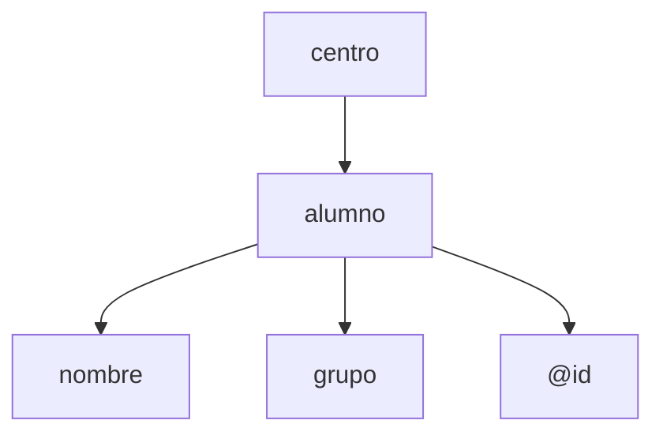

---
tags:
  - lenguajes-de-marcas
  - DAM1
unidad: 1
tema: XML — Definición de esquemas y vocabularios
---
# XML — Definición de esquemas y vocabularios

## Qué es XML

**XML** (eXtensible Markup Language) es un lenguaje de marcas para representar e intercambiar datos estructurados. A diferencia de HTML, no define cómo mostrar la información sino cómo describirla.

> Un documento XML organiza la información en una estructura jerárquica de elementos etiquetados, legible tanto por humanos como por máquinas.

Usos principales: intercambio de datos entre aplicaciones (APIs), archivos de configuración (pom.xml, AndroidManifest.xml), catálogos y registros.

---

## Estructura de un documento XML

Un documento XML tiene tres componentes fundamentales:

**Declaración XML** → indica versión y codificación. Siempre al principio:

```xml
<?xml version="1.0" encoding="UTF-8"?>
```

**Elemento raíz** → contiene todo el contenido. Un documento XML solo puede tener uno.

**Contenido** → elementos, atributos y texto anidados dentro de la raíz.

```xml
<?xml version="1.0" encoding="UTF-8"?>
<centro>
    <alumno id="A01">
        <nombre>Joan</nombre>
        <grupo>1r DAM</grupo>
    </alumno>
</centro>
```



---

## Elementos, atributos y texto

|Componente|Descripción|Ejemplo|
|---|---|---|
|**Elemento**|Unidad principal de información|`<nombre>Joan</nombre>`|
|**Atributo**|Metadato breve dentro de la etiqueta de apertura|`id="A01"`|
|**Texto**|Valor dentro de un elemento|`Joan`|
|**Etiqueta vacía**|Elemento sin contenido|`<telefono/>`|

Los **atributos** se usan para información breve y no estructurada (ids, tipos, unidades). Si el dato puede crecer o tener subestructura, mejor convertirlo en elemento.

---

## Reglas sintácticas básicas

Un documento está **bien formado** cuando cumple todas estas reglas:

- Un solo elemento raíz
- Todas las etiquetas cerradas correctamente (`<nombre>Joan</nombre>` o `<tel/>`)
- **Anidación correcta**: los elementos deben cerrarse en orden inverso al que se abrieron
- Los valores de atributos entre comillas (`id="A01"`, no `id=A01`)
- XML es **case-sensitive**: `<Alumno>` ≠ `<alumno>`

```xml
<!-- Anidación CORRECTA -->
<alumno><nombre>Neus</nombre></alumno>

<!-- Anidación INCORRECTA -->
<alumno><nombre>Neus</alumno></nombre>
```

### Caracteres especiales

Algunos caracteres tienen significado especial y deben escaparse con **entidades**:

|Carácter|Entidad|
|---|---|
|`<`|`&lt;`|
|`>`|`&gt;`|
|`&`|`&amp;`|

```xml
<mensaje>Hoy 5 &lt; 7, 8 &gt; 6 y A &amp; B</mensaje>
```

Los **comentarios** no forman parte de los datos:

```xml
<!-- Esto es un comentario -->
```

---

## Jerarquía y relaciones entre nodos

Un documento XML se puede modelar como un árbol de **nodos**. Los tipos principales de nodo son: elementos, texto y atributos.

Las relaciones entre nodos:

- **Padre/hijo**: un elemento que contiene a otro
- **Hermanos**: elementos con el mismo padre
- **Raíz**: nodo de nivel superior, padre de todos

> Un documento bien formado no garantiza que esté bien organizado lógicamente. La estructura debe reflejar las relaciones reales entre los datos.

**Problema común de modelado**: duplicación de información. Si un médico aparece dentro de cada paciente, su información se repite. Solución: separar médicos y pacientes en secciones independientes y referenciarlos por id.

---

## Vocabularios y espacios de nombres

Un **vocabulario XML** es el conjunto de etiquetas definidas para un ámbito concreto. El problema surge cuando dos vocabularios usan la misma etiqueta: se produce una **colisión de nombres**.

**Cuándo usar espacios de nombres**: solo cuando un documento combina vocabularios de fuentes distintas o cuando un estándar externo los exige. Si todo el documento pertenece a un solo ámbito, no es necesario.

Un **espacio de nombres** se declara con `xmlns` y se asocia a un prefijo:

```xml
<datos xmlns:p="http://ejemplo.org/personas"
       xmlns:e="http://ejemplo.org/empresas">
    <p:nombre>Laura Pons</p:nombre>
    <e:nombre>Oficina Central</e:nombre>
</datos>
```

Si todo el documento usa el mismo vocabulario, se puede declarar un **espacio de nombres por defecto** (sin prefijo):

```xml
<centro xmlns="http://ejemplo.org/centro">
    <alumno><nombre>Pau</nombre></alumno>
</centro>
```

---

## Validación: documento bien formado vs. documento válido

|Concepto|Descripción|
|---|---|
|**Bien formado**|Cumple las reglas sintácticas de XML|
|**Válido**|Bien formado + cumple un esquema externo (DTD o XSD)|

> Todo documento válido debe estar bien formado, pero no al revés.

La validación comprueba: qué elementos y atributos pueden aparecer, en qué orden, cuántas veces y con qué valores.

---

## DTD — Document Type Definition

Una **DTD** define la estructura esperada de un documento XML. Puede ser externa (fichero `.dtd` separado) o interna (dentro del propio XML).

### Asociar XML con DTD externa (buena práctica)

```xml
<?xml version="1.0" encoding="UTF-8"?>
<!DOCTYPE alumnos SYSTEM "alumnos.dtd">
<alumnos>...</alumnos>
```

### Declaración de elementos

```dtd
<!ELEMENT catalogo (coche+)>
<!ELEMENT coche (marca, modelo, anio, precio, extras?)>
<!ELEMENT marca (#PCDATA)>
<!ELEMENT extras (extra+)>
<!ELEMENT extra (#PCDATA)>
```

|Sintaxis|Significado|
|---|---|
|`(elemento)`|exactamente una vez|
|`(elemento?)`|cero o una vez|
|`(elemento*)`|cero o más veces|
|`(elemento+)`|una o más veces|
|`(a, b, c)`|secuencia ordenada obligatoria|
|`(#PCDATA)`|contenido de texto|
|`EMPTY`|elemento vacío|

### Declaración de atributos

```dtd
<!ATTLIST coche
    id          ID                               #REQUIRED
    combustible (gasolina|diesel|hibrido|electrico) #IMPLIED
    estado      (disponible|reservado|vendido)   "disponible"
    moneda      CDATA                            #FIXED "EUR"
>
```

|Condición|Significado|
|---|---|
|`#REQUIRED`|obligatorio|
|`#IMPLIED`|opcional|
|`"valor"`|opcional con valor por defecto|
|`#FIXED "valor"`|siempre debe tener este valor|

|Tipo|Significado|
|---|---|
|`CDATA`|texto libre|
|`ID`|identificador único|
|`(v1\|v2\|v3)`|lista cerrada de valores|

### Ejemplo completo: catálogo de coches

```dtd
<!ELEMENT catalogo (coche+)>
<!ELEMENT coche (marca, modelo, anio, precio, extras?)>
<!ELEMENT marca (#PCDATA)>
<!ELEMENT modelo (#PCDATA)>
<!ELEMENT anio (#PCDATA)>
<!ELEMENT precio (#PCDATA)>
<!ELEMENT extras (extra+)>
<!ELEMENT extra (#PCDATA)>
<!ATTLIST coche
    id          ID                                  #REQUIRED
    combustible (gasolina|diesel|hibrido|electrico) #IMPLIED
    estado      (disponible|reservado|vendido)       "disponible"
    moneda      CDATA                               #FIXED "EUR"
>
```

**Casos prácticos de validación**:

- Fragmento sin atributo `id` → **inválido** (es `#REQUIRED`)
- Fragmento con `combustible="gas"` → **inválido** (no es ninguno de los valores permitidos)
- Fragmento con `extras` ausente → **válido** (el elemento es opcional con `?`)

---

## XSD — XML Schema Definition

**XSD** es una alternativa más potente a la DTD. Escrito en sintaxis XML, permite controlar tipos de datos, restricciones de valores y patrones.

### Asociar XML con XSD

```xml
<alumnos xmlns:xsi="http://www.w3.org/2001/XMLSchema-instance"
         xsi:noNamespaceSchemaLocation="alumnos.xsd">
```

### Estructura básica

```xml
<?xml version="1.0" encoding="UTF-8"?>
<xs:schema xmlns:xs="http://www.w3.org/2001/XMLSchema">
    <!-- declaraciones de elementos aquí -->
</xs:schema>
```

### Elementos simples y tipos de datos

Un **elemento simple** contiene solo un dato (sin subelementos ni atributos):

```xml
<xs:element name="nombre" type="xs:string"/>
<xs:element name="anio" type="xs:integer"/>
<xs:element name="precio" type="xs:decimal"/>
<xs:element name="activo" type="xs:boolean"/>
```

|Tipo XSD|Equivalente|
|---|---|
|`xs:string`|texto libre|
|`xs:integer`|número entero|
|`xs:decimal`|número decimal|
|`xs:date`|fecha (YYYY-MM-DD)|
|`xs:boolean`|true / false|

### Elementos complejos

Un **elemento complejo** contiene subelementos o atributos. Se define con `xs:complexType` + `xs:sequence` (que impone jerarquía y orden):

```xml
<xs:element name="coche">
    <xs:complexType>
        <xs:sequence>
            <xs:element name="marca" type="xs:string"/>
            <xs:element name="modelo" type="xs:string"/>
            <xs:element name="anio" type="xs:integer"/>
            <xs:element name="precio" type="xs:decimal"/>
            <xs:element name="extras" minOccurs="0">
                <xs:complexType>
                    <xs:sequence>
                        <xs:element name="extra" type="xs:string"
                                    minOccurs="1" maxOccurs="unbounded"/>
                    </xs:sequence>
                </xs:complexType>
            </xs:element>
        </xs:sequence>
        <xs:attribute name="id" type="xs:string" use="required"/>
        <xs:attribute name="combustible" use="optional">...</xs:attribute>
    </xs:complexType>
</xs:element>
```

### Repetición de elementos

|Atributo|Valor|Significado|
|---|---|---|
|`minOccurs`|`0`|opcional|
|`minOccurs`|`1`|obligatorio|
|`maxOccurs`|`1`|máximo una vez|
|`maxOccurs`|`unbounded`|sin límite|

### Restricciones sobre datos

La idea es siempre: **tipo base + restricciones**:

```xml
<xs:element name="anio">
    <xs:simpleType>
        <xs:restriction base="xs:integer">
            <xs:minInclusive value="1990"/>
            <xs:maxInclusive value="2025"/>
        </xs:restriction>
    </xs:simpleType>
</xs:element>

<xs:element name="nombre">
    <xs:simpleType>
        <xs:restriction base="xs:string">
            <xs:minLength value="2"/>
            <xs:maxLength value="30"/>
        </xs:restriction>
    </xs:simpleType>
</xs:element>
```

### Valores enumerados

```xml
<xs:element name="grupo">
    <xs:simpleType>
        <xs:restriction base="xs:string">
            <xs:enumeration value="1r DAM"/>
            <xs:enumeration value="1r DAW"/>
            <xs:enumeration value="2n DAM"/>
            <xs:enumeration value="2n DAW"/>
        </xs:restriction>
    </xs:simpleType>
</xs:element>
```

### Atributos en XSD

Los atributos se declaran dentro de `xs:complexType`, **después** de la secuencia de elementos:

```xml
<xs:attribute name="id" type="xs:string" use="required"/>
<xs:attribute name="beca" use="optional">
    <xs:simpleType>
        <xs:restriction base="xs:string">
            <xs:enumeration value="si"/>
            <xs:enumeration value="no"/>
            <xs:enumeration value="quizas"/>
        </xs:restriction>
    </xs:simpleType>
</xs:attribute>
<xs:attribute name="pais" type="xs:string" default="España"/>
<xs:attribute name="nivel" type="xs:string" fixed="FP"/>
```

|Propiedad|Significado|
|---|---|
|`use="required"`|obligatorio|
|`use="optional"`|opcional|
|`default="valor"`|opcional con valor por defecto|
|`fixed="valor"`|siempre debe tener este valor|

### Ejemplo completo: catálogo de coches en XSD

```xml
<?xml version="1.0" encoding="UTF-8"?>
<xs:schema xmlns:xs="http://www.w3.org/2001/XMLSchema">

  <xs:element name="catalogo">
    <xs:complexType>
      <xs:sequence>
        <xs:element name="coche" minOccurs="1" maxOccurs="unbounded">
          <xs:complexType>
            <xs:sequence>
              <xs:element name="marca">
                <xs:simpleType>
                  <xs:restriction base="xs:string">
                    <xs:minLength value="2"/>
                  </xs:restriction>
                </xs:simpleType>
              </xs:element>
              <xs:element name="modelo">
                <xs:simpleType>
                  <xs:restriction base="xs:string">
                    <xs:minLength value="1"/>
                  </xs:restriction>
                </xs:simpleType>
              </xs:element>
              <xs:element name="anio">
                <xs:simpleType>
                  <xs:restriction base="xs:integer">
                    <xs:minInclusive value="1990"/>
                    <xs:maxInclusive value="2025"/>
                  </xs:restriction>
                </xs:simpleType>
              </xs:element>
              <xs:element name="precio">
                <xs:simpleType>
                  <xs:restriction base="xs:decimal">
                    <xs:minExclusive value="0"/>
                  </xs:restriction>
                </xs:simpleType>
              </xs:element>
              <xs:element name="extras" minOccurs="0">
                <xs:complexType>
                  <xs:sequence>
                    <xs:element name="extra" minOccurs="1"
                                maxOccurs="unbounded">
                      <xs:simpleType>
                        <xs:restriction base="xs:string">
                          <xs:minLength value="2"/>
                        </xs:restriction>
                      </xs:simpleType>
                    </xs:element>
                  </xs:sequence>
                </xs:complexType>
              </xs:element>
            </xs:sequence>
            <xs:attribute name="id" type="xs:string" use="required"/>
            <xs:attribute name="combustible" use="optional">
              <xs:simpleType>
                <xs:restriction base="xs:string">
                  <xs:enumeration value="gasolina"/>
                  <xs:enumeration value="diesel"/>
                  <xs:enumeration value="hibrido"/>
                  <xs:enumeration value="electrico"/>
                </xs:restriction>
              </xs:simpleType>
            </xs:attribute>
            <xs:attribute name="estado" default="disponible">
              <xs:simpleType>
                <xs:restriction base="xs:string">
                  <xs:enumeration value="disponible"/>
                  <xs:enumeration value="reservado"/>
                  <xs:enumeration value="vendido"/>
                </xs:restriction>
              </xs:simpleType>
            </xs:attribute>
            <xs:attribute name="moneda" type="xs:string" fixed="EUR"/>
          </xs:complexType>
        </xs:element>
      </xs:sequence>
    </xs:complexType>
  </xs:element>

</xs:schema>
```

**Casos prácticos de validación**:

- `combustible="gas"` → **inválido** (no es ninguno de los valores de la enumeración)
- `anio` ausente con `precio` presente → **inválido** (`xs:sequence` exige orden y presencia)
- `<anio>2018</anio>` dentro del rango → **válido**, pero si aparece fuera de orden → **inválido** (la secuencia lo exige antes que `precio`)
- Fragmento sin `id` → **inválido** (`use="required"`)

---

## DTD vs XSD — Comparación

|Característica|DTD|XSD|
|---|---|---|
|Sintaxis|propia|XML|
|Tipos de datos|no|sí (string, integer, date…)|
|Restricciones de valores|lista cerrada|min/max, patrones, enumeración|
|Espacios de nombres|soporte limitado|soporte completo|
|Potencia expresiva|baja|alta|

> Usa DTD para documentos simples o cuando la compatibilidad lo requiera. Usa XSD cuando necesites controlar tipos de datos o restricciones precisas.

---

## XQuery — Consultas sobre XML

**XQuery** permite consultar documentos XML. Se ejecuta con herramientas como **BaseX**.

### Expresiones de camino (path expressions)

```xquery
(: Todos los incidentes :)
doc("incidents.xml")/incidents/incident

(: Todos los títulos (elemento) :)
doc("incidents.xml")/incidents/incident/titol

(: Texto de los títulos :)
doc("incidents.xml")/incidents/incident/titol/text()

(: Valores de atributos :)
doc("incidents.xml")/incidents/incident/@id
doc("incidents.xml")/incidents/incident/@risc
```

### Filtros con predicados

```xquery
(: Incidentes abiertos :)
doc("incidents.xml")/incidents/incident[@estat="obert"]

(: Incidentes de riesgo crítico :)
doc("incidents.xml")/incidents/incident[@risc="critic"]

(: Incidentes de origen externo :)
doc("incidents.xml")/incidents/incident[origen="extern"]

(: Incidentes con más de 20 afectados :)
doc("incidents.xml")/incidents/incident[afectats > 20]

(: Incidentes asignados a Laia :)
doc("incidents.xml")/incidents/incident[tecnic="Laia"]

(: Riesgo alto o crítico :)
doc("incidents.xml")/incidents/incident[@risc="alt" or @risc="critic"]
```

### Expresiones FLWOR

**FLWOR** (For, Let, Where, Order by, Return) permite transformar y reestructurar la salida:

```xquery
(: Ejercicio 13: incidentes abiertos con título, sistema y técnico :)
for $i in doc("incidents.xml")/incidents/incident[@estat="obert"]
return
    <incident>
        <titol>{$i/titol/text()}</titol>
        <sistema>{$i/sistema/text()}</sistema>
        <tecnic>{$i/tecnic/text()}</tecnic>
    </incident>
```

```xquery
(: Ejercicio 14: avisos para incidentes críticos :)
for $i in doc("incidents.xml")/incidents/incident[@risc="critic"]
return
    <avis>
        <titol>{$i/titol/text()}</titol>
        <sistema>{$i/sistema/text()}</sistema>
        <afectats>{$i/afectats/text()}</afectats>
    </avis>
```

```xquery
(: Ejercicio 18: riesgo alto o crítico, ordenados por afectados descendente :)
for $i in doc("incidents.xml")/incidents/incident[@risc="alt" or @risc="critic"]
order by xs:integer($i/afectats) descending
return
    <incident>
        <titol>{$i/titol/text()}</titol>
        <risc>{data($i/@risc)}</risc>
        <estat>{data($i/@estat)}</estat>
        <afectats>{$i/afectats/text()}</afectats>
    </incident>
```

```xquery
(: Ejercicio 19: salida HTML con incidentes abiertos :)
<html>
    <body>
        <ul>
        {
            for $i in doc("incidents.xml")/incidents/incident[@estat="obert"]
            return
                <li>
                    <b>{$i/titol/text()}</b>
                    {" — "}{$i/sistema/text()}
                    {" ["}{data($i/@risc)}{"]"}
                </li>
        }
        </ul>
    </body>
</html>
```

### Patrones habituales en FLWOR

|Cláusula|Función|
|---|---|
|`for $x in ...`|itera sobre nodos|
|`where condición`|filtra (equivalente al predicado `[...]`)|
|`order by expresión`|ordena el resultado|
|`return ...`|define la salida por cada iteración|

> `data($atributo)` extrae el valor de un atributo como texto. `xs:integer(...)` convierte texto a entero para ordenar numéricamente.