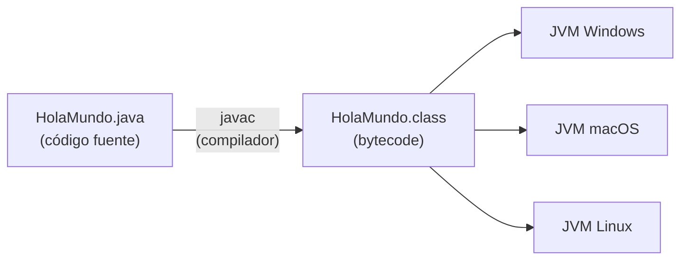
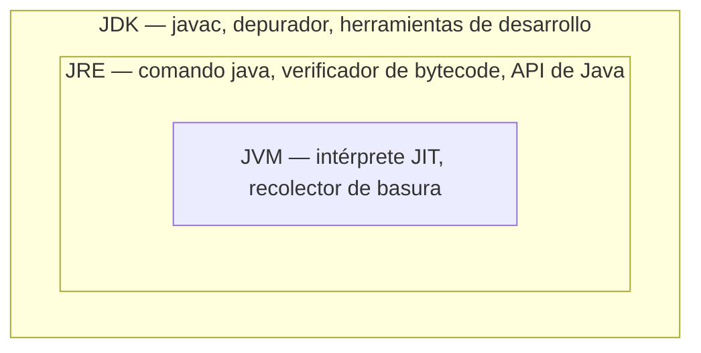

---
tags:
  - java
  - programacion
  - dam1
unidad: 1
tema: Introducción a Java y entorno de desarrollo
---

# Unidad 1. Introducción a Java y entorno de desarrollo

> [!abstract] Objetivos de la unidad
> - Conocer el origen, la naturaleza y las características fundamentales del lenguaje Java.
> - Comprender el proceso de compilación y ejecución de un programa Java.
> - Distinguir con precisión los componentes JDK, JRE y JVM.
> - Identificar las funciones de un entorno de desarrollo integrado (IDE) y configurarlo.
> - Analizar la estructura mínima de un programa Java y sus reglas sintácticas básicas.

---

## 1. El lenguaje Java

### 1.1. Definición

**Java** es un lenguaje de programación de **alto nivel**, de **propósito general** y **orientado a objetos**, diseñado para que un mismo programa pueda ejecutarse en distintos sistemas operativos sin necesidad de ser modificado.

> [!info] Conceptos previos
> - **Lenguaje de alto nivel:** aquel cuya sintaxis se aproxima al lenguaje humano y se abstrae de los detalles del hardware (registros, direcciones de memoria, instrucciones del procesador).
> - **Propósito general:** no está restringido a un dominio concreto; sirve para desarrollar aplicaciones de muy diversa naturaleza.
> - **Orientado a objetos:** organiza el software en torno a *objetos* que agrupan datos y comportamiento. Este paradigma se estudia en profundidad a partir de la [Unidad 11](11-fundamentos-de-poo.md).

### 1.2. Origen y evolución

Java fue desarrollado por **James Gosling** y su equipo en **Sun Microsystems**, y se publicó oficialmente en **1995**. En su fase inicial el proyecto recibió el nombre de *Oak*. En **2010**, Sun Microsystems fue adquirida por **Oracle Corporation**, que desde entonces es la propietaria y principal responsable de la evolución del lenguaje.

Java publica una nueva versión cada seis meses. Algunas de ellas se designan como **LTS** (*Long-Term Support*), es decir, versiones con soporte extendido durante varios años, que son las preferidas en entornos profesionales y educativos. En este curso se trabaja con **JDK 21**, que es una versión LTS.

### 1.3. Ámbitos de aplicación

Java es uno de los lenguajes más demandados y utilizados en la industria del software. Su presencia se extiende a ámbitos muy diversos:

| Ámbito | Tecnologías representativas |
|---|---|
| Desarrollo web y *backend* | Spring, Hibernate |
| Aplicaciones móviles | Android |
| Sistemas empresariales | Spring, Jakarta EE |
| Aplicaciones de escritorio | Swing, JavaFX |
| Servidores y servicios | Servidores web y de aplicaciones |
| Acceso a datos | JDBC y conexión con bases de datos |

### 1.4. Características fundamentales

#### Portabilidad e independencia de plataforma

Constituye la principal fortaleza del lenguaje y se resume en su lema:

> [!quote] *Write once, run anywhere*
> «Escribe una vez, ejecuta en cualquier lugar».

El código Java compilado puede ejecutarse en cualquier sistema operativo (Windows, macOS, Linux…) que disponga de una **Máquina Virtual de Java (JVM)**. El mecanismo que lo hace posible se explica en el apartado 2.

#### Seguridad

Java se diseñó teniendo en cuenta la seguridad desde su origen. Su arquitectura incorpora mecanismos como la **verificación del bytecode** antes de ejecutarlo y la ausencia de acceso directo a direcciones de memoria, lo que protege frente a numerosas vulnerabilidades.

#### Gestión automática de memoria

Java dispone de un **recolector de basura** (*Garbage Collector*, GC): un proceso que libera automáticamente la memoria ocupada por los objetos que ya no son accesibles desde el programa. El programador no necesita liberar memoria manualmente, lo que evita errores habituales en otros lenguajes, como las fugas de memoria.

#### Multihilo

Java permite ejecutar varios **hilos** (*threads*) de forma concurrente dentro de un mismo programa. Esto favorece el rendimiento en aplicaciones que deben realizar varias tareas simultáneamente.

#### Comunidad y ecosistema

Java cuenta con una de las comunidades de desarrolladores más grandes y activas del mundo, lo que se traduce en una gran cantidad de bibliotecas, *frameworks*, herramientas y documentación.

> [!tip] Valor formativo de Java
> Aprender Java proporciona una base sólida que facilita posteriormente el aprendizaje de otros lenguajes y tecnologías, ya que muchos de ellos (C#, Kotlin, etc.) comparten conceptos y sintaxis similares.

---

## 2. Compilación y ejecución de un programa Java

### 2.1. El concepto de compilador

Un **compilador** es un programa que traduce el código escrito por el programador (**código fuente**) a otro lenguaje de más bajo nivel que puede ser ejecutado por la máquina.

### 2.2. El bytecode

En Java, el proceso de traducción no genera directamente código máquina específico de un sistema operativo, sino un formato intermedio denominado **bytecode**:

1. El programador escribe el código fuente en un archivo con extensión **`.java`**.
2. El compilador de Java, **`javac`**, traduce ese archivo a **bytecode**, que se almacena en un archivo con extensión **`.class`**.
3. La **JVM** de cada sistema operativo interpreta y ejecuta ese bytecode.

> [!note] Definición: bytecode
> El **bytecode** es un código intermedio, independiente de la plataforma, que no está pensado para ser ejecutado directamente por el procesador, sino por la Máquina Virtual de Java.



Como el bytecode es el mismo para todas las plataformas y cada sistema operativo dispone de su propia JVM, el mismo archivo `.class` puede ejecutarse en cualquiera de ellos. Esta es la explicación técnica de la portabilidad de Java.

> [!info] ¿Java es compilado o interpretado?
> Java es un lenguaje **híbrido**: primero se **compila** a bytecode y después ese bytecode es **interpretado** por la JVM. Además, la JVM incorpora un compilador **JIT** (*Just-In-Time*), que durante la ejecución traduce a código máquina nativo las partes del programa que se ejecutan con más frecuencia, lo que mejora notablemente el rendimiento.

---

## 3. Arquitectura: JDK, JRE y JVM

Para desarrollar y ejecutar programas en Java es necesario instalar un conjunto de herramientas. Conviene distinguir con precisión los tres componentes que intervienen.

### 3.1. JVM (*Java Virtual Machine*)

La **Máquina Virtual de Java** es el componente encargado de **ejecutar el bytecode**. Entre sus elementos destacan:

- El **intérprete** y el compilador **JIT**, que ejecutan el bytecode.
- El **recolector de basura**, que gestiona la memoria automáticamente.

### 3.2. JRE (*Java Runtime Environment*)

El **Entorno de Ejecución de Java** contiene todo lo necesario para **ejecutar** programas Java, pero no para crearlos. Incluye:

- La **JVM**.
- Las **bibliotecas de clases** estándar (la API de Java).
- El **verificador de bytecode**, el comando `java` y otros componentes (archivos de configuración, bibliotecas nativas, etc.).

### 3.3. JDK (*Java Development Kit*)

El **Kit de Desarrollo de Java** es el paquete completo de herramientas necesarias para **desarrollar** aplicaciones Java. Incluye:

- El **compilador** `javac`, que traduce el código fuente a bytecode.
- El **JRE** (y, por tanto, la JVM).
- **Herramientas de desarrollo** adicionales, como el depurador (`jdb`) o el empaquetador (`jar`).

### 3.4. Relación entre los tres componentes

Los tres componentes guardan una relación de **inclusión**: el JDK contiene al JRE, y el JRE contiene a la JVM.



| Componente | Finalidad | ¿Quién lo necesita? |
|---|---|---|
| **JVM** | Ejecutar el bytecode | Forma parte del JRE |
| **JRE** | Ejecutar programas Java | Usuarios que solo ejecutan aplicaciones |
| **JDK** | Desarrollar y ejecutar programas Java | Programadores |

> [!important] Conclusión
> Al instalar el **JDK** se dispone de todas las herramientas necesarias tanto para **desarrollar** como para **ejecutar** programas Java. Por ello, un programador siempre instala el JDK.

> [!note] Nota técnica
> Desde Java 11, Oracle ya no distribuye el JRE como producto independiente: el entorno de ejecución se obtiene a través del propio JDK. La distinción conceptual entre ambos, sin embargo, sigue siendo válida y es la que se emplea en este curso.

### 3.5. Instalación del JDK

En el curso se utiliza **JDK 21**, que puede descargarse desde la web oficial de Oracle:

- Enlace: `https://www.oracle.com/es/java/technologies/downloads/#java21`
- En Windows, se selecciona el instalador **Windows x64 Installer**.

---

## 4. Entornos de desarrollo integrados (IDE)

### 4.1. Definición

> [!note] Definición: IDE
> Un **IDE** (*Integrated Development Environment*, «entorno de desarrollo integrado») es una aplicación que reúne en una única interfaz gráfica las herramientas necesarias para el desarrollo de software, simplificando y agilizando el proceso de programación.

Las principales herramientas que integra un IDE son:

- **Editor de código fuente**, con resaltado de sintaxis.
- **Compilador** y ejecución del programa con un solo clic.
- **Depurador** (*debugger*), que permite ejecutar el programa paso a paso e inspeccionar variables.
- **Constructor de proyectos**, que organiza los archivos del programa.
- **Control de versiones** (por ejemplo, Git).
- **Terminal o consola** integrada, donde se muestra la salida del programa.
- **Autocompletado** de código y **sugerencias** de corrección.

### 4.2. IDE más utilizados en Java

| IDE | Características principales |
|---|---|
| **IntelliJ IDEA** (Community Edition) | Gratuito, muy extendido en la industria y con un autocompletado muy avanzado. |
| **Apache NetBeans** | Gratuito y de código abierto; genera la estructura del proyecto y la clase principal automáticamente. |
| **Eclipse IDE** | Gratuito, de código abierto y muy extensible mediante *plugins*. |

### 4.3. IntelliJ IDEA

**Instalación.** Se descarga la edición **Community** (gratuita) desde `https://www.jetbrains.com/idea/download/other.html` y se instala con los valores por defecto.

**Configuración recomendada:**

- **Tema de alto contraste:** *Settings → Editor → Color Scheme → High Contrast*.
- **Tamaño de fuente:** *Settings → Editor → Font* (por ejemplo, JetBrains Mono, tamaño 16).
- **Desactivar las ayudas en línea** (*Inlay Hints*): *Settings → Editor → Inlay Hints*, desmarcando todas las opciones. De este modo el código se muestra tal como está escrito, sin anotaciones añadidas por el IDE, lo que resulta más adecuado durante el aprendizaje.

**Creación de un proyecto:**

1. *New Project → Java*.
2. **Name:** nombre del proyecto (por ejemplo, `introduccion java`).
3. **Location:** ruta donde se guardará. Se recomienda crear previamente una estructura de carpetas ordenada, por ejemplo `Mis Documentos\Java\`.
4. **JDK:** seleccionar la versión 21.
5. Desmarcar *Add sample code* y pulsar *Create*.

**Creación de una clase:** clic derecho sobre la carpeta `src` → *New → Java Class* → escribir el nombre (por ejemplo, `HolaMundo`).

> [!warning] Java distingue mayúsculas y minúsculas
> Java es un lenguaje ***case sensitive***: `HolaMundo`, `holamundo` y `HOLAMUNDO` son nombres distintos. Hay que respetar exactamente las mayúsculas y minúsculas al nombrar clases, archivos y variables.

### 4.4. Apache NetBeans

**Instalación.** Se descarga desde `https://netbeans.apache.org/front/main/download/`. En la instalación personalizada se seleccionan los paquetes **Base IDE**, **Java SE**, **Java EE** y **HTML5/JavaScript** (no es necesario PHP).

**Configuración:** en *Tools → Options → Appearance → Look and Feel* puede activarse el modo oscuro (*FlatLaf Dark*), que requiere reiniciar el IDE. Desde el mismo menú se pueden ajustar el tamaño y el tipo de fuente.

**Creación de un proyecto:**

1. *File → New Project → Java with Ant → Java Application*.
2. **Project Name:** `IntroduccionJava`.
3. **Project Location:** modificar la ruta y añadir una carpeta `Netbeans` al final para separar estos proyectos de los de IntelliJ.
4. Mantener marcada la opción **Create Main Class**, que genera automáticamente la clase principal con el método `main`.
5. Pulsar *Finish*.

**Creación de una clase:** clic derecho sobre el paquete del proyecto (dentro de *Source Packages*) → *New → Java Class* → escribir el nombre de la clase.

> [!info] Paquetes
> NetBeans organiza las clases dentro de un **paquete** (por ejemplo, `introduccionjava`). Un paquete es una agrupación lógica de clases relacionadas, equivalente a una carpeta. Por este motivo, las clases creadas en NetBeans comienzan con una línea como:
> ```java
> package introduccionjava;
> ```

### 4.5. Eclipse IDE

En Eclipse, los proyectos se crean desde *File → New → Java Project*, y las clases se organizan en paquetes dentro de la carpeta `src`.

---

## 5. Estructura de un programa Java

### 5.1. El programa «Hola Mundo»

El programa «Hola Mundo» es el ejercicio introductorio clásico: muestra un mensaje en la consola. Permite analizar la estructura mínima que debe tener cualquier programa Java.

```java
public class HolaMundo {
    public static void main(String[] args) {
        System.out.println("Hola Mundo con Java");
    }
}
```

Salida por consola:

```
Hola Mundo con Java

Process finished with exit code 0
```

> [!info] *Exit code 0*
> El mensaje `Process finished with exit code 0` lo muestra el IDE e indica que el programa ha finalizado **correctamente**. Un código distinto de 0 indica que la ejecución terminó con algún error.

### 5.2. Análisis línea a línea

#### `public class HolaMundo { ... }`

Define una **clase pública** llamada `HolaMundo`. Todo el código ejecutable en Java debe estar contenido dentro de una clase. Las llaves `{ }` delimitan el cuerpo de la clase.

#### `public static void main(String[] args) { ... }`

Define el **método principal** (`main`), que es el **punto de entrada** del programa: la JVM comienza la ejecución por este método. Un **método** (o función) es un bloque de código con nombre que realiza una tarea concreta.

| Elemento | Significado |
|---|---|
| `public` | El método es accesible desde fuera de la clase; la JVM necesita poder invocarlo. |
| `static` | El método pertenece a la clase y puede ejecutarse sin crear ningún objeto. |
| `void` | El método no devuelve ningún valor. |
| `main` | Nombre obligatorio del método de entrada. |
| `String[] args` | Parámetro que recibe los argumentos que se pasan al programa al ejecutarlo. |

> [!note] Alcance del análisis
> Por ahora basta con saber que esta línea es obligatoria y debe escribirse exactamente así. Los conceptos de `public`, `static`, parámetros y valor de retorno se estudian en detalle en la [Unidad 9](09-metodos.md) y en las unidades de POO.

#### `System.out.println("Hola Mundo con Java");`

Invoca el método `println`, que **imprime** en la consola el texto indicado entre comillas y, a continuación, realiza un **salto de línea**.

- `System.out` representa la **salida estándar** del programa (la consola).
- El texto entre comillas dobles es una **cadena de caracteres** (*String*).
- Toda instrucción en Java termina con **punto y coma** (`;`).

### 5.3. Reglas del modificador `public` y nombre del archivo

El modificador `public` aplicado a una clase tiene implicaciones importantes:

1. **Accesibilidad:** una clase `public` puede ser utilizada desde cualquier otra clase, en cualquier paquete.
2. **Convención de nombrado:** solo puede haber **una clase `public` por archivo `.java`**, y el nombre del archivo debe coincidir **exactamente** con el nombre de esa clase.
3. **Encapsulación:** los modificadores de acceso permiten controlar qué partes del código son accesibles desde otras clases o paquetes.

> [!example] Correspondencia clase–archivo
> La clase `public class HolaMundo` debe guardarse obligatoriamente en el archivo **`HolaMundo.java`**. Si los nombres no coinciden, el compilador muestra un error y el programa no se ejecuta.

### 5.4. Reglas sintácticas básicas

- El nombre de una clase comienza por **mayúscula** y, si está formado por varias palabras, cada una empieza por mayúscula (*PascalCase*): `HolaMundo`, `DetalleLibro`.
- Java **distingue mayúsculas y minúsculas**: `MyClass` y `myclass` son identificadores distintos.
- Cada instrucción finaliza con **punto y coma**.
- Los bloques de código se delimitan con **llaves** `{ }`.
- La **indentación** (sangrado) no es obligatoria para el compilador, pero es imprescindible para la legibilidad del código.

---

## 6. Salida de datos por consola

Java ofrece dos métodos básicos para mostrar texto en la consola:

| Método | Comportamiento |
|---|---|
| `System.out.println(texto)` | Muestra el texto y **realiza un salto de línea** al final. |
| `System.out.print(texto)` | Muestra el texto **sin salto de línea**; la siguiente salida continúa en la misma línea. |

```java
public class SalidaConsola {
    public static void main(String[] args) {
        System.out.print("Hola ");
        System.out.print("Mundo");
        System.out.println();          // solo realiza un salto de línea
        System.out.println("Nueva línea");
    }
}
```

Salida:

```
Hola Mundo
Nueva línea
```

> [!info] Ampliación
> Existe un tercer método, `System.out.printf`, que permite mostrar texto con **formato** (número de decimales, alineación, etc.). Se estudia en la [Unidad 5](05-entrada-y-salida.md).

---

## 7. Comentarios

### 7.1. Definición y finalidad

Un **comentario** es un fragmento de texto incluido en el código fuente que el compilador **ignora**. Su finalidad es documentar el código: explicar qué hace, por qué se ha tomado una decisión o qué debe tenerse en cuenta al modificarlo.

### 7.2. Tipos de comentarios

| Tipo | Sintaxis | Uso |
|---|---|---|
| De una línea | `// comentario` | Comenta el resto de la línea. |
| De varias líneas | `/* comentario */` | Comenta todo el texto comprendido entre los delimitadores. |
| De documentación (*Javadoc*) | `/** comentario */` | Documenta clases y métodos; permite generar documentación automática. |

```java
/**
 * Programa de ejemplo que muestra un saludo por consola.
 */
public class Comentarios {
    public static void main(String[] args) {
        // Comentario de una línea: muestra un saludo
        System.out.println("Hola Mundo");

        /* Comentario de varias líneas:
           la siguiente instrucción no se ejecuta
           porque está comentada */
        // System.out.println("Esta línea no se ejecuta");
    }
}
```

> [!tip] Buenas prácticas
> - Un buen comentario explica el **porqué**, no repite lo que ya dice el código.
> - Comentar temporalmente una línea es una técnica útil para desactivarla sin borrarla durante las pruebas.

---

## 8. Atajos de teclado en IntelliJ IDEA

IntelliJ IDEA incorpora plantillas (*Live Templates*) que generan fragmentos de código habituales. Se escribe la abreviatura y se pulsa `Tab` o `Intro`:

| Atajo | Código generado |
|---|---|
| `psvm` | `public static void main(String[] args) { }` |
| `sout` | `System.out.println();` |
| `soutv` | `System.out.println("variable = " + variable);` (imprime el nombre y el valor de una variable) |
| `soutm` | Imprime el nombre de la clase y del método actual. |
| `soutp` | Imprime los nombres y valores de los parámetros del método. |

> [!tip] Recomendación didáctica
> Es conveniente escribir manualmente la firma del método `main` y las instrucciones de salida las primeras veces, hasta memorizar su sintaxis. Una vez interiorizada, los atajos agilizan considerablemente el trabajo.

---

## 9. Compilación y ejecución desde la terminal

Aunque el IDE automatiza el proceso, es posible compilar y ejecutar un programa manualmente desde la línea de comandos, lo que ayuda a comprender lo que ocurre internamente:

```bash
javac HolaMundo.java    # compila: genera HolaMundo.class
java HolaMundo          # ejecuta el bytecode en la JVM
```

> [!warning] Atención
> Al ejecutar con `java` se indica el **nombre de la clase**, sin la extensión `.class`.

---

## 10. Resumen de la unidad

> [!summary] Ideas clave
> - Java es un lenguaje de alto nivel, de propósito general y orientado a objetos, creado por James Gosling en Sun Microsystems (1995) y actualmente propiedad de Oracle.
> - Su principal característica es la **portabilidad**: el código se compila a **bytecode** (`.class`), que la **JVM** de cada sistema operativo ejecuta.
> - **JDK ⊃ JRE ⊃ JVM**: el JDK sirve para desarrollar, el JRE para ejecutar y la JVM ejecuta el bytecode.
> - Un **IDE** integra editor, compilador, depurador y otras herramientas en una única aplicación.
> - Todo programa Java se escribe dentro de una **clase**, y su ejecución comienza en el método **`main`**.
> - El archivo `.java` debe llamarse igual que su clase `public`, respetando mayúsculas y minúsculas.
> - `println` muestra texto con salto de línea; `print`, sin él.
> - Los comentarios (`//`, `/* */`, `/** */`) documentan el código y el compilador los ignora.

---

**Navegación:** [Índice](00-indice.md) · Siguiente: [Unidad 2. Variables, tipos de datos y memoria](02-variables-tipos-de-datos-y-memoria.md)
