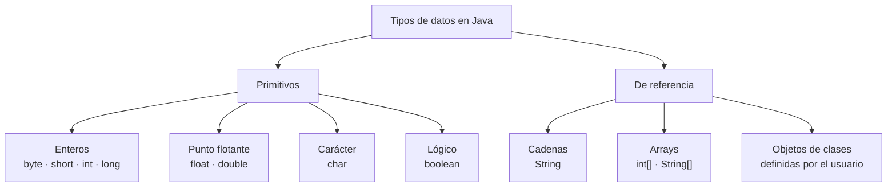
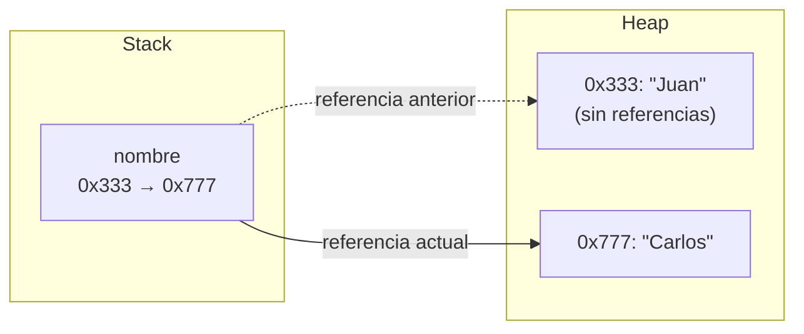

---
tags:
  - java
  - programacion
  - dam1
unidad: 2
tema: Variables, tipos de datos y memoria
---

# Unidad 2. Variables, tipos de datos y memoria

> [!abstract] Objetivos de la unidad
> - Comprender el concepto de variable y su relación con la memoria del ordenador.
> - Conocer los tipos de datos primitivos y de referencia de Java, sus rangos y sus literales.
> - Declarar, inicializar y modificar variables con la sintaxis correcta.
> - Aplicar las reglas y buenas prácticas de nomenclatura de identificadores.
> - Utilizar la inferencia de tipos con `var` y definir constantes con `final`.
> - Distinguir cómo se almacenan los datos en las memorias *stack* y *heap*.

---

## 1. Concepto de variable

> [!note] Definición: variable
> Una **variable** es un espacio de memoria identificado por un **nombre**, que almacena un **valor** de un **tipo de dato** determinado y cuyo contenido puede cambiar durante la ejecución del programa.

Toda variable en Java posee tres elementos:

| Elemento | Descripción | Ejemplo |
|---|---|---|
| **Tipo** | Clase de dato que puede almacenar y operaciones que admite. | `int` |
| **Nombre** (identificador) | Permite referirse a la variable dentro del código. | `edad` |
| **Valor** | Dato almacenado en un momento concreto de la ejecución. | `29` |

> [!info] Java es un lenguaje de tipado estático y fuerte
> - **Estático:** el tipo de cada variable se fija en el momento de su declaración y se comprueba durante la **compilación**. Una variable declarada como `int` solo podrá contener enteros durante toda su existencia.
> - **Fuerte:** el compilador no permite asignar a una variable un valor de un tipo incompatible. Por ejemplo, `int x = "Hola";` produce un error de compilación.

---

## 2. Declaración, asignación e inicialización

### 2.1. Sintaxis general

```java
tipo nombreVariable = valor;
```

Se distinguen tres operaciones:

- **Declaración:** se indica el tipo y el nombre de la variable; el sistema reserva el espacio en memoria.
- **Asignación:** se almacena un valor en la variable mediante el operador `=`.
- **Inicialización:** es la **primera** asignación de valor a una variable. Puede realizarse en la misma línea que la declaración o posteriormente.

```java
public class EjemploVariables {
    public static void main(String[] args) {
        int edad = 29;                  // declaración e inicialización
        double salario;                 // declaración
        salario = 5000.50;              // asignación posterior (inicialización)
        String mensaje = "Hola, Mundo"; // variable de tipo referencia

        System.out.println(edad);
        System.out.println(salario);
        System.out.println(mensaje);
    }
}
```

> [!warning] El operador `=` no es una igualdad matemática
> En Java, `=` es el operador de **asignación**: toma el valor situado a su derecha y lo almacena en la variable de su izquierda. Por eso la instrucción `edad = edad + 1;` es válida: calcula `edad + 1` y guarda el resultado en `edad`. La comparación de igualdad se expresa con `==` (véase la [Unidad 4](04-operadores.md)).

### 2.2. Modificación del valor

Una vez inicializada, el valor de una variable puede sustituirse tantas veces como sea necesario. El nuevo valor **reemplaza** al anterior, que se pierde.

```java
int edad = 29;
System.out.println(edad); // 29
edad = 35;                // se sustituye el valor anterior
System.out.println(edad); // 35
```

### 2.3. Declaración múltiple

Pueden declararse varias variables **del mismo tipo** en una sola instrucción, separándolas por comas:

```java
int x = 5, y = 6, z = 50;
System.out.println(x + y + z); // 61
```

> [!tip] Recomendación
> Aunque la declaración múltiple es válida, se considera más legible declarar cada variable en una línea propia, salvo en casos triviales como coordenadas o contadores relacionados.

### 2.4. Variables locales sin inicializar

Las variables declaradas dentro de un método se denominan **variables locales**. Java **no les asigna ningún valor por defecto**: es obligatorio inicializarlas antes de utilizarlas.

```java
int total;
System.out.println(total); // ERROR de compilación: variable might not have been initialized
```

---

## 3. Tipos de datos en Java

Java clasifica sus tipos de datos en dos grandes categorías:

1. **Tipos primitivos:** almacenan directamente un valor simple.
2. **Tipos de referencia (tipos *Object*):** almacenan una referencia (dirección de memoria) a un objeto.



---

## 4. Tipos de datos primitivos

### 4.1. Tabla de tipos primitivos

Java define **ocho** tipos primitivos, cuyo tamaño es el mismo en todas las plataformas (lo que contribuye a la portabilidad del lenguaje):

| Tipo | Tamaño | Rango de valores | Descripción |
|---|---|---|---|
| `byte` | 8 bits | −128 a 127 | Entero con signo de 8 bits. |
| `short` | 16 bits | −32.768 a 32.767 | Entero con signo de 16 bits. |
| `int` | 32 bits | −2.147.483.648 a 2.147.483.647 | Entero con signo de 32 bits. **Tipo entero por defecto.** |
| `long` | 64 bits | −9.223.372.036.854.775.808 a 9.223.372.036.854.775.807 | Entero con signo de 64 bits. |
| `float` | 32 bits | ±3,40282347 × 10³⁸ | Coma flotante de precisión simple (≈ 6-7 dígitos decimales). Estándar IEEE 754. |
| `double` | 64 bits | ±1,79769313486231570 × 10³⁰⁸ | Coma flotante de precisión doble (≈ 15-16 dígitos decimales). Estándar IEEE 754. **Tipo decimal por defecto.** |
| `char` | 16 bits | `'\u0000'` a `'\uffff'` | Un carácter Unicode. |
| `boolean` | No definido (lógicamente 1 bit) | `true` o `false` | Valor lógico. |

### 4.2. Tipos enteros

Almacenan números **sin parte decimal**, positivos o negativos. La elección del tipo depende del rango de valores que se necesite representar. En la práctica, **`int`** es el tipo entero de uso general, y **`long`** se reserva para cantidades muy grandes.

```java
byte unByte = 127;
short unShort = 32000;
int unInt = 2147483647;
long unLong = 9223372036854775807L; // sufijo L obligatorio
```

> [!warning] Sufijo `L` en los literales `long`
> Todo número entero escrito directamente en el código (literal) se interpreta como `int`. Si su valor excede el rango de `int`, es obligatorio añadir el sufijo **`L`** para indicar que es de tipo `long`. Se recomienda usar la `L` mayúscula, ya que la minúscula se confunde fácilmente con el número 1.

> [!danger] Desbordamiento (*overflow*)
> Si una operación produce un resultado que excede el rango del tipo, Java **no genera ningún error**: el valor «da la vuelta» al extremo opuesto del rango.
> ```java
> int maximo = 2147483647;
> maximo = maximo + 1;
> System.out.println(maximo); // -2147483648
> ```

### 4.3. Tipos de coma flotante

Almacenan números **con parte decimal**. En Java el separador decimal es siempre el **punto** (`3.14`), nunca la coma.

```java
float unFloat = 3.14f;               // sufijo f obligatorio
double unDouble = 3.141592653589793; // tipo decimal por defecto
```

> [!warning] Sufijo `f` en los literales `float`
> Todo literal decimal se interpreta como `double`. Para asignarlo a una variable `float` es obligatorio añadir el sufijo **`f`** o **`F`**; de lo contrario, se produce un error de compilación por posible pérdida de precisión.

> [!info] Precisión limitada
> Los tipos `float` y `double` representan los números en base binaria, por lo que muchos valores decimales no pueden almacenarse de forma exacta:
> ```java
> System.out.println(0.1 + 0.2); // 0.30000000000000004
> ```
> Por esta razón, en aplicaciones donde la exactitud es crítica (por ejemplo, operaciones monetarias) se utilizan otras clases, como `BigDecimal`.

### 4.4. Tipo carácter: `char`

Almacena **un único carácter** Unicode. Los literales `char` se escriben entre **comillas simples**.

```java
char letra = 'A';
char simbolo = '@';
char estadoCivil = 'S'; // S = soltero, C = casado
```

> [!warning] Comillas simples frente a dobles
> - `'A'` → literal de tipo `char` (un único carácter).
> - `"A"` → literal de tipo `String` (una cadena, aunque contenga un solo carácter).
>
> No son intercambiables: `char c = "A";` produce un error de compilación.

### 4.5. Tipo lógico: `boolean`

Solo puede tomar dos valores: **`true`** (verdadero) o **`false`** (falso). Es el tipo resultante de las comparaciones y la base de las estructuras de control.

```java
boolean disponible = true;
boolean esCasado = false;
```

### 4.6. Clases envoltorio (*wrapper classes*)

Cada tipo primitivo tiene asociada una **clase envoltorio**, que permite tratar el valor primitivo como un objeto y proporciona métodos útiles.

| Primitivo | Clase envoltorio |
|---|---|
| `byte` | `Byte` |
| `short` | `Short` |
| `int` | `Integer` |
| `long` | `Long` |
| `float` | `Float` |
| `double` | `Double` |
| `char` | `Character` |
| `boolean` | `Boolean` |

> [!info] Uso de las clases envoltorio
> Aunque en algunos ejemplos del curso aparece `Character` para declarar variables, para almacenar un carácter simple lo habitual es utilizar el primitivo `char`. Las clases envoltorio se emplean, sobre todo, por sus **métodos de conversión** (por ejemplo, `Integer.parseInt()`, que se estudia en la [Unidad 5](05-entrada-y-salida.md)) y en las **colecciones**, que solo admiten objetos.

---

## 5. Tipos de datos de referencia

### 5.1. Concepto

Los **tipos de referencia** (también llamados **tipos *Object***) no almacenan el dato en sí, sino una **referencia**: la dirección de memoria donde se encuentra el objeto.

| Categoría | Ejemplo |
|---|---|
| **Cadenas** | `String nombre = "Karla";` |
| **Arrays** | `int[]`, `String[]` |
| **Objetos de clases** | Cualquier instancia de una clase definida por el programador |
| **Interfaces** | Definen métodos que las clases implementan |

> [!note] Alcance
> Las cadenas se estudian en la [Unidad 3](03-cadenas-de-texto.md), los arrays en la [Unidad 8](08-arrays.md), y las clases, objetos e interfaces a partir de la [Unidad 11](11-fundamentos-de-poo.md).

### 5.2. El valor `null`

Una variable de tipo referencia puede contener el valor especial **`null`**, que indica que **no apunta a ningún objeto**.

```java
String apellido = null; // la variable existe, pero no referencia ningún objeto
```

### 5.3. Comparativa entre primitivos y referencias

| Aspecto | Tipos primitivos | Tipos de referencia |
|---|---|---|
| Contenido | El valor directamente | La dirección del objeto |
| Nombre | Minúscula (`int`, `double`) | Mayúscula, son clases (`String`, `Scanner`) |
| Métodos | No tienen | Disponen de métodos (`nombre.length()`) |
| Valor por defecto (atributos) | `0`, `0.0`, `'\u0000'`, `false` | `null` |

---

## 6. Valores por defecto

Cuando un **atributo de clase** no se inicializa explícitamente, Java le asigna automáticamente un valor por defecto:

| Tipo | Valor por defecto |
|---|---|
| `byte`, `short`, `int`, `long` | `0` |
| `float`, `double` | `0.0` |
| `char` | `'\u0000'` (carácter nulo) |
| `boolean` | `false` |
| Tipos de referencia | `null` |

> [!important] Solo se aplica a atributos
> Los valores por defecto se asignan únicamente a los **atributos** de una clase (variables declaradas fuera de los métodos). Las **variables locales** no reciben valor por defecto y deben inicializarse obligatoriamente antes de usarse (véase el apartado 2.4).

---

## 7. Conversión entre tipos primitivos

En ocasiones es necesario asignar un valor de un tipo a una variable de otro tipo. Java distingue dos tipos de conversión.

### 7.1. Conversión implícita (ampliación)

Se produce **automáticamente** cuando se asigna un valor de un tipo **menor** a uno **mayor**, ya que no existe riesgo de pérdida de información:

`byte → short → int → long → float → double`

```java
int entero = 100;
double decimal = entero; // conversión implícita: decimal = 100.0
```

### 7.2. Conversión explícita (*casting*)

Cuando se asigna un valor de un tipo **mayor** a uno **menor**, la conversión debe indicarse explícitamente escribiendo el tipo de destino entre paréntesis. Puede producirse **pérdida de información**.

```java
double precio = 9.99;
int precioEntero = (int) precio; // casting: precioEntero = 9 (se trunca la parte decimal)
```

> [!warning] El *casting* trunca, no redondea
> Al convertir un decimal en entero mediante *casting*, la parte decimal se **descarta**: `(int) 9.99` produce `9`, no `10`.

---

## 8. Identificadores: reglas y buenas prácticas

Un **identificador** es el nombre que se asigna a una variable, clase, método u otro elemento del programa. Los nombres son esenciales para la **legibilidad** y la **mantenibilidad** del código.

### 8.1. Reglas obligatorias

Su incumplimiento produce un **error de compilación**:

1. Debe comenzar con una **letra**, un símbolo de dólar (`$`) o un guion bajo (`_`). Nunca con un dígito.
2. Puede contener letras, dígitos, `$` y `_`, pero **no espacios ni otros caracteres especiales** (como `-`, `#` o `@`).
3. No puede ser una **palabra reservada** del lenguaje (`int`, `for`, `while`, `class`, `boolean`, etc.).
4. Distingue entre **mayúsculas y minúsculas**: `nombre`, `Nombre` y `NOMBRE` son tres variables distintas.

```java
// Identificadores NO válidos
int 2ndNumber = 5;      // comienza por un dígito
int my var = 10;        // contiene un espacio
int int = 20;           // es una palabra reservada
String nombre-cliente;  // contiene un carácter especial (-)
```

### 8.2. Buenas prácticas (convenciones)

Su incumplimiento **no** produce errores, pero da lugar a código poco profesional y difícil de mantener:

1. **Notación *camelCase*** para variables: comienza en minúscula y cada nueva palabra empieza por mayúscula. Ejemplo: `nombreCompleto`, `edadPersona`.
2. **Nombres descriptivos y claros**, que expresen el propósito de la variable. Ejemplo: `precioProducto`, `numeroTelefono`.
3. **Sin acentos ni caracteres propios del español** (`ñ`, `á`…): solo caracteres del alfabeto inglés. Ejemplo: `anyoPublicacion` en lugar de `añoPublicación`.
4. **Prefijos en los booleanos** que expresen una condición: `es`/`tiene` en español o `is`/`has` en inglés. Ejemplo: `esCasado`, `tieneSaldo`, `isActivo`.
5. **Evitar nombres de una sola letra**, salvo en contextos muy acotados (por ejemplo, contadores de bucles).
6. **No abusar de las abreviaturas**. Ejemplo: `totalPiezas` en lugar de `totPzs`.

```java
String nombreCompleto = "Juan Carlos"; // correcto y aplica buenas prácticas
String NombreCompleto = "Juan Carlos"; // válido, pero es OTRA variable y no sigue la convención
String nombre_cliente;                 // válido, pero no sigue la convención de Java
String _apellido = "Pérez";            // válido y aceptable
boolean casado = true;                 // correcto, pero mejorable
boolean esCasado = true;               // correcto y aplica buenas prácticas
```

### 8.3. Resumen de convenciones de nomenclatura en Java

| Elemento | Convención | Ejemplo |
|---|---|---|
| Variables y métodos | *camelCase* | `nombreCompleto`, `calcularTotal` |
| Clases | *PascalCase* | `DetalleLibro`, `ReservaHotel` |
| Constantes | MAYÚSCULAS con guion bajo | `DIAS_SEMANA`, `PI` |
| Booleanos | Prefijo `es`/`tiene` (`is`/`has`) | `esDisponible`, `tieneDescuento` |

> [!tip] Coherencia en el idioma
> Es recomendable mantener un único idioma en todo el proyecto (español o inglés) y no mezclarlos, por ejemplo, evitando nombres como `isCasado`.

---

## 9. Inferencia de tipos con `var`

### 9.1. Concepto

La palabra reservada **`var`** se introdujo en **Java 10** para permitir que el compilador **infiera** (deduzca) automáticamente el tipo de una variable local a partir del valor con el que se inicializa. Su objetivo es hacer el código más conciso y legible.

```java
// Sin var                        // Con var
String nombre = "Ximena";         var nombre = "Ximena";   // infiere String
int edad = 35;                    var edad = 35;           // infiere int
boolean esCasada = true;          var esCasada = true;     // infiere boolean
```

> [!important] `var` no convierte Java en un lenguaje de tipado dinámico
> El tipo se determina **en tiempo de compilación** y **no puede cambiar** después. `var` es solo una forma abreviada de escribir la declaración; el tipado sigue siendo estático.
> ```java
> var esCasado = false; // se infiere boolean
> esCasado = true;      // correcto
> esCasado = "No";      // ERROR: no se puede asignar un String a un boolean
> ```

### 9.2. Limitaciones y reglas de uso

1. **Solo para variables locales:** puede usarse dentro de métodos, en inicializadores de bucles y en bloques de inicialización. **No** puede utilizarse en atributos de clase ni en parámetros de métodos.
2. **Debe inicializarse al declararse:**
   ```java
   var numero;   // ERROR: la variable debe inicializarse
   numero = 10;
   ```
3. **El tipo debe ser inferible:**
   ```java
   var lista = null; // ERROR: no se puede inferir el tipo a partir de null
   ```

> [!info] Tipos inferidos a partir de los literales
> | Literal | Tipo inferido |
> |---|---|
> | `30` | `int` |
> | `30L` | `long` |
> | `5000.5` | `double` |
> | `5000.5F` | `float` |
> | `'A'` | `char` |
> | `"Carlos"` | `String` |
> | `true` | `boolean` |

> [!tip] Cuándo usar `var`
> Conviene utilizar `var` cuando el tipo resulta **evidente** a partir del valor asignado. Si no lo es, es preferible declarar el tipo explícitamente para no perjudicar la legibilidad.

---

## 10. Constantes

### 10.1. Concepto

> [!note] Definición: constante
> Una **constante** es una variable cuyo valor **no puede modificarse** una vez inicializado. Se utiliza para representar valores que no cambiarán durante la ejecución del programa.

### 10.2. Sintaxis

Las constantes se declaran con el modificador **`final`**, y por convención su nombre se escribe en **mayúsculas**, separando las palabras con guion bajo:

```java
final tipo NOMBRE_CONSTANTE = valor;
```

```java
public class Constantes {
    public static void main(String[] args) {
        final int DIAS_EN_SEMANA = 7;
        final double PI = 3.14159;
        final String MENSAJE_BIENVENIDA = "Bienvenido a la Universidad Java";

        // También puede combinarse con var
        final var MINUTOS_POR_HORA = 60;

        System.out.println("DIAS_EN_SEMANA = " + DIAS_EN_SEMANA);
        System.out.println("PI = " + PI);
        System.out.println("Math.PI = " + Math.PI); // constante predefinida de Java

        // DIAS_EN_SEMANA = 8; // ERROR: cannot assign a value to final variable
    }
}
```

> [!tip] Ventajas de las constantes
> - **Legibilidad:** `DIAS_EN_SEMANA` es más expresivo que el número `7` escrito directamente en el código («número mágico»).
> - **Mantenibilidad:** si el valor cambia, solo hay que modificarlo en un único lugar.
> - **Seguridad:** el compilador impide modificaciones accidentales.

---

## 11. Variables y memoria RAM

### 11.1. Almacenamiento de las variables

Cada vez que se crea una variable, su valor se almacena en la **memoria RAM** (*Random Access Memory*) del dispositivo.

La RAM es un **almacenamiento volátil**: se utiliza para guardar de forma temporal los valores de las variables mientras el programa se ejecuta. Al finalizar la ejecución, estos valores **se eliminan**. Por este motivo, para conservar datos entre ejecuciones es necesario recurrir a ficheros o bases de datos (véanse las [Unidades 15](15-lectura-y-escritura-de-ficheros.md) y [16](16-bases-de-datos-con-jdbc.md)).

### 11.2. Memoria *stack* y memoria *heap*

Java organiza la memoria que utiliza un programa en dos zonas principales:

| Zona | Contenido |
|---|---|
| **Stack** (pila) | Variables **locales** declaradas dentro de los métodos: valores de tipos primitivos y **referencias** a objetos. |
| **Heap** (montículo) | Los **objetos** y los datos que contienen. |

> [!info] Direcciones de memoria
> Cada posición de memoria se identifica mediante una **dirección**, que suele expresarse en notación hexadecimal (por ejemplo, `0x333`). Las direcciones que aparecen en los ejemplos son ilustrativas.

### 11.3. Tipos primitivos en la memoria *stack*

Cuando se declara una variable de tipo primitivo, su **valor se almacena directamente** en la *stack*. Al modificarla, el nuevo valor **sobrescribe** al anterior en la misma posición de memoria.

```java
int edad = 29;
boolean esCasado = true;
// Modificamos el valor
edad = 31;
```

| Variable | Stack | Dirección |
|---|---|---|
| `edad` | ~~29~~ → **31** | `0x333` |
| `esCasado` | `true` | `0x444` |

### 11.4. Tipos de referencia en las memorias *stack* y *heap*

Cuando se utiliza un tipo de referencia (por ejemplo, `String`), la variable **no almacena el valor en sí**, sino la **referencia** al objeto, es decir, su dirección de memoria:

- La **variable** se guarda en la *stack* y contiene una dirección.
- El **objeto** se guarda en la *heap*, en esa dirección.

```java
String nombre = "Juan";
// Modificamos el valor
nombre = "Carlos";
```



Al ejecutar `nombre = "Carlos";`:

1. Se crea un **nuevo objeto** `"Carlos"` en la *heap* (dirección `0x777`).
2. La variable `nombre` pasa a almacenar la nueva dirección.
3. El objeto `"Juan"` permanece en la *heap*, pero ya **ninguna variable lo referencia**, por lo que será eliminado por el **recolector de basura**.

> [!important] Diferencia clave
> - En un **primitivo**, modificar la variable **sustituye el valor** en la misma posición de memoria.
> - En una **referencia**, modificar la variable **cambia la dirección** a la que apunta; el objeto original no se modifica.

---

## 12. Visualización de variables

Para mostrar el contenido de una variable por consola se utiliza `System.out.println`. Es habitual combinar un texto descriptivo con el valor mediante el operador **`+`** (concatenación):

```java
String nombreProducto = "Laptop HP";
double precioProducto = 100.50;
System.out.println("nombreProducto = " + nombreProducto);
System.out.println("precioProducto = " + precioProducto);
```

Salida:

```
nombreProducto = Laptop HP
precioProducto = 100.5
```

> [!tip] Atajo `soutv` en IntelliJ IDEA
> El atajo `soutv` genera automáticamente la instrucción que imprime el nombre y el valor de una variable, con el formato `nombreVariable = valor`.

> [!info] Representación de los decimales
> Al imprimir un `double`, Java omite los ceros finales no significativos: `100.50` se muestra como `100.5`. Para controlar el número de decimales mostrados se utiliza el formateo de cadenas (véase la [Unidad 5](05-entrada-y-salida.md)).

---

## 13. Ejemplo integrador

El siguiente programa almacena el detalle de una reserva de hotel, muestra sus datos, modifica algunos valores y los vuelve a mostrar, aplicando los conceptos de la unidad:

```java
public class ReservaHotel {
    public static void main(String[] args) {
        final double IVA = 0.21; // constante

        // Declaración e inicialización
        String nombreCliente = "Miguel Flores";
        int diasEstancia = 7;
        double tarifaDiaria = 1300.00;
        boolean tieneVistaAlMar = true;

        System.out.println("nombreCliente = " + nombreCliente);
        System.out.println("diasEstancia = " + diasEstancia);
        System.out.println("tarifaDiaria = " + tarifaDiaria);
        System.out.println("tieneVistaAlMar = " + tieneVistaAlMar);

        // Modificación de valores
        diasEstancia = 5;
        tarifaDiaria = 900.00;
        tieneVistaAlMar = false;

        System.out.println();
        System.out.println("Nuevos datos de la reserva:");
        System.out.println("diasEstancia = " + diasEstancia);
        System.out.println("tarifaDiaria = " + tarifaDiaria);
        System.out.println("tieneVistaAlMar = " + tieneVistaAlMar);
        System.out.println("IVA aplicable = " + IVA);
    }
}
```

---

## 14. Resumen de la unidad

> [!summary] Ideas clave
> - Una **variable** es un espacio de memoria con **tipo**, **nombre** y **valor**. Java tiene tipado **estático** y **fuerte**.
> - Java dispone de **ocho tipos primitivos**: `byte`, `short`, `int`, `long`, `float`, `double`, `char` y `boolean`. Los de uso habitual son `int`, `double`, `char` y `boolean`.
> - Los literales `long` requieren el sufijo `L` y los `float`, el sufijo `f`.
> - Los **tipos de referencia** (`String`, arrays, objetos) almacenan la dirección del objeto y pueden valer `null`.
> - Los **atributos** reciben valores por defecto; las **variables locales** deben inicializarse obligatoriamente.
> - La conversión de un tipo menor a uno mayor es **implícita**; la inversa requiere ***casting*** y puede perder información.
> - Los identificadores siguen **reglas obligatorias** (no empezar por dígito, sin espacios, sin palabras reservadas) y **convenciones** (*camelCase*, nombres descriptivos, prefijos `es`/`tiene` en booleanos).
> - **`var`** infiere el tipo de variables locales, debe inicializarse en la declaración y no admite `null`.
> - Las **constantes** se declaran con **`final`** y se nombran en MAYÚSCULAS.
> - Los primitivos locales se almacenan en la ***stack***; los objetos, en la ***heap***, y la variable guarda su referencia.

---

**Navegación:** Anterior: [Unidad 1. Introducción a Java](01-introduccion-a-java-y-entorno-de-desarrollo.md) · [Índice](00-indice.md) · Siguiente: [Unidad 3. Cadenas de texto](03-cadenas-de-texto.md)
