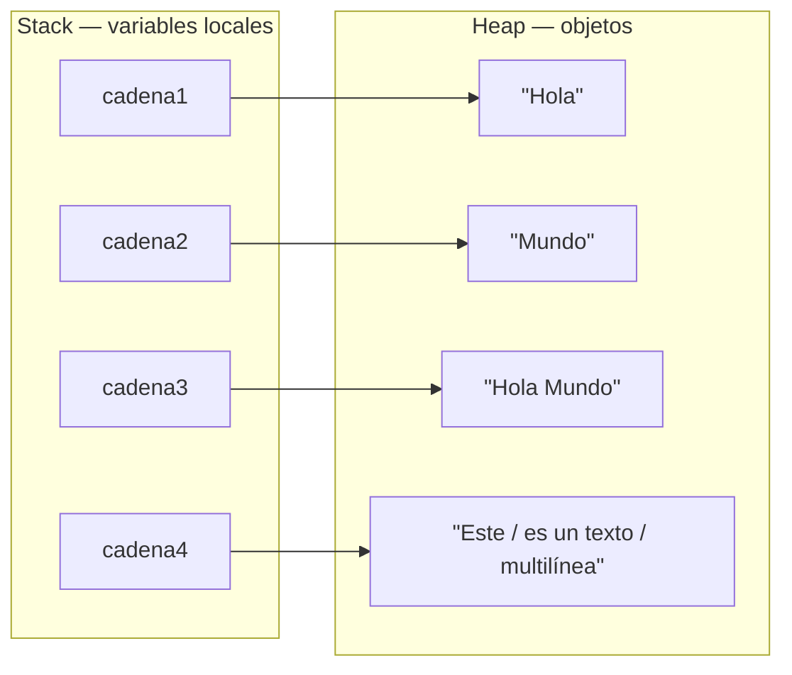
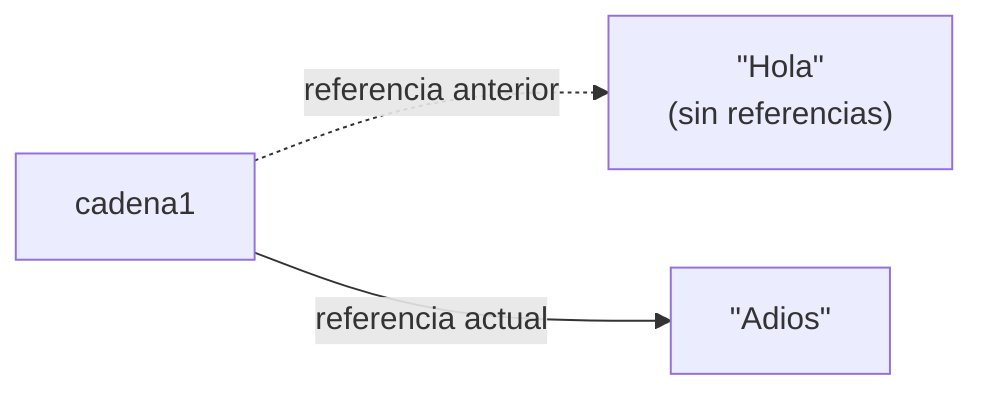
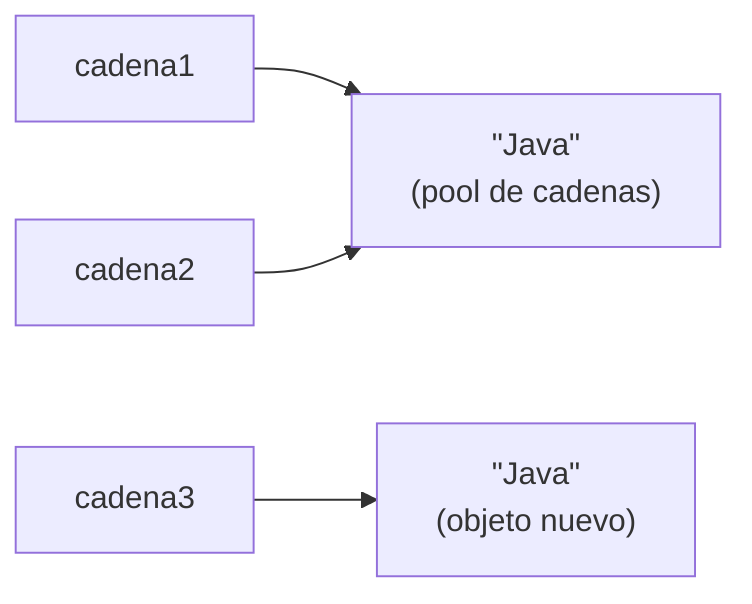

---
tags:
  - programacion
  - DAM1
unidad: 3
tema: Cadenas de texto (String)
---

# Unidad 3. Cadenas de texto (String)

> [!abstract] Objetivos de la unidad
> - Comprender qué es una cadena en Java y cómo se representa en memoria.
> - Crear cadenas mediante literales, el operador `new` y bloques de texto.
> - Acceder a los caracteres de una cadena mediante sus índices.
> - Entender el concepto de inmutabilidad y el *pool* de cadenas.
> - Comparar cadenas correctamente, distinguiendo entre `==` y `equals()`.
> - Utilizar los principales métodos de la clase `String`.
> - Conocer y seleccionar adecuadamente los distintos mecanismos de concatenación.
> - Emplear las secuencias de escape para representar caracteres especiales.

---

## 1. Concepto de cadena

> [!note] Definición: cadena
> Una **cadena** (*string*) es una **secuencia ordenada de caracteres**. Las cadenas se utilizan para almacenar y manipular texto.

En Java, las cadenas **no son un tipo primitivo**: son **objetos** (instancias) de la clase **`String`**, perteneciente al paquete `java.lang`. Por tanto, se trata de un **tipo de referencia** (véase la [Unidad 2](02-variables-tipos-de-datos-y-memoria.md)) y dispone de numerosos **métodos** para operar con el texto.

> [!info] El paquete `java.lang`
> Las clases del paquete `java.lang` (como `String`, `Math`, `Integer` o `System`) se importan **automáticamente** en todo programa Java, por lo que pueden utilizarse sin necesidad de ninguna instrucción `import`.

---

## 2. Creación de cadenas

### 2.1. Mediante un literal

Es la forma más habitual. El texto se escribe entre **comillas dobles**:

```java
var cadena1 = "Hola";
String saludo = "Buenos días";
```

### 2.2. Mediante el operador `new`

Al tratarse de una clase, también es posible crear una cadena invocando explícitamente a su constructor:

```java
var cadena2 = new String("Mundo");
```

> [!warning] Forma no recomendada
> Crear cadenas con `new` fuerza la creación de un objeto nuevo en memoria aunque ya exista otro con el mismo contenido, lo que resulta ineficiente. Se recomienda utilizar siempre **literales**, salvo que exista una razón concreta. La diferencia entre ambas formas se analiza en el apartado 5.

### 2.3. Mediante concatenación

Una cadena también puede obtenerse uniendo otras:

```java
var cadena3 = cadena1 + " " + cadena2; // "Hola Mundo"
```

### 2.4. Bloques de texto (*text blocks*)

Desde **Java 15**, los **bloques de texto** permiten escribir cadenas de **varias líneas** de forma legible. Se delimitan con **triples comillas dobles** (`"""`), y el contenido debe comenzar en la línea siguiente a la apertura:

```java
var cadena4 = """
        Este
        es un texto
        multilínea
        """;
System.out.print(cadena4);
```

Salida:

```
Este
es un texto
multilínea
```

> [!info] Características de los bloques de texto
> - Los **saltos de línea** del bloque se conservan en la cadena resultante.
> - La **indentación común** a todas las líneas se elimina automáticamente; el margen lo determina la línea menos sangrada (incluida la del cierre `"""`).
> - Los espacios en blanco al final de cada línea se eliminan. Para conservar un espacio final se utiliza la secuencia **`\s`**.
> - Pueden combinarse con el método `formatted()` para insertar valores, como se estudia en la [Unidad 5](05-entrada-y-salida.md).

### 2.5. Representación en memoria

Como cualquier objeto, la variable almacena en la *stack* una **referencia**, y el objeto `String` reside en la *heap*:



---

## 3. Índices de una cadena

### 3.1. Indexación

Los caracteres de una cadena están **indexados de forma secuencial**, comenzando desde **0**:

- El **primer** carácter se encuentra en el índice **0**.
- El **último** carácter se encuentra en el índice **n − 1**, siendo *n* la longitud de la cadena.

Para la cadena `"Hola Mundo"` (longitud n = 10):

| Índice | 0 | 1 | 2 | 3 | 4 | 5 | 6 | 7 | 8 | 9 |
|:---:|:---:|:---:|:---:|:---:|:---:|:---:|:---:|:---:|:---:|:---:|
| **Carácter** | H | o | l | a | ␣ | M | u | n | d | o |

> [!note] El espacio es un carácter
> El espacio en blanco ocupa una posición como cualquier otro carácter (índice 4 en el ejemplo) y se contabiliza en la longitud.

### 3.2. Métodos `length()` y `charAt()`

| Método | Devuelve | Descripción |
|---|---|---|
| `length()` | `int` | Número de caracteres de la cadena. |
| `charAt(indice)` | `char` | Carácter situado en la posición indicada. |

```java
public class IndicesCadena {
    public static void main(String[] args) {
        var cadena1 = "Hola Mundo";

        var longitud = cadena1.length();          // 10
        var primerCaracter = cadena1.charAt(0);   // 'H'
        var ultimoCaracter = cadena1.charAt(9);   // 'o'
        var letraM = cadena1.charAt(5);           // 'M'

        // Forma general de obtener el último carácter
        var ultimo = cadena1.charAt(cadena1.length() - 1);

        System.out.println("longitud = " + longitud);
        System.out.println("primerCaracter = " + primerCaracter);
        System.out.println("ultimoCaracter = " + ultimoCaracter);
        System.out.println("letraM = " + letraM);
    }
}
```

> [!danger] Índices fuera de rango
> Acceder a un índice negativo o mayor o igual que `length()` provoca la excepción **`StringIndexOutOfBoundsException`** en tiempo de ejecución:
> ```java
> "Hola".charAt(4); // ERROR: los índices válidos son 0, 1, 2 y 3
> ```

> [!tip] `length()` en cadenas frente a `length` en arrays
> En las cadenas, `length()` es un **método** y lleva paréntesis. En los arrays, `length` es una **propiedad** y se escribe sin paréntesis (véase la [Unidad 8](08-arrays.md)). Confundirlos es un error de compilación frecuente.

---

## 4. Inmutabilidad de las cadenas

> [!note] Definición: inmutabilidad
> Un objeto es **inmutable** cuando su estado no puede modificarse una vez creado. Las cadenas en Java son inmutables: **una vez creada una cadena, sus caracteres no pueden modificarse**.

Si se desea «modificar» una cadena, en realidad se **crea un nuevo objeto `String`** y se asigna su referencia a la variable:

```java
public class InmutabilidadCadenas {
    public static void main(String[] args) {
        var cadena1 = "Hola";
        // No se modifica la cadena: se crea una nueva
        cadena1 = "Adios";
    }
}
```



El objeto `"Hola"` no se altera; simplemente deja de estar referenciado y será eliminado por el recolector de basura.

> [!important] Consecuencia práctica
> **Ningún método de la clase `String` modifica la cadena original.** Métodos como `toUpperCase()` o `replace()` **devuelven una cadena nueva**, que debe almacenarse en una variable para no perderse:
> ```java
> var nombre = "ana";
> nombre.toUpperCase();          // el resultado se pierde; nombre sigue siendo "ana"
> nombre = nombre.toUpperCase(); // correcto: nombre pasa a ser "ANA"
> ```

> [!info] Ventajas de la inmutabilidad
> - **Seguridad:** varias partes del programa pueden compartir una misma cadena sin riesgo de que otra la modifique.
> - **Eficiencia en memoria:** permite reutilizar cadenas idénticas mediante el *pool* de cadenas.

---

## 5. El *pool* de cadenas y la comparación

### 5.1. El *pool* de cadenas

El ***pool* de cadenas** (*String pool*) es una zona especial de la memoria *heap* donde Java almacena las cadenas creadas mediante **literales**. Cuando se crea un literal, Java comprueba si ya existe en el *pool* una cadena con el mismo contenido:

- Si **existe**, reutiliza ese objeto y la nueva variable apunta a él.
- Si **no existe**, crea el objeto en el *pool*.

En cambio, el operador **`new`** crea **siempre un objeto nuevo**, independiente del *pool*.

```java
var cadena1 = "Java";
var cadena2 = "Java";              // reutiliza el objeto del pool
var cadena3 = new String("Java");  // crea un objeto nuevo
```



### 5.2. Comparación por referencia: operador `==`

Aplicado a objetos, el operador `==` **compara referencias**, es decir, comprueba si dos variables apuntan **al mismo objeto** en memoria. **No compara el contenido.**

### 5.3. Comparación por contenido: método `equals()`

El método `equals()` compara el **contenido** de las cadenas, carácter a carácter.

```java
public class ComparacionCadenas {
    public static void main(String[] args) {
        var cadena1 = "Java";
        var cadena2 = "Java";
        var cadena3 = new String("Java");

        // Comparación de referencias (==)
        System.out.println(cadena1 == cadena2);      // true  → mismo objeto del pool
        System.out.println(cadena1 == cadena3);      // false → objetos distintos

        // Comparación de contenido (equals)
        System.out.println(cadena1.equals(cadena3)); // true  → mismo contenido
    }
}
```

> [!danger] Regla fundamental
> Para comparar el **contenido** de dos cadenas se utiliza **siempre `equals()`**, nunca `==`. El resultado de `==` depende de cómo se hayan creado las cadenas, lo que da lugar a errores lógicos difíciles de detectar (por ejemplo, al comparar un texto introducido por teclado, que nunca procede del *pool*).

### 5.4. Otros métodos de comparación

| Método | Devuelve | Descripción |
|---|---|---|
| `equals(otra)` | `boolean` | `true` si ambas cadenas tienen exactamente el mismo contenido. |
| `equalsIgnoreCase(otra)` | `boolean` | Igual que `equals()`, pero sin distinguir mayúsculas de minúsculas. |
| `compareTo(otra)` | `int` | Compara alfabéticamente (orden lexicográfico): devuelve un valor negativo si la cadena es anterior, `0` si son iguales y un valor positivo si es posterior. |

```java
"Java".equalsIgnoreCase("JAVA"); // true
"Ana".compareTo("Luis");         // negativo: "Ana" va antes que "Luis"
```

> [!tip] Comparar con un literal conocido
> Cuando se compara una variable con un literal, es una buena práctica invocar `equals()` sobre el literal: `"admin".equals(usuario)`. Así se evita un error en tiempo de ejecución (`NullPointerException`) en caso de que `usuario` valga `null`.

---

## 6. Métodos principales de la clase `String`

### 6.1. Tabla de referencia

| Método | Devuelve | Descripción |
|---|---|---|
| `length()` | `int` | Longitud de la cadena. |
| `charAt(i)` | `char` | Carácter en la posición `i`. |
| `toUpperCase()` | `String` | Cadena convertida a mayúsculas. |
| `toLowerCase()` | `String` | Cadena convertida a minúsculas. |
| `trim()` | `String` | Cadena sin espacios en blanco al inicio y al final. |
| `replace(viejo, nuevo)` | `String` | Cadena con todas las apariciones de `viejo` sustituidas por `nuevo`. Admite caracteres o subcadenas. |
| `substring(inicio, fin)` | `String` | Subcadena desde `inicio` (incluido) hasta `fin` (excluido). |
| `substring(inicio)` | `String` | Subcadena desde `inicio` hasta el final. |
| `indexOf(sub)` | `int` | Índice de la **primera** aparición de `sub`, o `-1` si no existe. |
| `lastIndexOf(sub)` | `int` | Índice de la **última** aparición de `sub`, o `-1` si no existe. |
| `contains(sub)` | `boolean` | `true` si la cadena contiene `sub`. |
| `startsWith(prefijo)` | `boolean` | `true` si la cadena comienza por `prefijo`. |
| `endsWith(sufijo)` | `boolean` | `true` si la cadena termina en `sufijo`. |
| `isEmpty()` | `boolean` | `true` si la longitud es 0. |
| `isBlank()` | `boolean` | `true` si está vacía o solo contiene espacios en blanco (Java 11). |
| `split(separador)` | `String[]` | Divide la cadena en un array según el separador indicado. |

### 6.2. Transformación: mayúsculas, minúsculas, espacios y reemplazos

```java
public class MetodosDeCadenas {
    public static void main(String[] args) {
        var cadena1 = "Hola Mundo";

        var longitud = cadena1.length();
        System.out.println("longitud = " + longitud);              // 10

        // Reemplazar caracteres
        var nuevaCadena = cadena1.replace('o', 'a');
        System.out.println("nuevaCadena = " + nuevaCadena);        // Hala Munda

        // Mayúsculas y minúsculas
        System.out.println("mayusculas = " + cadena1.toUpperCase()); // HOLA MUNDO
        System.out.println("minusculas = " + cadena1.toLowerCase()); // hola mundo

        // Eliminar espacios al inicio y al final
        var cadena2 = "   Leo Reyes   ";
        System.out.println("[" + cadena2 + "]");         // [   Leo Reyes   ]
        System.out.println("[" + cadena2.trim() + "]");  // [Leo Reyes]
    }
}
```

> [!note] `trim()` no elimina los espacios intermedios
> `trim()` solo actúa sobre los extremos de la cadena. El espacio entre «Leo» y «Reyes» se mantiene. Para eliminar todos los espacios se puede utilizar `replace(" ", "")`.

### 6.3. Extracción de subcadenas

> [!note] Definición: subcadena
> Una **subcadena** es una porción consecutiva de caracteres de una cadena.

El método `substring(inicio, fin)` devuelve los caracteres comprendidos entre el índice `inicio` (**incluido**) y el índice `fin` (**excluido**). El número de caracteres extraídos es, por tanto, `fin − inicio`.

```java
public class ManejoSubcadenas {
    public static void main(String[] args) {
        var cadena1 = "Hola Mundo";

        var subcadena1 = cadena1.substring(0, 4); // índices 0 a 3
        System.out.println("subcadena1 = " + subcadena1); // Hola

        var subcadena2 = cadena1.substring(5, 10); // índices 5 a 9
        System.out.println("subcadena2 = " + subcadena2); // Mundo

        var subcadena3 = cadena1.substring(5);     // desde 5 hasta el final
        System.out.println("subcadena3 = " + subcadena3); // Mundo
    }
}
```

| Índice | 0 | 1 | 2 | 3 | 4 | 5 | 6 | 7 | 8 | 9 |
|:---:|:---:|:---:|:---:|:---:|:---:|:---:|:---:|:---:|:---:|:---:|
| **Carácter** | **H** | **o** | **l** | **a** | ␣ | *M* | *u* | *n* | *d* | *o* |
| | ← `substring(0, 4)` → | | | | | ← `substring(5, 10)` → | | | | |

> [!tip] Obtener las primeras letras de una palabra
> `substring(0, n)` es la forma habitual de extraer los *n* primeros caracteres: `"Juan".substring(0, 2)` devuelve `"Ju"`.

### 6.4. Búsqueda de subcadenas

```java
public class BusquedaSubcadenas {
    public static void main(String[] args) {
        var cadena1 = "Hola Mundo";

        var indice1 = cadena1.indexOf("Hola");      // 0
        var indice2 = cadena1.lastIndexOf("Mundo"); // 5
        var indice3 = cadena1.indexOf("Java");      // -1 (no encontrada)

        System.out.println("indice1 = " + indice1);
        System.out.println("indice2 = " + indice2);
        System.out.println("indice3 = " + indice3);

        System.out.println(cadena1.contains("Mun"));    // true
        System.out.println(cadena1.startsWith("Hola")); // true
        System.out.println(cadena1.endsWith("do"));     // true
    }
}
```

> [!info] El valor `-1`
> Los métodos `indexOf()` y `lastIndexOf()` devuelven **`-1`** cuando la subcadena no se encuentra. Como ningún índice válido es negativo, este valor sirve para indicar la ausencia de resultado.

### 6.5. Reemplazo de subcadenas

```java
public class ReemplazarSubcadenas {
    public static void main(String[] args) {
        var cadena = "Hola Mundo";

        var nuevaCadena = cadena.replace("Mundo", "a todos");
        System.out.println(nuevaCadena); // Hola a todos

        nuevaCadena = cadena.replace("Hola", "Saludos");
        System.out.println(nuevaCadena); // Saludos Mundo

        System.out.println(cadena);      // Hola Mundo (la original no cambia)
    }
}
```

### 6.6. División de cadenas: `split()`

El método `split()` divide una cadena en **fragmentos** según un separador y los devuelve en un **array** de cadenas. Es especialmente útil para procesar datos estructurados, como las líneas de un fichero CSV (véase la [Unidad 15](15-lectura-y-escritura-de-ficheros.md)).

```java
var linea = "Mbappé,Real Madrid,23";
String[] partes = linea.split(",");

System.out.println(partes[0]); // Mbappé
System.out.println(partes[1]); // Real Madrid
System.out.println(partes[2]); // 23
```

### 6.7. Encadenamiento de métodos

Como la mayoría de los métodos de `String` devuelven otra cadena, es posible **encadenar** varias llamadas en una sola expresión. Se ejecutan de izquierda a derecha, y cada método actúa sobre el resultado del anterior:

```java
var empresa = "  Borja Moll  ";
var resultado = empresa.trim().toLowerCase().replace(" ", "");
System.out.println(resultado); // borjamoll
```

---

## 7. Concatenación de cadenas

> [!note] Definición: concatenación
> La **concatenación** es la operación que une dos o más cadenas para formar una nueva.

Java ofrece cinco mecanismos de concatenación:

1. Operador `+`
2. Método `concat()`
3. Clase `StringBuilder`
4. Clase `StringBuffer`
5. Método `String.join()`

### 7.1. Operador `+`

Es el método más sencillo, común y legible:

```java
var saludo = "Hola";
var nombre = "Mundo";
var mensaje = saludo + ", " + nombre + "!";
System.out.println(mensaje); // Hola, Mundo!
```

Cuando uno de los operandos es una cadena, el operador `+` convierte automáticamente el otro operando en texto, lo que permite concatenar números, booleanos o caracteres:

```java
var edad = 30;
System.out.println("Edad: " + edad); // Edad: 30
```

> [!danger] Orden de evaluación con números
> El operador `+` se evalúa **de izquierda a derecha**. Mientras ambos operandos sean numéricos, realiza una **suma**; en cuanto interviene una cadena, pasa a **concatenar**:
> ```java
> System.out.println(1 + 2 + " años");   // "3 años"  (primero suma, luego concatena)
> System.out.println("Años: " + 1 + 2);  // "Años: 12" (concatena dos veces)
> System.out.println("Años: " + (1 + 2)); // "Años: 3" (los paréntesis fuerzan la suma)
> ```

### 7.2. Método `concat()`

Añade la cadena indicada al final de la cadena actual. Puede encadenarse:

```java
var mensaje = saludo.concat(", ").concat(nombre).concat("!");
System.out.println(mensaje); // Hola, Mundo!
```

> [!note] Diferencia con el operador `+`
> `concat()` solo admite argumentos de tipo `String`, mientras que `+` convierte automáticamente otros tipos a texto.

### 7.3. Clase `StringBuilder`

Dado que las cadenas son inmutables, cada concatenación con `+` crea un nuevo objeto. Cuando se realizan **muchas concatenaciones** (por ejemplo, dentro de un bucle), esto resulta ineficiente.

**`StringBuilder`** es una clase que representa una **secuencia de caracteres mutable**: las operaciones modifican el mismo objeto sin crear otros nuevos. Al finalizar, se obtiene la cadena resultante con `toString()`.

```java
public class ConcatenacionStringBuilder {
    public static void main(String[] args) {
        var saludo = "Hola";
        var nombre = "Mundo";

        var sb = new StringBuilder();
        sb.append(saludo);
        sb.append(", ");
        sb.append(nombre);
        sb.append("!");

        String mensaje = sb.toString();
        System.out.println(mensaje); // Hola, Mundo!
    }
}
```

Las llamadas a `append()` también pueden encadenarse:

```java
var resultado = new StringBuilder().append(saludo).append(", ").append(nombre).toString();
```

### 7.4. Clase `StringBuffer`

**`StringBuffer`** funciona igual que `StringBuilder` (mismos métodos), con una diferencia: es **segura para hilos** (*thread-safe*), lo que la hace adecuada en entornos **multihilo**, donde varios hilos acceden al mismo objeto simultáneamente. Esta seguridad tiene un coste de rendimiento, por lo que en programas de un solo hilo se prefiere `StringBuilder`.

```java
var stringBuffer = new StringBuffer();
stringBuffer.append("Hola").append(" ").append("Mundo");
var resultado = stringBuffer.toString();
```

### 7.5. Método `String.join()`

Une varias cadenas intercalando un **delimitador** entre ellas. Es útil cuando se necesita unir una colección de elementos con un separador común:

```java
var mensaje = String.join(", ", "Hola", "Mundo") + "!";
System.out.println(mensaje); // Hola, Mundo!

var fecha = String.join("/", "29", "09", "2026");
System.out.println(fecha);   // 29/09/2026
```

### 7.6. Comparativa de los mecanismos de concatenación

| Mecanismo | Ventajas | Uso recomendado |
|---|---|---|
| Operador `+` | Sencillo y legible; admite cualquier tipo | Concatenaciones puntuales |
| `concat()` | Explícito | Unir cadenas en casos simples |
| `StringBuilder` | Mutable y eficiente | Concatenaciones repetidas o en bucles |
| `StringBuffer` | Mutable y segura para hilos | Entornos multihilo |
| `String.join()` | Inserta el delimitador automáticamente | Unir varios elementos con un separador |

---

## 8. Caracteres especiales (secuencias de escape)

### 8.1. Concepto

Algunos caracteres no pueden escribirse directamente dentro de un literal de cadena, ya sea porque tienen un significado especial para el compilador (como las comillas dobles, que delimitan la cadena) o porque no son visibles (como el salto de línea). Para representarlos se utilizan las **secuencias de escape**, formadas por una **barra invertida** (`\`) seguida de un carácter.

### 8.2. Tabla de secuencias de escape

| Secuencia | Significado |
|---|---|
| `\n` | Salto de línea. |
| `\t` | Tabulador horizontal. |
| `\'` | Comilla simple. |
| `\"` | Comilla doble. |
| `\\` | Barra invertida. |
| `\s` | Espacio en blanco (útil en bloques de texto para conservar espacios finales). |

```java
public class CaracteresEspeciales {
    public static void main(String[] args) {
        var cadena1 = "Hola\nMundo";       // salto de línea
        var cadena2 = "\tHola\tMundo";     // tabuladores
        var cadena3 = "Hola \' Mundo";     // comilla simple
        var cadena4 = "Hola \" Mundo";     // comilla doble
        var cadena5 = "Hola \\ Mundo";     // barra invertida

        System.out.println(cadena1);
        System.out.println(cadena2);
        System.out.println(cadena3);
        System.out.println(cadena4);
        System.out.println(cadena5);
    }
}
```

Salida:

```
Hola
Mundo
	Hola	Mundo
Hola ' Mundo
Hola " Mundo
Hola \ Mundo
```

> [!tip] Rutas de archivos en Windows
> Las rutas de Windows utilizan la barra invertida, por lo que en una cadena debe escribirse duplicada: `"C:\\Users\\alumno\\datos.txt"`.

---

## 9. Ejemplo integrador: generador de correos electrónicos

El siguiente programa genera una dirección de correo electrónico a partir del nombre completo de una persona, el nombre de la empresa y el dominio, combinando varios de los métodos estudiados.

**Resultado esperado:** a partir de `"Marisol Ruiz Rivera"`, `"Borja Moll"` y `"eu"` se obtiene `marisol.ruiz.rivera@borjamoll.eu`.

```java
public class GeneradorEmail {
    public static void main(String[] args) {
        String nombreCompleto = "Marisol Ruiz Rivera";
        String empresa = "Borja Moll";
        String dominio = "eu";

        // 1. Nombre en minúsculas y espacios sustituidos por puntos
        String nombreFormateado = nombreCompleto.toLowerCase().replace(" ", ".");

        // 2. Empresa en minúsculas y sin espacios
        String empresaFormateada = empresa.toLowerCase().replace(" ", "");

        // 3. Construcción del correo mediante concatenación
        String email = nombreFormateado + "@" + empresaFormateada + "." + dominio;

        System.out.println("email: " + email); // email: marisol.ruiz.rivera@borjamoll.eu
    }
}
```

---

## 10. Resumen de la unidad

> [!summary] Ideas clave
> - Una **cadena** es una secuencia de caracteres representada por la clase **`String`**; es un tipo de referencia.
> - Se crea preferentemente mediante **literales** entre comillas dobles; los **bloques de texto** (`"""`) permiten cadenas multilínea.
> - Los caracteres se indexan desde **0** hasta **`length() − 1`**; `charAt(i)` obtiene el carácter de una posición.
> - Las cadenas son **inmutables**: sus métodos devuelven **cadenas nuevas**, que hay que guardar en una variable.
> - Los literales se almacenan en el ***pool* de cadenas** y se reutilizan; `new String()` crea siempre un objeto nuevo.
> - **`==`** compara referencias; **`equals()`** compara contenido. Para comparar texto se usa siempre `equals()`.
> - `substring(inicio, fin)` incluye `inicio` y **excluye** `fin`; `indexOf()` devuelve **`-1`** si no encuentra la subcadena.
> - Para concatenar se usa `+` en casos sencillos, **`StringBuilder`** en concatenaciones repetidas y `String.join()` para unir con separador.
> - Las **secuencias de escape** (`\n`, `\t`, `\"`, `\\`…) representan caracteres especiales.

---

**Navegación:** Anterior: [Unidad 2. Variables, tipos de datos y memoria](02-variables-tipos-de-datos-y-memoria.md) · [Índice](../../../README.md) · Siguiente: [Unidad 4. Operadores](04-operadores.md)
