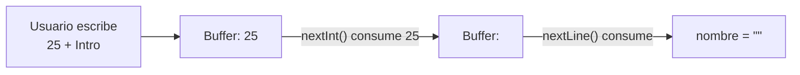

---
tags:
  - programacion
  - DAM1
unidad: 5
tema: Entrada y salida de datos, números aleatorios y formateo
---

# Unidad 5. Entrada y salida de datos

> [!abstract] Objetivos de la unidad
> - Comprender los conceptos de entrada y salida estándar de un programa.
> - Leer datos introducidos por teclado mediante la clase `Scanner`.
> - Identificar y resolver el problema del salto de línea residual en el *buffer* de entrada.
> - Convertir cadenas en valores numéricos y lógicos con los métodos `parse`.
> - Generar números aleatorios con la clase `Random`.
> - Dar formato a la salida con `printf`, `String.format` y bloques de texto.

---

## 1. Entrada y salida estándar

> [!note] Definiciones
> - **Entrada estándar:** canal por el que un programa recibe datos del exterior. Por defecto, corresponde al **teclado**. En Java se representa mediante **`System.in`**.
> - **Salida estándar:** canal por el que un programa muestra información. Por defecto, corresponde a la **consola**. En Java se representa mediante **`System.out`**.

Hasta ahora, los programas trabajaban con valores escritos directamente en el código (valores *fijos*). La lectura de datos por teclado permite construir programas **interactivos**, cuyo comportamiento depende de la información que proporciona el usuario durante la ejecución.


---

## 2. La clase `Scanner`

### 2.1. Concepto

La clase **`Scanner`** pertenece al paquete **`java.util`** y permite **leer datos** desde distintas fuentes de entrada: el teclado, archivos, cadenas o flujos de datos. En esta unidad se utiliza para leer la información que el usuario escribe por teclado.

### 2.2. Importación y creación

Para utilizar `Scanner` son necesarios dos pasos:

**1. Importar la clase.** Como no pertenece a `java.lang`, debe importarse explícitamente al principio del archivo, antes de la declaración de la clase:

```java
import java.util.Scanner;
```

**2. Crear una instancia** asociada a la entrada estándar (`System.in`):

```java
Scanner consola = new Scanner(System.in);
// o bien, con inferencia de tipos:
var consola = new Scanner(System.in);
```

> [!info] La instrucción `import`
> Indica al compilador en qué paquete se encuentra una clase que se va a utilizar. Sin ella, el compilador no reconoce el nombre `Scanner` y produce un error. Los IDE suelen añadir los `import` automáticamente al escribir el nombre de la clase.

### 2.3. Primer ejemplo: lectura de una cadena

```java
import java.util.Scanner;

public class ManejoConsola {
    public static void main(String[] args) {
        var consola = new Scanner(System.in); // in: input, entrada de datos

        System.out.print("Escribe tu nombre: ");
        var nombre = consola.nextLine();

        System.out.println("nombre = " + nombre);
    }
}
```

Ejecución:

```
Escribe tu nombre: Marisol
nombre = Marisol
```

> [!tip] `print` en lugar de `println` para los mensajes de solicitud
> Para que el usuario escriba el dato **en la misma línea** que el mensaje de solicitud, este debe mostrarse con `System.out.print()` (sin `ln`). Si se usa `println()`, el cursor salta a la línea siguiente.

> [!info] Funcionamiento de la lectura
> Al invocar un método de lectura como `nextLine()`, el programa **se detiene** y espera a que el usuario escriba un valor y pulse **Intro**. Solo entonces continúa la ejecución.

### 2.4. Métodos de lectura

| Método | Tipo devuelto | Descripción |
|---|---|---|
| `nextLine()` | `String` | Lee **toda la línea** hasta el salto de línea (incluidos los espacios). |
| `next()` | `String` | Lee una sola **palabra** (hasta el primer espacio). |
| `nextInt()` | `int` | Lee un número entero. |
| `nextDouble()` | `double` | Lee un número decimal. |
| `nextFloat()` | `float` | Lee un número decimal de precisión simple. |
| `nextLong()` | `long` | Lee un entero largo. |
| `nextBoolean()` | `boolean` | Lee un valor lógico (`true` o `false`). |

```java
import java.util.Scanner;

public class LeerTiposDatos {
    public static void main(String[] args) {
        var consola = new Scanner(System.in);

        // Lectura de un int
        System.out.print("Ingresa tu edad: ");
        var edad = consola.nextInt();
        System.out.println("edad = " + edad);

        // Lectura de un double
        System.out.print("Ingresa tu altura: ");
        var altura = consola.nextDouble();
        System.out.println("altura = " + altura);
    }
}
```

> [!warning] Separador decimal y configuración regional
> Los métodos `nextDouble()` y `nextFloat()` interpretan los números según la **configuración regional** (*locale*) del sistema operativo. En un equipo configurado en español, el separador decimal esperado es la **coma** (`1,75`), y escribir `1.75` provoca un error. Este comportamiento no afecta a los métodos `parse` (apartado 3), que siempre utilizan el **punto**.

> [!danger] Errores de tipo en la entrada
> Si el usuario introduce un valor que no corresponde al tipo esperado (por ejemplo, texto cuando se espera un entero), `nextInt()` lanza la excepción **`InputMismatchException`** y el programa se detiene. La gestión de estas situaciones se estudia en la [Unidad 10](10-errores-y-excepciones.md).

### 2.5. El problema del salto de línea residual

Cuando el usuario escribe un dato y pulsa **Intro**, se envía al programa tanto el dato como el carácter de **salto de línea** (`\n`). Estos caracteres se almacenan temporalmente en el ***buffer*** de entrada.

- `nextLine()` lee hasta el salto de línea **y lo consume** (lo retira del *buffer*).
- `nextInt()`, `nextDouble()` y el resto de métodos numéricos leen el número pero **no consumen** el salto de línea, que queda pendiente en el *buffer*.

Por ello, si después de un método numérico se invoca `nextLine()`, este encuentra de inmediato el salto de línea pendiente y devuelve una **cadena vacía**, sin esperar a que el usuario escriba:

```java
System.out.print("Ingresa tu edad: ");
var edad = consola.nextInt();      // lee 25, pero deja "\n" en el buffer

System.out.print("Ingresa tu nombre: ");
var nombre = consola.nextLine();   // lee el "\n" pendiente → nombre = ""
```



**Solución:** invocar un `nextLine()` adicional, sin almacenar su resultado, justo después del método numérico, para **consumir el salto de línea** pendiente:

```java
System.out.print("Ingresa tu edad: ");
var edad = consola.nextInt();
consola.nextLine(); // consume el salto de línea residual

System.out.print("Ingresa tu nombre: ");
var nombre = consola.nextLine(); // ahora espera correctamente la entrada
```

> [!tip] Estrategia recomendada
> Una forma de evitar este problema por completo es **leer siempre con `nextLine()`** y convertir después el texto al tipo deseado, tal como se explica en el apartado siguiente.

### 2.6. Uso de un único `Scanner`

> [!tip] Buenas prácticas
> - Se recomienda crear **un único objeto `Scanner`** al inicio del programa y reutilizarlo para todas las lecturas.
> - Aunque es posible escribir expresiones como `new Scanner(System.in).nextLine()`, crear un objeto nuevo en cada lectura es ineficiente y puede provocar comportamientos inesperados.
> - Al finalizar, el objeto puede cerrarse con `consola.close()`. Hay que tener en cuenta que esto cierra también `System.in`, que ya no podrá volver a utilizarse en el resto del programa.

---

## 3. Conversión de cadenas a otros tipos

### 3.1. Métodos `parse`

Las **clases envoltorio** (véase la [Unidad 2](02-variables-tipos-de-datos-y-memoria.md)) proporcionan métodos estáticos que **convierten una cadena** en el valor primitivo correspondiente:

| Método | Tipo devuelto | Ejemplo |
|---|---|---|
| `Integer.parseInt(cadena)` | `int` | `Integer.parseInt("25")` → `25` |
| `Double.parseDouble(cadena)` | `double` | `Double.parseDouble("1.75")` → `1.75` |
| `Float.parseFloat(cadena)` | `float` | `Float.parseFloat("3.5")` → `3.5` |
| `Long.parseLong(cadena)` | `long` | `Long.parseLong("9000000000")` → `9000000000` |
| `Boolean.parseBoolean(cadena)` | `boolean` | `Boolean.parseBoolean("true")` → `true` |

### 3.2. Lectura con `nextLine()` y conversión

Esta técnica consiste en leer siempre la línea completa como texto y convertirla después. Como `nextLine()` siempre consume el salto de línea, se elimina el problema del *buffer*:

```java
import java.util.Scanner;

public class ConversionDatos {
    public static void main(String[] args) {
        var consola = new Scanner(System.in);

        // En dos pasos
        System.out.print("Proporciona un valor entero: ");
        var enteroString = consola.nextLine();
        var entero = Integer.parseInt(enteroString);
        System.out.println("entero = " + entero);

        // En una sola línea
        System.out.print("Proporciona un valor decimal: ");
        var flotante = Float.parseFloat(consola.nextLine());
        System.out.println("flotante = " + flotante);

        System.out.print("Proporciona tu salario: ");
        var salario = Double.parseDouble(consola.nextLine());
        System.out.println("salario = " + salario);
    }
}
```

> [!danger] `NumberFormatException`
> Si la cadena no representa un número válido, los métodos `parse` lanzan la excepción **`NumberFormatException`**:
> ```java
> Integer.parseInt("abc");  // ERROR: NumberFormatException
> Integer.parseInt("3.5");  // ERROR: no es un entero
> ```

> [!info] `Boolean.parseBoolean()`
> Devuelve `true` únicamente si la cadena es `"true"`, sin distinguir mayúsculas de minúsculas. Cualquier otro valor (incluidos `"sí"` o `"1"`) devuelve `false`, sin producir ningún error.

### 3.3. Comparativa de las dos técnicas de lectura

| Técnica | Ventajas | Inconvenientes |
|---|---|---|
| Métodos específicos (`nextInt()`, `nextDouble()`) | Código más breve | Problema del salto de línea residual; dependencia de la configuración regional en los decimales |
| `nextLine()` + `parse` | Sin problemas de *buffer*; separador decimal siempre el punto | Código algo más extenso |

---

## 4. Números aleatorios: la clase `Random`

### 4.1. Concepto

La clase **`Random`**, del paquete **`java.util`**, permite generar valores **aleatorios** (más exactamente, *pseudoaleatorios*) de tipo `int`, `double`, `float` y `boolean`. Resulta útil en simulaciones, juegos, generación de identificadores o datos de prueba.

> [!info] Números pseudoaleatorios
> Los ordenadores generan secuencias de números mediante algoritmos deterministas que, a efectos prácticos, se comportan como aleatorias. Por eso se denominan *pseudoaleatorias*.

### 4.2. Creación y métodos

```java
import java.util.Random;

var random = new Random();
```

| Método | Devuelve | Rango |
|---|---|---|
| `nextInt(n)` | `int` | Entre **0** (incluido) y **n** (excluido): de 0 a n − 1. |
| `nextInt()` | `int` | Cualquier valor del rango de `int`. |
| `nextDouble()` | `double` | Entre 0.0 (incluido) y 1.0 (excluido). |
| `nextFloat()` | `float` | Entre 0.0 (incluido) y 1.0 (excluido). |
| `nextBoolean()` | `boolean` | `true` o `false`. |

### 4.3. Generación de enteros en un rango

Dado que `nextInt(n)` genera valores entre 0 y n − 1, para obtener un número en un rango distinto se **desplaza** el resultado sumando el valor mínimo:

| Objetivo | Expresión | Explicación |
|---|---|---|
| Entre 0 y 9 | `random.nextInt(10)` | 10 valores posibles, empezando en 0. |
| Entre 1 y 10 | `random.nextInt(10) + 1` | Genera 0-9 y suma 1. |
| Entre 1 y 6 (dado) | `random.nextInt(6) + 1` | Genera 0-5 y suma 1. |
| Entre `min` y `max` | `random.nextInt(max - min + 1) + min` | Fórmula general. |

> [!note] Fórmula general
> El argumento de `nextInt()` indica la **cantidad de valores posibles** (`max − min + 1`), y el sumando indica el **valor inicial** del rango (`min`).

```java
import java.util.Random;

public class NumerosAleatorios {
    public static void main(String[] args) {
        var random = new Random();

        // Entero entre 0 y 9
        var numeroAleatorio = random.nextInt(10);
        System.out.println("Entre 0 y 9 = " + numeroAleatorio);

        // Entero entre 1 y 10
        numeroAleatorio = random.nextInt(10) + 1;
        System.out.println("Entre 1 y 10 = " + numeroAleatorio);

        // Decimal entre 0.0 y 1.0
        var flotanteAleatorio = random.nextFloat();
        System.out.println("flotanteAleatorio = " + flotanteAleatorio);

        // Simulación del lanzamiento de un dado (1 a 6)
        var dado = random.nextInt(6) + 1;
        System.out.println("Resultado del dado = " + dado);

        // Valor lógico aleatorio
        var moneda = random.nextBoolean();
        System.out.println("¿Cara? " + moneda);
    }
}
```

> [!info] Alternativas
> - Desde Java 17, existe la sobrecarga `random.nextInt(origen, limite)`, que genera directamente un valor entre `origen` (incluido) y `limite` (excluido). Por ejemplo, `random.nextInt(1, 7)` simula un dado.
> - El método estático `Math.random()` devuelve un `double` entre 0.0 y 1.0 sin necesidad de crear un objeto `Random`.

---

## 5. Formateo de la salida

### 5.1. Concepto

**Formatear** la salida consiste en controlar la forma en que se presentan los datos: número de decimales, anchura de los campos, alineación, relleno con ceros, saltos de línea, etc. Java ofrece dos mecanismos equivalentes basados en **especificadores de formato**:

| Mecanismo | Funcionamiento |
|---|---|
| `System.out.printf(formato, valores...)` | **Imprime** directamente el texto formateado. |
| `String.format(formato, valores...)` | **Devuelve** una cadena formateada, que puede almacenarse o reutilizarse. |

### 5.2. Especificadores de formato

Un **especificador de formato** es un marcador que comienza por `%` y que se sustituye por el valor correspondiente de la lista de argumentos, en el mismo orden en que aparecen.

| Especificador | Tipo de dato |
|---|---|
| `%s` | Cadena de texto (`String`). |
| `%d` | Entero decimal (`int`, `long`). |
| `%f` | Número de coma flotante (`double`, `float`). |
| `%.nf` | Número de coma flotante con *n* decimales (p. ej., `%.2f`). |
| `%c` | Carácter (`char`). |
| `%b` | Valor lógico (`boolean`). |
| `%n` | Salto de línea independiente de la plataforma. |
| `%t` | Fecha y hora (requiere especificadores adicionales). |

```java
public class FormateoCadenas {
    public static void main(String[] args) {
        var nombre = "Matías";
        var edad = 35;
        var salario = 21000.50;

        // String.format: construye la cadena
        var mensaje = String.format("Nombre: %s, Edad: %d, Salario: %.2f€", nombre, edad, salario);
        System.out.println(mensaje);

        // printf: imprime directamente
        System.out.printf("Nombre: %s, Edad: %d, Salario: %.2f€%n", nombre, edad, salario);
    }
}
```

> [!warning] Correspondencia entre especificadores y argumentos
> - El **número** de especificadores debe coincidir con el número de argumentos.
> - El **tipo** de cada especificador debe corresponder al del argumento. Por ejemplo, utilizar `%d` con un `double` lanza la excepción `IllegalFormatConversionException`.

> [!tip] `%n` frente a `\n`
> `printf` **no** añade un salto de línea al final, por lo que debe incluirse explícitamente. Se recomienda **`%n`**, que genera el salto de línea adecuado para cada sistema operativo, en lugar de `\n`.

> [!info] Separador decimal en la salida
> Al igual que `Scanner`, `printf` y `String.format` utilizan la configuración regional del sistema. En un equipo configurado en español, `%.2f` muestra `21000,50` (con coma), mientras que `println` muestra `21000.5` (con punto).

### 5.3. Anchura, alineación y relleno

Entre el símbolo `%` y la letra del especificador pueden indicarse modificadores que controlan la presentación:

| Formato | Efecto | Ejemplo | Resultado |
|---|---|---|---|
| `%04d` | Anchura 4, rellenando con **ceros** a la izquierda | `String.format("%04d", 42)` | `0042` |
| `%5d` | Anchura 5, alineado a la **derecha** | `String.format("%5d", 42)` | `   42` |
| `%-10s` | Anchura 10, alineado a la **izquierda** | `String.format("%-10s\|", "Ana")` | `Ana       \|` |
| `%10s` | Anchura 10, alineado a la **derecha** | `String.format("%10s\|", "Ana")` | `       Ana\|` |
| `%.2f` | Exactamente 2 decimales (con redondeo) | `String.format("%.2f", 123.456)` | `123.46` |
| `%8.2f` | Anchura 8 y 2 decimales | `String.format("%8.2f", 3.5)` | `    3.50` |

```java
public class FormateoNumeros {
    public static void main(String[] args) {
        var numero = 42;
        var valor = 123.456;

        // Garantizar 4 dígitos en el entero (relleno con ceros)
        var numeroFormateado = String.format("%04d", numero);
        // Garantizar 2 decimales en el número de coma flotante
        var valorFormateado = String.format("%.2f", valor);

        System.out.println("Número formateado (4 dígitos): " + numeroFormateado); // 0042
        System.out.println("Valor formateado (2 decimales): " + valorFormateado); // 123.46 (123,46 en español)

        // Equivalente con printf
        System.out.printf("Número formateado (4 dígitos): %04d%n", numero);
        System.out.printf("Valor formateado (2 decimales): %.2f%n", valor);
    }
}
```

> [!tip] Tablas alineadas
> La combinación de anchuras fijas permite presentar datos en columnas:
> ```java
> System.out.printf("%-12s%8s%n", "Producto", "Precio");
> System.out.printf("%-12s%8.2f%n", "Teclado", 29.99);
> System.out.printf("%-12s%8.2f%n", "Monitor", 199.5);
> ```
> ```
> Producto      Precio
> Teclado        29.99
> Monitor       199.50
> ```

### 5.4. Caracteres especiales en el formateo

Las secuencias de escape (véase la [Unidad 3](03-cadenas-de-texto.md)) pueden combinarse con los especificadores para mejorar la legibilidad de la salida:

```java
var nombre = "Juan";
var edad = 35;
var salario = 12345.67;

var mensaje = String.format("Nombre:\t%s%nEdad:\t%d%nSalario:\t%.2f", nombre, edad, salario);
System.out.println(mensaje);
```

### 5.5. Formateo con bloques de texto

Los **bloques de texto** pueden combinarse con el método **`formatted()`**, que funciona igual que `String.format()` pero se invoca sobre la propia cadena. Esta técnica resulta muy legible para presentar informes o fichas de varias líneas:

```java
public class FormateoTextBlock {
    public static void main(String[] args) {
        var nombre = "Juan";
        var numeroEmpleado = 7;
        var edad = 35;
        var salario = 12345.67;

        var mensaje = """
                Detalle Persona:
                -----------------
                \tNombre: %s
                \tNº Empleado: %04d
                \tEdad: %d años
                \tSalario: %.2f€
                """.formatted(nombre, numeroEmpleado, edad, salario);
        System.out.print(mensaje);
    }
}
```

Salida:

```
Detalle Persona:
-----------------
	Nombre: Juan
	Nº Empleado: 0007
	Edad: 35 años
	Salario: 12345,67€
```

El bloque de texto también puede pasarse directamente como primer argumento de `printf`:

```java
System.out.printf("""
        Nombre: %s
        Edad: %d años
        """, nombre, edad);
```

> [!info] Secuencias útiles en bloques de texto
> | Secuencia | Efecto |
> |---|---|
> | `\t` | Inserta un tabulador. |
> | `\s` | Inserta un espacio que **no** se elimina al final de la línea. |
> | `%n` | Inserta un salto de línea adicional (dentro de `formatted()` o `printf`). |

---

## 6. Ejemplo integrador: tarjeta de socio

El siguiente programa solicita los datos de un nuevo socio de una biblioteca, genera un número de socio aleatorio de cuatro cifras y muestra una tarjeta formateada. Integra la lectura con `Scanner`, la conversión con `parse`, la generación de números aleatorios y el formateo con bloques de texto.

```java
import java.util.Random;
import java.util.Scanner;

public class TarjetaSocio {
    public static void main(String[] args) {
        var consola = new Scanner(System.in);
        var random = new Random();

        // Entrada de datos
        System.out.print("Nombre: ");
        var nombre = consola.nextLine();

        System.out.print("Año de nacimiento: ");
        var anyoNacimiento = Integer.parseInt(consola.nextLine());

        System.out.print("Cuota mensual: ");
        var cuota = Double.parseDouble(consola.nextLine());

        // Número de socio aleatorio entre 1 y 9999
        var numeroSocio = random.nextInt(9999) + 1;

        // Salida formateada
        System.out.printf("""
                
                ===========================
                     TARJETA DE SOCIO
                ===========================
                Nº socio:   %04d
                Nombre:     %s
                Nacimiento: %d
                Cuota:      %.2f€
                ===========================
                """, numeroSocio, nombre.toUpperCase(), anyoNacimiento, cuota);
    }
}
```

Ejecución:

```
Nombre: Laura Pons
Año de nacimiento: 2004
Cuota mensual: 12.5

===========================
     TARJETA DE SOCIO
===========================
Nº socio:   0381
Nombre:     LAURA PONS
Nacimiento: 2004
Cuota:      12,50€
===========================
```

---

## 7. Resumen de la unidad

> [!summary] Ideas clave
> - **`System.in`** representa la entrada estándar (teclado) y **`System.out`**, la salida estándar (consola).
> - **`Scanner`** (paquete `java.util`) lee datos del teclado; requiere `import java.util.Scanner;` y se crea con `new Scanner(System.in)`.
> - `nextLine()` lee una línea completa; `nextInt()`, `nextDouble()`, etc., leen valores de un tipo concreto.
> - Los métodos numéricos **no consumen el salto de línea**: hay que añadir un `nextLine()` adicional antes de leer una cadena.
> - La alternativa recomendada es leer con **`nextLine()`** y convertir con **`Integer.parseInt()`**, **`Double.parseDouble()`**, etc.
> - **`Random`** genera valores aleatorios; `nextInt(n)` devuelve un entero entre 0 y n − 1, y la fórmula general es `nextInt(max - min + 1) + min`.
> - **`printf`** imprime con formato y **`String.format`** devuelve una cadena formateada; ambos usan especificadores como `%s`, `%d`, `%.2f` y `%n`.
> - `%04d` rellena con ceros hasta 4 cifras; `%-10s` alinea a la izquierda en 10 posiciones.
> - Los **bloques de texto** combinados con **`formatted()`** permiten construir salidas de varias líneas de forma legible.

---

**Navegación:** Anterior: [Unidad 4. Operadores](04-operadores.md) · [Índice](00-indice.md) · Siguiente: [Unidad 6. Estructuras condicionales](06-estructuras-condicionales.md)
