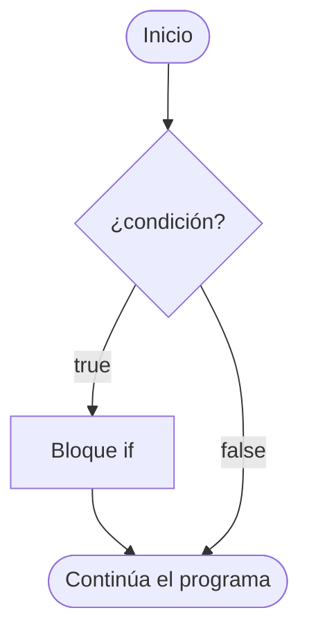
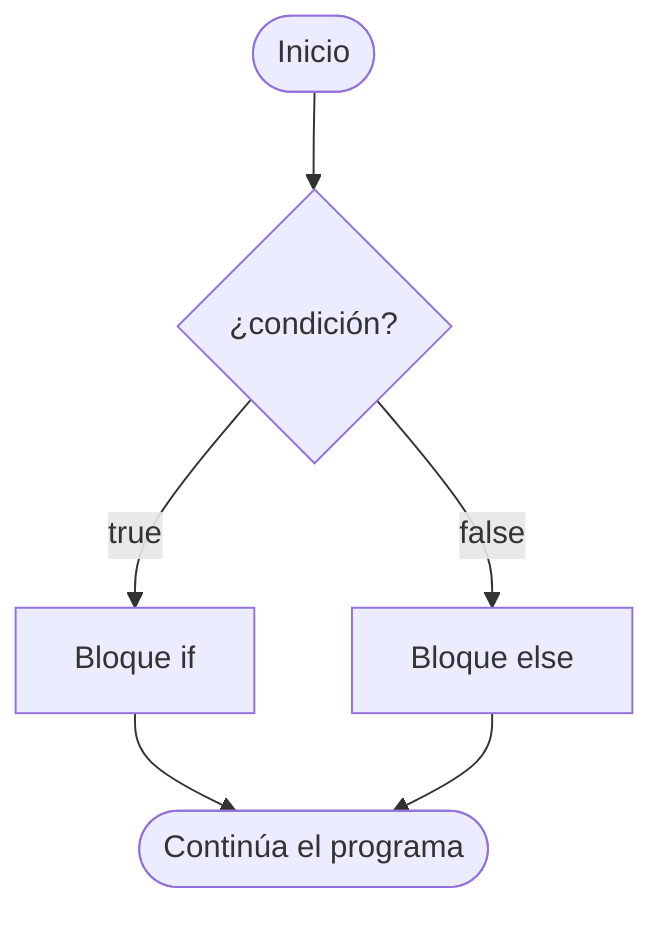

---
tags:
  - programacion
  - DAM1
unidad: 6
tema: Estructuras condicionales
---

# Unidad 6. Estructuras condicionales

> [!abstract] Objetivos de la unidad
> - Comprender el concepto de flujo de ejecución y los tipos de estructuras de control.
> - Utilizar las sentencias `if`, `if-else` e `if-else if-else` para tomar decisiones.
> - Construir condiciones anidadas y valorar su legibilidad.
> - Aplicar el operador ternario para asignaciones condicionales.
> - Emplear la sentencia `switch` en su forma clásica y en su forma mejorada.
> - Utilizar `switch` como expresión y la palabra reservada `yield`.
> - Seleccionar la estructura condicional más adecuada para cada situación.

---

## 1. El flujo de ejecución y las estructuras de control

> [!note] Definición: flujo de ejecución
> El **flujo de ejecución** es el orden en que se ejecutan las instrucciones de un programa. Por defecto, las instrucciones se ejecutan de forma **secuencial**: una tras otra, de arriba abajo.

Las **estructuras de control** permiten alterar ese orden secuencial. Se clasifican en tres tipos:

| Estructura | Funcionamiento | Sentencias en Java |
|---|---|---|
| **Secuencial** | Las instrucciones se ejecutan una detrás de otra. | Cualquier instrucción simple |
| **Condicional** (selectiva) | Se ejecuta un bloque u otro en función de una condición. | `if`, `if-else`, `switch`, operador ternario |
| **Repetitiva** (iterativa) | Un bloque se ejecuta varias veces mientras se cumpla una condición. | `while`, `do-while`, `for` (véase la [Unidad 7](07-bucles.md)) |

### 1.1. Condiciones

Una **condición** es una expresión que se evalúa a un valor **`boolean`** (`true` o `false`). Se construye habitualmente con los operadores de comparación y lógicos estudiados en la [Unidad 4](04-operadores.md):

```java
edad >= 18                      // condición simple
edad >= 18 && tieneDni          // condición compuesta
!esBloqueado                    // negación
usuario.equals("admin")         // método que devuelve boolean
```

### 1.2. Bloques de código

Un **bloque** es un conjunto de instrucciones delimitado por **llaves** `{ }`. Las estructuras de control actúan sobre bloques.

> [!info] Ámbito de las variables en un bloque
> Una variable declarada **dentro** de un bloque solo existe dentro de él; no puede utilizarse fuera. Este concepto (ámbito o *scope*) se desarrolla en la [Unidad 9](09-metodos.md).
> ```java
> if (edad >= 18) {
>     String mensaje = "Mayor de edad";
> }
> System.out.println(mensaje); // ERROR: mensaje no existe fuera del bloque
> ```

---

## 2. La sentencia `if`

### 2.1. Condicional simple

La sentencia `if` ejecuta un bloque de código **únicamente si la condición es verdadera**. Si es falsa, el bloque se omite y la ejecución continúa con la instrucción siguiente.

**Sintaxis:**

```java
if (condicion) {
    // Bloque que se ejecuta si la condición es verdadera
}
```



**Ejemplo:**

```java
public class EjemploIf {
    public static void main(String[] args) {
        int edad = 20;

        if (edad >= 18) {
            System.out.println("Eres mayor de edad.");
        }
        System.out.println("Fin del programa.");
    }
}
```

### 2.2. Condicional doble: `if-else`

La sentencia `if-else` ofrece **dos caminos alternativos**: uno si la condición es verdadera y otro si es falsa. Siempre se ejecuta **uno y solo uno** de los dos bloques.

**Sintaxis:**

```java
if (condicion) {
    // Bloque que se ejecuta si la condición es verdadera
} else {
    // Bloque que se ejecuta si la condición es falsa
}
```



**Ejemplo:**

```java
public class EjemploIfElse {
    public static void main(String[] args) {
        int edad = 16;

        if (edad >= 18) {
            System.out.println("Eres mayor de edad.");
        } else {
            System.out.println("Eres menor de edad.");
        }
    }
}
```

### 2.3. Condicional múltiple: `if-else if-else`

La sentencia `if-else if-else` permite evaluar **varias condiciones en secuencia**. Las condiciones se comprueban en orden, de arriba abajo:

- Se ejecuta el bloque de la **primera condición verdadera**, y el resto se ignora.
- Si ninguna condición es verdadera, se ejecuta el bloque `else` final (que es opcional).

**Sintaxis:**

```java
if (condicion1) {
    // Se ejecuta si condicion1 es verdadera
} else if (condicion2) {
    // Se ejecuta si condicion1 es falsa y condicion2 es verdadera
} else {
    // Se ejecuta si ninguna condición anterior es verdadera
}
```

**Ejemplo:** asignación de una calificación a partir de una nota numérica.

```java
public class Calificacion {
    public static void main(String[] args) {
        int nota = 85;

        if (nota >= 90) {
            System.out.println("Calificación: A");
        } else if (nota >= 80) {
            System.out.println("Calificación: B");
        } else if (nota >= 70) {
            System.out.println("Calificación: C");
        } else if (nota >= 60) {
            System.out.println("Calificación: D");
        } else {
            System.out.println("Calificación: F");
        }
    }
}
```

Con `nota = 85`, la primera condición (`85 >= 90`) es falsa y la segunda (`85 >= 80`) es verdadera: se muestra `Calificación: B` y no se evalúan las restantes.

> [!important] El orden de las condiciones es determinante
> Como solo se ejecuta la primera condición verdadera, el orden en que se escriben las condiciones afecta al resultado. En el ejemplo anterior, si la condición `nota >= 60` se colocara en primer lugar, **cualquier** nota igual o superior a 60 obtendría una `D`, y las condiciones siguientes nunca llegarían a cumplirse. Al trabajar con intervalos, las condiciones deben ordenarse de la más restrictiva a la menos restrictiva (o a la inversa, de forma coherente).

> [!tip] `else if` frente a varios `if` independientes
> Varios `if` consecutivos e independientes se evalúan **todos**, y pueden ejecutarse varios bloques. Con `else if`, en cambio, se ejecuta **como máximo uno**. Cuando las condiciones son mutuamente excluyentes, `else if` es más correcto y más eficiente.

### 2.4. Condicionales anidadas

Una estructura condicional puede contener otra en su interior. Se habla entonces de **condicionales anidadas**. Son útiles cuando una decisión solo tiene sentido si previamente se ha cumplido otra:

```java
int edad = 25;
boolean tieneCarnet = false;

if (edad >= 18) {
    if (tieneCarnet) {
        System.out.println("Puede conducir.");
    } else {
        System.out.println("Es mayor de edad, pero necesita el carnet.");
    }
} else {
    System.out.println("Es menor de edad: no puede conducir.");
}
```

> [!tip] Legibilidad de las condicionales anidadas
> Un anidamiento excesivo dificulta la lectura del código. Cuando es posible, conviene simplificarlo combinando condiciones con operadores lógicos:
> ```java
> if (edad >= 18 && tieneCarnet) {
>     System.out.println("Puede conducir.");
> }
> ```

### 2.5. Consideraciones sintácticas

> [!warning] Llaves opcionales
> Si el bloque de un `if` o un `else` contiene **una sola instrucción**, las llaves pueden omitirse. Sin embargo, se recomienda **utilizarlas siempre**, ya que su omisión es una fuente habitual de errores:
> ```java
> if (edad >= 18)
>     System.out.println("Mayor de edad");
>     System.out.println("Puede votar"); // se ejecuta SIEMPRE: no pertenece al if
> ```

> [!danger] Punto y coma tras la condición
> Un punto y coma inmediatamente después de la condición termina la sentencia `if` con una instrucción vacía, de modo que el bloque posterior se ejecuta **siempre**:
> ```java
> if (edad >= 18); {   // ERROR lógico
>     System.out.println("Mayor de edad");
> }
> ```

> [!warning] Comparación de cadenas en condiciones
> Para comparar el contenido de cadenas en una condición se utiliza `equals()`, nunca `==` (véase la [Unidad 3](03-cadenas-de-texto.md)):
> ```java
> if (usuario.equals("admin") && password.equals("1234")) { ... }
> ```

> [!tip] Variables booleanas como condición
> Una variable `boolean` ya es una condición por sí misma, por lo que no es necesario compararla con `true`:
> ```java
> if (esActivo == true) { ... } // redundante
> if (esActivo) { ... }         // correcto
> if (!esActivo) { ... }        // en lugar de esActivo == false
> ```

---

## 3. El operador ternario

### 3.1. Concepto y sintaxis

El **operador ternario** es una forma concisa de expresar una estructura `if-else` en **una sola línea**. Es el único operador de Java que trabaja con **tres operandos** y resulta especialmente útil para **asignar un valor a una variable en función de una condición**.

**Sintaxis:**

```java
condicion ? expresion1 : expresion2;
```

| Elemento | Descripción |
|---|---|
| `condicion` | Expresión booleana que se evalúa. |
| `expresion1` | Valor que se devuelve si la condición es **verdadera**. |
| `expresion2` | Valor que se devuelve si la condición es **falsa**. |

La expresión completa se evalúa a un **valor**, por lo que normalmente se asigna a una variable o se utiliza directamente dentro de otra expresión.

### 3.2. Equivalencia con `if-else`

```java
// Con if-else
String mensaje;
if (edad >= 18) {
    mensaje = "Eres mayor de edad";
} else {
    mensaje = "Eres menor de edad";
}

// Con el operador ternario
String mensaje = (edad >= 18) ? "Eres mayor de edad" : "Eres menor de edad";
```

### 3.3. Ejemplos

**Determinar si un número es par o impar:**

```java
public class OperadorTernarioEjemplo {
    public static void main(String[] args) {
        var numero = 5;
        var resultado = (numero % 2 == 0) ? "Par" : "Impar";
        System.out.println("El número " + numero + " es " + resultado); // Impar
    }
}
```

**Inicializar una variable a partir de un valor lógico:**

```java
public class InicializarVariable {
    public static void main(String[] args) {
        boolean esActivo = true;
        String estado = esActivo ? "Activo" : "Inactivo";
        System.out.println("El estado es " + estado); // Activo
    }
}
```

**Uso dentro de otra expresión:**

```java
int cantidad = 3;
System.out.println("Tienes " + cantidad + (cantidad == 1 ? " mensaje" : " mensajes"));
```

### 3.4. Operador ternario anidado

Es posible encadenar varios operadores ternarios para evaluar condiciones sucesivas, de forma análoga a `if-else if-else`:

```java
public class CondicionAnidada {
    public static void main(String[] args) {
        var nota = 85;
        var calificacion = (nota >= 90) ? "A" :
                           (nota >= 80) ? "B" :
                           (nota >= 70) ? "C" :
                           (nota >= 60) ? "D" : "F";
        System.out.println("La calificación es " + calificacion); // B
    }
}
```

**Determinar si un número es positivo, negativo o cero:**

```java
var numero = -5;
var resultado = (numero > 0) ? "Positivo" : (numero < 0) ? "Negativo" : "Cero";
System.out.println("El número " + numero + " es " + resultado); // Negativo
```

> [!warning] Uso moderado del operador ternario
> - El operador ternario es adecuado para **asignaciones sencillas**. Si las expresiones son largas o hay más de dos o tres niveles de anidamiento, `if-else` o `switch` resultan más legibles.
> - Ambas expresiones deben devolver valores de **tipos compatibles**.
> - No debe utilizarse para ejecutar acciones (como imprimir), sino para **obtener valores**.

---

## 4. La sentencia `switch` clásica

### 4.1. Concepto

La sentencia **`switch`** permite **seleccionar uno de entre muchos bloques de código** en función del valor de una expresión. Resulta especialmente útil cuando se desea comparar una variable con **múltiples valores concretos**.

**Sintaxis:**

```java
switch (expresion) {
    case valor1:
        // Se ejecuta si expresion == valor1
        break;
    case valor2:
        // Se ejecuta si expresion == valor2
        break;
    // ...
    default:
        // Se ejecuta si ningún caso anterior coincide
}
```

| Elemento | Función |
|---|---|
| `switch (expresion)` | Expresión cuyo valor se compara con cada caso. |
| `case valor:` | Valor constante con el que se compara la expresión. |
| `break` | Finaliza la ejecución del `switch`. |
| `default` | Bloque opcional que se ejecuta si ningún caso coincide (equivale al `else` final). |

### 4.2. Ejemplo

```java
public class EjemploSwitch {
    public static void main(String[] args) {
        int diaSemana = 3;

        switch (diaSemana) {
            case 1:
                System.out.println("Lunes");
                break;
            case 2:
                System.out.println("Martes");
                break;
            case 3:
                System.out.println("Miércoles");
                break;
            case 4:
                System.out.println("Jueves");
                break;
            case 5:
                System.out.println("Viernes");
                break;
            case 6:
                System.out.println("Sábado");
                break;
            case 7:
                System.out.println("Domingo");
                break;
            default:
                System.out.println("Día inválido");
        }
    }
}
```

### 4.3. La importancia de `break`: la caída (*fall-through*)

Cuando el valor de la expresión coincide con un `case`, la ejecución comienza en ese punto y **continúa hasta encontrar un `break`** o el final del `switch`. Si se omite `break`, se ejecutan también los bloques de los casos siguientes, aunque su valor no coincida. Este comportamiento se denomina **caída** o ***fall-through***.

```java
int dia = 2;
switch (dia) {
    case 1:
        System.out.println("Lunes");
    case 2:
        System.out.println("Martes");
    case 3:
        System.out.println("Miércoles");
        break;
    default:
        System.out.println("Otro día");
}
```

Salida:

```
Martes
Miércoles
```

> [!danger] Olvidar `break`
> Omitir `break` de forma involuntaria es uno de los errores lógicos más habituales con `switch`: el compilador no lo detecta y el programa ejecuta código que no debería.

La caída puede aprovecharse **intencionadamente** para agrupar varios casos que comparten el mismo código:

```java
switch (mes) {
    case 12:
    case 1:
    case 2:
        System.out.println("Invierno");
        break;
    case 6:
    case 7:
    case 8:
        System.out.println("Verano");
        break;
    default:
        System.out.println("Primavera u otoño");
}
```

### 4.4. Tipos admitidos en `switch`

| Admitidos | No admitidos |
|---|---|
| `int`, `short`, `byte`, `char` (y sus clases envoltorio) | `long` |
| `String` (compara con `equals()`) | `double`, `float` |
| Enumeraciones (`enum`) | `boolean` |

> [!note] Limitación de `switch`
> Los `case` solo admiten **valores constantes** y comprueban la **igualdad**. Para evaluar **intervalos** o condiciones complejas (`nota >= 90`, `edad < 18 && ...`) se utiliza `if-else if-else`.

---

## 5. La sentencia `switch` mejorada

### 5.1. Sintaxis con flecha

Desde **Java 14**, la sentencia `switch` admite una sintaxis más concisa basada en la **flecha** (`->`), con las siguientes ventajas:

- **No requiere `break`**: no existe caída, solo se ejecuta el caso que coincide.
- Un mismo `case` puede agrupar **varios valores separados por comas**.

```java
public class DiaSemana {
    public static void main(String[] args) {
        var dia = 1; // 1 - Lunes, 2 - Martes, etc.

        switch (dia) {
            case 1 -> System.out.println("Lunes");
            case 2 -> System.out.println("Martes");
            case 3 -> System.out.println("Miércoles");
            case 4 -> System.out.println("Jueves");
            case 5 -> System.out.println("Viernes");
            case 6, 7 -> System.out.println("Fin de semana");
            default -> System.out.println("Día inválido: " + dia);
        }
    }
}
```

> [!info] Varias instrucciones en un caso
> Si un caso debe ejecutar más de una instrucción, estas se agrupan en un bloque con llaves:
> ```java
> case 6, 7 -> {
>     System.out.println("Fin de semana");
>     System.out.println("¡A descansar!");
> }
> ```

### 5.2. `switch` como expresión

En su forma mejorada, `switch` puede utilizarse como una **expresión**: cada caso **devuelve un valor**, y el resultado del `switch` completo se asigna directamente a una variable. En este caso, la sentencia termina con **punto y coma** tras la llave de cierre.

```java
import java.util.Scanner;

public class SistemaCalificaciones {
    public static void main(String[] args) {
        Scanner consola = new Scanner(System.in);
        System.out.print("Proporciona una calificación entre 0 y 10: ");
        var calificacion = Integer.parseInt(consola.nextLine());

        var calificacionLetra = switch (calificacion) {
            case 9, 10 -> "A";
            case 8 -> "B";
            case 7 -> "C";
            case 6 -> "D";
            case 0, 1, 2, 3, 4, 5 -> "F";
            default -> "Calificación incorrecta";
        };

        System.out.printf("Calificación %d es equivalente a %s%n", calificacion, calificacionLetra);
    }
}
```

> [!important] Exhaustividad
> Una expresión `switch` debe ser **exhaustiva**: tiene que devolver un valor para **cualquier** valor posible de la expresión. Con tipos como `int` o `String`, esto obliga a incluir un caso **`default`**; de lo contrario, se produce un error de compilación.

### 5.3. La palabra reservada `yield`

Cuando un caso de una expresión `switch` necesita ejecutar **varias instrucciones** antes de devolver su valor, se utiliza un bloque con llaves, y el valor se devuelve mediante la palabra reservada **`yield`**.

> [!note] Definición: `yield`
> **`yield`** se utiliza dentro de una expresión `switch` para **devolver un valor desde un caso** que contiene un bloque de código. En el `switch` clásico, los casos no devuelven valores, solo ejecutan código; con `yield`, cada caso puede producir un valor que se asigna al resultado del `switch`.

La sintaxis mejorada de `switch` se introdujo como característica preliminar en **Java 12** y se incorporó de forma definitiva en **Java 14**.

```java
import java.util.Scanner;

public class CalificacionesYield {
    public static void main(String[] args) {
        Scanner consola = new Scanner(System.in);
        System.out.print("Proporciona una calificación entre 0 y 10: ");
        var calificacion = Integer.parseInt(consola.nextLine());

        var calificacionLetra = switch (calificacion) {
            case 9, 10 -> "A";
            case 8 -> "B";
            case 7 -> "C";
            case 6 -> "D";
            case 0, 1, 2, 3, 4, 5 -> "F";
            default -> {
                System.out.println("Se ingresó una calificación inválida");
                yield "Calificación incorrecta";
            }
        };

        System.out.printf("Calificación %d es equivalente a %s%n", calificacion, calificacionLetra);
    }
}
```

> [!info] `yield` frente a `return`
> - **`yield`** devuelve un valor desde un caso de una expresión `switch`; la ejecución continúa después del `switch`.
> - **`return`** finaliza un **método** completo (véase la [Unidad 9](09-metodos.md)).

### 5.4. Beneficios de `yield` y de las expresiones `switch`

1. **Concisión y claridad:** permite escribir `switch` más breves y legibles, eliminando la necesidad de variables temporales que se asignan en cada caso.
2. **Menos errores:** elimina la posibilidad de olvidar `break`, que en el `switch` clásico provoca errores lógicos.
3. **Flexibilidad:** permite devolver valores directamente desde los casos, lo que facilita la asignación de resultados a variables.

### 5.5. Comparativa de las formas de `switch`

| Característica | `switch` clásico | `switch` mejorado (sentencia) | `switch` como expresión |
|---|---|---|---|
| Separador | `:` | `->` | `->` |
| Requiere `break` | Sí | No | No |
| Caída (*fall-through*) | Sí | No | No |
| Varios valores por caso | Mediante caída | `case 1, 2 ->` | `case 1, 2 ->` |
| Devuelve un valor | No | No | Sí |
| `default` obligatorio | No | No | Sí (si no es exhaustivo) |
| Bloques con valor | — | — | `yield` |

---

## 6. Selección de la estructura adecuada

| Situación | Estructura recomendada |
|---|---|
| Ejecutar código solo si se cumple una condición | `if` |
| Elegir entre dos alternativas | `if-else` |
| Asignar uno de dos valores según una condición sencilla | Operador ternario |
| Evaluar **intervalos** o condiciones complejas | `if-else if-else` |
| Comparar una variable con **valores concretos** | `switch` |
| Obtener un valor a partir de valores concretos | `switch` como expresión |

---

## 7. Ejemplo integrador: tarifa de aparcamiento

El siguiente programa calcula el importe de un aparcamiento según el tipo de vehículo y las horas de estancia, combinando las estructuras de la unidad:

```java
import java.util.Scanner;

public class TarifaAparcamiento {
    public static void main(String[] args) {
        Scanner consola = new Scanner(System.in);

        System.out.print("Tipo de vehículo (moto, coche, furgoneta): ");
        var tipo = consola.nextLine().trim().toLowerCase();

        System.out.print("Horas de estancia: ");
        var horas = Integer.parseInt(consola.nextLine());

        System.out.print("¿Es residente? (true/false): ");
        var esResidente = Boolean.parseBoolean(consola.nextLine());

        // switch como expresión: tarifa por hora según el vehículo
        var tarifaHora = switch (tipo) {
            case "moto" -> 0.80;
            case "coche" -> 1.50;
            case "furgoneta" -> 2.20;
            default -> {
                System.out.println("Tipo de vehículo no reconocido: se aplica la tarifa de coche.");
                yield 1.50;
            }
        };

        double importe;
        if (horas <= 0) {
            importe = 0;
            System.out.println("Número de horas no válido.");
        } else if (horas <= 12) {
            importe = horas * tarifaHora;
        } else {
            importe = 12 * tarifaHora; // a partir de 12 horas, tarifa máxima diaria
        }

        // Operador ternario: descuento para residentes
        var descuento = esResidente ? 0.5 : 0.0;
        importe -= importe * descuento;

        System.out.printf("Importe a pagar: %.2f€%n", importe);
    }
}
```

---

## 8. Resumen de la unidad

> [!summary] Ideas clave
> - Las **estructuras condicionales** alteran el flujo secuencial ejecutando un bloque u otro según una **condición booleana**.
> - **`if`** ejecuta un bloque si la condición es verdadera; **`if-else`** elige entre dos caminos; **`if-else if-else`** evalúa varias condiciones en orden y ejecuta solo la **primera verdadera**.
> - En las condiciones múltiples, el **orden** de las condiciones determina el resultado.
> - Se recomienda utilizar **siempre llaves** y comparar cadenas con **`equals()`**.
> - El **operador ternario** (`condicion ? valor1 : valor2`) es una forma concisa de asignar un valor según una condición.
> - El **`switch` clásico** compara una expresión con valores constantes y necesita **`break`** para evitar la caída.
> - El **`switch` mejorado** (`->`) no requiere `break` y admite varios valores por caso.
> - Como **expresión**, `switch` devuelve un valor, debe ser **exhaustivo** y utiliza **`yield`** en los casos con bloque.
> - `switch` sirve para **valores concretos**; los **intervalos** se evalúan con `if-else if-else`.

---

**Navegación:** Anterior: [Unidad 5. Entrada y salida](05-entrada-y-salida.md) · [Índice](00-indice.md) · Siguiente: [Unidad 7. Bucles](07-bucles.md)
