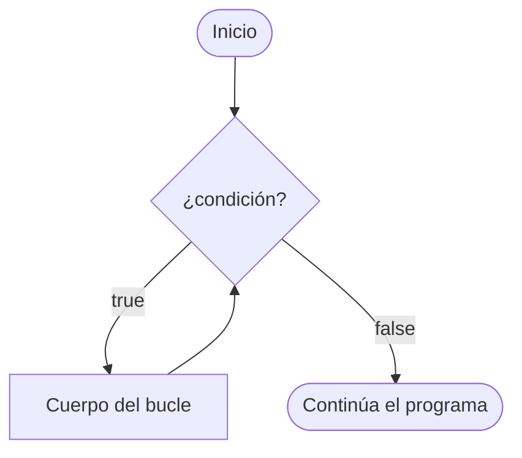
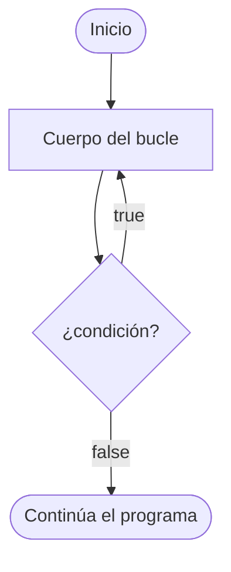
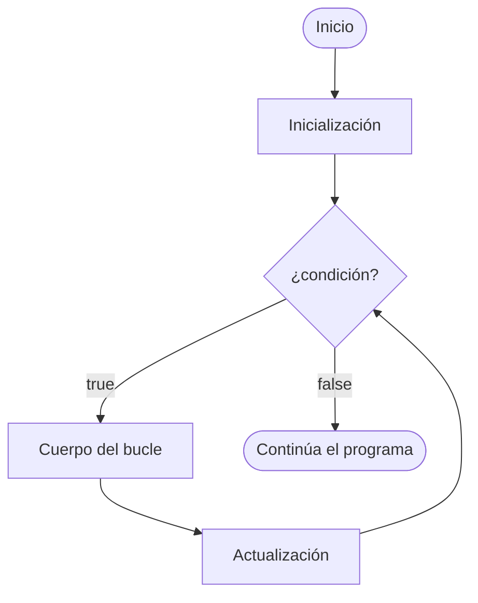

---
tags:
  - java
  - programacion
  - dam1
unidad: 7
tema: Bucles
---

# Unidad 7. Bucles

> [!abstract] Objetivos de la unidad
> - Comprender el concepto de estructura repetitiva y sus elementos.
> - Utilizar los bucles `while`, `do-while`, `for` y `for-each`.
> - Seleccionar el tipo de bucle más adecuado para cada situación.
> - Construir bucles anidados y analizar su funcionamiento.
> - Controlar la ejecución de un bucle mediante `break` y `continue`.
> - Aplicar los patrones algorítmicos básicos: contador, acumulador, bandera, máximo y mínimo.
> - Identificar y evitar los errores más frecuentes: bucles infinitos y errores de límite.

---

## 1. Concepto de bucle

> [!note] Definiciones
> - **Bucle** (*loop*): estructura de control que permite **ejecutar un bloque de código varias veces**, mientras se cumpla una condición.
> - **Iteración:** cada una de las ejecuciones del cuerpo del bucle.
> - **Cuerpo del bucle:** bloque de instrucciones que se repite.

Los bucles son esenciales para realizar **tareas repetitivas**, como recorrer conjuntos de datos, contar elementos, acumular valores o solicitar datos al usuario hasta que sean válidos. Sin ellos, habría que escribir la misma instrucción tantas veces como se deseara repetir.

### 1.1. Elementos de un bucle

Todo bucle bien construido consta de cuatro elementos:

| Elemento | Función | Ejemplo |
|---|---|---|
| **Inicialización** | Asigna el valor inicial a la variable de control. | `int i = 0;` |
| **Condición** | Expresión booleana que determina si se ejecuta una nueva iteración. | `i < 5` |
| **Cuerpo** | Instrucciones que se repiten. | `System.out.println(i);` |
| **Actualización** | Modifica la variable de control para que, en algún momento, la condición deje de cumplirse. | `i++` |

> [!note] Definición: variable de control
> La **variable de control** es la variable cuyo valor se evalúa en la condición del bucle y se modifica en cada iteración. Por convención, cuando actúa como contador suele denominarse `i`, `j` o `k`.

### 1.2. Tipos de bucles en Java

| Bucle | Característica principal |
|---|---|
| `while` | Evalúa la condición **antes** de cada iteración; puede ejecutarse **cero** veces. |
| `do-while` | Evalúa la condición **después** de cada iteración; se ejecuta **al menos una** vez. |
| `for` | Reúne inicialización, condición y actualización en una sola línea; indicado cuando se conoce el número de iteraciones. |
| `for-each` | Recorre todos los elementos de un array o colección. |

---

## 2. El bucle `while`

### 2.1. Sintaxis y funcionamiento

El bucle **`while`** («mientras») repite el bloque de código **mientras la condición sea verdadera**. La condición se evalúa **antes** de cada iteración.

```java
while (condicion) {
    // Bloque de código que se repite
}
```



### 2.2. Ejemplo

```java
public class EjemploWhile {
    public static void main(String[] args) {
        int i = 0;                 // inicialización
        while (i < 5) {            // condición
            System.out.println(i); // cuerpo
            i++;                   // actualización
        }
    }
}
```

Salida:

```
0
1
2
3
4
```

**Traza de ejecución:**

| Iteración | Valor de `i` | `i < 5` | Acción |
|:---:|:---:|:---:|---|
| 1 | 0 | `true` | Imprime 0; `i` pasa a 1 |
| 2 | 1 | `true` | Imprime 1; `i` pasa a 2 |
| 3 | 2 | `true` | Imprime 2; `i` pasa a 3 |
| 4 | 3 | `true` | Imprime 3; `i` pasa a 4 |
| 5 | 4 | `true` | Imprime 4; `i` pasa a 5 |
| — | 5 | `false` | Finaliza el bucle |

> [!info] Cero iteraciones
> Como la condición se evalúa antes de la primera iteración, si es falsa desde el principio, el cuerpo del `while` **no se ejecuta ninguna vez**.
> ```java
> int i = 10;
> while (i < 5) {
>     System.out.println(i); // nunca se ejecuta
> }
> ```

### 2.3. Uso típico

El bucle `while` es adecuado cuando **no se conoce de antemano el número de iteraciones**, y la repetición depende de una condición que cambia durante la ejecución (por ejemplo, leer líneas de un fichero hasta que no queden más, como se verá en la [Unidad 15](15-lectura-y-escritura-de-ficheros.md)).

```java
// ¿Cuántas veces hay que dividir entre 2 para llegar a 1?
int numero = 100;
int divisiones = 0;
while (numero > 1) {
    numero /= 2;
    divisiones++;
}
System.out.println("Divisiones necesarias: " + divisiones); // 6
```

### 2.4. Bucles infinitos

> [!danger] Bucle infinito
> Un **bucle infinito** es aquel cuya condición **nunca llega a ser falsa**, de modo que el programa no termina. Suele deberse a que se ha olvidado la actualización de la variable de control o a que esta no se modifica en el sentido adecuado.
> ```java
> int i = 0;
> while (i < 5) {
>     System.out.println(i);
>     // falta i++ → i siempre vale 0
> }
> ```
> En el IDE, un programa atrapado en un bucle infinito puede detenerse con el botón **Stop** (cuadrado rojo).

---

## 3. El bucle `do-while`

### 3.1. Sintaxis y funcionamiento

El bucle **`do-while`** («hacer… mientras») es una variante del `while` en la que la condición se evalúa **al final** de cada iteración. En consecuencia, el cuerpo se ejecuta **como mínimo una vez**.

```java
do {
    // Bloque de código que se repite
} while (condicion);
```



> [!warning] Punto y coma final
> A diferencia de `while`, la sintaxis de `do-while` termina con **punto y coma** después de la condición: `} while (condicion);`. Omitirlo produce un error de compilación.

### 3.2. Diferencia con `while`

```java
int i = 10;

while (i < 5) {
    System.out.println("while: " + i);   // no se ejecuta
}

do {
    System.out.println("do-while: " + i); // se ejecuta una vez: imprime 10
} while (i < 5);
```

### 3.3. Uso típico: validación de datos de entrada

El `do-while` es la estructura natural cuando una acción debe realizarse **al menos una vez** y repetirse **mientras el resultado no sea válido**. El caso más habitual es solicitar un dato al usuario hasta que cumpla una condición:

```java
import java.util.Scanner;

public class ValidacionEntrada {
    public static void main(String[] args) {
        Scanner consola = new Scanner(System.in);
        int numero;

        do {
            System.out.print("Introduce un número positivo: ");
            numero = Integer.parseInt(consola.nextLine());
        } while (numero <= 0);

        System.out.println("Número válido: " + numero);
    }
}
```

> [!info] Declaración de la variable fuera del bucle
> En el ejemplo, `numero` se declara **antes** del `do`, porque se utiliza en la condición del `while`. Si se declarara dentro del bloque, no sería accesible en la condición, ya que esta queda fuera de su ámbito.

---

## 4. El bucle `for`

### 4.1. Sintaxis y funcionamiento

El bucle **`for`** reúne en una sola línea la **inicialización**, la **condición** y la **actualización**. Es la elección natural cuando se conoce de antemano el **número de iteraciones**.

```java
for (sentencia1; sentencia2; sentencia3) {
    // Código a ejecutar
}
```

| Sentencia | Función | Momento de ejecución |
|---|---|---|
| **Sentencia 1** (inicialización) | Declara e inicializa la variable de control. | **Una sola vez**, antes de la primera iteración. |
| **Sentencia 2** (condición) | Define la condición para ejecutar el bloque. | **Antes de cada** iteración. |
| **Sentencia 3** (actualización) | Modifica la variable de control. | **Después de cada** iteración. |



### 4.2. Ejemplos

**Contar de 0 a 4:**

```java
for (int i = 0; i < 5; i++) {
    System.out.println(i);
}
```

**Contar de 2 en 2** (números pares entre 0 y 10):

```java
for (int i = 0; i <= 10; i = i + 2) { // equivalente a i += 2
    System.out.println(i);
}
```

**Cuenta atrás:**

```java
for (int i = 10; i > 0; i--) {
    System.out.println(i);
}
System.out.println("¡Despegue!");
```

### 4.3. Equivalencia entre `for` y `while`

Todo bucle `for` puede reescribirse como un `while`, y viceversa:

```java
// Bucle for
for (int i = 0; i < 5; i++) {
    System.out.println(i);
}

// Bucle while equivalente
int i = 0;
while (i < 5) {
    System.out.println(i);
    i++;
}
```

> [!info] Ámbito de la variable de control
> La variable declarada en la inicialización de un `for` **solo existe dentro del bucle**. Una vez finalizado, no puede utilizarse:
> ```java
> for (int i = 0; i < 5; i++) { ... }
> System.out.println(i); // ERROR: i no existe fuera del for
> ```

> [!warning] Errores de límite (*off-by-one*)
> Un error muy frecuente consiste en ejecutar una iteración de más o de menos por elegir mal el operador de la condición:
> - `for (int i = 0; i < 5; i++)` → 5 iteraciones (0, 1, 2, 3, 4).
> - `for (int i = 0; i <= 5; i++)` → 6 iteraciones (0, 1, 2, 3, 4, 5).
> - `for (int i = 1; i <= 5; i++)` → 5 iteraciones (1, 2, 3, 4, 5).

> [!danger] Punto y coma tras el `for`
> Un punto y coma después del paréntesis crea un bucle con un cuerpo vacío, y el bloque posterior se ejecuta **una sola vez** tras el bucle:
> ```java
> for (int i = 0; i < 5; i++); { // ERROR lógico
>     System.out.println("Hola");
> }
> ```

---

## 5. El bucle `for-each`

### 5.1. Sintaxis

El bucle **`for-each`** (también llamado *for mejorado*) es la forma más legible de **recorrer todos los elementos** de un array o de una colección, sin necesidad de gestionar índices.

```java
for (tipo variable : nombreArray) {
    // Bloque de código
}
```

Los dos puntos (`:`) se leen como «**en**». Así, el bucle se interpreta como: «**para cada** *variable* **en** el *array*».

### 5.2. Ejemplo

```java
String[] coches = {"Volvo", "BMW", "Ford", "Mazda"};

for (String coche : coches) {
    System.out.println(coche);
}
```

Significado: *para cada `String` del array `coches` (denominado `coche` en cada iteración), imprime su valor*.

> [!note] Limitaciones del `for-each`
> - **No proporciona el índice** del elemento actual.
> - Recorre los elementos siempre del **primero al último**.
> - La variable del bucle es una **copia** del elemento: asignarle un nuevo valor no modifica el array.
>
> Cuando se necesita el índice, recorrer en otro orden o modificar los elementos, se utiliza el `for` clásico. Los arrays se estudian en detalle en la [Unidad 8](08-arrays.md).

---

## 6. Bucles anidados

### 6.1. Concepto

Un **bucle anidado** es un bucle situado dentro del cuerpo de otro. Por **cada iteración** del bucle exterior, el bucle interior se ejecuta **completo**. Por tanto, el número total de ejecuciones del cuerpo interior es el producto de las iteraciones de ambos bucles.

```java
// Bucle exterior
for (int i = 1; i <= 2; i++) {
    System.out.println("Exterior: " + i);    // se ejecuta 2 veces

    // Bucle interior
    for (int j = 1; j <= 3; j++) {
        System.out.println("  Interior: " + j); // se ejecuta 6 veces (2 × 3)
    }
}
```

Salida:

```
Exterior: 1
  Interior: 1
  Interior: 2
  Interior: 3
Exterior: 2
  Interior: 1
  Interior: 2
  Interior: 3
```

> [!tip] Variables de control distintas
> Cada bucle anidado debe utilizar su **propia variable de control** (`i`, `j`, `k`…). Reutilizar la misma variable en ambos bucles altera el funcionamiento del exterior.

### 6.2. Ejemplo: tablas de multiplicar

```java
public class TablasMultiplicar {
    public static void main(String[] args) {
        for (int i = 1; i <= 3; i++) {
            for (int j = 1; j <= 5; j++) {
                System.out.print(i + "x" + j + " = " + (i * j) + "  ");
            }
            System.out.println(); // salto de línea al terminar cada fila
        }
    }
}
```

Salida:

```
1x1 = 1  1x2 = 2  1x3 = 3  1x4 = 4  1x5 = 5  
2x1 = 2  2x2 = 4  2x3 = 6  2x4 = 8  2x5 = 10  
3x1 = 3  3x2 = 6  3x3 = 9  3x4 = 12  3x5 = 15  
```

> [!info] Uso de `print` y `println` en bucles anidados
> El bucle interior utiliza `print` para escribir los resultados **en la misma línea**, y al terminar, `println()` provoca el **salto de línea** que da paso a la siguiente fila. Esta técnica es la base para dibujar tablas y figuras en la consola, y para recorrer matrices (véase la [Unidad 8](08-arrays.md)).

---

## 7. Sentencias de control de bucles: `break` y `continue`

### 7.1. `break`

La sentencia **`break`**, además de utilizarse en `switch`, permite **finalizar un bucle de forma inmediata**, sin esperar a que la condición sea falsa. La ejecución continúa en la primera instrucción posterior al bucle.

```java
// Buscar el primer múltiplo de 7 mayor que 50
for (int i = 51; i <= 100; i++) {
    if (i % 7 == 0) {
        System.out.println("Primer múltiplo de 7: " + i); // 56
        break; // no es necesario seguir buscando
    }
}
```

### 7.2. `continue`

La sentencia **`continue`** **omite el resto de la iteración actual** y pasa directamente a la siguiente (evaluando de nuevo la condición).

```java
// Mostrar solo los números impares del 1 al 10
for (int i = 1; i <= 10; i++) {
    if (i % 2 == 0) {
        continue; // salta los pares
    }
    System.out.println(i);
}
```

> [!warning] Uso moderado
> `break` y `continue` son útiles, pero su abuso dificulta seguir el flujo del programa. En bucles anidados, `break` y `continue` solo afectan al **bucle más interno** que los contiene.

---

## 8. Patrones algorítmicos con bucles

Existen una serie de **patrones** que aparecen de forma recurrente en la resolución de problemas con bucles.

### 8.1. Contador

Un **contador** es una variable que se **incrementa en una cantidad fija** (normalmente 1) cada vez que ocurre un suceso. Se inicializa a 0 antes del bucle.

```java
int contadorPares = 0;
for (int i = 1; i <= 20; i++) {
    if (i % 2 == 0) {
        contadorPares++;
    }
}
System.out.println("Números pares: " + contadorPares); // 10
```

### 8.2. Acumulador

Un **acumulador** es una variable que **acumula (suma o multiplica) valores variables** en cada iteración. Para sumas se inicializa a 0; para productos, a 1.

```java
int suma = 0;
for (int i = 1; i <= 100; i++) {
    suma += i;
}
System.out.println("Suma del 1 al 100: " + suma); // 5050

long factorial = 1;
for (int i = 1; i <= 5; i++) {
    factorial *= i;
}
System.out.println("5! = " + factorial); // 120
```

> [!tip] Cálculo de la media
> La media se obtiene combinando un acumulador (suma) y un contador (número de elementos). Hay que recordar convertir a `double` para evitar la división entera (véase la [Unidad 4](04-operadores.md)):
> ```java
> double media = (double) suma / contador;
> ```

### 8.3. Bandera (*flag*)

Una **bandera** es una variable `boolean` que indica si se ha producido una determinada situación durante la ejecución del bucle. Se inicializa con un valor y cambia cuando ocurre el suceso.

```java
// Comprobar si un número es primo
int numero = 29;
boolean esPrimo = true; // se supone primo hasta encontrar un divisor

for (int i = 2; i < numero; i++) {
    if (numero % i == 0) {
        esPrimo = false; // se ha encontrado un divisor
        break;
    }
}
System.out.println(numero + (esPrimo ? " es primo" : " no es primo"));
```

### 8.4. Máximo y mínimo

Para obtener el mayor o el menor de una serie de valores, se guarda el valor más grande (o más pequeño) encontrado hasta el momento y se compara con cada nuevo valor.

```java
import java.util.Random;

public class MaximoMinimo {
    public static void main(String[] args) {
        var random = new Random();

        int primero = random.nextInt(100) + 1;
        int maximo = primero; // se inicializan con el primer valor
        int minimo = primero;

        for (int i = 2; i <= 10; i++) {
            int valor = random.nextInt(100) + 1;
            if (valor > maximo) {
                maximo = valor;
            }
            if (valor < minimo) {
                minimo = valor;
            }
        }
        System.out.println("Máximo: " + maximo + " - Mínimo: " + minimo);
    }
}
```

> [!tip] Inicialización del máximo y el mínimo
> Se recomienda inicializar ambas variables con el **primer valor** de la serie. Otra alternativa es utilizar las constantes `Integer.MIN_VALUE` (para el máximo) e `Integer.MAX_VALUE` (para el mínimo).

### 8.5. Menú de opciones

Un patrón muy habitual en aplicaciones de consola combina **`do-while`** y **`switch`** para mostrar un menú repetidamente hasta que el usuario elige salir:

```java
import java.util.Scanner;

public class Menu {
    public static void main(String[] args) {
        Scanner consola = new Scanner(System.in);
        int opcion;

        do {
            System.out.println("""
                    
                    ===== MENÚ =====
                    1. Saludar
                    2. Mostrar la hora del sistema
                    0. Salir""");
            System.out.print("Elige una opción: ");
            opcion = Integer.parseInt(consola.nextLine());

            switch (opcion) {
                case 1 -> System.out.println("¡Hola!");
                case 2 -> System.out.println("Milisegundos: " + System.currentTimeMillis());
                case 0 -> System.out.println("Hasta pronto.");
                default -> System.out.println("Opción no válida.");
            }
        } while (opcion != 0);
    }
}
```

---

## 9. Selección del bucle adecuado

| Situación | Bucle recomendado |
|---|---|
| Se conoce el número de iteraciones | `for` |
| El número de iteraciones depende de una condición que puede no cumplirse desde el inicio | `while` |
| El bloque debe ejecutarse al menos una vez (validaciones, menús) | `do-while` |
| Recorrer todos los elementos de un array o colección sin necesitar el índice | `for-each` |

---

## 10. Ejemplo integrador: adivinar un número

El siguiente programa genera un número secreto entre 1 y 100 y ofrece al usuario un número limitado de intentos para adivinarlo, indicándole en cada intento si el número secreto es mayor o menor. Combina `Random`, `Scanner`, un bucle con bandera, un contador y estructuras condicionales.

```java
import java.util.Random;
import java.util.Scanner;

public class AdivinarNumero {
    public static void main(String[] args) {
        final int MAX_INTENTOS = 7;

        var random = new Random();
        var consola = new Scanner(System.in);

        int numeroSecreto = random.nextInt(100) + 1;
        int intentos = 0;           // contador
        boolean acertado = false;   // bandera

        System.out.println("He pensado un número entre 1 y 100. Tienes " + MAX_INTENTOS + " intentos.");

        while (!acertado && intentos < MAX_INTENTOS) {
            System.out.print("Intento " + (intentos + 1) + ": ");
            int propuesta = Integer.parseInt(consola.nextLine());
            intentos++;

            if (propuesta == numeroSecreto) {
                acertado = true;
            } else if (propuesta < numeroSecreto) {
                System.out.println("El número secreto es MAYOR.");
            } else {
                System.out.println("El número secreto es MENOR.");
            }
        }

        if (acertado) {
            System.out.printf("¡Correcto! Lo has adivinado en %d intentos.%n", intentos);
        } else {
            System.out.println("Sin intentos. El número era " + numeroSecreto + ".");
        }
    }
}
```

---

## 11. Resumen de la unidad

> [!summary] Ideas clave
> - Un **bucle** repite un bloque de código mientras se cumple una condición; cada repetición es una **iteración**.
> - Todo bucle requiere **inicialización**, **condición**, **cuerpo** y **actualización**; si falta la actualización, se produce un **bucle infinito**.
> - **`while`** evalúa la condición antes de cada iteración y puede ejecutarse cero veces.
> - **`do-while`** evalúa la condición al final y se ejecuta al menos una vez; es idóneo para validar datos y construir menús.
> - **`for`** reúne inicialización, condición y actualización; se utiliza cuando se conoce el número de iteraciones.
> - **`for-each`** recorre todos los elementos de un array o colección sin gestionar índices.
> - En los **bucles anidados**, el bucle interior se ejecuta completo en cada iteración del exterior.
> - **`break`** finaliza el bucle; **`continue`** salta a la siguiente iteración.
> - Los patrones básicos son el **contador**, el **acumulador**, la **bandera** y la búsqueda del **máximo** y el **mínimo**.

---

**Navegación:** Anterior: [Unidad 6. Estructuras condicionales](06-estructuras-condicionales.md) · [Índice](00-indice.md) · Siguiente: [Unidad 8. Arrays](08-arrays.md)
