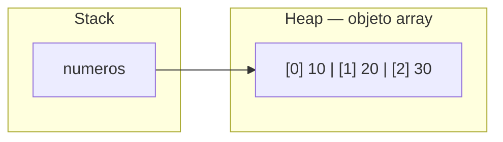
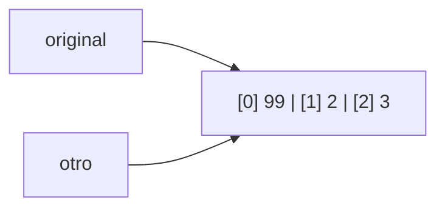

---
tags:
  - programacion
  - DAM1
unidad: 8
tema: Arrays
---

# Unidad 8. Arrays

> [!abstract] Objetivos de la unidad
> - Comprender el concepto de array y sus características.
> - Declarar, crear e inicializar arrays unidimensionales.
> - Acceder a los elementos de un array y modificarlos mediante su índice.
> - Recorrer arrays con los bucles `for` y `for-each`.
> - Aplicar los algoritmos básicos sobre arrays: suma, media, máximo, mínimo y búsqueda.
> - Comprender cómo se almacenan los arrays en memoria y las implicaciones de ser un tipo de referencia.
> - Trabajar con arrays bidimensionales y de más dimensiones.
> - Conocer las limitaciones de los arrays y la alternativa que ofrece `ArrayList`.

---

## 1. Concepto de array

> [!note] Definición: array
> Un **array** (también llamado *arreglo* o *vector*) es una estructura de datos que permite **almacenar múltiples valores del mismo tipo en una sola variable**, en lugar de declarar una variable independiente para cada valor.

Sin arrays, almacenar las notas de treinta alumnos exigiría treinta variables (`nota1`, `nota2`, …, `nota30`). Con un array, basta con una única variable que agrupa todos los valores y permite procesarlos mediante bucles.

### 1.1. Características

| Característica | Descripción |
|---|---|
| **Homogéneo** | Todos los elementos son del **mismo tipo**. |
| **Tamaño fijo** | El número de elementos se establece al crearlo y **no puede modificarse** posteriormente. |
| **Indexado** | Cada elemento ocupa una posición identificada por un **índice** numérico, que comienza en **0**. |
| **Tipo de referencia** | Un array es un **objeto**: la variable almacena una referencia a él. |

### 1.2. Terminología

| Término | Significado |
|---|---|
| **Elemento** | Cada uno de los valores almacenados en el array. |
| **Índice** | Posición de un elemento dentro del array (de 0 a *n* − 1). |
| **Longitud** | Número total de elementos del array (*n*). |
| **Dimensión** | Número de índices necesarios para acceder a un elemento (1D, 2D, 3D…). |

---

## 2. Arrays unidimensionales

### 2.1. Declaración

Para declarar un array, se indica el tipo de sus elementos seguido de **corchetes** `[]` y el nombre de la variable:

```java
String[] coches;
int[] numeros;
```

> [!info] Sintaxis alternativa
> Java también admite la forma `int numeros[];`, heredada del lenguaje C. Sin embargo, se recomienda la forma `int[] numeros;`, que deja claro que el tipo de la variable es «array de enteros».

La declaración **no crea el array**: solo define una variable capaz de referenciarlo. Hasta que se cree, su valor es `null` (si es un atributo) o no está inicializada (si es una variable local).

### 2.2. Creación e inicialización

Existen tres formas de crear un array.

**1. Con valores iniciales (inicialización directa).** Los elementos se escriben entre llaves, separados por comas. El tamaño se deduce del número de elementos. Es la forma más habitual:

```java
String[] coches = {"Volvo", "BMW", "Ford", "Mazda"};
int[] numeros = {10, 20, 30, 40};
```

**2. Con `new` y un tamaño.** Se crea un array vacío con espacio para un número fijo de elementos, que se asignarán más tarde:

```java
String[] coches = new String[4]; // array de 4 posiciones

coches[0] = "Volvo";
coches[1] = "BMW";
coches[2] = "Ford";
coches[3] = "Mazda";
```

**3. Con `new` y valores iniciales.** Equivale a la primera forma, pero de manera explícita:

```java
String[] coches = new String[]{"Volvo", "BMW", "Ford", "Mazda"};
```

> [!tip] Cuándo usar cada forma
> - Si se conocen los valores en el momento de escribir el código: **inicialización directa** con llaves.
> - Si los valores se obtendrán durante la ejecución (por teclado, de un fichero, calculados): **`new` con tamaño**.

### 2.3. Valores por defecto

Al crear un array con `new tipo[tamaño]`, Java inicializa automáticamente todos sus elementos con el **valor por defecto** del tipo:

| Tipo de los elementos | Valor inicial |
|---|---|
| `byte`, `short`, `int`, `long` | `0` |
| `float`, `double` | `0.0` |
| `char` | `'\u0000'` |
| `boolean` | `false` |
| Tipos de referencia (`String`, objetos) | `null` |

```java
int[] edades = new int[3];       // {0, 0, 0}
boolean[] marcas = new boolean[2]; // {false, false}
String[] nombres = new String[2];  // {null, null}
```

### 2.4. Acceso a los elementos

Cada elemento se identifica por su **índice**, que se indica entre corchetes a continuación del nombre del array.

```java
String[] coches = {"Volvo", "BMW", "Ford", "Mazda"};
System.out.println(coches[0]); // Volvo
```

| Índice | Elemento |
|:---:|---|
| 0 | Volvo |
| 1 | BMW |
| 2 | Ford |
| 3 | Mazda |

**Modificación de un elemento:** se asigna un nuevo valor a la posición correspondiente.

```java
coches[1] = "Seat";
System.out.println(coches[1]); // Seat
```

### 2.5. Longitud: la propiedad `length`

La propiedad **`length`** devuelve el número de elementos del array:

```java
String[] coches = {"Volvo", "BMW", "Ford", "Mazda"};
System.out.println(coches.length); // 4
```

A partir de la longitud se deduce el rango de índices válidos: **de `0` a `length - 1`**. En particular, el último elemento se obtiene con `coches[coches.length - 1]`.

> [!warning] `length` sin paréntesis
> En los arrays, `length` es una **propiedad** y se escribe **sin paréntesis**. En las cadenas, en cambio, `length()` es un **método** y lleva paréntesis (véase la [Unidad 3](03-cadenas-de-texto.md)).

> [!danger] `ArrayIndexOutOfBoundsException`
> Acceder a un índice negativo o mayor o igual que `length` provoca esta excepción en tiempo de ejecución:
> ```java
> int[] numeros = {1, 2, 3};
> System.out.println(numeros[3]); // ERROR: los índices válidos son 0, 1 y 2
> ```

---

## 3. Recorrido de arrays

**Recorrer** un array consiste en acceder sucesivamente a cada uno de sus elementos. Es la operación más habitual con arrays y se realiza mediante bucles (véase la [Unidad 7](07-bucles.md)).

### 3.1. Con el bucle `for`

Se utiliza la propiedad `length` para indicar cuántas veces debe ejecutarse el bucle. La variable de control actúa como **índice**:

```java
String[] coches = {"Volvo", "BMW", "Ford", "Mazda"};

for (int i = 0; i < coches.length; i++) {
    System.out.println("Posición " + i + ": " + coches[i]);
}
```

> [!tip] Usar siempre `length` en la condición
> Escribir `i < coches.length` en lugar de un número fijo (`i < 4`) hace que el bucle funcione correctamente aunque cambie el tamaño del array.

### 3.2. Con el bucle `for-each`

Es la forma más legible cuando solo se necesitan los **valores** y no los índices:

```java
for (String coche : coches) {
    System.out.println(coche);
}
```

### 3.3. Comparativa

| Necesidad | Bucle adecuado |
|---|---|
| Leer todos los elementos, del primero al último | `for-each` |
| Conocer la posición (índice) de cada elemento | `for` |
| Modificar los elementos del array | `for` |
| Recorrer en orden inverso o saltando posiciones | `for` |
| Rellenar un array con valores | `for` |

> [!warning] El `for-each` no modifica el array
> En el `for-each`, la variable del bucle contiene una **copia** del valor del elemento. Asignarle un nuevo valor no altera el array:
> ```java
> int[] numeros = {1, 2, 3};
> for (int n : numeros) {
>     n = n * 2;             // modifica la copia, no el array
> }
> for (int i = 0; i < numeros.length; i++) {
>     numeros[i] = numeros[i] * 2; // correcto: modifica el array
> }
> ```

### 3.4. Mostrar el contenido de un array

Imprimir directamente un array no muestra sus elementos, sino una representación interna de su referencia:

```java
int[] numeros = {1, 2, 3};
System.out.println(numeros); // [I@1b6d3586 (tipo y código de la referencia)
```

Para mostrar su contenido, se recorre con un bucle o se utiliza el método `Arrays.toString()` (apartado 6).

---

## 4. Algoritmos básicos sobre arrays

Los patrones algorítmicos estudiados en la [Unidad 7](07-bucles.md) se aplican de forma natural a los arrays.

### 4.1. Suma y media de los elementos

```java
int[] numeros = {1, 5, 10, 25};
int suma = 0;

// Recorrer el array y acumular cada elemento
for (int i = 0; i < numeros.length; i++) {
    suma += numeros[i];
}

double media = (double) suma / numeros.length;

System.out.println("La suma es: " + suma);   // 41
System.out.println("La media es: " + media); // 10.25
```

### 4.2. Máximo y mínimo

```java
int[] temperaturas = {18, 23, 15, 27, 21};

int maxima = temperaturas[0]; // se inicializan con el primer elemento
int minima = temperaturas[0];

for (int i = 1; i < temperaturas.length; i++) {
    if (temperaturas[i] > maxima) {
        maxima = temperaturas[i];
    }
    if (temperaturas[i] < minima) {
        minima = temperaturas[i];
    }
}
System.out.println("Máxima: " + maxima + " - Mínima: " + minima); // 27 - 15
```

### 4.3. Búsqueda lineal

La **búsqueda lineal** (o secuencial) consiste en recorrer el array elemento a elemento hasta encontrar el valor buscado. Suele combinarse con una variable que almacena la posición encontrada, inicializada a `-1` para indicar «no encontrado»:

```java
String[] alumnos = {"Ana", "Luis", "Marta", "Pau"};
String buscado = "Marta";
int posicion = -1;

for (int i = 0; i < alumnos.length; i++) {
    if (alumnos[i].equals(buscado)) { // comparación de cadenas con equals()
        posicion = i;
        break; // no es necesario seguir buscando
    }
}

if (posicion != -1) {
    System.out.println(buscado + " está en la posición " + posicion); // 2
} else {
    System.out.println(buscado + " no se ha encontrado");
}
```

### 4.4. Contar elementos que cumplen una condición

```java
double[] notas = {6.5, 4.0, 8.2, 3.9, 7.0};
int aprobados = 0;

for (double nota : notas) {
    if (nota >= 5) {
        aprobados++;
    }
}
System.out.println("Aprobados: " + aprobados); // 3
```

### 4.5. Rellenar un array con datos introducidos por teclado

```java
import java.util.Scanner;

public class LecturaArray {
    public static void main(String[] args) {
        Scanner consola = new Scanner(System.in);
        int[] edades = new int[3];

        for (int i = 0; i < edades.length; i++) {
            System.out.print("Edad " + (i + 1) + ": ");
            edades[i] = Integer.parseInt(consola.nextLine());
        }

        for (int edad : edades) {
            System.out.println(edad);
        }
    }
}
```

---

## 5. Los arrays en memoria

### 5.1. El array como objeto

Un array es un **tipo de referencia**: la variable, almacenada en la *stack*, contiene la **dirección** del objeto array, que reside en la *heap*. Los elementos ocupan posiciones **contiguas** dentro de ese objeto.

```java
int[] numeros = {10, 20, 30};
```



### 5.2. Asignación entre arrays

Como la variable guarda una referencia, asignar un array a otra variable **no copia sus elementos**: ambas variables pasan a apuntar **al mismo array**. Cualquier modificación realizada a través de una de ellas se refleja en la otra.

```java
int[] original = {1, 2, 3};
int[] otro = original;   // no es una copia: comparten el mismo array

otro[0] = 99;
System.out.println(original[0]); // 99
```



> [!important] Copiar un array
> Para obtener una copia independiente, hay que crear un nuevo array y copiar sus elementos, ya sea con un bucle o con `Arrays.copyOf()`:
> ```java
> int[] copia = new int[original.length];
> for (int i = 0; i < original.length; i++) {
>     copia[i] = original[i];
> }
> ```

> [!warning] Comparar arrays
> Por el mismo motivo, el operador `==` aplicado a dos arrays compara **referencias**, no su contenido. Para comparar el contenido se utiliza `Arrays.equals()`.

---

## 6. La clase `Arrays`

La clase **`Arrays`**, del paquete **`java.util`**, proporciona métodos estáticos que simplifican las operaciones más habituales sobre arrays. Requiere la importación `import java.util.Arrays;`.

| Método | Descripción |
|---|---|
| `Arrays.toString(array)` | Devuelve una cadena con el contenido del array: `[1, 2, 3]`. |
| `Arrays.sort(array)` | Ordena el array de menor a mayor (o alfabéticamente). Modifica el array original. |
| `Arrays.copyOf(array, longitud)` | Devuelve una copia del array con la longitud indicada. |
| `Arrays.fill(array, valor)` | Asigna el mismo valor a todos los elementos. |
| `Arrays.equals(array1, array2)` | Devuelve `true` si ambos arrays tienen el mismo contenido. |

```java
import java.util.Arrays;

public class EjemploArrays {
    public static void main(String[] args) {
        int[] numeros = {40, 10, 30, 20};

        System.out.println(Arrays.toString(numeros)); // [40, 10, 30, 20]

        Arrays.sort(numeros);
        System.out.println(Arrays.toString(numeros)); // [10, 20, 30, 40]

        int[] copia = Arrays.copyOf(numeros, numeros.length);
        System.out.println(Arrays.equals(numeros, copia)); // true
        System.out.println(numeros == copia);              // false: arrays distintos

        int[] ceros = new int[5];
        Arrays.fill(ceros, 7);
        System.out.println(Arrays.toString(ceros)); // [7, 7, 7, 7, 7]
    }
}
```

> [!info] El parámetro `args` del método `main`
> El parámetro `String[] args` del método `main` es, precisamente, un **array de cadenas**. Contiene los argumentos que se pasan al programa cuando se ejecuta desde la terminal (por ejemplo, `java Programa uno dos` → `args = {"uno", "dos"}`).

---

## 7. Arrays bidimensionales (matrices)

### 7.1. Concepto

> [!note] Definición: array multidimensional
> Un **array multidimensional** es un array cuyos elementos son, a su vez, otros arrays. El caso más habitual es el **array bidimensional** o **matriz**, que permite almacenar datos organizados en una **tabla de filas y columnas**.

```java
int[][] miNumeros = { {1, 4, 2}, {3, 6, 8} };
```

| | Columna 0 | Columna 1 | Columna 2 |
|---|:---:|:---:|:---:|
| **Fila 0** | 1 | 4 | 2 |
| **Fila 1** | 3 | 6 | 8 |

Cada par de llaves interior representa una **fila**. El array exterior contiene dos elementos (las dos filas), y cada fila es un array de tres enteros.

### 7.2. Declaración y creación

```java
// Con valores iniciales
int[][] miNumeros = { {1, 4, 2}, {3, 6, 8} };

// Con new: 2 filas y 3 columnas, inicializado a 0
int[][] tabla = new int[2][3];
```

### 7.3. Acceso y modificación

Para acceder a un elemento se necesitan **dos índices**: el primero indica la **fila** y el segundo, la **columna**.

```java
int[][] miNumeros = { {1, 4, 2}, {3, 6, 8} };

System.out.println(miNumeros[1][2]); // 8 (fila 1, columna 2)
System.out.println(miNumeros[0][1]); // 4 (fila 0, columna 1)

// Modificación
miNumeros[1][2] = 9;
System.out.println(miNumeros[1][2]); // 9 en lugar de 8
```

> [!tip] Regla mnemotécnica
> `matriz[fila][columna]`: primero se desciende a la **fila** y después se avanza hasta la **columna**, como al localizar una celda en una hoja de cálculo.

### 7.4. Dimensiones: número de filas y columnas

- `matriz.length` → número de **filas**.
- `matriz[fila].length` → número de **columnas** de una fila determinada.

En Java, las filas de una matriz pueden tener **longitudes distintas** (se denominan *arrays irregulares* o *jagged arrays*), ya que cada fila es un array independiente:

```java
int[][] miNumeros = { {1, 4, 2}, {3, 6, 8, 5, 2} };

System.out.println("Filas: " + miNumeros.length);                // 2
System.out.println("Columnas en la fila 0: " + miNumeros[0].length); // 3
System.out.println("Columnas en la fila 1: " + miNumeros[1].length); // 5
```

### 7.5. Recorrido de una matriz

Para recorrer todos los elementos se utiliza un **bucle `for` dentro de otro** (bucles anidados): el exterior recorre las filas y el interior, las columnas de cada fila.

```java
int[][] miNumeros = { {1, 4, 2}, {3, 6, 8, 5, 2} };

for (int fila = 0; fila < miNumeros.length; fila++) {
    for (int col = 0; col < miNumeros[fila].length; col++) {
        System.out.println("miNumeros[" + fila + "][" + col + "] = " + miNumeros[fila][col]);
    }
}
```

> [!important] Condición del bucle interior
> En el bucle interior se utiliza `miNumeros[fila].length` y no `miNumeros[0].length`. De este modo, el recorrido es correcto aunque las filas tengan longitudes distintas.

**Con `for-each`:** el bucle exterior obtiene cada fila (un `int[]`) y el interior, cada número de esa fila.

```java
for (int[] fila : miNumeros) {
    for (int num : fila) {
        System.out.println(num);
    }
}
```

**Presentación en forma de tabla:**

```java
int[][] matriz = { {1, 2, 3}, {4, 5, 6} };

for (int i = 0; i < matriz.length; i++) {
    for (int j = 0; j < matriz[i].length; j++) {
        System.out.print(matriz[i][j] + "\t");
    }
    System.out.println(); // salto de línea al final de cada fila
}
```

```
1	2	3	
4	5	6	
```

---

## 8. Arrays de más dimensiones

### 8.1. Arrays tridimensionales

Java permite crear arrays de **tres o más dimensiones**. Un array tridimensional puede interpretarse como un conjunto de matrices apiladas, e indexarse como `[capa][fila][columna]`. Resulta útil para representar, por ejemplo, datos organizados por tiempo, zona y posición, o tableros en tres dimensiones.

```java
// Array 3D: 2 capas, cada una con 2 filas y 3 columnas
int[][][] cubo = {
    { {1, 2, 3},  {4, 5, 6} },    // capa 0
    { {7, 8, 9},  {10, 11, 12} }  // capa 1
};

// Acceso: capa 1, fila 0, columna 2
int valor = cubo[1][0][2]; // 9
```

| Expresión | Significado |
|---|---|
| `cubo.length` | Número de capas. |
| `cubo[capa].length` | Número de filas de una capa. |
| `cubo[capa][fila].length` | Número de columnas de una fila. |

**Recorrido:** se necesitan tres bucles anidados.

```java
for (int c = 0; c < cubo.length; c++) {
    System.out.println("Capa " + c + ":");
    for (int f = 0; f < cubo[c].length; f++) {
        for (int col = 0; col < cubo[c][f].length; col++) {
            System.out.print(cubo[c][f][col] + "\t");
        }
        System.out.println();
    }
}
```

### 8.2. Arrays de cuatro o más dimensiones

Técnicamente, Java permite cualquier número de dimensiones (`int[][][][]`), aunque a partir de la cuarta dimensión deja de ser posible una representación geométrica intuitiva. En la práctica, los arrays de más de tres dimensiones son poco frecuentes y suelen sustituirse por estructuras de objetos más expresivas.

| Dimensión | Representación intuitiva | Índices |
|:---:|---|---|
| 1D | Lista o vector | `[i]` |
| 2D | Tabla o matriz | `[fila][columna]` |
| 3D | Cubo (matrices apiladas) | `[capa][fila][columna]` |
| 4D o más | Sin representación geométrica sencilla | `[a][b][c][d]…` |

---

## 9. Limitaciones de los arrays y `ArrayList`

El **tamaño fijo** de los arrays es su principal limitación: si no se conoce de antemano cuántos elementos habrá que almacenar, o si su número varía durante la ejecución, un array resulta poco práctico.

Para estas situaciones, Java ofrece las **colecciones**. La más utilizada es **`ArrayList`** (paquete `java.util`), una lista de **tamaño dinámico** que crece o se reduce automáticamente al añadir o eliminar elementos.

```java
import java.util.ArrayList;
import java.util.List;

public class EjemploArrayList {
    public static void main(String[] args) {
        List<String> nombres = new ArrayList<>(); // lista de cadenas vacía

        nombres.add("Ana");      // añadir elementos
        nombres.add("Luis");
        nombres.add("Marta");

        System.out.println(nombres.get(1));  // Luis (acceso por índice)
        System.out.println(nombres.size());  // 3 (número de elementos)

        nombres.remove("Luis");              // eliminar un elemento

        for (String nombre : nombres) {      // recorrido con for-each
            System.out.println(nombre);
        }
    }
}
```

| Aspecto | Array | `ArrayList` |
|---|---|---|
| Tamaño | Fijo | Dinámico |
| Tipos admitidos | Primitivos y objetos | Solo objetos (se usan clases envoltorio: `Integer`, `Double`…) |
| Acceso a un elemento | `array[i]` | `lista.get(i)` |
| Modificación | `array[i] = valor` | `lista.set(i, valor)` |
| Número de elementos | `array.length` | `lista.size()` |
| Añadir / eliminar | No es posible | `add()` / `remove()` |

> [!note] Alcance
> `ArrayList` y las colecciones se utilizan de forma habitual en las unidades de programación orientada a objetos, ficheros y bases de datos. En la [Unidad 13](13-relaciones-entre-clases.md) y la [Unidad 14](14-diagramas-uml-y-su-paso-a-java.md) se estudian `List`, `Set` y `Map` y los criterios para elegir cada una.

---

## 10. Ejemplo integrador: notas de un grupo

El siguiente programa almacena los nombres de un grupo de alumnos en un array y sus notas de tres evaluaciones en una matriz. Calcula la media de cada alumno, identifica la mejor media y cuenta los aprobados.

```java
public class NotasGrupo {
    public static void main(String[] args) {
        String[] alumnos = {"Ana", "Luis", "Marta", "Pau"};

        // Cada fila corresponde a un alumno; cada columna, a una evaluación
        double[][] notas = {
            {7.5, 8.0, 6.5},
            {4.0, 5.5, 3.5},
            {9.0, 8.5, 9.5},
            {6.0, 4.5, 5.0}
        };

        double[] medias = new double[alumnos.length];
        int aprobados = 0;
        int posicionMejor = 0;

        for (int i = 0; i < notas.length; i++) {
            double suma = 0;
            for (int j = 0; j < notas[i].length; j++) {
                suma += notas[i][j];
            }
            medias[i] = suma / notas[i].length;

            if (medias[i] >= 5) {
                aprobados++;
            }
            if (medias[i] > medias[posicionMejor]) {
                posicionMejor = i;
            }
        }

        System.out.printf("%-8s%8s%n", "Alumno", "Media");
        for (int i = 0; i < alumnos.length; i++) {
            System.out.printf("%-8s%8.2f%n", alumnos[i], medias[i]);
        }
        System.out.println("Aprobados: " + aprobados + " de " + alumnos.length);
        System.out.println("Mejor media: " + alumnos[posicionMejor]);
    }
}
```

Salida (con configuración regional española):

```
Alumno     Media
Ana         7,33
Luis        4,33
Marta       9,00
Pau         5,17
Aprobados: 3 de 4
Mejor media: Marta
```

---

## 11. Resumen de la unidad

> [!summary] Ideas clave
> - Un **array** almacena varios valores del **mismo tipo** en una sola variable; su tamaño es **fijo**.
> - Se declara con corchetes (`int[] numeros`) y se crea con llaves (`{1, 2, 3}`) o con `new` (`new int[5]`).
> - Los elementos se acceden por **índice**, de **0** a **`length - 1`**; fuera de ese rango se produce `ArrayIndexOutOfBoundsException`.
> - **`length`** es una propiedad (sin paréntesis) que indica el número de elementos.
> - Se recorren con **`for`** (cuando se necesita el índice o modificar) o con **`for-each`** (solo lectura).
> - Un array es un **tipo de referencia**: asignarlo a otra variable no lo copia, y `==` compara referencias.
> - La clase **`Arrays`** ofrece `toString()`, `sort()`, `copyOf()`, `fill()` y `equals()`.
> - Una **matriz** (`int[][]`) organiza los datos en filas y columnas: `matriz[fila][columna]`; se recorre con bucles anidados.
> - `matriz.length` indica el número de filas y `matriz[fila].length`, el de columnas de esa fila.
> - Cuando el número de elementos es variable, se utiliza **`ArrayList`**, de tamaño dinámico.

---

**Navegación:** Anterior: [Unidad 7. Bucles](07-bucles.md) · [Índice](00-indice.md) · Siguiente: [Unidad 9. Métodos](09-metodos.md)
