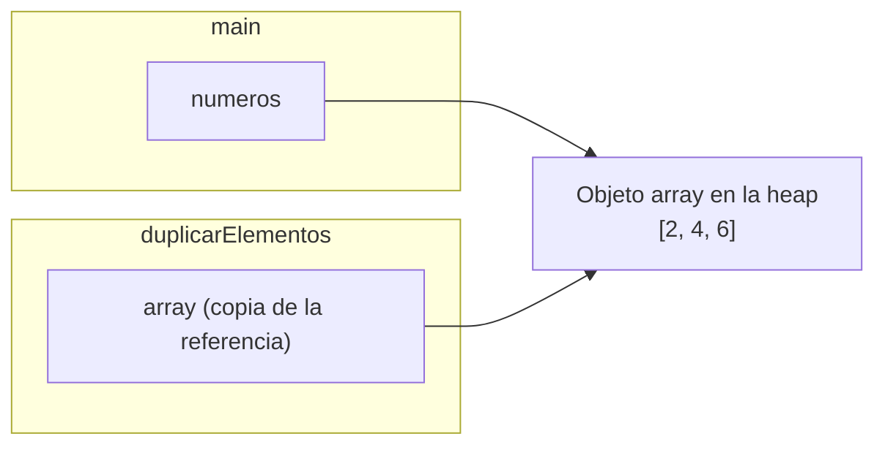
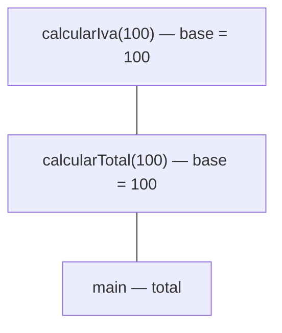

---
tags:
  - programacion
  - DAM1
unidad: 9
tema: Métodos
---

# Unidad 9. Métodos

> [!abstract] Objetivos de la unidad
> - Comprender el concepto de método y su finalidad en la organización del código.
> - Definir e invocar métodos, identificando cada uno de los componentes de su cabecera.
> - Distinguir entre métodos que no devuelven valor (`void`) y métodos con valor de retorno.
> - Utilizar parámetros y argumentos, y comprender el paso de argumentos por valor.
> - Aplicar la sobrecarga de métodos.
> - Comprender el significado del modificador `static`.
> - Determinar el ámbito de las variables.
> - Conocer el concepto de recursividad.
> - Diseñar métodos siguiendo buenas prácticas.

---

## 1. Concepto de método

> [!note] Definición: método
> Un **método** es un **bloque de código con nombre propio** que realiza una tarea concreta y que **solo se ejecuta cuando es llamado** (invocado). Puede recibir datos de entrada, denominados **parámetros**, y puede devolver un resultado.

En otros lenguajes de programación, los métodos reciben el nombre de **funciones** o **procedimientos**. En Java, como todo el código se escribe dentro de clases, se utiliza el término *método*.

Ya se han utilizado métodos a lo largo del curso sin haberlos definido: `main`, `println()`, `nextLine()`, `length()`, `Math.sqrt()`… En esta unidad se estudia cómo **crear métodos propios**.

### 1.1. Finalidad

| Ventaja | Descripción |
|---|---|
| **Reutilización** | El código se define **una vez** y se utiliza **tantas veces como sea necesario**, sin duplicarlo. |
| **Legibilidad** | Un nombre descriptivo comunica la intención del código sin necesidad de leer su implementación. |
| **Mantenibilidad** | Si la lógica cambia, basta con modificar el método en un único lugar. |
| **Modularidad** | Permite dividir un problema complejo en partes más pequeñas y manejables (principio de *divide y vencerás*). |
| **Facilidad de prueba** | Cada método puede comprobarse de forma independiente. |

> [!example] Ejemplo de descomposición
> Un programa que gestiona las notas de un grupo puede dividirse en métodos como `leerNotas()`, `calcularMedia()`, `obtenerMejorNota()` y `mostrarInforme()`. El método `main` se limita a coordinar las llamadas, y cada tarea queda aislada en su propio método.

### 1.2. Definición e invocación

Trabajar con métodos implica dos acciones diferenciadas:

- **Definición** (declaración): escribir el método, indicando qué hace. Se realiza una sola vez.
- **Invocación** (llamada): ordenar su ejecución, escribiendo su nombre seguido de paréntesis. Puede realizarse tantas veces como se desee.

```java
public class EjemploMetodos {

    public static void main(String[] args) {
        llamada(); // invocación
        llamada(); // invocación
        llamada(); // invocación
        llamada(); // invocación
    }

    // Definición del método
    public static void llamada() {
        System.out.println("Hola Mundo!");
    }
}
```

Salida:

```
Hola Mundo!
Hola Mundo!
Hola Mundo!
Hola Mundo!
```

> [!info] Ubicación de los métodos
> Los métodos se definen **dentro de la clase** pero **fuera de cualquier otro método**. No es posible definir un método dentro de otro. El orden en que se escriben dentro de la clase es indiferente: `main` puede llamar a un método definido más abajo.

---

## 2. Estructura de un método

### 2.1. Sintaxis general

Un método se compone de una **cabecera** (o firma) y un **cuerpo**:

```java
modificadorAcceso static tipoRetorno nombreMetodo(tipo parametro1, tipo parametro2) {
    // cuerpo del método
    return valor; // solo si tipoRetorno no es void
}
```

### 2.2. Componentes de la cabecera

| Componente | Descripción | Ejemplo |
|---|---|---|
| **Modificador de acceso** | Controla desde dónde puede invocarse el método: `public`, `private`, `protected`. | `public` |
| **`static`** | Indica que el método pertenece a la clase y puede llamarse sin crear un objeto (apartado 6). | `static` |
| **Tipo de retorno** | Tipo del valor que devuelve el método. `void` indica que no devuelve nada. | `double` |
| **Nombre** | Identificador del método, en *camelCase*. | `calcularArea` |
| **Parámetros** | Lista de datos de entrada, entre paréntesis y separados por comas. Puede estar vacía. | `(double radio)` |

```java
public static double calcularAreaCirculo(double radio) {
//  │       │      │           │               └── parámetro
//  │       │      │           └── nombre
//  │       │      └── tipo de retorno
//  │       └── static
//  └── modificador de acceso
    return Math.PI * radio * radio;
}
```

> [!note] Definición: firma de un método
> La **firma** de un método está formada por su **nombre** y la **lista de tipos de sus parámetros**. Es lo que permite al compilador distinguir un método de otro (véase el apartado 5).

### 2.3. Convenciones de nomenclatura

- Se escriben en ***camelCase***, empezando por minúscula: `calcularTotal`, `mostrarMenu`.
- Suelen comenzar por un **verbo** que describe la acción: `calcular`, `obtener`, `mostrar`, `validar`, `leer`, `convertir`.
- Los métodos que devuelven un `boolean` suelen empezar por `es`, `tiene` o `puede` (`esPar`, `tieneSaldo`).

---

## 3. Tipos de métodos según su retorno

### 3.1. Métodos `void` (sin valor de retorno)

Un método `void` **realiza una acción** (mostrar información, modificar datos…), pero **no devuelve ningún valor** al código que lo invoca.

```java
public static void saludar(String nombre) {
    System.out.println("Hola, " + nombre + "!");
}

// Invocación como instrucción independiente
saludar("Ana"); // Hola, Ana!
```

> [!warning] Un método `void` no produce un valor
> Como no devuelve nada, el resultado de un método `void` no puede asignarse a una variable ni utilizarse en una expresión:
> ```java
> String texto = saludar("Ana"); // ERROR de compilación
> ```

### 3.2. Métodos con valor de retorno

Un método con tipo de retorno **calcula o procesa un valor y lo devuelve** al punto de llamada mediante la instrucción **`return`**. El valor devuelto debe ser del **tipo declarado** en la cabecera (o compatible con él).

```java
public class MetodosReturn {

    public static void main(String[] args) {
        System.out.println(sumarDos(3, 10));  // 13
        System.out.println(sumarDos(10, 20)); // 30
    }

    public static int sumarDos(int x, int y) {
        return x + y;
    }
}
```

**Formas de utilizar el valor devuelto:**

```java
int resultado = sumarDos(3, 10);              // asignarlo a una variable
System.out.println(sumarDos(3, 10));          // pasarlo a otro método
int total = sumarDos(1, 2) * 10;              // usarlo en una expresión
if (sumarDos(2, 2) == 4) { ... }              // usarlo en una condición
```

### 3.3. La instrucción `return`

La instrucción `return` cumple dos funciones:

1. **Devuelve** el valor indicado al punto de llamada.
2. **Finaliza** inmediatamente la ejecución del método; las instrucciones posteriores no se ejecutan.

Un método puede contener **varios `return`**, habitualmente dentro de estructuras condicionales:

```java
public static String clasificarNota(double nota) {
    if (nota >= 9) {
        return "Sobresaliente";
    } else if (nota >= 7) {
        return "Notable";
    } else if (nota >= 5) {
        return "Aprobado";
    }
    return "Suspenso";
}
```

> [!danger] Todos los caminos deben devolver un valor
> En un método con tipo de retorno, **todos los caminos de ejecución posibles** deben terminar en un `return`. En caso contrario, el compilador muestra el error *missing return statement*:
> ```java
> public static String paridad(int n) {
>     if (n % 2 == 0) {
>         return "Par";
>     }
>     // ERROR: si n es impar, el método no devuelve nada
> }
> ```

> [!info] `return` en métodos `void`
> Un método `void` también puede utilizar `return;` (sin valor) para **finalizar anticipadamente** su ejecución:
> ```java
> public static void mostrarInverso(double n) {
>     if (n == 0) {
>         System.out.println("No se puede calcular el inverso de 0.");
>         return; // finaliza el método
>     }
>     System.out.println(1 / n);
> }
> ```

### 3.4. Métodos que devuelven un `boolean`

Son muy útiles para encapsular condiciones y hacer el código más legible:

```java
public static boolean esPar(int numero) {
    return numero % 2 == 0; // devuelve directamente el resultado de la comparación
}

// Uso
if (esPar(8)) {
    System.out.println("Es par");
}
```

> [!tip] Evitar `if` redundantes
> Cuando un método debe devolver el resultado de una condición, se devuelve directamente la expresión:
> ```java
> // Redundante                         // Correcto
> if (numero % 2 == 0) {               return numero % 2 == 0;
>     return true;
> } else {
>     return false;
> }
> ```

---

## 4. Parámetros y argumentos

### 4.1. Conceptos

La información se pasa a los métodos mediante **parámetros**, que actúan como **variables locales** dentro del método.

> [!note] Definiciones
> - **Parámetros** (o parámetros formales): variables declaradas en la cabecera del método, que indican **qué datos espera recibir**.
> - **Argumentos** (o parámetros reales): **valores concretos** que se pasan al método en cada invocación.

```java
public class Parametros {

    public static void main(String[] args) {
        llamada("Jose");     // "Jose" es el argumento
        llamada("Penélope");
        llamada("María");
    }

    public static void llamada(String nombre) { // nombre es el parámetro
        System.out.println("Tu nombre es: " + nombre);
    }
}
```

Al invocar el método, el valor del argumento se **copia** en el parámetro, y el cuerpo del método se ejecuta con ese valor.

### 4.2. Varios parámetros

Pueden declararse tantos parámetros como se desee, **separados por comas**, indicando el tipo de **cada uno** de ellos:

```java
public class MultiplesParametros {

    public static void main(String[] args) {
        llamada("Jose", 18);
        llamada("Penélope", 20);
        llamada("María", 32);
    }

    public static void llamada(String nombre, int edad) {
        System.out.println("Tu nombre es: " + nombre);
        System.out.println(String.format("Tienes %d años", edad));
    }
}
```

> [!important] Correspondencia entre argumentos y parámetros
> Los argumentos deben coincidir con los parámetros en:
> 1. **Número:** tantos argumentos como parámetros.
> 2. **Orden:** el primer argumento se asigna al primer parámetro, y así sucesivamente.
> 3. **Tipo:** cada argumento debe ser del tipo del parámetro correspondiente (o convertible implícitamente a él).
> ```java
> llamada(18, "Jose");   // ERROR: orden incorrecto
> llamada("Jose");       // ERROR: falta un argumento
> ```

> [!warning] `int x, int y`, no `int x, y`
> A diferencia de la declaración de variables, en la lista de parámetros **debe indicarse el tipo de cada parámetro** por separado: `sumar(int x, int y)` es correcto; `sumar(int x, y)` produce un error.

> [!info] Conversión implícita de argumentos
> Se aplica la conversión implícita de tipos (véase la [Unidad 2](02-variables-tipos-de-datos-y-memoria.md)): un método con un parámetro `double` puede recibir un argumento `int`, pero no a la inversa.

### 4.3. Paso de argumentos por valor

En Java, los argumentos se pasan **siempre por valor**: el método recibe una **copia** del valor del argumento, no la variable original.

**Con tipos primitivos**, modificar el parámetro dentro del método **no afecta** a la variable original:

```java
public class PasoPorValor {

    public static void main(String[] args) {
        int numero = 10;
        duplicar(numero);
        System.out.println(numero); // 10: la variable original no cambia
    }

    public static void duplicar(int valor) {
        valor = valor * 2;          // se modifica la copia
        System.out.println(valor);  // 20
    }
}
```

Para que el cambio tenga efecto, el método debe **devolver** el nuevo valor y el llamador, **asignarlo**:

```java
public static int duplicar(int valor) {
    return valor * 2;
}

numero = duplicar(numero); // numero pasa a valer 20
```

**Con tipos de referencia** (arrays y objetos), lo que se copia es la **referencia**. Como la copia apunta al **mismo objeto**, el método **sí puede modificar su contenido**:

```java
import java.util.Arrays;

public class PasoReferencia {

    public static void main(String[] args) {
        int[] numeros = {1, 2, 3};
        duplicarElementos(numeros);
        System.out.println(Arrays.toString(numeros)); // [2, 4, 6]: el array se ha modificado
    }

    public static void duplicarElementos(int[] array) {
        for (int i = 0; i < array.length; i++) {
            array[i] *= 2; // se modifica el array compartido
        }
    }
}
```



> [!important] Resumen del paso por valor
> | Tipo del argumento | Qué se copia | ¿Puede el método modificar el original? |
> |---|---|---|
> | Primitivo | El valor | No |
> | Referencia (array, objeto) | La referencia | Sí puede modificar su **contenido**, pero no hacer que la variable original apunte a otro objeto |

### 4.4. Arrays como parámetros y como valor de retorno

Los métodos pueden recibir arrays como parámetros y devolverlos como resultado:

```java
public static double calcularMedia(double[] valores) {
    double suma = 0;
    for (double v : valores) {
        suma += v;
    }
    return suma / valores.length;
}

public static int[] generarPares(int cantidad) {
    int[] pares = new int[cantidad];
    for (int i = 0; i < cantidad; i++) {
        pares[i] = i * 2;
    }
    return pares;
}
```

---

## 5. Sobrecarga de métodos

### 5.1. Concepto

> [!note] Definición: sobrecarga (*overloading*)
> La **sobrecarga de métodos** consiste en definir **varios métodos con el mismo nombre** dentro de una clase, siempre que tengan **listas de parámetros diferentes** (distinto número de parámetros, distintos tipos o distinto orden de tipos).

El compilador determina qué versión ejecutar en función de los **argumentos** utilizados en la llamada. Esta selección se realiza en **tiempo de compilación**.

```java
int myMethod(int x)
float myMethod(float x)
double myMethod(double x, double y)
```

### 5.2. Ejemplo

Sin sobrecarga, sería necesario utilizar un nombre distinto para cada variante de la operación:

```java
public static int sumarInt(int x, int y) {
    return x + y;
}

public static double sumarDouble(double x, double y) {
    return x + y;
}
```

Con sobrecarga, todas las versiones comparten un nombre único y expresivo:

```java
public class Sobrecarga {

    public static void main(String[] args) {
        int n1 = sumar(8, 5);         // llama a sumar(int, int)
        double n2 = sumar(4.3, 6.26); // llama a sumar(double, double)
        int n3 = sumar(1, 2, 3);      // llama a sumar(int, int, int)

        System.out.println("int: " + n1);    // 13
        System.out.println("double: " + n2); // 10.559999999999999 (precisión de double)
        System.out.println("tres: " + n3);   // 6
    }

    public static int sumar(int x, int y) {
        return x + y;
    }

    public static double sumar(double x, double y) {
        return x + y;
    }

    public static int sumar(int x, int y, int z) {
        return x + y + z;
    }
}
```

> [!warning] El tipo de retorno no distingue los métodos
> Dos métodos con el **mismo nombre y los mismos parámetros**, pero con distinto tipo de retorno, **no** constituyen una sobrecarga válida y producen un error de compilación. La sobrecarga se basa exclusivamente en la **lista de parámetros**.
> ```java
> public static int calcular(int x) { ... }
> public static double calcular(int x) { ... } // ERROR: misma firma
> ```

> [!info] Sobrecarga en la biblioteca estándar
> Muchos métodos de Java están sobrecargados. Por ejemplo, `System.out.println()` dispone de versiones para `String`, `int`, `double`, `char`, `boolean`, etc., lo que permite imprimir cualquier tipo de dato con el mismo nombre de método.

---

## 6. El modificador `static`

### 6.1. Concepto

Un método **`static`** (método **de clase**) **pertenece a la clase en su conjunto**, no a un objeto concreto. Por ello, puede invocarse **sin necesidad de crear ninguna instancia** de la clase.

- Dentro de la misma clase, se invoca directamente por su nombre: `sumar(2, 3)`.
- Desde otra clase, se invoca anteponiendo el **nombre de la clase**: `Calculadora.potencia(2, 10)`.

```java
public class Calculadora {
    public static double potencia(double base, int exponente) {
        double resultado = 1;
        for (int i = 0; i < exponente; i++) {
            resultado *= base;
        }
        return resultado;
    }
}
```

```java
public class Principal {
    public static void main(String[] args) {
        double r = Calculadora.potencia(2, 10); // llamada desde otra clase
        System.out.println(r); // 1024.0
    }
}
```

> [!info] Métodos estáticos de la biblioteca estándar
> Numerosos métodos utilizados hasta ahora son estáticos y se invocan a través del nombre de su clase: `Math.sqrt()`, `Math.pow()`, `Integer.parseInt()`, `String.format()`, `Arrays.toString()`.

### 6.2. Por qué los métodos de esta unidad son `static`

El método `main` es `static`, porque la JVM debe poder ejecutarlo sin crear ningún objeto. Un método estático **solo puede invocar directamente a otros métodos estáticos** de su clase. Por ese motivo, todos los métodos que se llaman desde `main` en los programas de consola de esta unidad se declaran `static`.

> [!note] Alcance
> Cuando se trabaje con objetos, se utilizarán **métodos de instancia** (sin `static`), que se invocan sobre un objeto concreto (`coche.acelerar()`). Se estudian en la [Unidad 11](11-fundamentos-de-poo.md).

### 6.3. Atributos `static` compartidos

En los programas de consola es habitual que varios métodos necesiten el mismo objeto, como un `Scanner`. En lugar de crear uno en cada método, puede declararse como **atributo estático** de la clase, accesible desde todos sus métodos estáticos:

```java
import java.util.Scanner;

public class LecturaDatos {
    private static Scanner consola = new Scanner(System.in); // compartido

    public static void main(String[] args) {
        int edad = leerEntero("Edad: ");
        String nombre = leerTexto("Nombre: ");
        System.out.println(nombre + " tiene " + edad + " años.");
    }

    public static int leerEntero(String mensaje) {
        System.out.print(mensaje);
        return Integer.parseInt(consola.nextLine());
    }

    public static String leerTexto(String mensaje) {
        System.out.print(mensaje);
        return consola.nextLine();
    }
}
```

---

## 7. Ámbito de las variables

### 7.1. Concepto

> [!note] Definición: ámbito (*scope*)
> El **ámbito** de una variable es la **región del código en la que la variable existe y puede utilizarse**. Viene determinado por el lugar en que se declara.

| Tipo de variable | Dónde se declara | Ámbito y ciclo de vida |
|---|---|---|
| **Variable local** | Dentro de un método o de un bloque | Solo existe dentro de ese bloque; desaparece al salir de él. |
| **Parámetro** | En la cabecera del método | Todo el cuerpo del método. |
| **Atributo** (campo) | Dentro de la clase, fuera de los métodos | Toda la clase; existe mientras exista el objeto (o la clase, si es `static`). |

```java
public class EjemploScope {
    private static int atributo = 10;        // atributo: accesible en toda la clase

    public static void metodo(int parametro) { // parametro: ámbito = cuerpo del método
        int local = 5;                        // local: desde aquí hasta el final del método

        if (local > 0) {
            int dentroIf = 99;                // dentroIf: solo dentro del if
            System.out.println(dentroIf + local + parametro + atributo); // correcto
        }
        // System.out.println(dentroIf);      // ERROR: fuera de su ámbito
    }
}
```

### 7.2. Consecuencias

- Dos métodos distintos pueden declarar **variables locales con el mismo nombre**, ya que son completamente independientes.
- Una variable local **no conserva su valor** entre dos llamadas sucesivas al método: se crea de nuevo en cada invocación.
- Un método **no puede acceder** a las variables locales de otro. Si necesita un dato, debe recibirlo como **parámetro**.

> [!tip] Principio de mínimo ámbito
> Conviene declarar cada variable en el ámbito **más reducido posible**, lo más cerca del punto en que se utiliza. Esto reduce errores y facilita la lectura del código.

---

## 8. La pila de llamadas

Cuando un método invoca a otro, la ejecución del primero **se suspende** hasta que el segundo termina. Java gestiona este proceso mediante la **pila de llamadas** (*call stack*), que forma parte de la memoria *stack*:

1. Al invocar un método, se apila un **marco** (*frame*) con sus parámetros y variables locales.
2. Al finalizar (por `return` o al llegar al final del cuerpo), su marco se **desapila** y la ejecución continúa en el punto en que se realizó la llamada.

```java
public static void main(String[] args) {
    int total = calcularTotal(100);   // 1. main llama a calcularTotal
    System.out.println(total);        // 4. se reanuda main con el resultado
}

public static int calcularTotal(int base) {
    return base + calcularIva(base);  // 2. calcularTotal llama a calcularIva
}

public static int calcularIva(int base) {
    return base * 21 / 100;           // 3. devuelve 21 a calcularTotal
}
```



---

## 9. Recursividad

> [!note] Definición: método recursivo
> Un **método recursivo** es aquel que **se invoca a sí mismo** para resolver un problema a partir de versiones más pequeñas del mismo problema.

Todo método recursivo debe tener:

1. **Caso base:** condición en la que el método devuelve un resultado **sin volver a llamarse**.
2. **Caso recursivo:** llamada al propio método con un problema **más pequeño**, que se aproxima al caso base.

```java
// Factorial: n! = n × (n − 1)!, con 0! = 1
public static long factorial(int n) {
    if (n <= 1) {
        return 1;                    // caso base
    }
    return n * factorial(n - 1);     // caso recursivo
}
```

`factorial(4)` → `4 × factorial(3)` → `4 × 3 × factorial(2)` → `4 × 3 × 2 × factorial(1)` → `4 × 3 × 2 × 1` = **24**

> [!danger] `StackOverflowError`
> Si falta el caso base, o la llamada recursiva no se aproxima a él, el método se invoca indefinidamente. Cada llamada apila un nuevo marco hasta agotar la memoria de la pila, y se produce el error **`StackOverflowError`** (véase la [Unidad 10](10-errores-y-excepciones.md)).

---

## 10. Documentación de métodos con Javadoc

Los comentarios **Javadoc** (`/** ... */`) situados justo antes de un método permiten documentar su propósito, sus parámetros y su valor de retorno mediante etiquetas. Los IDE muestran esta documentación al utilizar el método.

| Etiqueta | Uso |
|---|---|
| `@param nombre` | Describe un parámetro. |
| `@return` | Describe el valor devuelto. |

```java
/**
 * Calcula el área de un círculo.
 *
 * @param radio radio del círculo, en centímetros
 * @return área del círculo, en centímetros cuadrados
 */
public static double calcularAreaCirculo(double radio) {
    return Math.PI * radio * radio;
}
```

---

## 11. Buenas prácticas en el diseño de métodos

> [!tip] Principios recomendados
> - **Responsabilidad única:** cada método debe realizar **una sola tarea** y hacerla bien.
> - **Nombre descriptivo:** el nombre debe revelar la intención (`calcularDescuento`, `validarEmail`).
> - **Longitud razonable:** un método de más de 20-30 líneas probablemente hace demasiado y conviene dividirlo.
> - **Pocos parámetros:** más de 3-4 parámetros suele indicar que el método necesita rediseñarse.
> - **Sin efectos secundarios inesperados:** un método llamado `calcularTotal` debe calcular y devolver el total, no imprimirlo por pantalla ni modificar otros datos.
> - **Separar cálculo y presentación:** es preferible que los métodos de cálculo **devuelvan** el resultado y que otro código decida cómo mostrarlo. Así, el método puede reutilizarse en contextos distintos (consola, interfaz gráfica, fichero).

> [!warning] Nombre coherente con el comportamiento
> El nombre debe describir con exactitud lo que hace el método. Un método llamado `doblar` que devuelve `x * x` calcula el **cuadrado**, no el doble; el nombre correcto sería `cuadrado`, o bien su implementación debería ser `x * 2`. Las incoherencias entre nombre y comportamiento dan lugar a errores lógicos difíciles de detectar.

---

## 12. Ejemplo integrador: calculadora de facturas

El siguiente programa descompone el cálculo de una factura en métodos con responsabilidades bien definidas: lectura validada de datos, cálculos y presentación.

```java
import java.util.Scanner;

public class CalculadoraFactura {
    private static final double IVA = 0.21;
    private static Scanner consola = new Scanner(System.in);

    public static void main(String[] args) {
        String producto = leerTexto("Producto: ");
        double precio = leerDecimalPositivo("Precio unitario: ");
        int cantidad = leerEnteroPositivo("Cantidad: ");

        double subtotal = calcularSubtotal(precio, cantidad);
        double descuento = calcularDescuento(subtotal, cantidad);
        double iva = calcularIva(subtotal - descuento);
        double total = subtotal - descuento + iva;

        mostrarFactura(producto, subtotal, descuento, iva, total);
    }

    // ---------- Lectura de datos ----------

    public static String leerTexto(String mensaje) {
        System.out.print(mensaje);
        return consola.nextLine();
    }

    public static int leerEnteroPositivo(String mensaje) {
        int valor;
        do {
            System.out.print(mensaje);
            valor = Integer.parseInt(consola.nextLine());
        } while (valor <= 0);
        return valor;
    }

    public static double leerDecimalPositivo(String mensaje) {
        double valor;
        do {
            System.out.print(mensaje);
            valor = Double.parseDouble(consola.nextLine());
        } while (valor <= 0);
        return valor;
    }

    // ---------- Cálculos ----------

    public static double calcularSubtotal(double precio, int cantidad) {
        return precio * cantidad;
    }

    /**
     * Aplica un 10 % de descuento a partir de 10 unidades.
     *
     * @param subtotal importe antes del descuento
     * @param cantidad número de unidades
     * @return importe del descuento
     */
    public static double calcularDescuento(double subtotal, int cantidad) {
        return (cantidad >= 10) ? subtotal * 0.10 : 0;
    }

    public static double calcularIva(double base) {
        return base * IVA;
    }

    // ---------- Presentación ----------

    public static void mostrarFactura(String producto, double subtotal,
                                      double descuento, double iva, double total) {
        System.out.printf("""
                
                ======== FACTURA ========
                Producto:   %s
                Subtotal:   %10.2f€
                Descuento:  %10.2f€
                IVA (21%%):  %10.2f€
                -------------------------
                TOTAL:      %10.2f€
                """, producto, subtotal, descuento, iva, total);
    }
}
```

> [!info] El símbolo `%%`
> Dentro de una cadena de formato, el carácter `%` tiene un significado especial. Para mostrar un signo de porcentaje literal se escribe **`%%`**.

---

## 13. Resumen de la unidad

> [!summary] Ideas clave
> - Un **método** es un bloque de código con nombre que realiza una tarea y se ejecuta al ser **invocado**; favorece la reutilización, la legibilidad y la modularidad.
> - Su cabecera incluye **modificador de acceso**, `static`, **tipo de retorno**, **nombre** y **parámetros**.
> - Los métodos **`void`** no devuelven valor; los demás devuelven un valor del tipo declarado mediante **`return`**, que además finaliza el método.
> - En un método con retorno, **todos los caminos** deben terminar en `return`.
> - Los **parámetros** se declaran en la cabecera; los **argumentos** son los valores de cada llamada y deben coincidir en número, orden y tipo.
> - Java pasa los argumentos **por valor**: los primitivos no se modifican; los arrays y objetos pueden ver modificado su **contenido**.
> - La **sobrecarga** permite varios métodos con el mismo nombre y distintos parámetros; el tipo de retorno no la distingue.
> - Un método **`static`** pertenece a la clase y se invoca sin crear objetos; desde `main` solo se llaman directamente métodos estáticos.
> - El **ámbito** de una variable local se limita al bloque en que se declara.
> - Un método **recursivo** se llama a sí mismo y necesita un **caso base**.

---

**Navegación:** Anterior: [Unidad 8. Arrays](08-arrays.md) · [Índice](../../../README.md) · Siguiente: [Unidad 10. Errores y excepciones](10-errores-y-excepciones.md)
