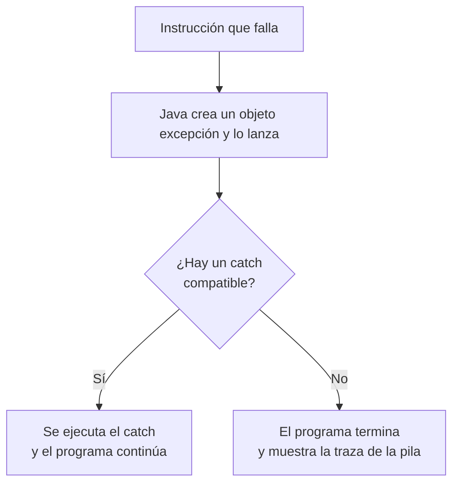
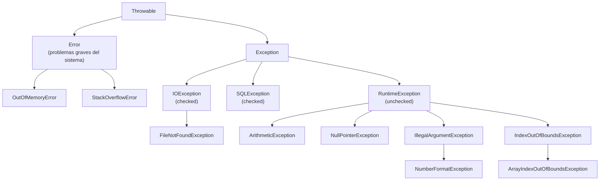
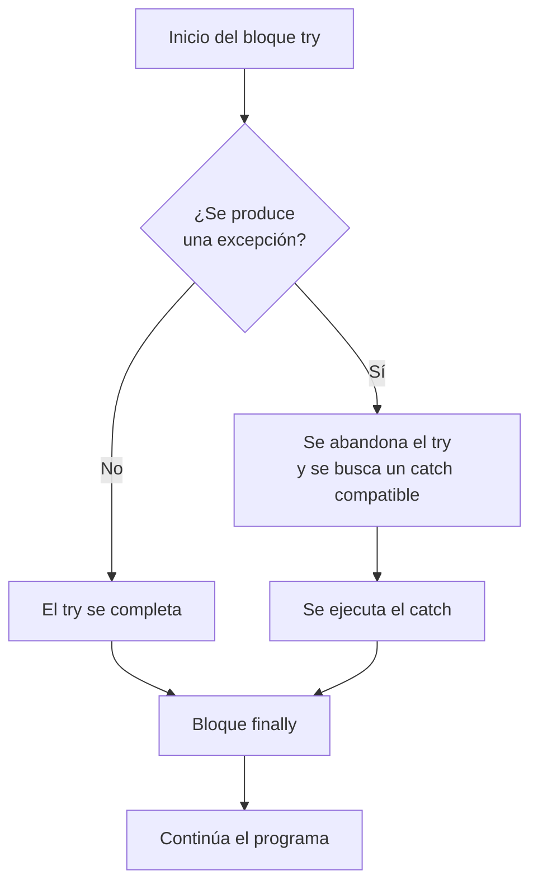
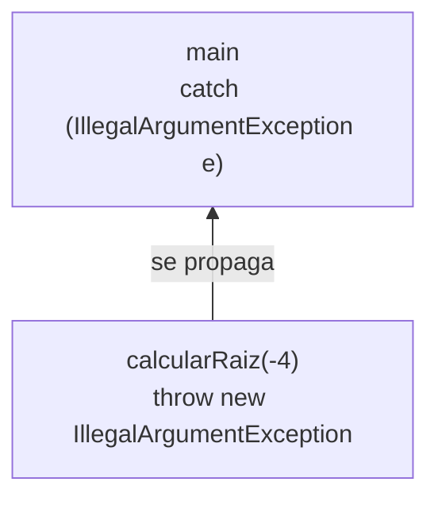

---
tags:
  - programacion
  - DAM1
unidad: 10
tema: Errores y excepciones
---

# Unidad 10. Errores y excepciones

> [!abstract] Objetivos de la unidad
> - Distinguir los tres tipos de errores de un programa: de compilación, de ejecución y lógicos.
> - Comprender el concepto de excepción y la jerarquía de clases que las representa.
> - Interpretar la traza de la pila (*stack trace*) para localizar el origen de un error.
> - Gestionar excepciones mediante los bloques `try`, `catch` y `finally`.
> - Capturar varias excepciones y ordenar correctamente los bloques `catch`.
> - Lanzar excepciones con `throw` y declararlas con `throws`.
> - Diferenciar las excepciones *checked* de las *unchecked*.
> - Conocer la estructura *try-with-resources* y las excepciones personalizadas.
> - Aplicar buenas prácticas en el tratamiento de errores.

---

## 1. Tipos de errores

Durante el desarrollo de software, los errores son inevitables. Java distingue **tres grandes categorías** de errores según el **momento en que se detectan** y su naturaleza.

| Tipo de error | Momento de detección | Consecuencia | Dificultad de detección |
|---|---|---|---|
| **De compilación** | Al compilar, antes de ejecutar | El programa no llega a ejecutarse | Baja |
| **De ejecución** | Durante la ejecución | Se lanza una excepción y el programa se detiene | Media |
| **Lógico** | Solo al analizar los resultados | El programa funciona, pero el resultado es incorrecto | Alta |

### 1.1. Errores de compilación

> [!note] Definición: error de compilación
> Un **error de compilación** (*compile-time error*) es un fallo que el **compilador detecta antes de ejecutar** el programa. El código no puede ejecutarse hasta que se corrige.

Son los más fáciles de resolver, porque el compilador indica el **archivo**, la **línea** y la **causa** del problema. El IDE, además, los subraya en rojo mientras se escribe.

```java
public class ErroresCompilacion {
    public static void main(String[] args) {
        int edad = 20                    // falta el punto y coma
        String nombre = 25;              // tipo incompatible
        System.out.println(apellido);    // variable no declarada
        system.out.println("Hola");      // 'system' en minúscula: Java distingue mayúsculas
    }
}
```

| Causa frecuente | Mensaje típico del compilador |
|---|---|
| Falta un punto y coma | `';' expected` |
| Variable no declarada | `cannot find symbol` |
| Tipos incompatibles | `incompatible types` |
| Variable local sin inicializar | `variable might not have been initialized` |
| Método con retorno sin `return` | `missing return statement` |
| Llaves o paréntesis sin cerrar | `reached end of file while parsing` |

### 1.2. Errores en tiempo de ejecución

> [!note] Definición: error en tiempo de ejecución
> Un **error en tiempo de ejecución** (*runtime error*) se produce cuando el código **compila correctamente**, pero durante la ejecución ocurre una situación imprevista que **lanza una excepción** y detiene el programa.

Son más difíciles de anticipar, porque dependen de los **datos** con los que se ejecuta el programa: el mismo código puede funcionar con unos valores y fallar con otros.

```java
public class ErrorEjecucion {
    public static void main(String[] args) {
        int divisor = 0;
        int resultado = 10 / divisor; // compila, pero falla al ejecutarse
        System.out.println(resultado);
    }
}
```

### 1.3. Errores lógicos

> [!note] Definición: error lógico
> Un **error lógico** se produce cuando el código **compila y se ejecuta sin fallar**, pero **el resultado es incorrecto**. El programa no emite ningún aviso.

Son los **más peligrosos**, ya que solo se detectan comparando el resultado obtenido con el esperado. Por ello, es imprescindible **probar** los programas con datos cuyo resultado se conoce de antemano.

```java
// Se quiere calcular la media de 7 y 8 (resultado esperado: 7.5)
int a = 7, b = 8;
double media = a + b / 2;   // 11.0 → ERROR LÓGICO: la división se evalúa antes que la suma
double correcta = (a + b) / 2.0; // 7.5
```

| Error lógico típico | Ejemplo |
|---|---|
| Precedencia de operadores | `a + b / 2` en lugar de `(a + b) / 2` |
| División entera inesperada | `suma / cantidad` con ambos `int` |
| Operador de comparación incorrecto | `>` en lugar de `>=` |
| Límite de un bucle incorrecto | `i <= array.length` en lugar de `i < array.length` |
| Comparar cadenas con `==` | `if (texto == "si")` |
| Orden incorrecto de las condiciones | Evaluar `nota >= 5` antes que `nota >= 9` |

> [!tip] Técnicas para detectar errores lógicos
> - **Pruebas con valores conocidos**, incluidos los casos límite (0, valores negativos, el primer y el último elemento).
> - **Trazas manuales**: seguir la ejecución paso a paso anotando el valor de las variables.
> - **Mensajes de depuración** temporales con `System.out.println`.
> - El **depurador** (*debugger*) del IDE: permite detener la ejecución en una línea (**punto de ruptura** o *breakpoint*), avanzar instrucción a instrucción e inspeccionar el valor de las variables.

---

## 2. Concepto de excepción

### 2.1. Definición

> [!note] Definición: excepción
> Una **excepción** es un **evento anormal que interrumpe el flujo normal de ejecución** de un programa. Cuando se produce una situación de error en tiempo de ejecución, Java **crea un objeto** que describe el error y lo **lanza** (*throw*).

A partir de ese momento pueden ocurrir dos cosas:

1. Que el código **capture** la excepción y la gestione, en cuyo caso el programa continúa de forma controlada.
2. Que **nadie la capture**: el programa **termina abruptamente**, mostrando el tipo de excepción, un mensaje y la **traza de la pila**.



### 2.2. La traza de la pila (*stack trace*)

Cuando una excepción no se captura, la consola muestra información que permite **localizar** el error:

```java
public class Division {
    public static void main(String[] args) {
        int resultado = dividir(10, 0);
        System.out.println(resultado);
    }

    public static int dividir(int a, int b) {
        return a / b;
    }
}
```

```
Exception in thread "main" java.lang.ArithmeticException: / by zero
	at Division.dividir(Division.java:8)
	at Division.main(Division.java:3)
```

| Parte | Significado |
|---|---|
| `Exception in thread "main"` | El error se ha producido en el hilo principal del programa. |
| `java.lang.ArithmeticException` | **Tipo** de excepción (nombre completo de la clase). |
| `/ by zero` | **Mensaje** descriptivo del error. |
| `at Division.dividir(Division.java:8)` | **Punto exacto** donde se produjo: método `dividir`, línea 8. |
| `at Division.main(Division.java:3)` | Método que llamó al anterior: `main`, línea 3. |

> [!tip] Cómo leer una traza de la pila
> La traza refleja la **pila de llamadas** (véase la [Unidad 9](09-metodos.md)) en el momento del error: la **primera línea `at`** indica dónde se produjo, y las siguientes, la cadena de llamadas que condujo hasta allí. En el IDE, los nombres de archivo y los números de línea son **enlaces** que llevan directamente al código.

### 2.3. Excepciones más frecuentes

| Excepción | Causa habitual | Ejemplo |
|---|---|---|
| `ArithmeticException` | División **entera** entre cero. | `int r = 5 / 0;` |
| `NullPointerException` | Invocar un método o acceder a un atributo de una variable que vale `null`. | `String s = null; s.length();` |
| `ArrayIndexOutOfBoundsException` | Acceder a un índice negativo o `>= length` de un array. | `arr[arr.length]` |
| `StringIndexOutOfBoundsException` | Acceder a una posición inexistente de una cadena. | `"Hola".charAt(10)` |
| `NumberFormatException` | Convertir a número una cadena que no lo es. | `Integer.parseInt("abc")` |
| `InputMismatchException` | `Scanner` recibe un dato de tipo distinto al esperado. | `nextInt()` con la entrada `"hola"` |
| `IllegalArgumentException` | Un método recibe un argumento no válido. | Edad negativa |
| `IllegalStateException` | Un objeto no está en un estado adecuado para la operación. | Retirar de una cuenta bloqueada |
| `ClassCastException` | Conversión de un objeto a un tipo incompatible. | Véase la [Unidad 12](12-herencia-y-polimorfismo.md) |
| `StackOverflowError` | Recursión infinita, sin caso base. | Véase la [Unidad 9](09-metodos.md) |

---

## 3. Jerarquía de excepciones

En Java, las excepciones son **objetos** de clases organizadas en una **jerarquía de herencia** (véase la [Unidad 12](12-herencia-y-polimorfismo.md)). Todas descienden de la clase **`Throwable`**:



| Clase | Representa | ¿Debe capturarse? |
|---|---|---|
| **`Error`** | Problemas **graves del sistema** de los que el programa no puede recuperarse (falta de memoria, desbordamiento de la pila). | **No**: no deben capturarse en código normal. |
| **`Exception`** | Situaciones anómalas de las que el programa **puede recuperarse**. | Sí, cuando se pueda tratar el problema. |
| **`RuntimeException`** | Subclase de `Exception` que agrupa los **errores de programación** (índices, `null`, argumentos no válidos). | Opcional: lo ideal es **evitarlos** con un código correcto. |

> [!important] Consecuencia de la jerarquía
> Un bloque `catch` que captura una clase **captura también todas sus subclases**. Así, `catch (Exception e)` captura cualquier excepción, y `catch (IllegalArgumentException e)` captura también `NumberFormatException`, ya que esta es una subclase de aquella.

---

## 4. Gestión de excepciones: `try`, `catch` y `finally`

### 4.1. Sintaxis

Java ofrece el bloque **`try-catch`** para interceptar las excepciones y gestionarlas de forma controlada, en lugar de permitir que el programa termine abruptamente.

```java
try {
    // Código que puede lanzar una excepción
} catch (TipoExcepcion e) {
    // Código que se ejecuta si se produce esa excepción
} finally {
    // Código que se ejecuta SIEMPRE (opcional)
}
```

| Bloque | Función |
|---|---|
| **`try`** | Contiene el código que **puede fallar**. Si se produce una excepción, la ejecución **salta inmediatamente** al `catch` correspondiente; las instrucciones restantes del `try` no se ejecutan. |
| **`catch`** | **Captura y gestiona** la excepción indicada entre paréntesis. Puede haber varios bloques `catch` para distintos tipos. |
| **`finally`** | **Opcional.** Se ejecuta **siempre**, haya o no excepción. Se utiliza para liberar recursos (ficheros, conexiones, etc.). |

> [!info] Combinaciones válidas
> Un `try` debe ir acompañado, como mínimo, de un `catch` o de un `finally`. Son válidas las combinaciones `try-catch`, `try-finally` y `try-catch-finally`.

### 4.2. Ejemplo

```java
public class GestionExcepciones {
    public static void main(String[] args) {
        int divisor = 0;

        try {
            int resultado = 10 / divisor;
            System.out.println("Resultado: " + resultado); // no se ejecuta
        } catch (ArithmeticException e) {
            // Se ejecuta SOLO si se produce ArithmeticException
            System.out.println("Error: división por cero. " + e.getMessage());
        } finally {
            // Se ejecuta SIEMPRE, haya o no excepción
            System.out.println("Bloque finally ejecutado.");
        }

        System.out.println("El programa continúa con normalidad.");
    }
}
```

Salida:

```
Error: división por cero. / by zero
Bloque finally ejecutado.
El programa continúa con normalidad.
```

### 4.3. Flujo de ejecución



> [!note] El bloque `finally` y la instrucción `return`
> El bloque `finally` se ejecuta **incluso si** el `try` o el `catch` contienen un `return`: antes de abandonar el método, Java ejecuta el `finally`. Por este motivo es el lugar adecuado para garantizar la liberación de recursos.

### 4.4. El objeto excepción

La variable declarada en el `catch` (habitualmente `e`) es el **objeto excepción** capturado. Proporciona información sobre el error:

| Método | Devuelve |
|---|---|
| `getMessage()` | El **mensaje** descriptivo del error. |
| `toString()` | El **tipo** de la excepción seguido del mensaje. |
| `printStackTrace()` | Imprime la **traza de la pila** completa en la consola de errores. |

```java
try {
    int numero = Integer.parseInt("abc");
} catch (NumberFormatException e) {
    System.out.println(e.getMessage()); // For input string: "abc"
    System.out.println(e);              // java.lang.NumberFormatException: For input string: "abc"
    e.printStackTrace();                // traza completa (útil durante el desarrollo)
}
```

> [!tip] Mensajes para el usuario
> El mensaje de `getMessage()` está pensado para el programador y suele estar en inglés. Al usuario final conviene mostrarle un **mensaje propio**, claro y en su idioma, que indique qué ha fallado y qué puede hacer.

### 4.5. Ámbito de las variables en `try`

Las variables declaradas dentro del bloque `try` **solo existen en él** (véase la [Unidad 9](09-metodos.md)). Si se necesitan después, deben declararse **antes** del `try`:

```java
int numero = 0; // declarada fuera para usarla después del try
try {
    numero = Integer.parseInt("42");
} catch (NumberFormatException e) {
    System.out.println("Valor no válido.");
}
System.out.println(numero); // correcto
```

---

## 5. Captura de varias excepciones

### 5.1. Varios bloques `catch`

Es posible encadenar varios bloques `catch` para tratar **de forma diferenciada** distintos tipos de error. Java evalúa los `catch` **en orden** y ejecuta **el primero** cuyo tipo coincide con la excepción lanzada (o es una superclase de ella):

```java
import java.util.Scanner;

public class VariosCatch {
    public static void main(String[] args) {
        Scanner consola = new Scanner(System.in);
        int[] valores = new int[5];

        try {
            System.out.print("Posición (0-4): ");
            int n = Integer.parseInt(consola.nextLine()); // puede lanzar NumberFormatException
            valores[n] = 100;                             // puede lanzar ArrayIndexOutOfBoundsException
            System.out.println("Valor guardado en la posición " + n);

        } catch (NumberFormatException e) {
            System.out.println("El valor introducido no es un número entero válido.");

        } catch (ArrayIndexOutOfBoundsException e) {
            System.out.println("El índice está fuera del rango del array.");

        } catch (Exception e) {
            // Captura genérica: cualquier otra excepción no prevista
            System.out.println("Error inesperado: " + e.getMessage());
        }
    }
}
```

> [!danger] Orden de los `catch`: de lo específico a lo general
> Los `catch` más **específicos** deben colocarse **antes** que los más **generales**. `Exception` es la superclase de casi todas las excepciones, por lo que, si se situara en primer lugar, capturaría todos los errores y los `catch` posteriores nunca se ejecutarían. El compilador detecta esta situación y la marca como **error** (*exception has already been caught*).

### 5.2. Captura múltiple en un solo `catch`

Desde Java 7, cuando varias excepciones reciben **el mismo tratamiento**, pueden agruparse en un único `catch` separándolas con una **barra vertical** (`|`):

```java
try {
    int n = Integer.parseInt(texto);
    valores[n] = 100;
} catch (NumberFormatException | ArrayIndexOutOfBoundsException e) {
    System.out.println("Posición no válida: " + e.getMessage());
}
```

> [!warning] Restricción de la captura múltiple
> Las excepciones agrupadas con `|` no pueden estar relacionadas por herencia (una no puede ser subclase de otra), ya que resultaría redundante.

---

## 6. Lanzar excepciones: `throw`

### 6.1. Concepto

Además de capturar excepciones, es posible **lanzarlas manualmente** mediante la instrucción **`throw`**. Resulta útil para **señalar explícitamente** que un método ha recibido datos no válidos o no puede completar su tarea, en lugar de devolver valores especiales como `-1` o `null`.

```java
throw new TipoExcepcion("Mensaje descriptivo");
```

- La palabra reservada `new` crea el objeto excepción (véase la [Unidad 11](11-fundamentos-de-poo.md)).
- El **mensaje** se pasa como argumento y será el que devuelva `getMessage()`.
- `throw` **finaliza inmediatamente** el método, igual que `return`.

### 6.2. Ejemplo

```java
public class LanzarExcepcion {

    public static void main(String[] args) {
        try {
            double r = calcularRaiz(-4);
            System.out.println("Raíz: " + r);
        } catch (IllegalArgumentException e) {
            System.out.println("Error: " + e.getMessage());
        }
    }

    public static double calcularRaiz(double numero) {
        if (numero < 0) {
            // Se lanza una excepción con un mensaje descriptivo
            throw new IllegalArgumentException(
                "No se puede calcular la raíz de un número negativo: " + numero);
        }
        return Math.sqrt(numero);
    }
}
```

Salida:

```
Error: No se puede calcular la raíz de un número negativo: -4.0
```

> [!tip] Excepciones adecuadas para validar
> | Situación | Excepción recomendada |
> |---|---|
> | Un argumento tiene un valor no válido (negativo, vacío, fuera de rango) | `IllegalArgumentException` |
> | El objeto no está en condiciones de realizar la operación | `IllegalStateException` |
> | Un argumento obligatorio es `null` | `NullPointerException` o `IllegalArgumentException` |

### 6.3. Propagación de excepciones

Si un método lanza una excepción y **no la captura**, esta se **propaga** al método que lo invocó, y así sucesivamente a lo largo de la pila de llamadas, hasta que algún método la captura o llega a `main` y el programa termina. En el ejemplo anterior, `calcularRaiz` lanza la excepción y es `main` quien la gestiona.



> [!info] Separación de responsabilidades
> Este mecanismo permite que el método que **detecta** el error (`calcularRaiz`) no tenga que decidir cómo **comunicarlo** al usuario: esa decisión corresponde al método que lo invoca, que conoce el contexto.

---

## 7. Excepciones *checked* y *unchecked*

### 7.1. Clasificación

Java clasifica las excepciones en dos categorías según si el **compilador obliga** o no a gestionarlas:

| Categoría | Descripción | Ejemplos |
|---|---|---|
| ***Checked*** (comprobadas) | Heredan de `Exception` pero **no** de `RuntimeException`. El compilador **exige** que se capturen con `try-catch` o que se declaren con `throws`. Representan situaciones **externas**, impredecibles pero **recuperables**. | `IOException`, `FileNotFoundException`, `SQLException` |
| ***Unchecked*** (no comprobadas) | Heredan de `RuntimeException`. El compilador **no obliga** a gestionarlas. Representan **errores de programación**. | `NullPointerException`, `ArrayIndexOutOfBoundsException`, `IllegalArgumentException`, `NumberFormatException` |
| **`Error`** | Heredan de `Error`, no de `Exception`. Problemas **graves del sistema** de los que el programa no puede recuperarse. No deben capturarse. | `OutOfMemoryError`, `StackOverflowError` |

> [!example] Diferencia práctica
> - Un fichero puede no existir o un servidor de base de datos puede estar caído aunque el código sea **perfecto**: son situaciones *checked*, ajenas al programa, que hay que prever.
> - Un acceso a `array[10]` en un array de 5 elementos se debe a un **error del programador**: es *unchecked*, y la solución es corregir el código, no capturar la excepción.

### 7.2. La cláusula `throws`

Cuando un método puede producir una excepción *checked* y **no quiere gestionarla**, debe **declararlo** en su cabecera mediante la cláusula **`throws`**. De este modo, delega la responsabilidad en quien lo invoque.

```java
import java.io.FileReader;
import java.io.IOException;

public class EjemploThrows {

    public static void main(String[] args) {
        try {
            leerPrimerCaracter("datos.txt");
        } catch (IOException e) {
            System.out.println("No se ha podido leer el fichero: " + e.getMessage());
        }
    }

    // El método declara que puede lanzar IOException
    public static void leerPrimerCaracter(String ruta) throws IOException {
        FileReader lector = new FileReader(ruta); // puede lanzar FileNotFoundException
        int caracter = lector.read();             // puede lanzar IOException
        System.out.println((char) caracter);
        lector.close();
    }
}
```

> [!warning] `throw` frente a `throws`
> | | `throw` | `throws` |
> |---|---|---|
> | Función | **Lanza** una excepción | **Declara** que un método puede lanzar excepciones |
> | Ubicación | Dentro del cuerpo del método | En la cabecera del método |
> | Va seguido de | Un **objeto** excepción: `throw new ...` | Uno o varios **tipos**: `throws IOException, SQLException` |

> [!info] Regla del compilador para las *checked*
> Ante una excepción *checked*, el compilador obliga a elegir entre dos opciones:
> 1. **Capturarla** con `try-catch`.
> 2. **Propagarla**, declarándola con `throws` en la cabecera del método.
>
> Si no se hace ninguna de las dos, el código no compila (*unreported exception ... must be caught or declared to be thrown*).

---

## 8. *Try-with-resources*

Algunos objetos, como los lectores de ficheros o las conexiones a bases de datos, ocupan **recursos** del sistema que deben **cerrarse** al terminar de usarlos, tanto si se produce un error como si no. Tradicionalmente, el cierre se realizaba en el bloque `finally`, lo que daba lugar a código extenso.

Desde Java 7, la estructura **`try-with-resources`** permite declarar los recursos **entre paréntesis** a continuación de `try`. Java los **cierra automáticamente** al finalizar el bloque, se produzca o no una excepción.

```java
import java.io.BufferedReader;
import java.io.FileReader;
import java.io.IOException;

public class TryWithResources {
    public static void main(String[] args) {
        try (BufferedReader lector = new BufferedReader(new FileReader("datos.txt"))) {
            String linea = lector.readLine();
            System.out.println(linea);
        } catch (IOException e) {
            System.out.println("Error de lectura: " + e.getMessage());
        }
        // No es necesario llamar a lector.close(): se cierra automáticamente
    }
}
```

> [!note] Alcance
> Esta estructura es la forma recomendada de trabajar con ficheros y bases de datos, y se utiliza de forma sistemática en la [Unidad 15](15-lectura-y-escritura-de-ficheros.md) y la [Unidad 16](16-bases-de-datos-con-jdbc.md). Solo admite objetos que implementan la interfaz `AutoCloseable` (véase la [Unidad 12](12-herencia-y-polimorfismo.md)).

---

## 9. Excepciones personalizadas

Cuando ninguna de las excepciones de Java describe adecuadamente un error propio del dominio de la aplicación, es posible **crear una clase de excepción propia**, que hereda de `Exception` (si debe ser *checked*) o de `RuntimeException` (si debe ser *unchecked*):

```java
// Excepción personalizada (unchecked)
public class SaldoInsuficienteException extends RuntimeException {
    public SaldoInsuficienteException(String mensaje) {
        super(mensaje); // pasa el mensaje a la clase padre
    }
}
```

```java
public static double retirar(double saldo, double importe) {
    if (importe > saldo) {
        throw new SaldoInsuficienteException(
            "Saldo insuficiente. Disponible: " + saldo + ", solicitado: " + importe);
    }
    return saldo - importe;
}
```

> [!info] Convención de nombres
> Por convención, el nombre de las clases de excepción termina en **`Exception`**. Los conceptos de `extends`, constructor y `super` se estudian en las [Unidades 11](11-fundamentos-de-poo.md) y [12](12-herencia-y-polimorfismo.md).

---

## 10. Aplicación práctica: validación de la entrada del usuario

Uno de los usos más habituales del tratamiento de excepciones es **validar los datos introducidos por teclado**. Combinando un bucle con `try-catch`, se solicita el dato **hasta que sea válido**, sin que el programa termine por un error de formato:

```java
import java.util.Scanner;

public class LecturaSegura {
    private static Scanner consola = new Scanner(System.in);

    public static void main(String[] args) {
        int edad = leerEntero("Introduce tu edad: ");
        System.out.println("Edad registrada: " + edad);
    }

    public static int leerEntero(String mensaje) {
        while (true) {
            System.out.print(mensaje);
            try {
                return Integer.parseInt(consola.nextLine()); // si es válido, finaliza el método
            } catch (NumberFormatException e) {
                System.out.println("Debe introducir un número entero. Inténtalo de nuevo.");
            }
        }
    }
}
```

Ejecución:

```
Introduce tu edad: veinte
Debe introducir un número entero. Inténtalo de nuevo.
Introduce tu edad: 20
Edad registrada: 20
```

> [!info] Funcionamiento
> El bucle `while (true)` se repite indefinidamente, pero el `return` situado dentro del `try` **finaliza el método** en cuanto la conversión tiene éxito. Si la conversión falla, se ejecuta el `catch` y el bucle vuelve a solicitar el dato.

---

## 11. Buenas prácticas

> [!tip] Recomendaciones
> - **Prevenir antes que capturar.** Los errores de programación (*unchecked*) se evitan con un código correcto: comprobar que un índice está en rango o que una variable no es `null` es preferible a capturar la excepción.
> - **Capturar excepciones específicas**, no `Exception` de forma genérica, salvo como último recurso al final de la cadena de `catch`.
> - **No dejar bloques `catch` vacíos.** Ocultar un error dificulta enormemente su detección:
>   ```java
>   catch (Exception e) { }  // MAL: el error pasa desapercibido
>   ```
> - **Mensajes descriptivos**: al lanzar una excepción, indicar qué ha fallado y con qué valor.
> - **No utilizar excepciones para controlar el flujo normal** del programa: son para situaciones excepcionales, no un sustituto de `if-else`.
> - **Liberar siempre los recursos**, preferentemente con *try-with-resources*.
> - **Lanzar *unchecked*** (`IllegalArgumentException`, `IllegalStateException`) para validaciones de entrada y restricciones del dominio; reservar las ***checked*** para los recursos externos (ficheros, bases de datos, red).

---

## 12. Ejemplo integrador: cajero automático

El siguiente programa simula las operaciones de un cajero automático. Combina la validación de la entrada con `try-catch`, el lanzamiento de excepciones con `throw` desde los métodos de cálculo y la captura diferenciada de errores.

```java
import java.util.Scanner;

public class Cajero {
    private static Scanner consola = new Scanner(System.in);

    public static void main(String[] args) {
        double saldo = 500.0;
        int opcion;

        do {
            System.out.printf("%nSaldo actual: %.2f€%n", saldo);
            System.out.println("1. Ingresar  2. Retirar  0. Salir");
            opcion = leerEntero("Opción: ");

            try {
                switch (opcion) {
                    case 1 -> saldo = ingresar(saldo, leerImporte("Importe a ingresar: "));
                    case 2 -> saldo = retirar(saldo, leerImporte("Importe a retirar: "));
                    case 0 -> System.out.println("Gracias por utilizar el cajero.");
                    default -> System.out.println("Opción no válida.");
                }
            } catch (IllegalArgumentException e) {
                System.out.println("Operación rechazada: " + e.getMessage());
            } catch (IllegalStateException e) {
                System.out.println("Operación no disponible: " + e.getMessage());
            }
        } while (opcion != 0);
    }

    // ---------- Lógica de negocio: lanzan excepciones ----------

    public static double ingresar(double saldo, double importe) {
        if (importe <= 0) {
            throw new IllegalArgumentException("el importe debe ser positivo.");
        }
        return saldo + importe;
    }

    public static double retirar(double saldo, double importe) {
        if (importe <= 0) {
            throw new IllegalArgumentException("el importe debe ser positivo.");
        }
        if (importe > saldo) {
            throw new IllegalStateException("saldo insuficiente (" + saldo + "€ disponibles).");
        }
        return saldo - importe;
    }

    // ---------- Entrada de datos: captura los errores de formato ----------

    public static int leerEntero(String mensaje) {
        while (true) {
            System.out.print(mensaje);
            try {
                return Integer.parseInt(consola.nextLine());
            } catch (NumberFormatException e) {
                System.out.println("Introduce un número entero.");
            }
        }
    }

    public static double leerImporte(String mensaje) {
        while (true) {
            System.out.print(mensaje);
            try {
                return Double.parseDouble(consola.nextLine());
            } catch (NumberFormatException e) {
                System.out.println("Introduce un importe numérico (use el punto como separador decimal).");
            }
        }
    }
}
```

Ejecución de ejemplo:

```
Saldo actual: 500,00€
1. Ingresar  2. Retirar  0. Salir
Opción: 2
Importe a retirar: 800
Operación no disponible: saldo insuficiente (500.0€ disponibles).

Saldo actual: 500,00€
1. Ingresar  2. Retirar  0. Salir
Opción: 1
Importe a ingresar: cien
Introduce un importe numérico (use el punto como separador decimal).
Importe a ingresar: -50
Operación rechazada: el importe debe ser positivo.
```

---

## 13. Resumen de la unidad

> [!summary] Ideas clave
> - Existen tres tipos de errores: de **compilación** (los detecta el compilador), de **ejecución** (lanzan una excepción) y **lógicos** (resultado incorrecto sin aviso; los más difíciles de detectar).
> - Una **excepción** es un objeto que representa un evento anormal; si no se captura, el programa termina y muestra la **traza de la pila**, cuya primera línea `at` indica dónde se produjo el error.
> - Todas las excepciones descienden de **`Throwable`**, que se divide en **`Error`** (no recuperable) y **`Exception`**; las subclases de **`RuntimeException`** son *unchecked*.
> - **`try`** contiene el código que puede fallar, **`catch`** gestiona la excepción y **`finally`** se ejecuta siempre.
> - Los `catch` se ordenan **de lo específico a lo general**; varias excepciones con el mismo tratamiento se agrupan con `|`.
> - **`throw`** lanza una excepción; **`throws`** declara en la cabecera que un método puede lanzarla.
> - Las excepciones ***checked*** deben capturarse o declararse; las ***unchecked*** no son obligatorias y suelen indicar errores de programación.
> - ***Try-with-resources*** cierra automáticamente los recursos declarados entre paréntesis.
> - Se pueden crear **excepciones personalizadas** heredando de `Exception` o `RuntimeException`.
> - Un bucle con `try-catch` permite **validar la entrada** del usuario sin que el programa termine.

---

**Navegación:** Anterior: [Unidad 9. Métodos](09-metodos.md) · [Índice](../../../README.md) · Siguiente: [Unidad 11. Fundamentos de POO](11-fundamentos-de-poo.md)
