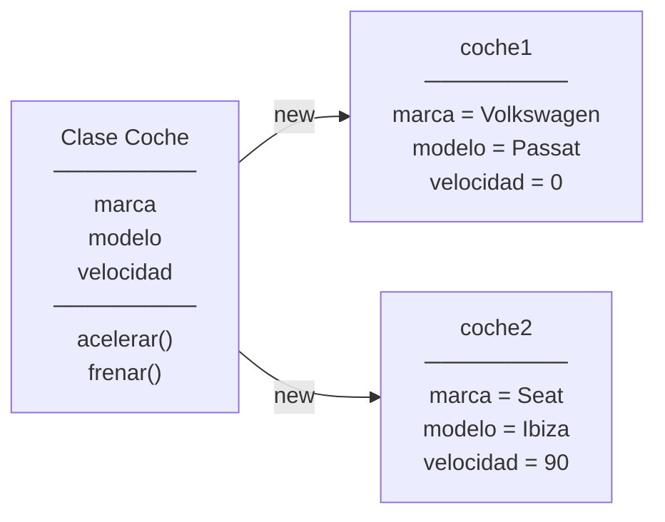
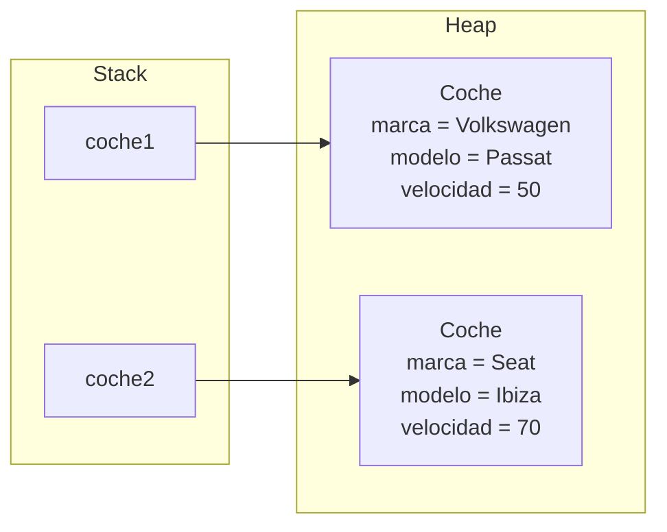
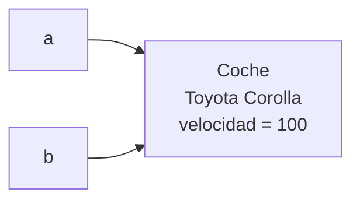

---
tags:
  - programacion
  - DAM1
unidad: 11
tema: Fundamentos de la programación orientada a objetos
---

# Unidad 11. Fundamentos de la programación orientada a objetos

> [!abstract] Objetivos de la unidad
> - Comprender el paradigma de la programación orientada a objetos y sus objetivos.
> - Conocer los cuatro pilares de la POO.
> - Distinguir los conceptos de clase, objeto e instancia.
> - Definir clases con atributos y métodos, y crear objetos a partir de ellas.
> - Comprender cómo se almacenan los objetos en memoria y el significado de las referencias.
> - Implementar constructores, incluida su sobrecarga, y utilizar la palabra reservada `this`.
> - Aplicar los modificadores de acceso y el principio de encapsulamiento mediante *getters* y *setters*.
> - Distinguir entre miembros de instancia y miembros de clase (`static`).
> - Sobrescribir el método `toString()` y trabajar con colecciones de objetos.

---

## 1. El paradigma orientado a objetos

### 1.1. Concepto

> [!note] Definición: paradigma de programación
> Un **paradigma de programación** es un **modelo o estilo** que determina cómo se estructura y organiza el código de un programa.

Hasta ahora, los programas se han construido siguiendo la **programación estructurada**: un conjunto de **datos** (variables, arrays) y un conjunto de **métodos** independientes que operan sobre ellos. A medida que los programas crecen, este enfoque presenta dificultades: los datos y las operaciones que los manipulan están separados, cualquier método puede modificar cualquier dato y los cambios afectan a partes muy diversas del código.

> [!note] Definición: programación orientada a objetos
> La **programación orientada a objetos** (**POO**) es un paradigma que organiza el software en torno a **objetos**, en lugar de funciones o procedimientos aislados. Cada objeto representa una **entidad del dominio del problema** y **encapsula** en una sola unidad su **estado** (datos) y su **comportamiento** (acciones).

| Aspecto | Programación estructurada | Programación orientada a objetos |
|---|---|---|
| Unidad básica | El método (función) | El objeto |
| Datos y operaciones | Separados | Agrupados en el mismo objeto |
| Acceso a los datos | Cualquier método puede modificarlos | Solo el propio objeto controla sus datos |
| Correspondencia con el problema | Indirecta | Directa: cada entidad real es una clase |
| Escalabilidad | Limitada en programas grandes | Adecuada para sistemas grandes y complejos |

> [!example] Ejemplo de modelado
> En una aplicación de gestión de una biblioteca, las entidades del dominio son los **libros**, los **socios** y los **préstamos**. En POO, cada una se convierte en una clase (`Libro`, `Socio`, `Prestamo`) que agrupa sus datos (título, nombre, fecha…) y sus operaciones (prestar, devolver, renovar…).

### 1.2. Objetivos de la POO

| Objetivo | Descripción |
|---|---|
| **Claridad** | El código refleja directamente el dominio del problema, lo que facilita su comprensión. |
| **Mantenimiento** | Los cambios quedan localizados en los objetos afectados, sin repercutir en el resto del sistema. |
| **Reutilización** | Las clases pueden utilizarse en distintos contextos y proyectos. |
| **Extensibilidad** | El sistema puede ampliarse añadiendo nuevas clases sin modificar las existentes. |

---

## 2. Los cuatro pilares de la POO

La programación orientada a objetos se fundamenta en cuatro principios:

| Pilar | Descripción | Se estudia en |
|---|---|---|
| **1. Encapsulamiento** | Proteger el **estado interno** de un objeto y controlar el acceso a él mediante métodos públicos. | Esta unidad (apartado 8) |
| **2. Herencia** | Una clase puede **extender** a otra, heredando sus atributos y métodos y especializando su comportamiento. | [Unidad 12](12-herencia-y-polimorfismo.md) |
| **3. Polimorfismo** | Objetos de **tipos distintos** pueden responder al **mismo mensaje** de formas diferentes. | [Unidad 12](12-herencia-y-polimorfismo.md) |
| **4. Abstracción** | Modelar solo los **aspectos relevantes** del dominio, ocultando los detalles de implementación. | Esta unidad y [Unidad 12](12-herencia-y-polimorfismo.md) |

> [!info] La abstracción en la práctica
> Al diseñar una clase `Alumno` para un sistema de matriculación, interesan el nombre, el DNI y las asignaturas, pero no el color de ojos o la altura. **Abstraer** consiste en seleccionar las características relevantes para el problema e ignorar el resto. Una misma entidad del mundo real puede modelarse de forma distinta según el contexto: el `Alumno` de una aplicación médica sí necesitaría la altura.

---

## 3. Clase y objeto

### 3.1. Definiciones

> [!note] Definición: clase
> Una **clase** es una **plantilla** o definición que describe la **estructura común** (atributos) y el **comportamiento** (métodos) de todos los objetos de un mismo tipo. No almacena datos concretos: no ocupa memoria para ellos hasta que se crean objetos.

> [!note] Definición: objeto
> Un **objeto** (o **instancia**) es un **ejemplar concreto** de una clase. Cada objeto ocupa memoria y tiene su **propio estado**: los valores de sus atributos pueden ser distintos de los de otros objetos de la misma clase.

> [!tip] Analogía
> Una clase es como el **plano de una vivienda**: define cuántas habitaciones tiene y cómo se distribuyen, pero no es una vivienda. A partir de un mismo plano pueden construirse muchas viviendas (objetos), cada una con su propia dirección, su color de fachada y sus propietarios.

**Ejemplo:** la clase `Coche` define que todo coche tiene marca, modelo y velocidad, y que puede acelerar y frenar. El objeto `coche1` es un Volkswagen Passat concreto, con velocidad 0; el objeto `coche2` es un Seat Ibiza que circula a 90 km/h.



### 3.2. Características de un objeto

Todo objeto se caracteriza por tres elementos:

| Elemento | Descripción | Ejemplo (`coche2`) |
|---|---|---|
| **Estado** | Valores de sus atributos en un momento dado. | Seat, Ibiza, 90 km/h |
| **Comportamiento** | Operaciones que puede realizar (sus métodos). | Acelerar, frenar |
| **Identidad** | Lo distingue de cualquier otro objeto, aunque tengan el mismo estado. | Su posición en memoria |

---

## 4. Definición de una clase

### 4.1. Atributos y métodos

Toda clase se compone de dos tipos de miembros:

| Miembro | Representa | Naturaleza gramatical | Ejemplos |
|---|---|---|---|
| **Atributos** (campos o propiedades) | El **estado** del objeto | Sustantivos | `marca`, `velocidad`, `saldo`, `nombre` |
| **Métodos** | El **comportamiento** del objeto | Verbos | `acelerar()`, `calcularTotal()`, `enviarEmail()` |

> [!tip] Identificar clases, atributos y métodos en un enunciado
> Al analizar un problema, los **sustantivos** relevantes suelen corresponder a **clases** o **atributos**, y los **verbos**, a **métodos**. Por ejemplo, en «*un socio puede reservar libros; cada libro tiene un título y un autor*»: `Socio` y `Libro` son clases, `titulo` y `autor` son atributos, y `reservar()` es un método.

### 4.2. Ejemplo: la clase `Coche`

```java
public class Coche {
    // Atributos (estado)
    private String marca;
    private String modelo;
    private int velocidad;

    // Constructor
    public Coche(String marca, String modelo) {
        this.marca = marca;
        this.modelo = modelo;
        this.velocidad = 0; // estado inicial válido
    }

    // Métodos (comportamiento)
    public void acelerar(int incremento) {
        if (incremento > 0) {
            velocidad += incremento;
        }
    }

    public void frenar(int decremento) {
        if (decremento > 0 && velocidad - decremento >= 0) {
            velocidad -= decremento;
        }
    }

    public String getDescripcion() {
        return marca + " " + modelo + " a " + velocidad + " km/h";
    }
}
```

**Estructura de la clase:**

1. **Atributos**, declarados como `private` (apartado 8).
2. **Constructor**, que inicializa el objeto (apartado 6).
3. **Métodos**, que definen su comportamiento.

> [!important] Métodos de instancia
> A diferencia de los métodos estudiados en la [Unidad 9](09-metodos.md), los métodos de la clase `Coche` **no llevan `static`**. Son **métodos de instancia**: se invocan sobre un objeto concreto y operan con **sus** atributos. Por eso `acelerar()` puede usar directamente `velocidad` sin recibirla como parámetro: se refiere a la velocidad del objeto sobre el que se ha invocado.

### 4.3. Organización en archivos

- Cada clase pública se escribe en **su propio archivo** `.java`, cuyo nombre coincide con el de la clase (véase la [Unidad 1](01-introduccion-a-java-y-entorno-de-desarrollo.md)): `Coche.java`, `Producto.java`.
- Es habitual disponer de una **clase principal** independiente (por ejemplo, `Main` o `Principal`) que contiene el método `main`, crea los objetos y coordina su uso.
- Las clases relacionadas se agrupan en **paquetes** (`package`), que se estudian en la [Unidad 14](14-diagramas-uml-y-su-paso-a-java.md).

```
src/
├── Coche.java      → define la clase Coche
└── Main.java       → contiene main(): crea y utiliza objetos Coche
```

---

## 5. Creación y uso de objetos

### 5.1. Instanciación con `new`

> [!note] Definición: instanciación
> La **instanciación** es el proceso de **crear un objeto** a partir de una clase. Se realiza con el operador **`new`**, seguido de una llamada al **constructor**.

```java
Coche coche1 = new Coche("Volkswagen", "Passat");
//  │     │      │    └── llamada al constructor con sus argumentos
//  │     │      └── operador new: reserva memoria y crea el objeto
//  │     └── variable que almacenará la referencia al objeto
//  └── tipo de la variable (la clase)
```

El operador `new` realiza tres acciones:

1. **Reserva memoria** en la *heap* para el nuevo objeto.
2. **Ejecuta el constructor**, que inicializa sus atributos.
3. **Devuelve la referencia** (dirección) del objeto, que se almacena en la variable.

### 5.2. Acceso a los miembros: el operador punto

Los métodos (y los atributos accesibles) de un objeto se utilizan mediante el **operador punto** (`.`): `objeto.metodo()`.

```java
public class Main {
    public static void main(String[] args) {
        Coche coche1 = new Coche("Volkswagen", "Passat");
        Coche coche2 = new Coche("Seat", "Ibiza");

        coche1.acelerar(50);
        coche2.acelerar(90);
        coche2.frenar(20);

        System.out.println(coche1.getDescripcion()); // Volkswagen Passat a 50 km/h
        System.out.println(coche2.getDescripcion()); // Seat Ibiza a 70 km/h
    }
}
```

> [!info] Cada objeto tiene su propio estado
> Aunque `coche1` y `coche2` se han creado a partir de la misma clase, sus atributos son **independientes**: acelerar `coche2` no afecta a la velocidad de `coche1`.

### 5.3. Los objetos en memoria

Como se estudió en la [Unidad 2](02-variables-tipos-de-datos-y-memoria.md), las variables de tipo objeto son **referencias**: la variable, en la *stack*, almacena la **dirección** del objeto, que reside en la *heap*.



### 5.4. Asignación de referencias

Asignar una variable de tipo objeto a otra **no crea un objeto nuevo**: ambas variables pasan a **referenciar el mismo objeto** (se denominan **alias**). Cualquier cambio realizado a través de una de ellas es visible desde la otra.

```java
Coche a = new Coche("Toyota", "Corolla");
Coche b = a;       // b apunta al MISMO objeto que a

b.acelerar(100);
System.out.println(a.getDescripcion()); // Toyota Corolla a 100 km/h
```



> [!warning] Comparación de objetos
> Por el mismo motivo, el operador `==` aplicado a objetos compara **referencias** (si son el mismo objeto), no su contenido. Dos objetos distintos con los mismos valores no son `==`. Para comparar el contenido se utiliza el método `equals()` (apartado 11.2).

### 5.5. El valor `null` y `NullPointerException`

Una variable de tipo objeto que no referencia a ningún objeto contiene el valor **`null`**. Invocar un método sobre ella provoca la excepción **`NullPointerException`** (véase la [Unidad 10](10-errores-y-excepciones.md)):

```java
Coche coche3 = null;
coche3.acelerar(10); // ERROR en tiempo de ejecución: NullPointerException
```

Cuando un objeto deja de estar referenciado por cualquier variable, el **recolector de basura** libera automáticamente la memoria que ocupaba.

---

## 6. Constructores

### 6.1. Concepto

> [!note] Definición: constructor
> Un **constructor** es un **método especial** que se ejecuta **automáticamente** cuando se crea un objeto con `new`. Su función es garantizar que el objeto **nace en un estado válido y coherente**.

| Característica | Descripción |
|---|---|
| **Nombre** | Exactamente el **mismo nombre que la clase**. |
| **Retorno** | **No declara tipo de retorno**, ni siquiera `void`. |
| **Parámetros** | Recibe los **datos mínimos necesarios** para crear un objeto válido. |
| **Inicialización** | Inicializa todos los atributos. Los opcionales se asignan a `null`, `0` o `false`. |
| **Sobrecarga** | Puede haber **varios constructores** con distintas listas de parámetros. |
| **Constructor por defecto** | Si no se define ningún constructor, Java genera uno **vacío** automáticamente. |

### 6.2. El constructor por defecto

Si una clase **no define ningún constructor**, Java proporciona automáticamente un **constructor por defecto**, sin parámetros, que asigna a los atributos sus valores por defecto (`0`, `false`, `null`; véase la [Unidad 2](02-variables-tipos-de-datos-y-memoria.md)).

```java
public class Punto {
    private int x;
    private int y;
    // No hay constructor: Java genera uno equivalente a public Punto() { }
}

Punto p = new Punto(); // x = 0, y = 0
```

> [!danger] El constructor por defecto desaparece
> En cuanto se define **un constructor propio**, Java **deja de generar** el constructor por defecto. Si se necesita también un constructor sin parámetros, hay que escribirlo explícitamente:
> ```java
> Coche c = new Coche(); // ERROR: la clase Coche solo tiene Coche(String, String)
> ```

### 6.3. Constructor con parámetros y validación

El constructor es el lugar adecuado para **validar** los datos iniciales e impedir que se creen objetos en un estado inválido:

```java
public class Producto {
    private final String codigo; // solo lectura: se asigna una única vez
    private String nombre;
    private double precio;

    public Producto(String codigo, String nombre, double precio) {
        // Validación en el constructor
        if (precio < 0) {
            this.precio = 0;
        } else {
            this.precio = precio;
        }
        this.codigo = codigo;
        this.nombre = nombre;
    }
}
```

```java
// Creación de objetos
Producto p1 = new Producto("P001", "Teclado", 29.99);
Producto p2 = new Producto("P002", "Monitor", 299.00);
```

> [!tip] Corregir o rechazar
> Ante un dato inválido, el constructor puede **corregirlo** (como en el ejemplo, que asigna 0) o **rechazarlo** lanzando una excepción (véase la [Unidad 10](10-errores-y-excepciones.md)). Rechazarlo suele ser preferible, porque corregir en silencio oculta errores al programador que usa la clase:
> ```java
> if (precio < 0) {
>     throw new IllegalArgumentException("El precio no puede ser negativo: " + precio);
> }
> ```

### 6.4. Sobrecarga de constructores

Como cualquier método, los constructores pueden **sobrecargarse** (véase la [Unidad 9](09-metodos.md)), lo que ofrece distintas formas de crear un objeto:

```java
public class Alumno {
    private String nombre;
    private int edad;
    private String grupo;

    // Constructor completo
    public Alumno(String nombre, int edad, String grupo) {
        this.nombre = nombre;
        this.edad = edad;
        this.grupo = grupo;
    }

    // Constructor sin grupo: se asigna un grupo por defecto
    public Alumno(String nombre, int edad) {
        this(nombre, edad, "Sin asignar"); // llama al constructor completo
    }
}
```

```java
Alumno a1 = new Alumno("Laura", 19, "DAM1");
Alumno a2 = new Alumno("Pau", 20);  // grupo = "Sin asignar"
```

---

## 7. La palabra reservada `this`

> [!note] Definición: `this`
> **`this`** es una referencia al **objeto actual**: el objeto sobre el que se está ejecutando el método o el constructor.

Tiene dos usos principales:

### 7.1. Distinguir los atributos de los parámetros

Es habitual que los parámetros de un constructor o de un *setter* tengan el **mismo nombre** que los atributos. En ese caso, el parámetro **oculta** al atributo, y `this.` permite referirse explícitamente al atributo del objeto:

```java
public Coche(String marca, String modelo) {
    this.marca = marca;   // this.marca → atributo; marca → parámetro
    this.modelo = modelo;
}
```

> [!danger] Error frecuente: olvidar `this`
> Sin `this`, la asignación `marca = marca;` asigna el parámetro **a sí mismo**, y el atributo conserva su valor por defecto (`null`). El compilador no lo detecta: es un **error lógico**.

### 7.2. Invocar a otro constructor: `this(...)`

Dentro de un constructor, `this(...)` llama a **otro constructor de la misma clase**. Evita duplicar el código de inicialización, como se ha visto en el apartado 6.4.

> [!warning] Restricción
> La llamada `this(...)` debe ser **la primera instrucción** del constructor.

---

## 8. Encapsulamiento

### 8.1. Modificadores de acceso

Los **modificadores de acceso** determinan **desde dónde** puede accederse a una clase, un atributo o un método.

| Modificador | Misma clase | Mismo paquete | Subclases | Cualquier clase | Símbolo UML |
|---|:---:|:---:|:---:|:---:|:---:|
| `public` | ✓ | ✓ | ✓ | ✓ | `+` |
| `protected` | ✓ | ✓ | ✓ | ✗ | `#` |
| *(sin modificador)* | ✓ | ✓ | ✗ | ✗ | `~` |
| `private` | ✓ | ✗ | ✗ | ✗ | `-` |

> [!note] Alcance
> El modificador `protected` está relacionado con la herencia y se estudia en la [Unidad 12](12-herencia-y-polimorfismo.md). Los símbolos UML se utilizan en la [Unidad 14](14-diagramas-uml-y-su-paso-a-java.md).

### 8.2. Concepto de encapsulamiento

> [!note] Definición: encapsulamiento
> El **encapsulamiento** es el principio por el cual un objeto **protege su estado interno**. Los atributos se declaran **privados** (`private`) y el acceso a ellos se controla mediante **métodos públicos**, que pueden aplicar reglas y validaciones.

La pregunta clave es: **¿por qué no acceder directamente al atributo?**

```java
// Sin encapsulamiento: cualquiera puede asignar un valor imposible
coche.velocidad = -100;   // velocidad negativa → estado inválido

// Con encapsulamiento: el objeto controla su coherencia interna
coche.setVelocidad(100);  // el método valida y aplica las reglas
```

Con los atributos privados, la instrucción `coche.velocidad = -100;` produce un **error de compilación** desde cualquier otra clase: la única forma de modificar la velocidad es a través de los métodos que la propia clase ofrece.

### 8.3. *Getters* y *setters*

| Método | Función | Convención de nombre | Ejemplo |
|---|---|---|---|
| ***Getter*** (accesor) | **Leer** el valor de un atributo privado | `get` + nombre del atributo | `getVelocidad()` |
| ***Getter*** booleano | Leer un atributo `boolean` | `is` + nombre del atributo | `isDisponible()` |
| ***Setter*** (mutador) | **Modificar** el valor de un atributo, con validación previa | `set` + nombre del atributo | `setVelocidad(int)` |

```java
// Getter: lee el valor sin modificarlo
public int getVelocidad() {
    return velocidad;
}

// Setter: modifica el valor con validación
public void setVelocidad(int velocidad) {
    if (velocidad >= 0) {
        this.velocidad = velocidad;
    }
    // Si el valor es inválido, se ignora (o se lanza una excepción)
}
```

> [!tip] No todos los atributos necesitan *setter*
> Encapsular no significa generar un *getter* y un *setter* para cada atributo de forma automática. Solo se ofrecen los métodos que tienen sentido:
> - Un atributo que **no debe cambiar** una vez creado el objeto (un DNI, un código) no tiene *setter*. Si además se declara **`final`**, el compilador garantiza que solo se asigna una vez, en el constructor.
> - A menudo es preferible ofrecer **métodos con significado de negocio** en lugar de *setters* genéricos: `cuenta.ingresar(100)` y `cuenta.retirar(50)` en vez de `cuenta.setSaldo(...)`, ya que expresan la operación y permiten validar sus reglas.

> [!info] Generación automática en el IDE
> IntelliJ IDEA puede generar constructores, *getters*, *setters* y `toString()` a partir de los atributos: menú *Code → Generate* (atajo `Alt + Insert` en Windows y Linux, `Cmd + N` en macOS).

### 8.4. Beneficios del encapsulamiento

| Beneficio | Descripción |
|---|---|
| **Seguridad** | Impide estados imposibles (velocidad negativa, saldo inferior al mínimo). |
| **Robustez** | Los errores quedan localizados dentro de la clase. |
| **Mantenibilidad** | Se puede cambiar la implementación interna sin afectar al código que usa la clase. |
| **Menor acoplamiento** | Las demás clases dependen de la **interfaz pública**, no de los detalles internos. |

---

## 9. Miembros de instancia y miembros de clase (`static`)

### 9.1. Diferencias

| Aspecto | Miembro **de instancia** | Miembro **de clase** (`static`) |
|---|---|---|
| Pertenece a | Cada objeto | La clase en su conjunto |
| Copias en memoria | Una por objeto | **Una sola**, compartida por todos los objetos |
| Acceso | `objeto.miembro` | `Clase.miembro` |
| Requiere crear un objeto | Sí | No |
| Ejemplo | `nombre` de cada alumno | Número total de alumnos creados |

### 9.2. Atributos estáticos

Un **atributo estático** es compartido por **todos los objetos** de la clase. Un uso típico es llevar la cuenta de los objetos creados o generar identificadores correlativos:

```java
public class Socio {
    private static int contadorSocios = 0; // compartido por todos los socios

    private final int numero;              // propio de cada socio
    private String nombre;

    public Socio(String nombre) {
        contadorSocios++;                  // se incrementa el contador común
        this.numero = contadorSocios;      // cada socio recibe un número distinto
        this.nombre = nombre;
    }

    public int getNumero() {
        return numero;
    }

    public static int getContadorSocios() {
        return contadorSocios;
    }
}
```

```java
Socio s1 = new Socio("Ana");
Socio s2 = new Socio("Luis");
System.out.println(s1.getNumero());              // 1
System.out.println(s2.getNumero());              // 2
System.out.println(Socio.getContadorSocios());   // 2 (se invoca sobre la clase)
```

### 9.3. Constantes de clase

Las constantes se declaran habitualmente como **`static final`**: no cambian (`final`) y no tiene sentido que cada objeto almacene su propia copia (`static`):

```java
public class Producto {
    public static final double IVA = 0.21;
}

double total = base * (1 + Producto.IVA);
```

### 9.4. Métodos estáticos

Un método estático **no tiene acceso a los atributos de instancia**, ya que no se ejecuta sobre ningún objeto concreto (dentro de él **no existe `this`**). Solo puede acceder a otros miembros estáticos.

```java
public static int getContadorSocios() {
    return contadorSocios;  // correcto: atributo estático
    // return nombre;       // ERROR: non-static variable cannot be referenced from a static context
}
```

> [!tip] Criterio de uso
> Un método debe ser `static` cuando **no depende del estado de ningún objeto** (por ejemplo, `Math.sqrt()` o un método de utilidad que valida un DNI). Si trabaja con los atributos de un objeto, debe ser un **método de instancia**.

---

## 10. Objetos como parámetros y colecciones de objetos

### 10.1. Objetos como parámetros

Los objetos pueden pasarse como argumentos a los métodos. Como se estudió en la [Unidad 9](09-metodos.md), lo que se copia es la **referencia**, por lo que el método puede **modificar el estado** del objeto recibido:

```java
public static void revisar(Coche coche) {
    coche.frenar(coche.getVelocidad()); // detiene el coche recibido
}
```

### 10.2. Arrays de objetos

Un array puede almacenar objetos. Al crearlo con `new`, todas sus posiciones contienen inicialmente **`null`**, y cada objeto debe crearse individualmente:

```java
Coche[] flota = new Coche[3]; // {null, null, null}
flota[0] = new Coche("Renault", "Clio");
flota[1] = new Coche("Kia", "Ceed");
flota[2] = new Coche("Fiat", "500");

for (Coche c : flota) {
    System.out.println(c.getDescripcion());
}
```

### 10.3. Listas de objetos: `ArrayList`

Cuando el número de objetos no se conoce de antemano, se utiliza una **`ArrayList`** (véase la [Unidad 8](08-arrays.md)):

```java
import java.util.ArrayList;
import java.util.List;

List<Alumno> grupo = new ArrayList<>();
grupo.add(new Alumno("Laura", 19, "DAM1"));
grupo.add(new Alumno("Pau", 20));

for (Alumno a : grupo) {
    System.out.println(a);
}
```

---

## 11. Métodos heredados de `Object`: `toString()` y `equals()`

Todas las clases de Java heredan automáticamente de la clase **`Object`** (véase la [Unidad 12](12-herencia-y-polimorfismo.md)) una serie de métodos. Dos de ellos suelen **redefinirse** (sobrescribirse) en las clases propias.

### 11.1. `toString()`

El método `toString()` devuelve una **representación textual** del objeto. Se invoca automáticamente al imprimir un objeto o concatenarlo con una cadena. Su implementación por defecto muestra el nombre de la clase y un código interno, poco útil:

```java
System.out.println(coche1); // Coche@1b6d3586
```

Sobrescribiéndolo, se obtiene una representación legible:

```java
@Override
public String toString() {
    return "Coche{marca='" + marca + "', modelo='" + modelo + "', velocidad=" + velocidad + "}";
}
```

```java
System.out.println(coche1); // Coche{marca='Volkswagen', modelo='Passat', velocidad=50}
```

> [!info] La anotación `@Override`
> `@Override` indica al compilador que el método **sobrescribe** uno heredado. Si el nombre o los parámetros no coinciden (por ejemplo, `tostring()`), el compilador muestra un error, lo que evita fallos difíciles de detectar. Se estudia en la [Unidad 12](12-herencia-y-polimorfismo.md).

### 11.2. `equals()`

Por defecto, `equals()` se comporta igual que `==`: compara **referencias**. Para que dos objetos se consideren iguales según su **contenido** (por ejemplo, dos productos con el mismo código), hay que sobrescribirlo:

```java
@Override
public boolean equals(Object o) {
    if (this == o) return true;                          // mismo objeto
    if (o == null || getClass() != o.getClass()) return false; // distinto tipo
    Producto otro = (Producto) o;                        // conversión al tipo Producto
    return codigo.equals(otro.codigo);                   // criterio de igualdad: el código
}
```

> [!note] `equals()` y `hashCode()`
> Cuando se sobrescribe `equals()`, debe sobrescribirse también `hashCode()` para que los objetos funcionen correctamente en colecciones como `HashSet` o `HashMap`. El IDE puede generar ambos métodos automáticamente (*Code → Generate → equals() and hashCode()*).

---

## 12. Ejemplo integrador: gestión de inventario

El siguiente ejemplo define una clase `Articulo` encapsulada, con un contador estático que asigna códigos correlativos, validaciones en el constructor y métodos de negocio, y una clase principal que gestiona una lista de artículos.

**Archivo `Articulo.java`:**

```java
public class Articulo {
    // Atributo de clase: compartido por todos los artículos
    private static int ultimoCodigo = 0;

    // Atributos de instancia
    private final int codigo;
    private String nombre;
    private double precio;
    private int stock;

    // Constructor completo
    public Articulo(String nombre, double precio, int stock) {
        if (precio < 0) {
            throw new IllegalArgumentException("El precio no puede ser negativo.");
        }
        if (stock < 0) {
            throw new IllegalArgumentException("El stock no puede ser negativo.");
        }
        ultimoCodigo++;
        this.codigo = ultimoCodigo;
        this.nombre = nombre;
        this.precio = precio;
        this.stock = stock;
    }

    // Constructor sobrecargado: artículo sin existencias iniciales
    public Articulo(String nombre, double precio) {
        this(nombre, precio, 0);
    }

    // Métodos de negocio
    public void vender(int unidades) {
        if (unidades <= 0) {
            throw new IllegalArgumentException("Las unidades deben ser positivas.");
        }
        if (unidades > stock) {
            throw new IllegalStateException("Stock insuficiente de " + nombre + ": quedan " + stock);
        }
        stock -= unidades;
    }

    public void reponer(int unidades) {
        if (unidades <= 0) {
            throw new IllegalArgumentException("Las unidades deben ser positivas.");
        }
        stock += unidades;
    }

    public double getValorStock() {
        return precio * stock;
    }

    public boolean isAgotado() {
        return stock == 0;
    }

    // Getters
    public int getCodigo() {
        return codigo;
    }

    public String getNombre() {
        return nombre;
    }

    public double getPrecio() {
        return precio;
    }

    public int getStock() {
        return stock;
    }

    // Setter con validación (el código no tiene setter: es de solo lectura)
    public void setPrecio(double precio) {
        if (precio < 0) {
            throw new IllegalArgumentException("El precio no puede ser negativo.");
        }
        this.precio = precio;
    }

    @Override
    public String toString() {
        return String.format("[%03d] %-12s %8.2f€  stock: %d", codigo, nombre, precio, stock);
    }
}
```

**Archivo `Main.java`:**

```java
import java.util.ArrayList;
import java.util.List;

public class Main {
    public static void main(String[] args) {
        List<Articulo> inventario = new ArrayList<>();
        inventario.add(new Articulo("Teclado", 29.99, 10));
        inventario.add(new Articulo("Ratón", 14.50, 25));
        inventario.add(new Articulo("Monitor", 189.00)); // sin stock inicial

        // Operaciones sobre los objetos
        inventario.get(0).vender(3);
        inventario.get(2).reponer(4);

        try {
            inventario.get(1).vender(40);
        } catch (IllegalStateException e) {
            System.out.println("Aviso: " + e.getMessage());
        }

        // Listado y cálculo del valor total del inventario
        double valorTotal = 0;
        for (Articulo a : inventario) {
            System.out.println(a); // invoca toString()
            valorTotal += a.getValorStock();
        }
        System.out.printf("Valor total del inventario: %.2f€%n", valorTotal);
    }
}
```

Salida (con configuración regional española):

```
Aviso: Stock insuficiente de Ratón: quedan 25
[001] Teclado         29,99€  stock: 7
[002] Ratón           14,50€  stock: 25
[003] Monitor        189,00€  stock: 4
Valor total del inventario: 1328,43€
```

---

## 13. Resumen de la unidad

> [!summary] Ideas clave
> - La **POO** organiza el software en **objetos** que agrupan estado (atributos) y comportamiento (métodos). Sus pilares son **encapsulamiento**, **herencia**, **polimorfismo** y **abstracción**.
> - Una **clase** es una plantilla; un **objeto** es una instancia concreta con su propio estado, creada con **`new`**.
> - Las variables de tipo objeto almacenan **referencias**: asignarlas no copia el objeto y `==` compara referencias.
> - El **constructor** tiene el nombre de la clase, no declara retorno e inicializa el objeto en un estado válido; puede **sobrecargarse**. Si no se define ninguno, Java genera uno **por defecto**, que desaparece al definir uno propio.
> - **`this`** referencia al objeto actual: distingue atributos de parámetros y, con `this(...)`, invoca a otro constructor.
> - El **encapsulamiento** declara los atributos **`private`** y controla su acceso con métodos públicos (*getters*, *setters* y métodos de negocio) que validan los datos.
> - Los miembros **`static`** pertenecen a la clase y se comparten entre todos los objetos; los métodos estáticos no pueden acceder a los atributos de instancia.
> - Sobrescribir **`toString()`** proporciona una representación legible del objeto; **`equals()`** permite compararlos por contenido.

---

**Navegación:** Anterior: [Unidad 10. Errores y excepciones](10-errores-y-excepciones.md) · [Índice](00-indice.md) · Siguiente: [Unidad 12. Herencia y polimorfismo](12-herencia-y-polimorfismo.md)
