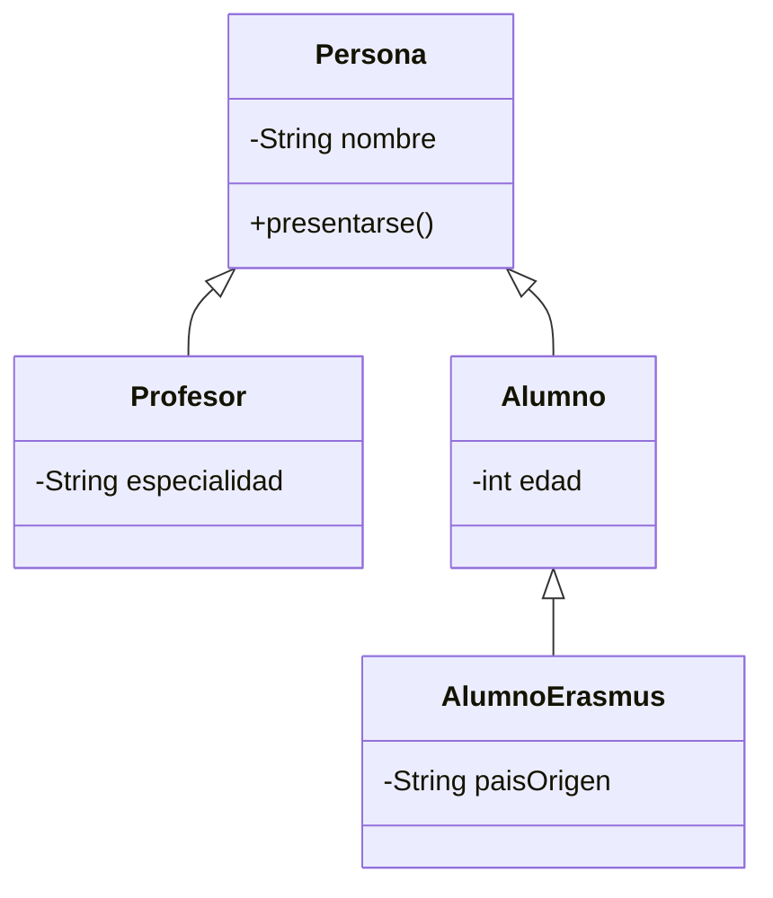
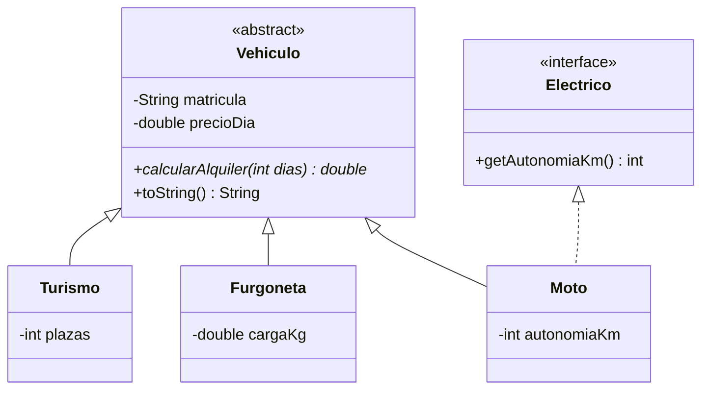

---
tags:
  - programacion
  - DAM1
unidad: 12
tema: Herencia, polimorfismo, clases abstractas e interfaces
---

# Unidad 12. Herencia y polimorfismo

> [!abstract] Objetivos de la unidad
> - Comprender el concepto de herencia y la relación «ES-UN».
> - Construir jerarquías de clases mediante `extends`.
> - Utilizar la palabra reservada `super` para acceder a los constructores y métodos de la superclase.
> - Aplicar correctamente los modificadores de acceso en la herencia.
> - Sobrescribir métodos con `@Override` y diferenciar sobrescritura y sobrecarga.
> - Comprender el polimorfismo, la vinculación dinámica y la conversión de tipos entre clases.
> - Definir y utilizar clases y métodos abstractos.
> - Definir e implementar interfaces.
> - Valorar cuándo es adecuado utilizar la herencia y cuándo no.

---

## 1. Concepto de herencia

### 1.1. Definición

> [!note] Definición: herencia
> La **herencia** es un mecanismo mediante el cual una clase derivada (**subclase** o **clase hija**) **adquiere los atributos y métodos** de otra clase (**superclase** o **clase padre**), pudiendo además **añadir** nuevos miembros y **modificar** el comportamiento heredado.

La herencia representa la relación **«ES-UN»**: si una clase `B` hereda de `A`, significa que **`B` es un tipo de `A`**. Un perro *es un* animal; un profesor *es una* persona; un turismo *es un* vehículo.

| Término | Sinónimos | Significado |
|---|---|---|
| **Superclase** | Clase padre, clase base | Clase de la que se hereda; define el comportamiento **general**. |
| **Subclase** | Clase hija, clase derivada | Clase que hereda; **especializa** el comportamiento. |

### 1.2. Finalidad

- **Reutilizar** el código común, que se escribe una sola vez en la superclase.
- **Especializar**: cada subclase añade o modifica solo lo que la diferencia.
- **Habilitar el polimorfismo**: tratar objetos de subclases distintas de forma uniforme (apartado 6).

### 1.3. Sintaxis: `extends`

Una clase hereda de otra mediante la palabra reservada **`extends`**:

```java
// Clase base (superclase)
public class Animal {
    protected String nombre;

    public Animal(String nombre) {
        this.nombre = nombre;
    }

    public void comer() {
        System.out.println(nombre + " está comiendo.");
    }

    public void dormir() {
        System.out.println(nombre + " está durmiendo.");
    }
}
```

```java
// Clase derivada (subclase): Perro ES UN Animal
public class Perro extends Animal {
    private String raza; // atributo propio

    public Perro(String nombre, String raza) {
        super(nombre);    // llama al constructor de la superclase
        this.raza = raza;
    }

    // Método propio
    public void ladrar() {
        System.out.println(nombre + " dice: ¡Guau!");
    }

    // Método heredado y redefinido
    @Override
    public void comer() {
        System.out.println(nombre + " (" + raza + ") come pienso.");
    }
}
```

```java
Perro perro = new Perro("Toby", "Beagle");
perro.dormir(); // heredado sin cambios:  Toby está durmiendo.
perro.comer();  // heredado y redefinido: Toby (Beagle) come pienso.
perro.ladrar(); // propio de Perro:       Toby dice: ¡Guau!
```

> [!info] Qué se hereda
> La subclase hereda todos los **atributos** y **métodos** de la superclase. Sin embargo:
> - Los miembros **`private`** se heredan (forman parte del objeto), pero **no son accesibles directamente** desde la subclase (apartado 3).
> - Los **constructores no se heredan**: cada clase define los suyos, aunque puede invocar los del padre con `super(...)`.

---

## 2. Jerarquías de clases

### 2.1. Estructura

Las **jerarquías** organizan las clases en una estructura **arborescente**: la raíz define el comportamiento más general y los niveles inferiores lo especializan progresivamente.



> [!note] Notación
> En UML, la herencia se representa con una **flecha de punta triangular hueca** que va de la subclase a la superclase (véase la [Unidad 14](14-diagramas-uml-y-su-paso-a-java.md)).

### 2.2. Herencia simple

- Java solo permite **herencia simple**: una clase puede extender **directamente a una única** clase padre.
- De este modo se evita el **problema del diamante** de la herencia múltiple: si una clase heredara de dos padres que definen el mismo método de forma distinta, sería ambiguo cuál utilizar.
- La reutilización de comportamiento procedente de varias fuentes se consigue mediante **interfaces** (apartado 8), ya que una clase puede implementar **varias**.

```java
public class Alumno extends Persona, Deportista { } // ERROR: herencia múltiple no permitida
```

### 2.3. La clase `Object`

Todas las clases de Java heredan, directa o indirectamente, de la clase **`java.lang.Object`**, que es la **raíz** de toda la jerarquía. Si una clase no indica `extends`, Java añade implícitamente `extends Object`.

Por ello, cualquier objeto dispone de los métodos definidos en `Object`, entre ellos:

| Método | Función | Comportamiento por defecto |
|---|---|---|
| `toString()` | Representación textual del objeto. | `NombreClase@código` |
| `equals(Object o)` | Comparación de igualdad. | Compara referencias (igual que `==`). |
| `hashCode()` | Código numérico asociado al objeto, usado por las colecciones. | Derivado de la identidad del objeto. |
| `getClass()` | Devuelve la clase real del objeto. | — |

> [!info] Relación con la unidad anterior
> Por esta razón, al redefinir `toString()` o `equals()` en la [Unidad 11](11-fundamentos-de-poo.md) se utilizó `@Override`: se estaban **sobrescribiendo** métodos heredados de `Object`.

---

## 3. Visibilidad en la herencia

### 3.1. Modificadores de acceso

| Modificador | Misma clase | Mismo paquete | Subclase (en otro paquete) | Resto de clases |
|---|:---:|:---:|:---:|:---:|
| `private` | ✓ | ✗ | ✗ | ✗ |
| *(sin modificador)* | ✓ | ✓ | ✗ | ✗ |
| `protected` | ✓ | ✓ | ✓ | ✗ |
| `public` | ✓ | ✓ | ✓ | ✓ |

> [!warning] Alcance de `protected`
> Un miembro `protected` es accesible desde las **subclases** (aunque estén en otro paquete) y desde las clases del **mismo paquete**, pero **no** desde cualquier clase de otro paquete. No equivale, por tanto, a `public`.

### 3.2. Acceso a los atributos del padre

Un atributo **`private`** de la superclase **no es accesible directamente** desde la subclase:

```java
public class Persona {
    private String nombre;
    public String getNombre() { return nombre; }
}

public class Alumno extends Persona {
    public void saludar() {
        System.out.println(nombre);       // ERROR: nombre es private en Persona
        System.out.println(getNombre());  // correcto: a través del getter heredado
    }
}
```

> [!tip] Práctica recomendada
> - Los atributos deben ser **`private`** para proteger el estado interno.
> - Si la subclase necesita acceder a un atributo del padre, puede hacerlo a través de ***getters* y *setters*** o declarando el atributo **`protected`**.
> - En sistemas grandes se prefiere **`private` + *getters*/*setters*** sobre `protected`, ya que `protected` expone el estado interno a todas las subclases y reduce el encapsulamiento.

---

## 4. La palabra reservada `super`

**`super`** hace referencia a la **superclase** del objeto actual. Tiene dos usos, análogos a los de `this` (véase la [Unidad 11](11-fundamentos-de-poo.md)).

### 4.1. Invocar el constructor de la superclase: `super(...)`

En el constructor de la subclase, **`super(...)`** llama al constructor del padre para **inicializar la parte heredada** del objeto.

```java
public class Persona {
    private String nombre;

    public Persona(String nombre) {
        this.nombre = nombre;
    }

    public String getNombre() {
        return nombre;
    }

    public void presentarse() {
        System.out.println("Hola, soy " + nombre + ".");
    }
}
```

```java
public class Profesor extends Persona {
    private String especialidad;

    public Profesor(String nombre, String especialidad) {
        super(nombre);                   // inicializa la parte heredada de Persona
        this.especialidad = especialidad;
    }

    public String getEspecialidad() {
        return especialidad;
    }

    @Override
    public void presentarse() {
        super.presentarse();             // reutiliza la implementación del padre
        System.out.println("Soy profesor de " + especialidad + ".");
    }
}
```

> [!danger] Reglas del lenguaje sobre `super(...)`
> - La llamada a `super(...)` debe ser **la primera instrucción** del constructor.
> - Si no se llama explícitamente a `super(...)`, Java **inserta automáticamente `super()`**, es decir, una llamada al constructor **sin parámetros** del padre.
> - Esto **falla** si la superclase no tiene constructor sin parámetros (por ejemplo, porque solo define `Persona(String nombre)`). En ese caso, la llamada a `super(...)` con los argumentos necesarios es **obligatoria**; de lo contrario, se produce un error de compilación.

### 4.2. Orden de construcción

Al crear un objeto de una subclase, los constructores se ejecutan **de arriba abajo** en la jerarquía: primero se construye la parte de la superclase y después la de la subclase.


### 4.3. Invocar un método de la superclase: `super.metodo()`

Cuando una subclase sobrescribe un método, puede invocar la **versión del padre** con `super.metodo()`. Así se **amplía** el comportamiento heredado en lugar de reescribirlo por completo, como en el método `presentarse()` de `Profesor`:

```java
Profesor p = new Profesor("Ana", "Matemáticas");
p.presentarse();
```

```
Hola, soy Ana.
Soy profesor de Matemáticas.
```

---

## 5. Sobrescritura de métodos

### 5.1. Concepto

> [!note] Definición: sobrescritura (*overriding*)
> La **sobrescritura** permite que una subclase **redefina un método heredado**, manteniendo la **misma firma** (nombre y parámetros) y un tipo de retorno compatible, para adaptar su comportamiento.

```java
public class Alumno extends Persona {
    private int edad;

    public Alumno(String nombre, int edad) {
        super(nombre);
        this.edad = edad;
    }

    @Override
    public void presentarse() {
        System.out.println("Hola, soy " + getNombre() + ", tengo " + edad + " años y soy alumno.");
    }
}
```

### 5.2. La anotación `@Override`

- **No es obligatoria**, pero se recomienda utilizarla siempre.
- Indica al compilador que el método es una **sobrescritura intencionada**. Si el método **no existe en el padre** (por ejemplo, por un error tipográfico como `presentarce()` o por parámetros distintos), el compilador muestra un error.
- Sin `@Override`, un error de este tipo crearía un **método nuevo** en lugar de sobrescribir el heredado, y el programa se comportaría de forma inesperada sin ningún aviso.

### 5.3. Reglas de la sobrescritura

| Regla | Descripción |
|---|---|
| Misma firma | Mismo nombre y misma lista de parámetros. |
| Tipo de retorno | Idéntico o un **subtipo** compatible (*covarianza de retorno*). |
| Visibilidad | Igual o **más permisiva**, nunca más restrictiva (un método `public` no puede sobrescribirse como `private`). |
| Métodos `private` | No se sobrescriben, ya que no son visibles en la subclase. |
| Métodos `static` | No se sobrescriben (pertenecen a la clase, no al objeto). |
| Métodos `final` | **No pueden** sobrescribirse (apartado 9). |

### 5.4. Sobrescritura frente a sobrecarga

Son conceptos distintos que suelen confundirse:

| Aspecto | Sobrecarga (*overloading*) | Sobrescritura (*overriding*) |
|---|---|---|
| Dónde | En la **misma clase** (o en la jerarquía) | En una **subclase** |
| Nombre | El mismo | El mismo |
| Parámetros | **Distintos** | **Idénticos** |
| Finalidad | Ofrecer variantes de una operación | Redefinir un comportamiento heredado |
| Resolución | En tiempo de **compilación** | En tiempo de **ejecución** |
| Unidad | [Unidad 9](09-metodos.md) | Esta unidad |

---

## 6. Polimorfismo

### 6.1. Concepto

> [!note] Definición: polimorfismo
> El **polimorfismo** (del griego «muchas formas») es la capacidad de **tratar objetos de subclases distintas de forma uniforme** a través del tipo de la superclase, de modo que **un mismo mensaje** (llamada a un método) produce **comportamientos diferentes** según el tipo real de cada objeto.

La herencia lo hace posible porque **una variable de tipo superclase puede referenciar a un objeto de cualquiera de sus subclases**: un profesor *es una* persona, así que puede almacenarse en una variable de tipo `Persona`.

```java
Persona p1 = new Profesor("Ana", "Matemáticas");
Persona p2 = new Alumno("Luis", 22);

// Mismo mensaje, comportamientos distintos
p1.presentarse(); // ejecuta Profesor.presentarse()
p2.presentarse(); // ejecuta Alumno.presentarse()
```

### 6.2. Tipo declarado y tipo real

En la instrucción `Persona p1 = new Profesor(...)` intervienen dos tipos:

| Tipo | Qué es | En el ejemplo | Determina |
|---|---|---|---|
| **Tipo declarado** (estático) | El tipo de la **variable** | `Persona` | **Qué métodos se pueden invocar** (lo comprueba el compilador). |
| **Tipo real** (dinámico) | La clase del **objeto** creado con `new` | `Profesor` | **Qué versión del método se ejecuta** (se decide en ejecución). |

```java
Persona p1 = new Profesor("Ana", "Matemáticas");
p1.presentarse();   // correcto: presentarse() existe en Persona → ejecuta la versión de Profesor
p1.getNombre();     // correcto: método de Persona
p1.getEspecialidad(); // ERROR de compilación: Persona no tiene ese método
```

> [!important] Vinculación dinámica
> La elección del método que se ejecuta se realiza **en tiempo de ejecución** según el **tipo real** del objeto. Este mecanismo se denomina **vinculación dinámica** (*dynamic binding*). El compilador solo verifica que el método exista en el **tipo declarado**.

### 6.3. Polimorfismo con colecciones

El polimorfismo resulta especialmente útil con arrays y colecciones: una lista del tipo de la superclase puede contener objetos de distintas subclases y tratarlos a todos por igual.

```java
import java.util.ArrayList;
import java.util.List;

public class Main {
    public static void main(String[] args) {
        List<Persona> personas = new ArrayList<>();
        personas.add(new Profesor("Ana", "Matemáticas"));
        personas.add(new Alumno("Luis", 22));
        personas.add(new Alumno("Marta", 19));

        for (Persona p : personas) {
            p.presentarse(); // polimorfismo en acción
        }
    }
}
```

Salida:

```
Hola, soy Ana.
Soy profesor de Matemáticas.
Hola, soy Luis, tengo 22 años y soy alumno.
Hola, soy Marta, tengo 19 años y soy alumno.
```

> [!tip] Ventaja principal: extensibilidad
> Si más adelante se añade una nueva subclase (`Conserje extends Persona`), el bucle anterior **funciona sin ninguna modificación**. El código que trabaja con la superclase no necesita conocer todas las subclases existentes.

### 6.4. Parámetros polimórficos

Un método que recibe un parámetro del tipo de la superclase acepta objetos de **cualquier subclase**:

```java
public static void darBienvenida(Persona persona) {
    System.out.println("Bienvenido/a al centro:");
    persona.presentarse(); // se ejecuta la versión del tipo real
}

darBienvenida(new Profesor("Ana", "Matemáticas"));
darBienvenida(new Alumno("Luis", 22));
```

---

## 7. Conversión de tipos entre clases

### 7.1. Conversión ascendente (*upcasting*)

Asignar un objeto de una subclase a una variable de la superclase es **siempre seguro** y **automático** (implícito), ya que todo profesor es una persona:

```java
Profesor profesor = new Profesor("Ana", "Matemáticas");
Persona persona = profesor; // upcasting implícito
```

### 7.2. Conversión descendente (*downcasting*)

Para acceder a los métodos **propios de la subclase** desde una variable de la superclase, hay que realizar una **conversión explícita** (*casting*):

```java
Persona persona = new Profesor("Ana", "Matemáticas");
Profesor profesor = (Profesor) persona; // downcasting explícito
System.out.println(profesor.getEspecialidad());
```

> [!danger] `ClassCastException`
> Si el objeto **no es realmente** del tipo al que se convierte, se produce la excepción `ClassCastException` en tiempo de ejecución (véase la [Unidad 10](10-errores-y-excepciones.md)):
> ```java
> Persona persona = new Alumno("Luis", 22);
> Profesor profesor = (Profesor) persona; // ERROR: un Alumno no es un Profesor
> ```

### 7.3. El operador `instanceof`

El operador **`instanceof`** comprueba si un objeto es de un tipo determinado (o de una de sus subclases) y devuelve un `boolean`. Permite realizar el *downcasting* de forma segura:

```java
for (Persona p : personas) {
    if (p instanceof Profesor) {
        Profesor prof = (Profesor) p;
        System.out.println("Especialidad: " + prof.getEspecialidad());
    }
}
```

Desde **Java 16**, el operador admite una forma abreviada (*pattern matching*) que comprueba el tipo y declara la variable convertida en una sola expresión:

```java
if (p instanceof Profesor prof) {
    System.out.println("Especialidad: " + prof.getEspecialidad());
}
```

> [!tip] Uso moderado de `instanceof`
> Un uso frecuente de `instanceof` suele indicar un diseño mejorable: en lugar de preguntar por el tipo de cada objeto y actuar en consecuencia, es preferible definir un método en la superclase y **sobrescribirlo** en cada subclase, dejando que el polimorfismo decida.

---

## 8. Clases y métodos abstractos

### 8.1. Concepto

En muchas jerarquías, la superclase representa un **concepto general** del que no tiene sentido crear objetos directamente. Por ejemplo, en una aplicación de dibujo existen círculos y rectángulos, pero no «figuras» genéricas. Además, la superclase no puede implementar ciertas operaciones: ¿cómo se calcula el área de una figura genérica?

> [!note] Definiciones
> - **Clase abstracta:** clase declarada con **`abstract`** que **no puede instanciarse**. Sirve como base común para sus subclases.
> - **Método abstracto:** método declarado con **`abstract`** que **no tiene cuerpo** (solo su cabecera, terminada en `;`). Las subclases concretas están **obligadas** a implementarlo.

### 8.2. Ejemplo

```java
public abstract class Figura {
    private String color;

    public Figura(String color) {
        this.color = color;
    }

    public String getColor() {
        return color;
    }

    // Métodos abstractos: cada figura los implementa a su manera
    public abstract double calcularArea();
    public abstract double calcularPerimetro();

    // Método concreto: común a todas las figuras
    public String describir() {
        return String.format("%s %s: área = %.2f, perímetro = %.2f",
                getClass().getSimpleName(), color, calcularArea(), calcularPerimetro());
    }
}
```

```java
public class Circulo extends Figura {
    private double radio;

    public Circulo(String color, double radio) {
        super(color);
        this.radio = radio;
    }

    @Override
    public double calcularArea() {
        return Math.PI * radio * radio;
    }

    @Override
    public double calcularPerimetro() {
        return 2 * Math.PI * radio;
    }
}
```

```java
public class Rectangulo extends Figura {
    private double base;
    private double altura;

    public Rectangulo(String color, double base, double altura) {
        super(color);
        this.base = base;
        this.altura = altura;
    }

    @Override
    public double calcularArea() {
        return base * altura;
    }

    @Override
    public double calcularPerimetro() {
        return 2 * (base + altura);
    }
}
```

```java
Figura f = new Figura("rojo");      // ERROR: Figura es abstracta, no puede instanciarse

Figura[] figuras = {
    new Circulo("rojo", 2),
    new Rectangulo("azul", 3, 4)
};
for (Figura fig : figuras) {
    System.out.println(fig.describir()); // polimorfismo
}
```

Salida (con configuración regional española):

```
Circulo rojo: área = 12,57, perímetro = 12,57
Rectangulo azul: área = 12,00, perímetro = 14,00
```

> [!info] Patrón de diseño
> El método `describir()` de `Figura` invoca a `calcularArea()`, que es abstracto. Esto es posible porque, en ejecución, siempre se trabaja con un objeto de una subclase concreta que **sí** lo implementa. La superclase define el **esquema común** y cada subclase aporta los **detalles**.

### 8.3. Reglas

| Regla | Descripción |
|---|---|
| Instanciación | Una clase abstracta **no puede instanciarse** con `new`. |
| Contenido | Puede tener atributos, constructores, métodos concretos y métodos abstractos. |
| Constructores | Tiene constructores, que las subclases invocan con `super(...)`. |
| Métodos abstractos | Si una clase tiene **al menos un** método abstracto, la clase **debe** declararse abstracta. |
| Subclases | Una subclase **concreta** debe implementar **todos** los métodos abstractos heredados; si no lo hace, debe declararse también `abstract`. |
| Uso como tipo | Puede utilizarse como tipo de variables, parámetros y colecciones (`List<Figura>`). |

---

## 9. El modificador `final` en la herencia

El modificador `final`, que en variables indica una constante (véase la [Unidad 2](02-variables-tipos-de-datos-y-memoria.md)), tiene también un significado en la herencia:

| Aplicado a | Efecto | Ejemplo |
|---|---|---|
| Una **clase** | **No puede tener subclases**. | `public final class String` |
| Un **método** | **No puede sobrescribirse** en las subclases. | `public final double calcularIva()` |
| Un **atributo** | Solo puede asignarse **una vez**. | `private final String dni;` |

> [!info] Clases `final` de la biblioteca estándar
> La clase `String` y las clases envoltorio (`Integer`, `Double`…) son `final`: no se pueden extender, lo que garantiza que su comportamiento no pueda alterarse.

---

## 10. Interfaces

### 10.1. Concepto

> [!note] Definición: interfaz
> Una **interfaz** es un **contrato** que define un conjunto de **métodos** que una clase se compromete a implementar, sin especificar (por lo general) cómo. Representa una **capacidad** o un **rol**: «*puede hacer*» algo.

Mientras que la herencia expresa **qué es** un objeto («un `Perro` **es un** `Animal`»), una interfaz expresa **qué puede hacer** («un `Pato` **puede** nadar y volar»).

### 10.2. Definición e implementación

Una interfaz se declara con **`interface`**, y una clase la implementa con **`implements`**:

```java
public interface Nadador {
    void nadar(); // implícitamente public y abstract
}
```

```java
public interface Volador {
    void volar();

    default void aterrizar() {  // método con implementación por defecto
        System.out.println("Aterrizando...");
    }
}
```

```java
public class Pato extends Animal implements Nadador, Volador {

    public Pato(String nombre) {
        super(nombre);
    }

    @Override
    public void nadar() {
        System.out.println(nombre + " nada en el estanque.");
    }

    @Override
    public void volar() {
        System.out.println(nombre + " vuela sobre el lago.");
    }
}
```

> [!important] Una clase puede implementar varias interfaces
> Aunque solo puede **extender una clase**, una clase puede **implementar varias interfaces**, separadas por comas. Así, Java obtiene la flexibilidad de la herencia múltiple sin el problema del diamante. Cuando se combinan, `extends` se escribe **antes** que `implements`.

### 10.3. Características de las interfaces

| Elemento | Características |
|---|---|
| **Métodos abstractos** | Sin cuerpo. Son implícitamente `public abstract`. |
| **Métodos `default`** | Con implementación por defecto (Java 8). Las clases pueden usarla o sobrescribirla. |
| **Métodos `static`** | Métodos de utilidad asociados a la interfaz (Java 8). |
| **Constantes** | Los atributos son implícitamente `public static final`. |
| **Instanciación** | No puede instanciarse. |
| **Constructores** | No tiene. |

### 10.4. Interfaces como tipo

Al igual que una clase abstracta, una interfaz puede utilizarse como **tipo** de variables, parámetros y colecciones, lo que permite el polimorfismo entre clases **no relacionadas por herencia**:

```java
public class Submarino implements Nadador {
    @Override
    public void nadar() {
        System.out.println("El submarino se sumerge.");
    }
}
```

```java
List<Nadador> nadadores = new ArrayList<>();
nadadores.add(new Pato("Donald"));
nadadores.add(new Submarino());   // un submarino no es un animal, pero puede nadar

for (Nadador n : nadadores) {
    n.nadar();
}
```

> [!example] Interfaces de la biblioteca estándar
> Java utiliza interfaces de forma extensiva:
> - **`List`**, **`Set`** y **`Map`**: `ArrayList` implementa `List`. Por eso se escribe `List<String> lista = new ArrayList<>();`, declarando la variable con el tipo de la interfaz (véase la [Unidad 13](13-relaciones-entre-clases.md)).
> - **`Comparable`**: define el orden natural de los objetos, utilizado por `Collections.sort()`.
> - **`AutoCloseable`**: permite usar un objeto en un *try-with-resources* (véase la [Unidad 10](10-errores-y-excepciones.md)).

### 10.5. Clase abstracta frente a interfaz

| Aspecto | Clase abstracta | Interfaz |
|---|---|---|
| Relación que expresa | «ES-UN» (identidad) | «PUEDE-HACER» (capacidad) |
| Palabra reservada | `extends` | `implements` |
| Número por clase | **Una** | **Varias** |
| Atributos | De cualquier tipo | Solo constantes (`public static final`) |
| Constructores | Sí | No |
| Métodos | Abstractos y concretos | Abstractos, `default` y `static` |
| Uso típico | Base común con estado y código compartido | Contrato que pueden cumplir clases no relacionadas |

> [!tip] Criterio de elección
> - Si las clases **comparten identidad, estado y código** (círculos y rectángulos son figuras con color): **clase abstracta**.
> - Si se quiere definir una **capacidad** que pueden tener clases de jerarquías distintas (patos y submarinos pueden nadar): **interfaz**.

---

## 11. Cuándo usar herencia y cuándo no

> [!tip] Cuándo SÍ usar herencia
> 1. **Especialización real del dominio:** la subclase representa una categoría más específica del mismo concepto (`Profesor` ES UNA `Persona`).
> 2. **Principio de sustitución de Liskov:** cualquier instancia de la subclase puede **sustituir** a la superclase sin romper el comportamiento esperado.
> 3. **Polimorfismo:** se necesita tratar objetos distintos de forma uniforme, pero con comportamientos diferentes.

> [!danger] Cuándo NO usar herencia (errores típicos)
> - **Reutilización de código:** una `Impresora` **no es** un `Ordenador`, aunque ambos tengan el método `encender()`. Si solo se quiere reutilizar código, se utiliza **composición**.
> - **Campos compartidos:** tener atributos similares **no** justifica una jerarquía.
> - **Componentes:** un `Motor` **no es** un `Coche`; el motor **forma parte** del coche (composición).
>
> **Regla:** la herencia modela **tipos**, no reutilización técnica.

> [!info] El test «ES-UN»
> Antes de utilizar `extends`, conviene formular la frase «*un B es un A*». Si suena falsa o forzada («un motor es un coche»), la relación correcta no es la herencia, sino alguna de las relaciones entre clases que se estudian en la [Unidad 13](13-relaciones-entre-clases.md) («un coche **tiene un** motor»).

---

## 12. Ejemplo integrador: flota de alquiler de vehículos

El siguiente ejemplo combina una clase abstracta, varias subclases concretas, una interfaz, sobrescritura, `super` y polimorfismo. Cada tipo de vehículo calcula el precio del alquiler de forma distinta, y algunos vehículos son eléctricos.



**`Vehiculo.java`** (clase abstracta):

```java
public abstract class Vehiculo {
    private String matricula;
    private double precioDia;

    public Vehiculo(String matricula, double precioDia) {
        this.matricula = matricula;
        this.precioDia = precioDia;
    }

    public String getMatricula() {
        return matricula;
    }

    public double getPrecioDia() {
        return precioDia;
    }

    // Cada tipo de vehículo calcula el alquiler a su manera
    public abstract double calcularAlquiler(int dias);

    @Override
    public String toString() {
        return getClass().getSimpleName() + " " + matricula;
    }
}
```

**`Electrico.java`** (interfaz):

```java
public interface Electrico {
    int getAutonomiaKm();
}
```

**`Turismo.java`**: descuento del 10 % a partir de 7 días.

```java
public class Turismo extends Vehiculo {
    private int plazas;

    public Turismo(String matricula, double precioDia, int plazas) {
        super(matricula, precioDia);
        this.plazas = plazas;
    }

    @Override
    public double calcularAlquiler(int dias) {
        double total = getPrecioDia() * dias;
        return (dias >= 7) ? total * 0.90 : total;
    }

    @Override
    public String toString() {
        return super.toString() + " (" + plazas + " plazas)";
    }
}
```

**`Furgoneta.java`**: suplemento de 5 € diarios por cada 500 kg de carga.

```java
public class Furgoneta extends Vehiculo {
    private double cargaKg;

    public Furgoneta(String matricula, double precioDia, double cargaKg) {
        super(matricula, precioDia);
        this.cargaKg = cargaKg;
    }

    @Override
    public double calcularAlquiler(int dias) {
        int tramos = (int) (cargaKg / 500);
        return (getPrecioDia() + tramos * 5) * dias;
    }

    @Override
    public String toString() {
        return super.toString() + " (" + (int) cargaKg + " kg)";
    }
}
```

**`Moto.java`**: eléctrica, con una tarifa plana por día.

```java
public class Moto extends Vehiculo implements Electrico {
    private int autonomiaKm;

    public Moto(String matricula, double precioDia, int autonomiaKm) {
        super(matricula, precioDia);
        this.autonomiaKm = autonomiaKm;
    }

    @Override
    public double calcularAlquiler(int dias) {
        return getPrecioDia() * dias;
    }

    @Override
    public int getAutonomiaKm() {
        return autonomiaKm;
    }
}
```

**`Main.java`**:

```java
import java.util.ArrayList;
import java.util.List;

public class Main {
    public static void main(String[] args) {
        List<Vehiculo> flota = new ArrayList<>();
        flota.add(new Turismo("1234-KLM", 40, 5));
        flota.add(new Furgoneta("5678-NPR", 60, 1200));
        flota.add(new Moto("9012-STV", 25, 110));

        int dias = 7;
        double ingresos = 0;

        System.out.println("Presupuesto para " + dias + " días:");
        for (Vehiculo v : flota) {
            double importe = v.calcularAlquiler(dias); // vinculación dinámica
            ingresos += importe;
            System.out.printf("  %-30s %8.2f€%n", v, importe);

            // Comprobación de una capacidad adicional mediante instanceof
            if (v instanceof Electrico e) {
                System.out.println("    ↳ eléctrico, autonomía: " + e.getAutonomiaKm() + " km");
            }
        }
        System.out.printf("Total si se alquila toda la flota: %.2f€%n", ingresos);
    }
}
```

Salida (con configuración regional española):

```
Presupuesto para 7 días:
  Turismo 1234-KLM (5 plazas)      252,00€
  Furgoneta 5678-NPR (1200 kg)     490,00€
  Moto 9012-STV                    175,00€
    ↳ eléctrico, autonomía: 110 km
Total si se alquila toda la flota: 917,00€
```

---

## 13. Resumen de la unidad

> [!summary] Ideas clave
> - La **herencia** (`extends`) permite que una subclase adquiera los atributos y métodos de una superclase; modela la relación **«ES-UN»**.
> - Java solo admite **herencia simple**; todas las clases heredan en última instancia de **`Object`**.
> - Los miembros `private` del padre no son accesibles en la subclase; se usan *getters* o `protected`. Los **constructores no se heredan**.
> - **`super(...)`** invoca al constructor del padre (primera instrucción); **`super.metodo()`** invoca la versión del padre de un método sobrescrito.
> - La **sobrescritura** redefine un método heredado con la misma firma; se marca con **`@Override`**. No debe confundirse con la **sobrecarga**.
> - El **polimorfismo** permite tratar objetos de distintas subclases mediante el tipo de la superclase; el método ejecutado depende del **tipo real** (vinculación dinámica).
> - El *upcasting* es implícito; el *downcasting* requiere conversión explícita y puede comprobarse con **`instanceof`**.
> - Una **clase abstracta** no se instancia y puede tener **métodos abstractos** que las subclases concretas deben implementar.
> - Una **interfaz** define un contrato de capacidades; una clase puede **implementar varias** con `implements`.
> - `final` impide extender una clase o sobrescribir un método.
> - La herencia modela **tipos**, no reutilización de código: si la relación es «TIENE-UN», se usa composición.

---

**Navegación:** Anterior: [Unidad 11. Fundamentos de POO](11-fundamentos-de-poo.md) · [Índice](../../../README.md) · Siguiente: [Unidad 13. Relaciones entre clases](13-relaciones-entre-clases.md)
