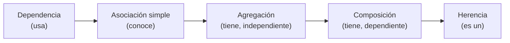
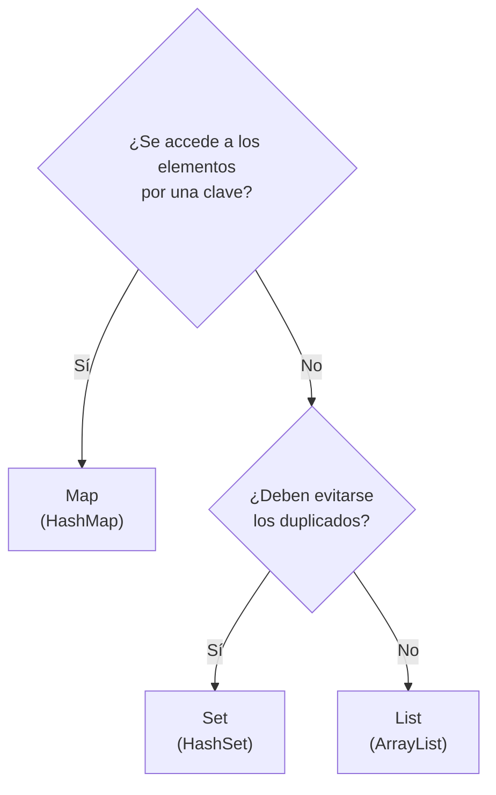
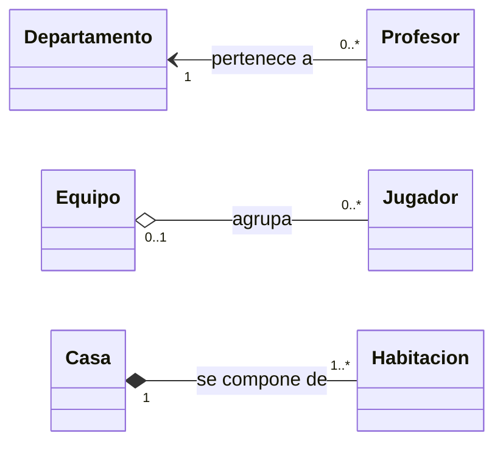
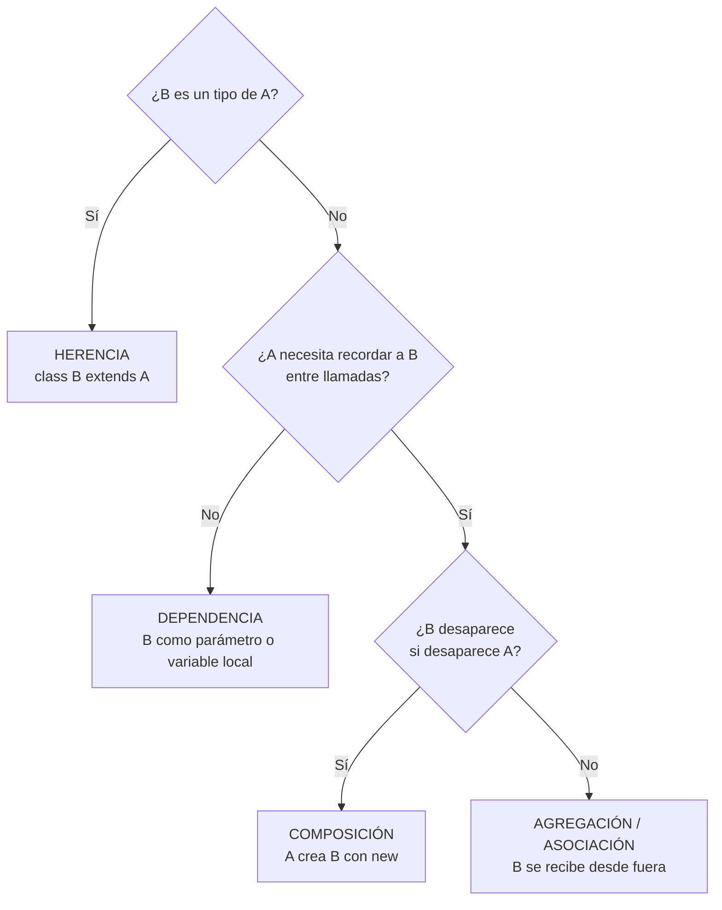
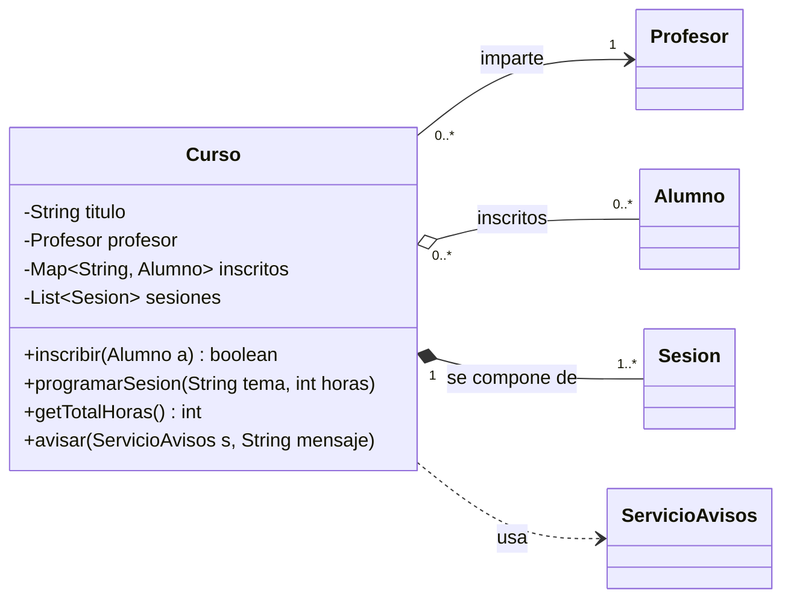

---
tags:
  - programacion
  - DAM1
unidad: 13
tema: Relaciones entre clases y colecciones
---

# Unidad 13. Relaciones entre clases

> [!abstract] Objetivos de la unidad
> - Comprender por qué las clases colaboran entre sí y la importancia de elegir el tipo de relación adecuado.
> - Clarificar los conceptos de estado, ciclo de vida y colección.
> - Utilizar las colecciones `List`, `Set` y `Map` para implementar relaciones de uno a muchos.
> - Distinguir e implementar la dependencia, la asociación simple, la composición y la agregación.
> - Interpretar e implementar la multiplicidad y la navegabilidad de una relación.
> - Aplicar la frontera entre «TIENE» y «USA» para decidir qué debe ser un atributo.
> - Seguir un procedimiento sistemático para seleccionar la relación correcta.

---

## 1. Introducción

En POO, las clases **no existen de forma aislada**: colaboran entre sí para modelar el dominio del problema. Un pedido pertenece a un cliente, un equipo tiene jugadores, una factura necesita calcular impuestos. La **calidad de un diseño** depende en gran medida de elegir el **tipo de relación correcto** para cada caso.

Existen tres grandes categorías de relaciones:

| Tipo | Expresión | Descripción |
|---|---|---|
| **Herencia** | ES-UN tipo de | Relación de **especialización** (véase la [Unidad 12](12-herencia-y-polimorfismo.md)). |
| **Asociación** | TIENE-UN | Una clase mantiene una **referencia a otra como parte de su estado**. Incluye la asociación simple, la agregación y la composición. |
| **Dependencia** | USA-UN | Una clase **utiliza** a otra de forma **puntual y temporal** (parámetro, variable local o valor de retorno). |

Ordenadas según la **fuerza del vínculo** entre las clases, de más débil a más fuerte:



---

## 2. Conceptos previos fundamentales

Para comprender correctamente las relaciones, es imprescindible clarificar tres conceptos.

> [!note] Estado del objeto
> El **estado** de un objeto es el conjunto de **valores almacenados en sus atributos** en un momento dado.
>
> Cuando se dice que «**B forma parte del estado de A**», significa que **A guarda una referencia a B como atributo**. Por ejemplo, si la clase `Pedido` tiene un atributo `Cliente cliente`, el cliente forma parte del estado del pedido.

> [!note] Ciclo de vida de un objeto
> El **ciclo de vida** comprende tres fases:
> 1. **Creación**, con `new`.
> 2. **Uso**, durante la ejecución.
> 3. **Destrucción**, cuando el recolector de basura lo elimina por no ser accesible.
>
> En las relaciones, el ciclo de vida indica si un objeto **puede existir independientemente** de otro.

> [!note] Colección
> Cuando la relación es de **uno a muchos**, se necesita una **colección** para agrupar múltiples objetos. Por ejemplo, un `Equipo` tiene muchos `Jugador`, por lo que necesita una `List<Jugador>`. Las colecciones más habituales son `List`, `Set` y `Map` (apartado 3).

---

## 3. Colecciones: `List`, `Set` y `Map`

### 3.1. El marco de colecciones de Java

Las **colecciones** son objetos que agrupan otros objetos y, a diferencia de los arrays, tienen **tamaño dinámico** (véase la [Unidad 8](08-arrays.md)). Pertenecen al paquete **`java.util`** y se organizan en torno a tres **interfaces** principales:

| Interfaz | Características | Implementación habitual | Ejemplo de uso |
|---|---|---|---|
| **`List`** | Secuencia **ordenada**, accesible por **índice**; **admite duplicados**. | `ArrayList` | Las líneas de un pedido, los jugadores de un equipo. |
| **`Set`** | Conjunto **sin duplicados**; sin acceso por índice. | `HashSet` | Las etiquetas de un artículo, los DNI registrados. |
| **`Map`** | Pares **clave → valor**; las claves son **únicas**. | `HashMap` | Alumnos indexados por DNI, stock de cada producto. |

> [!info] Genéricos: el tipo entre `< >`
> Las colecciones son **genéricas**: entre los símbolos `< >` se indica el **tipo de los elementos** que almacenan (`List<Jugador>`, `Map<String, Alumno>`). El compilador impide añadir elementos de otro tipo. Como solo admiten **objetos**, para los tipos primitivos se utilizan las **clases envoltorio**: `List<Integer>`, no `List<int>` (véase la [Unidad 2](02-variables-tipos-de-datos-y-memoria.md)).

> [!tip] Declarar con la interfaz
> Se recomienda declarar la variable con el tipo de la **interfaz** y crear el objeto con la **implementación**:
> ```java
> List<String> nombres = new ArrayList<>(); // recomendado
> ArrayList<String> nombres2 = new ArrayList<>(); // válido, pero menos flexible
> ```
> Así, el resto del código depende solo del contrato (`List`), y la implementación puede cambiarse sin modificarlo. Es una aplicación directa del polimorfismo (véase la [Unidad 12](12-herencia-y-polimorfismo.md)). El operador diamante `<>` evita repetir el tipo en el lado derecho.

### 3.2. `List` y `ArrayList`

| Método | Descripción |
|---|---|
| `add(elemento)` | Añade un elemento al final. |
| `add(indice, elemento)` | Inserta un elemento en la posición indicada. |
| `get(indice)` | Devuelve el elemento de una posición. |
| `set(indice, elemento)` | Sustituye el elemento de una posición. |
| `remove(indice)` / `remove(objeto)` | Elimina por posición o por valor. |
| `size()` | Número de elementos. |
| `contains(objeto)` | Indica si la lista contiene el elemento (usa `equals()`). |
| `indexOf(objeto)` | Posición del elemento, o `-1` si no está. |
| `isEmpty()` | Indica si la lista está vacía. |
| `clear()` | Elimina todos los elementos. |

```java
import java.util.ArrayList;
import java.util.List;

List<String> tareas = new ArrayList<>();
tareas.add("Estudiar POO");
tareas.add("Hacer la práctica");
tareas.add(0, "Revisar apuntes");      // inserta al principio

System.out.println(tareas);            // [Revisar apuntes, Estudiar POO, Hacer la práctica]
System.out.println(tareas.get(1));     // Estudiar POO
System.out.println(tareas.size());     // 3
tareas.remove("Estudiar POO");
System.out.println(tareas.contains("Estudiar POO")); // false
```

### 3.3. `Set` y `HashSet`

Un `Set` **no admite elementos duplicados**: si se intenta añadir un elemento que ya existe (según `equals()`), la operación se ignora y `add()` devuelve `false`.

```java
import java.util.HashSet;
import java.util.Set;

Set<String> etiquetas = new HashSet<>();
etiquetas.add("java");
etiquetas.add("poo");
boolean anadido = etiquetas.add("java"); // false: ya existía

System.out.println(etiquetas.size());      // 2
System.out.println(etiquetas.contains("poo")); // true
```

> [!warning] Orden en `HashSet` y `HashMap`
> `HashSet` y `HashMap` **no garantizan ningún orden** al recorrer sus elementos. Si se necesita mantener el **orden de inserción**, se utilizan `LinkedHashSet` y `LinkedHashMap`; si se necesita un **orden natural** (alfabético, numérico), `TreeSet` y `TreeMap`.

> [!important] `Set` con objetos propios
> Para que un `HashSet` detecte correctamente los duplicados de una clase propia, esta debe sobrescribir **`equals()` y `hashCode()`** (véase la [Unidad 11](11-fundamentos-de-poo.md)).

### 3.4. `Map` y `HashMap`

Un `Map` asocia **claves** únicas a **valores**. Permite recuperar un valor de forma muy eficiente a partir de su clave, sin recorrer toda la colección.

| Método | Descripción |
|---|---|
| `put(clave, valor)` | Añade un par; si la clave ya existía, **sustituye** su valor. |
| `get(clave)` | Devuelve el valor asociado, o `null` si la clave no existe. |
| `getOrDefault(clave, valorPorDefecto)` | Devuelve el valor asociado o el valor por defecto indicado. |
| `containsKey(clave)` | Indica si existe la clave. |
| `remove(clave)` | Elimina el par. |
| `keySet()` | Conjunto de claves. |
| `values()` | Colección de valores. |
| `entrySet()` | Conjunto de pares clave-valor. |
| `size()` | Número de pares. |

```java
import java.util.HashMap;
import java.util.Map;

Map<String, Integer> stock = new HashMap<>();
stock.put("Teclado", 10);
stock.put("Ratón", 25);
stock.put("Teclado", 8);                 // sustituye el valor anterior

System.out.println(stock.get("Teclado")); // 8
System.out.println(stock.get("Monitor")); // null
System.out.println(stock.getOrDefault("Monitor", 0)); // 0

// Recorrido de un Map
for (Map.Entry<String, Integer> entrada : stock.entrySet()) {
    System.out.println(entrada.getKey() + " → " + entrada.getValue());
}
```

### 3.5. Criterios de elección



---

## 4. Dependencia («USA-UN»)

### 4.1. Concepto

> [!note] Definición: dependencia
> La **dependencia** es la relación **más débil**. Una clase A **utiliza** a otra clase B **momentáneamente** para realizar una operación, pero **no la almacena como atributo**. B aparece únicamente como **parámetro** de un método, **variable local** o **tipo de retorno**.

```java
// La Factura DEPENDE de Impuesto, pero NO lo guarda como atributo
public class Factura {
    private double subtotal;

    public Factura(double subtotal) {
        this.subtotal = subtotal;
    }

    public double calcularTotal(Impuesto impuesto) {
        return subtotal + impuesto.aplicar(subtotal); // uso puntual
        // Al salir del método, la relación termina
    }
}
```

```java
public class Impuesto {
    private double porcentaje;

    public Impuesto(double porcentaje) {
        this.porcentaje = porcentaje;
    }

    public double aplicar(double base) {
        return base * porcentaje / 100;
    }
}
```

```java
Factura factura = new Factura(100);
System.out.println(factura.calcularTotal(new Impuesto(21))); // 121.0
System.out.println(factura.calcularTotal(new Impuesto(10))); // 110.0
```

> [!important] Regla fundamental
> **Si no se necesita recordar B entre llamadas a métodos, B no debe ser un atributo.** Si no es un atributo, la relación es una dependencia.

### 4.2. Formas en que aparece una dependencia

| Forma | Ejemplo |
|---|---|
| Parámetro de un método | `calcularTotal(Impuesto impuesto)` |
| Variable local | `Scanner consola = new Scanner(System.in);` dentro de un método |
| Tipo de retorno | `public Informe generarInforme()` |
| Invocación de un método estático | `Math.sqrt(x)` |

---

## 5. Asociación simple («TIENE-UN» / «CONOCE-A»)

### 5.1. Concepto

> [!note] Definición: asociación simple
> La **asociación simple** es una relación **estructural y estable** en la que A mantiene una **referencia a B como parte de su estado**, pero **ninguna de las dos controla el ciclo de vida de la otra**. Ambas pueden existir de forma **independiente**.

```java
// Un Profesor está asociado a un Departamento, pero ninguno controla al otro
public class Profesor {
    private String nombre;
    private Departamento departamento; // referencia estable (parte del estado)

    public Profesor(String nombre, Departamento departamento) {
        this.nombre = nombre;
        this.departamento = departamento; // se recibe desde fuera: ya existía
    }

    public Departamento getDepartamento() {
        return departamento;
    }

    public void setDepartamento(Departamento departamento) {
        this.departamento = departamento; // la asociación puede cambiar
    }
}
```

Si el `Profesor` desaparece, el `Departamento` sigue existiendo. Si el `Departamento` se elimina, el `Profesor` puede seguir existiendo, aunque ya no tenga departamento asignado.

### 5.2. Navegabilidad: asociaciones unidireccionales y bidireccionales

> [!note] Definición: navegabilidad
> La **navegabilidad** indica en qué **sentido** puede recorrerse una relación, es decir, qué clase **conoce** a la otra.

| Tipo | Implementación | Ejemplo |
|---|---|---|
| **Unidireccional** | Solo A tiene un atributo de tipo B. | El profesor conoce su departamento, pero el departamento no conoce a sus profesores. |
| **Bidireccional** | A tiene un atributo de tipo B y B tiene un atributo (o una colección) de tipo A. | El departamento también mantiene una `List<Profesor>`. |

> [!warning] Consistencia en las asociaciones bidireccionales
> En una asociación bidireccional, **ambos extremos deben mantenerse sincronizados**. Si se asigna un profesor a un departamento, hay que actualizar tanto el atributo del profesor como la lista del departamento; de lo contrario, los datos quedan incoherentes. Por su mayor complejidad, se recomienda utilizar asociaciones **unidireccionales** siempre que el problema lo permita.

---

## 6. Composición (asociación fuerte)

### 6.1. Concepto

> [!note] Definición: composición
> La **composición** es una forma de asociación en la que B es una **parte esencial** de A y **no tiene sentido fuera de él**. A **controla completamente el ciclo de vida** de B: **lo crea internamente** (con `new`) y, cuando A desaparece, B también desaparece.

Se expresa como «**está compuesto por**» o «**es parte de**»: una casa está compuesta por habitaciones; un pedido, por sus líneas; un libro, por sus capítulos.

```java
import java.util.ArrayList;
import java.util.List;

// Una Casa está COMPUESTA por Habitaciones.
// Las habitaciones no existen fuera de la casa.
public class Casa {
    private List<Habitacion> habitaciones;

    public Casa() {
        this.habitaciones = new ArrayList<>();
        // COMPOSICIÓN: la Casa crea las habitaciones con new
        this.habitaciones.add(new Habitacion("Cocina"));
        this.habitaciones.add(new Habitacion("Baño"));
    }

    public boolean addHabitacion(String tipo) {
        return habitaciones.add(new Habitacion(tipo)); // también hace new
    }

    public int getNumeroHabitaciones() {
        return habitaciones.size();
    }
}
```

```java
public class Habitacion {
    private String tipo;

    public Habitacion(String tipo) {
        this.tipo = tipo;
    }

    public String getTipo() {
        return tipo;
    }
}
```

> [!info] Rasgos que identifican la composición en el código
> - El objeto contenedor **crea** las partes con `new` (en el constructor o en sus métodos).
> - Los métodos del contenedor reciben los **datos** necesarios para crear la parte (`addHabitacion(String tipo)`), no la parte ya creada.
> - Las partes **no se comparten** con otros objetos ni se exponen para ser modificadas desde fuera.

> [!tip] Proteger las partes: no exponer la colección interna
> Si un método devuelve directamente la lista interna, el código externo podría añadir o eliminar partes sin control, rompiendo el encapsulamiento. Es preferible devolver una **copia no modificable**:
> ```java
> public List<Habitacion> getHabitaciones() {
>     return List.copyOf(habitaciones); // copia inmutable (Java 10)
> }
> ```

---

## 7. Agregación (asociación débil)

### 7.1. Concepto

> [!note] Definición: agregación
> La **agregación** es una forma de asociación en la que B **puede existir de forma independiente** de A. A solo mantiene una **referencia** a B, que **ya existía externamente**: no lo crea. B puede ser **compartido** por varios objetos A.

Se expresa como «**tiene**» o «**agrupa**»: un equipo agrupa jugadores; una biblioteca, libros; una lista de reproducción, canciones.

```java
import java.util.ArrayList;
import java.util.List;

// Un Equipo AGREGA Jugadores.
// Los jugadores pueden existir sin el equipo y cambiar de equipo.
public class Equipo {
    private String nombre;
    private List<Jugador> jugadores;

    public Equipo(String nombre) {
        this.nombre = nombre;
        this.jugadores = new ArrayList<>();
    }

    // AGREGACIÓN: el jugador viene de fuera, no se crea aquí
    public void ficharJugador(Jugador j) {
        this.jugadores.add(j); // solo guarda la referencia
    }

    public void darDeBaja(Jugador j) {
        this.jugadores.remove(j); // el jugador sigue existiendo
    }
}
```

```java
Jugador jugador = new Jugador("Laia", 10);     // el jugador existe por sí mismo
Equipo equipoA = new Equipo("Atlètic Llevant");
equipoA.ficharJugador(jugador);

equipoA.darDeBaja(jugador);                    // deja el equipo…
Equipo equipoB = new Equipo("CE Ponent");
equipoB.ficharJugador(jugador);                // …y ficha por otro: sigue siendo el mismo objeto
```

### 7.2. Diferencias entre composición y agregación

| Criterio | Composición | Agregación |
|---|---|---|
| ¿Quién crea B? | **La clase A** (con `new` interno) | **Externo** (se pasa por parámetro) |
| ¿Tiene sentido B sin A? | **No** | **Sí** |
| ¿Puede B compartirse? | **No** | **Sí** |
| Ciclo de vida de B | **Depende totalmente** de A | **Independiente** |
| Símbolo UML | Rombo **relleno** (◆) en el lado de A | Rombo **vacío** (◇) en el lado de A |
| Ejemplo | `Casa` ◆— `Habitacion` | `Equipo` ◇— `Jugador` |

> [!example] Casos para practicar la distinción
> | Relación | Tipo | Justificación |
> |---|---|---|
> | `Pedido` — `LineaPedido` | Composición | Una línea no tiene sentido sin su pedido. |
> | `Pedido` — `Cliente` | Asociación | El cliente existe antes y después del pedido. |
> | `Universidad` — `Facultad` | Composición | Las facultades no existen fuera de su universidad. |
> | `Facultad` — `Profesor` | Agregación | El profesor puede cambiar de facultad. |
> | `Playlist` — `Cancion` | Agregación | Una canción puede estar en varias listas. |
> | `Coche` — `Motor` | Composición | En el modelo habitual, el motor forma parte del coche. |

> [!info] La elección depende del dominio
> El tipo de relación no es una propiedad absoluta de las clases, sino del **problema que se modela**. En una aplicación de un desguace, donde los motores se desmontan y se venden por separado, la relación `Coche` — `Motor` sería una **agregación**.

---

## 8. Multiplicidad

### 8.1. Concepto

> [!note] Definición: multiplicidad
> La **multiplicidad** (o cardinalidad) es una propiedad de la **relación** (no de la clase) que indica **cuántas instancias** de una clase pueden relacionarse con **una instancia** de la otra.

| Notación | Significado | Implementación en Java |
|---|---|---|
| `1` | Exactamente una instancia. | Un **atributo** del tipo correspondiente, obligatorio (se recibe en el constructor). |
| `0..1` | Una instancia **opcional**. | Un **atributo** que puede valer **`null`**. |
| `*` o `0..*` | **Cero o muchas** instancias. | Una **colección** (`List`, `Set`, `Map`). |
| `1..*` | **Una o muchas** instancias. | Una **colección** con la restricción de **no estar vacía**. |
| `n..m` | Entre *n* y *m* instancias. | Una colección cuyo tamaño se valida. |

### 8.2. Lectura de la multiplicidad

La multiplicidad se escribe en **cada extremo** de la relación y se lee desde la clase del extremo opuesto:



- «Un profesor pertenece a **exactamente un** departamento; un departamento puede tener **cero o muchos** profesores».
- «Un equipo agrupa **cero o muchos** jugadores; un jugador está en **como máximo un** equipo».
- «Una casa se compone de **una o más** habitaciones; cada habitación pertenece a **exactamente una** casa».

### 8.3. Implementación de las restricciones

```java
public class Profesor {
    private Departamento departamento; // multiplicidad 1: obligatorio
    private Profesor tutor;            // multiplicidad 0..1: opcional (puede ser null)

    public Profesor(Departamento departamento) {
        if (departamento == null) {
            throw new IllegalArgumentException("Todo profesor debe pertenecer a un departamento.");
        }
        this.departamento = departamento;
        this.tutor = null;
    }
}
```

---

## 9. La frontera entre «TIENE» y «USA»

Distinguir correctamente entre «tiene» y «usa» es una de las claves del diseño orientado a objetos profesional. Esta frontera determina si algo debe ser un **atributo** de la clase o simplemente un **parámetro** de método.

| Tipo | Definición y características | Ejemplo |
|---|---|---|
| **TIENE** (asociación) | B **forma parte del estado** de A. Se almacena como **atributo**. La relación es **persistente** mientras A exista. | Un `Pedido` **tiene** un `Cliente`. |
| **USA** (dependencia) | B solo aparece **dentro de una operación** concreta. **No es atributo**. La relación termina al salir del método. | Una `Factura` **usa** un `Impuesto` para calcular el total. |

> [!important] Regla de diseño fundamental
> - Si una clase solo necesita a otra para ejecutar **una única operación** y no necesita recordarla entre llamadas, **no debe ser un atributo**.
> - Solo aquello que define el **estado persistente** del objeto se almacena como atributo.
> - Crear atributos innecesarios **aumenta el acoplamiento** y dificulta el mantenimiento.

> [!note] Definición: acoplamiento
> El **acoplamiento** es el **grado de dependencia** entre las clases de un sistema. Un bajo acoplamiento es deseable: cuanto menos dependan las clases unas de otras, más fácil resulta modificarlas, reutilizarlas y probarlas de forma independiente.

---

## 10. Guía rápida: ¿qué relación usar?

1. ¿Es una relación «**es un tipo de**»? (Un coche es un vehículo) → **Herencia**.
2. ¿Necesita A **guardar** a B para recordarlo en el futuro?
   - **No** → **Dependencia** (parámetro de método).
   - **Sí** → es una **asociación**: pasar a la pregunta 3.
3. Si A desaparece, ¿debería desaparecer B automáticamente?
   - **Sí** → **Composición** (A hace `new B`).
   - **No** → **Agregación** o **asociación simple** (B se pasa por parámetro).



### Tabla resumen

| Relación | Frase | ¿Atributo? | ¿Quién crea B? | Ciclo de vida de B | Símbolo UML |
|---|---|:---:|---|---|---|
| **Dependencia** | A **usa** B | No | Cualquiera | Independiente | Flecha discontinua `- - ->` |
| **Asociación** | A **conoce** a B | Sí | Externo | Independiente | Línea continua `——>` |
| **Agregación** | A **tiene / agrupa** B | Sí | Externo | Independiente | Rombo vacío ◇ |
| **Composición** | A **se compone de** B | Sí | A | Dependiente de A | Rombo relleno ◆ |
| **Herencia** | B **es un** A | — | — | — | Triángulo hueco △ |

> [!note] Alcance
> La notación UML completa de las relaciones se estudia en la [Unidad 14](14-diagramas-uml-y-su-paso-a-java.md).

---

## 11. Ejemplo integrador: gestión de una academia

El siguiente ejemplo modela un curso de una academia e integra los cuatro tipos de relación:

| Relación | Clases | Justificación |
|---|---|---|
| **Asociación** (1) | `Curso` → `Profesor` | El profesor existe por sí mismo y puede impartir varios cursos. |
| **Agregación** (0..*) | `Curso` ◇— `Alumno` | Los alumnos existen antes de inscribirse y pueden estar en varios cursos. Se indexan por DNI en un `Map` para evitar duplicados. |
| **Composición** (1..*) | `Curso` ◆— `Sesion` | Las sesiones solo existen dentro de su curso: el curso las crea. |
| **Dependencia** | `Curso` - - > `ServicioAvisos` | Solo se utiliza para enviar avisos; no se guarda como atributo. |



**`Profesor.java`** y **`Alumno.java`**: existen de forma independiente.

```java
public class Profesor {
    private String nombre;

    public Profesor(String nombre) {
        this.nombre = nombre;
    }

    public String getNombre() {
        return nombre;
    }
}
```

```java
public class Alumno {
    private String dni;
    private String nombre;
    private String email;

    public Alumno(String dni, String nombre, String email) {
        this.dni = dni;
        this.nombre = nombre;
        this.email = email;
    }

    public String getDni() {
        return dni;
    }

    public String getNombre() {
        return nombre;
    }

    public String getEmail() {
        return email;
    }
}
```

**`Sesion.java`**: parte de un curso.

```java
public class Sesion {
    private int numero;
    private String tema;
    private int horas;

    public Sesion(int numero, String tema, int horas) {
        this.numero = numero;
        this.tema = tema;
        this.horas = horas;
    }

    public int getHoras() {
        return horas;
    }

    @Override
    public String toString() {
        return "Sesión " + numero + ": " + tema + " (" + horas + " h)";
    }
}
```

**`ServicioAvisos.java`**: clase utilizada de forma puntual.

```java
public class ServicioAvisos {
    public void enviar(String destinatario, String mensaje) {
        System.out.println("  [aviso a " + destinatario + "] " + mensaje);
    }
}
```

**`Curso.java`**: concentra las cuatro relaciones.

```java
import java.util.ArrayList;
import java.util.HashMap;
import java.util.List;
import java.util.Map;

public class Curso {
    private String titulo;
    private Profesor profesor;               // ASOCIACIÓN (multiplicidad 1)
    private Map<String, Alumno> inscritos;   // AGREGACIÓN (0..*), indexados por DNI
    private List<Sesion> sesiones;           // COMPOSICIÓN (1..*)

    public Curso(String titulo, Profesor profesor, String temaInicial, int horasIniciales) {
        if (profesor == null) {
            throw new IllegalArgumentException("Todo curso necesita un profesor.");
        }
        this.titulo = titulo;
        this.profesor = profesor;            // se recibe desde fuera
        this.inscritos = new HashMap<>();
        this.sesiones = new ArrayList<>();
        programarSesion(temaInicial, horasIniciales); // 1..*: al menos una sesión
    }

    // AGREGACIÓN: el alumno ya existe; solo se guarda su referencia
    public boolean inscribir(Alumno alumno) {
        if (inscritos.containsKey(alumno.getDni())) {
            return false; // ya estaba inscrito
        }
        inscritos.put(alumno.getDni(), alumno);
        return true;
    }

    // COMPOSICIÓN: el curso crea la sesión a partir de sus datos
    public void programarSesion(String tema, int horas) {
        sesiones.add(new Sesion(sesiones.size() + 1, tema, horas));
    }

    public int getTotalHoras() {
        int total = 0;
        for (Sesion s : sesiones) {
            total += s.getHoras();
        }
        return total;
    }

    // DEPENDENCIA: el servicio se recibe como parámetro y no se almacena
    public void avisar(ServicioAvisos servicio, String mensaje) {
        for (Alumno a : inscritos.values()) {
            servicio.enviar(a.getEmail(), titulo + ": " + mensaje);
        }
    }

    public List<Sesion> getSesiones() {
        return List.copyOf(sesiones); // no se expone la lista interna
    }

    public void mostrarResumen() {
        System.out.println(titulo + " — impartido por " + profesor.getNombre());
        System.out.println("Alumnos inscritos: " + inscritos.size());
        for (Sesion s : sesiones) {
            System.out.println("  " + s);
        }
        System.out.println("Duración total: " + getTotalHoras() + " h");
    }
}
```

**`Main.java`**:

```java
public class Main {
    public static void main(String[] args) {
        // Objetos independientes: existen antes que el curso
        Profesor profesora = new Profesor("Marta Vidal");
        Alumno a1 = new Alumno("11111111A", "Joan", "joan@correo.com");
        Alumno a2 = new Alumno("22222222B", "Aina", "aina@correo.com");

        Curso curso = new Curso("Java desde cero", profesora, "Introducción", 2);
        curso.programarSesion("POO", 4);
        curso.programarSesion("Colecciones", 3);

        curso.inscribir(a1);
        curso.inscribir(a2);
        boolean repetido = curso.inscribir(a1); // no se admite duplicado
        System.out.println("¿Se ha inscrito dos veces a Joan? " + repetido);

        curso.mostrarResumen();

        System.out.println("Envío de avisos:");
        curso.avisar(new ServicioAvisos(), "la sesión 2 se traslada al aula 5.");
    }
}
```

Salida (el orden de los avisos puede variar, ya que `HashMap` no garantiza el orden):

```
¿Se ha inscrito dos veces a Joan? false
Java desde cero — impartido por Marta Vidal
Alumnos inscritos: 2
  Sesión 1: Introducción (2 h)
  Sesión 2: POO (4 h)
  Sesión 3: Colecciones (3 h)
Duración total: 9 h
Envío de avisos:
  [aviso a aina@correo.com] Java desde cero: la sesión 2 se traslada al aula 5.
  [aviso a joan@correo.com] Java desde cero: la sesión 2 se traslada al aula 5.
```

---

## 12. Resumen de la unidad

> [!summary] Ideas clave
> - Las clases colaboran mediante **herencia** (ES-UN), **asociación** (TIENE-UN) y **dependencia** (USA-UN).
> - Las relaciones de uno a muchos se implementan con **colecciones**: **`List`** (ordenada, con duplicados), **`Set`** (sin duplicados) y **`Map`** (clave → valor). Se declaran con la interfaz: `List<T> x = new ArrayList<>();`.
> - En la **dependencia**, B solo aparece como parámetro, variable local o retorno; **no es atributo**.
> - En la **asociación simple**, A guarda una referencia a B, pero ninguna controla el ciclo de vida de la otra.
> - En la **composición** (◆), A **crea** a B con `new` y controla su ciclo de vida: B no tiene sentido sin A.
> - En la **agregación** (◇), B **existe previamente**, se recibe por parámetro y puede compartirse.
> - La **multiplicidad** indica cuántas instancias participan: `1` → atributo obligatorio; `0..1` → atributo que puede ser `null`; `*` → colección.
> - La **navegabilidad** indica qué clase conoce a la otra; las asociaciones bidireccionales exigen mantener ambos extremos sincronizados.
> - **Solo lo que define el estado persistente es un atributo**: si B solo se necesita en una operación, es una dependencia.

---

**Navegación:** Anterior: [Unidad 12. Herencia y polimorfismo](12-herencia-y-polimorfismo.md) · [Índice](../../../README.md) · Siguiente: [Unidad 14. Diagramas UML y su paso a Java](14-diagramas-uml-y-su-paso-a-java.md)
