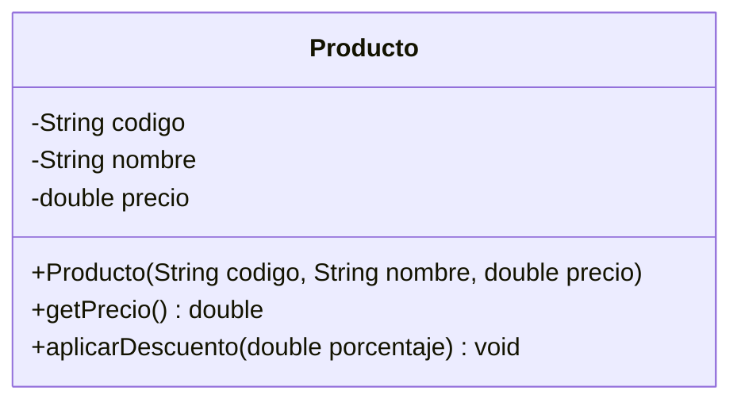
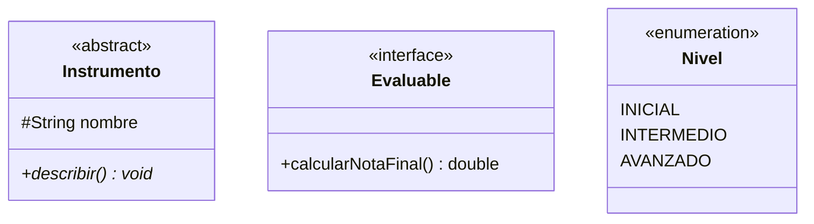
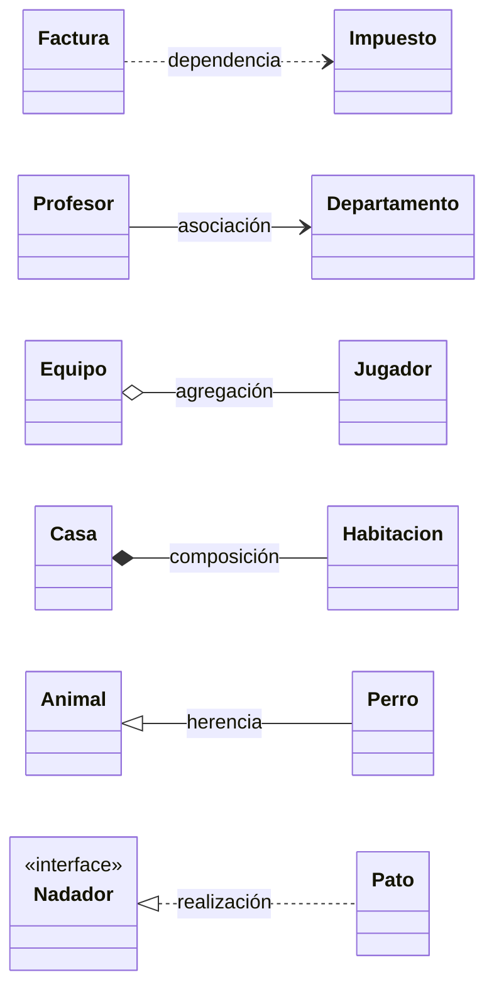
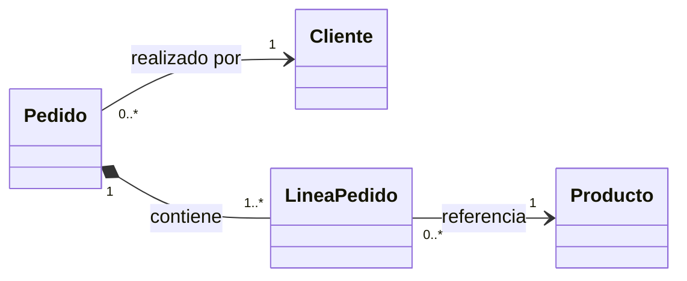
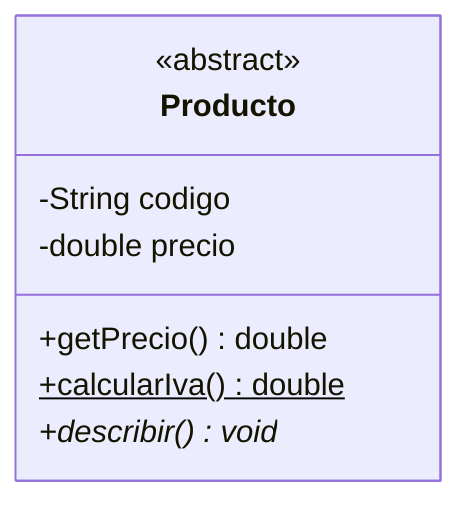
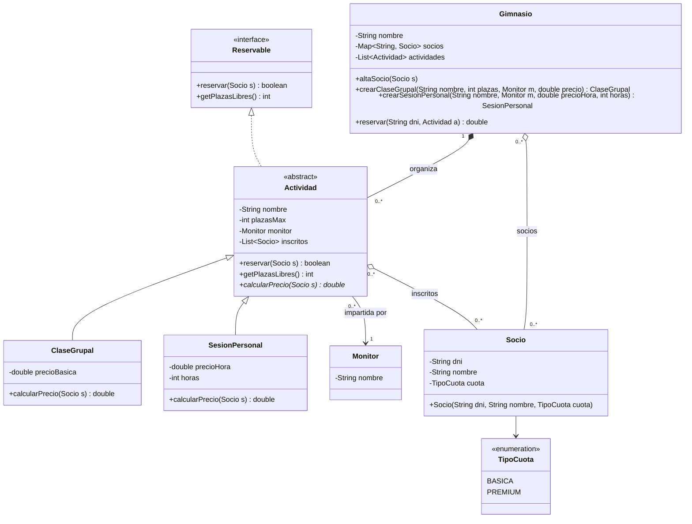

---
tags:
  - java
  - programacion
  - dam1
  - poo
  - uml
unidad: 14
tema: Diagrama de clases UML e implementación en Java
---

# Unidad 14. Diagramas UML y su paso a Java

> [!abstract] Objetivos de la unidad
> - Conocer qué es UML, su finalidad y los principales tipos de diagramas.
> - Representar clases, interfaces y enumeraciones en un diagrama de clases.
> - Interpretar la visibilidad y la sintaxis UML de atributos y métodos.
> - Reconocer la notación de todas las relaciones entre clases, su multiplicidad y su navegabilidad.
> - Utilizar enumeraciones y paquetes en Java.
> - Traducir de forma sistemática un diagrama de clases a código Java.
> - Dibujar diagramas de clases en Obsidian mediante Mermaid.

---

## 1. El lenguaje UML

### 1.1. Definición

> [!note] Definición: UML
> El **Lenguaje Unificado de Modelado** (**UML**, *Unified Modeling Language*) es un **estándar visual** de propósito general, controlado por el **Object Management Group** (**OMG**). Su objetivo es **especificar, visualizar, construir y documentar** los artefactos de los sistemas de software.

UML **no es un método de desarrollo**, sino una **notación común** que permite a analistas y programadores comunicarse mediante planos de diseño universales, **independientemente del lenguaje de programación** o de la plataforma.

> [!tip] Analogía
> Un diagrama UML es al software lo que un **plano** es a un edificio: permite discutir, revisar y corregir el diseño **antes de construir**, cuando los cambios son baratos. El código Java es la **materialización** de ese plano.

### 1.2. Tipos de diagramas

| Categoría | Contenido | Diagramas principales |
|---|---|---|
| **Diagramas de estructura** | Modelan los elementos que componen el sistema y su **organización estática**. | Clases, objetos, paquetes, componentes, despliegue |
| **Diagramas de comportamiento** | Modelan la **dinámica** y el flujo de ejecución. | Casos de uso, actividades, estados, secuencia |

En esta unidad se estudia el **diagrama de clases**, el más utilizado en el diseño orientado a objetos: describe las **clases** del sistema, sus **atributos y métodos** y las **relaciones** entre ellas.

---

## 2. Representación de una clase

### 2.1. Los tres compartimentos

Una clase UML se representa como un **rectángulo dividido en tres secciones**:

| Sección | Contenido |
|---|---|
| **Superior** | **Nombre** de la clase, en *PascalCase* y en negrita. |
| **Central** | **Atributos**, con su visibilidad y tipo. |
| **Inferior** | **Métodos** (operaciones), con su visibilidad, parámetros y tipo de retorno. |



> [!info] Nivel de detalle
> En las fases iniciales del diseño es habitual omitir atributos y métodos, o representar solo el nombre de la clase. En los diagramas de implementación, en cambio, se detallan por completo.

### 2.2. Estereotipos: clases abstractas, interfaces y enumeraciones

Un **estereotipo** es una etiqueta entre comillas angulares (`«...»`) que precisa la naturaleza de un elemento:

| Notación | Significado |
|---|---|
| `«abstract»` o nombre en *cursiva* | **Clase abstracta**: no puede instanciarse directamente. |
| `«interface»` | **Interfaz**: define un contrato de operaciones sin implementación. |
| `«enumeration»` | **Enumeración**: conjunto cerrado de valores constantes. |



---

## 3. Visibilidad

| Símbolo UML | Modificador Java | Significado |
|:---:|---|---|
| `+` | `public` | Accesible desde cualquier clase. |
| `-` | `private` | Visible solo dentro de la propia clase. |
| `#` | `protected` | Visible en la clase, sus subclases y el mismo paquete. |
| `~` | *(sin modificador)* | Visible dentro del mismo paquete. |

> [!tip] Criterio general de traducción
> - **Atributos:** casi siempre `-` (`private`), para proteger el estado interno.
> - **Métodos de la API pública:** `+` (`public`).
> - **Miembros que deben usar las subclases:** `#` (`protected`).
> - **Métodos auxiliares internos:** `-` (`private`).

---

## 4. Sintaxis de atributos y métodos

### 4.1. Formato UML

```
// Atributos:  visibilidad nombre: Tipo [= valorInicial] [{restricción}]
- codigo: String {readOnly}
- precio: double {precio > 0}
- iva: double = 0.21
- estado: EstadoPedido
- lineas: List<LineaPedido>

// Métodos:    visibilidad nombre(parámetro: Tipo): TipoRetorno
+ calcularTotal(): double
+ Pedido(id: int, cliente: Cliente)            // constructor: sin tipo de retorno
+ calcular(base: double): double {static}      // método estático (subrayado)
# aplicarDescuento(): void {abstract}          // método abstracto (en cursiva)
```

> [!warning] El orden nombre-tipo se invierte
> En UML se escribe **primero el nombre y después el tipo** (`precio: double`), mientras que en Java es al revés (`double precio`). Es un error frecuente al traducir un diagrama:
> | UML | Java |
> |---|---|
> | `- precio: double` | `private double precio;` |
> | `+ getPrecio(): double` | `public double getPrecio() { ... }` |
> | `+ setPrecio(precio: double): void` | `public void setPrecio(double precio) { ... }` |

> [!info] Notación simplificada
> Muchas herramientas (incluida Mermaid) aceptan también el orden de Java (`-double precio`). Ambas notaciones son habituales; lo importante es mantener la coherencia dentro de un mismo diagrama.

### 4.2. Modificadores y restricciones

| Modificador | Significado | Equivalencia Java |
|---|---|---|
| `{readOnly}` | El atributo no puede modificarse tras la creación. | `final` (y sin *setter*) |
| `{static}` o <u>subrayado</u> | El atributo o método pertenece a la clase, no a la instancia. | `static` |
| `{abstract}` o *cursiva* | El método no tiene implementación en esta clase. | `abstract` |
| `= valor` | Valor inicial del atributo. | Inicialización en la declaración |
| `{condición}` | Restricción que deben cumplir los valores. | Validación en el constructor y los *setters* |

---

## 5. Tipos de datos y colecciones en UML

| Tipo UML | Descripción | Implementación Java |
|---|---|---|
| `List<T>` | Colección **ordenada**, con duplicados. | `ArrayList` (o `LinkedList`) |
| `Set<T>` | Colección **sin duplicados**. | `HashSet` |
| `Map<K,V>` | Estructura **clave-valor**. | `HashMap` |
| `T[]` | **Array** de tamaño fijo. | `T[]` |

> [!tip] Desacoplamiento con interfaces de colección
> La buena práctica es declarar los atributos con la **interfaz** como tipo, no con la implementación concreta (véase la [Unidad 13](13-relaciones-entre-clases.md)):
> ```java
> private List<String> nombres = new ArrayList<>(); // declarar como List, instanciar como ArrayList
> ```
> Esto permite cambiar la implementación (de `ArrayList` a `LinkedList`, por ejemplo) sin modificar el resto del código.

### 5.1. Elección de la implementación

| Colección | Cuándo usarla |
|---|---|
| `ArrayList<T>` | **Caso general.** Acceso por índice muy rápido, admite duplicados y conserva el orden de inserción. |
| `HashSet<T>` | Cuando la **unicidad** es importante. Búsqueda muy rápida. |
| `HashMap<K,V>` | Cuando se necesita **buscar por un identificador único** (DNI, código…). |
| `LinkedList<T>` | Inserciones y eliminaciones frecuentes **al inicio o en medio** de la lista. |

---

## 6. Enumeraciones

### 6.1. Concepto

> [!note] Definición: enumeración
> Una **enumeración** (`enum`) es un tipo especial que define un **conjunto cerrado y fijo de valores constantes** con nombre.

Son adecuadas cuando un atributo solo puede tomar **unos pocos valores conocidos de antemano**: los estados de un pedido, los niveles de un curso, los días de la semana, los tipos de cuota.

> [!tip] Ventaja frente a cadenas o números
> Representar un estado como `String estado = "enviado"` permite errores como `"enviao"` o `"ENVIADO"`, que el compilador no detecta. Con una enumeración, **solo** se admiten los valores definidos, y cualquier error tipográfico produce un **error de compilación**.

### 6.2. Definición y uso

```java
public enum EstadoPedido {
    PENDIENTE, PAGADO, ENVIADO, ENTREGADO, CANCELADO
}
```

```java
EstadoPedido estado = EstadoPedido.PENDIENTE;

if (estado == EstadoPedido.PENDIENTE) {        // los valores enum se comparan con ==
    estado = EstadoPedido.PAGADO;
}

String descripcion = switch (estado) {         // uso en switch (sin prefijo)
    case PENDIENTE -> "Esperando el pago";
    case PAGADO, ENVIADO -> "En curso";
    case ENTREGADO -> "Completado";
    case CANCELADO -> "Anulado";
};

for (EstadoPedido e : EstadoPedido.values()) { // recorrer todos los valores
    System.out.println(e.ordinal() + " → " + e);
}

EstadoPedido desdeTexto = EstadoPedido.valueOf("ENVIADO"); // conversión desde String
```

| Método | Devuelve |
|---|---|
| `values()` | Array con todos los valores, en orden de declaración. |
| `valueOf(String)` | El valor cuyo nombre coincide con la cadena (lanza `IllegalArgumentException` si no existe). |
| `name()` / `toString()` | El nombre del valor como cadena. |
| `ordinal()` | La posición del valor en la declaración, empezando por 0. |

> [!info] `switch` exhaustivo con enumeraciones
> En una expresión `switch` sobre una enumeración, si se contemplan **todos** los valores, el caso `default` no es necesario (véase la [Unidad 6](06-estructuras-condicionales.md)).

### 6.3. Enumeraciones con atributos

Una enumeración puede tener **atributos, un constructor y métodos**, lo que permite asociar datos a cada valor:

```java
public enum TipoCuota {
    BASICA(30.0), PREMIUM(50.0), ESTUDIANTE(20.0);

    private final double precioMensual;

    TipoCuota(double precioMensual) {   // constructor (implícitamente private)
        this.precioMensual = precioMensual;
    }

    public double getPrecioMensual() {
        return precioMensual;
    }
}
```

```java
System.out.println(TipoCuota.PREMIUM.getPrecioMensual()); // 50.0
```

---

## 7. Notación de las relaciones

### 7.1. Símbolos

| Relación | Representación | Símbolo | Frase |
|---|---|:---:|---|
| **Dependencia** | Línea **discontinua** con flecha abierta hacia el tipo utilizado. | `╌╌>` | A **usa** B |
| **Asociación** | Línea **continua**, con flecha abierta si es navegable. | `——>` | A **conoce** a B |
| **Agregación** | Línea continua con **rombo vacío** en el lado del «todo». | `◇——` | A **tiene** B |
| **Composición** | Línea continua con **rombo relleno** en el lado del «todo». | `◆——` | A **se compone de** B |
| **Herencia** (generalización) | Línea **continua** con **triángulo vacío** hacia la superclase. | `——▷` | B **es un** A |
| **Realización** | Línea **discontinua** con **triángulo vacío** hacia la interfaz. | `╌╌▷` | B **implementa** A |



> [!tip] Regla mnemotécnica
> - Las líneas **discontinuas** indican relaciones **débiles o de contrato** (dependencia y realización).
> - Los **rombos** siempre se dibujan en el lado del **todo** (el contenedor).
> - Los **triángulos** siempre apuntan hacia el **tipo más general** (superclase o interfaz).

### 7.2. Multiplicidad y navegabilidad

La **multiplicidad** se escribe en los **extremos** de las líneas de relación (véase la [Unidad 13](13-relaciones-entre-clases.md)). La **navegabilidad** (la punta de flecha) indica en qué **sentido** una clase conoce a la otra.

> [!important] Regla de navegabilidad
> - Si **A → B** (A conoce a B), dentro de A habrá un **atributo de tipo B** (o una **colección** de B, según la multiplicidad).
> - Dentro de B **no** habrá ninguna referencia a A: la flecha no va en ese sentido.
> - Se priorizan las asociaciones **unidireccionales** para evitar la complejidad de sincronizar referencias bidireccionales.



Lectura: un pedido es realizado por **exactamente un** cliente (y un cliente puede tener **cero o muchos** pedidos); un pedido se compone de **una o más** líneas; cada línea referencia a **un** producto. `Pedido` conoce a `Cliente`, pero `Cliente` no conoce sus pedidos.

### 7.3. Notas y restricciones

Las **notas** UML (rectángulos con la esquina doblada) expresan **reglas de negocio** importantes que no pueden representarse con la notación estándar. Las restricciones simples se escriben directamente en el atributo, entre llaves:

```
- cantidad: int {readOnly} {cantidad > 0}
- edadMinima: int {edadMinima >= 0}
- precio: double {precio > 0}
```

En el código, estas restricciones se traducen en **validaciones** en el constructor y en los métodos que modifican el estado (apartado 9.6).

---

## 8. Paquetes

### 8.1. En UML

Los **paquetes** agrupan clases relacionadas lógicamente para **modularizar** el diagrama y reflejar la estructura del proyecto. Se representan como **carpetas con pestaña**.

### 8.2. En Java

En Java, los paquetes (`package`) corresponden a **carpetas** del proyecto. Cada archivo indica, en su primera línea, el paquete al que pertenece, y para utilizar una clase de otro paquete se utiliza `import`:

```
src/
└── botiga/
    ├── Main.java                 → package botiga;
    ├── model/
    │   ├── Producto.java         → package botiga.model;
    │   ├── Pedido.java           → package botiga.model;
    │   └── EstadoPedido.java     → package botiga.model;
    └── utils/
        └── Validador.java        → package botiga.utils;
```

```java
package botiga;              // primera línea: paquete de esta clase

import botiga.model.Pedido;  // importación de una clase de otro paquete
import botiga.model.*;       // importación de todas las clases de un paquete

public class Main {
    public static void main(String[] args) {
        // ...
    }
}
```

| Aspecto | Convención |
|---|---|
| Nombre | Siempre en **minúsculas**, sin espacios ni guiones. |
| Estructura profesional | Dominio invertido de la organización: `com.empresa.proyecto.model`. |
| Organización habitual | `model` (clases del dominio), `dao` (acceso a datos), `utils` (utilidades), `ui` o `app` (interfaz y `main`). |

> [!info] Paquetes y visibilidad
> La visibilidad por defecto (sin modificador, `~` en UML) y `protected` dependen de los paquetes: un miembro sin modificador solo es accesible desde clases **del mismo paquete** (véase la [Unidad 12](12-herencia-y-polimorfismo.md)).

---

## 9. Implementación: del diagrama UML al código Java

El diagrama UML es el **plano arquitectónico**; el código Java es su **materialización**. Este apartado describe las correspondencias directas entre cada elemento UML y su implementación.

### 9.1. Tipos de clase

```java
// Clase normal
public class Pedido { }

// Clase abstracta
public abstract class Instrumento { }

// Interfaz
public interface Evaluable {
    double calcularNotaFinal();
}

// Enumeración
public enum Nivel { INICIAL, INTERMEDIO, AVANZADO }
```

### 9.2. Atributos y visibilidad

```java
// - id: int {readOnly}
private final int id;

// - nombre: String
private String nombre;

// - estado: EstadoPedido
private EstadoPedido estado;

// - lineas: List<LineaPedido>   (composición, multiplicidad 1..*)
private final List<LineaPedido> lineas;
```

> [!note] `final` en una colección
> Declarar `final` el atributo `lineas` impide **reasignar** la variable a otra lista, pero **no** impide añadir o eliminar elementos de la lista existente.

### 9.3. Multiplicidad

| Multiplicidad UML | Atributo Java |
|---|---|
| `1` | `private T atributo;` (obligatorio: se recibe en el constructor y se valida que no sea `null`) |
| `0..1` | `private T atributo = null;` |
| `*` o `0..*` | `private List<T> atributos = new ArrayList<>();` |
| `1..*` | `private List<T> atributos;` (se garantiza que nunca quede vacía) |

### 9.4. Composición frente a agregación en el código

```java
// COMPOSICIÓN: A hace new B internamente
public boolean addLinea(Producto producto, int cantidad, double precio) {
    if (estado == EstadoPedido.CANCELADO) return false;
    LineaPedido nueva = new LineaPedido(producto, cantidad, precio); // new
    return lineas.add(nueva);
}

// AGREGACIÓN: A recibe B desde fuera (no hace new)
public void aplicarCupon(CuponDescuento cupon) {
    this.cupon = cupon; // solo guarda la referencia, no crea el objeto
}
```

### 9.5. Herencia, clases abstractas e interfaces

```java
// Clase abstracta con método abstracto
public abstract class Instrumento {
    protected final String nombre;
    protected double precioAlquiler;

    public Instrumento(String nombre, double precio) {
        this.nombre = nombre;
        this.precioAlquiler = precio;
    }

    public abstract void describir(); // sin implementación
}
```

```java
// Subclase que implementa el método abstracto
public class Guitarra extends Instrumento {
    private String tipoCuerdas;

    public Guitarra(String nombre, double precio, String tipoCuerdas) {
        super(nombre, precio);
        this.tipoCuerdas = tipoCuerdas;
    }

    @Override
    public void describir() {
        System.out.println("Guitarra: " + nombre + ", cuerdas: " + tipoCuerdas);
    }
}
```

### 9.6. Validaciones

Las **restricciones** del diagrama se traducen en **validaciones** que protegen al objeto de estados imposibles. Se aplican en el **constructor** o en los **métodos que modifican el estado**:

```java
// Validación en el constructor
public ArticuloCatalogo(String codigo, String nombre, double precio) {
    if (precio < 0) {
        this.precio = 0;
    } else {
        this.precio = precio;
    }
    this.codigo = codigo;
    this.nombre = nombre;
}

// Validación en un método (devuelve boolean para indicar el éxito)
public boolean addLinea(Producto p, int cantidad, double precio) {
    if (estado == EstadoPedido.CANCELADO) return false;
    if (cantidad <= 0) return false;
    lineas.add(new LineaPedido(p, cantidad, precio));
    return true;
}
```

> [!important] Excepciones en lugar de valores especiales
> El estándar en Java es **lanzar excepciones** en lugar de devolver `false` (o corregir el valor en silencio) cuando se produce un error:
> ```java
> if (precio < 0) throw new IllegalArgumentException("El precio debe ser positivo");
> ```
> Las excepciones permiten situar la validación en la clase que **conoce la restricción**, no en la clase que invoca al método, lo que aumenta la robustez del sistema (véase la [Unidad 10](10-errores-y-excepciones.md)).

### 9.7. Procedimiento de traducción

Para implementar un diagrama completo de forma ordenada, se recomienda seguir estos pasos:

1. **Crear los paquetes** indicados en el diagrama.
2. **Implementar primero los elementos sin dependencias**: enumeraciones e interfaces.
3. **Implementar las clases** empezando por las que no dependen de otras (las «hojas» de las flechas de asociación) y, en las jerarquías, **de la superclase hacia las subclases**.
4. En cada clase, traducir en este orden: **atributos** (con su visibilidad, `final` y multiplicidad), **constructores** (con sus validaciones), ***getters* y *setters*** necesarios y **métodos de negocio**.
5. Implementar cada **relación** según su tipo: composición con `new` interno, agregación y asociación por parámetro, dependencia como parámetro de método.
6. Añadir `toString()` y, si procede, `equals()` y `hashCode()`.
7. Escribir una **clase principal** que cree objetos y compruebe el funcionamiento.

### 9.8. Tabla de referencia rápida UML → Java

| Elemento UML | Equivalencia Java |
|---|---|
| Clase normal | `public class NombreClase { }` |
| Clase abstracta | `public abstract class NombreClase { }` |
| Interfaz | `public interface NombreInterfaz { }` |
| Enumeración | `public enum NombreEnum { VAL1, VAL2 }` |
| Atributo `- nombre: Tipo` | `private Tipo nombre;` |
| `{readOnly}` | `private final Tipo nombre;` |
| `+ metodo(): Retorno` | `public Retorno metodo() { }` |
| `# metodo(): void` | `protected void metodo() { }` |
| Método abstracto | `public abstract Retorno metodo();` |
| `{static}` | `public static Retorno metodo() { }` |
| Herencia | `extends SuperClase` |
| Realización de interfaz | `implements NombreInterfaz` |
| Multiplicidad `1` | `private T atributo;` |
| Multiplicidad `0..1` | `private T atributo = null;` |
| Multiplicidad `*` | `private List<T> atributos = new ArrayList<>();` |
| Composición (crea) | `this.parte = new Parte(...);` |
| Agregación (recibe) | `this.parte = parte;` (referencia externa) |
| Dependencia (usa) | Parámetro de un método, no atributo de la clase |

---

## 10. Diagramas de clases en Obsidian con Mermaid

Obsidian dibuja de forma nativa los diagramas escritos en **Mermaid**, un lenguaje textual. Basta con escribir un bloque de código de tipo `mermaid` que empiece por `classDiagram`. Todos los diagramas de estos apuntes se han creado así.

### 10.1. Sintaxis básica

````

````

| Elemento | Sintaxis Mermaid |
|---|---|
| Atributo | `-String nombre` |
| Método con retorno | `+getPrecio() double` |
| Método estático (subrayado) | `+metodo()$` |
| Método abstracto (cursiva) | `+metodo()*` |
| Tipo genérico | `List~String~` (se muestra como `List<String>`) |
| Estereotipo | `<<interface>>`, `<<abstract>>`, `<<enumeration>>` |
| Orientación horizontal | `direction LR` en la segunda línea |

### 10.2. Relaciones

| Relación | Sintaxis Mermaid | Ejemplo |
|---|---|---|
| Herencia | `A <\|-- B` | `Animal <\|-- Perro` |
| Realización | `A <\|.. B` | `Nadador <\|.. Pato` |
| Composición | `A *-- B` | `Casa *-- Habitacion` |
| Agregación | `A o-- B` | `Equipo o-- Jugador` |
| Asociación navegable | `A --> B` | `Profesor --> Departamento` |
| Dependencia | `A ..> B` | `Factura ..> Impuesto` |
| Multiplicidad y etiqueta | `A "1" *-- "1..*" B : texto` | `Pedido "1" *-- "1..*" LineaPedido : contiene` |

> [!info] Otras herramientas
> Además de Mermaid, existen herramientas específicas para el modelado UML, como **draw.io** (diagrams.net), **PlantUML**, **StarUML** o **Visual Paradigm**.

---

## 11. Ejemplo integrador: del diagrama al código

A continuación se implementa paso a paso el diagrama de clases de un sistema de reservas de un gimnasio.

### 11.1. Diagrama



> [!note] Reglas de negocio (notas del diagrama)
> - Una **clase grupal** es gratuita para los socios `PREMIUM`; los socios `BASICA` pagan el precio indicado.
> - Una **sesión personal** tiene una única plaza; su precio es `precioHora × horas`, con un 20 % de descuento para los socios `PREMIUM`.
> - Un socio no puede reservar dos veces la misma actividad ni una actividad sin plazas libres.

### 11.2. Análisis del diagrama

| Elemento del diagrama | Decisión de implementación |
|---|---|
| `TipoCuota` «enumeration» | `enum` con dos valores. |
| `Reservable` «interface» | `interface` con dos métodos abstractos. |
| `Actividad` «abstract» realiza `Reservable` | `public abstract class Actividad implements Reservable`. |
| `calcularPrecio()*` | Método abstracto; lo implementan las subclases. |
| `Actividad → Monitor` (1) | Atributo `Monitor` obligatorio, recibido en el constructor. |
| `Actividad o-- Socio` (0..*) | `List<Socio>` que recibe socios ya existentes (agregación). |
| `Gimnasio *-- Actividad` | El gimnasio **crea** las actividades con `new` en sus métodos (composición). |
| `Gimnasio o-- Socio` | `Map<String, Socio>` indexado por DNI; los socios se reciben desde fuera. |

### 11.3. Código

**`TipoCuota.java`** y **`Reservable.java`**: primero, los elementos sin dependencias.

```java
public enum TipoCuota {
    BASICA, PREMIUM
}
```

```java
public interface Reservable {
    boolean reservar(Socio s);
    int getPlazasLibres();
}
```

**`Socio.java`** y **`Monitor.java`**:

```java
public class Socio {
    private final String dni;   // {readOnly}
    private String nombre;
    private TipoCuota cuota;

    public Socio(String dni, String nombre, TipoCuota cuota) {
        this.dni = dni;
        this.nombre = nombre;
        this.cuota = cuota;
    }

    public String getDni() {
        return dni;
    }

    public String getNombre() {
        return nombre;
    }

    public TipoCuota getCuota() {
        return cuota;
    }
}
```

```java
public class Monitor {
    private String nombre;

    public Monitor(String nombre) {
        this.nombre = nombre;
    }

    public String getNombre() {
        return nombre;
    }
}
```

**`Actividad.java`**: clase abstracta que realiza la interfaz.

```java
import java.util.ArrayList;
import java.util.List;

public abstract class Actividad implements Reservable {
    private String nombre;
    private int plazasMax;
    private Monitor monitor;          // asociación, multiplicidad 1
    private List<Socio> inscritos;    // agregación, multiplicidad 0..*

    public Actividad(String nombre, int plazasMax, Monitor monitor) {
        if (plazasMax <= 0) {
            throw new IllegalArgumentException("Las plazas deben ser positivas.");
        }
        if (monitor == null) {
            throw new IllegalArgumentException("Toda actividad necesita un monitor.");
        }
        this.nombre = nombre;
        this.plazasMax = plazasMax;
        this.monitor = monitor;
        this.inscritos = new ArrayList<>();
    }

    @Override
    public boolean reservar(Socio s) {
        if (getPlazasLibres() == 0 || inscritos.contains(s)) {
            return false;
        }
        return inscritos.add(s);  // agregación: se guarda la referencia recibida
    }

    @Override
    public int getPlazasLibres() {
        return plazasMax - inscritos.size();
    }

    public abstract double calcularPrecio(Socio s);

    public String getNombre() {
        return nombre;
    }

    @Override
    public String toString() {
        return String.format("%-18s %-8s plazas libres: %d",
                nombre, monitor.getNombre(), getPlazasLibres());
    }
}
```

**`ClaseGrupal.java`** y **`SesionPersonal.java`**: subclases concretas.

```java
public class ClaseGrupal extends Actividad {
    private double precioBasica;

    public ClaseGrupal(String nombre, int plazasMax, Monitor monitor, double precioBasica) {
        super(nombre, plazasMax, monitor);
        this.precioBasica = precioBasica;
    }

    @Override
    public double calcularPrecio(Socio s) {
        return (s.getCuota() == TipoCuota.PREMIUM) ? 0 : precioBasica;
    }
}
```

```java
public class SesionPersonal extends Actividad {
    private double precioHora;
    private int horas;

    public SesionPersonal(String nombre, Monitor monitor, double precioHora, int horas) {
        super(nombre, 1, monitor);   // una sesión personal tiene una única plaza
        this.precioHora = precioHora;
        this.horas = horas;
    }

    @Override
    public double calcularPrecio(Socio s) {
        double precio = precioHora * horas;
        return (s.getCuota() == TipoCuota.PREMIUM) ? precio * 0.80 : precio;
    }
}
```

**`Gimnasio.java`**: composición de actividades y agregación de socios.

```java
import java.util.ArrayList;
import java.util.HashMap;
import java.util.List;
import java.util.Map;

public class Gimnasio {
    private String nombre;
    private Map<String, Socio> socios;       // agregación, indexada por DNI
    private List<Actividad> actividades;     // composición

    public Gimnasio(String nombre) {
        this.nombre = nombre;
        this.socios = new HashMap<>();
        this.actividades = new ArrayList<>();
    }

    public void altaSocio(Socio s) {
        socios.put(s.getDni(), s);
    }

    // COMPOSICIÓN: el gimnasio crea sus actividades
    public ClaseGrupal crearClaseGrupal(String nombre, int plazas, Monitor m, double precio) {
        ClaseGrupal clase = new ClaseGrupal(nombre, plazas, m, precio);
        actividades.add(clase);
        return clase;
    }

    public SesionPersonal crearSesionPersonal(String nombre, Monitor m, double precioHora, int horas) {
        SesionPersonal sesion = new SesionPersonal(nombre, m, precioHora, horas);
        actividades.add(sesion);
        return sesion;
    }

    // Devuelve el precio de la reserva o lanza una excepción si no es posible
    public double reservar(String dni, Actividad actividad) {
        Socio socio = socios.get(dni);
        if (socio == null) {
            throw new IllegalArgumentException("No existe ningún socio con DNI " + dni);
        }
        if (!actividad.reservar(socio)) {
            throw new IllegalStateException("No se puede reservar " + actividad.getNombre()
                    + " para " + socio.getNombre());
        }
        return actividad.calcularPrecio(socio);   // polimorfismo
    }

    public void mostrarActividades() {
        System.out.println("Actividades de " + nombre + ":");
        for (Actividad a : actividades) {
            System.out.println("  " + a);
        }
    }
}
```

**`Main.java`**:

```java
public class Main {
    public static void main(String[] args) {
        Gimnasio gym = new Gimnasio("FitCentre");

        Monitor laura = new Monitor("Laura");
        Monitor pere = new Monitor("Pere");

        gym.altaSocio(new Socio("111A", "Nuria", TipoCuota.PREMIUM));
        gym.altaSocio(new Socio("222B", "Marc", TipoCuota.BASICA));

        Actividad spinning = gym.crearClaseGrupal("Spinning", 2, laura, 6.0);
        Actividad personal = gym.crearSesionPersonal("Entreno personal", pere, 25.0, 2);

        System.out.printf("Nuria, Spinning: %.2f€%n", gym.reservar("111A", spinning));
        System.out.printf("Marc, Spinning: %.2f€%n", gym.reservar("222B", spinning));
        System.out.printf("Nuria, Entreno personal: %.2f€%n", gym.reservar("111A", personal));

        try {
            gym.reservar("222B", personal);   // sin plazas libres
        } catch (IllegalStateException e) {
            System.out.println("Error: " + e.getMessage());
        }

        gym.mostrarActividades();
    }
}
```

Salida (con configuración regional española):

```
Nuria, Spinning: 0,00€
Marc, Spinning: 6,00€
Nuria, Entreno personal: 40,00€
Error: No se puede reservar Entreno personal para Marc
Actividades de FitCentre:
  Spinning           Laura    plazas libres: 0
  Entreno personal   Pere     plazas libres: 0
```

---

## 12. Resumen de la unidad

> [!summary] Ideas clave
> - **UML** es una notación visual estándar para especificar y documentar software; el **diagrama de clases** describe las clases, sus miembros y sus relaciones.
> - Una clase se dibuja con **tres compartimentos**: nombre, atributos y métodos. Los estereotipos `«abstract»`, `«interface»` y `«enumeration»` precisan su naturaleza.
> - Visibilidad: **`+`** public, **`-`** private, **`#`** protected, **`~`** paquete.
> - En UML se escribe `nombre: Tipo`; en Java, `Tipo nombre`. `{readOnly}` → `final`; `{static}` → `static`; cursiva → `abstract`.
> - Las **enumeraciones** (`enum`) representan conjuntos cerrados de valores y evitan errores con cadenas.
> - Relaciones: dependencia `╌╌>`, asociación `——>`, agregación `◇`, composición `◆`, herencia `——▷` y realización `╌╌▷`.
> - Si **A → B**, A tiene un atributo de tipo B (o una colección, según la multiplicidad), y B no conoce a A.
> - Los **paquetes** agrupan clases relacionadas; en Java se declaran con `package` y se importan con `import`.
> - La traducción de un diagrama sigue un orden: enumeraciones e interfaces, clases independientes, superclases, subclases y clase principal.
> - Obsidian dibuja diagramas de clases con bloques **Mermaid** `classDiagram`.

---

**Navegación:** Anterior: [Unidad 13. Relaciones entre clases](13-relaciones-entre-clases.md) · [Índice](00-indice.md) · Siguiente: [Unidad 15. Lectura y escritura de ficheros](15-lectura-y-escritura-de-ficheros.md)
