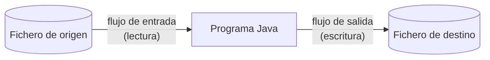
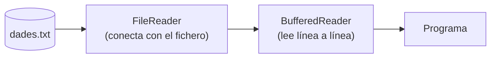
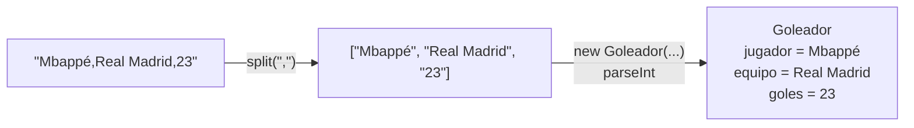

---
tags:
  - java
  - programacion
  - dam1
  - ficheros
unidad: 15
tema: Lectura y escritura de ficheros
---

# Unidad 15. Lectura y escritura de ficheros

> [!abstract] Objetivos de la unidad
> - Comprender la necesidad de la persistencia de datos y el papel de los ficheros.
> - Conocer los conceptos de flujo, fichero de texto y fichero binario, y los tipos de rutas.
> - Leer ficheros de texto línea a línea con `FileReader` y `BufferedReader`.
> - Escribir ficheros de texto con `FileWriter` y `BufferedWriter`, sobrescribiendo o añadiendo contenido.
> - Cerrar correctamente los ficheros mediante *try-with-resources* y gestionar las excepciones de entrada/salida.
> - Gestionar ficheros y directorios con las clases `File`, `Path` y `Files`.
> - Procesar ficheros CSV: convertir líneas de texto en objetos y objetos en líneas de texto.
> - Filtrar y transformar datos leídos de un fichero antes de escribirlos en otro.

---

## 1. Introducción: la persistencia de los datos

Como se estudió en la [Unidad 2](02-variables-tipos-de-datos-y-memoria.md), las variables y los objetos se almacenan en la memoria RAM, que es **volátil**: al finalizar el programa, todos los datos se pierden. Sin embargo:

- Un programa no siempre trabaja solo con datos en memoria.
- A menudo es necesario **guardar información** para reutilizarla más adelante.
- También puede ser necesario **leer datos externos** que el usuario no escribe en ese momento.

> [!note] Definición: persistencia
> La **persistencia** es la capacidad de conservar los datos **más allá de la ejecución** del programa que los ha generado. Los **ficheros** (o archivos) permiten **persistir información entre ejecuciones**, almacenándola en un dispositivo de almacenamiento permanente, como un disco.

> [!example] Ejemplo 1: el CSV de un hotel
> Una empresa gestiona la web de un hotel. Cada mes, el hotel le envía un fichero **CSV** con información actualizada: habitaciones, precios, disponibilidad y promociones. El programa debe **leer** el fichero, **procesar** los datos y **actualizar** la información que muestra la web.

> [!example] Ejemplo 2: los registros (*logs*) de un proceso automático
> Un programa se ejecuta cada día a las 3:00 de la madrugada para importar datos, realizar comprobaciones y generar resultados. A esa hora no hay nadie mirando la pantalla. Por ello, el programa **escribe** un fichero `.txt` o `.log` con información como la hora de inicio y de finalización, los errores detectados o el número de registros procesados.

> [!info] Ficheros y bases de datos
> Los ficheros son la forma más sencilla de persistencia. Cuando los datos son numerosos, están relacionados entre sí o deben ser consultados por varios usuarios a la vez, se utilizan **bases de datos**, que se estudian en la [Unidad 16](16-bases-de-datos-con-jdbc.md).

---

## 2. Conceptos fundamentales

### 2.1. Flujos

> [!note] Definición: flujo (*stream*)
> Un **flujo** es un **canal por el que circulan datos**, que conecta el programa con una **fuente de entrada** o con un **destino de salida**.
> - Si el programa **lee**, se trata de un **flujo de entrada**.
> - Si el programa **escribe**, se trata de un **flujo de salida**.



> [!info] Relación con la consola
> `System.in` y `System.out`, estudiados en la [Unidad 5](05-entrada-y-salida.md), son también flujos: uno de entrada conectado al teclado y otro de salida conectado a la consola. Trabajar con ficheros consiste en utilizar flujos conectados a archivos en lugar de al teclado y la pantalla.

### 2.2. Flujos de bytes y flujos de caracteres

| Aspecto | Flujos de **bytes** | Flujos de **caracteres** |
|---|---|---|
| Tipo de datos | **Binarios** | **Texto** |
| Interpretación | No interpretan el contenido como texto | Leen y escriben **caracteres** |
| Uso adecuado | Imágenes, vídeos, audio, PDF | Ficheros `.txt`, `.csv`, `.log` |
| Clases base | `InputStream` / `OutputStream` | `Reader` / `Writer` |

En esta unidad se trabaja con **ficheros de texto**, por lo que se utilizan **flujos de caracteres**.

> [!note] Codificación de caracteres
> Un fichero de texto almacena los caracteres como bytes según una **codificación** (*charset*). La más extendida es **UTF-8**, capaz de representar cualquier carácter (acentos, `ñ`, `€`…). Si un fichero se lee con una codificación distinta de la que se utilizó al escribirlo, los caracteres especiales aparecen alterados (por ejemplo, `ñ` en lugar de `ñ`).

### 2.3. Rutas

Para localizar un fichero se indica su **ruta** (*path*):

| Tipo de ruta | Descripción | Ejemplo |
|---|---|---|
| **Absoluta** | Indica la ubicación completa desde la raíz del sistema de archivos. | `C:\Users\alumno\datos.txt` o `/home/alumno/datos.txt` |
| **Relativa** | Se interpreta a partir del **directorio de trabajo** del programa. | `datos.txt` o `documents/goleadores.csv` |

> [!important] Directorio de trabajo en IntelliJ IDEA
> Al ejecutar un programa desde IntelliJ IDEA, el directorio de trabajo es, por defecto, la **carpeta raíz del proyecto** (no la carpeta `src`). Por tanto, la ruta relativa `"dades.txt"` hace referencia a un fichero situado en la raíz del proyecto, y `"documents/goleadores.csv"`, a un fichero dentro de la carpeta `documents` de la raíz.
> ```
> Proyecto/
> ├── src/
> │   └── Main.java
> ├── documents/
> │   └── goleadores.csv   → "documents/goleadores.csv"
> └── dades.txt            → "dades.txt"
> ```

> [!tip] Separadores de ruta
> Windows utiliza la barra invertida (`\`) y Linux y macOS, la barra normal (`/`). En Java, la barra normal **funciona en todos los sistemas**, por lo que es la opción recomendada. Si se usa la barra invertida, debe escribirse duplicada (`"C:\\datos\\fichero.txt"`), ya que es el carácter de escape (véase la [Unidad 3](03-cadenas-de-texto.md)).

---

## 3. Clases básicas para trabajar con texto

Java proporciona dos parejas de clases, del paquete **`java.io`**, para leer y escribir ficheros de texto:

| Operación | Clase que **conecta** con el fichero | Clase que **gestiona** la lectura o escritura |
|---|---|---|
| **Lectura** | `FileReader` | `BufferedReader` |
| **Escritura** | `FileWriter` | `BufferedWriter` |

Las clases se utilizan de forma **encadenada**: el objeto *Buffered* envuelve al objeto *File*, que es el que accede realmente al fichero.



### 3.1. ¿Por qué utilizar `BufferedReader` y `BufferedWriter`?

> [!note] Definición: *buffer*
> Un ***buffer*** es una **zona de memoria intermedia** donde se acumulan temporalmente los datos. En lugar de acceder al disco por cada carácter, se leen o escriben **bloques** de datos, lo que reduce el número de accesos, que son lentos.

- Permiten trabajar **mejor** con ficheros de texto.
- Facilitan la **lectura línea a línea** (`readLine()`).
- Facilitan la **escritura de varias líneas** (`newLine()`).
- Hacen el código **más limpio** y son la forma más habitual en Java.
- Mejoran la **eficiencia** respecto a utilizar solo `FileReader` o `FileWriter`.

---

## 4. Lectura de ficheros de texto

### 4.1. Leer la primera línea

Dado el fichero `dades.txt`, situado en la raíz del proyecto:

```
Mbappé: 23 goles (R. Madrid)
Muriqi: 21 goles (Mallorca)
Budimir: 16 goles (Osasuna)
Yamal: 15 goles (Barcelona)
Ferran: 14 goles (Barcelona)
```

```java
import java.io.BufferedReader;
import java.io.FileReader;

public class LeerPrimeraLinea {
    public static void main(String[] args) {
        try {
            FileReader fr = new FileReader("dades.txt");  // 1. Abrir el fichero de texto
            BufferedReader br = new BufferedReader(fr);   // 2. Crear el buffer para leerlo

            String primeraLinea = br.readLine();          // 3. Leer la primera línea
            System.out.println(primeraLinea);

            br.close();                                   // 4. Cerrar el fichero
        } catch (Exception e) {
            System.out.println(e.getMessage());
        }
    }
}
```

Salida:

```
Mbappé: 23 goles (R. Madrid)
```

> [!info] ¿Por qué es obligatorio el `try-catch`?
> Las operaciones con ficheros pueden lanzar **`IOException`** (por ejemplo, `FileNotFoundException` si el fichero no existe), que es una excepción ***checked***: el compilador obliga a capturarla o a declararla con `throws` (véase la [Unidad 10](10-errores-y-excepciones.md)).

### 4.2. Leer todas las líneas

El método **`readLine()`** lee **una línea completa** cada vez que se invoca y avanza a la siguiente. Cuando **ya no quedan líneas**, devuelve **`null`**. Esta característica permite recorrer el fichero con un bucle `while` (véase la [Unidad 7](07-bucles.md)):

```java
import java.io.BufferedReader;
import java.io.FileReader;

public class LeerTodasLasLineas {
    public static void main(String[] args) {
        try {
            FileReader fr = new FileReader("dades.txt");
            BufferedReader br = new BufferedReader(fr);

            String linea = br.readLine();
            while (linea != null) {          // cuando no quedan líneas, readLine() devuelve null
                System.out.println(linea);
                linea = br.readLine();       // cada llamada lee la línea siguiente
            }

            br.close();
        } catch (Exception e) {
            System.out.println(e.getMessage());
        }
    }
}
```

> [!tip] Forma compacta del bucle de lectura
> Es muy habitual combinar la lectura y la comprobación en la propia condición del bucle:
> ```java
> String linea;
> while ((linea = br.readLine()) != null) {
>     System.out.println(linea);
> }
> ```
> La expresión `(linea = br.readLine())` asigna la línea leída y, a la vez, devuelve su valor, que se compara con `null`. Los paréntesis son imprescindibles.

> [!warning] Una sola lectura por iteración
> Cada invocación de `readLine()` **consume** una línea. Llamarlo dos veces en la misma iteración (por ejemplo, una para comprobar y otra para imprimir) haría que se saltaran líneas.

---

## 5. Escritura de ficheros de texto

### 5.1. Escribir (sobrescribiendo el contenido)

```java
import java.io.BufferedWriter;
import java.io.FileWriter;

public class EscribirFichero {
    public static void main(String[] args) {
        try {
            FileWriter fw = new FileWriter("sortida.txt"); // 1. Abrir el fichero (si no existe, lo crea)
            BufferedWriter bw = new BufferedWriter(fw);    // 2. Crear el buffer para escribir

            bw.write("Hola");                              // 3. write() escribe contenido
            bw.newLine();                                  // 4. newLine() añade un salto de línea
            bw.write("Segunda línea");

            bw.close();                                    // 5. Cerrar el fichero
        } catch (Exception e) {
            System.out.println(e.getMessage());
        }
    }
}
```

Contenido de `sortida.txt`:

```
Hola
Segunda línea
```

| Método | Función |
|---|---|
| `write(String)` | Escribe el texto indicado, **sin** salto de línea. |
| `newLine()` | Escribe un **salto de línea** adecuado al sistema operativo. |
| `flush()` | Fuerza la escritura en disco de los datos pendientes del *buffer*. |
| `close()` | Vacía el *buffer* y cierra el fichero. |

> [!danger] `FileWriter` sobrescribe por defecto
> Si el fichero ya existe, `new FileWriter("sortida.txt")` **borra su contenido** y empieza a escribir desde el principio. Si no existe, lo **crea**.

### 5.2. Añadir contenido conservando el existente (*append*)

Para **no sobrescribir** el fichero y continuar escribiendo **al final**, se pasa `true` como segundo argumento del constructor de `FileWriter`:

```java
import java.io.BufferedWriter;
import java.io.FileWriter;

public class AnadirAlFichero {
    public static void main(String[] args) {
        try {
            FileWriter fw = new FileWriter("sortida.txt", true); // append = true: continuar por el final
            BufferedWriter bw = new BufferedWriter(fw);

            bw.newLine();
            bw.write("Adiós");
            bw.newLine();
            bw.write("Última línea");

            bw.close();
        } catch (Exception e) {
            System.out.println(e.getMessage());
        }
    }
}
```

Contenido de `sortida.txt` tras ejecutar los dos programas:

```
Hola
Segunda línea
Adiós
Última línea
```

| Constructor | Comportamiento |
|---|---|
| `new FileWriter(ruta)` | **Sobrescribe** el fichero (lo crea si no existe). |
| `new FileWriter(ruta, true)` | **Añade** al final del fichero (lo crea si no existe). |

> [!tip] Salto de línea al añadir
> Al añadir contenido, hay que tener en cuenta si el fichero ya termina en un salto de línea. En el ejemplo, el fichero original no termina con `newLine()`, por lo que el primer `newLine()` es necesario para no escribir «Adiós» en la misma línea que «Segunda línea».

---

## 6. Cierre de ficheros y *try-with-resources*

### 6.1. Importancia de cerrar los ficheros

- Un fichero abierto **ocupa recursos** del sistema.
- Si no se cierra, pueden producirse **errores** (por ejemplo, que otro programa no pueda acceder a él).
- En la escritura, pueden quedar **datos pendientes de guardar** en el *buffer*: si no se cierra el fichero, ese contenido **se pierde**.
- Por ello, después de utilizar un fichero **siempre debe cerrarse** correctamente.

> [!danger] El problema del cierre manual
> Si se produce una excepción **antes** de llegar a `close()`, la ejecución salta al `catch` y el fichero **queda abierto**. Por eso el cierre manual es poco seguro.

### 6.2. *Try-with-resources*

La estructura ***try-with-resources*** (véase la [Unidad 10](10-errores-y-excepciones.md)) declara los recursos **entre paréntesis** después de `try`. Java los **cierra automáticamente** al salir del bloque, tanto si se produce una excepción como si no.

| Con *try-with-resources* | Sin *try-with-resources* |
|---|---|
| Los recursos se declaran en `try ( ... )`. | Los recursos se declaran dentro del bloque `try { ... }`. |
| **No** es necesario llamar a `close()`: Java lo hace automáticamente al salir del `try`. | Hay que llamar a `close()` **manualmente**. |
| El cierre está **garantizado**, incluso si hay excepciones. | Si hay una excepción, el fichero puede quedar abierto. |

```java
import java.io.BufferedReader;
import java.io.FileReader;
import java.io.IOException;

public class LecturaSegura {
    public static void main(String[] args) {
        try (
            FileReader fr = new FileReader("dades.txt");
            BufferedReader br = new BufferedReader(fr)
        ) {
            String linea;
            while ((linea = br.readLine()) != null) {
                System.out.println(linea);
            }
        } catch (IOException e) {
            System.out.println("Error al leer el fichero: " + e.getMessage());
        }
        // No hace falta br.close(): se cierra automáticamente
    }
}
```

> [!info] Varios recursos
> Cuando se declaran varios recursos, se separan con **punto y coma** y se cierran en **orden inverso** a su declaración. Es habitual abreviar la declaración encadenando los constructores:
> ```java
> try (BufferedReader br = new BufferedReader(new FileReader("dades.txt"))) { ... }
> ```

> [!tip] Capturar `IOException` en lugar de `Exception`
> En los ejemplos introductorios se captura `Exception` por simplicidad, pero es preferible capturar la excepción específica, **`IOException`**, siguiendo el principio de capturar de lo específico a lo general.

### 6.3. Excepciones habituales al trabajar con ficheros

| Excepción | Causa |
|---|---|
| `FileNotFoundException` | El fichero que se quiere leer no existe, o la ruta es incorrecta. |
| `IOException` | Error genérico de entrada/salida (superclase de las anteriores). |
| `FileAlreadyExistsException` | Se intenta crear un fichero o directorio que ya existe (`Files`). |
| `NoSuchFileException` | Se intenta eliminar o acceder a un fichero que no existe (`Files`). |
| `DirectoryNotEmptyException` | Se intenta eliminar un directorio que no está vacío (`Files`). |

### 6.4. Codificación explícita

Desde Java 18, `FileReader` y `FileWriter` utilizan **UTF-8** por defecto. En versiones anteriores empleaban la codificación del sistema operativo (en Windows, habitualmente otra distinta), lo que podía alterar los caracteres acentuados. Para evitar cualquier ambigüedad, la codificación puede indicarse explícitamente:

```java
import java.nio.charset.StandardCharsets;

new FileReader("dades.txt", StandardCharsets.UTF_8);
new FileWriter("sortida.txt", StandardCharsets.UTF_8, true); // con append
```

---

## 7. Gestión de ficheros y directorios

Además de leer y escribir contenido, a menudo es necesario:

- comprobar si un fichero **existe**;
- **crear** o **eliminar** ficheros;
- **crear** o **eliminar** directorios;
- trabajar con **rutas** del sistema.

Para ello, Java ofrece las clases **`File`**, **`Path`** y **`Files`**:

| Clase | Paquete | Función |
|---|---|---|
| `File` | `java.io` | **Representa** un fichero o una carpeta. Es la forma **clásica**. |
| `Path` | `java.nio.file` | **Representa** una ruta. |
| `Files` | `java.nio.file` | Permite realizar **operaciones** sobre una ruta (métodos estáticos). |

### 7.1. La clase `File`

Con `File` se puede comprobar si un fichero existe, saber si es un fichero o una carpeta, y obtener su nombre y su ruta.

```java
import java.io.File;

public class EjemploFile {
    public static void main(String[] args) {
        File fichero = new File("dades.txt");

        System.out.println("exists: " + fichero.exists());
        System.out.println("isFile: " + fichero.isFile());
        System.out.println("name: " + fichero.getName());
        System.out.println("absolute path: " + fichero.getAbsolutePath());
    }
}
```

Salida:

```
exists: true
isFile: true
name: dades.txt
absolute path: C:\Users\marcb\IdeaProjects\Proves_arxius\dades.txt
```

| Método de `File` | Devuelve |
|---|---|
| `exists()` | `true` si el fichero o la carpeta existe. |
| `isFile()` / `isDirectory()` | `true` si es un fichero / una carpeta. |
| `getName()` | El nombre del fichero. |
| `getAbsolutePath()` | La ruta absoluta. |
| `length()` | El tamaño en bytes. |
| `listFiles()` | Array con el contenido de una carpeta. |
| `mkdir()` / `delete()` | Crea una carpeta / elimina el fichero o la carpeta (devuelven `boolean`). |

### 7.2. Las clases `Path` y `Files`

`Path` y `Files` son la opción **más moderna y cómoda**. Una ruta se crea con `Path.of(...)`, y las operaciones se realizan con los métodos estáticos de `Files`:

```java
import java.nio.file.Files;
import java.nio.file.Path;

public class EjemploPathFiles {
    public static void main(String[] args) {
        Path ruta = Path.of("dades.txt");

        System.out.println("exists: " + Files.exists(ruta));
        System.out.println("regular file: " + Files.isRegularFile(ruta));
    }
}
```

| Método de `Files` | Función |
|---|---|
| `exists(ruta)` | Comprueba si existe. |
| `isRegularFile(ruta)` / `isDirectory(ruta)` | Comprueba si es un fichero / una carpeta. |
| `createFile(ruta)` | Crea un fichero vacío. |
| `createDirectory(ruta)` | Crea una carpeta. |
| `createDirectories(ruta)` | Crea una carpeta y todas las intermedias necesarias. |
| `delete(ruta)` | Elimina un fichero o una carpeta vacía. |
| `deleteIfExists(ruta)` | Elimina solo si existe (devuelve `boolean`). |
| `size(ruta)` | Tamaño en bytes. |
| `readAllLines(ruta)` | Lee todas las líneas y las devuelve en una `List<String>`. |
| `writeString(ruta, texto)` | Escribe una cadena completa en el fichero. |

### 7.3. Crear y eliminar ficheros

```java
import java.nio.file.Files;
import java.nio.file.Path;

public class CrearEliminarFichero {
    public static void main(String[] args) {
        try {
            Path ruta = Path.of("prova.txt");  // 1. Objeto que apunta a la ruta del fichero

            if (!Files.exists(ruta)) {
                Files.createFile(ruta);        // 2. Si el fichero NO existe, se crea
            }

            Files.delete(ruta);                // 3. Se elimina el fichero
        } catch (Exception e) {
            System.out.println("Error: " + e);
        }
    }
}
```

### 7.4. Importancia de comprobar si el fichero existe

Las operaciones de `Files` lanzan excepciones si la situación no es la esperada:

| Operación | Situación | Excepción |
|---|---|---|
| `Files.createFile(ruta)` | El fichero **ya existe** | `java.nio.file.FileAlreadyExistsException: prova.txt` |
| `Files.delete(ruta)` | El fichero **no existe** | `java.nio.file.NoSuchFileException: prova.txt` |

Por ello, antes de crear o eliminar, es recomendable comprobar la existencia con `Files.exists()`, o bien capturar la excepción correspondiente.

### 7.5. Crear y eliminar directorios

```java
import java.nio.file.Files;
import java.nio.file.Path;

public class CrearEliminarDirectorio {
    public static void main(String[] args) {
        try {
            Path carpeta = Path.of("documents");  // 1. Objeto que apunta a la ruta de la carpeta

            if (!Files.exists(carpeta)) {
                Files.createDirectory(carpeta);   // 2. Si la carpeta NO existe, se crea
            }

            Files.delete(carpeta);                // 3. Se elimina la carpeta
        } catch (Exception e) {
            System.out.println("Error: " + e);
        }
    }
}
```

> [!note] Excepciones con directorios
> Al intentar crear un directorio que ya existe o eliminar uno que no existe, se obtienen las **mismas excepciones** que con los ficheros.

> [!danger] Solo se pueden eliminar directorios vacíos
> Si se intenta eliminar con `Files.delete()` un directorio que contiene ficheros o carpetas, se produce la excepción **`DirectoryNotEmptyException`**. Primero hay que eliminar su contenido.
> ```
> Error: java.nio.file.DirectoryNotEmptyException: documents
> ```

### 7.6. `File` frente a `Path` y `Files`

| Aspecto | `File` | `Path` + `Files` |
|---|---|---|
| Antigüedad | Clásica (Java 1.0) | Moderna (Java 7) |
| Gestión de errores | Muchos métodos devuelven `boolean` sin indicar la causa del fallo | Lanza excepciones descriptivas |
| Funcionalidad | Básica | Más amplia (lectura y escritura rápidas, copiar, mover…) |
| Recomendación | Código existente | **Código nuevo** |

---

## 8. Ficheros CSV

### 8.1. Concepto

> [!note] Definición: CSV
> Un fichero **CSV** (*Comma-Separated Values*, «valores separados por comas») es un **fichero de texto** con estructura tabular:
> - La **primera línea** puede ser una **cabecera** con los nombres de las columnas.
> - **Cada línea siguiente** representa un **registro**.
> - Los **valores** de cada registro están **separados por comas**.

Fichero `documents/goleadores.csv`:

```
Jugador,Equipo,Goles
Mbappé,Real Madrid,23
Muriqi,Mallorca,21
Budimir,Osasuna,16
Lamine Yamal,Barcelona,15
Ferran Torres,Barcelona,14
```

| Jugador | Equipo | Goles |
|---|---|---|
| Mbappé | Real Madrid | 23 |
| Muriqi | Mallorca | 21 |
| … | … | … |

> [!info] Utilidad de los CSV
> Los CSV son un formato universal de intercambio de datos: pueden abrirse con una hoja de cálculo (Excel, LibreOffice Calc), exportarse desde bases de datos y procesarse fácilmente desde cualquier lenguaje. IntelliJ IDEA permite visualizarlos como tabla (*Edit as Table*), indicando que la primera fila es la cabecera (*First row is header*).

> [!warning] Otros separadores
> En configuraciones regionales donde la coma es el separador decimal (como la española), las hojas de cálculo suelen exportar los CSV con **punto y coma** (`;`) como separador. Hay que comprobar siempre qué separador utiliza el fichero antes de procesarlo.

### 8.2. La clase del dominio

Cada registro del CSV se representa mediante un **objeto** de una clase con un atributo por columna (véase la [Unidad 11](11-fundamentos-de-poo.md)):

```java
public class Goleador {
    private String jugador;
    private String equipo;
    private int goles;

    public Goleador(String jugador, String equipo, int goles) {
        this.jugador = jugador;
        this.equipo = equipo;
        this.goles = goles;
    }

    public String getJugador() {
        return jugador;
    }

    public String getEquipo() {
        return equipo;
    }

    public int getGoles() {
        return goles;
    }
}
```

### 8.3. De línea de texto a objeto

El proceso consiste en tres pasos:

1. **Leer** la línea.
2. **Separar** la cadena por el carácter separador con `split(",")` (véase la [Unidad 3](03-cadenas-de-texto.md)), lo que devuelve un array con cada valor.
3. **Crear el objeto** con las partes, convirtiendo los valores numéricos con `Integer.parseInt()` (véase la [Unidad 5](05-entrada-y-salida.md)).

```java
import java.io.BufferedReader;
import java.io.FileReader;

public class LineaAObjeto {
    public static void main(String[] args) {
        try (
            FileReader fr = new FileReader("documents/goleadores.csv");
            BufferedReader br = new BufferedReader(fr)
        ) {
            br.readLine();                         // se descarta la cabecera
            String linea = br.readLine();          // 1. Se lee la primera línea de datos

            String[] partes = linea.split(",");    // 2. Se separa por el carácter ","

            Goleador g = new Goleador(             // 3. Se crea el objeto con las partes
                    partes[0],
                    partes[1],
                    Integer.parseInt(partes[2])
            );

            System.out.println(g.getJugador() + g.getGoles()); // Mbappé23
        } catch (Exception e) {
            System.out.println("Error: " + e);
        }
    }
}
```



### 8.4. De objeto a línea de texto

El proceso inverso consiste en **concatenar** los valores de los atributos separados por comas y escribir la cadena resultante:

```java
import java.io.BufferedWriter;
import java.io.FileWriter;

public class ObjetoALinea {
    public static void main(String[] args) {
        try (
            FileWriter fw = new FileWriter("documents/goleadores.csv", true); // append: no sobrescribir
            BufferedWriter bw = new BufferedWriter(fw)
        ) {
            Goleador g = new Goleador("Oyarzabal", "Real Sociedad", 12); // 1. Se crea el objeto

            String linea = g.getJugador() + "," +                        // 2. Se convierte en String
                           g.getEquipo() + "," +                         //    separando los valores
                           g.getGoles();                                  //    con comas

            bw.newLine();                                                 // 3. Nueva línea y se
            bw.write(linea);                                              //    escribe el String
        } catch (Exception e) {
            System.out.println("Error: " + e);
        }
    }
}
```

> [!danger] No olvidar `append`
> Si no se indica `true` en el constructor de `FileWriter`, el fichero se **sobrescribe** y se pierden todos los registros anteriores, incluida la cabecera.

### 8.5. Encapsular la conversión dentro de la clase

Siguiendo el principio de encapsulamiento, es preferible que **la propia clase sepa convertirse** en una línea CSV y **crearse** a partir de una línea CSV. Así, la lógica de conversión se escribe una sola vez y el resto del programa no necesita conocer el formato:

```java
public class Goleador {
    private String jugador;
    private String equipo;
    private int goles;

    public Goleador(String jugador, String equipo, int goles) {
        this.jugador = jugador;
        this.equipo = equipo;
        this.goles = goles;
    }

    // La clase sabe convertirse en una línea CSV
    public String aLineaCSV() {
        return jugador + "," + equipo + "," + goles;
    }

    // La clase sabe crearse a partir de una línea CSV
    public static Goleador desdeCSV(String linea) {
        String[] partes = linea.split(",");
        return new Goleador(partes[0], partes[1], Integer.parseInt(partes[2]));
    }

    public String getJugador() {
        return jugador;
    }

    public String getEquipo() {
        return equipo;
    }

    public int getGoles() {
        return goles;
    }
}
```

> [!info] ¿Por qué `desdeCSV` es `static`?
> `desdeCSV()` es **estático** porque **crea un objeto nuevo** a partir del texto: no actúa sobre un objeto ya existente (véase la [Unidad 11](11-fundamentos-de-poo.md)). En cambio, `aLineaCSV()` es un método de instancia, porque convierte **un objeto concreto**. Un método estático que crea y devuelve objetos se denomina **método de fábrica** (*factory method*).

### 8.6. Filtrar y transformar datos antes de escribirlos

Un caso de uso muy habitual es **leer** un fichero completo, **cargar** los registros en una lista de objetos y **generar** otro fichero con los datos filtrados o transformados.

El siguiente programa lee `goleadores.csv` y genera `goleadores_top.csv` solo con los jugadores de **más de 15 goles**, cambiando el orden de las columnas y poniendo el equipo en mayúsculas:

```java
import java.io.BufferedReader;
import java.io.BufferedWriter;
import java.io.FileReader;
import java.io.FileWriter;
import java.util.ArrayList;
import java.util.List;

public class FiltrarGoleadores {
    public static void main(String[] args) {
        try (
            BufferedReader br = new BufferedReader(new FileReader("documents/goleadores.csv"));
            BufferedWriter bw = new BufferedWriter(new FileWriter("documents/goleadores_top.csv"))
        ) {
            // 1. Leer y guardar los goleadores
            List<Goleador> goleadores = new ArrayList<>();       // 1.1. Crear la lista
            br.readLine();                                        // 1.2. Omitir la cabecera
            String linea;
            while ((linea = br.readLine()) != null) {
                if (linea.isBlank()) continue;                    // se ignoran las líneas vacías
                goleadores.add(Goleador.desdeCSV(linea));         // 1.3. Crear objetos y añadirlos
            }

            // 2. Generar el CSV filtrado y transformado
            bw.write("Jugador,Goles,Equipo");                     // 2.1. Escribir la cabecera
            bw.newLine();
            for (Goleador g : goleadores) {                       // 2.2. Recorrer la lista
                if (g.getGoles() > 15) {                          // 2.3. Filtrar y transformar
                    bw.write(g.getJugador() + "," + g.getGoles() + ","
                            + g.getEquipo().toUpperCase());
                    bw.newLine();
                }
            }
        } catch (Exception e) {
            System.out.println("Error: " + e);
        }
    }
}
```

Contenido de `goleadores_top.csv`:

```
Jugador,Goles,Equipo
Mbappé,23,REAL MADRID
Muriqi,21,MALLORCA
Budimir,16,OSASUNA
```

### 8.7. Problemas frecuentes al procesar CSV

| Problema | Consecuencia | Solución |
|---|---|---|
| No omitir la cabecera | `NumberFormatException` al convertir `"Goles"` en número | Leer y descartar la primera línea con `br.readLine()`. |
| Líneas vacías (habitualmente al final del fichero) | `ArrayIndexOutOfBoundsException` al acceder a `partes[1]` | Saltar las líneas vacías: `if (linea.isBlank()) continue;` |
| Espacios alrededor de los valores (`"Mbappé, Real Madrid, 23"`) | Valores con espacios; `parseInt(" 23")` falla | Aplicar `trim()` a cada parte. |
| Separador distinto (`;`) | La línea no se divide y solo hay una parte | Usar el separador correcto: `split(";")`. |
| Valores que contienen comas (`"Madrid, España"`) | La línea se divide en más partes de las esperadas | Utilizar otro separador o una biblioteca especializada en CSV. |
| Una línea mal formada | Se detiene todo el procesamiento | Capturar la excepción **dentro del bucle** para registrar el error y continuar con la siguiente línea. |

---

## 9. Ejemplo integrador: actualización mensual de un hotel

El siguiente programa reúne los dos ejemplos de la introducción. Lee el CSV mensual de habitaciones de un hotel, descarta las líneas incorrectas, genera un fichero con las habitaciones disponibles ordenadas por precio y registra el resultado de la ejecución en un fichero de *log* (añadiendo, sin sobrescribir).

Fichero de entrada `datos/habitaciones.csv`:

```
Numero,Tipo,Precio,Disponible
101,Individual,65.00,true
102,Doble,90.50,false
201,Doble,95.00,true
202,Suite,180.00,true
203,Doble,no-disponible,true
301,Individual,60.00,true
```

**`Habitacion.java`**:

```java
public class Habitacion {
    private int numero;
    private String tipo;
    private double precio;
    private boolean disponible;

    public Habitacion(int numero, String tipo, double precio, boolean disponible) {
        this.numero = numero;
        this.tipo = tipo;
        this.precio = precio;
        this.disponible = disponible;
    }

    public static Habitacion desdeCSV(String linea) {
        String[] p = linea.split(",");
        return new Habitacion(
                Integer.parseInt(p[0].trim()),
                p[1].trim(),
                Double.parseDouble(p[2].trim()),
                Boolean.parseBoolean(p[3].trim()));
    }

    public String aLineaCSV() {
        return numero + "," + tipo + "," + precio;
    }

    public double getPrecio() {
        return precio;
    }

    public boolean isDisponible() {
        return disponible;
    }
}
```

**`ActualizacionHotel.java`**:

```java
import java.io.BufferedReader;
import java.io.BufferedWriter;
import java.io.FileReader;
import java.io.FileWriter;
import java.io.IOException;
import java.nio.file.Files;
import java.nio.file.Path;
import java.time.LocalDateTime;
import java.util.ArrayList;
import java.util.Comparator;
import java.util.List;

public class ActualizacionHotel {
    private static final String ENTRADA = "datos/habitaciones.csv";
    private static final String SALIDA = "datos/disponibles.csv";
    private static final String LOG = "datos/proceso.log";

    public static void main(String[] args) {
        List<Habitacion> disponibles = new ArrayList<>();
        int leidas = 0;
        int errores = 0;

        if (!Files.exists(Path.of(ENTRADA))) {
            registrar("ERROR: no se encuentra el fichero " + ENTRADA);
            return;
        }

        // 1. Lectura y validación línea a línea
        try (BufferedReader br = new BufferedReader(new FileReader(ENTRADA))) {
            br.readLine(); // cabecera
            String linea;
            while ((linea = br.readLine()) != null) {
                if (linea.isBlank()) {
                    continue;
                }
                leidas++;
                try {
                    Habitacion h = Habitacion.desdeCSV(linea);
                    if (h.isDisponible()) {
                        disponibles.add(h);
                    }
                } catch (NumberFormatException | ArrayIndexOutOfBoundsException e) {
                    errores++;
                    registrar("AVISO: línea descartada → " + linea);
                }
            }
        } catch (IOException e) {
            registrar("ERROR de lectura: " + e.getMessage());
            return;
        }

        // 2. Ordenación por precio (de menor a mayor)
        disponibles.sort(Comparator.comparingDouble(Habitacion::getPrecio));

        // 3. Escritura del fichero de salida (sobrescribe el del mes anterior)
        try (BufferedWriter bw = new BufferedWriter(new FileWriter(SALIDA))) {
            bw.write("Numero,Tipo,Precio");
            bw.newLine();
            for (Habitacion h : disponibles) {
                bw.write(h.aLineaCSV());
                bw.newLine();
            }
        } catch (IOException e) {
            registrar("ERROR de escritura: " + e.getMessage());
            return;
        }

        registrar(String.format("OK: %d registros leídos, %d disponibles, %d con errores",
                leidas, disponibles.size(), errores));
    }

    // Añade una línea con fecha y hora al fichero de log
    private static void registrar(String mensaje) {
        try (BufferedWriter log = new BufferedWriter(new FileWriter(LOG, true))) {
            log.write(LocalDateTime.now().withNano(0) + " " + mensaje);
            log.newLine();
        } catch (IOException e) {
            System.out.println("No se ha podido escribir en el log: " + e.getMessage());
        }
    }
}
```

Contenido de `datos/disponibles.csv`:

```
Numero,Tipo,Precio
301,Individual,60.0
101,Individual,65.0
201,Doble,95.0
202,Suite,180.0
```

Contenido de `datos/proceso.log` tras la ejecución:

```
2026-09-29T03:00:01 AVISO: línea descartada → 203,Doble,no-disponible,true
2026-09-29T03:00:01 OK: 6 registros leídos, 4 disponibles, 1 con errores
```

> [!info] Elementos nuevos del ejemplo
> - **`LocalDateTime.now()`** (paquete `java.time`) obtiene la fecha y la hora actuales; `withNano(0)` elimina los nanosegundos para que el registro sea más legible.
> - **`lista.sort(Comparator.comparingDouble(Habitacion::getPrecio))`** ordena la lista según el valor devuelto por `getPrecio()`. La expresión `Habitacion::getPrecio` es una **referencia a método**, que indica qué método debe usarse para obtener el criterio de ordenación.
> - La excepción de cada línea se captura **dentro del bucle**: una línea incorrecta se registra y se descarta, pero **no detiene** el procesamiento del resto del fichero.

---

## 10. Resumen de la unidad

> [!summary] Ideas clave
> - Los **ficheros** permiten la **persistencia**: conservar los datos entre ejecuciones.
> - Un **flujo** es un canal de datos de entrada (lectura) o de salida (escritura). Para texto se usan **flujos de caracteres**; para datos binarios, **flujos de bytes**.
> - Las rutas pueden ser **absolutas** o **relativas**; en IntelliJ IDEA, las relativas parten de la **raíz del proyecto**.
> - Para leer: **`FileReader`** + **`BufferedReader`**. `readLine()` devuelve una línea cada vez y **`null`** al llegar al final.
> - Para escribir: **`FileWriter`** + **`BufferedWriter`**, con `write()` y `newLine()`. `FileWriter(ruta)` **sobrescribe**; `FileWriter(ruta, true)` **añade** al final.
> - Los ficheros deben **cerrarse** siempre; ***try-with-resources*** lo hace automáticamente, incluso si hay excepciones.
> - Las operaciones con ficheros lanzan **`IOException`** (*checked*), por lo que deben capturarse o declararse.
> - **`File`** es la forma clásica de representar ficheros; **`Path`** y **`Files`** son la alternativa moderna para comprobar, crear y eliminar ficheros y directorios. Solo se pueden eliminar **directorios vacíos**.
> - Un **CSV** es un fichero de texto con registros separados por líneas y valores separados por comas; con `split(",")` y los métodos `parse` se convierte cada línea en un **objeto**.
> - Es buena práctica **encapsular** la conversión en la propia clase: `desdeCSV()` (estático) y `aLineaCSV()`.

---

**Navegación:** Anterior: [Unidad 14. Diagramas UML y su paso a Java](14-diagramas-uml-y-su-paso-a-java.md) · [Índice](00-indice.md) · Siguiente: [Unidad 16. Bases de datos con JDBC](16-bases-de-datos-con-jdbc.md)
