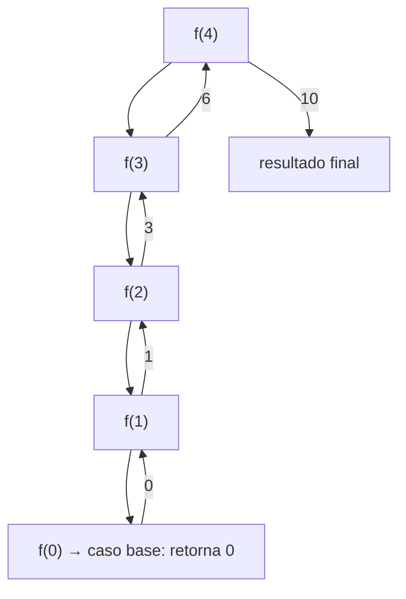
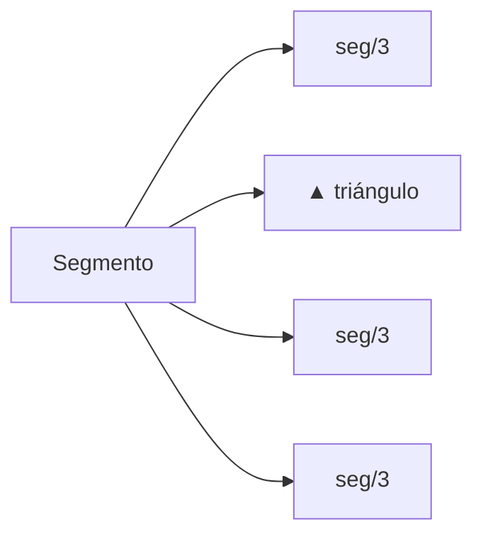

---
tags:
  - programacion
  - DAM1
unidad: 1
tema: Recursividad
---
# Recursividad

La **recursividad** es una técnica de programación en la que una función se llama a sí misma para resolver versiones más pequeñas del mismo problema. El resultado final se construye combinando las soluciones de esas versiones más pequeñas.

Es una alternativa a la iteración (`for`, `while`) que resulta especialmente natural cuando el problema tiene **estructura anidada o autosimilar**: árboles, fractales, combinatoria, divide y vencerás.

---

## Estructura de una función recursiva

Toda función recursiva tiene exactamente dos partes:

> **Caso base**: condición que detiene la recursión. Se resuelve directamente, sin llamarse de nuevo. **Caso recursivo**: la función se llama a sí misma con un input estrictamente más cercano al caso base.

```python
def funcion(n):
    if n == 0:           # caso base
        return 0
    return n + funcion(n - 1)   # caso recursivo
```

Sin caso base → recursión infinita → `RecursionError`. Sin convergencia hacia el caso base → mismo resultado.

---

## La pila de llamadas

Cada llamada recursiva abre un nuevo **frame** en la pila de ejecución con sus propias variables locales. Cuando se llega al caso base, la pila se **desapila** en orden inverso: cada frame retorna su resultado al que lo llamó.



Esto tiene dos consecuencias importantes:

**El orden del código importa.** Lo que está antes de la llamada recursiva se ejecuta en la bajada (de mayor a menor nivel). Lo que está después se ejecuta en la subida (de menor a mayor nivel).

```python
def orden(n):
    if n == 0:
        return
    print(f"Bajada: {n}")    # se imprime antes de llegar al caso base
    orden(n - 1)
    print(f"Subida: {n}")    # se imprime al volver del caso base
```

**Cada frame es independiente.** Las variables locales de cada llamada no interfieren con las de las demás.

---

## Parámetros: cómo converger al caso base

El parámetro que varía en la llamada recursiva debe **acercarse al caso base en cada iteración**. Los mecanismos más habituales:

|Mecanismo|Ejemplo|Caso base típico|
|---|---|---|
|Decrementar|`n - 1`|`n == 0`|
|Dividir|`size / 3`|`size < umbral`|
|Reducir nivel|`level - 1`|`level == 0`|
|Invertir signo|`-angle`|— (controla orientación, no profundidad)|

---

## Tipos de recursión

### Recursión lineal

Una sola llamada recursiva por ejecución. La más simple.

```python
def factorial(n):
    if n == 0:
        return 1
    return n * factorial(n - 1)
```

### Recursión múltiple

Varias llamadas recursivas por ejecución. El árbol de llamadas se ramifica, por lo que el coste crece exponencialmente.

```python
def fibonacci(n):
    if n <= 1:
        return n
    return fibonacci(n - 1) + fibonacci(n - 2)
```

### Recursión mutua

Dos funciones que se llaman entre sí.

```python
def es_par(n):
    if n == 0: return True
    return es_impar(n - 1)

def es_impar(n):
    if n == 0: return False
    return es_par(n - 1)
```

### Recursión de cola _(tail recursion)_

La llamada recursiva es la **última operación** de la función. En algunos lenguajes esto permite optimización automática (Python no la aplica, pero es un patrón a conocer).

```python
def factorial_tail(n, acumulador=1):
    if n == 0:
        return acumulador
    return factorial_tail(n - 1, n * acumulador)
```

---

## Backtracking

El **backtracking** es un patrón recursivo donde la función explora una opción, recursa, y luego **deshace el cambio** para explorar la siguiente. El estado queda igual que antes de la llamada.

```python
def explorar(estado, opciones):
    if condicion_final(estado):
        guardar_solucion(estado)
        return
    for opcion in opciones:
        aplicar(estado, opcion)       # avanzar
        explorar(estado, opciones)    # recursar
        deshacer(estado, opcion)      # retroceder
```

Se usa en laberintos, sudokus, permutaciones, y — como se verá en los ejercicios — en el dibujo de árboles con turtle.

---

## Complejidad

La recursión múltiple crece rápidamente. Para evaluar el coste, se identifica cuántas llamadas genera cada nivel:

|Ramificación|Crecimiento|Ejemplo|
|---|---|---|
|1 llamada por nivel|O(n)|factorial|
|2 llamadas por nivel|O(2ⁿ)|fibonacci ingenuo|
|3 llamadas por nivel|O(3ⁿ)|Sierpiński|
|4 llamadas por nivel|O(4ⁿ)|Koch, Hilbert|

Python tiene un límite de profundidad de pila (~1000 por defecto). Para problemas profundos con subproblemas repetidos, se aplica Memoización o se reescribe de forma iterativa.

---

## Cuándo usar recursión

**Adecuada cuando:**

- El problema se define en términos de sí mismo (factorial, Fibonacci, fractales).
- La estructura de los datos es recursiva (árboles, grafos, listas enlazadas).
- El número de niveles de anidamiento no es fijo (directorios, XML, JSON anidado).

**No adecuada cuando:**

- La profundidad puede superar el límite de la pila.
- El problema tiene subproblemas repetidos sin memoización (Fibonacci ingenuo es O(2ⁿ) pero O(n) con caché).
- Un bucle simple resuelve el problema con igual claridad.

---

## Diseño de una función recursiva: proceso

1. Identifica el **caso base**: el input más pequeño que se resuelve directamente.
2. Asume que la función ya funciona para `n-1` y define qué hace para `n`.
3. Comprueba que el parámetro converge hacia el caso base.
4. Verifica que el estado (variables, posición, estructuras) queda consistente al retornar.

```python
# Plantilla
def mi_funcion(parametro):
    if <caso_base>:
        return <resultado_directo>

    # acción de bajada (opcional)
    resultado = mi_funcion(<parametro_reducido>)
    # acción de subida (opcional)

    return <combinar_resultado>
```

---

## Errores frecuentes

**`RecursionError: maximum recursion depth exceeded`** → falta el caso base o no se alcanza.

**Resultado incorrecto pero sin error** → el parámetro no converge, o la combinación del resultado en la subida es incorrecta.

**Estado corrupto** → si la función modifica estado global (posición, listas, variables externas) y no lo restaura al retornar, las llamadas hermanas reciben un estado incorrecto. Se soluciona con backtracking explícito o pasando copias del estado.

# Recursividad — Ejercicios de clase

Estos ejercicios aplican los conceptos de recursividad usando la librería `turtle` de Python para dibujar fractales. Cada fractal es un ejemplo directo de un tipo o patrón recursivo distinto.

La librería `turtle` mueve una "tortuga" por pantalla. Su posición y orientación son **estado global**: si una función la mueve, las llamadas posteriores parten desde donde la dejó. Esto obliga a gestionar el estado con cuidado, igual que en cualquier algoritmo con backtracking.

```python
speed(0)   # máxima velocidad de dibujo
delay(0)   # sin pausa entre frames
```

---

## Curva de Koch

**Concepto aplicado**: recursión múltiple (4 llamadas), caso base = dibujo directo.

La Curva de Koch transforma un segmento recto en una curva fractal. La regla es: divide el segmento en tres partes iguales e inserta un triángulo equilátero en la parte central, eliminando su base.



En cada nivel recursivo, cada uno de los segmentos del nivel anterior se subdivide de nuevo. En el nivel 0 ya no hay subdivisión: se avanza directamente.

```python
def koch_curve(levels, size):
    if levels == 0:
        forward(size)    # caso base: dibuja el segmento
        return
    koch_curve(levels - 1, size / 3)
    left(60)
    koch_curve(levels - 1, size / 3)
    right(120)
    koch_curve(levels - 1, size / 3)
    left(60)
    koch_curve(levels - 1, size / 3)
```

Las rotaciones `left(60)` / `right(120)` / `left(60)` son las que forman el triángulo. El orden exacto importa: están intercaladas entre las cuatro llamadas recursivas, no agrupadas.

Para dibujar el **copo de nieve de Koch** se aplica `koch_curve` tres veces con una rotación de 120° entre cada lado, cerrando el triángulo exterior:

```python
def draw_snowflake(cx, cy, size, levels, ...):
    goto(cx - size / 2, cy + h / 3)
    setheading(0)
    for i in range(3):
        koch_curve(levels, size)
        right(120)
```

En el ejercicio se dibuja varias capas del copo con tamaños ligeramente distintos y colores progresivos, generando efecto de profundidad. Esto no es recursión adicional: es un bucle externo que llama a la función recursiva múltiples veces.

**Complejidad**: 4 llamadas por nivel → O(4ⁿ). Con `levels = 4` se generan 4⁴ = 256 segmentos por lado del triángulo.

---

## Curva de Hilbert

**Concepto aplicado**: recursión múltiple con inversión de parámetro (`-angle`), orientación como estado.

La Curva de Hilbert es una curva que rellena el espacio de forma continua. Su construcción recursiva gira el subpatrón en cuatro orientaciones distintas. La elegancia del algoritmo está en que la misma función genera las cuatro orientaciones pasando `angle` o `-angle`.

```python
def hilbertCurve(level, angle, size):
    if level == 0:
        return           # caso base: no dibuja nada
    right(angle)
    hilbertCurve(level - 1, -angle, size)   # subpatrón espejado
    forward(size)
    left(angle)
    hilbertCurve(level - 1, angle, size)    # subpatrón normal
    forward(size)
    hilbertCurve(level - 1, angle, size)    # subpatrón normal
    left(angle)
    forward(size)
    hilbertCurve(level - 1, -angle, size)   # subpatrón espejado
    right(angle)
```

El patrón es: **giro → subcurva → segmento → giro → subcurva → segmento → subcurva → giro → segmento → subcurva → giro**. Las rotaciones antes y después de cada subcurva son simétricas para que la tortuga retorne a la orientación original al terminar.

> Pasar `-angle` no reduce la profundidad: solo invierte la orientación. La convergencia al caso base la controla `level - 1`, no `angle`.

El ejercicio dibuja varias capas de la curva con desplazamiento y grosor de trazo decreciente:

```python
def hilbertGeneration(levels, size, colors):
    for step in range(levels):
        penup()
        pencolor(colors[step % len(colors)])
        pensize((1 - step / levels) * 20)   # grosor decrece con cada capa
        offset = step * displacement
        goto(-set_pos / 2 + offset, set_pos / 2 - offset)
        pendown()
        setheading(0)
        hilbertCurve(levels, 90, size)
```

**Complejidad**: 4 llamadas por nivel → O(4ⁿ). Con `level = 7` se generan miles de segmentos, de ahí que `speed(0)` sea imprescindible.

---

## Triángulo de Sierpiński

**Concepto aplicado**: recursión múltiple (3 ramas), las acciones de bajada y subida están entrelazadas con los segmentos.

El Triángulo de Sierpiński divide un triángulo en tres triángulos más pequeños, eliminando el central, y repite el proceso en cada uno.

```python
def sierpinskiGen(level, step):
    if level == 0:
        return

    sierpinskiGen(level - 1, step / 2)   # esquina inferior izquierda
    forward(step)

    left(-120)
    sierpinskiGen(level - 1, step / 2)   # esquina inferior derecha
    forward(step)

    left(-120)
    sierpinskiGen(level - 1, step / 2)   # esquina superior
    forward(step)

    left(-120)
```

El patrón es: dibuja el subnivel de la esquina → avanza el lado → gira → repite para las otras dos esquinas → el tercer `left(-120)` cierra el triángulo.

La rotación de `-120°` tres veces suma `-360°`, dejando la tortuga con la misma orientación que tenía al entrar. Esto es fundamental: **la función deja el estado de orientación limpio**, así la llamada padre puede continuar sin correcciones.

**Complejidad**: 3 llamadas por nivel → O(3ⁿ). Con `level = 5` se generan 3⁵ = 243 triángulos base.

---

## Árbol recursivo

**Concepto aplicado**: backtracking explícito, dos ramas por nivel (recursión binaria).

El árbol es el ejemplo más claro de **backtracking**: la tortuga avanza por una rama, recursa hasta sus hojas, y retrocede exactamente lo que avanzó para poder dibujar la otra rama desde el mismo punto.

```python
def tree(actualLevel, steps):
    if actualLevel == 0:
        return

    forward(randomNum)        # avanza por la rama

    left(randomAngle)
    tree(actualLevel - 1, steps)    # rama izquierda (completa hasta sus hojas)

    left(-randomAngle * 2)
    tree(actualLevel - 1, steps)    # rama derecha (completa hasta sus hojas)

    left(randomAngle)
    penup()
    backward(randomNum)       # restaura la posición: backtracking
```

El `backward(randomNum)` al final es el backtracking. Sin él, la tortuga quedaría en la punta de la última hoja explorada y la estructura se rompería.

El ejercicio añade aleatoriedad en la longitud de cada rama y en el ángulo, lo que produce árboles distintos en cada ejecución. La aleatoriedad está en los parámetros del nivel actual, no en la estructura recursiva.

El generador crea múltiples árboles en fila usando recursión en lugar de un bucle (aunque el efecto es equivalente):

```python
def treeGeneration(levels):
    if levels == 0:
        return
    setheading(90)
    tree(6, 40)          # dibuja un árbol completo con backtracking
    setheading(0)
    penup()
    forward(newTreeStep) # avanza horizontalmente
    treeGeneration(levels - 1)
```

**Complejidad**: 2 llamadas por nivel → O(2ⁿ). Con `level = 6` se generan 2⁶ = 64 ramas terminales por árbol.

---

## Comparativa de los ejercicios

|Fractal|Tipo de recursión|Llamadas/nivel|Caso base|Backtracking|
|---|---|---|---|---|
|Koch|Múltiple|4|`forward(size)`|No|
|Hilbert|Múltiple con inversión|4|`return` vacío|No (rotaciones simétricas)|
|Sierpiński|Múltiple|3|`return` vacío|No (rotaciones simétricas)|
|Árbol|Binaria|2|`return` vacío|Sí (`backward`)|

---

## Patrón general extraído

Todos los ejercicios comparten la misma plantilla:

```python
def fractal(level, tamaño):
    if level == 0:
        <acción directa o return>
        return

    <acción de bajada: rotación, posicionamiento>
    fractal(level - 1, tamaño / factor)
    <acción intermedia: avanzar, rotar>
    fractal(level - 1, tamaño / factor)
    ...
    <acción de subida: restaurar estado si es necesario>
```

La diferencia entre ejercicios está en cuántas llamadas recursivas hay, qué ocurre entre ellas, y si se necesita deshacer el movimiento al final.

--- 
## Práctica examen
 ```python
 """
EXAMEN — RECURSIVIDAD EN PYTHON
================================
Instrucciones: A la derecha de cada bloque de código, escribe el valor
exacto que imprime cada print(), en el orden en que aparece.
Para los ejercicios de turtle, describe el dibujo resultante.
"""

# ==============================================================================
# BLOQUE 1 — SEGUIR EL VALOR (traza de ejecución)
# ==============================================================================

# ── Ejercicio 1 ──────────────────────────────────────────────────────────────
print("--- Ejercicio 1 ---")

def f(n):
    if n == 0:
        return 0
    return n + f(n - 1)

print(f(4))
print(f(1))

"""
Espacio para respuesta:
f(4) → ______
f(1) → ______
"""

# ── Ejercicio 2 ──────────────────────────────────────────────────────────────
print("--- Ejercicio 2 ---")

def f(n):
    if n == 0:
        return 1
    return n * f(n - 1)

print(f(5))
print(f(0))

"""
Espacio para respuesta:
f(5) → ______
f(0) → ______
"""

# ── Ejercicio 3 ──────────────────────────────────────────────────────────────
print("--- Ejercicio 3 ---")

def f(n):
    if n <= 0:
        return
    print(n)
    f(n - 2)

f(6)

"""
Espacio para respuesta:
______
______
______
"""

# ── Ejercicio 4 ──────────────────────────────────────────────────────────────
print("--- Ejercicio 4 ---")

def f(n):
    if n <= 0:
        return
    f(n - 1)
    print(n)

f(4)

"""
Espacio para respuesta:
______
______
______
______
"""

# ── Ejercicio 5 ──────────────────────────────────────────────────────────────
print("--- Ejercicio 5 ---")

def f(n):
    if n == 0:
        print("base")
        return
    print("baixada", n)
    f(n - 1)
    print("pujada", n)

f(3)

"""
Espacio para respuesta:
______
______
______
______
______
______
______
"""

# ── Ejercicio 6 ──────────────────────────────────────────────────────────────
print("--- Ejercicio 6 ---")

def f(n):
    if n == 0:
        return 0
    if n % 2 == 0:
        return f(n - 1) + 10
    else:
        return f(n - 1) + 1

print(f(5))

"""
Espacio para respuesta:
f(5) → ______
"""

# ── Ejercicio 7 ──────────────────────────────────────────────────────────────
print("--- Ejercicio 7 ---")

def f(n):
    if n == 0:
        return 0
    return f(n - 1) * 2 + 1

print(f(4))

"""
Espacio para respuesta:
f(4) → ______
"""

# ── Ejercicio 8 ──────────────────────────────────────────────────────────────
print("--- Ejercicio 8 ---")

def f(a, b):
    if b == 0:
        return a
    return f(b, a % b)

print(f(12, 8))
print(f(9, 6))

"""
Espacio para respuesta:
f(12, 8) → ______
f(9, 6)  → ______
"""

# ── Ejercicio 9 ──────────────────────────────────────────────────────────────
print("--- Ejercicio 9 ---")

def f(n):
    if n <= 1:
        return n
    return f(n - 1) + f(n - 2)

print(f(6))
print(f(3))

"""
Espacio para respuesta:
f(6) → ______
f(3) → ______
"""

# ── Ejercicio 10 ─────────────────────────────────────────────────────────────
print("--- Ejercicio 10 ---")

def f(v, p):
    if p == len(v):
        return 0
    return v[p] + f(v, p + 1)

llista = [3, 1, 4, 1, 5]
print(f(llista, 0))
print(f(llista, 2))

"""
Espacio para respuesta:
f(llista, 0) → ______
f(llista, 2) → ______
"""

# ── Ejercicio 11 ─────────────────────────────────────────────────────────────
print("--- Ejercicio 11 ---")

def f(v, p):
    if p < 0:
        return
    print(v[p])
    f(v, p - 1)

llista = [10, 20, 30]
f(llista, 2)

"""
Espacio para respuesta:
______
______
______
"""

# ── Ejercicio 12 ─────────────────────────────────────────────────────────────
print("--- Ejercicio 12 ---")

def f(n, acc=0):
    if n == 0:
        return acc
    return f(n - 1, acc + n)

print(f(5))
print(f(3, 10))

"""
Espacio para respuesta:
f(5)     → ______
f(3, 10) → ______
"""

# ── Ejercicio 13 ─────────────────────────────────────────────────────────────
print("--- Ejercicio 13 ---")

def f(n):
    if n == 0:
        return 0
    return 1 + f(n // 2)

print(f(8))
print(f(16))

"""
Espacio para respuesta:
f(8)  → ______
f(16) → ______
"""

# ── Ejercicio 14 ─────────────────────────────────────────────────────────────
print("--- Ejercicio 14 ---")

def f(s):
    if len(s) == 0:
        return True
    if s[0] != s[-1]:
        return False
    return f(s[1:-1])

print(f("radar"))
print(f("python"))
print(f("a"))

"""
Espacio para respuesta:
f("radar")  → ______
f("python") → ______
f("a")      → ______
"""

# ── Ejercicio 15 ─────────────────────────────────────────────────────────────
print("--- Ejercicio 15 ---")

def f(v, n):
    if not v:
        return 0
    return (1 if v[0] == n else 0) + f(v[1:], n)

llista = [1, 3, 1, 2, 1]
print(f(llista, 1))
print(f(llista, 5))

"""
Espacio para respuesta:
f(llista, 1) → ______
f(llista, 5) → ______
"""

# ── Ejercicio 16 ─────────────────────────────────────────────────────────────
print("--- Ejercicio 16 ---")

x = 0

def f(n):
    global x
    if n == 0:
        return
    x += n
    f(n - 1)

f(4)
print(x)
f(2)
print(x)

"""
Espacio para respuesta:
primera print → ______
segunda print → ______
"""

# ── Ejercicio 17 ─────────────────────────────────────────────────────────────
print("--- Ejercicio 17 ---")

def f(n):
    if n <= 0:
        return 0
    return f(n - 3) + f(n - 1)

print(f(4))

"""
Espacio para respuesta:
f(4) → ______
"""

# ── Ejercicio 18 ─────────────────────────────────────────────────────────────
print("--- Ejercicio 18 ---")

def f(v, p=0):
    if p >= len(v):
        return
    if v[p] % 2 == 0:
        print(v[p])
    f(v, p + 1)

f([1, 2, 3, 4, 5, 6])

"""
Espacio para respuesta:
______
______
______
"""

# ── Ejercicio 19 ─────────────────────────────────────────────────────────────
print("--- Ejercicio 19 ---")

def f(n, prof=0):
    if n == 0:
        print(" " * prof + "0")
        return
    print(" " * prof + str(n))
    f(n - 1, prof + 2)
    print(" " * prof + str(n))

f(3)

"""
Espacio para respuesta:
______
______
______
______
______
______
______
"""

# ── Ejercicio 20 ─────────────────────────────────────────────────────────────
print("--- Ejercicio 20 ---")

def f(d, n):
    if n == 0:
        return d
    nou = {}
    for k in d:
        nou[k] = d[k] * 2
    return f(nou, n - 1)

resultat = f({"a": 1, "b": 2}, 3)
print(resultat)

"""
Espacio para respuesta:
______
"""

# ==============================================================================
# BLOQUE 2 — EJERCICIOS SIN FINALIDAD PRÁCTICA (traza pura, como los exámenes)
# ==============================================================================

# ── Ejercicio 21 ─────────────────────────────────────────────────────────────
print("--- Ejercicio 21 ---")

def f(n, k):
    if n <= 0:
        return k
    return f(n - 1, k + n) + f(n - 2, k)

print(f(3, 0))

"""
Espacio para respuesta:
______
"""

# ── Ejercicio 22 ─────────────────────────────────────────────────────────────
print("--- Ejercicio 22 ---")

resultat = []

def f(n):
    if n == 0:
        return
    f(n - 1)
    resultat.append(n * 2)

f(4)
print(resultat)
print(len(resultat))

"""
Espacio para respuesta:
resultat → ______
len      → ______
"""

# ── Ejercicio 23 ─────────────────────────────────────────────────────────────
print("--- Ejercicio 23 ---")

def f(a, b, depth=0):
    if a > b:
        return 0
    mid = (a + b) // 2
    print(depth, mid)
    return f(a, mid - 1, depth + 1) + f(mid + 1, b, depth + 1) + 1

print(f(1, 7))

"""
Espacio para respuesta:
(escribe cada print en orden)
______
______
______
______
______
______
______
print final → ______
"""

# ── Ejercicio 24 ─────────────────────────────────────────────────────────────
print("--- Ejercicio 24 ---")

def f(v):
    if len(v) <= 1:
        return v
    mig = len(v) // 2
    return f(v[mig:]) + f(v[:mig])

print(f([1, 2, 3, 4]))
print(f([10, 20]))

"""
Espacio para respuesta:
f([1,2,3,4]) → ______
f([10,20])   → ______
"""

# ── Ejercicio 25 ─────────────────────────────────────────────────────────────
print("--- Ejercicio 25 ---")

crides = 0

def f(n):
    global crides
    crides += 1
    if n <= 1:
        return n
    return f(n - 1) + f(n - 2)

resultat = f(5)
print(resultat)
print(crides)

"""
Espacio para respuesta:
resultat → ______
crides   → ______
"""

# ── Ejercicio 26 ─────────────────────────────────────────────────────────────
print("--- Ejercicio 26 ---")

def f(d, n):
    if n == 0 or not d:
        return 0
    clau = list(d.keys())[0]
    resta = {k: d[k] for k in list(d.keys())[1:]}
    return d[clau] + f(resta, n - 1)

dades = {"a": 3, "b": 5, "c": 2}
print(f(dades, 2))
print(f(dades, 10))

"""
Espacio para respuesta:
f(dades, 2)  → ______
f(dades, 10) → ______
"""

# ── Ejercicio 27 ─────────────────────────────────────────────────────────────
print("--- Ejercicio 27 ---")

def f(s, i=0):
    if i >= len(s):
        return 0
    return (1 if s[i].isupper() else 0) + f(s, i + 1)

print(f("HolaMon"))
print(f("python"))

"""
Espacio para respuesta:
f("HolaMon") → ______
f("python")  → ______
"""

# ── Ejercicio 28 ─────────────────────────────────────────────────────────────
print("--- Ejercicio 28 ---")

def f(n):
    if n == 1:
        return [1]
    anterior = f(n - 1)
    return anterior + [anterior[-1] * 2]

print(f(5))

"""
Espacio para respuesta:
______
"""

# ── Ejercicio 29 ─────────────────────────────────────────────────────────────
print("--- Ejercicio 29 ---")

def f(v, esquerra, dreta):
    if esquerra > dreta:
        return -1
    mig = (esquerra + dreta) // 2
    print("mirant", mig, v[mig])
    if v[mig] == 7:
        return mig
    elif v[mig] < 7:
        return f(v, mig + 1, dreta)
    else:
        return f(v, esquerra, mig - 1)

v = [1, 3, 5, 7, 9, 11]
print(f(v, 0, len(v) - 1))

"""
Espacio para respuesta:
(escribe cada print en orden)
______
______
______
"""

# ── Ejercicio 30 ─────────────────────────────────────────────────────────────
print("--- Ejercicio 30 ---")

def f(n, indent=0):
    if n == 0:
        return 0
    a = f(n - 1, indent + 1)
    b = f(n - 1, indent + 1)
    total = a + b + n
    print(" " * indent + str(total))
    return total

f(3)

"""
Espacio para respuesta:
(escribe cada print en orden, con sus espacios)
______
______
______
______
______
______
______
"""

# ==============================================================================
# BLOQUE 3 — TURTLE: DESCRIBE EL DIBUJO
# ==============================================================================
# En estos ejercicios NO se ejecuta código: describes qué dibuja la tortuga.

# ── Ejercicio 31 ─────────────────────────────────────────────────────────────
"""
--- Ejercicio 31 ---
from turtle import *
speed(0)

def f(level, size):
    if level == 0:
        forward(size)
        return
    f(level - 1, size / 3)
    left(60)
    f(level - 1, size / 3)
    right(120)
    f(level - 1, size / 3)
    left(60)
    f(level - 1, size / 3)

for i in range(3):
    f(1, 300)
    right(120)

done()

Describe el dibujo resultante:
___________________________________________________________________
___________________________________________________________________
"""

# ── Ejercicio 32 ─────────────────────────────────────────────────────────────
"""
--- Ejercicio 32 ---
from turtle import *
speed(0)

def f(level, size):
    if level == 0:
        forward(size)
        return
    f(level - 1, size / 3)
    left(60)
    f(level - 1, size / 3)
    right(120)
    f(level - 1, size / 3)
    left(60)
    f(level - 1, size / 3)

for i in range(3):
    f(3, 300)
    right(120)

done()

¿En qué se diferencia del ejercicio 31?
___________________________________________________________________
___________________________________________________________________
"""

# ── Ejercicio 33 ─────────────────────────────────────────────────────────────
"""
--- Ejercicio 33 ---
from turtle import *
speed(0)

def arbre(level, size):
    if level == 0:
        return
    forward(size)
    left(30)
    arbre(level - 1, size * 0.7)
    right(60)
    arbre(level - 1, size * 0.7)
    left(30)
    backward(size)

penup()
goto(0, -200)
setheading(90)
pendown()
arbre(5, 100)
done()

Describe la forma general del dibujo y explica qué hace backward(size):
___________________________________________________________________
___________________________________________________________________
"""

# ── Ejercicio 34 ─────────────────────────────────────────────────────────────
"""
--- Ejercicio 34 ---
from turtle import *
speed(0)

def arbre(level, size):
    if level == 0:
        return
    forward(size)
    left(30)
    arbre(level - 1, size * 0.7)
    right(60)
    arbre(level - 1, size * 0.7)
    left(30)
    backward(size)

penup()
goto(0, -200)
setheading(90)
pendown()
arbre(5, 100)

# Ahora se elimina backward(size):
def arbre_sense_back(level, size):
    if level == 0:
        return
    forward(size)
    left(30)
    arbre_sense_back(level - 1, size * 0.7)
    right(60)
    arbre_sense_back(level - 1, size * 0.7)
    left(30)
    # SIN backward

penup()
goto(200, -200)
setheading(90)
pendown()
arbre_sense_back(4, 80)
done()

¿Qué diferencia visual hay entre arbre y arbre_sense_back?
___________________________________________________________________
___________________________________________________________________
"""

# ── Ejercicio 35 ─────────────────────────────────────────────────────────────
"""
--- Ejercicio 35 ---
from turtle import *
speed(0)

def sierpinski(level, size):
    if level == 0:
        return
    sierpinski(level - 1, size / 2)
    forward(size)
    left(-120)
    sierpinski(level - 1, size / 2)
    forward(size)
    left(-120)
    sierpinski(level - 1, size / 2)
    forward(size)
    left(-120)

penup()
goto(-150, -100)
pendown()
sierpinski(4, 300)
done()

a) ¿Qué figura genera este código a nivel alto?
b) ¿Cuántos triángulos "vacíos" hay en el nivel 2 (level=2)?
___________________________________________________________________
___________________________________________________________________
"""

# ── Ejercicio 36 ─────────────────────────────────────────────────────────────
"""
--- Ejercicio 36 ---
from turtle import *
speed(0)

def quadrat(level, size):
    if level == 0:
        for _ in range(4):
            forward(size)
            right(90)
        return
    quadrat(level - 1, size / 3)
    forward(size)
    quadrat(level - 1, size / 3)
    right(90)
    forward(size)
    quadrat(level - 1, size / 3)
    left(90)
    forward(size)
    quadrat(level - 1, size / 3)

penup()
goto(-150, 150)
pendown()
quadrat(2, 270)
done()

a) ¿Qué dibuja cuando level == 0?
b) ¿Cuántas llamadas recursivas hay por nivel?
___________________________________________________________________
___________________________________________________________________
"""

# ── Ejercicio 37 ─────────────────────────────────────────────────────────────
"""
--- Ejercicio 37 ---
from turtle import *
speed(0)
bgcolor("black")
pencolor("white")

def espiral(level, size, angle):
    if level == 0:
        return
    forward(size)
    right(angle)
    espiral(level - 1, size + 5, angle)

espiral(60, 5, 89)
done()

Describe la forma que genera espiral(60, 5, 89).
¿Qué pasaría si angle fuera 90 exacto en lugar de 89?
___________________________________________________________________
___________________________________________________________________
"""

# ── Ejercicio 38 ─────────────────────────────────────────────────────────────
"""
--- Ejercicio 38 ---
from turtle import *
speed(0)

def hilbert(level, angle, size):
    if level == 0:
        return
    right(angle)
    hilbert(level - 1, -angle, size)
    forward(size)
    left(angle)
    hilbert(level - 1, angle, size)
    forward(size)
    hilbert(level - 1, angle, size)
    left(angle)
    forward(size)
    hilbert(level - 1, -angle, size)
    right(angle)

penup()
goto(-150, 150)
pendown()
setheading(0)
hilbert(3, 90, 20)
done()

a) ¿Qué hace pasar -angle en algunas llamadas recursivas?
b) ¿Qué propiedad especial tiene la curva de Hilbert respecto al espacio?
___________________________________________________________________
___________________________________________________________________
"""

# ── Ejercicio 39 ─────────────────────────────────────────────────────────────
"""
--- Ejercicio 39 ---
from turtle import *
speed(0)
bgcolor("black")

colors = ["#FF0000", "#FF7700", "#FFFF00", "#00FF00", "#0000FF"]

def estrella(level, size):
    if level == 0:
        return
    pencolor(colors[level % len(colors)])
    for _ in range(5):
        forward(size)
        right(144)
    estrella(level - 1, size * 0.6)

estrella(5, 200)
done()

a) ¿Cuántas estrellas se dibujan en total?
b) ¿Cada estrella tiene el mismo tamaño? Explica la relación entre niveles.
c) ¿Qué controla colors[level % len(colors)]?
___________________________________________________________________
___________________________________________________________________
"""

# ── Ejercicio 40 ─────────────────────────────────────────────────────────────
"""
--- Ejercicio 40 ---
from turtle import *
speed(0)
bgcolor("black")

def branques(level, size, angle):
    if level == 0:
        return
    pensize(level)
    forward(size)

    left(angle)
    branques(level - 1, size * 0.75, angle)
    right(angle * 2)
    branques(level - 1, size * 0.75, angle)
    left(angle)

    backward(size)

penup()
goto(0, -250)
setheading(90)
pendown()

for a in [20, 35]:
    branques(6, 100, a)

done()

a) ¿Por qué se llama branques dos veces desde el programa principal con ángulos distintos?
b) ¿Qué efecto tiene pensize(level) en el dibujo?
c) ¿Qué hace left(angle) / right(angle*2) / left(angle) juntos?
___________________________________________________________________
___________________________________________________________________
___________________________________________________________________
"""
 ```

--- 

```python
"""
SOLUCIONARI — EXAMEN RECURSIVITAT
===================================
"""

# ==============================================================================
# BLOQUE 1 — SEGUIR EL VALOR
# ==============================================================================

# ── Ejercicio 1 ──────────────────────────────────────────────────────────────
"""
def f(n):          f(4) → 4 + f(3) → 4+3+f(2) → 4+3+2+f(1) → 4+3+2+1+f(0)
    if n == 0:            → 4+3+2+1+0 = 10
        return 0
    return n + f(n-1)

f(4) → 10
f(1) → 1
"""

# ── Ejercicio 2 ──────────────────────────────────────────────────────────────
"""
def f(n):  Factorial
    if n == 0:  return 1
    return n * f(n-1)

f(5) → 5*4*3*2*1*1 = 120
f(0) → 1   (caso base)
"""

# ── Ejercicio 3 ──────────────────────────────────────────────────────────────
"""
f(6): imprime 6, llama f(4)
f(4): imprime 4, llama f(2)
f(2): imprime 2, llama f(0)
f(0): n <= 0 → return (sin print)

Salida:
6
4
2
"""

# ── Ejercicio 4 ──────────────────────────────────────────────────────────────
"""
El print está DESPUÉS de la llamada recursiva → se imprime en la subida.
f(4) llama f(3) llama f(2) llama f(1) llama f(0) → return
Sube: print(1), print(2), print(3), print(4)

Salida:
1
2
3
4
"""

# ── Ejercicio 5 ──────────────────────────────────────────────────────────────
"""
Bajada: imprime "baixada n" antes de llamar.
Caso base: imprime "base".
Subida: imprime "pujada n" después de volver.

Salida:
baixada 3
baixada 2
baixada 1
base
pujada 1
pujada 2
pujada 3
"""

# ── Ejercicio 6 ──────────────────────────────────────────────────────────────
"""
f(5): 5 es impar → f(4) + 1
f(4): 4 es par   → f(3) + 10
f(3): 3 es impar → f(2) + 1
f(2): 2 es par   → f(1) + 10
f(1): 1 es impar → f(0) + 1
f(0): return 0

Subida: 0 + 1 + 10 + 1 + 10 + 1 = 23

f(5) → 23
"""

# ── Ejercicio 7 ──────────────────────────────────────────────────────────────
"""
f(n) = f(n-1)*2 + 1   →   f(0)=0, f(1)=1, f(2)=3, f(3)=7, f(4)=15

f(4) → 15
"""

# ── Ejercicio 8 ──────────────────────────────────────────────────────────────
"""
Algoritmo de Euclides (MCD).
f(12, 8) → f(8, 4) → f(4, 0) → return 4
f(9, 6)  → f(6, 3) → f(3, 0) → return 3

f(12, 8) → 4
f(9, 6)  → 3
"""

# ── Ejercicio 9 ──────────────────────────────────────────────────────────────
"""
Fibonacci: f(0)=0, f(1)=1, f(2)=1, f(3)=2, f(4)=3, f(5)=5, f(6)=8

f(6) → 8
f(3) → 2
"""

# ── Ejercicio 10 ─────────────────────────────────────────────────────────────
"""
Suma recursiva de la lista desde posición p.
llista = [3, 1, 4, 1, 5]

f(llista, 0) = 3+1+4+1+5 = 14
f(llista, 2) = 4+1+5 = 10

f(llista, 0) → 14
f(llista, 2) → 10
"""

# ── Ejercicio 11 ─────────────────────────────────────────────────────────────
"""
Recorre la lista al revés (desde el índice dado hacia atrás).
llista = [10, 20, 30], empieza en p=2

f(llista, 2): print(30), f(llista,1)
f(llista, 1): print(20), f(llista,0)
f(llista, 0): print(10), f(llista,-1) → p < 0, return

Salida:
30
20
10
"""

# ── Ejercicio 12 ─────────────────────────────────────────────────────────────
"""
Recursión de cola con acumulador.
f(5)    = f(4, 5) = f(3, 9) = f(2, 12) = f(1, 14) = f(0, 15) → 15
f(3,10) = f(2,13) = f(1,15) = f(0,16) → 16

f(5)     → 15
f(3, 10) → 16
"""

# ── Ejercicio 13 ─────────────────────────────────────────────────────────────
"""
Cuenta cuántas veces se puede dividir n entre 2 hasta llegar a 0.
Es equivalente a log2(n).

f(8)  = 1 + f(4) = 1 + 1 + f(2) = 1+1+1+f(1) = 1+1+1+1+f(0) = 4
f(16) = 1 + f(8) = 1 + 4 = 5

f(8)  → 4
f(16) → 5
"""

# ── Ejercicio 14 ─────────────────────────────────────────────────────────────
"""
Comprueba si una cadena es palíndromo comparando primer y último carácter.

f("radar")  → True   (r==r, a==a, d queda solo → True)
f("python") → False  (p != n)
f("a")      → True   (un solo carácter, len==1, s[0]==s[-1])
"""

# ── Ejercicio 15 ─────────────────────────────────────────────────────────────
"""
Cuenta cuántas veces aparece n en la lista.
llista = [1, 3, 1, 2, 1]

f(llista, 1) → 3
f(llista, 5) → 0
"""

# ── Ejercicio 16 ─────────────────────────────────────────────────────────────
"""
x es global. f(n) acumula x += n, n-1, n-2 ... 1.

f(4): x = 0+4+3+2+1 = 10  → print(10)
f(2): x = 10+2+1 = 13      → print(13)

primera print → 10
segunda print → 13
"""

# ── Ejercicio 17 ─────────────────────────────────────────────────────────────
"""
f(n) = f(n-3) + f(n-1)

f(4) = f(1) + f(3)
f(3) = f(0) + f(2)
f(2) = f(-1) + f(1)   → f(-1)=0, f(1)=f(-2)+f(0)=0+0=0
f(2) = 0 + 0 = 0
f(3) = 0 + 0 = 0      (f(0)=0, f(2)=0)
f(1) = f(-2)+f(0) = 0
f(4) = 0 + 0 = 0

f(4) → 0
"""

# ── Ejercicio 18 ─────────────────────────────────────────────────────────────
"""
Imprime los pares de la lista.
[1, 2, 3, 4, 5, 6] → pares: 2, 4, 6

Salida:
2
4
6
"""

# ── Ejercicio 19 ─────────────────────────────────────────────────────────────
"""
Imprime n con sangría, recursa, y vuelve a imprimir n en la subida.
Sangría crece 2 espacios por nivel.

f(3):
"3"          (prof=0)
"  2"        (prof=2)
"    1"      (prof=4)
"      0"    (prof=6, caso base)
"    1"      (subida prof=4)
"  2"        (subida prof=2)
"3"          (subida prof=0)

Salida:
3
  2
    1
      0
    1
  2
3
"""

# ── Ejercicio 20 ─────────────────────────────────────────────────────────────
"""
Duplica todos los valores del dict n veces.
{"a":1, "b":2} → tras 1 iter: {"a":2,"b":4} → tras 2: {"a":4,"b":8} → tras 3: {"a":8,"b":16}

f({"a":1,"b":2}, 3) → {'a': 8, 'b': 16}
"""

# ==============================================================================
# BLOQUE 2 — EJERCICIOS SIN FINALIDAD PRÁCTICA
# ==============================================================================

# ── Ejercicio 21 ─────────────────────────────────────────────────────────────
"""
f(3, 0):
  f(2, 3) + f(1, 0)

f(2, 3):
  f(1, 5) + f(0, 3)
  f(1, 5) = f(0, 6) + f(-1, 5)
           = 6 + 5 = 11   (f(-1,k) → n<=0 → return k=5)
  f(0, 3) = 3
  → 11 + 3 = 14

f(1, 0):
  f(0, 1) + f(-1, 0) = 1 + 0 = 1

f(3, 0) = 14 + 1 = 15

Salida: 15
"""

# ── Ejercicio 22 ─────────────────────────────────────────────────────────────
"""
f(4):
  f(3) → f(2) → f(1) → f(0) → return
  subida: append(1*2=2), append(2*2=4), append(3*2=6), append(4*2=8)

resultat → [2, 4, 6, 8]
len      → 4
"""

# ── Ejercicio 23 ─────────────────────────────────────────────────────────────
"""
f(1,7): divide a la mitad en cada nivel (búsqueda binaria estructural).
mid=(1+7)//2=4 → print(0, 4)
  f(1,3,1): mid=2 → print(1, 2)
    f(1,1,2): mid=1 → print(2, 1)
      f(1,0) → 0;  f(2,1) → 0
    → 0+0+1 = 1
    f(3,3,2): mid=3 → print(2, 3)
      → 0+0+1 = 1
    → 1+1+1 = 3
  f(5,7,1): mid=6 → print(1, 6)
    f(5,5,2): mid=5 → print(2, 5)
      → 0+0+1=1
    f(7,7,2): mid=7 → print(2, 7)
      → 1
    → 1+1+1=3
  → 3+3+1=7

Prints en orden:
0 4
1 2
2 1
2 3
1 6
2 5
2 7
print final → 7
"""

# ── Ejercicio 24 ─────────────────────────────────────────────────────────────
"""
f invierte la lista recursivamente intercambiando mitades.
[1,2,3,4]: mig=2 → f([3,4]) + f([1,2])
  f([3,4]): mig=1 → f([4]) + f([3]) = [4]+[3] = [4,3]
  f([1,2]): mig=1 → f([2]) + f([1]) = [2]+[1] = [2,1]
→ [4,3,2,1]

f([10,20]): mig=1 → f([20]) + f([10]) = [20,10]

f([1,2,3,4]) → [4, 3, 2, 1]
f([10,20])   → [20, 10]
"""

# ── Ejercicio 25 ─────────────────────────────────────────────────────────────
"""
f(5) = f(4)+f(3) = (f(3)+f(2)) + (f(2)+f(1))
El número de llamadas para fibonacci(n) es 2*f(n+1)-1.
Para n=5: f(5)=5, llamadas totales = 15.

resultat → 5
crides   → 15
"""

# ── Ejercicio 26 ─────────────────────────────────────────────────────────────
"""
f recorre el dict tomando la primera clave n veces.
dades = {"a":3, "b":5, "c":2}

f(dades, 2): toma "a"(3) + f({"b":5,"c":2}, 1)
             → 3 + 5 = 8
f(dades, 10): 3+5+2+f({},9) → 3+5+2+0 = 10
              (cuando d queda vacío retorna 0)

f(dades, 2)  → 8
f(dades, 10) → 10
"""

# ── Ejercicio 27 ─────────────────────────────────────────────────────────────
"""
Cuenta mayúsculas en la cadena.
"HolaMon": H(1), o, l, a, M(1), o, n → 2
"python": ninguna → 0

f("HolaMon") → 2
f("python")  → 0
"""

# ── Ejercicio 28 ─────────────────────────────────────────────────────────────
"""
f(1) = [1]
f(2) = [1] + [1*2] = [1, 2]
f(3) = [1, 2] + [2*2] = [1, 2, 4]
f(4) = [1, 2, 4] + [4*2] = [1, 2, 4, 8]
f(5) = [1, 2, 4, 8] + [8*2] = [1, 2, 4, 8, 16]

Salida: [1, 2, 4, 8, 16]
"""

# ── Ejercicio 29 ─────────────────────────────────────────────────────────────
"""
Búsqueda binaria del valor 7.
v = [1, 3, 5, 7, 9, 11], busca 7.

1ª llamada: mig=(0+5)//2=2 → v[2]=5 → print("mirant 2 5") → 5<7 → f(v,3,5)
2ª llamada: mig=(3+5)//2=4 → v[4]=9 → print("mirant 4 9") → 9>7 → f(v,3,3)
3ª llamada: mig=(3+3)//2=3 → v[3]=7 → print("mirant 3 7") → encontrado → return 3

Salida:
mirant 2 5
mirant 4 9
mirant 3 7
3
"""

# ── Ejercicio 30 ─────────────────────────────────────────────────────────────
"""
f(n) genera un árbol binario de llamadas. El print ocurre en la SUBIDA.
f(3) tiene 7 nodos internos (árbol binario completo de profundidad 3).

Trazando (a=left, b=right, total=a+b+n, imprimo al volver):
- Todos los f(0) retornan 0.
- f(1): a=0, b=0, total=0+0+1=1 → print(" "*indent + "1")
  Hay 4 llamadas f(1) con indent=2 → imprimen "  1" cada una.
- f(2): a=1, b=1, total=1+1+2=4 → print(" "*indent + "4")
  Hay 2 llamadas f(2) con indent=1 → imprimen " 4" cada una.
- f(3): a=4, b=4, total=4+4+3=11 → print("" + "11")
  1 llamada con indent=0 → imprime "11".

Salida (los f(1) se imprimen antes que los f(2), en orden de resolución):
  1
  1
 4
  1
  1
 4
11
"""

# ==============================================================================
# BLOQUE 3 — TURTLE: RESPUESTAS
# ==============================================================================

# ── Ejercicio 31 ─────────────────────────────────────────────────────────────
"""
Con level=1 cada lado del triángulo se divide en 4 segmentos con una
protuberancia triangular en el centro. El resultado es un triángulo
con sus tres lados "quebrados" una vez: la primera iteración del copo de nieve
de Koch. Tiene 12 segmentos en total (4 por lado × 3 lados).
"""

# ── Ejercicio 32 ─────────────────────────────────────────────────────────────
"""
Con level=3 cada lado se subdivide 3 veces. La diferencia con el ejercicio 31
es que los bordes están mucho más detallados: cada protuberancia tiene a su vez
otras protuberancias, formando la silueta característica del copo de nieve de Koch.
El contorno se vuelve mucho más irregular y complejo.
"""

# ── Ejercicio 33 ─────────────────────────────────────────────────────────────
"""
Forma general: un árbol binario simétrico con el tronco vertical.
En cada bifurcación la rama gira 30° a la izquierda y 30° a la derecha.
Cada subnivel tiene ramas un 30% más cortas (size * 0.7).
Con level=5 hay 2⁵=32 ramas terminales.

backward(size) es el backtracking: después de dibujar toda la subrama,
la tortuga retrocede por donde vino, dejando su posición exactamente
donde estaba antes de la llamada. Esto permite que la rama hermana
empiece desde el mismo punto de bifurcación.
Sin backward, la tortuga quedaría en la punta de la última hoja
y el árbol se dibujaría de forma completamente errónea.
"""

# ── Ejercicio 34 ─────────────────────────────────────────────────────────────
"""
arbre (CON backward): dibuja un árbol simétrico y bien formado.
Cada bifurcación parte del mismo punto porque la tortuga siempre vuelve.

arbre_sense_back (SIN backward): el árbol se "descuelga".
Después de dibujar la rama izquierda la tortuga queda en la punta de esa rama,
y la rama derecha parte desde ahí en lugar de desde la bifurcación original.
El resultado es un trazo caótico y no reconocible como árbol.
"""

# ── Ejercicio 35 ─────────────────────────────────────────────────────────────
"""
a) Triángulo de Sierpiński: un triángulo equilátero subdividido
   recursivamente en triángulos más pequeños, con el triángulo central
   eliminado en cada nivel.

b) En level=2 hay 3 triángulos vacíos (centrales):
   - El triángulo central del nivel 1 (grande).
   - 3 triángulos centrales más pequeños, uno dentro de cada esquina.
   Total de "huecos": 1 + 3 = 4 triángulos vacíos (contando todos los niveles
   hasta level=2). Solo del nivel 2: 3 nuevos huecos pequeños + 1 del nivel 1 = 4.
"""

# ── Ejercicio 36 ─────────────────────────────────────────────────────────────
"""
a) Cuando level == 0 dibuja un cuadrado completo (4 lados, girando 90° cada vez).

b) Hay 4 llamadas recursivas por nivel (una en cada esquina del cuadrado).
   Esto significa un crecimiento O(4ⁿ), igual que Koch e Hilbert.
"""

# ── Ejercicio 37 ─────────────────────────────────────────────────────────────
"""
espiral(60, 5, 89): dibuja una espiral casi cuadrada que gira suavemente.
Como el ángulo es 89° (casi 90°), los lados no se cierran perfectamente
y la figura avanza lentamente creando una espiral abierta que se aleja
del origen. Los segmentos crecen 5 píxeles en cada paso.

Si angle fuera 90 exacto: la tortuga trazaría un cuadrado perfecto y
se repetiría sobre sí misma sin avanzar (los 4 lados cierran el circuito),
pero como size crece en cada llamada, en realidad traza una espiral cuadrada
perfectamente rectangular, expandiéndose hacia fuera con simetría perfecta.
"""

# ── Ejercicio 38 ─────────────────────────────────────────────────────────────
"""
a) Pasar -angle invierte la orientación del subpatrón: actúa como un espejo
   geométrico. La misma función genera las cuatro orientaciones del patrón
   Hilbert según reciba 90 o -90. Es lo que permite que el patrón se "doble"
   correctamente en cada esquina sin cortes ni solapamientos.

b) La curva de Hilbert es una curva que rellena el espacio (space-filling curve):
   al aumentar el nivel, pasa cada vez más cerca de todos los puntos del cuadrado.
   En el límite teórico (nivel infinito) cubre el espacio de forma continua
   sin cruzarse a sí misma.
"""

# ── Ejercicio 39 ─────────────────────────────────────────────────────────────
"""
a) Se dibujan 5 estrellas en total (una por cada nivel del 5 al 1).

b) No tienen el mismo tamaño. Cada estrella tiene el 60% del tamaño
   de la anterior: size * 0.6. La relación entre niveles es geométrica
   (razón 0.6): nivel 5 → 200, nivel 4 → 120, nivel 3 → 72,
   nivel 2 → 43.2, nivel 1 → 25.92.

c) colors[level % len(colors)] selecciona un color de la lista de forma
   cíclica según el nivel. Como hay 5 colores y 5 niveles, cada estrella
   tiene un color distinto: rojo, naranja, amarillo, verde, azul.
"""

# ── Ejercicio 40 ─────────────────────────────────────────────────────────────
"""
a) Se llama con dos ángulos distintos (20° y 35°) para superponer dos árboles
   desde el mismo punto de partida. El resultado es un árbol más denso y natural:
   uno más cerrado (20°) y uno más abierto (35°) se solapan, dando sensación
   de mayor volumen y variedad de ramas.

b) pensize(level) hace que las ramas más cercanas al tronco (level alto)
   sean más gruesas y las ramas terminales (level bajo) sean finas.
   Imita la estructura real de un árbol donde el tronco es grueso y
   las ramitas finales son delgadas.

c) left(angle) / right(angle*2) / left(angle) es un patrón simétrico:
   - left(angle): gira para la rama izquierda.
   - right(angle*2): gira el doble (pasa por el centro y va a la derecha).
   - left(angle): vuelve a la orientación original.
   El efecto neto es 0°: la tortuga recupera exactamente la dirección
   que tenía antes de bifurcarse, por eso el backward(size) funciona
   correctamente para todas las ramas.
"""

```