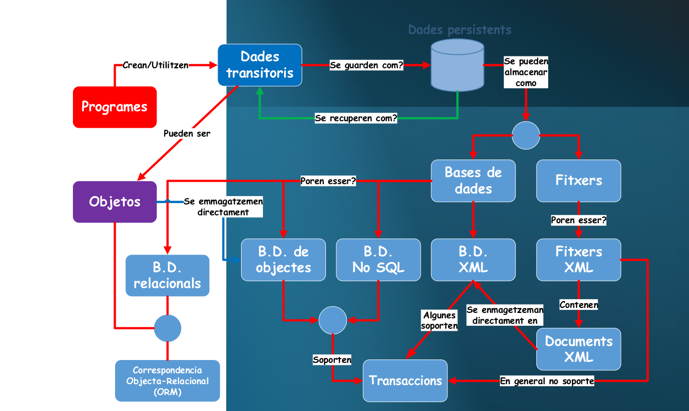

---
tags:
  - aceso-a-datos
  - DAM2
unidad: 1
tema: xxx
---
# Unidad 1 - 

> [!info] Rastreadores
> "Arañas" de google, ¿qué hacen?

Diferencia entre bases de datos y fitxeros

> [!info] API
> "Poder enlazar una DB con un programa"

Bases de datos de objetos
Bases de datos de XML
Bases de datos NoSQL - Not Only SQL
Bases de datos relacionales
ORM
- Util para trabajar con objetos
- Facilita generando funciones en base a la base de datos

Fitxeros

Persistencia de datos
- Memoria principal y memoria secundaria (persistente)
- Almacenamiento temporal (principal) - Carga fitxeros

Transacciones
- Operaciones que se mandan de golpe a la memoria secundaria

// Tema de fitxeros no se entiende la finalidad
Tipos de ficheros
- Binario
- Ficheros de texto

Clases de Java para acceder a fitxeros
File, FileReader, FileWriter
BufferedReader, BufferedWriter
InputStream, OutputStream
RandomAccessFile

Operaciones básicas
- Crear archivos
- Leer datos
- Escribir información
- Modificar contenido

Gestión de excepciones
Capturas de errores 

IOException
FileNotFoundException

Persistencia de datos
Almacenamiento permanente de información
Integridad de la información
Técnicas comunes de persistencia

Ficheros
Jerarquía de ficheros y carpetas
"Organización seqüencial de datos"

Ficheros de indice
"Listados de cursores"

