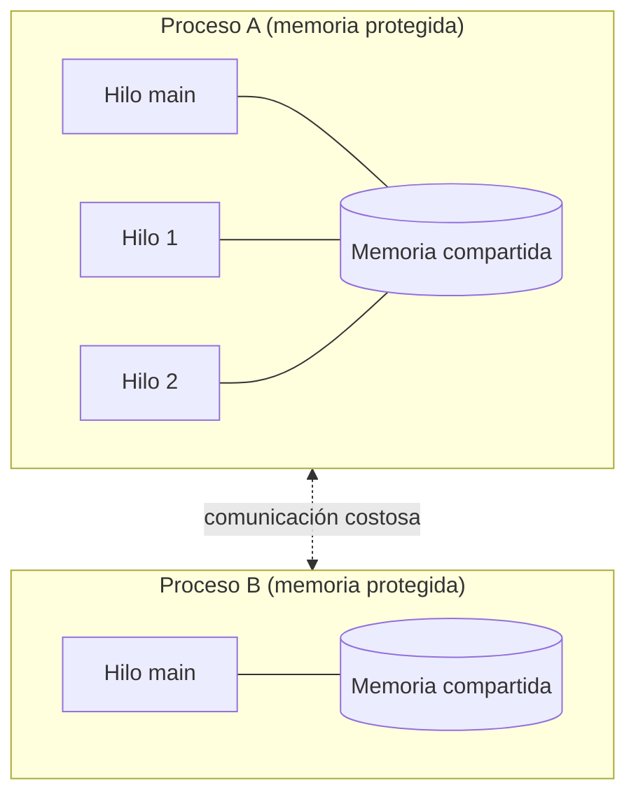
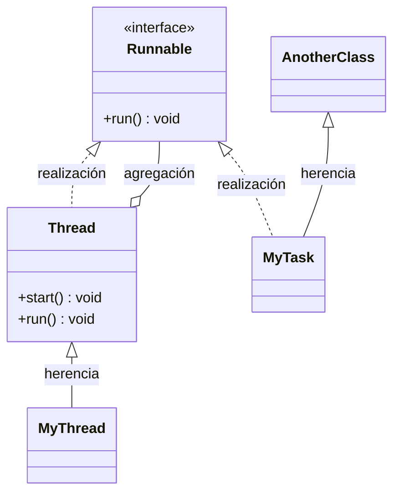
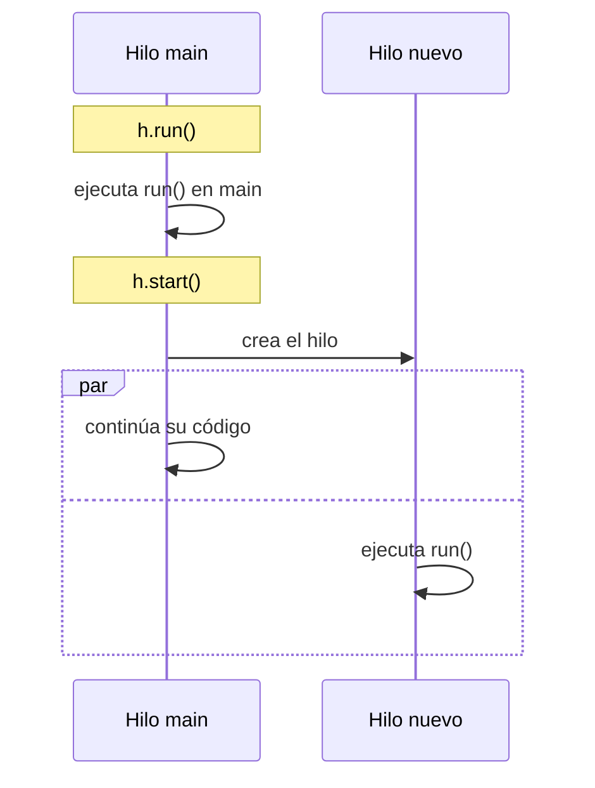
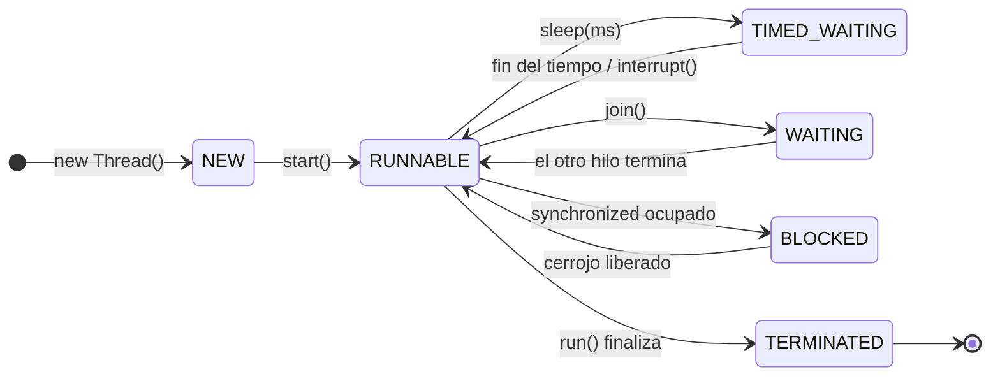
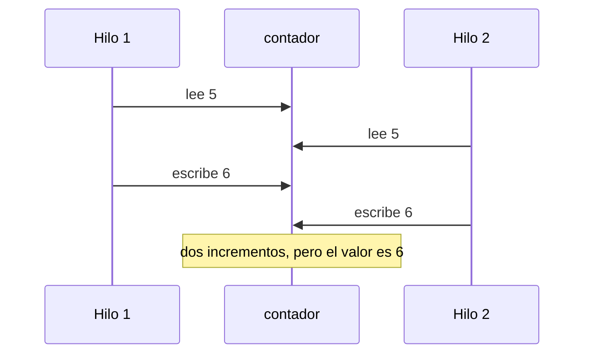
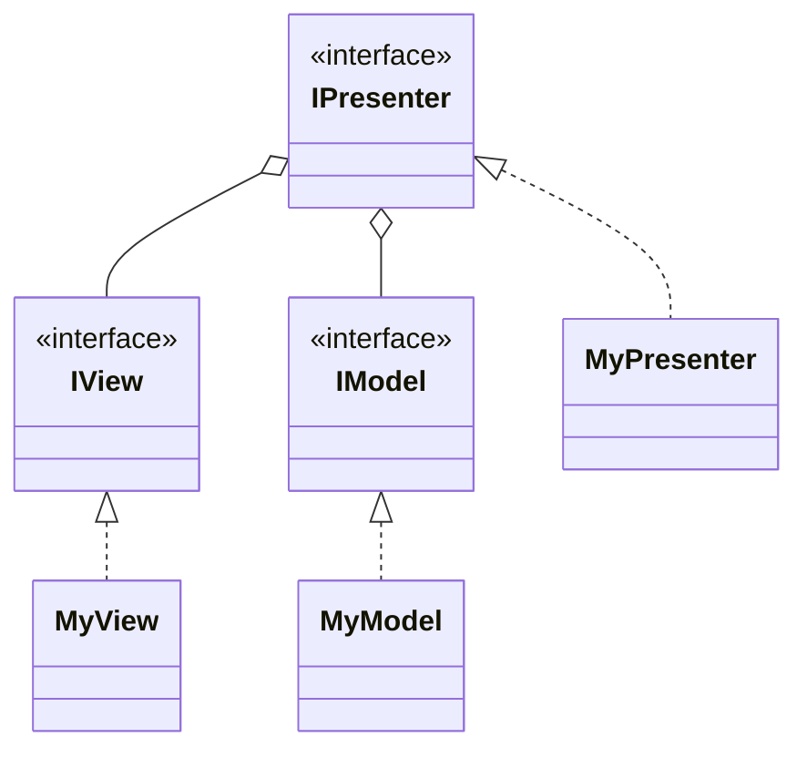
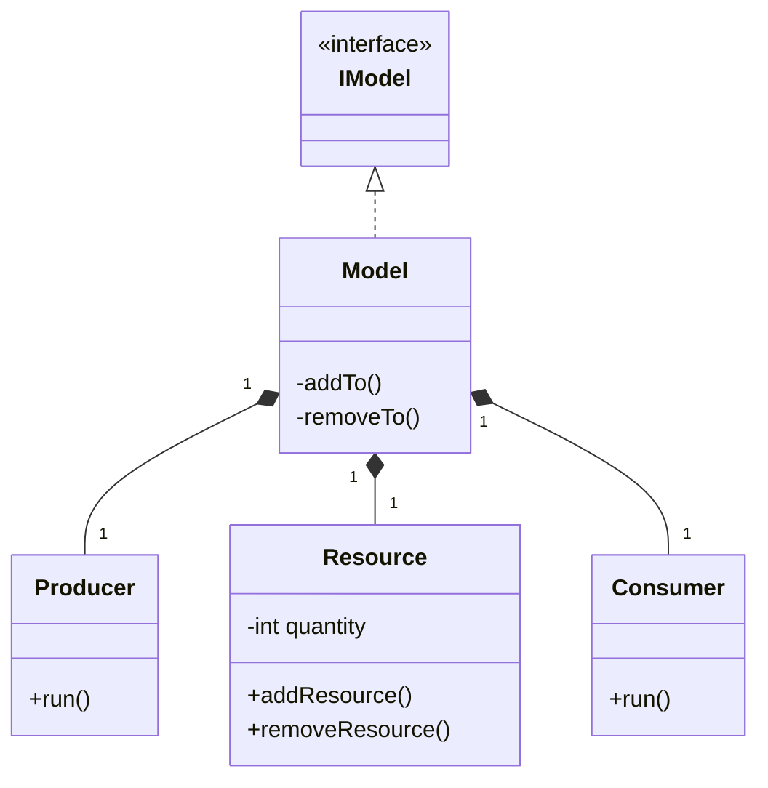

---
tags:
  - desarrollo-de-software
  - DAM2
unidad: 1
tema: Creación, ciclo de vida y sincronización básica de hilos en Java
---

# Unidad 1.2. Hilos en Java

> [!summary] Ideas clave
> 
> - Un **hilo** es una línea de ejecución dentro de un proceso; los hilos de un proceso comparten su memoria.
> - **Concurrencia** es tener varias tareas en curso; **paralelismo** es ejecutarlas en el mismo instante.
> - Un hilo se crea **extendiendo `Thread`** o **implementando `Runnable`**; se prefiere `Runnable` porque deja libre la herencia.
> - **`start()` crea un hilo nuevo**; **`run()` invocado directamente no crea ninguno**.
> - Estados: `NEW`, `RUNNABLE`, `BLOCKED`, `WAITING`, `TIMED_WAITING`, `TERMINATED`. Un hilo solo se arranca una vez.
> - `sleep()` suspende el hilo actual, `join()` espera a otro hilo e `interrupt()` solicita su detención.
> - El orden de ejecución **no está garantizado**.
> - Un dato compartido sin protección produce **condiciones de carrera**; `synchronized` las evita.
> - El **productor-consumidor** exige exclusión mutua y coordinación.


---

## 1. Introducción

Un programa secuencial ejecuta sus instrucciones una tras otra: mientras realiza una tarea larga, no puede hacer nada más. Este modelo resulta insuficiente cuando una interfaz gráfica no debe congelarse durante un cálculo, cuando una animación debe redibujarse continuamente o cuando un servidor debe atender varias peticiones a la vez. La solución consiste en dividir el programa en varias líneas de ejecución independientes: los **hilos**.

---

## 2. Conceptos fundamentales

### 2.1. Proceso e hilo

> [!note] Definición: proceso 
> Programa en ejecución. El sistema operativo le asigna un espacio de memoria propio y protegido, al que otros procesos no pueden acceder directamente.

> [!note] Definición: hilo (_thread_) 
> Línea de ejecución dentro de un proceso. Todo proceso tiene, como mínimo, un hilo. Los hilos de un mismo proceso **comparten su memoria**, pero cada uno dispone de su propia pila de llamadas.



|Característica|Proceso|Hilo|
|---|---|---|
|Memoria|Propia y aislada|Compartida con los demás hilos del proceso|
|Coste de creación|Alto|Bajo|
|Comunicación|Costosa (mediada por el sistema operativo)|Directa (variables compartidas)|
|Riesgo principal|Sobrecarga de comunicación|Problemas de sincronización|

> [!danger] Error conceptual frecuente 
> Los hilos **sí están dentro del proceso**. Precisamente por ello comparten su memoria, y por eso comunicarse entre hilos es barato y comunicarse entre procesos es costoso.

### 2.2. Concurrencia y paralelismo

> [!note] Definición: concurrencia 
> Capacidad de tener varias tareas en curso durante el mismo intervalo de tiempo, aunque no se ejecuten en el mismo instante.

> [!note] Definición: paralelismo 
> Ejecución de varias tareas en el mismo instante físico, lo que requiere varios núcleos.

> [!warning] Hilos y núcleos 
> Un hilo no se ejecuta necesariamente en un núcleo propio. El planificador del sistema operativo decide en qué núcleo y en qué momento se ejecuta cada hilo, y un programa puede tener más hilos que núcleos.

### 2.3. El hilo principal

Al iniciarse un programa, la máquina virtual crea automáticamente el hilo `main`, que ejecuta el método `main()`. El resto de hilos se crean a partir de él. El método estático `Thread.currentThread()` devuelve el hilo que ejecuta la línea actual.

---

## 3. Creación de hilos

En ambas formas, las instrucciones de la tarea se escriben en el método `run()`.

### 3.1. Extender la clase `Thread`

La clase hija **es un** `Thread`, por lo que hereda directamente `start()`, `getName()` o `sleep()`.

```java
class MiHilo extends Thread {
    @Override
    public void run() {
        System.out.println("Ejecutando " + getName());
    }
}

new MiHilo().start();
```

```text
Ejecutando Thread-0
```

> [!warning] Inconveniente 
> Java no admite herencia múltiple. Si la clase extiende `Thread`, no puede extender ninguna otra.

### 3.2. Implementar la interfaz `Runnable`

> [!note] Definición: `Runnable` 
> Interfaz que declara un único método, `void run()`. Representa una **tarea**, no un hilo.

La clase no es un `Thread`: debe entregarse al constructor de un objeto `Thread`, que es quien crea el hilo.

```java
class MiTarea implements Runnable {
    @Override
    public void run() {
        System.out.println("Ejecutando " + Thread.currentThread().getName());
    }
}

new Thread(new MiTarea(), "Hilo-1").start();
```

```text
Ejecutando Hilo-1
```

> [!important] Ventaja de `Runnable` 
> La clase queda libre para extender otra y se separa **qué se ejecuta** (la tarea) de **cómo se ejecuta** (el hilo). Una misma tarea puede entregarse a varios hilos.

### 3.3. `Runnable` mediante una expresión lambda

`Runnable` es una **interfaz funcional** (un único método abstracto), por lo que puede implementarse con una lambda:

```java
new Thread(() -> System.out.println("Ejecutando " + Thread.currentThread().getName()), "Hilo-2").start();
```

>[!note] Expresión lambda:
>Las expresiones lambda en Java son funciones anónimas que permiten implementar métodos de una interfaz funcional de manera más clara y concisa.
>Una expresión lambda se compone de tres partes separadas por el operador flecha (->):
> - **Parámetros:** Van a la izquierda de la flecha. Si hay un solo parámetro, se pueden omitir los paréntesis; si no hay parámetros o hay dos o más, son obligatorios.
> - **Operador lambda:** La flecha -> separa los parámetros del cuerpo.
> - **Cuerpo:** Va a la derecha de la flecha. Puede ser una sola expresión o un bloque de código entre llaves {}. Si es una sola línea, no requiere llaves ni la palabra return.

### 3.4. Comparación



|Aspecto|`extends Thread`|`implements Runnable`|
|---|---|---|
|Relación con `Thread`|Es un `Thread`|Es una tarea que se entrega a un `Thread`|
|Puede extender otra clase|No|Sí|
|Arranque|`objeto.start()`|`new Thread(tarea).start()`|
|Nombre del hilo|`getName()`|`Thread.currentThread().getName()`|
|Uso recomendado|Casos sencillos|Opción general|

> [!info] Comprobación con `instanceof` 
> Un objeto `MyTask` cumple `instanceof Runnable`, pero no `instanceof Thread`. Si la clase de la tarea y `Thread` no tienen relación de herencia, la expresión `task instanceof Thread` ni siquiera compila (_incompatible types_); es necesario escribir `(Object) tarea instanceof Thread`, que devuelve `false`.

---

## 4. Diferencia entre `run()` y `start()`

- **`run()`**: invocado directamente, es una llamada a método ordinaria. Se ejecuta en el hilo actual y **no crea ningún hilo**.
- **`start()`**: crea un hilo nuevo y ejecuta `run()` dentro de él. Retorna inmediatamente, sin esperar a que `run()` termine.

```java
Thread h = new Thread(() -> System.out.println(Thread.currentThread().getName()), "Hilo-X");
h.run();   // se ejecuta en main
h.start(); // se ejecuta en un hilo nuevo
```

```text
main
Hilo-X
```



> [!danger] Llamar a `run()` en lugar de `start()`
>El programa compila y funciona, pero sin concurrencia: todo se ejecuta secuencialmente en `main`. Es un fallo conceptual típico de examen.

> [!warning] Orden no determinista 
> Arrancar varios hilos en un orden no garantiza que se ejecuten en ese orden: lo decide el planificador y varía en cada ejecución. El tiempo total de varios hilos concurrentes se aproxima al del más largo, no a la suma de todos.

---

## 5. Ciclo de vida de un hilo

### 5.1. Estados

Java define los estados en el enumerado `Thread.State`; el estado actual se consulta con `getState()`.

|Estado|Significado|
|---|---|
|`NEW`|Creado, sin invocar `start()`.|
|`RUNNABLE`|En ejecución o listo para ejecutarse.|
|`BLOCKED`|Esperando para entrar en un bloque `synchronized` ocupado.|
|`WAITING`|Esperando indefinidamente a otro hilo (p. ej., `join()`).|
|`TIMED_WAITING`|Esperando un tiempo limitado (p. ej., `sleep(ms)`).|
|`TERMINATED`|`run()` ha finalizado.|



> [!danger] Un hilo solo puede arrancarse una vez 
> Invocar `start()` sobre un hilo ya iniciado lanza `IllegalThreadStateException`. Para repetir la tarea es necesario crear un nuevo objeto `Thread`.

### 5.2. Métodos principales

|Método|Tipo|Función|
|---|---|---|
|`start()`|Instancia|Crea el hilo y ejecuta `run()` en él.|
|`run()`|Instancia|Contiene la tarea.|
|`sleep(long ms)`|Estático|Suspende el hilo **actual** durante los milisegundos indicados.|
|`join()`|Instancia|El hilo actual espera a que el hilo indicado termine.|
|`interrupt()`|Instancia|Solicita al hilo que se detenga.|
|`getName()`|Instancia|Devuelve el nombre del hilo.|
|`getState()`|Instancia|Devuelve el estado actual.|
|`currentThread()`|Estático|Devuelve el hilo que ejecuta la línea actual.|

### 5.3. `join()` e `interrupt()`

`join()` hace que el hilo que lo invoca espere a que otro termine; se usa, por ejemplo, para no leer un resultado antes de que esté calculado.

```java
h1.start();
h1.join(); // main espera a que h1 termine
```

`interrupt()` no detiene el hilo por la fuerza: le envía una solicitud. Si el hilo está en `sleep()` o `join()`, se lanza `InterruptedException`, que el propio hilo captura para finalizar.

```java
Thread h = new Thread(() -> {
    try {
        Thread.sleep(5000);
    } catch (InterruptedException e) {
        System.out.println("Interrumpido");
    }
});
h.start();
h.interrupt();
```

```text
Interrumpido
```

> [!tip] Tratamiento de `InterruptedException` 
> El `catch` debe finalizar la tarea (por ejemplo, con `return`). Si se deja vacío, el hilo ignora la solicitud de detención.

---

## 6. Sincronización

### 6.1. Condición de carrera

> [!note] Definición: condición de carrera (_race condition_) 
> Situación en la que el resultado depende del orden, no controlado, en que varios hilos acceden a un dato compartido y al menos uno lo modifica.

Si dos hilos ejecutan `contador++` 100 000 veces cada uno sobre la misma variable, el resultado esperado es 200 000, pero suele obtenerse un valor menor (en una ejecución real, 167 851). La causa es que `contador++` consta de tres pasos: **leer**, **sumar** y **escribir**. Si ambos hilos leen el mismo valor antes de escribir, un incremento se pierde.



> [!danger] El error es intermitente 
> Una condición de carrera no falla siempre. Que un programa concurrente funcione en una prueba no demuestra que sea correcto.

### 6.2. `synchronized`

> [!note] Definición: sección crítica 
> Fragmento de código que accede a un recurso compartido y que solo debe ejecutar un hilo a la vez.

> [!note] Definición: `synchronized` 
> Modificador que protege un método o bloque con un **cerrojo** (_lock_). Mientras un hilo lo ejecuta, los demás quedan en estado `BLOCKED`.

```java
static synchronized void incrementar() {
    contador++; // solo un hilo a la vez
}
```

Con esta protección, el resultado es siempre 200 000.

> [!tip] Sincronizar lo mínimo 
> Mientras un hilo ocupa el cerrojo, los demás esperan. Se recomienda proteger solo la sección crítica.

### 6.3. El problema del productor-consumidor

Modelo clásico de cooperación entre hilos, resumido en una regla: **no se puede consumir lo que todavía no se ha producido**.

|Elemento|Papel|
|---|---|
|Productor|Hilo que añade unidades al recurso compartido.|
|Consumidor|Hilo que retira unidades del recurso compartido.|
|Recurso compartido|Almacén (contador, cola, _buffer_) al que acceden ambos.|

Exige dos condiciones: **exclusión mutua** (no modificar el recurso a la vez) y **coordinación** (el consumidor espera si el recurso está vacío; el productor, si está lleno).

> [!info] Alcance `synchronized` resuelve la exclusión mutua, pero no la coordinación. 
> Los mecanismos de espera y aviso (`wait()`, `notify()` y `java.util.concurrent`) se estudiarán con los mecanismos de sincronización.

---

## 7. Errores típicos

|Error|Consecuencia|Solución|
|---|---|---|
|Invocar `run()` en lugar de `start()`|No se crea hilo|Invocar `start()`|
|Invocar `start()` dos veces|`IllegalThreadStateException`|Crear un nuevo `Thread`|
|Extender `Thread` cuando se necesita otra superclase|No compila|Implementar `Runnable`|
|Suponer un orden de ejecución|Resultados variables|No depender del orden|
|Leer resultados sin esperar|Datos incompletos|Usar `join()`|
|Modificar un dato compartido sin protección|Condición de carrera|Usar `synchronized`|
|`catch` vacío de `InterruptedException`|El hilo ignora la detención|Finalizar con `return`|

---

## 8. Ejemplo integrador

Dos hilos ejecutan la misma tarea (`Runnable` mediante lambda) sobre un recurso compartido protegido con `synchronized`; `main` espera a ambos con `join()` antes de leer el resultado.

```java
class Contador {
    private int valor = 0;
    public synchronized void incrementar() { valor++; }
    public synchronized int getValor() { return valor; }
}

Contador contador = new Contador();
Runnable tarea = () -> {
    for (int i = 0; i < 1000; i++) {
        contador.incrementar();
    }
};

Thread h1 = new Thread(tarea);
Thread h2 = new Thread(tarea);
h1.start();
h2.start();
h1.join();
h2.join();
System.out.println("Total: " + contador.getValor());
```

```text
Total: 2000
```

---

## 9. Ejercicio propuesto: laboratorio de hilos

> [!example] Enunciado 
> Desarrollar una aplicación de escritorio, con arquitectura **MVP**, que funcione como laboratorio para observar el comportamiento de los hilos sobre el problema del productor-consumidor.
> 
> **Interfaz.** La ventana se divide en dos zonas:
> 
> - **Izquierda:** panel de control con las variables configurables de la simulación.
> - **Derecha:** panel de estadísticas que visualiza la evolución de la simulación.
> 
> **Arquitectura.** Modelo, vista y presentador se comunican a través de interfaces (`IModel`, `IView`, `IPresenter`). El presentador recibe la vista y el modelo mediante inyección de dependencias.
> 
> **Modelo.** Se compone de un productor, un consumidor y un recurso compartido. El productor y el consumidor se ejecutan en hilos y actúan sobre la cantidad almacenada en el recurso.
> 
> Las variables concretas del panel de control y las estadísticas que se representan quedan por definir.

Estructura propuesta para la arquitectura:



Estructura propuesta para el modelo:



> [!important] Recordatorio: contenidos de otras unidades necesarios para el ejercicio
> 
> - **Arquitectura MVP, interfaces e inyección de dependencias:** se tratan en otra parte del curso (arquitectura de software).
> - **Construcción de la ventana y los paneles** (`JFrame`, `JPanel`, gestores de distribución): se tratan en otra parte del curso (interfaces gráficas). Documentación de referencia de Oracle:
>     - [Uso de los gestores de distribución](https://docs.oracle.com/javase/tutorial/uiswing/layout/using.html)
>     - [Componentes Swing](https://docs.oracle.com/javase/tutorial/uiswing/components/index.html)
> - **Procesos, núcleos y arquitectura del procesador:** [[01.1 - Introducción a servicios y procesos|Introducción a servicios y procesos]].
> - **Coordinación entre productor y consumidor** (`wait()`, `notify()`): pendiente de los mecanismos de sincronización.

---
**Navegación:**