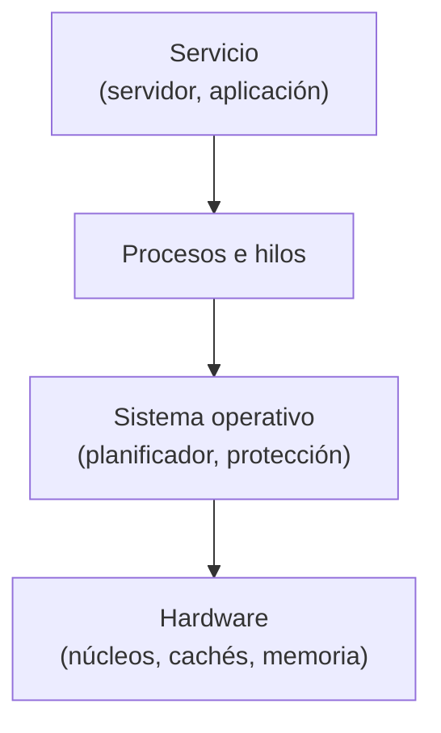
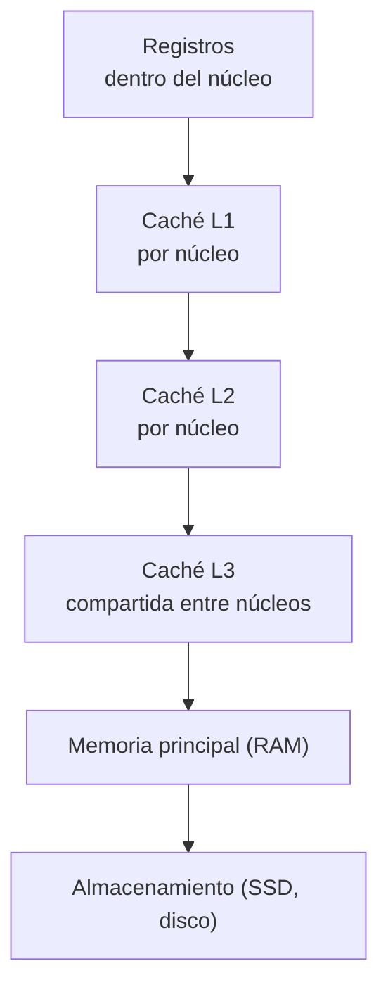
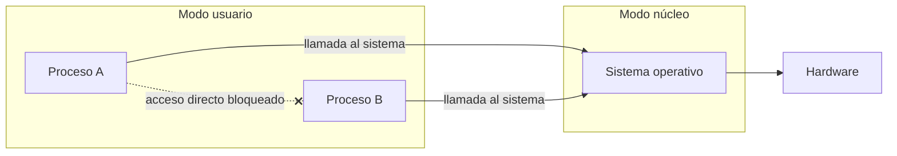
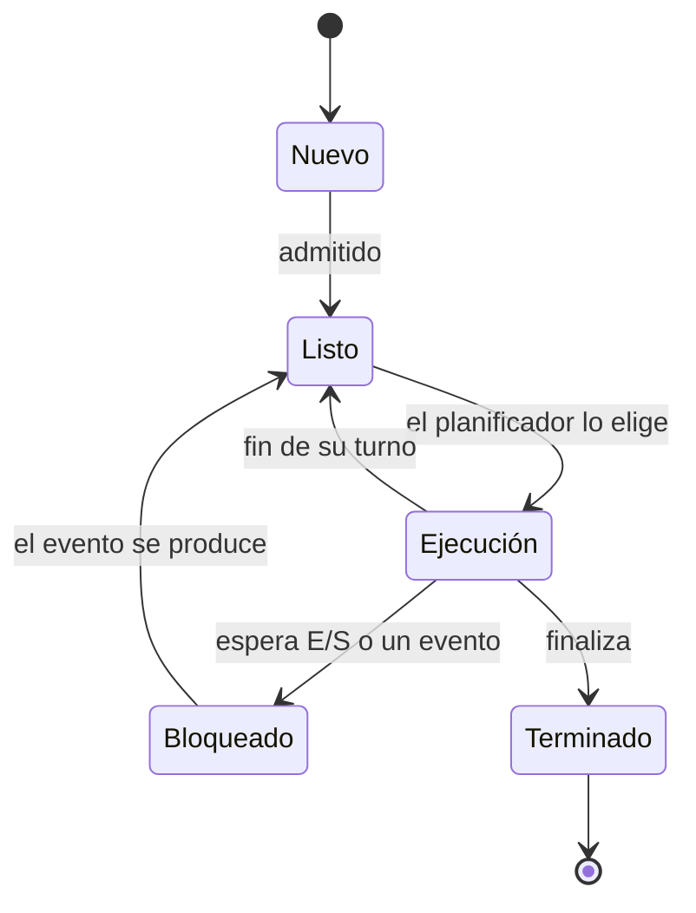
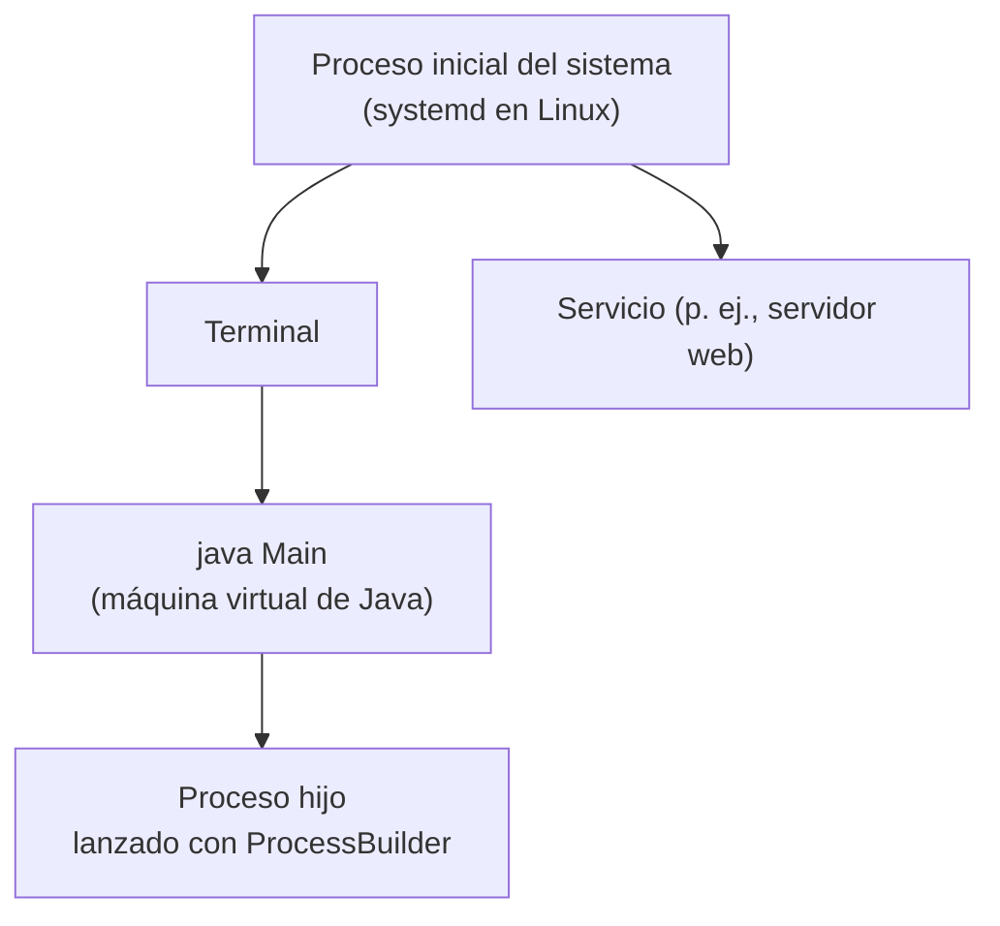
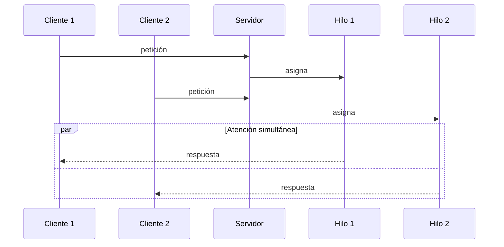

---
tags:
  - programacion-de-servicios-y-procesos
  - DAM2
unidad: 1
tema: Arquitectura del procesador, procesos, programación multiproceso y fundamentos de los servicios
---

# Unidad 1.1. Introducción a servicios y procesos

> [!summary] Ideas clave
> 
> - **RISC** usa instrucciones simples y de longitud fija; **CISC**, instrucciones complejas y variables. Los x86 actuales son CISC por fuera y RISC por dentro.
> - El **microcódigo** implementa las instrucciones complejas dentro del procesador y puede actualizarse.
> - El _**pipeline**_ solapa las etapas de varias instrucciones; los saltos y las dependencias de datos lo detienen.
> - Con **SMT**, cada núcleo físico aparece como dos núcleos lógicos, que comparten recursos.
> - La **jerarquía de memoria** compensa la lentitud de la RAM gracias al principio de localidad.
> - Los **modos de ejecución** y la **memoria virtual** aíslan los procesos entre sí.
> - Un **proceso** es un programa en ejecución con memoria propia, identificado por su PID y organizado en una jerarquía padre-hijo.
> - La programación puede ser **secuencial, concurrente, paralela o distribuida**.
> - Java crea procesos con **`ProcessBuilder`**, se comunica con ellos mediante sus flujos y los gestiona con **`waitFor()`**, **`isAlive()`** y **`destroy()`**.
> - Los procesos se comunican mediante **IPC**; los hilos de un proceso, mediante su memoria compartida.
> - El **GIL** de Python impide el paralelismo de hilos en tareas de cálculo.
> - Un **servicio** (o demonio) atiende varias peticiones a la vez, no en cola; los datos se intercambian mediante **DTO**.

---

## 1. Introducción

Un servidor que atiende a miles de usuarios, una interfaz que no se congela o un videojuego que calcula y dibuja a la vez tienen un requisito común: **ejecutar varias cosas simultáneamente**. Para entender cómo se consigue y qué límites existen, es necesario conocer tres niveles:

1. **El hardware:** cómo ejecuta instrucciones el procesador y cómo accede a la memoria.
2. **El sistema operativo:** cómo reparte el procesador entre los programas (procesos) y cómo los protege entre sí.
3. **El software:** cómo un programa aprovecha esos recursos mediante procesos e hilos para ofrecer un servicio.



---

## 2. Arquitectura del procesador

### 2.1. Juego de instrucciones: RISC y CISC

> [!note] Definición: juego de instrucciones (_ISA, Instruction Set Architecture_) 
> Conjunto de instrucciones máquina que un procesador es capaz de ejecutar. Define la interfaz entre el hardware y el software.

> [!note] Definición: RISC (_Reduced Instruction Set Computer_) 
> Arquitectura basada en un conjunto reducido de instrucciones simples y de longitud fija, diseñadas para ejecutarse en pocos ciclos de reloj. Solo las instrucciones de carga y almacenamiento acceden a memoria; el resto opera sobre registros.

> [!note] Definición: CISC (_Complex Instruction Set Computer_) 
> Arquitectura basada en un conjunto amplio de instrucciones, algunas muy complejas y de longitud variable, capaces de realizar varias operaciones (incluido el acceso a memoria) en una sola instrucción.

|Característica|RISC|CISC|
|---|---|---|
|Número de instrucciones|Reducido|Amplio|
|Complejidad de cada instrucción|Simple|Puede ser muy compleja|
|Longitud de instrucción|Fija|Variable|
|Acceso a memoria|Solo con instrucciones de carga y almacenamiento|Desde muchas instrucciones|
|Registros|Muchos|Menos|
|Programas resultantes|Más instrucciones, cada una más rápida|Menos instrucciones, cada una más lenta|
|Ejemplos|ARM (móviles, Apple M), RISC-V|x86 / x86-64 (Intel, AMD)|

> [!info] Arquitecturas híbridas 
> La distinción es hoy menos estricta. Los procesadores x86 modernos mantienen un juego de instrucciones CISC hacia fuera, pero internamente descomponen cada instrucción compleja en operaciones simples de tipo RISC (_micro-operaciones_), que son las que realmente se ejecutan.

### 2.2. Microcódigo

> [!note] Definición: microcódigo 
> Capa de instrucciones de muy bajo nivel, interna al procesador, que implementa las instrucciones máquina complejas como secuencias de pasos elementales. El programador no tiene acceso a ella.

El microcódigo actúa como un "programa dentro del procesador": cuando llega una instrucción compleja, el procesador ejecuta la secuencia de microinstrucciones que la define. Es característico de las arquitecturas CISC.

> [!tip] Actualizaciones de microcódigo 
> Como el microcódigo puede actualizarse (a través de la BIOS/UEFI o del sistema operativo), los fabricantes lo utilizan para corregir errores del procesador o mitigar vulnerabilidades sin cambiar el hardware.

### 2.3. Segmentación (_pipeline_)

> [!note] Definición: segmentación (_pipeline_) 
> Técnica que divide la ejecución de una instrucción en etapas independientes y permite que varias instrucciones avancen a la vez, cada una en una etapa distinta.

Funciona como una cadena de montaje. Un esquema clásico de cinco etapas es:

|Etapa|Nombre|Función|
|---|---|---|
|IF|Búsqueda (_fetch_)|Leer la instrucción de memoria|
|ID|Decodificación (_decode_)|Interpretar la instrucción y leer registros|
|EX|Ejecución (_execute_)|Realizar la operación|
|MEM|Memoria|Leer o escribir datos en memoria|
|WB|Escritura (_write-back_)|Guardar el resultado en un registro|

Evolución en el tiempo de cuatro instrucciones (I1 a I4):

|Ciclo|1|2|3|4|5|6|7|8|
|---|---|---|---|---|---|---|---|---|
|I1|IF|ID|EX|MEM|WB||||
|I2||IF|ID|EX|MEM|WB|||
|I3|||IF|ID|EX|MEM|WB||
|I4||||IF|ID|EX|MEM|WB|

Sin segmentación, cuatro instrucciones de cinco etapas requerirían 20 ciclos; con ella, 8. Una vez lleno el _pipeline_, termina una instrucción por ciclo.

> [!warning] Riesgos (_hazards_) 
> El _pipeline_ se detiene o se vacía cuando:
> 
> - **Riesgo de datos:** una instrucción necesita el resultado de otra que aún no ha terminado.
> - **Riesgo de control:** tras un salto condicional (`if`, bucle) no se sabe qué instrucción viene después. Los procesadores lo mitigan con **predicción de saltos**; si la predicción falla, se descartan las instrucciones ya iniciadas.
> - **Riesgo estructural:** dos instrucciones necesitan el mismo recurso de hardware a la vez.

### 2.4. Núcleos y _multithreading_ por hardware

> [!note] Definición: núcleo (_core_) 
> Unidad de procesamiento completa dentro de un procesador, capaz de ejecutar un flujo de instrucciones de forma independiente. Un procesador con varios núcleos puede ejecutar varias tareas realmente en paralelo.

> [!note] Definición: _multithreading_ simultáneo (_SMT_) 
> Técnica de hardware por la que un núcleo físico ejecuta instrucciones de dos hilos a la vez, aprovechando las unidades que uno de ellos deja ociosas. El sistema operativo ve cada núcleo físico como dos **núcleos lógicos**. Intel la comercializa como _Hyper-Threading_.

|Concepto|Significado|
|---|---|
|Núcleo físico|Unidad de hardware real|
|Núcleo lógico|Lo que ve el sistema operativo; con SMT, dos por cada núcleo físico|
|Ejemplo|Procesador de 8 núcleos físicos con SMT = 16 núcleos lógicos|

> [!warning] Núcleo lógico no equivale a núcleo físico 
> Dos núcleos lógicos comparten las unidades de ejecución de un mismo núcleo físico. El rendimiento obtenido es superior al de un núcleo sin SMT, pero muy inferior al de dos núcleos físicos.

En Java, el número de núcleos lógicos disponibles se consulta así:

```java
int nucleos = Runtime.getRuntime().availableProcessors();
System.out.println("Núcleos lógicos disponibles: " + nucleos);
```

```text
Núcleos lógicos disponibles: 8
```

El valor depende de la máquina en que se ejecuta.

### 2.5. Jerarquía de memoria

El procesador es mucho más rápido que la memoria principal. Para no esperar en cada acceso, se interponen memorias más pequeñas y rápidas, organizadas en niveles.

> [!note] Definición: memoria caché 
> Memoria pequeña y muy rápida, situada en el propio chip del procesador, que almacena copias de los datos de memoria principal usados recientemente.



|Nivel|Tamaño típico|Latencia aproximada|Ubicación|
|---|---|---|---|
|Registros|Bytes|< 1 ns|Dentro del núcleo|
|L1|Decenas de KB|~1 ns|Una por núcleo|
|L2|Cientos de KB a pocos MB|~3-5 ns|Una por núcleo (normalmente)|
|L3|Varios MB a decenas de MB|~10-20 ns|Compartida por todos los núcleos|
|RAM|GB|~60-100 ns|Fuera del chip|
|SSD|Cientos de GB a TB|Decenas de µs|Dispositivo externo|

Las cifras son órdenes de magnitud orientativos y varían según el procesador.

> [!important] Principio de localidad 
> Las cachés funcionan porque los programas tienden a reutilizar datos recientes (**localidad temporal**) y a acceder a datos contiguos en memoria (**localidad espacial**). Por eso recorrer una matriz fila a fila es más rápido que recorrerla por columnas: aprovecha los datos que ya se han traído a la caché.

> [!info] Relación con los hilos 
> Al compartir la caché L3 y la memoria principal, varios núcleos pueden tener copias distintas de un mismo dato en sus cachés L1 y L2. Este es el origen físico de los problemas de visibilidad y sincronización entre hilos que se estudian en [[01-hilos-java]].

### 2.6. Protección del hardware

Para que un programa erróneo o malicioso no afecte a los demás ni al sistema, el procesador incorpora mecanismos de protección que el sistema operativo utiliza.

> [!note] Definición: modos de ejecución 
> El procesador distingue al menos dos niveles de privilegio: el **modo núcleo** (_kernel mode_), en el que se ejecuta el sistema operativo con acceso total al hardware, y el **modo usuario** (_user mode_), en el que se ejecutan los programas con acceso restringido.

> [!note] Definición: memoria virtual 
> Mecanismo por el que cada proceso dispone de un espacio de direcciones propio, que una unidad del procesador (la MMU, _Memory Management Unit_) traduce a direcciones físicas. Un proceso no puede ver ni modificar la memoria de otro.



Cuando un programa en modo usuario necesita un recurso protegido (leer un fichero, abrir una conexión), lo solicita al sistema operativo mediante una **llamada al sistema**. Si intenta acceder a memoria que no le pertenece, el hardware lo detecta y el sistema operativo finaliza el proceso (error de _segmentation fault_ o violación de acceso), sin afectar al resto.

---

## 3. Procesos

### 3.1. Concepto de proceso

> [!note] Definición: proceso 
> Programa en ejecución. Incluye el código, los datos, la pila, el estado de los registros del procesador y los recursos asignados (ficheros abiertos, conexiones). El sistema operativo le asigna un espacio de memoria propio y protegido.

> [!warning] Programa y proceso 
> Un **programa** es un fichero estático en disco. Un **proceso** es una instancia de ese programa en ejecución. Un mismo programa puede dar lugar a varios procesos simultáneos (por ejemplo, dos ventanas independientes del mismo editor).

El sistema operativo guarda la información de cada proceso en el **bloque de control de proceso** (_PCB, Process Control Block_): identificador (PID), estado, registros, memoria asignada y recursos abiertos.

### 3.2. Estados de un proceso



|Estado|Significado|
|---|---|
|Nuevo|El proceso se está creando.|
|Listo|Preparado para ejecutarse; espera que se le asigne un núcleo.|
|Ejecución|Sus instrucciones se están ejecutando en un núcleo.|
|Bloqueado|Espera un evento externo (lectura de disco, red, entrada del usuario).|
|Terminado|Ha finalizado y el sistema libera sus recursos.|

### 3.3. Jerarquía de procesos

> [!note] Definición: PID y PPID 
> El **PID** (_Process Identifier_) es el número que identifica de forma única a un proceso en el sistema. El **PPID** (_Parent Process Identifier_) es el PID del proceso que lo creó.

Todo proceso, salvo el primero que arranca el sistema, es creado por otro proceso, su **padre**. Los procesos creados son sus **hijos**. El resultado es una estructura en árbol.



### 3.4. Planificación y cambio de contexto

> [!note] Definición: planificador (_scheduler_) 
> Componente del sistema operativo que decide qué proceso o hilo se ejecuta en cada núcleo y durante cuánto tiempo.

> [!note] Definición: cambio de contexto (_context switch_) 
> Operación por la que el sistema operativo detiene la ejecución de un proceso, guarda su estado en el PCB y restaura el estado de otro para continuar su ejecución.

El planificador asigna a cada proceso pequeños turnos de tiempo. Con un solo núcleo, alternar rápidamente entre procesos crea la ilusión de que se ejecutan a la vez.

> [!warning] Coste del cambio de contexto 
> Cada cambio de contexto consume tiempo sin realizar trabajo útil y, además, invalida parte de las cachés. Entre procesos es especialmente costoso porque también cambia el espacio de memoria; entre hilos del mismo proceso es más barato.

### 3.5. Gestión de procesos desde el sistema operativo

|Acción|Linux|Windows|
|---|---|---|
|Listar procesos|`ps aux`|`tasklist`|
|Monitorizar en tiempo real|`top`, `htop`|Administrador de tareas|
|Finalizar un proceso|`kill PID`|`taskkill /PID PID`|
|Ver el árbol de procesos|`pstree`|Monitor de recursos|

### 3.6. Comunicación entre procesos

Como cada proceso tiene su memoria aislada, intercambiar datos requiere la intervención del sistema operativo.

> [!note] Definición: comunicación entre procesos (_IPC, Inter-Process Communication_) 
> Conjunto de mecanismos que permiten a procesos distintos intercambiar datos: tuberías (_pipes_), _sockets_, ficheros, memoria compartida gestionada por el sistema o señales.

Estos mecanismos son más complejos y lentos que acceder a una variable. Por ello, cuando varias tareas simultáneas deben compartir datos, se lanzan **hilos dentro de un mismo proceso**, que comparten su memoria directamente.

> [!danger] Error conceptual frecuente 
> Los hilos **están dentro del proceso**, no fuera. Esa es precisamente la diferencia: dos procesos están aislados y necesitan IPC; dos hilos del mismo proceso comparten memoria y se comunican a través de variables. Véase [[01-hilos-java]].

---

## 4. Tipos de programación

|Tipo|Definición|Requisito de hardware|
|---|---|---|
|Secuencial|Las instrucciones se ejecutan una tras otra; una tarea no empieza hasta que termina la anterior.|Un núcleo|
|Concurrente|Varias tareas están en curso durante el mismo intervalo de tiempo, alternándose o ejecutándose a la vez.|Basta un núcleo|
|Paralela|Varias tareas se ejecutan en el mismo instante físico.|Varios núcleos|
|Distribuida|Las tareas se reparten entre varios ordenadores que se comunican por red.|Varias máquinas|

> [!note] Definición: concurrencia 
> Capacidad de un sistema para tener varias tareas en curso durante el mismo intervalo de tiempo, alternándolas o ejecutándolas a la vez.

> [!note] Definición: paralelismo 
> Ejecución de varias tareas en el mismo instante físico, en núcleos distintos.

> [!important] Concurrencia y paralelismo 
> Todo sistema paralelo es concurrente, pero no a la inversa: con un solo núcleo puede haber concurrencia (alternancia), pero no paralelismo.

---

## 5. Programación multiproceso en Java

### 5.1. Creación de procesos

Java permite lanzar otros programas como procesos hijos mediante dos clases:

|Clase|Función|
|---|---|
|`ProcessBuilder`|Configura el proceso (comando, argumentos, directorio de trabajo) y lo lanza con `start()`.|
|`Process`|Representa el proceso ya lanzado y permite comunicarse con él, esperarlo o finalizarlo.|

```java
ProcessBuilder pb = new ProcessBuilder("echo", "Hola desde un proceso hijo");
Process proceso = pb.start();

BufferedReader salida = new BufferedReader(
        new InputStreamReader(proceso.getInputStream()));
String linea;
while ((linea = salida.readLine()) != null) {
    System.out.println("Hijo dice: " + linea);
}

int codigo = proceso.waitFor();
System.out.println("Código de salida: " + codigo);
```

```text
Hijo dice: Hola desde un proceso hijo
Código de salida: 0
```

> [!warning] Dependencia del sistema operativo 
> El comando lanzado pertenece al sistema operativo. El ejemplo funciona en Linux y macOS; en Windows, los comandos internos se ejecutan a través del intérprete: `new ProcessBuilder("cmd", "/c", "echo", "Hola")`.

### 5.2. Comunicación con el proceso hijo

El proceso hijo tiene su propia memoria, por lo que el padre se comunica con él a través de sus **flujos estándar**, que actúan como tuberías:

|Método de `Process`|Flujo del hijo|Uso desde el padre|
|---|---|---|
|`getInputStream()`|Salida estándar|Leer lo que el hijo escribe|
|`getErrorStream()`|Salida de error|Leer sus mensajes de error|
|`getOutputStream()`|Entrada estándar|Enviarle datos|

> [!warning] Nomenclatura invertida 
> `getInputStream()` devuelve la **salida** del hijo. El nombre se refiere al punto de vista del padre: para el padre es un flujo de entrada.

### 5.3. Gestión del proceso hijo

|Método|Función|
|---|---|
|`waitFor()`|El padre espera a que el hijo termine y obtiene su código de salida.|
|`exitValue()`|Devuelve el código de salida; lanza una excepción si el hijo aún no ha terminado.|
|`isAlive()`|Indica si el hijo sigue en ejecución.|
|`destroy()`|Solicita la finalización del hijo.|
|`pid()`|Devuelve el PID del hijo.|

> [!note] Definición: código de salida (_exit code_) 
> Número entero que un proceso devuelve al finalizar. Por convención, `0` indica que terminó correctamente y cualquier otro valor indica un error o una finalización forzada.

La clase `ProcessHandle` permite consultar la información del propio proceso y de su jerarquía:

```java
ProcessHandle actual = ProcessHandle.current();
System.out.println("PID actual: " + actual.pid());
System.out.println("PID del padre: " + actual.parent().map(ProcessHandle::pid).orElse(-1L));
```

```text
PID actual: 223
PID del padre: 178
```

Los números concretos varían en cada ejecución.

> [!tip] Finalización forzada 
> En Linux, un proceso finalizado con `destroy()` devuelve el código 143 (128 + 15, la señal de terminación). El valor exacto depende del sistema operativo.

---

## 6. Procesos frente a hilos

### 6.1. Maximizar procesos o maximizar hilos

Para ejecutar trabajo en paralelo pueden lanzarse varios procesos o varios hilos dentro de uno. Cada opción tiene sus ventajas.

|Aspecto|Varios procesos|Varios hilos|
|---|---|---|
|Memoria|Aislada|Compartida|
|Coste de creación y cambio de contexto|Alto|Bajo|
|Comunicación|IPC (costosa)|Variables compartidas (directa)|
|Fallo de una tarea|No afecta a las demás|Puede finalizar todo el proceso|
|Riesgo principal|Consumo de recursos|Condiciones de carrera|
|Uso típico|Aislamiento y robustez (p. ej., cada pestaña de un navegador)|Tareas que comparten datos (p. ej., un servidor)|

### 6.2. El caso de Python: el GIL

> [!note] Definición: GIL (_Global Interpreter Lock_) 
> Cerrojo global del intérprete CPython (la implementación oficial de Python) que permite que **un solo hilo ejecute código Python en cada instante**, aunque el programa tenga varios hilos y la máquina varios núcleos.

Consecuencias:

- **Tareas de cálculo** (_CPU-bound_): los hilos no se ejecutan en paralelo, por lo que no aceleran el programa.
- **Tareas de entrada/salida** (_I/O-bound_): el hilo libera el GIL mientras espera (red, disco), por lo que los hilos sí resultan útiles, por ejemplo, en servidores.

Formas de sortear la limitación:

|Mecanismo|Funcionamiento|
|---|---|
|Varios procesos (módulo `multiprocessing`)|Cada proceso tiene su propio intérprete y su propio GIL|
|Librerías escritas en C (NumPy, por ejemplo)|Liberan el GIL durante sus cálculos internos|
|Versión sin GIL (_free-threaded_)|Desde Python 3.13 existe una versión del intérprete sin GIL. En 3.13 era experimental; en 3.14 está oficialmente soportada, pero sigue siendo opcional y no es la versión por defecto|

> [!info] Comparación con Java 
> Java no tiene un cerrojo global equivalente: sus hilos pueden ejecutarse realmente en paralelo en distintos núcleos. Por eso, en Java, la sincronización de los datos compartidos es responsabilidad del programador.

---

## 7. Servicios

### 7.1. Concepto de servicio

> [!note] Definición: servicio 
> Programa que se ejecuta de forma continua, normalmente sin interfaz, y atiende las peticiones que recibe de otros programas (clientes), por ejemplo a través de la red.

> [!note] Definición: demonio (_daemon_) 
> Nombre que reciben los servicios en los sistemas tipo Unix: procesos que se ejecutan en segundo plano, sin terminal asociada, desde el arranque del sistema. Por convención, su nombre suele terminar en _d_ (`sshd`, `httpd`).

|Acción|Linux (systemd)|Windows|
|---|---|---|
|Ver servicios|`systemctl list-units --type=service`|`services.msc`|
|Iniciar un servicio|`systemctl start nombre`|`net start nombre`|
|Detener un servicio|`systemctl stop nombre`|`net stop nombre`|
|Arrancar con el sistema|`systemctl enable nombre`|Tipo de inicio «Automático»|

### 7.2. Requisitos de concurrencia

Un servicio **no puede funcionar como una cola**, atendiendo una petición y esperando a que termine para atender la siguiente: una sola petición lenta bloquearía a todos los usuarios. Debe ofrecer servicio de forma constante, lo que exige ejecutar varias peticiones a la vez.



> [!info] Modelos de servidor concurrente 
> Los modelos más extendidos son: **un proceso por petición**, **un hilo por petición** (a menudo con un conjunto reutilizable de hilos, _thread pool_) y **E/S asíncrona**, en la que pocos hilos atienden muchas peticiones sin quedarse bloqueados esperando.

### 7.3. Tecnologías de servidor

|Tecnología|Lenguaje|Descripción|
|---|---|---|
|Apache Tomcat|Java|Contenedor de _servlets_: servidor web que ejecuta aplicaciones Java y atiende cada petición en un hilo de su conjunto de hilos.|
|FastAPI|Python|_Framework_ para crear APIs web. Se ejecuta sobre un servidor asíncrono (como Uvicorn) y se basa en E/S asíncrona, lo que reduce el impacto del GIL en tareas de red.|

> [!info] Alcance 
> El desarrollo de un servidor capaz de atender múltiples peticiones es el objetivo del curso y se abordará más adelante.

### 7.4. Objeto de transferencia de datos (DTO)

> [!note] Definición: DTO (_Data Transfer Object_) 
> Objeto cuya única función es transportar datos entre capas de una aplicación o entre procesos (por ejemplo, entre un servidor y un cliente). No contiene lógica de negocio, solo datos.

Su finalidad es enviar exactamente la información necesaria, en un formato sencillo de convertir a texto (por ejemplo, JSON) para transmitirlo por la red. En Java se representa de forma natural con un `record`:

```java
public record UsuarioDTO(String nombre, String email) { }

UsuarioDTO dto = new UsuarioDTO("Ana", "ana@ejemplo.com");
System.out.println(dto);
```

```text
UsuarioDTO[nombre=Ana, email=ana@ejemplo.com]
```

> [!tip] DTO y modelo 
> Un DTO no tiene por qué coincidir con la clase interna del modelo. Por ejemplo, el modelo `Usuario` puede contener la contraseña, mientras que el `UsuarioDTO` que se envía al cliente la omite.

---

## 8. Sincronización

Cuando varias tareas se ejecutan a la vez y comparten datos, el orden en que acceden a ellos deja de estar controlado. Esto origina errores (resultados incorrectos, datos corruptos) que no aparecen en un programa secuencial.

> [!note] Definición: sincronización 
> Conjunto de mecanismos que coordinan la ejecución de varias tareas concurrentes para garantizar que acceden correctamente a los recursos compartidos.

> [!info] Alcance 
> Los problemas de sincronización y los mecanismos de Java se estudian mediante ejercicios con hilos en [[01-hilos-java]].

---

## 9. Errores típicos

|Error|Aclaración|
|---|---|
|Creer que los hilos están fuera del proceso|Están dentro y comparten su memoria|
|Confundir programa y proceso|El programa es el fichero; el proceso, su ejecución|
|Contar núcleos lógicos como físicos|Con SMT, dos núcleos lógicos comparten un núcleo físico|
|Confundir concurrencia y paralelismo|La concurrencia no exige varios núcleos; el paralelismo sí|
|Leer `getOutputStream()` para obtener la salida del hijo|La salida del hijo se lee con `getInputStream()`|
|Invocar `exitValue()` antes de que el hijo termine|Lanza una excepción; usar `waitFor()`|
|Suponer que los hilos aceleran cualquier programa en Python|Con GIL, no aceleran el cálculo, solo la E/S|
|Atender las peticiones de un servicio en cola|Una petición lenta bloquea a todas las demás|
|Incluir lógica o datos sensibles en un DTO|El DTO solo transporta los datos necesarios|

---

## 10. Ejemplo integrador

Un servidor web Java recibe peticiones de varios usuarios. Su funcionamiento recorre los niveles de la unidad:

> [!example] Recorrido de una petición
> 
> 1. **Servicio.** El servidor se ejecuta como servicio del sistema, iniciado con `systemctl start`. Recibe dos peticiones simultáneas y asigna cada una a un hilo de su conjunto de hilos, en lugar de atenderlas en cola.
> 2. **Procesos e hilos.** Ambos hilos pertenecen al mismo proceso (la máquina virtual de Java), por lo que comparten la memoria, por ejemplo una caché de productos. Si los dos la modifican a la vez, es necesaria la sincronización.
> 3. **Multiproceso.** Para generar un informe PDF, el servidor lanza una herramienta externa como proceso hijo con `ProcessBuilder`, lee su salida y comprueba con `waitFor()` que el código de salida es 0. Si la herramienta falla, el servidor no se ve afectado, porque está aislada en otro proceso.
> 4. **Sistema operativo.** El planificador reparte los hilos entre los núcleos lógicos disponibles. Cuando un hilo espera la respuesta de la base de datos, queda bloqueado y el núcleo se asigna a otro hilo.
> 5. **Hardware.** En un procesador de 4 núcleos físicos con SMT (8 lógicos), hasta 8 hilos avanzan simultáneamente. Los datos más usados permanecen en las cachés, lo que evita accesos lentos a la RAM.
> 6. **Respuesta.** Cada hilo devuelve al cliente un DTO convertido a JSON, con solo los datos necesarios.

---

**Navegación:**