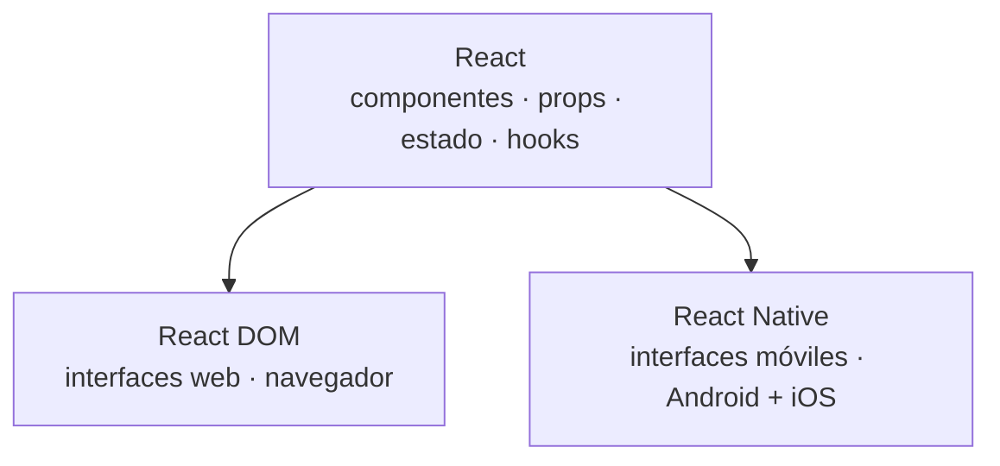
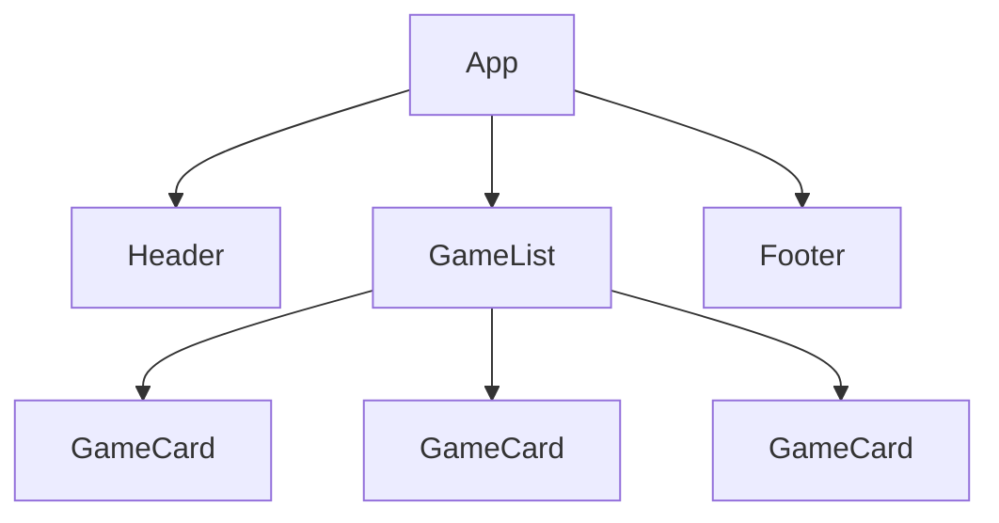
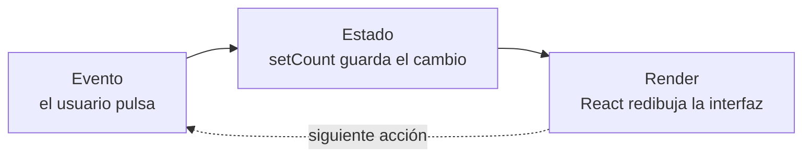

---
tags:
  - programacion-multiplataforma
  - DAM2
unidad: 1
tema: Introducción al desarrollo multiplataforma
---

# Unidad 1. Introducción al desarrollo multiplataforma

> [!summary] Ideas clave
> 
> - El desarrollo nativo usa un lenguaje y unas herramientas por plataforma; el multiplataforma comparte una única base de código entre Android e iOS.
> - React es una biblioteca para construir interfaces a partir de componentes; React DOM las muestra en el navegador y React Native las convierte en interfaces nativas.
> - Un componente es una función de JavaScript que devuelve JSX y que se usa como una etiqueta nueva.
> - Las _props_ permiten reutilizar un mismo componente con datos distintos; llegan siempre como un único objeto.
> - Una interfaz compleja se construye por composición: componentes pequeños dentro de otros mayores.
> - El estado (`useState`) guarda información que cambia; al modificarlo con su función _setter_, React vuelve a dibujar la interfaz.
> - Las listas se generan a partir de un array de datos con `map()`, y cada elemento necesita una `key` única.
> - React Native mantiene el mismo modelo mental, pero sustituye las etiquetas HTML y el CSS por componentes nativos (`View`, `Text`, `Image`, `Pressable`) y por `StyleSheet`.
> - Expo simplifica la creación, la ejecución y el acceso a las API del dispositivo en un proyecto React Native.
> - Multiplataforma no significa idéntico: permisos, _hardware_, API y comportamiento pueden variar entre Android e iOS.

La unidad recorre el camino **JavaScript → React → React Native → Android / iOS**. Primero se estudia el modelo de React en la web, con un proyecto creado con Vite, y después se traslada ese mismo modelo al móvil con React Native y Expo. El objetivo no es memorizar React, sino entender cómo se construye, se reutiliza, se ejecuta y se modifica una aplicación.

> [!info] Metodología de la unidad 
> El trabajo sigue siempre la misma secuencia: explicación breve, demostración, práctica individual (microejercicios), ampliación del reto y, al final, el **Sprint 1**. Las prácticas sirven para aprender; el Sprint, para demostrar lo aprendido (véase el apartado 14).

---

## 1. El desarrollo para móvil

### 1.1. Desarrollo nativo y multiplataforma

> [!note] Definición: desarrollo nativo 
> Desarrollo de una aplicación con el lenguaje y las herramientas propias de cada plataforma. Requiere una base de código distinta para Android y para iOS.

> [!note] Definición: desarrollo multiplataforma 
> Desarrollo de una aplicación a partir de **una única base de código** que se ejecuta en varias plataformas, normalmente Android e iOS.

|Aspecto|Nativo|Multiplataforma|
|---|---|---|
|Android|Kotlin / Java|Base de código compartida|
|iOS|Swift|Base de código compartida|
|Control de la plataforma|Máximo|Alto, con posibles adaptaciones por plataforma|
|Coste de mantener dos plataformas|Dos proyectos|Un proyecto|

> [!info] Otras tecnologías multiplataforma
> React Native es una de varias opciones. Otras conocidas son Flutter (lenguaje Dart), .NET MAUI (C#) y Kotlin Multiplatform. En este módulo se utiliza React Native porque reaprovecha JavaScript, que ya se conoce de primer curso.

### 1.2. Por qué React

React se apoya en cuatro ideas:

|Idea|Significado|
|---|---|
|JavaScript|El lenguaje ya conocido de primer curso.|
|Componentes|Se construyen piezas pequeñas e independientes.|
|Composición|Las piezas se combinan para formar interfaces completas.|
|Reutilización|Una pieza se escribe una vez y se usa tantas veces como haga falta.|

> [!tip] 
> El objetivo no es memorizar la API de React, sino entender su **modelo mental**: la interfaz es una función de los datos, construida con piezas reutilizables.

### 1.3. React no es React Native

> [!note] Definición: React 
> Biblioteca de JavaScript para construir interfaces de usuario a partir de componentes. Define el modelo: **componentes, props, estado y _hooks_** (funciones especiales de React, como `useState`).

> [!note] Definición: React DOM 
> Paquete que muestra los componentes de React en el navegador, traduciéndolos a elementos del DOM (_Document Object Model_, la estructura de la página web).

> [!note] Definición: React Native 
> _Framework_ (marco de trabajo) que aplica el modelo de React a interfaces **nativas** de Android e iOS. En lugar de elementos HTML, produce vistas nativas de cada sistema.



> [!important] 
> Primero se aprende React en la web y después se lleva **el mismo modelo** al móvil. Lo que cambia es la plataforma donde se dibuja la interfaz, no la forma de pensar.

---

## 2. Herramientas de trabajo

### 2.1. El _stack_ de la unidad

|Herramienta|Función|
|---|---|
|VS Code|Editor de código.|
|Node.js|Entorno de ejecución (_runtime_) de JavaScript fuera del navegador.|
|pnpm|Gestor de paquetes: instala y actualiza las dependencias.|
|Vite|Herramienta que crea y sirve proyectos web de React durante el desarrollo.|
|React|Biblioteca de componentes.|
|Expo|Plataforma y herramientas para crear y ejecutar proyectos React Native.|

> [!info] 
> pnpm frente a npm pnpm y npm descargan los paquetes del **mismo registro**. pnpm guarda cada versión una sola vez en un almacén global (_content-addressable store_) y la enlaza en cada proyecto, lo que ahorra espacio y tiempo. Desde la versión 10, además, no ejecuta por defecto los _scripts_ de instalación de las dependencias, un mecanismo que han aprovechado varios ataques a la cadena de suministro del ecosistema npm.

### 2.2. Instalación en CachyOS

CachyOS se basa en Arch Linux, de modo que Node.js y pnpm se instalan desde los repositorios con `pacman`:

```bash
sudo pacman -S nodejs pnpm
```

Comprobación:

```bash
node -v
pnpm -v
```

> [!warning] Actualización de pnpm 
> Al usar pnpm puede aparecer un aviso que propone actualizarlo con `curl … | sh`. Si se ha instalado con `pacman`, debe actualizarse con el sistema (`sudo pacman -Syu`); de lo contrario conviven dos instalaciones distintas.

---

## 3. Primer proyecto React con Vite

### 3.1. Creación y arranque

```bash
# 1. Create the project (asks for name, framework and variant)
pnpm create vite

# 2. Install dependencies
pnpm install

# 3. Start the development server
pnpm dev
```

En el asistente se elige el _framework_ **React** y la variante **JavaScript**. El servidor de desarrollo queda disponible en `http://localhost:5173/` y se detiene con `Ctrl + C`.

> [!tip]
> - El proyecto se crea en la carpeta actual; también se puede indicar la ruta directamente: `pnpm create vite ~/ruta/mi-proyecto`.
> - Si en el asistente se responde afirmativamente a _Install with pnpm and start now_, los pasos 2 y 3 se ejecutan solos.
> - Para volver a arrancarlo más tarde: `cd` a la carpeta del proyecto y `pnpm dev`.

### 3.2. Estructura generada

```
project/
├── index.html        ← HTML page with the root element
├── vite.config.js    ← Vite configuration
├── package.json      ← dependencies and scripts
├── node_modules/     ← installed packages (not edited)
├── public/           ← static files served as-is
└── src/
    ├── main.jsx      ← entry point
    ├── App.jsx       ← main component
    └── assets/       ← images imported from code
```

|Archivo|Función|
|---|---|
|`package.json`|Lista las dependencias y los _scripts_ (`dev`, `build`, `preview`…). `pnpm dev` ejecuta el _script_ `dev`.|
|`main.jsx`|Punto de entrada: monta el componente `App` dentro del elemento `#root` de `index.html`.|
|`App.jsx`|Componente principal (raíz) de la aplicación.|

> [!info] Organización habitual 
> `main.jsx` apenas se modifica: se reserva para configuración global (bibliotecas, proveedores, estilos generales). La aplicación se construye a partir de `App.jsx`, y los componentes se organizan en carpetas como `components/` y `pages/`, de forma similar a Angular.

---

## 4. JSX

> [!note] Definición: JSX 
> Extensión de la sintaxis de JavaScript que permite describir la interfaz con una notación parecida a HTML dentro del código. Se transforma en llamadas de JavaScript antes de ejecutarse.

```jsx
const name = "Miquel";

function App() {
  return (
    <div>
      <h1>Hello, {name}!</h1>
    </div>
  );
}
```

Las llaves `{ }` permiten insertar cualquier **expresión** de JavaScript: variables, operaciones, llamadas a funciones o ternarios. Resultado en pantalla:

```
Hello, Miquel!
```

> [!warning] JSX parece HTML, pero no lo es
> 
> |HTML|JSX|
> |---|---|
> |`class="card"`|`className="card"`|
> |`onclick="..."`|`onClick={...}` (camelCase y una función)|
> |``|`` (toda etiqueta se cierra)|
> |Varios elementos sueltos|Un único elemento raíz, o un fragmento `<>…</>`|

> [!info] Alcance 
> No es necesario conocer cómo se transforma JSX internamente; basta con saber utilizarlo.

---

## 5. Componentes

> [!note] Definición: componente 
> Función de JavaScript cuyo nombre empieza por mayúscula y que **devuelve JSX**. Una vez definida, se usa como una etiqueta nueva que antes no existía.

```jsx
function StudentCard() {
  return (
    <div>
      <h2>Miquel</h2>
      <p>2nd DAM</p>
    </div>
  );
}

// Usage: the same piece, three times
<StudentCard />
<StudentCard />
<StudentCard />
```

> [!important] Reglas de los componentes
> 
> - El nombre va en _PascalCase_ (`StudentCard`); en minúscula, React lo interpreta como una etiqueta HTML.
> - Se recomienda **un componente por archivo**, con el mismo nombre (`StudentCard.jsx`).

### 5.1. Exportar e importar componentes

Cada componente vive en su archivo y se comparte mediante módulos de JavaScript. Hay dos formas de exportar, y cada una se importa de manera distinta:

|Exportación|Importación|
|---|---|
|`export default function Header() {…}`|`import Header from "./Header";` (sin llaves)|
|`export function Header() {…}`|`import { Header } from "./Header";` (con llaves)|

> [!warning] Rutas relativas 
> La ruta se calcula desde el archivo que importa: `./` es la carpeta actual y `../` sube un nivel. No hace falta escribir la extensión del archivo.

---

## 6. Props

> [!note] Definición: props 
> Abreviatura de _properties_ (propiedades). Son los datos que un componente padre pasa a un componente hijo, escritos como atributos de la etiqueta. Permiten usar **la misma estructura con datos distintos**.

```jsx
function StudentCard({ name, course }) {
  return (
    <div>
      <h2>{name}</h2>
      <p>{course}</p>
    </div>
  );
}

<StudentCard name="Maria" course="2nd DAM" />
<StudentCard name="Joan" course="2nd DAM" />
<StudentCard name="Pere" course="1st DAM" />
```

React entrega todas las props en **un único objeto**. La sintaxis `{ name, course }` en los parámetros es una desestructuración: extrae las propiedades de ese objeto en variables.

```jsx
// Equivalent version without destructuring
function StudentCard(props) {
  return <h2>{props.name}</h2>;
}
```

> [!danger] Parámetros sin llaves 
> `function StudentCard(name, course)` es un error conceptual típico: `name` recibe el objeto de props completo y `course` vale `undefined`. Las llaves son obligatorias para desestructurar: `function StudentCard({ name, course })`.

> [!info] Props en TypeScript 
> En los proyectos de Expo, que usan TypeScript, el tipo de las props se declara aparte:
> 
> ```tsx
> type StudentCardProps = { name: string; course: string };
> 
> function StudentCard({ name, course }: StudentCardProps) { /* ... */ }
> ```

---

## 7. Composición

> [!note] Definición: composición 
> Técnica de construir una interfaz grande combinando componentes pequeños, unos dentro de otros. El componente que contiene a otro es su **padre**; el contenido, su **hijo**.



Los datos fluyen **de padre a hijo** a través de las props: `App` no necesita saber cómo se dibuja una tarjeta, y `GameCard` no necesita saber de dónde vienen sus datos.

---

## 8. Estado

> [!note] Definición: estado 
> Información que puede cambiar mientras la aplicación se ejecuta y que, al cambiar, debe reflejarse en la interfaz. Cada **instancia** de un componente tiene su propio estado, independiente del de las demás.

El estado se crea con el _hook_ `useState`, que recibe el valor inicial y devuelve un array con dos elementos: el valor actual y la función que lo modifica.

```jsx
import { useState } from "react";

function Counter() {
  const [count, setCount] = useState(0);

  return (
    <button onClick={() => setCount(count + 1)}>
      Clicks: {count}
    </button>
  );
}
```

Salida tras tres pulsaciones:

```
Clicks: 3
```



|Concepto|Papel|
|---|---|
|Estado|Información que puede cambiar.|
|Evento|Acción del usuario que modifica el estado.|
|Render|React actualiza la interfaz con el nuevo estado.|

> [!danger] Modificar el estado directamente 
> `count = count + 1` o `count++` no actualizan la interfaz: React solo vuelve a dibujar cuando se llama a la función _setter_ (`setCount`).

> [!warning] Reglas de los hooks 
> `useState` y el resto de _hooks_ se llaman siempre en el nivel superior del componente, nunca dentro de condiciones, bucles o funciones anidadas.

---

## 9. Eventos y renderizado condicional

> [!note] Definición: evento 
> Acción del usuario (pulsar, escribir, desplazarse…) a la que el componente responde con una función. En la web se usa `onClick`; en React Native, `onPress`.

> [!note] Definición: renderizado condicional 
> Mostrar un contenido u otro en función de una condición, normalmente del estado.

```jsx
{isFavorite ? (
  <p>♥ Favorite</p>
) : (
  <p>♡ Not favorite</p>
)}
```

|Forma|Uso|
|---|---|
|`cond ? A : B`|Mostrar A o B.|
|`cond && A`|Mostrar A solo si se cumple la condición.|

> [!danger] Llamar a la función en lugar de pasarla 
> `onClick={setCount(count + 1)}` ejecuta la función **durante el render**, lo que provoca un nuevo render y un bucle infinito (_Too many re-renders_). Se debe pasar una función: `onClick={() => setCount(count + 1)}`.

---

## 10. Listas

### 10.1. De los datos a los componentes

Los datos se guardan en un **array de objetos** y se transforman en componentes con `map()`, que recorre el array y devuelve un elemento por cada objeto.

```jsx
const games = [
  { id: 1, title: "Celeste" },
  { id: 2, title: "Hades" },
  { id: 3, title: "Portal 2" },
];

{games.map((game) => (
  <GameCard key={game.id} title={game.title} />
))}
```

|Paso|Qué ocurre|
|---|---|
|Datos|Un array de objetos.|
|`map()`|Transforma cada elemento…|
|Componente|…en una pieza de la interfaz.|

### 10.2. La prop `key`

> [!note] Definición: key 
> Identificador único que React exige en cada elemento de una lista para saber cuál es cuál cuando la lista cambia (se añaden, borran o reordenan elementos). No llega al componente como prop.

> [!warning]
> 
> - Sin `key`, la aplicación funciona, pero React muestra un aviso y puede actualizar el elemento equivocado.
> - La `key` debe ser única entre hermanos y estable. El índice de `map()` solo es aceptable si la lista nunca cambia de orden.

### 10.3. Rest y spread

Cuando el objeto tiene muchas propiedades, se pueden pasar todas de una vez:

```jsx
{games.map(({ id, ...game }) => (
  <GameCard key={id} {...game} />
))}
```

El mismo símbolo `...` hace operaciones opuestas según su posición:

|Operador|Dónde aparece|Qué hace|Ejemplo|
|---|---|---|---|
|_Rest_ (resto)|Al recibir: parámetros o izquierda del `=`|**Junta** lo que sobra en un objeto nuevo|`const { id, ...game } = obj;`|
|_Spread_ (propagación)|Al pasar: derecha del `=`, llamadas, JSX|**Reparte** las propiedades una a una|`<GameCard {...game} />`|

```js
const item = { id: "1", title: "Celeste", year: 2018 };
const { id, ...game } = item;

console.log(id);   // "1"
console.log(game); // { title: "Celeste", year: 2018 }
```

El nombre `game` no viene de ningún sitio: es una variable cuyo nombre se elige libremente. Se separa el `id` para usarlo como `key` y no pasarlo a un componente que no lo espera.

---

## 11. El salto a React Native

### 11.1. El mismo modelo, otra plataforma

En React Native no hay HTML ni CSS. React sigue siendo React: cambian los componentes básicos y la forma de dar estilo.

|Web (HTML)|React Native|Observaciones|
|---|---|---|
|`<div>`|`<View>`|Contenedor.|
|`<p>`, `<span>`, `<h1>`|`<Text>`|**Todo** texto va dentro de `<Text>`; los títulos se consiguen con estilos.|
|``|`<Image>`|Requiere `source` y, si es remota, tamaño explícito.|
|`<button>`|`<Pressable>` (o `<Button>`)|`onClick` pasa a `onPress`.|
|Página con _scroll_|`<ScrollView>`|No hay desplazamiento automático.|
|`<input>`|`<TextInput>`|`onChange` pasa a `onChangeText`.|
|CSS|`StyleSheet` y prop `style`|Objetos de JavaScript.|

Todos se importan desde `react-native`:

```tsx
import { Image, Pressable, ScrollView, StyleSheet, Text, View } from "react-native";
```

> [!danger] Texto fuera de `<Text>` 
> Escribir texto directamente dentro de un `<View>` provoca el error _Text strings must be rendered within a `<Text>` component_.

### 11.2. Estilos con StyleSheet

Los estilos se definen como objetos de JavaScript y se aplican con la prop `style`:

```tsx
export default function Card({ title }: { title: string }) {
  return (
    <View style={styles.card}>
      <Text style={styles.title}>{title}</Text>
    </View>
  );
}

const styles = StyleSheet.create({
  card: { padding: 16, backgroundColor: "#eeeeee", borderRadius: 8 },
  title: { fontSize: 18, fontWeight: "bold" },
});
```

|CSS|React Native|
|---|---|
|`class="card"`|`style={styles.card}`|
|`background-color: red;`|`backgroundColor: "red"` (_camelCase_)|
|`font-size: 16px;`|`fontSize: 16` (sin unidades)|
|`margin: 10px 20px;`|`marginVertical: 10, marginHorizontal: 20`|
|`display: flex;`|Activo por defecto, con `flexDirection: "column"`|

> [!tip] Dónde poner los estilos 
> Lo habitual es dejar los estilos en el **mismo archivo** que el componente, al final, porque solo los usa él (_colocation_). Los valores compartidos (colores, tamaños, fuentes) se centralizan en un archivo de tema, como `constants/theme.ts`. Un archivo de estilos aparte solo se justifica en componentes muy grandes.

### 11.3. Ocupar la pantalla con flex

Un `View` mide lo que su contenido. Para que un elemento ocupe el espacio sobrante se usa `flex: 1`; así se consigue, por ejemplo, un pie fijo abajo:

```tsx
<View style={{ flex: 1 }}>       {/* whole screen */}
  <Header />
  <ScrollView style={{ flex: 1 }}> {/* takes the remaining space */}
    {/* long content */}
  </ScrollView>
  <Footer />                     {/* stays at the bottom */}
</View>
```

> [!warning] `style` frente a `contentContainerStyle` 
> En un `ScrollView`, `style` afecta al contenedor (tamaño, fondo) y `contentContainerStyle` al contenido (márgenes interiores, `alignItems`, `justifyContent`). Poner propiedades de alineación en `style` produce un error.

> [!tip] 
> `flex: 1` solo se aplica al elemento que debe estirarse. Si se aplica también a la cabecera, ambos se reparten la pantalla a partes iguales.

### 11.4. Imágenes

```tsx
// Local image (bundled with the app)
<Image source={require("@/assets/images/photo.png")} style={{ width: 100, height: 100 }} />

// Remote image (size is mandatory)
<Image source={{ uri: "https://example.com/photo.png" }} style={{ width: 100, height: 100 }} />
```

> [!danger] `require()` no admite variables 
> El empaquetador (_Metro_) analiza el código **antes** de ejecutar la aplicación y solo incluye las imágenes cuyos `require("...")` tienen la ruta escrita literalmente. `require(imagePath)` falla. Por eso el `require` se hace donde están los datos y al componente se le pasa el resultado.

En TypeScript, la prop que recibe una imagen se tipa con `ImageSourcePropType`, el tipo de React Native que acepta tanto una imagen local (`require`) como una remota (`{ uri }`):

```tsx
import { Image, ImageSourcePropType } from "react-native";

type CoverProps = { image: ImageSourcePropType };

function Cover({ image }: CoverProps) {
  return <Image source={image} style={{ width: 80, height: 80 }} />;
}
```

> [!info] Alcance 
> Para listas largas, React Native ofrece `FlatList`, más eficiente que `ScrollView` con `map()`. Se estudia en unidades posteriores, igual que la navegación entre pantallas y la persistencia de datos.

---

## 12. React Native con Expo

### 12.1. Qué aporta Expo

> [!note] Definición: Expo 
> Plataforma y conjunto de herramientas sobre React Native que simplifica la creación del proyecto, su ejecución en dispositivos y emuladores y el acceso a muchas API del dispositivo (cámara, ubicación, notificaciones…).

|Pieza|Papel|
|---|---|
|React Native|Componentes y modelo de React aplicados a interfaces nativas.|
|Expo|Simplifica el proyecto, el desarrollo y el acceso a API.|
|Plataformas|Android e iOS: misma base de código, con posibles adaptaciones.|

### 12.2. Crear y ejecutar un proyecto

```bash
pnpm create expo-app      # create the project
cd my-app
pnpm expo start           # start the development server
```

Con el servidor en marcha, se pulsa `a` para abrir la aplicación en el emulador de Android. Al guardar un archivo, la aplicación se recarga sola. La plantilla también define _scripts_ equivalentes: `pnpm start` y `pnpm android`.

### 12.3. Estructura de la plantilla (Expo Router)

La plantilla por defecto usa **TypeScript** y **Expo Router**, que asocia cada archivo de `src/app/` a una pantalla:

```
my-app/
├── assets/images/        ← images
├── scripts/reset-project.js
└── src/
    ├── app/              ← screens (one file = one route)
    │   ├── _layout.tsx   ← shared navigation (tabs, stack)
    │   ├── index.tsx     ← initial screen
    │   └── explore.tsx   ← /explore route
    ├── components/       ← reusable pieces
    ├── constants/        ← fixed values (theme.ts)
    └── hooks/            ← reusable logic
```

|Elemento|Detalle|
|---|---|
|Alias `@/`|Apunta a `src/` (y `@/assets/` a `assets/`), de modo que se puede importar `@/components/Header` desde cualquier archivo.|
|Archivos `.web.tsx`, `.module.css`|Solo se usan al ejecutar la aplicación en el navegador.|
|`pnpm run reset-project`|Mueve o borra el ejemplo (`src` y `scripts`, a una carpeta `example/`) y deja un `src/app/index.tsx` y un `_layout.tsx` mínimos.|

> [!warning] Borrar componentes de la plantilla
>Los componentes de ejemplo están importados desde `_layout.tsx`, `index.tsx` y `explore.tsx`. Borrarlos a mano sin ajustar esos archivos rompe la aplicación; se recomienda usar `reset-project`.

### 12.4. Entorno de desarrollo móvil

|Herramienta|Uso|
|---|---|
|VS Code|Escribir el código.|
|pnpm|Dependencias.|
|Expo|Proyecto y herramientas.|
|Emulador de Android|Probar en Android.|
|Xcode (simulador de iOS)|Probar en iOS; solo existe en macOS.|
|Teléfono real|Prueba real, con la aplicación Expo Go.|

> [!info] Entorno usado en estos apuntes 
> Se trabaja en CachyOS con el **emulador de Android sin el IDE Android Studio**, usando las herramientas de línea de órdenes del SDK de Android:
> 
> |Herramienta|Función|
> |---|---|
> |`sdkmanager`|Instala componentes del SDK (plataformas, imágenes de sistema, emulador).|
> |`avdmanager`|Crea dispositivos virtuales (AVD, _Android Virtual Device_).|
> |`emulator`|Arranca un AVD.|
> |`adb`|_Android Debug Bridge_: comunica el ordenador con emuladores y dispositivos.|
> 
> Las pruebas de iOS las realiza el profesor.

Configuración de las variables de entorno en **fish**, el _shell_ por defecto de CachyOS (se ejecuta una sola vez):

```fish
set -Ux ANDROID_HOME $HOME/Android/Sdk
fish_add_path $ANDROID_HOME/emulator $ANDROID_HOME/platform-tools $ANDROID_HOME/cmdline-tools/latest/bin
```

Creación y uso de un emulador (el nivel de API, 35 en el ejemplo, puede variar):

```bash
# Install the components
sdkmanager "platform-tools" "emulator" "platforms;android-35" "system-images;android-35;google_apis;x86_64"

# Create the virtual device
avdmanager create avd -n pixel -k "system-images;android-35;google_apis;x86_64"

# List and start emulators
emulator -list-avds
emulator -avd pixel

# Check that it is connected
adb devices
```

> [!tip]
> 
> - El emulador necesita la aceleración por _hardware_ KVM; si no arranca, conviene comprobar que el usuario tiene acceso a `/dev/kvm`.
> - Con el emulador abierto, `pnpm expo start` y la tecla `a` instalan Expo Go en él y abren la aplicación.

Extensiones recomendadas para VS Code:

|Extensión|Para qué sirve|
|---|---|
|Expo Tools|Autocompletado de `app.json` y depuración con Expo.|
|React Native Tools|Ejecutar y depurar la aplicación.|
|Android iOS Emulator|Abrir el emulador desde VS Code.|
|ES7+ React/Redux/React-Native snippets|Atajos para crear componentes.|
|ESLint|Detección de errores.|
|Prettier|Formato del código.|

---

## 13. Probar en varias plataformas

### 13.1. Emulador o dispositivo real

||Emulador|Dispositivo real|
|---|---|---|
|Ventajas|Rápido para probar; distintas configuraciones; fácil de reiniciar|Sensores, permisos y rendimiento reales|
|Inconvenientes|No siempre reproduce el _hardware_ real|Más dependencias y configuración|

Durante el curso se utilizan ambos.

### 13.2. Multiplataforma no significa idéntico

|Aspecto|Posible diferencia|
|---|---|
|Permisos|No siempre se declaran ni se solicitan igual.|
|_Hardware_|No todos los dispositivos tienen las mismas capacidades.|
|API|Algunas funcionalidades son específicas de una plataforma.|
|Interfaz y comportamiento|Puede haber diferencias visuales o de interacción.|

React Native ofrece dos mecanismos para adaptar el código:

```tsx
import { Platform, StyleSheet } from "react-native";

const styles = StyleSheet.create({
  title: {
    // Different value per platform
    fontSize: Platform.OS === "ios" ? 22 : 20,
    ...Platform.select({
      android: { color: "green" },
      ios: { color: "blue" },
    }),
  },
});
```

El segundo son las **extensiones por plataforma**: si existen `Button.android.tsx` y `Button.ios.tsx`, al importar `./Button` se carga automáticamente la versión correspondiente (con `.web.tsx` ocurre lo mismo en el navegador).

---

## 14. Errores típicos

|Error|Consecuencia|Solución|
|---|---|---|
|`function Card(name, year)`|`name` es el objeto de props y `year` es `undefined`|`function Card({ name, year })`|
|`count++` o `count = 1`|La interfaz no se actualiza|Usar el _setter_: `setCount(count + 1)`|
|`onClick={setCount(1)}`|Bucle infinito de renders|`onClick={() => setCount(1)}`|
|Lista sin `key`|Aviso y actualizaciones incorrectas|`key` única y estable|
|Texto suelto en un `View`|Error de ejecución|Envolverlo en `<Text>`|
|`require(variable)`|La imagen no se empaqueta|`require` con ruta literal, hecho en el padre|
|Imagen remota sin tamaño|No se ve|Dar `width` y `height`|
|`import { Header }` de un `export default`|`Header` es `undefined`|Importar sin llaves, o exportar con nombre|
|Ruta `./components` desde `src/app/`|_Cannot find module_|`../components` o el alias `@/components`|
|Pie de página que no baja|Queda tras el contenido|`flex: 1` en la raíz y en la zona central|
|`alignItems` en el `style` de `ScrollView`|Error|Moverlo a `contentContainerStyle`|
|`class` en JSX|Aviso en consola|`className`|

---

## 16. Ejemplo integrador

Lista de tareas en React Native que combina componentes, props, composición, estado, eventos, renderizado condicional, listas y estilos. Cada tarea guarda su propio estado de completada.

```tsx
import { useState } from "react";
import { Pressable, ScrollView, StyleSheet, Text } from "react-native";

type TaskItemProps = { label: string };

// Reusable component: receives data by props and keeps its own state
function TaskItem({ label }: TaskItemProps) {
  const [done, setDone] = useState(false);

  return (
    <Pressable style={styles.item} onPress={() => setDone(!done)}>
      <Text style={done ? styles.done : undefined}>
        {done ? "✓" : "○"} {label}
      </Text>
    </Pressable>
  );
}

const tasks = [
  { id: 1, label: "Install Node.js and pnpm" },
  { id: 2, label: "Create an Expo project" },
  { id: 3, label: "Run it on the emulator" },
];

// Composition: the list renders one TaskItem per object
export default function TaskList() {
  return (
    <ScrollView style={styles.list} contentContainerStyle={styles.content}>
      {tasks.map((task) => (
        <TaskItem key={task.id} label={task.label} />
      ))}
    </ScrollView>
  );
}

const styles = StyleSheet.create({
  list: { flex: 1 },
  content: { padding: 16, gap: 8 },
  item: { padding: 12, backgroundColor: "#eeeeee", borderRadius: 8 },
  done: { textDecorationLine: "line-through", color: "#888888" },
});
```

Resultado tras pulsar la segunda tarea:

```
○ Install Node.js and pnpm
✓ Create an Expo project   (struck through)
○ Run it on the emulator
```

---

## Bibliografía

- [Describing the UI](https://react.dev/learn/describing-the-ui) (documentación oficial de React)
- [Writing Markup with JSX](https://react.dev/learn/writing-markup-with-jsx) (documentación oficial de React)
- [Passing Props to a Component](https://react.dev/learn/passing-props-to-a-component) (documentación oficial de React)
- [Rendering Lists](https://react.dev/learn/rendering-lists) (documentación oficial de React)
- [Getting Started](https://vite.dev/guide/) (documentación oficial de Vite)
- [Core Components and Native Components](https://reactnative.dev/docs/intro-react-native-components) (documentación oficial de React Native)
- [Images](https://reactnative.dev/docs/images) (documentación oficial de React Native)
- [Create a project](https://docs.expo.dev/get-started/create-a-project/) (documentación oficial de Expo)
- [create-expo](https://docs.expo.dev/more/create-expo/) (documentación oficial de Expo)
- [Android Studio Emulator](https://docs.expo.dev/workflow/android-studio-emulator/) (documentación oficial de Expo)
- [avdmanager](https://developer.android.com/tools/avdmanager) (documentación oficial de Android)
- [Command-line tools](https://developer.android.com/tools) (documentación oficial de Android)
- [JavaScript](https://developer.mozilla.org/en-US/docs/Web/JavaScript) (MDN Web Docs)
- [The Modern JavaScript Tutorial](https://javascript.info/) (tutorial)