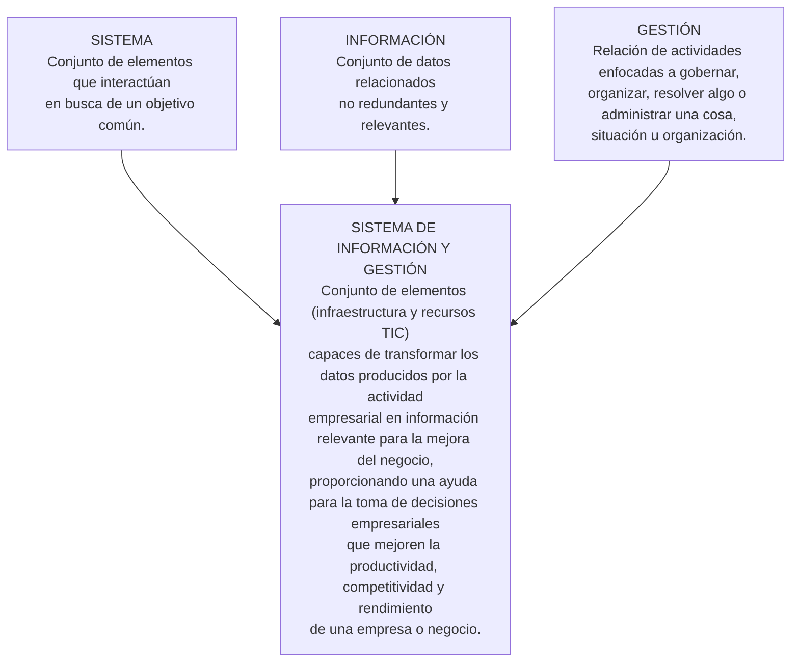
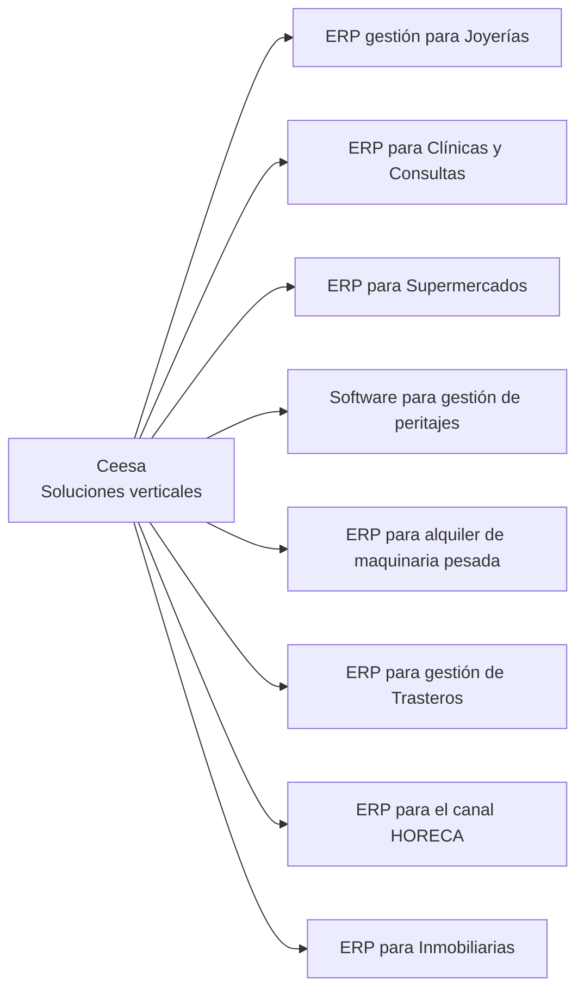
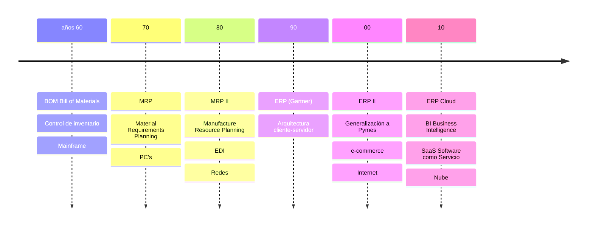
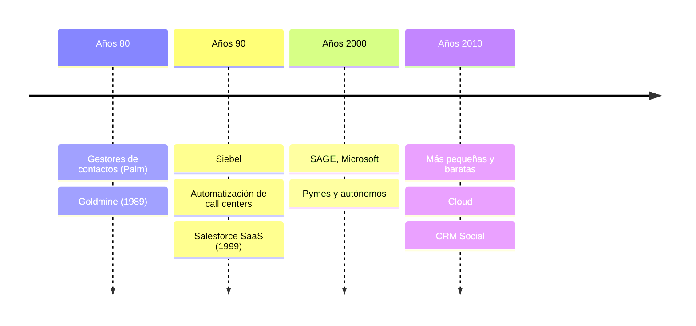
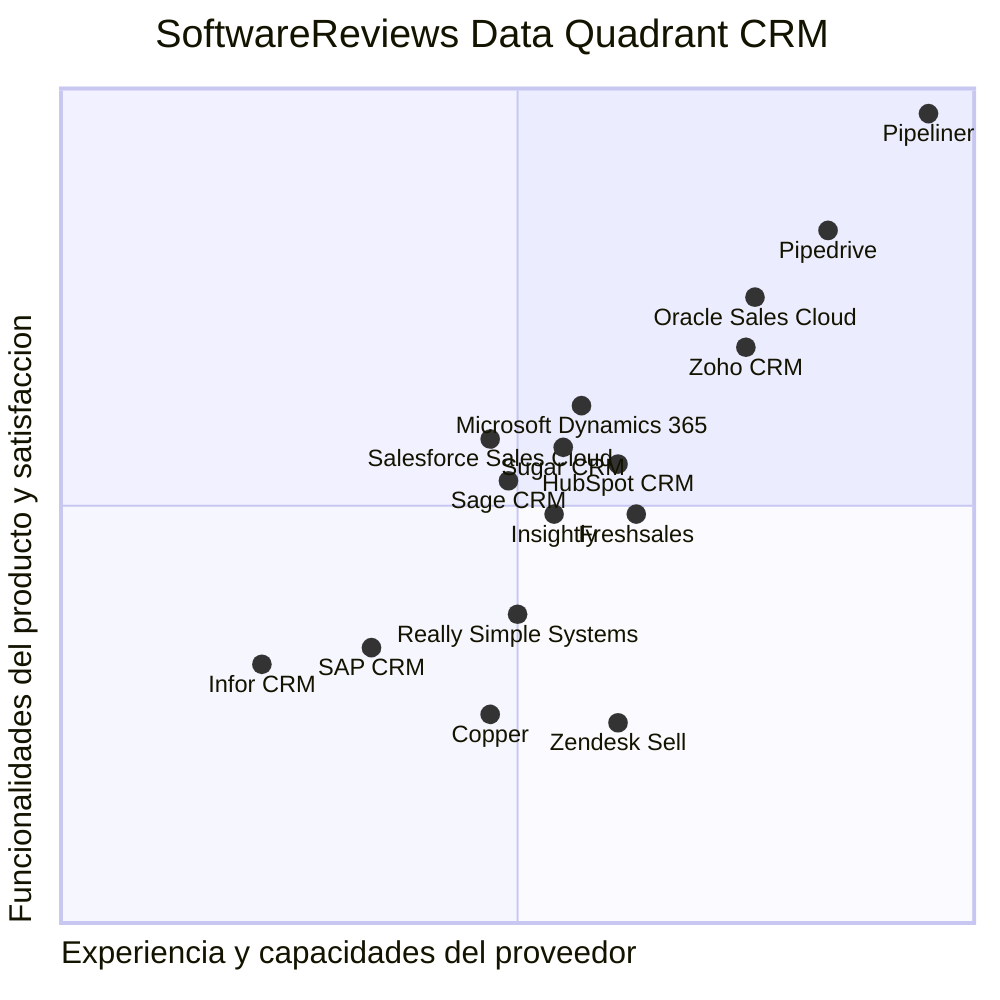
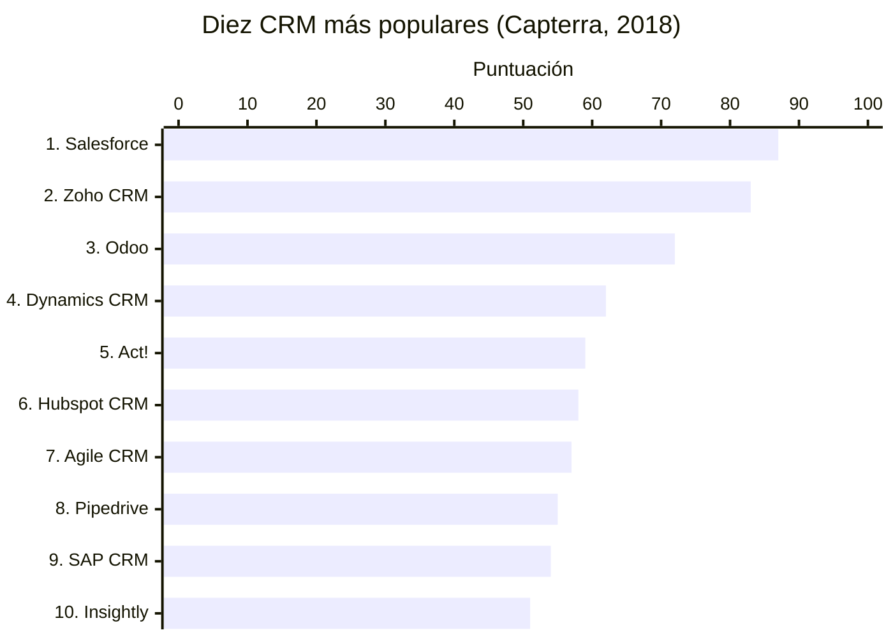

---
tags:
  - sistemas-gestion-empresarial
  - DAM2
unidad: 1
tema: La gestión empresarial, el objetivo de la empresa y sus procesos, datos y flujo de trabajo
---

# Unidad 1. La gestión empresarial

> [!summary] Ideas clave
> - Un programador debe conocer los conceptos básicos de la actividad empresarial que le permitan participar en el desarrollo de sistemas de gestión empresarial, una de las actividades más demandadas en el mercado laboral actual.
> - La finalidad de la gestión empresarial es conseguir que la empresa sea viable mediante una correcta planificación y un control de los aspectos productivos, comerciales, financieros, logísticos, etc., del negocio.
> - La gestión empresarial es el conjunto de acciones y estrategias que persigue el objetivo de mejorar el funcionamiento general de una empresa.
> - Los beneficios son la razón de existencia de la empresa.
> - Los beneficios se consiguen maximizando ventas, minimizando costes, eliminando tareas innecesarias, agilizando los procesos cotidianos, automatizando tareas, optimizando recursos y, en definitiva, controlando con detalle todos los aspectos de la empresa.
> - Las empresas deben ser competitivas, sostenibles y con un alto nivel de cumplimiento.
> - Los procesos de negocio son conjuntos de tareas relacionadas y ordenadas que proporcionan un producto o servicio, interno o externo; en su nivel elemental reciben el nombre de transacciones.
> - Los tres pilares sobre los que se construye una gestión eficiente de la empresa son los procesos de negocio, los datos y el flujo de la información.

> [!info] Alcance de la unidad
> Esta unidad recoge, en el orden del libro, los objetivos, el mapa conceptual y el glosario del capítulo, y los apartados 1.1 y 1.2. Los apartados 1.3, 1.4 y 1.5 se desarrollan en la [[02 - Sistemas de información de gestión|Unidad 2]], la [[03 - Un poco de historia|Unidad 3]] y la [[04 - La fidelización de clientes, concepto de CRM|Unidad 4]].

---

## Objetivos

- Entender la función de la empresa en la sociedad actual y la problemática asociada a su gestión.
- Conocer el concepto de sistema de información y las distintas herramientas informáticas que ayudan a la gestión empresarial.
- Establecer el concepto de MIS (*Management Information System*) [SIG o sistemas de información de gestión o gerencial, en español].
- Estudiar la evolución que los sistemas de información de gestión han experimentado desde los años sesenta del siglo pasado.
- Entender la importancia de la gestión de clientes.
- Reconocer las principales soluciones CRM, tanto comerciales como *Open Source* (de código abierto).

---

## Glosario

> [!note] Definición: Acrónimo
> Conjunto de siglas o partes ordenadas de varias palabras que se lee y pronuncia como una palabra.

> [!warning] Posible incoherencia en el material
> Según esta definición, un acrónimo se pronuncia como una palabra. Sin embargo, a lo largo del capítulo se denominan también acrónimos siglas que se deletrean, como ERP o CRM. Se conserva la definición original.

> [!note] Definición: Cumplimiento (*compliance*)
> Procedimientos que garantizan la observancia de la normativa interna, así como de la legislación actual y los códigos éticos, por parte de directivos, empleados y demás actores relacionados con una empresa.

> [!note] Definición: *DataMining* (minería de datos)
> Conjunto de técnicas y tecnologías orientadas a buscar patrones no evidentes, tendencias y reglas que expliquen el comportamiento de los datos en un contexto determinado en grandes bases de datos.

> [!note] Definición: *DataWarehouse* (almacén de datos)
> Almacén de datos que se caracteriza por contener también los metadatos sobre los propios datos: procedencia, periodicidad de refresco, fiabilidad y cálculos realizados para su obtención.

> [!note] Definición: Flujo de trabajo (*workflow*)
> Automatización regulada de los procesos de la empresa para que la información y las tareas circulen entre los distintos departamentos siguiendo un cierto orden.

> [!note] Definición: KPI (*Key Performance Indicator*)
> Indicadores clave de desempeño. Indicadores que permiten medir magnitudes de interés.

> [!note] Definición: OLAP (*On-Line Analytics Processing*)
> Bases de datos multidimensionales orientadas al procesamiento analítico.

> [!warning] Posible error en el material
> El material desarrolla la sigla como *On-Line Analytics Processing*. La forma habitual es *On-Line Analytical Processing*. Se conserva la forma original.

> [!note] Definición: ROI (*Return On Investment*)
> Retorno de la inversión. Cálculo del tiempo que se necesita para recuperar lo invertido en un sistema con los beneficios generados por él.

> [!warning] Posible error en el material
> La definición del material corresponde al plazo de recuperación de la inversión (*payback*). El ROI suele definirse como la relación entre el beneficio obtenido y la inversión realizada. Se conserva la definición original.

> [!note] Definición: Sistemas de información
> Conjunto de datos convertidos en información mediante procesos y mecanismos automatizados e interrelacionados.

> [!note] Definición: Sostenibilidad
> Búsqueda del equilibrio entre el crecimiento económico y el cuidado del medio ambiente. Cualidad de satisfacer necesidades actuales sin comprometer a generaciones futuras.

> [!note] Definición: Tecnologías de información y comunicación (TIC)
> Conjunto de herramientas *hardware* y *software* utilizadas para el almacenamiento, tratamiento y transmisión de la información.

> [!note] Definición: Transacción
> Todo aquello que modifica o genera datos de un sistema de información.

---

## 1.1. Introducción

A lo largo de la vida profesional de un programador, es altamente probable que participe en proyectos relacionados con los sistemas de información-gestión empresarial, ya sea como desarrollador, como soporte técnico o como usuario.

Por eso, es necesario:

- entender la función de la empresa en la sociedad actual y la problemática asociada a su gestión;
- familiarizarse con los sistemas de información y con las distintas herramientas informáticas que ayudan a la gestión empresarial, aplicando las tecnologías de la información y las comunicaciones (TIC) para el tratamiento y la manipulación de la ingente información que se maneja;
- conocer la evolución que han experimentado estos sistemas desde los años sesenta del siglo pasado.

La vital importancia de conseguir clientes y, sobre todo, de mantenerlos explica la aparición de los sistemas de gestión de las relaciones con clientes, más conocidos por sus siglas en inglés, CRM (*Customer Relationship Management*), que ayudan en el día a día de la fuerza comercial de cualquier empresa o negocio.

> [!info] Alcance
> Los sistemas de información se estudian en la [[02 - Sistemas de información de gestión|Unidad 2]]; su evolución, en la [[03 - Un poco de historia|Unidad 3]], y los CRM, en la [[04 - La fidelización de clientes, concepto de CRM|Unidad 4]].

> [!important] Toma nota
> La finalidad de la gestión empresarial es conseguir que la empresa sea viable mediante una correcta planificación y un control de los aspectos productivos, comerciales, financieros, logísticos, etc., del negocio.

---

## 1.2. La gestión empresarial

> [!note] Definición: Gestión empresarial
> Conjunto de acciones y estrategias que persigue el objetivo de *mejorar el funcionamiento general de una empresa*.

Mediante ellas, el personal responsable procura conseguir:

- el necesario aumento de la productividad;
- la mejora de la competitividad;
- el crecimiento de la rentabilidad de la empresa.

### 1.2.1. Objetivo de la empresa

Con sus recursos humanos, materiales y financieros, la empresa genera los productos y servicios que, debidamente comercializados, producen los *beneficios*, que son la razón de su existencia.

Estos beneficios se obtienen mejorando distintos aspectos de la actividad empresarial. Generalmente, se consiguen:

- maximizando ventas;
- minimizando costes;
- eliminando tareas innecesarias;
- agilizando los procesos cotidianos;
- automatizando tareas;
- optimizando recursos.

Y, en definitiva:

- controlando de manera minuciosa todos los detalles de la empresa.

> [!important] Acción combinada
> La mejor forma de incrementar los beneficios de una empresa es mediante una acción combinada sobre todos los aspectos anteriormente relacionados.

En la actualidad, las empresas no solo deben ser *competitivas*, sino que además deben preocuparse por ser cada vez más *sostenibles* y conseguir un mayor nivel de cumplimiento normativo (*compliance*).

Por otra parte, es sobradamente sabido que la *eficiencia* y la *efectividad* influyen en el diferencial de beneficio.

Por todo ello, en la práctica, hacer crecer los beneficios se convierte en una tarea ardua, que entraña dificultades que dependen de distintos factores.

### 1.2.2. Procesos de negocio, datos y flujo de trabajo

La actividad de una empresa está basada en los llamados *procesos de negocio*.

> [!note] Definición: Proceso de negocio
> Conjunto de tareas relacionadas y ordenadas que proporcionan un producto o servicio, ya sea interno (para otro departamento de la propia empresa) o externo (para el cliente final).

A menudo, los procesos son *secuenciales*, de tal manera que la salida obtenida de un proceso es el inicio de otro proceso.

Los procesos empresariales pueden descomponerse en otros procesos de menor entidad hasta llegar al nivel que se considere elemental, momento en el que reciben el nombre de *transacciones*.

Por otra parte, los *datos* que se manejan en el desempeño diario de la actividad principal de una empresa son de un volumen considerable. A lo largo de su existencia, las empresas van acumulando datos obtenidos por los distintos departamentos que las componen:

- los proporcionados por las distintas máquinas empleadas en los procesos de fabricación, si los hubiere;
- los detalles de las transacciones que se realizan en el día a día;
- los datos de contacto con el exterior;
- el histórico de las relaciones con proveedores y clientes;
- la relación de recursos materiales y humanos internos;
- el control del almacén;
- los datos económicos;
- la publicidad y el *marketing*;
- la presencia en la web y en las redes sociales, etc.

Estos datos se pueden y se deben convertir en información vital.

> [!important] Aspectos primordiales
> El manejo de estos datos y, sobre todo, su tratamiento para la extracción de información relevante, así como la relación entre los distintos departamentos y el intercambio de informaciones entre ellos de forma ordenada y eficiente (flujo del trabajo), son aspectos primordiales para mejorar el funcionamiento de la empresa e incrementar así el beneficio.

---
# Unidad 2. Sistemas de información de gestión

> [!summary] Ideas clave
> - Las TIC han proporcionado herramientas cada vez más sofisticadas para la gestión empresarial.
> - Un sistema de información no es solo el conjunto de recursos tecnológicos que lo soporta, sino también la organización de esos recursos y los métodos de obtención de la información necesaria.
> - Un sistema de información empresarial (SIE) o sistema de información gerencial (SIG) es un conjunto de aplicaciones que proporcionan una gestión automatizada del negocio en sentido amplio.
> - Los sistemas de gestión empresarial, en sus numerosas variedades, han contribuido al éxito de los negocios.
> - Existe infinidad de acrónimos relacionados con herramientas de gestión empresarial.
> - Aunque a veces se solapan algunos, los sistemas de información pueden categorizarse en TPS, BPM, MIS, ERP, DSS, EIS y cuadro de mando integral (BSC).
> - Se llaman «soluciones verticales» a las específicamente desarrolladas para un tipo de negocio o mercado en particular.

> [!info] Alcance de la unidad
> Esta unidad desarrolla el apartado 1.3 del capítulo. Los términos *DataMining*, *DataWarehouse*, KPI, OLAP y sistemas de información están definidos en el glosario de la [[01-gestion-empresarial#Glosario|Unidad 1]].

---

## 1.3. Sistemas de información de gestión

Una gran variedad de sistemas de información, como la mensajería, los sistemas bancarios, la venta en línea, las bibliotecas de recursos académicos o los sistemas de concertación de citas, son utilizados a diario, de forma casi inconsciente, por un considerable y creciente número de usuarios cada vez más inmersos en el mundo digital.

Como en tantos otros ámbitos, la utilización de las TIC y, en particular, el desarrollo de soluciones tecnológicas:

- para la revisión de los procesos;
- para el control del flujo de trabajo (*workflow*);
- y, sobre todo, para el tratamiento centralizado de todos los datos generados por los distintos departamentos,

ha supuesto un paso fundamental en la gestión de negocios: ha significado la aparición de los *sistemas de información de gestión empresarial*, conjunto de herramientas muy útiles sin las que hoy día sería imposible sobrevivir como negocio.

Se trata de sistemas de información orientados a resolver problemas empresariales.

Suponen la aplicación de soluciones basadas en las TIC a los requerimientos específicos de los negocios. Es decir, están enfocados al negocio y, por tanto, se dicen *empresariales* o *gerenciales*, y sustentan el gobierno de las organizaciones y empresas.

> [!important] Ten en cuenta
> Un sistema de información no es solo el conjunto de recursos tecnológicos que lo soporta, sino también la organización de esos recursos y los métodos de obtención de la información necesaria para el correcto funcionamiento del sistema.

> [!note] Definición: Sistema de información empresarial (SIE) o sistema de información gerencial (SIG)
> Conjunto de aplicaciones que acometen las necesidades de tratamiento simultáneo de la información necesaria para el funcionamiento de la empresa por parte de un grupo de usuarios, y que proporcionan así una gestión automatizada del negocio en sentido amplio.

No se trata solo de aprovechar las aplicaciones de escritorio y de productividad personal, como procesadores de texto, hojas de cálculo y bases de datos más o menos compartidas, sino de desarrollar plataformas de uso simultáneo y común que incluyan los módulos específicos que sostienen todos los aspectos de las necesidades de administración de una empresa.

**Figura 1.1. Definición de SIG como composición de conceptos.**

### 1.3.1. La sopa de letras: MIS, SIG, SIE…

El sector tecnológico utiliza su propia jerga y, intentando simplificar, abusa con frecuencia de la utilización de abreviaturas y acrónimos.

Al intentar entender el entorno, es fácil encontrarse con una primera dificultad: la abrumadora existencia de acrónimos, normalmente en inglés, con su consiguiente adaptación o traducción directa al español, de conceptos que tienen que ver con alguna fase de los procesos empresariales.

> [!tip] Recomendación
> Es recomendable entender bien lo que el autor consultado expresa con esas siglas, que utilizará a lo largo de su escrito.

A veces se utilizan las siglas MIS (*Management Information System*) para referirse, en general, a estos sistemas de información relacionados con la administración de empresas.

Académicamente, se puede convenir que engloban las distintas herramientas informáticas enfocadas a proporcionar, mediante el tratamiento de datos generados en una actividad empresarial, todo tipo de procesos automatizados, informes, controles, sistemas de aviso, análisis de resultados, etc., de los distintos estamentos de una empresa.

> [!warning] Definiciones y herramientas comerciales
> En la práctica, las herramientas comercializadas no se corresponden estrictamente con las definiciones, y a veces los departamentos de *marketing* de los desarrolladores de *software* empresarial las utilizan en sentido laxo.

> [!note] Definición: MIS (*Management Information System*)
> Sistemas de información que se alimentan de los datos proporcionados por los distintos procesos propios de la actividad de la empresa, los procesan mediante diversos tratamientos y elaboran información «cocinada», como estadísticas, informes, gráficos, simulaciones, tendencias, etc., que reflejan el funcionamiento corporativo de la organización.

> [!important] Toma nota: Acrónimos
> En la actualidad es posible encontrar distintos tipos de sistemas de información aplicados a la gestión empresarial en alguno de sus procedimientos, tales como los de la tabla siguiente.

| Sigla | Denominación en inglés | Traducción |
|---|---|---|
| TPS | *Transaction Processing System* | Sistema de procesamiento de transacciones |
| OAS | *Office Automation System* | Sistema de automatización de oficinas |
| MRP | *Material Requirements Planning* | Planificación de los requisitos de material |
| MRPII | *Manufacture Resource Planning* | Planificación de los recursos de fabricación |
| PLM | *Product Lifecycle Management* | Gestión del ciclo de vida de productos |
| SCM | *Supply Chain Management* | Gestión de la cadena de suministro |
| SRM | *Supplier Relationship Management* | Gestión de la relación con proveedores |
| MIS | *Management Information System* | Sistema de información de gestión (SIG) |
| BPM | *Business Process Management* | Administración de procesos de negocio |
| ERP | *Enterprise Resource Planning* | Planificación de recursos empresariales |
| CRM | *Customer Relationship Management* | Gestión de la relación con los clientes |
| POS | *Point Of Sale* | Terminal punto de venta (TPV) |
| CMS | *Content Management System* | Sistema de gestión de contenidos |
| DMS | *Document Management System* | Sistema de gestión documental |
| KMS | *Knowledge Management System* | Sistema de gestión del conocimiento |
| BI | *Business Intelligence* | Inteligencia de negocio |
| DSS | *Decision Support System* | Sistema de apoyo a la toma de decisiones |
| EIS | *Executive Information System* | Sistema de información ejecutiva |
| BSC | *Balanced Score Card* | Cuadro de mando integral |
| GIS | *Geographical Information System* | Sistema de información geográfica |
| Blog | *Weblog* | Bitácora |

> [!warning] Posible error en el material: MRPII
> La tabla desarrolla MRPII como *Manufacture Resource Planning*, pero el apartado 1.4 del propio libro usa *Manufacturing Resource Planning*, que es la forma habitual. Se conserva la forma original en la tabla.

> [!warning] Posible error en el material: BSC
> La tabla escribe *Balanced Score Card*, mientras que el apartado 1.3.2 del propio libro usa *Balanced Scorecard*, que es la forma habitual. Se conserva la forma original en la tabla.

En castellano, se habla de sistemas de información gerencial (SIG) o incluso de sistemas de inteligencia empresarial (SIE). Quizá los matices que los diferencian serían objeto de un estudio más avanzado.

> [!warning] Posible incoherencia en el material: SIE
> Al comienzo del apartado 1.3, SIE se desarrolla como «sistema de información empresarial», y aquí como «sistemas de inteligencia empresarial». Se conservan ambas formas.

### 1.3.2. Una clasificación de los sistemas de gestión empresarial

Es fácil encontrar diferentes clasificaciones de los sistemas de información empresarial. Para verlo en perspectiva respecto a las áreas que cubren, se podría considerar la siguiente clasificación general de los sistemas de información empresarial más destacados, empezando desde su nivel inferior.

#### A) Sistemas de procesamiento de transacciones (TPS)

Son el nivel operacional más bajo. Soportan la rutina diaria del negocio (transacciones comerciales, económicas, existencias, etc.), pero son muy importantes desde el punto de vista de la consistencia y la integridad de estas. Constituyen la base que utilizarán los sistemas de capa superior.

#### B) Sistemas de gestión por procesos de negocio (BPM)

Gestionan los *procesos* de la organización, es decir, las acciones que deben realizar personas y máquinas de forma ordenada para lograr un determinado objetivo y, en particular, los procesos físicos de producción, generalmente mediante la monitorización de sensores electrónicos.

#### C) Sistemas de información de gestión (MIS)

Como ya se ha comentado, recogen información de diferentes fuentes internas y la procesan para proporcionar informes, estadísticas y proyecciones a futuro que ayuden a la gerencia a tener una visión fidedigna de la situación de una parte de la empresa.

#### D) Sistemas de colaboración empresarial (ERP)

Es un MIS integrado. Son sistemas *integrales* de información que, en una única base de datos, recogen, procesan y analizan datos de todos los estamentos de la organización empresarial. Proporcionan así información relevante sobre procesos de producción, ventas, logística, recursos humanos, gestión de proyectos, contabilidad y finanzas de la empresa, con el fin de mejorar la gestión empresarial.

Son utilizados por una amplia gama de usuarios que tienen acceso autorizado a la información en función del trabajo que desempeñan.

> [!warning] Posible incoherencia en el material: denominación del ERP
> Este apartado titula los ERP como «sistemas de colaboración empresarial», mientras que la tabla de acrónimos traduce ERP (*Enterprise Resource Planning*) como «planificación de recursos empresariales». Se conservan ambas denominaciones.

#### E) Sistemas de apoyo a la toma de decisiones (DSS)

Son sistemas interactivos basados en la combinación de los datos para su análisis, que proporcionan un paso más: información organizacional y funciones de *simulación y modelado* que podrá utilizar el responsable para seleccionar la mejor opción entre varios escenarios.

Es un tipo especial de inteligencia de negocio (BI) que almacena información interna y que, mediante OLAP, *DataWarehouse* y *DataMining*, facilita la toma de decisiones mediante simulaciones, análisis estadísticos y estudios de tendencia.

> [!example] Ejemplos de decisiones apoyadas por un DSS
> Gestión de tráfico, aprobación de créditos y diagnósticos médicos.

#### F) Sistemas de información ejecutiva (EIS)

Proporcionan, generalmente en formato gráfico e intuitivo, acceso con distintos niveles de detalle a la información interna y también a la proporcionada por *fuentes externas*. Ayudan en la *toma de decisiones estratégicas* que afectan a toda la organización mediante la elaboración de informes, consultas y listados de las distintas áreas de la empresa de forma consolidada.

#### G) Cuadro de mando integral (BSC)

El BSC, *Balanced Scorecard* o *Dashboard* (cuadro de mando), es la herramienta de control que monitoriza el grado de consecución de los objetivos de los distintos departamentos o áreas de negocio de una empresa.

Lo hace mediante el establecimiento de *indicadores*, conocidos como KPI (*Key Performance Indicators*), organizados normalmente en cuatro tipos:

- financiero;
- conocimiento del cliente;
- procesos internos;
- aprendizaje y crecimiento.

Están más orientados a la monitorización de indicadores que al análisis meticuloso de la información.

> [!warning] Posible incoherencia en el material: BSC y *dashboard*
> El material equipara *Balanced Scorecard* y *Dashboard*, pero su propia traducción los distingue: «cuadro de mando integral» frente a «cuadro de mando». Se conserva el texto original.

> [!info] Para saber más
> Se podrían considerar otros sistemas, tales como los sistemas expertos basados en la inteligencia artificial (IA) o los sistemas de ayuda a decisiones de grupo (GDSS).

### 1.3.3. Los mercados verticales

En un campo tan heterogéneo como la actividad empresarial, existen también las llamadas *soluciones verticales*.

> [!note] Definición: Soluciones verticales
> Soluciones específicamente desarrolladas para un tipo de negocio o mercado en particular.

A diferencia del *software* horizontal, generalista, y sin llegar a ser un *software* a medida, suelen constituir la solución para sectores específicos, como pueden ser el agrícola, el inmobiliario, el industrial, los despachos profesionales, etc.

Son productos normalmente desarrollados a partir de la experiencia en el sector, y en ocasiones participan asociaciones sectoriales en su elaboración, por lo que incluyen las mejores prácticas y los indicadores propios del negocio.

**Figura 1.2. Página web de un proveedor de soluciones verticales: Ceesa.**

---
# Unidad 3. Un poco de historia

> [!summary] Ideas clave
> - Al comparar estudios históricos pueden advertirse diferencias de décadas, debidas al desfase entre la expansión de los desarrollos tecnológicos en EE. UU. y su aparición en Europa y en España.
> - En los años sesenta se establecieron, heredados de los sistemas militares, los conceptos de gestión automatizada; aplicaciones como BOM o IMC se adaptaron al mundo empresarial.
> - Los MRP, basados en el BOM, calculaban el material necesario, lo comparaban con el almacén y determinaban cuándo abastecerse.
> - Los MRP II integraron los MRP con componentes financieros.
> - Los ERP aparecieron en los noventa sobre arquitecturas cliente-servidor, con una fuente de información centralizada común a todos.
> - En los 2000 aparecieron el SCM, el ERP II, el CRM y el PLM, y el uso de los ERP se universalizó.
> - Desde 2010, el *Cloud Computing* y el SaaS permiten disponer de toda la gestión empresarial con un dispositivo y un navegador.
> - La evolución experimentada desde los años sesenta ha llevado a estos sistemas a jugar un rol estratégico en la gestión de empresas.

> [!info] Alcance de la unidad
> Esta unidad desarrolla el apartado 1.4 del capítulo. Los sistemas citados (MRP, ERP, SCM, CRM, BI, DSS, EIS…) se definen en la [[02 - Sistemas de información de gestión|Unidad 2]], y el CRM se estudia en la [[04 - La fidelización de clientes, concepto de CRM|Unidad 4]].

---

## 1.4. Un poco de historia

A menudo, al comparar estudios históricos, se pueden advertir diferencias de décadas según el autor y las fuentes utilizadas. Eso se debe, normalmente, al desfase que solía y suele producirse entre la expansión de los desarrollos tecnológicos en EE. UU. y su aparición y despliegue en Europa y, en particular, en España.

A mediados del siglo pasado, las empresas utilizaban procesos de gestión manuales y poco automatizados.

Heredados de los sistemas militares, en la década de los sesenta se establecieron los conceptos de gestión automatizada y se empezaron a utilizar las herramientas de planificación en el ámbito comercial. Aplicaciones básicas como los gestores de listas de materiales, BOM (*Bill of Materials*), o IMC (*Inventory Management Control*, control de gestión de inventario) fueron adaptadas desde el mundo militar al empresarial.

En esta época se fundan numerosas empresas dedicadas al desarrollo de *software* que, en una versión básica, se incluía con la venta del *hardware*. Los distintos departamentos empezaron a utilizar un *software* específico para desarrollar sus funciones dentro de la empresa.

Además de la ya mencionada, las primeras áreas funcionales del negocio informatizadas fueron la de contabilidad, la financiera y la de almacén.

**Figura 1.3. Evolución temporal de los sistemas de información empresarial.**

> [!warning] Posible incoherencia en el material: los PC en los años setenta
> La figura 1.3 sitúa los PC en los años setenta, pero el texto de este mismo apartado sitúa la aparición de las primeras computadoras personales (IBM PC) en los años ochenta. Se conserva la figura original.

> [!warning] Posible error en el material: MRP II en la figura
> La figura 1.3 desarrolla MRP II como *Manufacture Resource Planning*, mientras que el texto usa *Manufacturing Resource Planning*, que es la forma habitual. Se conserva la forma original en la figura.

A finales de esta década y principios de los setenta aparecieron los primeros sistemas de planificación de la producción o planificación de las necesidades materiales, MRP (*Material Requirement Planning*). Era *software* que se ejecutaba en *mainframes*, sistemas propietarios tipo IBM S36, u ordenadores «mini» tipo DEC (*Digital Equipment Corporation*) con sistema operativo VAX/VMS…, naciendo un mercado dominado por IBM. El primero de los MRP se atribuye a la empresa alemana Bosch unos años antes.

> [!warning] Posible error en el material: equipos citados
> El IBM System/36 se anunció en 1983, y el VAX-11/780, con su sistema operativo VMS, se presentó en 1977. Ambos son posteriores a la época que describe el texto (finales de los sesenta y principios de los setenta). Se conserva el texto original.

> [!warning] Posible discrepancia con otras fuentes: el primer MRP
> El material atribuye el primer MRP a Bosch. Otras fuentes lo atribuyen a Black & Decker, en 1964. Se conserva el texto original.

Los MRP, basados en el BOM, utilizaban los ordenadores para resolver el mayor problema con el que se encontraban las empresas con procesos de fabricación en etapas:

1. calcular el material que se necesita;
2. compararlo con lo que se tenía en el almacén;
3. obtener así cuándo se debía abastecer.

Posteriormente, en los años ochenta, la revolución de la microinformática, con la aparición de las primeras computadoras personales (IBM PC), provocó que más empresas de menor tamaño empezaran a utilizarlas para administrar su negocio.

Los MRP evolucionaron a los MRP II, siglas que ahora se correspondían con *Manufacturing Resource Planning*, y que incluían también la gestión de los costes de la materia prima, de la mano de obra, los logísticos, etc. Es decir, integraron los MRP con componentes financieros.

A partir de entonces se empezaron a utilizar sistemas informáticos para mecanizar las tareas de algunos departamentos de forma independiente:

- se instalaba un sistema de contabilidad;
- a veces, un programa de facturación que complementaba al contable;
- después se añadía un programa de nóminas;
- casi siempre, alguno específico aplicado al proceso de fabricación o de la prestación de servicios realizada.

Así hasta que se empezó a buscar la integración de los distintos sistemas y a constatar la necesidad de conectar los PC, apareciendo la estructura cliente-servidor.

Los fabricantes de *software* empezaron entonces a proporcionar aplicaciones que permitían a varios usuarios acceder a los datos de forma simultánea. Así aparecieron los ERP en la década de los noventa, añadiendo:

- la gestión de la fabricación;
- la gestión de las relaciones con proveedores y clientes;
- la gestión de los recursos;
- de forma incipiente, la inteligencia de negocio.

> [!important] La idea base del ERP
> La idea base consistió en utilizar una *fuente de información centralizada* común a todos. De esa manera, los datos se introducían una sola vez en el sistema y estaban disponibles para el resto de los integrantes de la organización: una única base de datos y la posibilidad de extraer, de forma regulada, la información contenida en función de las necesidades y privilegios de cada usuario.

Fue durante esta era cuando los primeros sistemas de planificación de recursos empresariales, ERP (*Enterprise Resource Planning*), se desarrollaron y ejecutaron en arquitecturas cliente-servidor.

> [!note] Definición: Sistema ERP
> Una aplicación de *software* estructurada en módulos que se complementan y que utilizan una base de datos centralizada, y que se puede utilizar para gestionar todo el negocio de una empresa.

Se trataba de organizar el trabajo mediante una planificación previa de las necesidades de recursos, el control del consumo de los mismos y la gestión por procesos. Durante mucho tiempo, y enfocado a grandes empresas, fue un mercado liderado por la alemana SAP.

> [!info] Sabías que…
> Los 2000 son la década de la expansión del comercio electrónico (*e-commerce*), es decir, la comercialización de productos y servicios utilizando únicamente las TIC en un espacio digital sin un contacto físico, ya sea entre empresas (B2B, *Business to Business*) o al cliente final (B2C, *Business to Customer*).

> [!warning] Posible error en el material: B2C
> El material desarrolla B2C como *Business to Customer*. La forma habitual es *Business to Consumer*. Se conserva la forma original.

La evolución empresarial en la década de los 2000 hacia la externalización de las operaciones en las que la empresa no está especializada provoca la necesidad de coordinación con el exterior. Aparece así el concepto de sistemas de gestión de la cadena de suministro, o SCM (*Supply Chain Management*), es decir, la gestión del intercambio de información electrónica (EDI, *Electronic Data Interchange*) entre los sistemas de gestión, generalmente distintos, de las empresas y sus proveedores. En consecuencia, aparece también el ERP II, que añade estas funcionalidades al ERP clásico.

Aparecen conceptos como:

- CRM (*Customer Relationship Management*), para administrar las relaciones con los clientes;
- PLM (*Product Lifecycle Management*), que proporciona la gestión de la información técnica del producto fabricado a lo largo de todo su ciclo de vida.

Por otra parte, la explosión de las TIC y su adopción cada vez más generalizada por parte de las pequeñas empresas universaliza la utilización de los ERP, y aparecen soluciones adaptadas a cualquier tamaño de organización.

A partir de la década de 2010, la aparición de conceptos como el *Cloud Computing* (computación en la nube) y el SaaS (*Software as a Service*, *software* como servicio) permite una explosión de crecimiento, pues basta un dispositivo y un navegador para disponer de todas las funcionalidades relativas a la gestión empresarial que se desee, independientemente del tamaño de la empresa.

> [!important] Rol estratégico actual
> Actualmente, y englobados de nuevo bajo el nombre de ERP, todos estos sistemas han pasado de tener una función meramente operativa a jugar un rol estratégico como sistemas de ayuda a la gerencia de las empresas y soporte fundamental para la toma de decisiones, tanto operativas como estratégicas, dando paso a la aparición de los conceptos de BI, DSS y EIS.

---
# Unidad 4. La fidelización de clientes. Concepto de CRM

> [!summary] Ideas clave
> - Conseguir clientes y, sobre todo, mantenerlos es un objetivo fundamental de la gestión empresarial.
> - Mantener un cliente a lo largo de su vida útil es siempre mucho menos costoso que conseguir nuevos.
> - La vital importancia de conseguir clientes y, sobre todo, de mantenerlos explica la aparición de los sistemas de gestión de las relaciones con clientes (CRM).
> - Un CRM es una herramienta de seguimiento, de comunicación y de análisis.
> - Hay una solución para cada negocio, independientemente del tamaño y de su actividad; solo hay que encontrar la que asegura el retorno de la inversión (ROI) apropiado.
> - La diferenciación entre soluciones *Open Source*, semigratuitas y comerciales se ha ido reduciendo en los últimos años.
> - Con un CRM se vende más y mejor.

> [!info] Alcance de la unidad
> Esta unidad desarrolla el apartado 1.5 del capítulo. La definición de ROI está en el glosario de la [[01-gestion-empresarial#Glosario|Unidad 1]], y la aparición del CRM en los años 2000, en la [[03 - Un poco de historia|Unidad 3]].

---

## 1.5. La fidelización de clientes. Concepto de CRM

Conseguir clientes y, lo que a la postre se convierte en más importante, mantenerlos es un objetivo fundamental de la gestión empresarial.

> [!note] Definición: Fidelizar
> Conseguir una venta recurrente en el tiempo, es decir, aplicar estrategias para que el cliente se convierta en habitual.

> [!important] Importancia de la fidelización
> La importancia de la fidelización estriba en que mantener un cliente a lo largo de su vida útil es siempre mucho menos costoso que conseguir nuevos.

Pero los clientes se han vuelto más exigentes y la oferta se ha globalizado, por lo que es importante conocer sus necesidades y aspirar a satisfacerlas incluso antes de que el cliente sepa de su necesidad.

Por eso, las empresas han evolucionado hacia un planteamiento basado en el cliente y no en el producto, que era el enfoque habitual del siglo pasado.

La visión del comercial con su cartera de clientes y libretas de pedido y, todo lo más, una hoja de cálculo en el caso más informatizado, ha dado paso a otra visión más moderna, englobada en la denominada *automatización de la fuerza de venta*. Esta se basa en la utilización de sistemas apoyados en la movilidad y en el acceso desde cualquier dispositivo, que gestionan todo tipo de interacciones con el cliente con el objetivo de mejorar las relaciones comerciales con él.

> [!note] Definición: Sistema de gestión de las relaciones con el cliente (CRM, *Customer Relationship Management*)
> *Software* colaborativo basado en la orientación al cliente que registra toda su información de contacto, pero también, y lo que es más importante, almacena las transacciones de todo tipo mantenidas con él, de tal manera que proporciona una visión global de un ecosistema al que pertenecen los productos, los servicios, los clientes actuales y potenciales y los recursos de la empresa.

Los CRM engloban y centralizan las bases de datos de las interacciones que se tienen con los clientes. Esta centralización de información, accesible en mayor o menor medida por el personal de la empresa en función de sus privilegios, proporciona un conocimiento profundo del cliente y permite establecer fácilmente y de forma personalizada las estrategias comerciales, de *marketing* y de servicio al cliente que proporcionarán, en definitiva, su fidelización.

Puede decirse que son la evolución inteligente de las hojas de cálculo que gerentes, comerciales y muchos profesionales en general suelen utilizar al comenzar su actividad.

> [!info] Figura 1.4. Pantalla de GoldMine, uno de los primeros CRM
> La figura muestra la ficha de un contacto en GoldMine (interfaz en inglés), con sus datos de contacto y empresa, las actividades pendientes y el histórico de interacciones.

### 1.5.1. Funcionalidades de un CRM

Un CRM es una herramienta de implementación, normalmente sencilla, dirigida en especial a los departamentos comerciales y de *marketing* de las empresas, aunque no únicamente a ellos, que maneja:

- la gestión de datos de clientes;
- las oportunidades de venta;
- los presupuestos;
- los ingresos por ventas;
- las campañas publicitarias y de *marketing*.

Las principales funcionalidades de un CRM, sin pretender ser exhaustivos, son las siguientes:

- Recopila y organiza toda la información de contacto de los clientes.
- Permite múltiples clasificaciones de estos: actuales y potenciales y, dentro de cada categoría, clasificaciones por cualquier aspecto (localización, tamaño, sector, etc.).
- Gestiona oportunidades de venta desde el inicio.
- Dispone de plantillas personalizables de *mail* y de casi cualquier tipo de documento relacionado con el proceso de venta, como presupuestos u órdenes de compra.
- Realiza el seguimiento de las operaciones y del personal de ventas involucrado.
- Dispone de calendario y sistema de avisos para los usuarios.
- Calcula previsiones, obtiene estadísticas y elabora informes.
- Permite personalizar el trato en el servicio de atención al cliente.
- Automatiza el *marketing*.

**Figura 1.5. Evolución del *software* de CRM.**

> [!important] Las tres facetas del CRM
> Un CRM es una herramienta de seguimiento, de comunicación y de análisis.

**Seguimiento.** Un CRM permite hacer un seguimiento automatizado de las oportunidades de venta desde la fase de obtención de datos, proporcionando normalmente:

- sistemas de captura automatizada desde ficheros de estructura simple, como «.csv»;
- campos especiales, como fechas de contacto o de marcado de hitos;
- campos para notas amplias;
- histórico de operaciones y comunicaciones;
- recordatorios y avisos;
- archivos adjuntados en las comunicaciones.

**Comunicación.** Usándolo como herramienta básica de comunicación, permite controlar las «conversaciones» en el tiempo, disponer de plantillas de respuesta o de primer contacto tipo y utilizarlo en muchos casos como plataforma de *e-mailing*.

**Análisis.** Y, por supuesto, proporciona información analítica mediante estadísticas e informes por cliente, por tipo de propuesta, por estimación de ventas, etc.

> [!tip] Recuerda
> Estudiar la tasa de retención de clientes, la cantidad de nuevos clientes referenciados por clientes actuales, la evolución del gasto de cada cliente y el factor de reiteración de las compras, entre otras cosas, permitirá ponderar los beneficios que se están obteniendo después de implementar un CRM, lo que proporcionará el ROI de su implementación.

### 1.5.2. ¿Solo para grandes empresas?

Independientemente de su tamaño y del número de clientes que tenga una empresa, esta debe preocuparse de gestionar sus relaciones con ellos de la mejor forma.

Los gestores actuales ya no tienen la idea preconcebida, vigente hasta hace relativamente poco tiempo, de que los CRM son herramientas complicadas y costosas y que, por tanto, solo las grandes empresas podrían sacarles partido.

Existe en el mercado actual una gran variedad de sistemas CRM para todo tipo de empresas. Un CRM no solo proporciona valor añadido a organizaciones grandes, sino que las pymes y los autónomos también pueden beneficiarse de la automatización de la gestión con sus clientes.

> [!important] Una solución para cada negocio
> Hay una solución para cada negocio, y lo importante es saber calcular el retorno de la inversión (ROI) para encontrar la apropiada al tamaño y a la actividad de la empresa.

Existen incluso soluciones monousuario.

> [!info] Figura 1.6. Captura de pantalla de ACT!, otro CRM con historia
> La figura muestra la vista de contactos de ACT! (interfaz en inglés), con el listado de contactos, la ficha personal de uno de ellos y sus datos de contacto.

### 1.5.3. Principales fabricantes

La diferenciación entre soluciones *Open Source*, semigratuitas y comerciales se ha ido reduciendo en los últimos años. Varias de las aplicaciones que en sus inicios tuvieron licencia *Open Source* han evolucionado:

- hacia una oferta mixta, con versiones sin coste hasta un cierto número de usuarios o que incluyen un número limitado de funcionalidades;
- o, algunas, como OpenBravo, directamente se han convertido en versiones totalmente comerciales.

Las grandes compañías fabricantes de *software* empresarial, como Microsoft, Oracle, Salesforce o SAP, proporcionan soluciones CRM de forma independiente o como parte integrante de sistemas ERP, sobre los que se trabajará en el próximo capítulo.

De entre las que siguen siendo *Open Source*, aunque la comunidad que las desarrolló puede haber abandonado el mantenimiento y encontrarse en la actualidad bajo el control de empresas que además proporcionan servicios con coste, se pueden mencionar las siguientes:

- SuiteCRM;
- vTiger CRM;
- OroCRM;
- Zurmo.

En la figura 1.7 se muestra un cuadrante de aplicaciones CRM de implantación en el mercado europeo y español. No obstante, se realizará un estudio semejante en el próximo capítulo, cuando se estudien los ERP, pues sus resultados son totalmente aplicables a los CRM.

**Figura 1.7. Cuadrante Mágico CRM. Fuente: SoftwareReviews.**

> [!info] Lectura del diagrama
> Las posiciones de los productos son aproximadas, medidas sobre la imagen del libro. El eje vertical representa las funcionalidades del producto y la satisfacción (*product features and satisfaction*), y el horizontal, la experiencia y las capacidades del proveedor (*vendor experience and capabilities*).

> [!warning] Posible incoherencia en el material: nombre de la figura
> El pie de la figura 1.7 la denomina «Cuadrante Mágico», que es el nombre del informe de Gartner (*Magic Quadrant*). La imagen corresponde al *Data Quadrant* de SoftwareReviews, que es la fuente citada. Se conserva el pie original.

> [!info] Recurso web: información sobre *software* empresarial
> - SoftwareReviews: https://www.softwarereviews.com
> - Capterra: http://www.capterra.com
> - Technology Evaluation Centers (TEC): https://www3.technologyevaluation.com

La variedad de soluciones es considerable. Sería imposible relacionar los innumerables fabricantes que ofrecen soluciones CRM.

Capterra es una compañía que forma parte de Gartner y que, situada en una posición intermedia entre compradores y proveedores, proporciona una de las mayores fuentes de información y de opiniones verificadas sobre *software*.

Según un informe elaborado por esta empresa en 2018, que recoge, entre otros, datos relativos a clientes y usuarios, las diez marcas más populares son las de la figura 1.8.

**Figura 1.8. Resumen del informe de Capterra.**

> [!info] Datos de la figura
> Las puntuaciones son las que aparecen junto a cada marca en la figura. Las cifras de detalle de cada marca (clientes, usuarios, reseñas, «me gusta» y seguidores) no son legibles en la imagen del libro y no se reproducen.

---
## Bibliografía
- *Sistemas de gestión empresarial*, capítulo 1, «Introducción a los sistemas de gestión empresarial»: objetivos, mapa conceptual, glosario y apartados 1.1 y 1.2, págs. 13–17 (libro de texto de la asignatura).
-  *Sistemas de gestión empresarial*, capítulo 1, «Introducción a los sistemas de gestión empresarial», apartado 1.3 y figuras 1.1 y 1.2, págs. 17–21 (libro de texto de la asignatura).
- *Sistemas de gestión empresarial*, capítulo 1, «Introducción a los sistemas de gestión empresarial», apartado 1.4 y figura 1.3, págs. 22–24 (libro de texto de la asignatura).
- *Sistemas de gestión empresarial*, capítulo 1, «Introducción a los sistemas de gestión empresarial», apartado 1.5 y figuras 1.4 a 1.8, págs. 24–29 (libro de texto de la asignatura).

